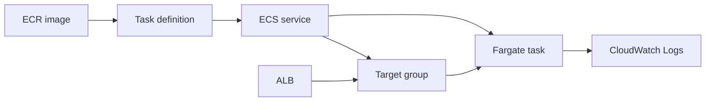

## Table of Contents

1. [The Problem](#the-problem)
2. [What Is ECS](#what-is-ecs)
3. [Task Definitions](#task-definitions)
4. [Tasks](#tasks)
5. [Services](#services)
6. [Fargate](#fargate)
7. [Networking](#networking)
8. [Roles And Logs](#roles-and-logs)
9. [Sample Service Shape](#sample-service-shape)
10. [Putting It All Together](#putting-it-all-together)
11. [What's Next](#whats-next)

## The Problem

A team has a working container image. It starts on a laptop, listens on port `3000`, and passes the smoke test. The image is pushed to Amazon ECR, so it feels ready for AWS.

Then the useful questions start:

- How many copies of this container should run, and what restarts them when one exits?
- Which private IP and port should the load balancer send traffic to if task IPs change?
- Which AWS permissions does the app get, and which permissions does the platform need just to start it?
- Where do startup errors, request logs, and health check failures go after the container leaves the laptop?

The hard part is not the container. The hard part is turning the container into a service: something with desired state, private networking, traffic routing, permissions, health, and evidence when it fails.

Amazon ECS and AWS Fargate solve that by separating the runtime into a few clear pieces. The image is the package. The task definition is the run recipe. The ECS service is the controller that keeps copies alive. Fargate supplies the managed server capacity. The target group points traffic at the task IPs. CloudWatch Logs captures what the container prints.

This article follows one image through that path.

## What Is ECS

Amazon ECS, short for Elastic Container Service, is AWS's container orchestration service. Orchestration means ECS does the coordination work around containers: it starts them, tracks their state, replaces failed copies, and connects long-running services to load balancers.

ECS does not build your container image. It does not decide what your application code should do. It takes a container image and a set of runtime instructions, then tries to make the real world match the desired state.

The main ECS nouns are easier to learn as a chain:

Read the top path from left to right. The image moves from a registry reference into a task definition. The service uses that task definition to start running tasks. With Fargate, those tasks run on AWS-managed compute instead of EC2 instances you operate.

Read the lower path as the request and evidence path. The Application Load Balancer sends traffic to a target group. ECS registers the running task IPs in that target group. The task writes logs to CloudWatch Logs through the logging configuration in the task definition.

An ECS cluster is the logical workspace for those tasks and services. With Fargate, the cluster is not a rack of instances you patch. It is the place where ECS groups the service and chooses a compute option for the tasks.

## Task Definitions

A task definition is the run recipe for your container. It says what image to run, how much CPU and memory the task needs, which port the container exposes, which IAM roles are attached, which environment variables or secrets are injected, and how logs should be shipped.

That recipe is not a running container. It is a versioned description. When you change the image tag, port, memory, role, or log configuration, you register a new task definition revision. A service can then move from one revision to another.

For a simple `orders-api` container, the important fields answer these questions:

| Field | Question it answers | Example |
| --- | --- | --- |
| Image | Which package should run? | `111122223333.dkr.ecr.us-east-1.amazonaws.com/orders-api:2026-05-02.1` |
| CPU and memory | How large is one task? | `0.5 vCPU`, `1 GB` |
| Container port | Where does the app listen inside the container? | `3000` |
| Network mode | How does the task join the VPC? | `awsvpc` for Fargate |
| Execution role | What can ECS do before the app starts? | Pull the image, fetch injected secrets, send logs |
| Task role | What can the app code do after startup? | Read S3, call DynamoDB, publish messages |
| Log configuration | Where do stdout and stderr go? | CloudWatch Logs group `/ecs/orders-api` |

The image field is the bridge between build and runtime. If the ECR image reference is wrong, the task cannot start. If the image exists but the execution role cannot pull it, the task still cannot start. If the image starts but listens on a different port, the task may run while the load balancer marks it unhealthy.

That is why the task definition is more than a container image. It is the contract between the package, AWS, and the rest of the service.

## Tasks

A task is one running copy of a task definition. If the task definition is the recipe, the task is the actual container process running with CPU, memory, networking, roles, and logging attached.

For beginner services, one task often contains one application container. ECS also supports multiple containers in a task, such as an app plus a sidecar, but the mental model stays the same: the task is the unit ECS starts and stops.

With Fargate, each task uses `awsvpc` networking. In plain English, the task gets its own elastic network interface in your VPC. That network interface has a private IP address and security groups, so the task behaves like a real VPC participant rather than a process hidden behind a shared host port.

That private IP is not something to hardcode. When ECS replaces a task, the old network interface goes away and a new task receives its own address. The stable object is the service, not the task IP. For web traffic, ECS keeps the target group updated so the load balancer knows which task IPs are currently healthy.

This is the first practical surprise: a task can be `RUNNING` and still not be a usable service. It may be listening on the wrong port, blocked by a security group, missing a database setting, or failing the load balancer health check. Running means the container exists. Serving traffic means the whole path works.

## Services

An ECS service is the long-running controller for tasks. It keeps a specified number of task copies running in a cluster. If one task fails or stops, the service scheduler starts another task from the service's task definition.

Desired count is the simplest service idea. If desired count is `2`, ECS tries to keep two copies alive. If you update the service to a new task definition revision, ECS starts tasks from the new revision and retires old tasks according to the deployment configuration. The detailed rollout rules belong in deployment operations, but the concept is important here: the service is what turns a task definition into a steady runtime.

A service also carries the service-level shape around the task:

| Service setting | What it controls | Why it matters |
| --- | --- | --- |
| Desired count | How many task copies should exist | One task dying should not mean the service disappears. |
| Task definition revision | Which recipe new tasks use | A new image or port change becomes a new runtime version. |
| Subnets and security groups | Where task ENIs are created | Network placement decides whether tasks are public, private, or isolated. |
| Target group | Where ECS registers task IPs | The load balancer needs current targets, not stale addresses. |
| Health checks | Which tasks receive traffic | A task can exist before it is safe to serve requests. |

The service is also where the container becomes a user-facing backend. A standalone task is fine for a one-off job. A backend API needs a service because users expect the API to stay available after one container exits.

## Fargate

Fargate is the compute option that runs ECS tasks without requiring your team to manage EC2 container hosts. You still use ECS concepts: task definitions, tasks, services, clusters, load balancers, and IAM roles. Fargate changes who owns the server layer underneath them.

With Fargate, you do not choose EC2 instance types for a container cluster, patch the host operating system, install a container runtime, update an ECS agent, or pack tasks onto hosts. You specify the task CPU and memory, networking, IAM policies, and container settings, then AWS runs the task on managed infrastructure.

The ownership boundary moves up:

| AWS owns with Fargate | Your team still owns |
| --- | --- |
| Host capacity and server management | Container image contents |
| Host operating system patching | Task definition revisions |
| ECS agent and container host runtime | CPU and memory choices |
| Underlying task infrastructure | App port, health endpoint, and logs |
| Host-level placement details | IAM roles, secrets, VPC placement, and security groups |

That tradeoff is useful for a normal HTTP service. The team can focus on the container contract instead of host operations. The cost is less host-level control. A Fargate task is not a place to SSH into a server, tune the host daemon, or depend on privileged host features. If the app needs that kind of control, the compute choice may need to change.

The key beginner habit is to size and test the task, not the imaginary host. If the task has `512` CPU units and `1024` MiB of memory, the app must start, warm up, handle requests, and log inside that boundary.

## Networking

The common web service shape is a public Application Load Balancer in public subnets and Fargate tasks in private subnets. Users talk to the load balancer. The load balancer talks to task private IPs through a target group. The tasks talk to databases, queues, secrets, logs, and other dependencies through the VPC paths you designed earlier.

For an ECS service that uses `awsvpc` networking, the target group should use target type `ip`, not `instance`. That detail matters because a Fargate task is attached to its own network interface. The load balancer is targeting task IP addresses, not EC2 instances.

The port contract is small but unforgiving:

| Layer | Example | Meaning |
| --- | --- | --- |
| Public listener | `HTTPS:443` | Users enter through the ALB. |
| Target group | `HTTP:3000` | The ALB forwards to task targets on port `3000`. |
| Task definition | `containerPort: 3000` | ECS knows which container port belongs to the service. |
| Application process | `0.0.0.0:3000` | The app actually listens inside the container. |
| Health check | `GET /health` | The target group decides whether the task should receive traffic. |

If any one of those rows disagrees, the service can look half alive. The task may be running, logs may show a clean startup, and the target group may still mark the target unhealthy because nothing answers on the expected port.

Security groups make the path explicit. The task security group should usually allow inbound traffic on the container port from the ALB security group, not from the whole internet. The task also needs outbound access for startup and runtime dependencies. If the task runs in private subnets, that outbound path might be through NAT gateways or through VPC endpoints for services such as ECR, Secrets Manager, and CloudWatch Logs.

This is the second practical surprise: private tasks still need startup paths. A task in a private subnet is not automatically able to pull an ECR image, fetch an injected secret, or send logs. The network has to provide a route to those AWS service endpoints, and the execution role has to allow the calls.

## Roles And Logs

ECS tasks commonly use two IAM roles. Their names sound similar, but their jobs are different.

| Role | Used by | Typical job |
| --- | --- | --- |
| Task execution role | ECS and Fargate agent path | Pull images, fetch injected secrets, send `awslogs` output |
| Task role | Application code inside the container | Call S3, DynamoDB, SNS, SQS, or other AWS APIs |

The execution role helps the platform prepare the task. If ECS needs to pull a private ECR image, write container logs to CloudWatch Logs, or retrieve a secret referenced in the task definition, those permissions belong on the execution role.

The task role is the application's AWS identity after the container starts. If `orders-api` reads invoice templates from S3, that permission belongs on the task role. Giving the execution role broad application permissions mixes up the boundary and makes later debugging harder.

Logs are part of the same startup contract. For Fargate tasks, the task definition needs the required `logConfiguration` parameters to use the `awslogs` log driver. Once configured, container stdout and stderr become CloudWatch Logs streams. That means startup messages, port binding errors, uncaught exceptions, and readiness logs survive beyond the life of a task.

Good ECS services are designed so the first useful evidence is outside the container. You should not need host access to learn which image ran, which port the app listened on, whether the health endpoint became ready, or why the process exited. ECS status, target health, and CloudWatch Logs should be enough to find the broken handoff.

## Sample Service Shape

Imagine `orders-api`, a small Node.js backend. The image is built in CI and pushed to ECR. Users reach the service through `https://orders.example.com`. The tasks run in private app subnets. The database sits deeper in the VPC. Logs go to CloudWatch Logs.

The service shape can be described without a deployment script:

| Piece | Example | Job |
| --- | --- | --- |
| ECR image | `orders-api:2026-05-02.1` | Stores the package ECS will pull. |
| Task definition | `orders-api:17` | Describes image, CPU, memory, port, roles, secrets, and logs. |
| ECS service | `orders-api` with desired count `2` | Keeps two task copies running. |
| Fargate task | One running copy in a private subnet | Runs the container with its own task ENI. |
| Target group | `orders-api-tg`, target type `ip` | Receives task IP and port registrations from ECS. |
| ALB listener | `HTTPS:443` | Receives user traffic and forwards healthy requests. |
| CloudWatch Logs | `/ecs/orders-api` | Stores container stdout and stderr. |

Now follow one request. The user connects to the ALB on `443`. The listener forwards to the target group. The target group chooses a healthy task IP on port `3000`. The task security group allows that traffic because it comes from the ALB security group. The app handles the request and prints structured logs to stdout. The `awslogs` driver sends those lines to CloudWatch Logs.

Now follow one replacement. A task stops. The ECS service notices that running count is below desired count. It starts a new Fargate task from the task definition revision. That task gets a new network interface and private IP. ECS registers the new task IP in the target group. The target group health check decides when the target is healthy enough to receive traffic.

The shape is stable even though the individual tasks are replaceable. That is the point of the service.

## Putting It All Together

A container becomes a real AWS service when every handoff around it has a clear owner.

The ECR image is the package. It is what CI produced and what ECS needs to pull. The task definition turns that package into a runnable recipe by adding CPU, memory, port, roles, secrets, and logging. A task is one running copy of that recipe. A service keeps the desired number of copies alive and connects them to a load balancer. Fargate provides the managed compute and task network interfaces. The target group tracks the task IPs that are healthy right now. CloudWatch Logs keeps the container's evidence after tasks come and go.

That closes the opener's questions:

- The service desired count says how many copies should run, and the service scheduler starts replacements.
- The target group points traffic at current task IPs, so nobody hardcodes a task address.
- The execution role starts the task, while the task role belongs to the app code.
- The `awslogs` configuration sends container output to CloudWatch Logs.
- The VPC subnets, routes, security groups, and target group define the traffic path.

ECS and Fargate are not one magic box. They are a set of clean boundaries around a container. Once those boundaries are visible, service design gets much easier to reason about.

## What's Next

This article focused on the static service shape: how an image becomes a running, load-balanced container service. The next layer is change over time. A production team still needs to roll out new task definition revisions, watch health during deployment, scale capacity, and respond when the runtime disagrees with the plan.

Those details belong in deployment and runtime operations. The mental model here is the foundation for that later work: every deployment is a change to one part of the chain, and every incident is a broken handoff somewhere between image, task definition, service, task, target group, role, network, or logs.

---

**References**

- [Using Amazon ECR images with Amazon ECS](https://docs.aws.amazon.com/AmazonECR/latest/userguide/ECR_on_ECS.html). Supports the explanation that ECR repositories host container images that ECS tasks can pull and that task definitions can reference ECR image URIs.
- [Amazon ECS task definitions](https://docs.aws.amazon.com/AmazonECS/latest/developerguide/task_definitions.html). Supports the task definition mental model as the JSON blueprint for image, CPU, memory, networking mode, IAM role, logging, and related container parameters.
- [Amazon ECS services](https://docs.aws.amazon.com/AmazonECS/latest/developerguide/ecs_services.html). Supports the explanation that services maintain a desired number of task definition instances, replace stopped or unhealthy tasks, and can run behind load balancers.
- [Architect for AWS Fargate for Amazon ECS](https://docs.aws.amazon.com/AmazonECS/latest/developerguide/AWS_Fargate.html). Supports the explanation that Fargate runs ECS tasks without requiring teams to manage EC2 instances and that teams still define CPU, memory, networking, and IAM policies.
- [Amazon ECS task definition differences for Fargate](https://docs.aws.amazon.com/AmazonECS/latest/developerguide/fargate-tasks-services.html). Supports the Fargate-specific task definition requirements, including Fargate compatibility, task-level CPU and memory, and `awsvpc` networking.
- [Amazon ECS task networking options for Fargate](https://docs.aws.amazon.com/AmazonECS/latest/developerguide/fargate-task-networking.html). Supports the explanation that Fargate tasks receive task ENIs, use VPC subnets and security groups, and need network paths for image pulls and AWS service access.
- [Use an Application Load Balancer for Amazon ECS](https://docs.aws.amazon.com/AmazonECS/latest/developerguide/alb.html). Supports the load balancer explanation, including `ip` target groups for `awsvpc` tasks and health check behavior for ECS services.
- [Amazon ECS task IAM role](https://docs.aws.amazon.com/AmazonECS/latest/developerguide/task-iam-roles.html). Supports the distinction between the IAM role used by application code in the container and the permissions used by ECS or Fargate agents.
- [Amazon ECS task execution IAM role](https://docs.aws.amazon.com/AmazonECS/latest/developerguide/task_execution_IAM_role.html). Supports the execution role explanation for pulling ECR images, sending logs with `awslogs`, and retrieving injected Secrets Manager or Systems Manager values.
- [Send Amazon ECS logs to CloudWatch](https://docs.aws.amazon.com/AmazonECS/latest/developerguide/using_awslogs.html). Supports the explanation that Fargate tasks use task definition `logConfiguration` parameters to enable the `awslogs` driver.
