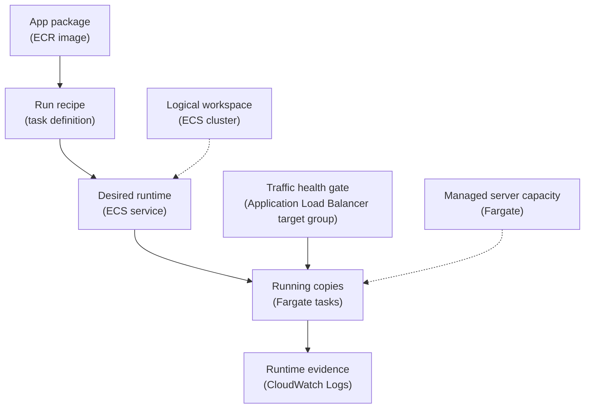

## Table of Contents

1. [The Container Is Ready, But The Cloud Needs A Runtime](#the-container-is-ready-but-the-cloud-needs-a-runtime)
2. [The ECS Pieces In One Mental Model](#the-ecs-pieces-in-one-mental-model)
3. [From ECR Image To Task Definition](#from-ecr-image-to-task-definition)
4. [Fargate Changes Who Owns The Server](#fargate-changes-who-owns-the-server)
5. [Services, Desired Count, And Deployments](#services-desired-count-and-deployments)
6. [Networking, Ports, And Target Groups](#networking-ports-and-target-groups)
7. [Roles, Secrets, And Logs](#roles-secrets-and-logs)
8. [Reading ECS Events When A Task Will Not Start](#reading-ecs-events-when-a-task-will-not-start)
9. [Health, Pressure, And Practical Tuning](#health-pressure-and-practical-tuning)
10. [Tradeoffs And A Shipping Checklist](#tradeoffs-and-a-shipping-checklist)

## The Container Is Ready, But The Cloud Needs A Runtime

A container image is a good package, but it is not a running service by itself.
On your laptop, Docker can start the image, attach a port, print logs, and stop the process when you are done.
In AWS, the same image needs a place to run, a network address, permissions, secrets, logs, health checks, and a way to replace old copies without dropping traffic.

Amazon ECS, short for Elastic Container Service, is AWS's managed container scheduler.
A scheduler is the system that decides where containers should run and keeps the requested number of copies alive.
ECS does not build your image.
It starts containers from an image you already built and tells you whether those containers are healthy.

Fargate is the AWS compute engine that can run ECS tasks without your team managing EC2 instances.
You still choose CPU, memory, networking, images, ports, IAM roles, environment variables, secrets, logs, and deployment settings.
You do not patch container hosts, drain EC2 instances, upgrade an ECS agent, or decide which host has enough spare capacity for the next task.

The running example is `devpolaris-orders-api`.
It is a Node.js container image that listens on port `3000`.
Customers reach it through an Application Load Balancer, usually shortened to ALB, at `https://orders.devpolaris.com`.
The ALB forwards traffic to ECS tasks running on Fargate in private subnets.

The useful beginner question is not "how do I run a container?"
You already know that from Docker.
The useful question is "what does AWS need to know so this container can behave like a real backend service?"

For `devpolaris-orders-api`, AWS needs answers like these:

| Question | Example Answer |
|----------|----------------|
| Which image should run? | `111122223333.dkr.ecr.us-east-1.amazonaws.com/devpolaris-orders-api:2026-05-02.1` |
| How big should each copy be? | `0.5 vCPU` and `1 GB` memory |
| Which port does the app listen on? | Container port `3000` |
| How many copies should stay running? | Desired count `2` |
| Where should tasks run? | Private subnets in the app VPC |
| How does traffic reach them? | ALB target group with target type `ip` |
| Where do logs go? | CloudWatch Logs group `/ecs/devpolaris-orders-api` |
| Which secrets does the app need? | `DATABASE_URL`, `STRIPE_WEBHOOK_SECRET` |

Those answers become ECS configuration.
The rest of the article turns that table into a practical mental model you can debug.

## The ECS Pieces In One Mental Model

ECS has a few nouns that sound similar at first.
The easiest way to learn them is to follow one image from registry to running service.

An ECS cluster is a logical home for running tasks and services.
Think of it as the workspace where ECS groups related container workloads.
With Fargate, the cluster does not mean "these are the EC2 hosts."
It means "these are the ECS workloads we operate together."

A task definition is the recipe.
It says which image to run, which ports to expose, how much CPU and memory to reserve, which IAM roles to use, which environment variables and secrets to inject, and how logs should be shipped.
If you know Docker Compose, the task definition plays a similar role to the service description, but it is AWS-specific and versioned.

A task is one running copy of a task definition.
If a task definition is the recipe, a task is one meal prepared from that recipe.
For `devpolaris-orders-api`, one task usually means one running Node.js process inside one container.

A service keeps tasks running over time.
It watches the desired count, starts replacement tasks when old ones stop, connects tasks to a load balancer, and manages rolling deployments.
If desired count is `2`, the service keeps two healthy copies alive when it can.

Fargate is the launch type or capacity provider that supplies the compute.
You ask for CPU and memory at the task level, and AWS runs the task on managed infrastructure.
You do not SSH into the host because the host is not your operational boundary.

Here is the beginner map:



Read the solid path as the service path.
The image becomes a task definition.
The service starts tasks from that task definition.
The load balancer sends traffic only to task IPs that pass health checks.

Read the dotted lines as supporting systems.
The cluster groups the service.
Fargate supplies the server capacity behind the running tasks.
CloudWatch Logs receives stdout and stderr from those tasks.

This model prevents one common mistake.
When a task fails, you do not fix "ECS" as one big thing.
You ask which layer failed:
the image, the task definition, the role, the network, the service deployment, the load balancer health check, or the application process.

## From ECR Image To Task Definition

ECS cannot run a container image until the image is in a registry the task can pull from.
For AWS-native beginner services, that registry is usually Amazon ECR, short for Elastic Container Registry.
ECR stores your container images and lets ECS pull them when a task starts.

The team builds `devpolaris-orders-api` from a Dockerfile and pushes it to ECR.
The image tag might include the date and build number so a deployment points at a specific build:

```text
111122223333.dkr.ecr.us-east-1.amazonaws.com/devpolaris-orders-api:2026-05-02.1
```

Tags are readable, which helps humans.
Digests are stronger for exactness because a digest points at one immutable image content value.
Many teams start with clear tags, then move production deployments toward image digests once the release process matures.

The task definition tells ECS how to run that image.
Here is a short excerpt, not a full production file:

```json
{
  "family": "devpolaris-orders-api",
  "requiresCompatibilities": ["FARGATE"],
  "networkMode": "awsvpc",
  "cpu": "512",
  "memory": "1024",
  "executionRoleArn": "arn:aws:iam::111122223333:role/ecsTaskExecutionRole",
  "taskRoleArn": "arn:aws:iam::111122223333:role/devpolaris-orders-api-task",
  "containerDefinitions": [
    {
      "name": "orders-api",
      "image": "111122223333.dkr.ecr.us-east-1.amazonaws.com/devpolaris-orders-api:2026-05-02.1",
      "essential": true,
      "portMappings": [{ "containerPort": 3000, "protocol": "tcp" }],
      "environment": [{ "name": "PORT", "value": "3000" }],
      "secrets": [{ "name": "DATABASE_URL", "valueFrom": "arn:aws:secretsmanager:us-east-1:111122223333:secret:prod/orders/DATABASE_URL-AbCdEf" }],
      "logConfiguration": {
        "logDriver": "awslogs",
        "options": {
          "awslogs-group": "/ecs/devpolaris-orders-api",
          "awslogs-region": "us-east-1",
          "awslogs-stream-prefix": "ecs"
        }
      }
    }
  ]
}
```

The first details to notice are the boring ones.
`requiresCompatibilities` says this task is meant for Fargate.
`networkMode` is `awsvpc`, which means each task gets its own network interface in your VPC.
`cpu` and `memory` set the task size.
`containerPort` says the app listens on `3000`.

The image line is the bridge between build and runtime.
If that tag does not exist, ECS cannot start the task.
If the image exists but the execution role cannot pull it, ECS cannot start the task.
If the image starts but the app listens on a different port, the task may run but never become healthy behind the load balancer.

The task definition is versioned.
Every change creates a new revision, such as `devpolaris-orders-api:17`.
An ECS service points at one revision at a time.
During deployment, the service starts tasks from the new revision, waits for them to become healthy, and stops old tasks according to its deployment settings.

That versioning is a relief during debugging.
You can compare the current revision with the previous one and ask what changed:
image tag, CPU, memory, port, secret ARN, role, environment variable, or log configuration.

## Fargate Changes Who Owns The Server

Fargate removes a large category of host work from your team.
You do not choose EC2 instance types for the cluster.
You do not patch the host operating system.
You do not install Docker on hosts.
You do not update the ECS agent.
You do not drain a container instance before replacing it.

That does not mean you own nothing.
It means your boundary moves up.
You own the container image, the task definition, the CPU and memory choice, the port contract, the secrets contract, IAM permissions, network placement, health checks, logs, and deployment behavior.

This responsibility shift matters during incidents.
On EC2, a broken service might lead you to inspect the host, disk, daemon, or agent.
On Fargate, the first useful evidence is usually ECS task status, service events, target health, and CloudWatch Logs.

The split looks like this:

| Work | With Fargate, Who Owns It? |
|------|-----------------------------|
| Host OS patching | AWS |
| Container host capacity | AWS, based on your task CPU and memory request |
| Container image contents | Your team |
| Task definition revision | Your team |
| App environment and secrets | Your team |
| IAM task role and execution role | Your team |
| VPC subnets and security groups | Your team |
| App logs and health endpoint | Your team |
| Deployment settings and rollback decision | Your team |

This is a good trade when your service is a normal HTTP backend.
You get a stable container runtime without building a host operations practice first.
The cost is that you must be precise about the contract around the container.
Fargate will faithfully start a bad image, use a wrong port, or inject missing environment into a process that then exits.

For Node.js, memory pressure often shows up as slow requests, process exits, or garbage collection pauses before you understand the root cause.
You still need to choose task memory with headroom for peak traffic and startup work.
For this Node.js example, the main lesson is simpler: the container's memory limit is real, and the app must be sized and tested inside that limit.

## Services, Desired Count, And Deployments

Running one task by hand is useful for a smoke test.
A production API needs a service.
An ECS service is the long-running controller that keeps the desired count of tasks alive.

Desired count is the number of task copies you ask ECS to maintain.
For `devpolaris-orders-api`, desired count `2` means the service tries to keep two running tasks.
If one task exits, ECS starts another.
If you deploy a new task definition revision, ECS starts new tasks and stops old ones while trying to keep enough healthy tasks available.

A healthy service might look like this in a status snapshot:

```text
Service: devpolaris-orders-api
Cluster: devpolaris-prod
Task definition: devpolaris-orders-api:17
Desired count: 2
Running count: 2
Pending count: 0
Launch type: FARGATE
Deployment: PRIMARY
Rollout state: COMPLETED
```

This output is useful because it separates intent from reality.
Desired count is what you asked for.
Running count is what exists now.
Pending count means ECS is trying to start tasks but they are not running yet.
Rollout state tells you whether the current deployment is still moving.

During a deployment, the same service might briefly look like this:

```text
Service: devpolaris-orders-api
Task definition: devpolaris-orders-api:18
Desired count: 2
Running count: 3
Pending count: 1
Deployment: PRIMARY
Rollout state: IN_PROGRESS

Active deployments:
  PRIMARY  devpolaris-orders-api:18  desired=2  running=1  pending=1
  ACTIVE   devpolaris-orders-api:17  desired=2  running=2  pending=0
```

That overlap is expected during a rolling deployment.
Old and new tasks can run at the same time.
That overlap is how ECS avoids dropping traffic while it waits for new tasks to pass health checks.

The service event stream tells the story in plain pieces:

```text
2026-05-02T10:12:14Z service devpolaris-orders-api has started 1 tasks: task 9f4a8c1b.
2026-05-02T10:12:47Z service devpolaris-orders-api registered 1 targets in target-group orders-api-tg.
2026-05-02T10:13:18Z service devpolaris-orders-api has reached a steady state.
```

When the deployment is healthy, events move from starting tasks to registering targets to steady state.
When the deployment is unhealthy, events repeat, stall, or mention stopped tasks.
That is your first diagnostic fork:
did the task fail before it ran, or did it run but fail health?

## Networking, Ports, And Target Groups

Fargate tasks use `awsvpc` networking.
In plain English, each task gets its own elastic network interface, usually called an ENI, inside your VPC.
That ENI has a private IP address and can have its own security group.

For a private backend behind an ALB, the common shape is:

```text
Internet
  -> public ALB in public subnets
  -> target group orders-api-tg
  -> Fargate task ENIs in private subnets
  -> orders-api container on port 3000
```

The ALB should be reachable from users on `443`.
The tasks should usually not be public.
The task security group should allow inbound traffic on `3000` from the ALB security group.
The tasks also need outbound network access to pull images, fetch secrets, and reach dependencies such as the database.

Here is the practical port contract:

| Layer | Value | Meaning |
|-------|-------|---------|
| Browser URL | `https://orders.devpolaris.com` | Public HTTPS endpoint |
| ALB listener | `HTTPS:443` | Public load balancer port |
| Target group | `HTTP:3000` | Private hop to tasks |
| Task definition | `containerPort: 3000` | Container port ECS registers |
| Node.js app | `process.env.PORT || 3000` | Process must actually listen here |
| Health check | `GET /health` | ALB readiness test |

For an ECS service connected to an ALB target group, the container port drives how ECS registers task IPs and ports.
If the mapping says `orders-api:3000`, then the container named `orders-api` must expose `3000`, and the process must listen on that port.

A wrong port can look confusing because the task may be `RUNNING`.
The container process exists.
CloudWatch Logs show startup success.
But the target group marks the target unhealthy because the ALB cannot connect to the expected port.

A target health snapshot might look like this:

```text
Target group: orders-api-tg
Target: 10.0.42.18:3000
State: unhealthy
Reason: Target.Timeout
Description: Request timed out
Health check: GET /health on traffic port
```

The fix depends on which part of the contract is wrong.
If the app listens on `8080`, change the app or change the task and target group mapping to `8080`.
If the app listens only on `127.0.0.1`, change it to listen on `0.0.0.0` inside the container.
If the security group blocks the ALB, allow inbound traffic from the ALB security group to the task security group on the container port.

Networking failures are easier when you resist guessing.
Start at the target group reason.
Then check service events.
Then check the task definition port mapping.
Then check the app startup log.
Then check security groups and subnet routes.

## Roles, Secrets, And Logs

ECS tasks often use two IAM roles, and mixing them up is one of the most common beginner mistakes.
The execution role is for ECS and Fargate to prepare the task.
The task role is for your application code after the container is running.

The execution role lets ECS do work such as pulling the image from ECR, writing logs to CloudWatch Logs, and retrieving secrets for injection.
The container does not use this role directly in your application code.
It is the role that helps the platform start the task.

The task role is the role your app uses through the AWS SDK.
If `devpolaris-orders-api` calls S3 to read invoice templates, or calls DynamoDB to read order state, that permission belongs in the task role.
The app should not need ECR pull permission in the task role just to start.

Keep the difference short and strict:

| Role | Used By | Common Permissions |
|------|---------|--------------------|
| Execution role | ECS and Fargate agent path | Pull ECR image, send logs, fetch injected secrets |
| Task role | App code inside the container | Read S3, call DynamoDB, publish SNS, use AWS SDK |

Secret injection sits on this boundary.
If the task definition references a Secrets Manager secret in `secrets`, ECS needs permission through the execution role to fetch that value during task startup.
The Node.js app only sees `process.env.DATABASE_URL` after startup.
It does not need to call Secrets Manager itself for that basic pattern.

Logs also sit on the execution side.
The `awslogs` driver sends container stdout and stderr to CloudWatch Logs.
For a Node.js service, this means `console.log`, structured logger output, and startup errors become searchable runtime evidence.

A useful startup log is short and safe:

```text
2026-05-02T10:12:31.482Z INFO service=devpolaris-orders-api version=2026-05-02.1
2026-05-02T10:12:31.516Z INFO port=3000 node_env=production
2026-05-02T10:12:31.921Z INFO database=connected
2026-05-02T10:12:32.004Z INFO health=ready path=/health
```

Do not log secret values.
It is fine to log that a required setting exists.
It is not fine to log the database URL, webhook secret, API token, or private key.

When a task will not start, the role distinction tells you where to look.
Image pull failure usually means execution role, image name, registry, or route to ECR.
Secret injection failure usually means execution role permission, secret ARN, KMS permission, or network path to Secrets Manager.
An app-level S3 `AccessDenied` after startup usually means task role.

## Reading ECS Events When A Task Will Not Start

Most ECS failures are less mysterious once you read the stopped task reason and the service events together.
The service event tells you what ECS was trying to do.
The stopped task reason tells you why one task stopped.
CloudWatch Logs tell you what the container printed before it died, if it got far enough to start.

Start with the highest-level view:

```bash
$ aws ecs describe-services \
  --cluster devpolaris-prod \
  --services devpolaris-orders-api \
  --query 'services[0].{desired:desiredCount,running:runningCount,pending:pendingCount,events:events[0:5].message}'
```

The exact query is less important than the habit.
You want desired count, running count, pending count, and recent events in one view.
If running stays below desired, ECS is trying and failing somewhere.

Here are common failure shapes and what they point to:

| Symptom | What It Often Means | First Place To Inspect |
|---------|---------------------|------------------------|
| `CannotPullContainerError` | Image missing, wrong tag, ECR permission, or no route to registry | Stopped task reason and execution role |
| `ResourceInitializationError` for secrets | ECS could not fetch a secret or decrypt it | Execution role, secret ARN, KMS key, subnet egress |
| Task `RUNNING`, target unhealthy | App started but ALB health check fails | Target group reason and app logs |
| Task exits quickly | App crashed at startup | CloudWatch Logs |
| `AccessDenied` inside app logs | App code lacks AWS permission | Task role |
| Slow responses or exits under load | CPU or memory pressure | ECS metrics, app logs, container limits |

A failed image pull might look like this:

```text
Stopped reason:
CannotPullContainerError: pull image manifest has been retried 5 time(s):
failed to resolve ref 111122223333.dkr.ecr.us-east-1.amazonaws.com/devpolaris-orders-api:2026-05-02.1:
not found
```

This message is pointing at the image reference.
Check that the ECR repository name is correct.
Check that the tag exists.
Check that the service is deploying the task definition revision you expect.
If the image exists, check the execution role and subnet route to ECR.

A secret injection failure has a different shape:

```text
Stopped reason:
ResourceInitializationError: unable to pull secrets or registry auth:
AccessDeniedException: User is not authorized to perform: secretsmanager:GetSecretValue
on resource: prod/orders/DATABASE_URL
```

Do not fix this by giving the application task role broad secret access.
For task definition secret injection, the execution role needs permission to retrieve the referenced secret.
If the secret uses a customer managed KMS key, the role may also need decrypt permission on that key.

A task role mixup appears later.
The task starts, the app prints logs, then the app fails when it calls another AWS service:

```text
2026-05-02T10:22:09.104Z ERROR service=devpolaris-orders-api operation=read-invoice-template
AccessDenied: User: arn:aws:sts::111122223333:assumed-role/devpolaris-orders-api-task/9f4a8c1b
is not authorized to perform: s3:GetObject on resource: arn:aws:s3:::devpolaris-invoice-templates/prod/default.html
```

That error names the task role session.
Now the fix belongs in the task role policy, not in the execution role.
This distinction keeps permissions smaller and debugging faster.

## Health, Pressure, And Practical Tuning

A task can be running and still not be ready for traffic.
That is why the ALB health check matters.
For `devpolaris-orders-api`, the health endpoint should prove the app can accept normal requests without doing expensive work.

A good health endpoint returns quickly, uses the same port as real traffic, and checks only critical readiness.
It might confirm that the HTTP server is up and the database connection pool can be used.
It should not call every downstream service or run a long query.

If the health check fails during deployment, ECS may keep replacing tasks.
The event stream often looks repetitive:

```text
2026-05-02T10:35:10Z service devpolaris-orders-api has started 1 tasks: task 2d71f3aa.
2026-05-02T10:36:15Z service devpolaris-orders-api deregistered 1 targets in target-group orders-api-tg.
2026-05-02T10:36:17Z service devpolaris-orders-api task 2d71f3aa failed ELB health checks in target-group orders-api-tg.
2026-05-02T10:36:25Z service devpolaris-orders-api has started 1 tasks: task 8b3c90ed.
```

The task lived long enough to register with the target group, so the image was pulled and started.
The next places to inspect are target health reason, app port, `/health` behavior, security group rules, and startup time.

Health check grace period can help when the app is genuinely slow to become ready.
It tells ECS to ignore load balancer health check failures for a short time after a task starts.
Use it for real startup work, not to hide a broken health endpoint.

CPU and memory pressure are a different class of problem.
The task may start and pass health, then slow down or stop under traffic.
A Node.js process with too little memory may crash when a traffic spike creates more in-flight requests than expected.
A task with too little CPU may respond slowly enough that health checks time out.

The diagnostic path is practical:

1. Check ECS service counts and recent events.
2. Check stopped task reason for tasks that exited.
3. Check target group health reason for running tasks that are unhealthy.
4. Check CloudWatch Logs for startup errors, port logs, secret errors, and uncaught exceptions.
5. Check CPU and memory metrics around the failure time.
6. Compare the current task definition revision with the previous known-good revision.

The last step is easy to skip, but it often finds the change.
Maybe the image tag moved.
Maybe memory dropped from `1024` to `512`.
Maybe `PORT` changed.
Maybe a secret ARN points at staging.
Maybe the service load balancer mapping still expects `3000` after the app moved to `8080`.

Good ECS debugging is usually comparison plus evidence.
Do not stare at the service name and hope the answer appears.
Follow the lifecycle: image pull, secret injection, container start, logs, port, target registration, health, traffic, metrics.

## Tradeoffs And A Shipping Checklist

ECS with Fargate is a strong fit when your team wants to run containers without operating container hosts.
It works especially well for small and medium HTTP services where the main needs are image-based deploys, private networking, IAM roles, logs, health checks, and load balancer integration.

The tradeoff is control.
You get less host-level access.
You cannot SSH into the Fargate host to inspect Docker directly.
You must make logs, metrics, health checks, and task status good enough to operate the service from the outside.
For most beginner backend teams, that is a healthy constraint.

Before shipping `devpolaris-orders-api`, walk through this checklist:

| Check | Healthy Answer |
|-------|----------------|
| Image | ECR repository and image tag or digest exist |
| Task size | CPU and memory match tested startup and load behavior |
| Port | App listens on `0.0.0.0:3000`, task definition maps `3000`, target group forwards to `3000` |
| Desired count | Service keeps at least two tasks for normal production availability |
| Execution role | Can pull ECR image, write CloudWatch logs, and fetch injected secrets |
| Task role | Grants only the AWS permissions the app code needs |
| Secrets | Values live in Secrets Manager or Parameter Store, not image or logs |
| Networking | Tasks run in intended subnets and allow inbound traffic only from the ALB security group |
| Health | `/health` returns quickly after the app is ready |
| Logs | Startup, version, port, and readiness are visible without leaking secrets |

Use this mental model:
ECR stores the package.
The task definition describes how to run it.
The service keeps the right number running.
Fargate supplies managed compute.
The ALB sends traffic to healthy task IPs.
CloudWatch Logs and ECS events tell you what happened when that chain breaks.

That is the shape you will use again and again.
When a deployment fails, locate the broken handoff.
The image must be pullable.
The task must be startable.
The app must listen on the expected port.
The target must pass health.
The service must reach steady state.

---

**References**

- [Amazon ECS task definitions](https://docs.aws.amazon.com/AmazonECS/latest/userguide/task_definitions.html) - Explains the task definition as the JSON blueprint for image, CPU, memory, networking, roles, and logging settings.
- [CannotPullContainer task errors in Amazon ECS](https://docs.aws.amazon.com/AmazonECS/latest/developerguide/task_cannot_pull_image.html) - Gives official failure shapes and fixes for tasks that cannot pull container images.
- [Amazon ECS task networking options for Fargate](https://docs.aws.amazon.com/AmazonECS/latest/developerguide/fargate-task-networking.html) - Describes task ENIs, subnet placement, public IP behavior, and network routes needed for task startup dependencies.
- [Amazon ECS task IAM role](https://docs.aws.amazon.com/AmazonECS/latest/developerguide/task-iam-roles.html) - Clarifies the IAM role used by application code inside the running container.
- [Amazon ECS task execution IAM role](https://docs.aws.amazon.com/AmazonECS/latest/developerguide/task_execution_IAM_role.html) - Clarifies the role ECS and Fargate use to pull images, write logs, and fetch injected secrets.
- [Use load balancing to distribute Amazon ECS service traffic](https://docs.aws.amazon.com/AmazonECS/latest/developerguide/service-load-balancing.html) - Explains how ECS services integrate with Elastic Load Balancing for traffic distribution and target registration.
