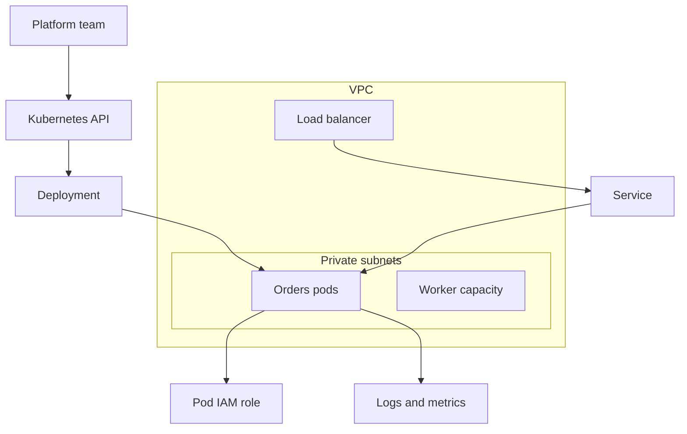

## Table of Contents

1. [The Problem](#the-problem)
2. [What Is EKS](#what-is-eks)
3. [Control Plane](#control-plane)
4. [Worker Capacity](#worker-capacity)
5. [Pods](#pods)
6. [Deployments](#deployments)
7. [Services](#services)
8. [Networking](#networking)
9. [IAM And Access](#iam-and-access)
10. [When EKS Fits](#when-eks-fits)
11. [Sample Cluster Shape](#sample-cluster-shape)
12. [Putting It All Together](#putting-it-all-together)
13. [What's Next](#whats-next)

## The Problem

A team starts with one containerized API. The image is pushed to ECR, ECS runs a service, Fargate provides the compute, and the load balancer sends traffic to healthy tasks. The shape is readable: image, task definition, service, tasks, target group.

Then the platform grows:

- Several teams want to deploy services with the same Kubernetes manifests they already use elsewhere.
- One service needs a sidecar for service mesh traffic, another needs a controller, and another needs a custom deployment pattern built around Kubernetes labels.
- Platform engineers want namespaces, admission policies, shared cluster add-ons, and one way to operate dozens of container workloads.
- The team still needs AWS networking, IAM, load balancers, logs, and private service access to behave like the rest of the AWS environment.

This is where Amazon Elastic Kubernetes Service, or EKS, enters the compute conversation. EKS is not "more managed ECS." It is the AWS way to run Kubernetes when Kubernetes itself is the operating layer the team wants.

The working mental model is simple: use EKS when the useful unit is not just a container service, but a Kubernetes cluster with many workloads, controllers, policies, and platform conventions around those workloads.

## What Is EKS

Amazon EKS is AWS-managed Kubernetes. Kubernetes is an open source system for running containerized applications by describing the state you want, then letting the cluster work toward that state. EKS gives you a Kubernetes control plane without making your team install and operate the control plane components directly.

That sentence hides the main tradeoff. AWS manages the Kubernetes control plane so the cluster has an API server, scheduler, controllers, and durable cluster state. Your team still owns the application design, Kubernetes objects, worker capacity choices, networking design, permissions, add-ons, upgrades, observability, and the operational conventions that make the cluster safe to share.

EKS sits in the compute module because application code still runs as containers. It is different from ECS because Kubernetes becomes the interface between your team and the runtime. In ECS, the main AWS objects are task definitions, services, and tasks. In EKS, the main Kubernetes objects are pods, deployments, services, namespaces, and the controllers that reconcile them.

| Question | ECS with Fargate | EKS |
| --- | --- | --- |
| Main interface | AWS ECS objects | Kubernetes API objects |
| Smallest workload shape | Task | Pod |
| Service management | ECS service | Deployment, Service, and controllers |
| Platform extension | AWS service integrations | Kubernetes ecosystem and cluster add-ons |
| Team burden | Lower for straightforward container services | Higher because Kubernetes becomes part of operations |

Neither answer is automatically better. ECS is often the clearer home for a small number of AWS-native container services. EKS becomes attractive when Kubernetes compatibility, shared platform patterns, or the Kubernetes ecosystem are part of the actual requirement.

## Control Plane

The Kubernetes control plane is the brain of the cluster. It receives the desired state, stores cluster state, schedules pods, and runs controllers that notice when reality does not match the requested shape.

In self-managed Kubernetes, a team must run and protect that control plane. In EKS, AWS runs the managed Kubernetes control plane for the cluster. That is the first important ownership line. The team talks to a Kubernetes API endpoint, but AWS operates the managed control plane behind that endpoint.

That does not mean the control plane makes good application decisions for you. If a deployment asks for ten replicas that cannot fit on available capacity, Kubernetes can keep trying, but it cannot invent the missing capacity or fix an unrealistic request. If labels are wrong, a service may not select the pods you expected. If a policy blocks a deployment, the control plane is enforcing the policy, not guessing your intent.

The practical habit is to separate "the cluster accepted my request" from "the app is safely running." EKS can provide the Kubernetes API, but your manifests still describe the application contract.

## Worker Capacity

The control plane does not run your application containers. Application pods need worker capacity. In EKS, that capacity can come from EC2-backed nodes, Fargate profiles, and newer EKS-managed approaches such as Auto Mode.

With managed node groups, EKS provisions and manages groups of EC2 instances for the cluster. Those instances run in your AWS account and become Kubernetes nodes. Kubernetes can then schedule pods onto them. This gives you familiar EC2 capacity choices, but it also means node size, operating system updates, disruption handling, and subnet capacity still matter.

With Fargate profiles, pods that match selected namespaces and labels can run on AWS Fargate instead of on EC2 nodes you manage. That can reduce node operations for certain workloads, but it does not remove the need to understand Kubernetes objects, pod resource requests, networking, IAM, and observability.

With EKS Auto Mode, AWS can take on more of the cluster infrastructure work, including routine compute and supporting components. The beginner lesson is not that every EKS cluster should use one capacity model. The lesson is that worker capacity is a separate choice from the control plane. EKS manages Kubernetes access and coordination; your workload still needs somewhere to run.

| Capacity choice | Plain-English shape | What to watch |
| --- | --- | --- |
| Managed node group | EC2 instances registered as Kubernetes nodes | Instance fit, subnet IPs, node updates, pod placement |
| Fargate profile | Matching pods run on Fargate | Namespace and label selection, supported workload fit |
| Auto Mode | AWS manages more cluster infrastructure | Which controls move to AWS and which choices remain yours |

The non-obvious part is that a cluster can look healthy while an application is unschedulable. The control plane may be up, but a pod can still wait because there is no suitable node, not enough CPU or memory, a missing subnet path, or a policy that prevents placement.

## Pods

A pod is the smallest deployable compute object in Kubernetes. Most beginner examples have one container per pod, but a pod can hold multiple containers that need to share the same local network and lifecycle. Kubernetes schedules pods, not raw containers.

That wrapper matters because the pod is the unit that gets an IP address, resource requests, labels, environment, volumes, health probes, and a place on a node. If the container is the package, the pod is the running shape Kubernetes understands.

For a small orders API, one pod might hold the `orders-api` container and a small sidecar that helps with telemetry. They share the same pod network namespace, so they can talk over local ports. Kubernetes sees them as one deployable unit. If the pod moves, that local relationship moves together.

This is one reason EKS is more platform-shaped than ECS. In ECS, a task definition can also group containers, but EKS brings the full Kubernetes pod model, labels, controllers, admission behavior, and ecosystem expectations around that grouping.

## Deployments

A pod by itself is usually too fragile as the main application object. If one pod disappears, a human would have to create another one. Kubernetes normally uses higher-level objects to manage pods, and the most common one for a stateless service is a Deployment.

A Deployment describes the desired state for a set of pods. It can say which pod template to run, how many replicas should exist, and how updates should roll out. The Deployment controller watches the real state and works toward the desired state.

Here is the kind of small manifest shape a beginner should learn to read before memorizing commands:

```yaml
apiVersion: apps/v1
kind: Deployment
metadata:
  name: orders-api
spec:
  replicas: 3
  selector:
    matchLabels:
      app: orders-api
  template:
    metadata:
      labels:
        app: orders-api
    spec:
      containers:
        - name: orders-api
          image: 123456789012.dkr.ecr.us-east-1.amazonaws.com/orders-api:2026-05-14
```

The important field is not the image alone. Notice the relationship between `replicas`, `selector`, and the pod template labels. The Deployment wants three pods whose labels match `app: orders-api`. If those labels do not line up with the service that sends traffic, the app can be running and still unreachable.

That is a different mental model from "start this one container." Kubernetes asks you to describe the group of pods the platform should keep true over time.

## Services

Pods are replaceable. A pod can be rescheduled, recreated, or replaced during a rollout. Its IP address can change. If clients talked directly to one pod IP, every rollout would become a routing problem.

A Kubernetes Service gives a stable way to reach a changing set of pods. The Service selects pods by labels and gives other callers a consistent name and virtual address inside the cluster. For traffic from outside the cluster, a Service or Ingress can also connect Kubernetes to AWS load balancing.

This is where earlier compute lessons carry forward. An ECS service keeps tasks behind a load balancer target group. In EKS, a Kubernetes Service selects pods, and AWS load balancing can be provisioned to send traffic toward the selected workload. The nouns change, but the reason is familiar: traffic needs a stable front door while compute units are replaced behind it.

The gotcha is label truth. A service is not attached to pods because their names look related. It is attached because selectors match labels. If a Deployment creates pods with `app: orders-api` but a Service selects `app: order-api`, traffic has no matching backends even though pods may be running.

## Networking

EKS still lives in an AWS network. The cluster uses VPC subnets, security groups, load balancers, route tables, and private IP space. Kubernetes adds its own layer of names and objects, but it does not erase the VPC.

With the Amazon VPC Container Network Interface plugin, pods on EC2 nodes can receive private IP addresses from the VPC. That is convenient because pod traffic fits into AWS networking, but it also creates a planning issue: pods consume address space. A subnet that looked large enough for a few nodes may not be large enough for many pods.

This is the EKS version of the VPC lesson. Names do not make a subnet private, and Kubernetes labels do not create IP addresses. The underlying VPC design still decides where nodes and load balancers live, how traffic leaves private subnets, and whether there is enough address space for the cluster to grow.

Load balancing adds another bridge. Kubernetes Services and Ingress resources describe traffic intent. AWS load balancer integration turns that intent into Application Load Balancers or Network Load Balancers where appropriate. The team needs to understand both sides: the Kubernetes object that asks for traffic and the AWS resource that actually receives packets.

## IAM And Access

EKS has two access worlds. AWS IAM decides who can use AWS APIs. Kubernetes authorization decides what a user or workload can do inside the cluster. A healthy platform keeps those worlds connected without pretending they are the same thing.

For humans and automation, an IAM principal may be allowed to reach the EKS cluster API, but Kubernetes role-based access control still decides what that caller can do to cluster objects. A deployment pipeline might be allowed to update one namespace and not another. A support engineer might be allowed to view pods but not change deployments.

For application pods, the same split appears in a different form. The pod may need AWS permissions to read an S3 object, write to DynamoDB, or fetch a secret. Giving broad permissions to every node is too coarse because many pods may share a node. EKS Pod Identity and IAM roles for service accounts exist so a specific Kubernetes service account can be associated with an IAM role for the workload that needs it.

The practical habit is to ask two questions:

| Access question | System that answers it |
| --- | --- |
| Can this caller change Kubernetes objects? | Kubernetes authentication and RBAC |
| Can this workload call an AWS API? | IAM role associated with the pod's service account |

That separation prevents a common repair mistake. If a pod gets `AccessDenied` from S3, giving a developer broader cluster admin rights does not fix the app's AWS permissions. If a pipeline cannot update a Deployment, changing the pod's S3 role does not fix the pipeline's Kubernetes access.

## When EKS Fits

EKS is a strong fit when Kubernetes is already part of the requirement. That may be because the company runs Kubernetes across clouds, uses Helm charts and controllers, needs cluster-wide platform policies, relies on Kubernetes-native tooling, or wants a shared platform where many teams deploy workloads with the same abstractions.

EKS is a weaker fit when the workload is simply "one containerized web service on AWS." ECS with Fargate often teaches and operates more cleanly for that shape. It has fewer Kubernetes-specific objects, fewer cluster-level concerns, and a more direct AWS service model.

The choice is really about the operating layer:

| Need | Better starting point |
| --- | --- |
| A few AWS-native container services | ECS with Fargate |
| A simple event handler or scheduled bounded job | Lambda |
| Host-level control or special OS requirements | EC2 |
| Kubernetes manifests, controllers, namespaces, and shared platform policies | EKS |
| Multi-team container platform with Kubernetes conventions | EKS |

The dangerous middle is choosing EKS because Kubernetes sounds more advanced. EKS can be the right answer, but it brings more nouns that the team must operate: clusters, nodes, pods, deployments, services, ingress, add-ons, service accounts, RBAC, and upgrades. The payoff should be real platform leverage, not decoration.

## Sample Cluster Shape

For the orders system, a simple EKS shape might look like this:



The diagram is intentionally small. The control plane receives the desired state. Worker capacity gives pods somewhere to run. The Service keeps traffic pointed at the right pods. The load balancer connects external traffic to the cluster. IAM gives the pod a narrow AWS identity. Logs and metrics make the runtime visible.

That is the article's core idea: EKS is not one resource replacing ECS. It is a Kubernetes cluster on AWS, with AWS-managed control plane pieces and team-owned platform choices around the workloads.

## Putting It All Together

The opening team had a container platform problem, not just a container runtime problem.

They wanted multiple teams to use Kubernetes manifests and shared deployment conventions. EKS answers that by giving them a managed Kubernetes control plane. They needed application containers to run somewhere. Worker capacity answers that through managed node groups, Fargate profiles, Auto Mode, or another supported capacity pattern. They needed stable traffic to replaceable pods. Kubernetes Services and AWS load balancing answer that together. They needed access to AWS services without sharing broad node permissions. Pod-level identity patterns answer that boundary.

The tradeoff is now visible. EKS can make sense when Kubernetes gives the team a shared platform language that ECS does not provide. It is a heavy answer when all the team needs is a straightforward container service.

Good EKS decisions sound less like "we want Kubernetes" and more like "we need Kubernetes because our platform, deployment model, policies, or ecosystem depend on it."

## What's Next

The compute module now has the main runtime shapes: EC2 for server-shaped work, ECS with Fargate for AWS-native container services, Lambda for event-shaped functions, and EKS for Kubernetes-shaped container platforms.

The next AWS modules move from where code runs to how a production system stays useful. Storage and databases cover where application state belongs. Observability covers the signals that show what the system is doing. Deployment and runtime operations cover safe updates, runtime config, scaling, jobs, and the controls teams use after code is already running.

---

**References**

- [EKS Control Plane](https://docs.aws.amazon.com/eks/latest/best-practices/control-plane.html). Supports the explanation that EKS runs a managed Kubernetes control plane, including API server and etcd components, and manages control plane availability and scaling.
- [Amazon EKS Documentation](https://aws.amazon.com/documentation-overview/eks/). Supports the high-level EKS definition, Kubernetes conformance, managed control plane responsibilities, and the ability to run Kubernetes applications on EC2 and Fargate.
- [Simplify node lifecycle with managed node groups](https://docs.aws.amazon.com/eks/latest/userguide/managed-node-groups.html). Supports the managed node group explanation, including EC2 node provisioning, lifecycle management, Auto Scaling group ownership, updates, draining, and multi-AZ placement.
- [Define which Pods use AWS Fargate when launched](https://docs.aws.amazon.com/eks/latest/userguide/fargate-profile.html). Supports the Fargate profile explanation based on namespace and label selectors.
- [Automate cluster infrastructure with EKS Auto Mode](https://docs.aws.amazon.com/eks/latest/userguide/automode.html). Supports the note that Auto Mode can manage more routine cluster infrastructure such as compute, pod and service networking, load balancing, DNS, and storage integrations.
- [Pods](https://kubernetes.io/docs/concepts/workloads/pods/). Supports the pod explanation as the Kubernetes object that wraps one or more containers and is managed by Kubernetes as a deployable unit.
- [Deployments](https://kubernetes.io/docs/concepts/workloads/controllers/deployment/). Supports the desired-state explanation for Deployments, replicas, pod templates, selectors, and controlled updates.
- [Service](https://kubernetes.io/docs/concepts/services-networking/service/). Supports the explanation that a Kubernetes Service exposes a group of pods over the network and usually targets pods through a label selector.
- [Learn how to deploy workloads and add-ons to Amazon EKS](https://docs.aws.amazon.com/eks/latest/userguide/eks-workloads.html). Supports the Kubernetes Service and load balancer discussion for exposing pods.
- [Assign IPs to Pods with the Amazon VPC CNI](https://docs.aws.amazon.com/eks/latest/userguide/managing-vpc-cni.html). Supports the explanation that the Amazon VPC CNI assigns private VPC IP addresses to pods on EKS and that pod networking consumes VPC address space.
- [Route internet traffic with AWS Load Balancer Controller](https://docs.aws.amazon.com/eks/latest/userguide/aws-load-balancer-controller.html). Supports the explanation that AWS load balancer integration can point AWS load balancers at Kubernetes Service or Ingress resources.
- [Learn how EKS Pod Identity grants pods access to AWS services](https://docs.aws.amazon.com/eks/latest/userguide/pod-identities.html). Supports the pod identity explanation that maps IAM roles to Kubernetes service accounts so pod workloads can call AWS APIs with scoped permissions.
