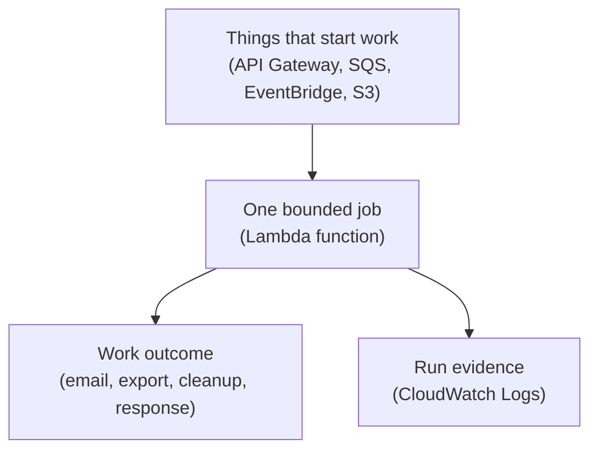

## Table of Contents

1. [A Job That Does Not Need A Server](#a-job-that-does-not-need-a-server)
2. [Events, Handlers, And Invocations](#events-handlers-and-invocations)
3. [The Settings That Shape One Run](#the-settings-that-shape-one-run)
4. [Triggers You Will See First](#triggers-you-will-see-first)
5. [Synchronous, Asynchronous, And Queue-Based Calls](#synchronous-asynchronous-and-queue-based-calls)
6. [Supporting Jobs For devpolaris-orders-api](#supporting-jobs-for-devpolaris-orders-api)
7. [Failure Modes And A Diagnostic Path](#failure-modes-and-a-diagnostic-path)
8. [When ECS Is Simpler](#when-ecs-is-simpler)
9. [A First Review Checklist](#a-first-review-checklist)

## A Job That Does Not Need A Server

Some backend work does not need a process waiting all day for traffic.
It needs code to wake up, handle one piece of work, write a result, and stop.

That is the first mental shift behind AWS Lambda.
Lambda is AWS compute for running function code when something asks for it.
The "something" is an event, which means a JSON-shaped message that says what happened.

Lambda exists because many useful backend jobs are not really long-running services.
They are reactions.
An object was uploaded.
A queue message arrived.
A schedule reached midnight.
An HTTP request asked a small helper endpoint to verify a webhook signature.

In a traditional server model, you keep a process running and wait for work.
The process owns a port, keeps memory warm, and usually has a health check.
That model is excellent for the main `devpolaris-orders-api` service because checkout traffic needs a stable API process behind a load balancer.

Lambda changes the start point.
You do not start the process first and then wait for work.
AWS receives an event, prepares a runtime for your function if needed, calls your handler, and stops billing when the invocation finishes.

An invocation is one attempt to run your function for one event or one batch of events.
If ten queue batches are ready, Lambda can create multiple invocations.
If no work arrives, there is no idle Node process sitting there only to check an empty queue.

This article follows the supporting jobs around `devpolaris-orders-api`.
The main checkout API still belongs in a long-running service in this module's mental model.
The Lambda examples handle side work:
receipt emails, export generation, webhook verification, and nightly cleanup.

That separation matters for beginners.
Lambda is not "the modern replacement for every server."
It is a good fit when the work has a clear event, a bounded amount of time, and a result that does not require a warm process to stay alive.

Here is the shape we are learning:

```text
Always-running service
  ECS task starts
  Node process listens on port 3000
  Load balancer sends requests
  Process keeps running between requests

Event-driven function
  Event arrives
  Lambda invokes handler
  Handler processes event
  Invocation ends
```

The important word is "bounded."
Bounded means you can say what starts the work, what input the work needs, and what done looks like.
If you cannot answer those questions, a long-running service may be simpler.

> Lambda is easiest when the job sounds like "when this happens, do this small piece of work."

## Events, Handlers, And Invocations

The handler is the function Lambda calls in your code.
In Node.js, it is often an exported async function.
Lambda passes the handler an event object and, if your function accepts it, a context object.

The event is the input payload.
It can look like an API Gateway HTTP request, an SQS queue message batch, an S3 object notification, or an EventBridge scheduled event.
The shape depends on the service that triggered the function, so you should not guess it from memory.

The context object contains information about the current invocation.
For a beginner, the most useful context detail is often the AWS request ID.
That ID appears in logs and helps you connect one event to one run.

Here is a small handler for a receipt email job.
The main API writes an order, then places a message on an SQS queue.
Lambda reads that queue and sends the receipt outside the checkout request path.

```js
export const handler = async (event, context) => {
  for (const record of event.Records ?? []) {
    const message = JSON.parse(record.body);

    if (!message.orderId || !message.email || !message.total) {
      throw new Error(`bad receipt message ${record.messageId}`);
    }

    await sendReceiptEmail({
      orderId: message.orderId,
      email: message.email,
      total: message.total,
      requestId: context.awsRequestId
    });
  }

  return { processed: event.Records?.length ?? 0 };
};
```

This is not the whole application.
That is the point.
The handler only knows how to process receipt email messages.
It does not know how to accept checkout requests, manage carts, or serve the public orders API.

A queue event for that handler might look like this:

```json
{
  "Records": [
    {
      "messageId": "5a6f4b79-6b3c-4f2d-9f21-8f8a5a5a2f10",
      "body": "{\"orderId\":\"ord_1042\",\"email\":\"maya@example.com\",\"total\":\"49.00\"}",
      "attributes": {
        "ApproximateReceiveCount": "1",
        "SentTimestamp": "1777726801000"
      },
      "eventSource": "aws:sqs"
    }
  ]
}
```

The event is just data, but it is data with a contract.
The handler expects `Records`.
Each record expects `body`.
The body expects `orderId`, `email`, and `total`.

If the event shape changes, the function can fail even though the code deployed successfully.
This is why event-driven systems need small validation checks near the start of the handler.
You want a clear error like `bad receipt message` instead of a vague `Cannot read properties of undefined`.

The invocation begins when Lambda calls the handler.
The invocation ends when the handler returns, throws an error, exits, or times out.
Those endings matter because each one tells AWS a different story.

If the handler returns successfully, Lambda treats the invocation as successful.
If the handler throws, Lambda treats it as a failed invocation.
If the handler keeps running past its timeout, Lambda stops it and records a timeout failure.

That means your code should be honest.
If the receipt email did not send, throw an error.
Do not swallow the error and return success, because the event source may delete or mark the event complete.

## The Settings That Shape One Run

A Lambda function is more than a handler file.
It also has runtime settings that decide how the invocation runs.
For beginners, the four settings to understand first are timeout, memory, execution role, and logging.

Timeout is the maximum time one invocation may run.
Standard Lambda functions can be configured up to 900 seconds, which is 15 minutes.
The default is short, so a function that calls slow downstream services may fail until you set a realistic value.

Memory is the amount of memory available to the function at runtime.
In Lambda, memory is also a performance lever because CPU power increases with the configured memory.
That can feel strange at first.
You might raise memory not because the code is out of memory, but because the function is CPU-bound or network-heavy and needs more compute share to finish quickly.

The execution role is the IAM role Lambda assumes when your function runs.
This role is how the function receives permission to call AWS APIs.
For the receipt email job, the role might allow writing logs and calling the email service, but it should not allow updating the ECS service or reading every production secret.

Logs usually go to CloudWatch Logs.
For a function named `devpolaris-orders-receipt-email`, the default log group is typically named like this:

```text
/aws/lambda/devpolaris-orders-receipt-email
```

Your own `console.log` and `console.error` lines appear there along with Lambda runtime lines.
That log group becomes your first diagnostic tool because Lambda jobs often do not have a browser response to inspect.

Here is the beginner map:

| Setting | Plain Meaning | First Question To Ask |
|---------|---------------|-----------------------|
| Handler | Which function should Lambda call? | Does the configured handler match the exported function? |
| Timeout | How long may one invocation run? | Is the work expected to finish before this value? |
| Memory | How much memory and CPU share does it get? | Is duration or max memory close to the limit? |
| Execution role | What can the function access? | Does the role allow exactly the AWS calls this job needs? |
| Logs | Where does evidence appear? | Can you find one request ID or order ID in CloudWatch Logs? |

The execution role deserves special care.
Lambda itself needs to assume the role.
Then your function code uses the role permissions while it runs.
If the role can write logs but cannot put an object into S3, log delivery may work while the export job still fails.

For an export generator, the permissions might be narrow:

```text
Function: devpolaris-orders-export-generator
Execution role allows:
  logs:CreateLogGroup
  logs:CreateLogStream
  logs:PutLogEvents
  s3:PutObject on arn:aws:s3:::devpolaris-orders-exports/*
```

That list is intentionally small.
The export generator does not need permission to update ECS tasks.
It does not need permission to delete orders.
It needs to write its output and explain what happened in logs.

## Triggers You Will See First

A trigger is the thing that causes Lambda to run.
The trigger owns the first half of the story.
The function owns the second half.

This is where event-driven compute feels different from a server.
For a server, the app usually asks, "which port am I listening on?"
For Lambda, the function asks, "which event sources are allowed to invoke me, and what payload do they send?"

Here are the four triggers you will see early in AWS work:

| Trigger | How It Feels | Orders Example |
|---------|--------------|----------------|
| API Gateway | HTTP request invokes a function | Verify a partner webhook signature |
| SQS | Queue messages are pulled in batches | Send receipt emails after checkout |
| EventBridge | Schedule or event rule invokes a function | Run nightly cleanup for stale export files |
| S3 events | Object changes invoke a function | Start processing when an export manifest lands |

API Gateway is the most familiar because it looks like HTTP.
A client sends a request, API Gateway builds an event payload, Lambda handles it, and API Gateway sends the response back.
That can be useful for a small webhook helper where the function verifies a signature and returns quickly.

SQS is different.
SQS is a queue, which means it stores messages until a consumer processes them.
Lambda uses an event source mapping to poll the queue, collect messages into a batch, and invoke your function with those records.

EventBridge can invoke Lambda because a rule matched an event or because a schedule fired.
For `devpolaris-orders-api`, a schedule might run every night and ask a cleanup function to remove expired export files.
The main API does not need a timer loop for that.

S3 events are object notifications.
If a file appears in a bucket, S3 can notify Lambda.
For example, when an export request manifest is uploaded to `incoming/exports/`, a function can validate it and create a work item.

The same function should not usually accept every trigger.
Each trigger brings a different event shape and a different failure story.
Small functions stay easier to reason about because the input contract is narrow.



The diagram groups several event sources into one box so the main idea stays clear.
In a real system, one Lambda function should usually have one narrow event contract.
That means a real system usually has several functions.
One function verifies a webhook.
Another sends receipt emails.
Another generates exports.
Another cleans old files.

That split gives each function a small event contract, a small permission set, and a smaller blast radius when it fails.

## Synchronous, Asynchronous, And Queue-Based Calls

Lambda can be invoked in different ways.
The beginner-friendly split is synchronous, asynchronous, and queue-based.
These words describe who waits and who owns retries.

Synchronous means the caller waits for the result.
API Gateway invoking Lambda for an HTTP request is the common example.
The browser, webhook sender, or API client waits while Lambda runs.

That waiting changes your design.
If the function is slow, the caller feels the delay.
If the function throws, the caller usually receives an error response.
Synchronous Lambda is best when the answer matters right now.

Asynchronous means the caller hands AWS an event and does not wait for the function's final result.
S3 events and many EventBridge flows fit this shape.
The important question becomes "was the event eventually processed?" rather than "what response did the caller receive?"

Queue-based invocation with SQS is its own practical shape.
Lambda polls the queue and invokes your function with a batch.
If the batch succeeds, Lambda can delete those messages.
If the batch fails, messages can become visible again after the queue visibility timeout.

This is where duplicate work enters the picture.
At-least-once delivery means AWS may deliver a message more than once.
Your function must be safe if it sees the same `orderId` again.

For the receipt email job, that means the function should not blindly send a second receipt if the same message is retried.
It should use an idempotency key, which is a stable value that lets repeated attempts produce one real-world effect.
In this example, `receipt:ord_1042` could be the key.

Here is the practical comparison:

| Invocation Shape | Who Waits? | Retry Feel | Good Fit |
|------------------|------------|------------|----------|
| Synchronous | Caller waits | Caller sees success or failure | Webhook verification helper |
| Asynchronous | Event sender does not wait | Lambda can retry failed events | S3 object event, EventBridge event |
| SQS event source | Queue stores messages | Message returns to queue on failure | Receipt email and export work queues |

Retries are helpful, but they are not magic.
They turn some temporary failures into later success.
They also turn unsafe code into duplicated side effects.

The safe mindset is simple:
assume the same event can appear again.
Log a stable event ID.
Make the handler able to detect work that is already complete.

## Supporting Jobs For devpolaris-orders-api

Now let us place Lambda beside the `devpolaris-orders-api` service without making it the main checkout API.
The checkout path stays in the ECS service.
The Lambda functions handle supporting jobs that are easier to describe as events.

The first job is receipt email.
After an order is committed, the API sends a small message to an SQS queue.
The checkout response does not wait for the email provider.
The receipt Lambda processes the queue message and records what happened.

The second job is export generation.
A user in the admin area asks for a CSV export of orders for a date range.
The API stores an export request and sends a queue message.
The export Lambda builds the file and writes it to S3.

The third job is webhook verification.
A partner sends a webhook to a small API Gateway route.
The Lambda verifies the signature, checks the payload shape, and publishes a clean event for later processing.
This helper can stay small because it is not the whole orders API.

The fourth job is nightly cleanup.
EventBridge invokes a cleanup Lambda on a schedule.
The function deletes expired export files and marks old export requests as expired.

Here is a simple operating map:

```text
devpolaris-orders-api on ECS
  main checkout request path
  owns HTTP routing, database writes, health checks

Supporting Lambda jobs
  devpolaris-orders-receipt-email
  devpolaris-orders-export-generator
  devpolaris-orders-webhook-verify
  devpolaris-orders-nightly-cleanup
```

This split keeps the user-facing API boring in a good way.
Checkout does not fail because an email provider is slow.
Export generation can run outside the request timeout of the main API.
Cleanup does not need a timer inside the container.

The receipt function logs one line per message with a stable order ID.
That makes diagnosis possible later.

```text
CloudWatch log group: /aws/lambda/devpolaris-orders-receipt-email

2026-05-02T09:14:21.118Z INFO requestId=1b8d0a9c orderId=ord_1042 messageId=5a6f4b79 action=send_receipt start
2026-05-02T09:14:21.447Z INFO requestId=1b8d0a9c orderId=ord_1042 providerMessageId=email_8f91 status=sent
REPORT RequestId: 1b8d0a9c Duration: 386.23 ms Billed Duration: 387 ms Memory Size: 512 MB Max Memory Used: 124 MB Init Duration: 132.40 ms
```

The `REPORT` line is useful even when your own logs are thin.
Duration tells you how long the invocation took.
Max memory used tells you whether memory is close to the configured limit.
Init duration appears when a new execution environment needed setup before the handler ran.

Cold start is the common name for that first setup work.
Lambda has to prepare an execution environment, load code, start the runtime, and run initialization code outside the handler.
After that, Lambda may reuse the environment for later invocations, which is often faster.

Cold starts are not usually the first problem to solve in a beginner Lambda job.
Bad permissions, bad event shape, and unsafe retries are more common learning failures.
Cold start becomes important when the function is latency-sensitive, has heavy initialization work, or uses a runtime and framework with slower startup.

Java deserves one specific note here because large Java applications can have noticeable startup work.
If a Java Lambda has strict latency needs, startup behavior and concurrency settings may become part of the design discussion.
For this article's small Node supporting jobs, the first fix is usually to keep dependencies lean and avoid slow setup before the handler.

## Failure Modes And A Diagnostic Path

Lambda failures are easier to handle when you name the failure shape before changing settings.
Do not start by increasing timeout, memory, and permissions all at once.
Find the first piece of evidence.

The most common beginner failure is timeout.
The function starts, does work for too long, and Lambda stops it.
You see a log shape like this:

```text
START RequestId: 8f0f0a20-6bd2-4b24-b4d7-0fbba6b3658d Version: $LATEST
2026-05-02T10:02:17.011Z INFO requestId=8f0f0a20 exportId=exp_7732 action=generate_export start
2026-05-02T10:02:20.016Z ERROR Task timed out after 3.00 seconds
END RequestId: 8f0f0a20-6bd2-4b24-b4d7-0fbba6b3658d
REPORT RequestId: 8f0f0a20-6bd2-4b24-b4d7-0fbba6b3658d Duration: 3000.00 ms Billed Duration: 3000 ms Memory Size: 256 MB Max Memory Used: 182 MB Status: timeout
```

The fix is not always "set a huge timeout."
First ask why the work took too long.
Maybe the export query needs pagination.
Maybe the function is calling a slow downstream API with no client timeout.
Maybe the batch is too large for one invocation.

Missing permission looks different.
The handler runs, reaches an AWS API call, and AWS denies it.
The error usually names the action and the role session.

```text
2026-05-02T10:08:44.921Z ERROR requestId=7c9d8e11 exportId=exp_7732
AccessDenied: User: arn:aws:sts::123456789012:assumed-role/devpolaris-orders-export-role/devpolaris-orders-export-generator
is not authorized to perform: s3:PutObject on resource: arn:aws:s3:::devpolaris-orders-exports/exports/exp_7732.csv
```

This points to the execution role policy.
You do not fix this in application code.
You add the narrow missing permission to the function's execution role, then test again.

A bad event shape is a contract problem.
The trigger delivered an event, but the handler expected a different shape.
For example, a developer tests the receipt handler with a direct JSON order object, but production sends SQS records.

```text
2026-05-02T10:12:31.004Z ERROR requestId=0ad7729e
TypeError: Cannot read properties of undefined (reading 'map')
at handler (file:///var/task/index.mjs:4:31)
```

The fix is to validate the event shape and test with real event samples.
For SQS, test with `Records`.
For API Gateway, test with HTTP fields.
For S3, test with bucket and object records.

Retry causing duplicate work is quieter but more dangerous.
Imagine the receipt email provider accepts the email, then the function times out before it records success.
SQS makes the message visible again, Lambda retries it, and the user receives a second receipt.

The fix is idempotency.
Before sending the email, check whether `receipt:ord_1042` is already complete.
After sending, record completion using the same key.
If the same message appears again, the function logs that it skipped duplicate work.

Slow initialization or cold start has a different clue.
The handler code may be fast, but the `REPORT` line shows init time.
Large dependency bundles, expensive setup outside the handler, and heavyweight runtime startup can all add latency before your handler logic begins.

Use a steady diagnostic path:

1. Find the event identifier, such as `orderId`, `exportId`, `messageId`, or API Gateway request ID.
2. Search the Lambda log group for that identifier.
3. Read the first error line and the `REPORT` line for duration, memory, timeout, and init clues.
4. Check whether the trigger sent the event shape your handler expects.
5. If AWS denied an API call, inspect the execution role before editing code.
6. If the event retried, check whether the handler is idempotent.
7. Replay one safe test event in a non-production environment after the fix.

This command is often enough to start:

```bash
$ aws logs tail /aws/lambda/devpolaris-orders-receipt-email --since 30m --filter-pattern "ord_1042"
2026-05-02T09:14:21.118Z INFO requestId=1b8d0a9c orderId=ord_1042 messageId=5a6f4b79 action=send_receipt start
2026-05-02T09:14:21.447Z INFO requestId=1b8d0a9c orderId=ord_1042 providerMessageId=email_8f91 status=sent
```

Notice how the log line carries both the business ID and the AWS request ID.
That is not decorative.
It lets you search from a user support ticket into one exact invocation.

## When ECS Is Simpler

Lambda removes a lot of server work, but it adds event-driven rules.
You trade a process you can watch all day for invocations that appear, finish, and leave logs behind.
That is a good trade for some jobs and a poor trade for others.

Use Lambda when the job has a clear trigger and a bounded amount of work.
Receipt email is a good fit because the input is a message and the result is one email attempt.
Nightly cleanup is a good fit because the schedule is the trigger and the cleanup window is bounded.

Use ECS when the app wants to be a long-running service.
The main `devpolaris-orders-api` listens for HTTP requests, keeps database connection pools, exposes `/health`, and handles many routes with shared application state.
That shape is usually easier to run as a service than as many functions.

ECS can also be simpler when work is long, chatty, or stateful.
If a job needs more than the standard Lambda timeout, needs a worker process that constantly streams data, or needs custom process control, a container service is often clearer.
If every Lambda function imports the same large application and needs the same broad permissions, you may be rebuilding a service in smaller pieces without getting the benefits.

The tradeoff is not "serverless good, containers bad."
The tradeoff is operational shape.
Lambda makes idle time disappear and scales event reactions easily.
ECS makes a continuously running application easier to reason about.

Here is the first decision guide:

| Question | Prefer Lambda When | Prefer ECS When |
|----------|--------------------|-----------------|
| How does work start? | A discrete event starts it | The service waits for ongoing traffic |
| How long does work run? | Seconds or a few minutes | Long-running or open-ended |
| What does it need? | Narrow permissions and small dependencies | Shared app context, many routes, steady process |
| How do you debug it? | Logs by event ID and request ID | Service logs, health checks, metrics, live task state |
| What failure is likely? | Retry, duplicate event, timeout, bad payload | Bad deploy, unhealthy task, connection pool, load balancer issue |

If you are unsure, start from the job sentence.
"When an SQS message arrives, send one receipt email" sounds like Lambda.
"Keep the orders API online and answer many HTTP routes" sounds like ECS.

## A First Review Checklist

Before shipping a Lambda function, review it like an operator, not just like a programmer.
The code can pass unit tests and still be hard to run safely.

Start with the event contract.
Save a realistic sample event with the same shape the trigger sends.
Use that sample in tests.
If the function handles SQS, test an SQS `Records` array, not a plain order object.

Then review timeout and memory.
The timeout should match realistic upper-bound input, not the tiny sample from a happy-path test.
The memory setting should leave room below max memory used, and you should watch duration when changing it because more memory can also mean more CPU.

Review the execution role.
The role should allow the exact AWS actions the job needs and no unrelated deploy or admin actions.
If the function writes to S3, scope the bucket and prefix.
If it only sends logs and an email, do not give it broad storage access.

Review logs.
Every important log line should include a stable business identifier.
For this ecosystem, that might be `orderId`, `exportId`, `webhookId`, or `cleanupRunId`.
Also keep the AWS request ID because it ties your logs to one invocation.

Review retries.
If the trigger can retry, the function must be safe to run more than once for the same event.
Idempotency is not an advanced polish item here.
It is what prevents duplicate emails, duplicate files, and confusing support tickets.

Finally, review the compute fit.
If the function has grown into a mini application with many routes, many permissions, and many dependencies, pause.
It may belong in the ECS service, or it may need to be split into smaller event handlers.

That is the calm way to use Lambda.
You are not avoiding servers because servers are bad.
You are choosing event-driven compute when the job is naturally an event reaction.

---

**References**

- [Understanding events and event-driven architectures](https://docs.aws.amazon.com/lambda/latest/operatorguide/event-driven-architectures.html) - AWS explains events, invocations, common triggers, and the tradeoffs of event-driven Lambda designs.
- [Define Lambda function handler in Node.js](https://docs.aws.amazon.com/lambda/latest/dg/nodejs-handler.html) - AWS shows how Node handlers receive event and context objects and how handler completion ends an invocation.
- [Configure Lambda function timeout](https://docs.aws.amazon.com/lambda/latest/dg/configuration-timeout.html) and [Configure Lambda function memory](https://docs.aws.amazon.com/lambda/latest/dg/configuration-memory.html) - AWS documents the timeout and memory settings that shape each function run.
- [Defining Lambda function permissions with an execution role](https://docs.aws.amazon.com/lambda/latest/dg/lambda-intro-execution-role.html) and [Sending Lambda function logs to CloudWatch Logs](https://docs.aws.amazon.com/lambda/latest/dg/monitoring-cloudwatchlogs.html) - AWS describes execution-role permissions and default CloudWatch log delivery.
- [Understanding the Lambda execution environment lifecycle](https://docs.aws.amazon.com/lambda/latest/dg/lambda-runtime-environment.html) - AWS explains init, invoke, reuse, cold starts, and the `REPORT` log details.
- [Using Lambda with Amazon SQS](https://docs.aws.amazon.com/lambda/latest/dg/with-sqs.html) and [How Lambda handles errors and retries with asynchronous invocation](https://docs.aws.amazon.com/lambda/latest/dg/invocation-async-error-handling.html) - AWS documents queue batches, duplicate processing risk, and retry behavior.
