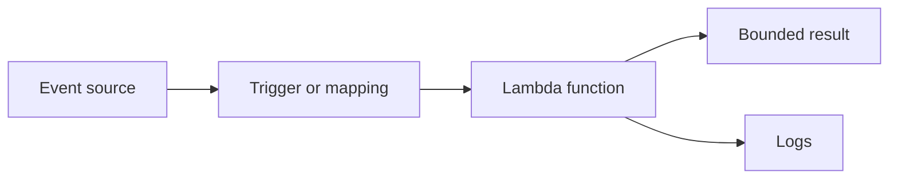

## Table of Contents

1. [The Problem](#the-problem)
2. [What Is Lambda](#what-is-lambda)
3. [Events](#events)
4. [Handlers](#handlers)
5. [Invocations](#invocations)
6. [Triggers](#triggers)
7. [Timeout And Memory](#timeout-and-memory)
8. [Retries](#retries)
9. [When A Service Is Simpler](#when-a-service-is-simpler)
10. [Sample Function Shape](#sample-function-shape)
11. [Putting It All Together](#putting-it-all-together)
12. [What's Next](#whats-next)

## The Problem

A team has a normal orders service running on ECS. It owns the checkout API, keeps database connections warm, exposes a health check, and answers many HTTP routes. That service should stay boring and predictable.

Then small jobs start gathering around it:

- A receipt email should be sent after checkout, but the user should not wait for the email provider.
- A nightly cleanup should delete old export files, but nobody wants a timer loop hidden inside the web container.
- A partner webhook needs one quick signature check before the main system trusts the payload.
- An uploaded manifest should start an export job, but no process needs to sit idle polling an empty folder all day.

You could put all of that inside the main service. Many teams do at first. The result is a service that keeps growing jobs that are not really "serve this request on this port." Some work is naturally a reaction: when this event arrives, do this bounded piece of work, then stop.

That is the useful question for Lambda: when is a function a better runtime than a service?

The answer is not "whenever you want serverless." The answer is when the job has a clear starting event, a small input contract, a bounded amount of work, and a result that does not require a process to stay alive afterward.

## What Is Lambda

AWS Lambda is compute for running function code in response to events. You package code and dependencies, choose runtime settings, and configure what is allowed to invoke the function. When an event arrives, Lambda prepares an execution environment if needed, calls your handler, and ends the invocation when the handler returns, exits, throws, or times out.

That makes Lambda feel different from an ECS service or an EC2 process. A service starts first and waits for work. A Lambda function starts because work arrived.

```text
Long-running service
  Process starts
  Process listens
  Requests arrive
  Process keeps running

Lambda function
  Event arrives
  Lambda invokes handler
  Handler finishes one job
  Invocation ends
```

This shape is powerful because idle time disappears. If no receipt messages arrive, there is no receipt worker process waiting just to find an empty queue. When messages do arrive, Lambda can create invocations to process them.

It also changes how you design. A Lambda function should usually have one specific job or purpose. It should not become a small hidden application with many routes, broad permissions, and unclear ownership. If a function grows until it needs the same shared state and routing shape as the main service, the function may be telling you it wanted to be a service all along.

## Events

An event is the input data Lambda passes to your function. In practice it is a JSON-shaped document that says what happened. The important beginner habit is to treat the event as a contract, not as a vague notification.

An API Gateway event looks like an HTTP request. An SQS event contains records from a queue. An S3 event describes a bucket and object. An EventBridge scheduled event says a rule fired. Those shapes are not interchangeable.

For example, a receipt email function might be triggered by SQS. The event is not a plain order object. It is a batch of queue records, and each record contains a message body.

```json
{
  "Records": [
    {
      "messageId": "5a6f4b79",
      "body": "{\"orderId\":\"ord_1042\",\"email\":\"maya@example.com\",\"total\":\"49.00\"}",
      "eventSource": "aws:sqs"
    }
  ]
}
```

That detail prevents a common first Lambda mistake. A developer tests the handler with `{ "orderId": "ord_1042" }`, but production sends `{ "Records": [...] }`. The code deployed correctly, the trigger worked correctly, and the function still fails because the event contract was wrong.

Write functions around the event shape they actually receive. Save realistic sample events. Validate the fields that matter before doing the irreversible work. A clear error at the edge of the handler is much easier to understand than a vague crash halfway through a retry.

## Handlers

The handler is the entry point Lambda calls in your code. In Node.js, it is commonly an exported function such as `handler`. Lambda passes the event to the handler, and many runtimes also pass a context object with information about the current invocation.

The handler setting matters because it connects configuration to code. If the configured handler is `index.handler`, Lambda looks for an exported `handler` in the `index` file. If the code exports a different name, Lambda can receive the event but fail before your real logic starts.

Keep the handler thin. Its job is to translate the platform event into the small business operation the function owns. For a receipt email job, that means reading SQS records, parsing message bodies, checking required fields, and calling the receipt sender.

The context object is not the job input. It is run metadata. The most useful beginner field is often the request ID, because it lets logs from one invocation be tied together. If a support ticket says `ord_1042`, the log line should include both `orderId=ord_1042` and the Lambda request ID so the human can follow one run.

Environment variables belong to configuration, not secrets design by habit. They are useful for values like bucket names, table names, feature flags, and log levels. AWS recommends Secrets Manager for sensitive values such as database credentials or API keys. That distinction keeps "change behavior without code" separate from "store secret material safely."

## Invocations

An invocation is one attempt to run a Lambda function. The event arrives, Lambda calls the handler, and the invocation succeeds, fails, or times out.

There are three beginner shapes to keep separate:

| Invocation shape | Who waits? | What it means |
| --- | --- | --- |
| Synchronous | The caller waits for the function response | Good for a small HTTP helper where the answer matters now. |
| Asynchronous | The caller hands the event to Lambda and does not wait for handler output | Good when the event can be processed after the sender moves on. |
| Queue-based | Lambda polls a queue or stream through an event source mapping | Good when messages should wait safely until compute is available. |

Synchronous invocation feels closest to a normal request. API Gateway can send an HTTP-shaped event to Lambda and wait for a response. If the function is slow, the caller feels that wait. If the function fails, the caller path has to turn that failure into a response.

Asynchronous invocation is a handoff. Services such as S3 can send an event to Lambda, and Lambda queues the event before running the function. The sender does not wait for the handler result. That makes the user path simpler, but it also means you need logs, retries, and destinations to understand what happened later.

Queue-based invocation is different again. With SQS, Lambda uses an event source mapping to poll the queue and invoke the function with batches. When a batch succeeds, messages can be deleted. When a batch fails, messages can become visible again after the visibility timeout. That is excellent for buffering work, but it makes duplicate-safe code part of the design, not an optional improvement.

## Triggers

A trigger is the thing that causes the function to run. The function owns the second half of the story: what to do with the event. The trigger owns the first half: where the event came from and how it reaches Lambda.



Some services directly invoke Lambda. API Gateway can invoke a function when an HTTP request reaches an endpoint. S3 can invoke a function when an object changes. SNS can invoke a function when a message is published. In this push shape, the event source sends the event to Lambda.

Queues and streams usually use event source mappings. The mapping is a Lambda resource that polls the source, gathers records into batches, and invokes your function. SQS, Kinesis, DynamoDB Streams, Amazon MQ, Amazon MSK, self-managed Kafka, and DocumentDB use this pattern.

The difference matters because "trigger" is not just a label in the console. It changes how retries, batching, and back pressure behave. A webhook helper behind API Gateway has a caller waiting. An SQS receipt worker has messages waiting in a queue. An S3 object event has an asynchronous delivery path. Those are different operating stories.

Use narrow triggers when you can. One function that accepts API Gateway events, SQS records, S3 notifications, and scheduled events has to understand four contracts. Four small functions are usually easier to test, permission, observe, and retry safely.

## Timeout And Memory

Timeout is the maximum time one invocation may run. For standard Lambda functions, AWS documents a default timeout of 3 seconds and a configurable maximum of 900 seconds, which is 15 minutes. That limit is one reason Lambda is a bounded-job runtime.

Do not treat timeout as a panic knob. If an export function times out at 3 seconds, the right answer might be a 60 second timeout. It might also be pagination, a smaller batch, a client timeout for a slow downstream API, or a service instead of a function. The setting should match realistic upper-bound work, not the tiny sample event from a happy-path test.

Memory is both capacity and performance. Lambda allocates CPU power in proportion to configured memory, so raising memory can help CPU-bound, network-bound, or library-heavy functions finish faster. That can feel odd at first: you may raise memory even when the function was not running out of memory, because the extra CPU share shortens duration.

| Setting | What it controls | Beginner question |
| --- | --- | --- |
| Timeout | How long one invocation may run | Can the largest normal event finish before this value? |
| Memory | Available memory and proportional CPU | Is duration or max memory close to the limit? |
| Handler | Which exported function Lambda calls | Does configuration match the code package? |
| Environment variables | Runtime configuration values | Are non-secret values configurable without code changes? |
| Execution role | AWS permissions available while the function runs | Does the function have only the AWS access this job needs? |
| Logs | Evidence for each invocation | Can one event be found by request ID and business ID? |

The execution environment adds one more practical detail. Lambda may reuse an environment after an invocation finishes. Objects created outside the handler can remain initialized for a later invocation in the same environment, which is useful for SDK clients and database connections. But that reuse is not guaranteed, and it should not become user state. Cache reusable clients; do not store per-user or per-event truth in global memory.

## Retries

Retries are the part of Lambda that turn temporary failures into later success. They are also the part that turns unsafe side effects into duplicates.

With asynchronous invocation, Lambda queues events before sending them to the function. If the function returns an error, AWS documents default retry behavior that can run the function again. With SQS event source mappings, messages remain in the queue while hidden by the visibility timeout. If processing fails, the messages can become visible again and be delivered in another batch.

That means the safe mental model is simple: the same event can appear more than once.

For the receipt email job, duplicate delivery can become a real user problem. If the provider accepts the email, then the function times out before recording success, the message may be retried. A second invocation can send a second receipt unless the code has a stable idempotency key such as `receipt:ord_1042`.

Idempotency means repeated attempts produce the same real-world result. The handler can check whether `receipt:ord_1042` is already complete, skip the send if it is, and log the duplicate. The exact store can vary, but the principle does not: retries are normal enough that the function must be able to see the same work twice.

Retries also shape batch design. If one bad SQS record causes the whole batch to fail, successfully processed messages may be retried with it unless you use partial batch response behavior or remove processed messages deliberately. A larger batch can improve throughput, but it can also make a single bad record affect more work. That is why batch size is an operating choice, not only a cost choice.

## When A Service Is Simpler

Lambda is not the prize for modernizing a workload. It is one runtime shape. A service is another.

Use Lambda when the work has a clear event, a bounded run, narrow permissions, and little need for shared in-memory state. Receipt email, export file generation, webhook verification, thumbnail creation, and scheduled cleanup often fit this shape.

Use a service when the workload wants to stay alive. The main orders API listens for many routes, keeps connection pools, exposes health checks, manages shared middleware, and serves user traffic all day. That shape is usually clearer as ECS, EC2, or another long-running runtime.

| Question | Function-shaped answer | Service-shaped answer |
| --- | --- | --- |
| How does work start? | One event arrives | The process waits for ongoing traffic |
| How long does it run? | Bounded seconds or minutes | Long-running or open-ended |
| What state does it need? | Input event plus durable stores | Shared process state, pools, caches, routing |
| How is it observed? | Logs and metrics per invocation | Service logs, health checks, task state, load balancer status |
| What failure repeats? | Retry, duplicate event, timeout, bad payload | Unhealthy task, bad deploy, connection pool, overloaded service |

The fastest test is the job sentence. "When an SQS message arrives, send one receipt email" sounds like a function. "Keep the orders API online and answer checkout, account, export, and admin routes" sounds like a service.

## Sample Function Shape

Here is a small Node.js handler shape for the receipt email job. The code is intentionally ordinary. Lambda is not asking you to write magic code. It is asking you to make the event boundary clear.

```js
export const handler = async (event, context) => {
  const processed = [];

  for (const record of event.Records ?? []) {
    const message = JSON.parse(record.body);

    if (!message.orderId || !message.email || !message.total) {
      throw new Error(`bad receipt message ${record.messageId}`);
    }

    const idempotencyKey = `receipt:${message.orderId}`;
    const alreadySent = await receiptStore.exists(idempotencyKey);

    if (alreadySent) {
      console.info("receipt skipped", {
        orderId: message.orderId,
        messageId: record.messageId,
        requestId: context.awsRequestId
      });
      continue;
    }

    await sendReceiptEmail({
      orderId: message.orderId,
      email: message.email,
      total: message.total
    });

    await receiptStore.markComplete(idempotencyKey);
    processed.push(message.orderId);
  }

  return { processed };
};
```

The important parts are not the library names. The handler accepts the real SQS event shape. It validates the message before doing work. It uses a stable idempotency key before the side effect. It logs with both business and invocation identifiers. It returns only after the bounded job is done.

In a production function, the store, email client, and logger would be real modules with tests. The article's point is the shape: receive one event contract, do one bounded job, make retries safe, and leave evidence.

## Putting It All Together

The orders service did not need every supporting job inside the web container. It needed the right runtime for each kind of work.

Lambda fits the jobs that start from an event and finish without staying alive. The receipt worker starts from an SQS message. The cleanup job starts from a schedule. The webhook helper starts from an HTTP event and returns quickly. The export generator starts from a request record or queue message and writes a file.

The design becomes easier to explain when each Lambda function has a narrow contract:

- The event says what happened.
- The handler translates that event into one job.
- The invocation is one attempt to run that job.
- The trigger or event source mapping controls how events reach the function.
- Timeout and memory set the bounds for one run.
- Retries are expected, so side effects need idempotency.
- A long-running service remains the right home for work that wants to listen, share process state, and stay healthy between requests.

That closes the opening question. A function is a better runtime than a service when the work is event-shaped and bounded. A service is simpler when the work is continuous, stateful, route-heavy, or operationally easier to understand as one long-running process.

## What's Next

Lambda solves one compute shape, but it does not remove the rest of application hosting. Most real AWS systems use several shapes together: virtual machines for direct control, containers for long-running services, managed platforms for web apps, and functions for event reactions.

The next step is to connect compute choices back to the application architecture. Once you can name the runtime shape, the design questions get sharper: which component owns the request path, which component owns background work, where does state live, and which failure should each runtime be prepared to handle?

---

**References**

- [How Lambda works](https://docs.aws.amazon.com/lambda/latest/dg/concepts-basics.html). Supports the explanation of Lambda functions, handlers, events, execution environments, runtimes, and the function-as-one-purpose mental model.
- [Define Lambda function handler in Node.js](https://docs.aws.amazon.com/lambda/latest/dg/nodejs-handler.html). Supports the handler, event object, context argument, handler naming, global-state reuse, environment-variable access, and idempotent-code guidance used in the article.
- [Invoke](https://docs.aws.amazon.com/lambda/latest/api/API_Invoke.html). Supports the distinction between synchronous and asynchronous invocation, invocation payload behavior, and the claim that retry behavior varies by invocation type and event source.
- [Invoke a Lambda function synchronously](https://docs.aws.amazon.com/lambda/latest/dg/invocation-sync.html). Supports the explanation that synchronous invocation waits for the function response and returns function output or errors to the caller path.
- [Invoking a Lambda function asynchronously](https://docs.aws.amazon.com/lambda/latest/dg/invocation-async.html). Supports the explanation that asynchronous invocation queues the event and returns without waiting for handler output.
- [How Lambda processes records from stream and queue-based event sources](https://docs.aws.amazon.com/lambda/latest/dg/invocation-eventsourcemapping.html). Supports the event source mapping, polling, batching, direct-trigger comparison, duplicate-processing, and batch retry explanations.
- [Using Lambda with Amazon SQS](https://docs.aws.amazon.com/lambda/latest/dg/with-sqs.html). Supports the SQS-specific polling, batching, message deletion, visibility timeout, duplicate-processing, and partial-batch discussion.
- [Invoke a Lambda function on a schedule](https://docs.aws.amazon.com/lambda/latest/dg/with-eventbridge-scheduler.html). Supports the EventBridge Scheduler examples for scheduled cleanup work.
- [Configure Lambda function timeout](https://docs.aws.amazon.com/lambda/latest/dg/configuration-timeout.html). Supports the timeout definition, 3 second default, 900 second maximum, and recommendation to test with realistic upper-bound inputs.
- [Configure Lambda function memory](https://docs.aws.amazon.com/lambda/latest/dg/configuration-memory.html). Supports the memory range, proportional CPU allocation, and memory-as-performance-lever explanation.
- [Understanding the Lambda execution environment lifecycle](https://docs.aws.amazon.com/lambda/latest/dg/lambda-runtime-environment.html). Supports the initialization, invocation, cold start, environment reuse, and static initialization discussion.
- [Working with Lambda environment variables](https://docs.aws.amazon.com/lambda/latest/dg/configuration-envvars.html). Supports environment variables as version-specific configuration, literal string behavior, reserved variables, and the recommendation to use Secrets Manager for sensitive values.
- [Defining Lambda function permissions with an execution role](https://docs.aws.amazon.com/lambda/latest/dg/lambda-intro-execution-role.html). Supports the execution role and least-privilege permission explanation.
- [Sending Lambda function logs to CloudWatch Logs](https://docs.aws.amazon.com/lambda/latest/dg/monitoring-cloudwatchlogs.html). Supports the default CloudWatch Logs behavior, default log group shape, and required logging permissions.
