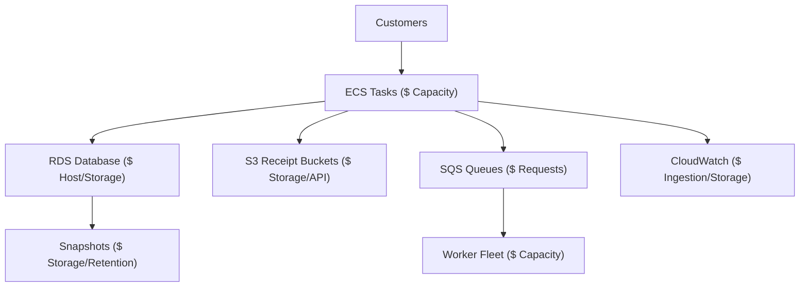

## Table of Contents

1. [The Cost Review Crisis](#the-cost-review-crisis)
2. [Cost and Resilience as a Paired Equation](#cost-and-resilience-as-a-paired-equation)
3. [The Five Primary Cost Shapes](#the-five-primary-cost-shapes)
4. [The Five Primary Resilience Shapes](#the-five-primary-resilience-shapes)
5. [The Capacity Trap: Headroom vs. Waste](#the-capacity-trap-headroom-vs-waste)
6. [The Boring Efficiency of Waste Removal](#the-boring-efficiency-of-waste-removal)
7. [The Cost vs. Resilience Tradeoff Map](#the-cost-vs-resilience-tradeoff-map)
8. [Putting It All Together](#putting-it-all-together)
9. [What's Next](#whats-next)

## The Cost Review Crisis

Your application service, `devpolaris-orders-api`, is fully live. The service controller is running, configuration parameters are isolated, telemetry alarms are active, and deployment pipelines are green. The engineering team can build, observe, and adjust the system cleanly.

Then, the monthly cost review meeting arrives. An executive points out that AWS spending has risen by 40% and demands immediate, aggressive cuts. The engineering team, under pressure to reduce the invoice immediately, executes several quick cost-saving cuts:

* They reduce the ECS desired task count from four to two.
* They delete several old database backups and snapshots.
* They shorten CloudWatch Logs storage retention to three days.
* They scale background workers down to a single instance.

Two days later, a database lock contention occurs. Responders open the logging console but find no historical tracebacks because logs were pruned. Active checkouts crash immediately because Fargate has zero task headroom to absorb the connection blip, and the background workers fall behind on millions of pending receipt emails. 

The immediate cost savings created a massive production outage. Cost and resilience are permanently paired. Most architectural protection costs money, and most cost cuts remove some form of operational insurance.

## Cost and Resilience as a Paired Equation

Cost is the total financial spend required to provision running capacity, transfer data, store backups, and retain operational evidence. Resilience is your application's physical ability to keep serving transactions or recover cleanly to a usable state after an infrastructure failure.

At a high level, cost is the spend model for your AWS architecture, while resilience is the failure-behavior model that spend supports. You review them together because reducing a bill often changes capacity, recovery, evidence retention, or isolation.

To operate successfully in the cloud, you must replace the vague question *How do we make AWS cheaper?* with a precise paired equation:

```text
What specific failure does this active AWS spend protect our customers against?
```

A spare ECS task looks like idle waste on a quiet Sunday afternoon, but it represents vital availability headroom if one task crashes during a heavy Monday morning deployment. A stored database snapshot appears as redundant storage cost until a faulty database migration corrupts your core tables. 

To make cost management safe, every line item on the AWS invoice must be evaluated as an active investment in a specific reliability outcome.

Let us map the cost and resilience boundaries of our orders api:



## The Five Primary Cost Shapes

AWS resources bill teams using different pricing structures. Recognizing the cost shape is the first step in deciding what evidence to analyze:

A cost shape is the billing behavior behind a resource. It tells you whether spend grows with time, usage, storage, support traffic, or recovery protection.

* **Running Capacity (Fixed-Time Charge)**: Resources that bill a flat rate per hour while provisioned, regardless of actual work processed. Examples include RDS instance hours, ECS Fargate task allocations, and active NAT Gateways.
* **Usage Volume (Transaction Charge)**: Charges driven entirely by application activity. Examples include Lambda execution counts, SQS request APIs, and data transfer rates between Availability Zones.
* **Storage Growth (Accumulating Charge)**: Spending that increases continuously over time as files accumulate. Examples include S3 object storage, EBS volumes, and RDS databases.
* **Hidden Support (Quiet Aggregators)**: Auxiliary services that grow behind the scenes. Examples include log delivery streams, CloudWatch Logs ingestion, and NAT Gateway data processing fees.
* **Recovery Options (Insurance Charge)**: The cost of maintaining secondary recovery points. Examples include AWS Backup vaults, database snapshots, and cross-Region replication volumes.

One service often contains multiple cost shapes. Amazon S3 bills for object storage size (Storage Growth), PUT/GET API transactions (Usage Volume), and cross-Region replication paths (Recovery Options). Treating "S3 is expensive" as a single problem is too blunt. You must optimize the specific cost shape driving the invoice.

## The Five Primary Resilience Shapes

Just as spending has different shapes, your reliability design is partitioned into five distinct resilience shapes:

A resilience shape is the specific failure-handling capability a design buys. It names whether the system is paying for redundancy, spare capacity, isolation, recovery points, or diagnostic evidence.

* **Redundancy**: Running multiple physical replicas of a component so that one instance can fail completely without severing the user route. Examples include Multi-AZ databases and multi-task ECS services.
* **Headroom**: Maintaining spare capacity to absorb traffic surges, transactional blips, and deployment overlaps without performance degradation.
* **Isolation**: Partitioning resources so that a failure in one service boundary cannot cascade and crash adjacent systems. Examples include separate SQS queues and microservice network borders.
* **Recovery Points**: Preserving chronological copies of state to enable recovery from bad writes, accidental deletions, or database corruptions. Examples include RDS Point-in-Time Recovery (PITR) logs.
* **Evidence**: Retaining the logs, metrics, and trace profiles required to diagnose active incidents.

Every resilience shape requires financial investment. Redundancy increases running capacity hours. Headroom leaves vCPUs idle. Recovery points accumulate storage fees. Evidence drives CloudWatch ingestion costs. Operating a safe cloud environment means balancing these insurance costs against verified business risk.

## The Capacity Trap: Headroom vs. Waste

Headroom and waste can look identical on a quiet system graph. If you open CloudWatch at 2 a.m. and find your application tasks operating at 5% CPU utilization, a naive cost review will declare the idle capacity to be waste and demand immediate downsizing.

Headroom is intentionally unused capacity reserved for failure absorption, deployment overlap, or traffic spikes. Waste is unused capacity or storage with no verified workload, owner, or recovery purpose.

This is the capacity trap. In an ECS cluster, that low-activity headroom protects several critical operations:

* **Task Failure Absorption**: If your service runs four tasks and one process crashes, the remaining three tasks must absorb the traffic spike instantly without saturating their own CPU and memory limits.
* **Deployment Overlap**: During a rolling update, the orchestrator starts fresh tasks and waits for health checks before stopping the old ones. The cluster requires sufficient capacity headroom to run both versions simultaneously.
* **Flash Surges**: Real traffic is not a smooth average; it spikes instantly when marketing emails are broadcast or user cohorts log in.

Useful Headroom vs. Idle Waste:

| Operational Dimension | Useful Headroom | Idle Waste |
| :--- | :--- | :--- |
| **ECS Task count** | Running four tasks when three are required, protecting deployment overlap and task failure margins. | Running twelve tasks because the scaling cooldown is set too long, leaving vCPUs idle for weeks. |
| **RDS Instance Class** | Provisioning a `db.m6g.xlarge` to ensure nightly export jobs complete within the batch window. | Provisioning a `db.r6g.2xlarge` because a developer forgot to delete a temporary load testing database. |
| **S3 Snapshot Storage** | Retaining 30 days of daily backups to meet verified compliance and disaster recovery targets. | Retaining thousands of un-lifecycle-expired snapshots from a testing environment deleted last year. |


*Quiet utilization does not prove waste. Some idle-looking capacity protects task failures, deployment overlap, and traffic spikes; other idle resources are true waste only after the team proves they serve no active purpose.*

## The Boring Efficiency of Waste Removal

Waste is any cloud spending that does not serve a measured workload, support operational evidence checks, or satisfy a verified recovery target.

Waste removal is the safest form of cost optimization because it targets resources that have no active operational contract. The goal is to delete or lifecycle only what the team can prove is unused.

The safest cost-saving actions are completely boring:
* **Shutdown Dev Environments**: Write automated shell scripts to scale staging ECS desired counts to zero during weekends and non-business hours, eliminating fixed-time running capacity hours when developers are offline.
* **Enforce Storage Lifecycles**: Apply strict S3 lifecycle rules to transition temporary exports or build logs to S3 Glacier storage classes or deletion paths after a set period.
* **Audit Orphaned Resources**: Delete unattached EBS volumes, forgotten snapshots, and unused load balancers.

The practical rule: never delete or downsize a resource unless you can prove exactly who owns it, what business purpose it serves, and what recovery strategy it supports.

## The Cost vs. Resilience Tradeoff Map

To operate a reliable AWS environment, every cost-saving decision must be treated as an operational trade. Operators must document the saved cost, the reliability risk, the required verification metrics, and the precise rollback plan:

A cost-resilience tradeoff map is a change record for infrastructure economics. It connects the proposed saving to the reliability capability being reduced, the metrics that must stay healthy, and the exact reversal path.

Cost vs. Resilience Tradeoff Map:

| Planned Decision | Cost Shape Reduced | Resilience Risk Created | Required Verification Metrics | Backup Rollback Target |
| :--- | :--- | :--- | :--- | :--- |
| **Reduce ECS desired count** | Running Capacity (Fargate hourly fees). | Less headroom to absorb task failures or deployment overlaps. | `CPUUtilization`, `MemoryUtilization`, ALB `HTTPCode_Target_5XX_Count`. | Restore desired count to original value via CLI. |
| **Downsize RDS Instance Class** | Running Capacity (Database hourly fees). | Slower query executions, higher CPU saturation during batch windows. | RDS `CPUUtilization`, `DatabaseConnections`, `ReadLatency`. | Modify database back to original instance class. |
| **Shorten CloudWatch retention** | Storage Growth (Log storage accumulation). | Lost historical evidence during post-mortem incident reviews. | Log group storage volume, incident timeline search logs. | Revert log retention parameter to original duration. |
| **Apply S3 lifecycle rules** | Storage Growth (S3 object storage fees). | Accidental deletion of compliance or customer-required files. | S3 bucket object count, prefix-specific access age trends. | Recover objects from S3 versions or backup vault. |
| **Enable Database PITR** | Recovery Option (Snapshot storage fees). | Requisite backup cost; higher baseline storage fees. | Database RPO targets, successful restore drill logs. | Keep enabled; PITR is non-negotiable for system of record. |

This tradeoff map is the core of professional cloud operations. It ensures that every cost-saving change is rolled out with clear risk boundaries, explicit metrics, and an active rollback target ready to be executed if performance degrades.

## Putting It All Together

Cost and reliability are paired dimensions of the same architectural system:

* **Unify Cost and Reliability**: Treat every AWS line item as a deliberate investment in a specific operational safety outcome.
* **Identify the Cost Shape**: Analyze whether spending is driven by running capacity, transaction volume, storage growth, hidden support, or recovery options.
* **Protect Availability Headroom**: Maintain sufficient compute task margin to absorb task restarts and deployment overlaps, avoiding the capacity trap.
* **Target Boring Waste First**: Focus cost-saving efforts on shutting down idle dev servers and purging unattached block volumes.
* **Document Every Trade**: Maintain a strict tradeoff map for every resource change, defining metrics, risks, and recovery targets before executing changes.

## What's Next

We have established the paired equation of cost and resilience, mapping the balance between spending and reliability. In the next article, we will go deep into cost visibility. We will detail how to configure cost allocation tags, navigate Cost Explorer trends, set up AWS Budgets alerts, and execute terminal CLI sessions to query billing data.


*Use this as the cost and resilience map: identify the cost shape, name the resilience shape it buys, protect real headroom, remove proven waste, document each tradeoff, and keep the rollback plan close.*

---

**References**

* [AWS Well-Architected Framework: Cost Optimization Pillar](https://docs.aws.amazon.com/wellarchitected/latest/framework/a-cost-optimization.html) - AWS guide to delivering business value at the lowest price.
* [AWS Well-Architected Framework: Reliability Pillar](https://docs.aws.amazon.com/wellarchitected/latest/framework/a-reliability-pillar.html) - Documentation on designing resilient cloud systems.
* [AWS Cost Explorer Documentation](https://docs.aws.amazon.com/cost-management/latest/userguide/ce-what-is.html) - Technical reference for analyzing billing trends.
* [Defining Recovery Objectives](https://docs.aws.amazon.com/wellarchitected/2022-03-31/framework/rel_planning_for_recovery_objective_defined_recovery.html) - AWS guide to setting downtime and data loss boundaries.
