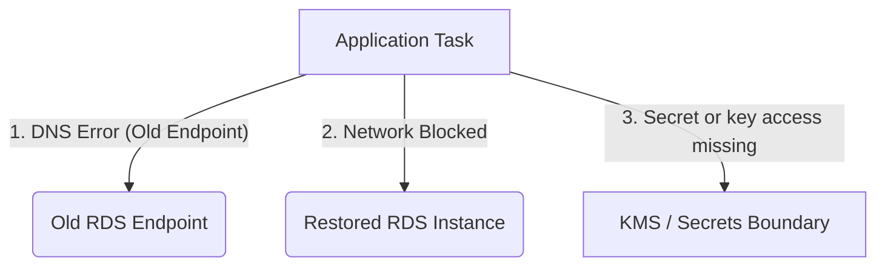
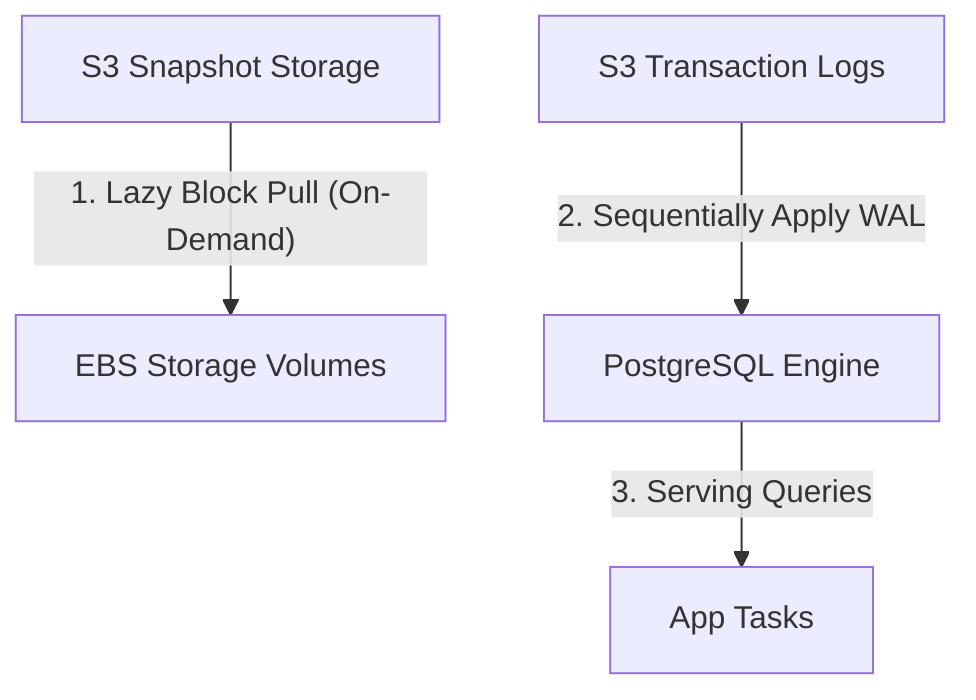
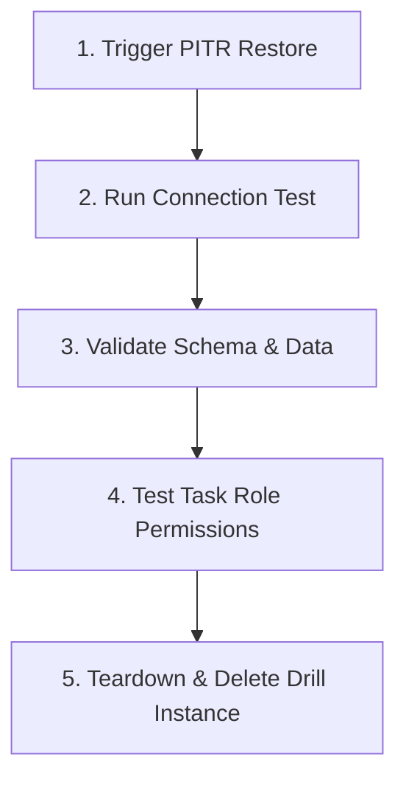

## Table of Contents

1. [The Untested Restore Illusion](#the-untested-restore-illusion)
2. [Decoding the Targets: RTO and RPO](#decoding-the-targets-rto-and-rpo)
3. [The Disaster Recovery Ladder](#the-disaster-recovery-ladder)
4. [Rebuilding State: Point-in-Time Recovery Walkthrough](#rebuilding-state-point-in-time-recovery-walkthrough)
5. [Under-the-Hood: Lazy Block Restores and WAL Replay](#under-the-hood-lazy-block-restores-and-wal-replay)
6. [Designing a Resilient Storage Architecture](#designing-a-resilient-storage-architecture)
7. [The Recovery Drill Blueprint](#the-recovery-drill-blueprint)
8. [Putting It All Together](#putting-it-all-together)
9. [What's Next](#whats-next)

## The Untested Restore Illusion

When developing applications on your local workstation, database backups are rarely a concern. If your database state becomes corrupted, you run a single migrations script, reset the local container disk, or import a SQL dump. The database runs on the same physical loopback interface, uses static credentials, and is immediately accessible by your application process.

In a distributed cloud environment, this simple localhost recovery assumption breaks down completely. Backups are highly complex processes that run across isolated networks, IAM boundaries, and regional compute environments. If a buggy software deployment corrupts your production database, having millions of snapshots stored in AWS Backup vaults does not mean your application is online or recoverable.

Consider an engineering team that suffered a serious data corruption event. A broken background worker spent three hours writing empty user receipts to an Amazon S3 bucket while dropping database columns in Amazon RDS. The team quickly located the latest daily database snapshot and clicked the restore button in the AWS console. The console reported that the restore completed successfully, but the application remained down. 

The recovery failed because of three critical operational blind spots:



First, the restored database was created with a brand-new, dynamically generated DNS endpoint. The application task was still configured to query the old, corrupted RDS hostname, resulting in connection timeouts. Second, the newly restored database instance did not inherit the custom security group rules of the old database, blocking all network traffic from the ECS cluster. Third, the restored environment's secret and key path was incomplete: the application still needed a valid database credential in Secrets Manager, and any customer managed KMS keys used for secrets or cross-account snapshot restore needed the right policies. The application task does not decrypt RDS storage blocks itself, but recovery still fails if the surrounding secret, key, and network permissions are not rebuilt.

A backup vault only proves that you are compiling data storage bills. A verified recovery plan is the only evidence that your application can successfully resume serving users after a disaster.

## Decoding the Targets: RTO and RPO

To build an effective recovery plan, you must first define your operational recovery targets. Rather than aiming for immediate recovery (which carries extreme infrastructure costs), you establish realistic boundaries based on two industry-standard metrics:

Recovery Time and Point Coordinates:

| Target Metric | Definition | Plain-English Question | Operational Focus |
| :--- | :--- | :--- | :--- |
| **RTO** (Recovery Time Objective) | The maximum acceptable duration of service downtime before severe business impact. | How long can the system be offline before customers leave? | Compute provisioning, DNS propagation, and verification speed. |
| **RPO** (Recovery Point Objective) | The maximum acceptable age of data that can be lost due to a system failure. | How many minutes of customer writes can we afford to lose? | Data replication frequency, snapshot schedules, and log retention. |

RTO and RPO are business decisions, not engineering defaults. An aggressive 1-minute RTO requires automated multi-region active failover and continuous compute resources, multiplying your baseline AWS bills. A looser 4-hour RTO allows you to recreate infrastructure using Infrastructure as Code (IaC) templates and restore databases from daily snapshots, reducing steady-state costs to a fraction.

A major Gotcha is data asymmetry. Different data classes within the same application should have different RTO and RPO targets. Your customer order records might demand a tight 15-minute RPO to prevent lost transaction revenue, whereas application logs or temporary report exports can accept a 24-hour RPO. Treating all data as equally critical forces you to pay for expensive replication pipelines on resources that have zero real-time business value.

## The Disaster Recovery Ladder

AWS categorizes recovery patterns into four major strategies. As you climb this disaster recovery ladder, RTO and RPO shrink, while baseline operational cost and infrastructure complexity scale exponentially.

Disaster Recovery Tradeoff Matrix:

| Recovery Strategy | Target RTO | Target RPO | Baseline Cost | Compute State | Operational Complexity |
| :--- | :--- | :--- | :--- | :--- | :--- |
| **Backup and Restore** | Hours | 24 Hours | **Lowest** | Scaled to Zero | Low (Manual/Scripted Restore) |
| **Pilot Light** | Tens of Minutes | Minutes | **Low-Medium** | Core Database Replicas Only | Medium (Compute Bootstrapping) |
| **Warm Standby** | Minutes | Minutes | **Medium-High** | Scaled-Down Running Fleet | High (Traffic Switch and Scaling) |
| **Active-Active** | Near Zero | Near Zero | **Highest** | Full Scale in Multiple Sites | Extreme (Multi-Write Routing) |

### Backup and Restore

This is the baseline tier of the ladder. You run zero active compute or database resources in a secondary recovery site. Instead, you write continuous snapshots to AWS Backup vaults or regional S3 buckets. 

During an outage, you must rebuild the entire stack from scratch: provisioning a new VPC, deploying ECS containers via CloudFormation or Terraform, restoring database snapshots, and updating Route 53 DNS records. While cost-effective, this pattern carries the longest RTO because you must wait for physical AWS hardware provisioning and database volume initialization.

### Pilot Light

In a Pilot Light architecture, the core data infrastructure is kept running and continuously synchronized in a secondary AWS Region, while compute and application layers are configured but not running. 

For example, a read replica of your Amazon RDS database is continuously updated in the recovery region. The application's ECS task definitions, Auto Scaling groups, and load balancers are fully configured, but the desired task count is set to zero. During a disaster, you promote the RDS read replica to a standalone database and scale the ECS task count from zero to production levels. This saves significant compute costs while keeping recovery times to tens of minutes.

### Warm Standby

Warm Standby keeps a minimally scaled, fully functional copy of your application running in the secondary recovery region at all times. 

The backup environment has active application containers and a secondary database cluster serving live health check traffic. If the primary region fails, you adjust your Route 53 DNS routing policies to send user traffic to the secondary load balancer while triggering Auto Scaling policies to expand the warm standby containers to full capacity. This provides a very low RTO at the expense of maintaining continuously running compute resources.

### Multi-Site Active-Active

The most advanced and expensive recovery pattern. You run full-scale production environments in two or more AWS Regions simultaneously, with user traffic distributed across both sites using latency-based or geoproximity Route 53 routing. 

Data replication depends heavily on the database. DynamoDB Global Tables can support multi-Region writes with conflict rules. Amazon Aurora Global Database is usually designed around one primary writer region with fast cross-Region replication and secondary regions that can be promoted during a disaster, not casual active-active multi-writer updates. If one region suffers an outage, Route 53 health checks or another traffic-management layer can steer new traffic away from the failed site, subject to health check timing and DNS behavior. Because both environments are already running at full capacity, RTO can be very low, but RPO and conflict behavior depend on the data store and application design.

The primary trap of Active-Active is write conflicts. If your application logic is not specifically designed to handle concurrent bi-directional writes across global distances, you will suffer severe data corruption when the same user record is modified in two regions simultaneously.

## Rebuilding State: Point-in-Time Recovery Walkthrough

When database corruption occurs due to a faulty application release or malicious write, standard daily backups are insufficient. If your last snapshot was taken at midnight and the corruption happened at 2:15 p.m., restoring that midnight snapshot would lose 14 hours of valid customer orders. 

To solve this, you use Amazon RDS Point-in-Time Recovery (PITR). PITR combines daily automatic snapshots with transaction logs archived by RDS, allowing you to restore a database near a chosen timestamp within your retention window, subject to the latest restorable time for that engine.

Let us execute a terminal session to restore a corrupted production database to a clean state just before a bad migration ran:

```bash
$ aws rds restore-db-instance-to-point-in-time \
    --source-db-instance-identifier "production-orders-db" \
    --target-db-instance-identifier "restored-orders-db-temp" \
    --restore-time "2026-05-26T14:14:59Z" \
    --no-publicly-accessible \
    --db-subnet-group-name "prod-database-subnet-group" \
    --vpc-security-group-ids "sg-08a7b6c5d4e3f2g1"
```

This terminal execution instructs the RDS control plane to provision a new database instance using historical state data:

```json
{
  "DBInstance": {
    "DBInstanceIdentifier": "restored-orders-db-temp",
    "DBInstanceClass": "db.m6g.xlarge",
    "DBInstanceStatus": "creating",
    "Engine": "postgres",
    "EngineVersion": "15.4",
    "Endpoint": {
      "Address": "restored-orders-db-temp.c123456789.eu-west-2.rds.amazonaws.com",
      "Port": 5432
    },
    "LatestRestorableTime": "2026-05-26T21:05:00Z",
    "PubliclyAccessible": false,
    "StorageEncrypted": true,
    "KmsKeyId": "arn:aws:kms:eu-west-2:111122223333:key/a1b2c3d4-e5f6-7a8b-9c0d-1e2f3a4b5c6d"
  }
}
```

Every returned parameter provides critical recovery evidence:

* `DBInstanceStatus`: The database is in the `creating` state. Point-in-time recovery does not overwrite the existing database; it provisions an entirely new, isolated resource to protect your active data.
* `Endpoint.Address`: The newly allocated, temporary DNS endpoint. Your application tasks cannot connect to this instance until you update your configuration parameters or swap the DNS record.
* `KmsKeyId`: The Key Management Service key used by RDS to secure the storage volume. Your application tasks do not decrypt database storage directly, but the restore must be allowed to use the key, and any Secrets Manager values your app reads may have their own KMS permission requirements.
* `LatestRestorableTime`: The newest point in time that the transaction logs can currently recover.

## Under-the-Hood: Lazy Block Restores and WAL Replay

To execute recovery successfully, you must understand the physical storage mechanisms that occur during an Amazon RDS restore. When you execute `restore-db-instance-to-point-in-time`, the AWS control plane does not wait for gigabytes of data to copy before marking the database online. Doing so would result in hours of RTO downtime.

Instead, the recovery engine performs a two-stage process:



### Stage 1: Lazy Block Allocation

The RDS control plane provisions new, empty Elastic Block Store (EBS) volumes and configures them to point directly at the metadata index of your selected S3 database snapshot. The database instance is marked as `available` almost immediately because the metadata configuration is fast.

However, the raw data blocks are still residing inside S3. When your application tasks send their first read queries to the restored database, the EBS volume intercepts the request, detects that the requested block is missing from local disk, and pulls that specific block dynamically from S3. 

This lazy block loading introduces a significant read latency penalty (known as the "first-touch penalty") during the first few hours of recovery. If you instantly route heavy production traffic to a newly restored database, your application container tasks will saturate their connection pools and crash due to database read timeouts.

### Stage 2: Write-Ahead Log (WAL) Replay

To satisfy your exact target restore second, the RDS engine launches the database process in a recovery mode. It mounts the lazy EBS blocks, then sequentially pulls the Write-Ahead Logs (WAL) generated by your database engine from secure S3 transaction storage. 

The engine replays these logs step-by-step, applying insert, update, and delete transactions that occurred between the snapshot creation and your target `--restore-time`. Once transaction replay reaches the requested restore point, the engine finalizes the database state and marks the instance ready for active connections.

## Designing a Resilient Storage Architecture

Data recovery is not limited to database instances. If your orders service stores transaction receipts, customer invoices, or static assets inside Amazon S3, you must design S3 for recovery before a corruption event occurs.

Standard Amazon S3 buckets are highly durable, but they are not immune to user errors. If a developer runs an un-tested cleanup script that performs a bulk delete on your production bucket, S3 will execute the command instantly.

To protect your object storage, you must configure three core features:

S3 Resilience Layer:

| S3 Feature | Operational Mechanism | Recovery Job |
| :--- | :--- | :--- |
| **S3 Versioning** | Retains multiple versions of an object under the same key. A delete operation merely adds a temporary "delete marker." | Allows you to recover from accidental deletions or overwrites by removing the delete marker. |
| **S3 Lifecycle Rules** | Automatically transitions or deletes object versions after a defined number of days. | Prevents ballooning storage bills by cleaning up old, non-current versions. |
| **S3 Object Lock** | Prevents protected object versions from being deleted or overwritten until the retention period or legal hold allows it. | Provides stronger write-once-read-many protection for critical archives and compliance records. |

MFA Delete exists, but it is awkward as a general recovery pattern. Only the root user can enable it, it cannot be enabled from the console, and S3 lifecycle configurations are not supported on buckets configured with MFA Delete. For most beginner production designs, S3 Versioning plus Object Lock on the buckets that need write-once protection is the clearer model.

If S3 Versioning is disabled, a delete operation permanently erases the physical data blocks from the AWS storage grid. Enabling versioning is your primary insurance policy against human error in object storage.

## The Recovery Drill Blueprint

The worst time to test your disaster recovery plan is during a real outage. To guarantee that your recovery targets can be met, you must run regular, non-disruptive recovery drills. A recovery drill is a simulated restoration that tests the entire application path without interrupting your live production traffic.

Use this operational blueprint to execute a complete recovery drill for your orders service:



### 1. Trigger PITR Restore
Restore your production database to a temporary drill instance (`drill-orders-db`) using a restore target time from one hour ago. Ensure that you apply the staging or drill security groups, not the production groups, to prevent network crossover.

### 2. Run Connection Test
Deploy a temporary ECS test task configured with your active orders container image. Set the `DATABASE_URL` environment variable to point to the temporary drill database endpoint. 

### 3. Validate Schema and Data
Run a suite of read-only integration tests against the drill endpoint. Verify that the schema is correct, active order records are readable, and the returned database metrics match your expectations.

### 4. Test Task Role Permissions
Verify that the test task can write temporary records to S3 and read encrypted values from Systems Manager Parameter Store or Secrets Manager. This proves that your application's task role can access the surrounding runtime dependencies and secret KMS keys needed to connect to the restored environment.

### 5. Teardown and Delete
Once the validation checks pass, document the actual time taken from the start of the restore to the final successful integration test (this is your verified RTO). Finally, execute the teardown command:

```bash
$ aws rds delete-db-instance \
    --db-instance-identifier "restored-orders-db-temp" \
    --skip-final-snapshot
```

This teardown execution prevents billing leaks by ensuring that temporary restored resources are not left running overnight.

## Putting It All Together

Operating a resilient cloud system requires transitioning from simple backups to verified recovery plans:

* **Eliminate Backup Assumptions**: Recognize that having snapshots stored in a vault is useless unless you have tested the network, DNS, and IAM permission pathways needed to connect your application to them.
* **Establish Clear Metrics**: Define explicit RTO (downtime limit) and RPO (data-loss limit) targets based on business needs and data classification.
* **Match Strategy to Budget**: Select the appropriate recovery tier along the disaster recovery ladder—balancing the low cost of Backup and Restore against the near-zero downtime of Active-Active.
* **Leverage Point-in-Time Recovery**: Use Amazon RDS PITR to recover from application corruption events by replaying logs near the chosen restore timestamp.
* **Understand the Performance Impact**: Plan for the lazy block loading first-touch latency penalty on newly restored EBS volumes, avoiding instant production traffic routing.
* **Enforce Storage Resilience**: Enable S3 Versioning and use S3 Object Lock where retention rules require protected object versions. Be cautious with MFA Delete because it conflicts with lifecycle-managed buckets.
* **Validate with Drills**: Conduct scheduled, end-to-end recovery drills to measure actual RTO against your target objectives, tearing down test resources immediately to avoid billing leaks.

## What's Next

We have completed our comprehensive review of AWS Cost and Resilience. We have built a robust mental model for cost versus reliability tradeoffs, established deep visibility using tags and budgets, optimized resources via compute and database rightsizing, and defined a rigorous recovery planning strategy. 

In the next module, we will pivot to dynamic application orchestration. We will dive deep into container architectures, detailing how to package applications, construct multi-stage Dockerfiles, manage local images, and configure local container networking environments.

---

**References**

* [AWS Well-Architected Reliability Pillar: Recovery Planning](https://docs.aws.amazon.com/wellarchitected/latest/framework/rel_planning_for_recovery.html) - Technical guidelines for establishing recovery strategies.
* [Disaster Recovery Options in the Cloud](https://docs.aws.amazon.com/whitepapers/latest/disaster-recovery-workloads-on-aws/disaster-recovery-options-in-the-cloud.html) - Detailed architectural whitepaper on the DR ladder.
* [Amazon RDS Point-in-Time Recovery Documentation](https://docs.aws.amazon.com/AmazonRDS/latest/UserGuide/USER_PIT.html) - Reference for restoring database instances.
* [Amazon S3 Versioning User Guide](https://docs.aws.amazon.com/AmazonS3/latest/userguide/Versioning.html) - Core concepts for protecting S3 bucket object assets.
* [Amazon S3 Object Lock](https://docs.aws.amazon.com/AmazonS3/latest/userguide/object-lock.html) - Documents retention modes, legal holds, and write-once-read-many protection for object versions.
* [Configuring MFA Delete](https://docs.aws.amazon.com/AmazonS3/latest/userguide/MultiFactorAuthenticationDelete.html) - Documents MFA Delete limitations, including root-user setup and lifecycle incompatibility.
* [AWS Backup Developer Guide](https://docs.aws.amazon.com/aws-backup/latest/devguide/whatisbackup.html) - Centralized backup vault and policy management reference.
