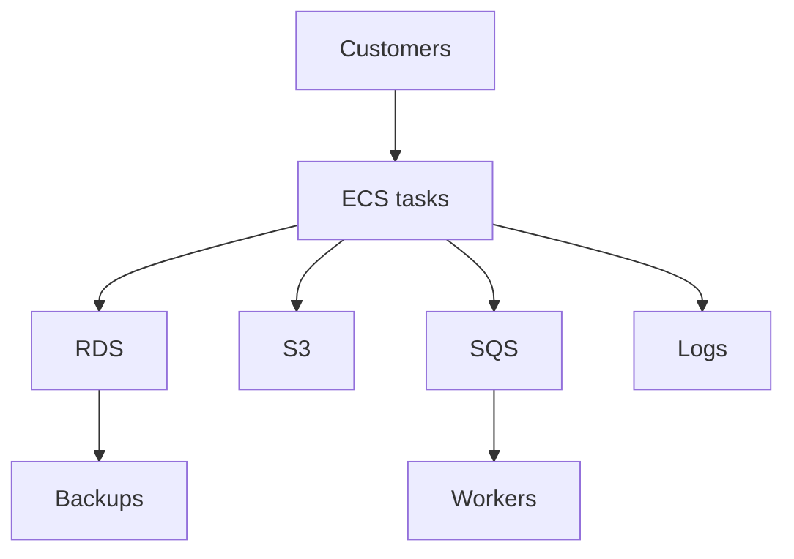

## Table of Contents

1. [The Problem](#the-problem)
2. [What Is Cost And Resilience](#what-is-cost-and-resilience)
3. [Cost Shapes](#cost-shapes)
4. [Resilience Shapes](#resilience-shapes)
5. [Headroom](#headroom)
6. [Waste](#waste)
7. [Signals Before Changes](#signals-before-changes)
8. [Tradeoff Table](#tradeoff-table)
9. [Review Habit](#review-habit)
10. [Putting It All Together](#putting-it-all-together)
11. [What's Next](#whats-next)

## The Problem

The orders service is live. It has ECS tasks, RDS data, S3 receipts, SQS workers, CloudWatch logs, backups, alarms, and runtime controls. The team can deploy it, observe it, and operate it.

Then the monthly review arrives:

- The bill is higher than last month, but nobody can say which spending protects customers.
- ECS tasks look underused, but reducing them may remove availability during deploys.
- RDS is the largest line item, but it holds the system of record.
- CloudWatch Logs are growing, but cutting retention may remove incident evidence.
- Backups cost money every month, but the team has never tested restore.
- A manager asks for savings, and an engineer worries the obvious cuts will create the next outage.

This module is about making those conversations honest. Cost and resilience belong together because most protection costs something, and many savings remove some kind of protection.

## What Is Cost And Resilience

Cost is what the system spends to run, store data, move traffic, preserve evidence, and keep recovery options open. Resilience is the system's ability to keep serving or recover to a useful state after failure.

The useful beginner question is not "how do we make AWS cheaper?" It is:

```text
What are we paying for, and what failure does that spending protect against?
```

That question changes the review. A spare task might be waste if traffic is low and deployment overlap is already protected. The same spare task might be useful headroom if one task can fail during a deploy without dropping capacity too far. A retained backup might look like storage cost until a bad write corrupts orders.

For `devpolaris-orders-api`, the cost and resilience map looks like this:



Every node can create spend. Every node can also protect or harm resilience.

## Cost Shapes

AWS costs have shapes. Recognizing the shape helps the team decide what evidence to read.

| Cost shape | Plain meaning | Example |
| --- | --- | --- |
| Running capacity | Resources cost money while available | ECS tasks, RDS instances, NAT gateways |
| Usage volume | More activity creates more cost | Lambda invocations, SQS requests, data transfer |
| Storage growth | Data accumulates over time | S3 objects, logs, backups, snapshots |
| Hidden support cost | A helper service grows quietly | CloudWatch Logs, NAT data processing |
| Recovery option | Paying to preserve a way back | Backups, snapshots, cross-Region copies |

The shape matters because each one has a different safe review. Running capacity needs utilization and availability evidence. Usage volume needs traffic and workload evidence. Storage growth needs retention and lifecycle evidence. Recovery cost needs RTO and RPO context.

The gotcha is that one service can have several cost shapes. S3 can be object storage, request cost, lifecycle transition cost, and recovery surface. Treating "S3 is expensive" as one problem is too blunt.

## Resilience Shapes

Resilience also has shapes. Some choices help the service keep serving. Others help it recover later.

| Resilience shape | What it protects | Example |
| --- | --- | --- |
| Redundancy | One piece can fail while another serves | Multiple ECS tasks, Multi-AZ database |
| Headroom | Traffic can rise without immediate failure | Extra task capacity, database connections |
| Isolation | One failure does not spread everywhere | Separate queues, security boundaries |
| Recovery point | Data can return to an earlier state | RDS PITR, DynamoDB PITR, S3 versions |
| Evidence | Operators can understand what happened | Logs, metrics, traces, CloudTrail |

Each choice has a cost. Redundancy runs more components. Headroom may leave capacity idle. Recovery points consume storage. Evidence creates log and metric cost. Isolation can add services and operational work.

The mistake is to call every extra cost waste. Some of it is insurance, but insurance still needs a reason.

## Headroom

Headroom is extra capacity kept for normal variation, failures, deployments, and short spikes.

For an ECS service, headroom might mean running four tasks when normal traffic could fit on three. That extra task may let the service survive one task restart or a rolling deployment without pushing the remaining tasks too hard.

Headroom should be visible:

| Headroom question | Evidence |
| --- | --- |
| What failure does it absorb? | Task failure, traffic spike, deploy overlap |
| How often is it used? | Metrics over representative periods |
| What happens if it is removed? | Load test, staged change, rollback plan |
| What does it cost? | Cost Explorer or tagged spend |

The gotcha is that useful headroom and waste can look identical on a quiet graph. Low CPU at 2 a.m. does not prove capacity is waste. Review full traffic cycles, deploy behavior, queue behavior, and failure requirements.

## Waste

Waste is spending that does not serve current workload, operational evidence, or a known recovery need.

Common waste patterns include:

| Waste pattern | Example |
| --- | --- |
| Idle capacity | Dev services left running all weekend |
| Oversized runtime | ECS task CPU and memory far above measured need |
| Forgotten data | Old export files or logs with no retention value |
| Duplicate protection | Two backup systems keeping the same thing for no reason |
| Unowned resources | Volumes, snapshots, or endpoints nobody can explain |

Waste is easier to remove when ownership is clear. If a resource has no service, environment, or team tag, the team first has an attribution problem. Deleting unowned resources blindly can create outages. Keep the review disciplined: identify owner, purpose, evidence, risk, and rollback.

The best cost cuts are boring. They remove something the team can prove is no longer useful.

## Signals Before Changes

Cost changes should start with signals, not vibes.

Before changing capacity, read utilization, latency, error rate, deployment history, target health, and queue behavior. Before changing log retention, read incident review needs and compliance expectations. Before changing backups, read RTO, RPO, restore history, and data ownership.

| Change | Read first |
| --- | --- |
| Reduce ECS tasks | CPU, memory, latency, 5xx, deploy overlap |
| Downsize RDS | CPU, connections, storage, read/write latency, maintenance windows |
| Shorten log retention | Incident timeline needs, search behavior, compliance |
| Expire S3 objects | Access patterns, business retention, restore needs |
| Remove backups | Recovery objectives and restore drill evidence |

The practical habit is to define the proof before the change. "If this is safe, these metrics should stay inside this range after the change." That makes cost work operational, not hopeful.

## Tradeoff Table

Cost and resilience decisions should be reviewable.

| Decision | Saves | Risks | Evidence needed |
| --- | --- | --- | --- |
| Reduce ECS desired count | Fewer running tasks | Less failure/deploy headroom | CPU, latency, 5xx, target health |
| Downsize RDS | Lower database spend | Slower queries or connection pressure | RDS metrics, workload timing |
| Shorten log retention | Lower log storage | Less incident history | Incident review needs |
| Add S3 lifecycle rule | Lower storage growth | Lost objects needed later | Prefix purpose and access age |
| Keep PITR enabled | Recovery from bad writes | Ongoing backup cost | RPO and restore plan |

This table is not a checklist to copy. It is the shape of the conversation. A cost decision without a risk column is incomplete. A resilience decision without a cost column is also incomplete.

## Review Habit

A good monthly review asks the same small set of questions:

1. Which service or team owns this spend?
2. Which cost shape is it?
3. Which failure or business need does it protect?
4. What evidence says it is too large, too small, or correct?
5. What change is small enough to test?
6. What metric proves the change helped or hurt?
7. How do we roll it back?

This keeps the conversation away from blame. The goal is a proportionate system: large enough for real risk, small enough to avoid careless waste.

## Putting It All Together

The opening bill was an architecture and operations problem as much as a finance problem.

Cost shapes show how AWS spending grows: capacity, usage, storage, support services, and recovery options. Resilience shapes show what that spending may protect: redundancy, headroom, isolation, recovery points, and evidence. Headroom is useful when it protects a real failure or spike. Waste is spend without current purpose. Safe changes start with metrics, retention needs, recovery targets, and rollback plans. A review table keeps the tradeoff visible.

The system is healthy when the team can say what it pays for and what each payment protects.

## What's Next

The next article starts with visibility. Before a team can tune costs safely, it needs a cost map: service ownership, tags, Cost Explorer views, budgets, and spend-jump evidence.

---

**References**

- [Cost optimization](https://docs.aws.amazon.com/wellarchitected/latest/framework/a-cost-optimization.html). Supports the AWS Well-Architected framing that cost optimization means delivering business value at the lowest price point.
- [Organizing and tracking costs using AWS cost allocation tags](https://docs.aws.amazon.com/awsaccountbilling/latest/aboutv2/cost-alloc-tags.html). Supports the ownership and tag-based cost attribution discussion.
- [Analyzing your costs and usage with AWS Cost Explorer](https://docs.aws.amazon.com/cost-management/latest/userguide/ce-what-is.html). Supports the need to inspect cost and usage over time before tuning.
- [REL13-BP01 Define recovery objectives for downtime and data loss](https://docs.aws.amazon.com/wellarchitected/2022-03-31/framework/rel_planning_for_recovery_objective_defined_recovery.html). Supports the RTO/RPO and recovery objective discussion that ties resilience choices to business impact.
