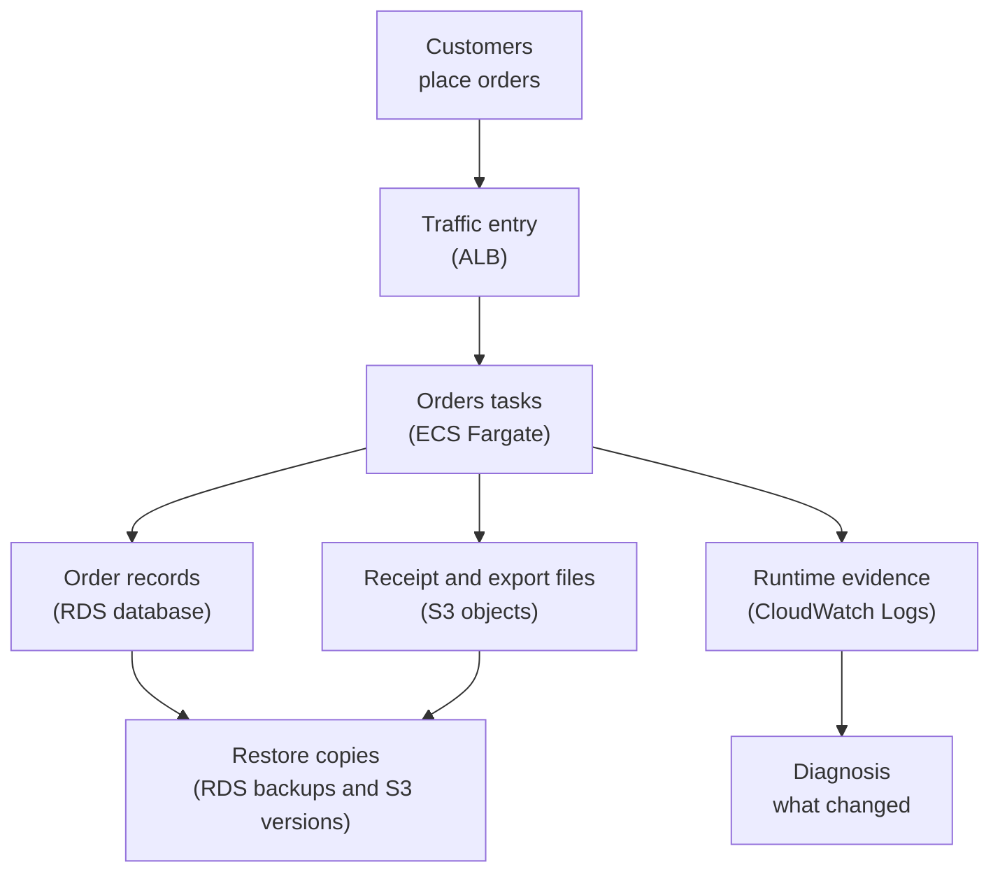

## Table of Contents

1. [Cost And Resilience Belong Together](#cost-and-resilience-belong-together)
2. [The Orders Service We Will Use](#the-orders-service-we-will-use)
3. [Five Cost Shapes To Recognize](#five-cost-shapes-to-recognize)
4. [Resilience Means Serving Or Recovering](#resilience-means-serving-or-recovering)
5. [The System Map](#the-system-map)
6. [The "Just In Case" Tension](#the-just-in-case-tension)
7. [Reading Signals Before Changing Resources](#reading-signals-before-changing-resources)
8. [A Decision Table For Paired Choices](#a-decision-table-for-paired-choices)
9. [A Practical Review Habit](#a-practical-review-habit)

## Cost And Resilience Belong Together

After a service is deployed and observable, the next production question is not only "is it running?"

The next question is "can we afford the way it is running, and can it survive the failures we honestly expect?"

Cost is the money and operational effort spent to keep a system available.
In AWS, cost usually follows resources: tasks, database capacity, storage, logs, backups, network traffic, and the time engineers spend understanding all of it.

Resilience is the ability of a system to keep serving users or recover to a useful state after something goes wrong.
It does not mean "nothing ever fails."
Production systems fail in small ways all the time.
A task restarts.
A database becomes slow.
A log group grows because the app writes too much detail.
A cleanup job deletes the wrong object prefix.

Cost and resilience belong together because most resilience choices have a cost shape, and most cost-saving choices have a failure shape.
Running more ECS tasks can protect traffic when one task dies, but those tasks cost money while they sit there.
Keeping more RDS capacity can protect the database during spikes, but idle capacity still appears on the bill.
Retaining logs and backups for longer can protect diagnosis and recovery, but stored data grows over time.
Cutting all of those things aggressively can make the bill look better right up to the moment the service cannot handle traffic or restore data.

This topic sits after deployment and runtime operations.
The earlier mental model asked whether the right image is running, healthy, logged, and reversible.
This article asks whether the runtime shape is proportionate to the risk.
That word matters.
Proportionate means "large enough for the failure you care about, but not larger than the evidence supports."

The running example is a Node.js service called `devpolaris-orders-api`.
It runs on Amazon ECS with Fargate.
It stores order data in Amazon RDS.
It writes receipts and exports to Amazon S3.
It sends container logs to CloudWatch Logs.
It depends on backups and restore paths when data changes badly.
We will use that one service to connect spending and reliability without turning the article into a finance report or a disaster recovery checklist.

> A good AWS decision should answer both questions: what do we pay for, and what failure does that payment protect against?

## The Orders Service We Will Use

`devpolaris-orders-api` accepts checkout and order requests for a small production learning platform.
Customers call the public hostname `orders.devpolaris.com`.
An Application Load Balancer sends safe traffic to ECS tasks.
The tasks run on Fargate, so the team chooses task CPU, memory, networking, desired count, and logging, but does not manage EC2 hosts.

The service shape is intentionally ordinary:

| Piece | Example |
|-------|---------|
| Application | Node.js API named `devpolaris-orders-api` |
| Runtime | ECS service on Fargate |
| Public entry | Application Load Balancer |
| Data store | RDS PostgreSQL instance `orders-prod` |
| Object store | S3 bucket `devpolaris-orders-prod-objects` |
| Logs | CloudWatch log group `/ecs/devpolaris-orders-api` |
| Backups | RDS automated backups, snapshots, and selected backup plans |
| Traffic | Checkout requests and finance export downloads |

The team has two normal pressures.
First, the service must not fall over during a busy ordering window.
Second, the monthly AWS bill must not grow silently because every resource was sized for a scary day that rarely happens.

That tension is healthy.
You do not want a team that treats cost as someone else's problem.
You also do not want a team that treats resilience as waste.
The skill is to connect each resource choice to a customer or recovery promise.

For this article, imagine a weekly review note that looks like this:

```text
service: devpolaris-orders-api
environment: production

runtime:
  ecs desired tasks: 4
  average busy-hour tasks needed: 2 to 3
  rds instance: sized for recent peak plus buffer

data:
  rds automated backups: enabled
  s3 versioning: enabled for orders object bucket
  cloudwatch log group: retention not reviewed

signals:
  checkout traffic is growing
  log volume rose after debug logging was left on
  restore drill has not been tested since the last schema change
```

This note is not trying to be perfect.
It gives the team a starting point.
There are running resources, stored evidence, stored recovery points, and a few unanswered questions.

Cost and resilience reviews start from that kind of real state, not from a generic list of best practices.

## Five Cost Shapes To Recognize

Beginners often hear "AWS cost" and think only of a monthly bill.
That bill matters, but it arrives too late to guide daily engineering decisions.
A better beginner habit is to recognize cost shapes while you design and operate the service.

Direct cost is the visible cost of the resource you intentionally run.
For `devpolaris-orders-api`, direct cost includes Fargate task CPU and memory, RDS database capacity, S3 object storage, CloudWatch Logs storage, backup storage, and data transfer related to serving requests.
You asked AWS to provide those things, and the bill shows the result.

Hidden cost is the spending that appears because of how the system behaves around the main resource.
A chatty debug log line can turn normal traffic into heavy CloudWatch Logs ingestion and storage.
A retry loop can multiply database calls.
A large response can increase data transfer.
A poorly scoped S3 lifecycle rule can preserve old versions that nobody reviewed.
Hidden cost is not secret.
It is hidden because engineers often do not connect it to the code path that created it.

Idle cost is the cost of capacity that waits around.
Idle does not always mean bad.
Two ECS tasks may be idle at night, but keeping two tasks can protect availability if one task restarts.
A database may have spare CPU most of the day, but that spare room may protect checkout when traffic spikes.
The question is not "is there any idle capacity?"
The better question is "does this idle capacity buy a failure protection we still need?"

Growth cost is the cost that rises with usage, data, or time.
If order volume doubles, the service may need more tasks, more database work, more logs, more S3 objects, and more backups.
If logs never expire, every day adds more stored data.
If S3 versioning is enabled and lifecycle is never reviewed, old versions can keep accumulating.
Growth cost is important because it may look small at first, then become normal enough that nobody notices the slope.

Recovery cost is what you spend so the team can recover later.
Backups, retained logs, snapshots, restore drills, duplicate task capacity, and documented rollback targets all fit here.
Recovery cost can feel like waste on quiet days because it protects against events that have not happened yet.
That is why it needs an explicit reason.
You are not paying for backups because backups sound responsible.
You are paying so a bad migration, accidental deletion, or failed database instance does not become permanent data loss.

Here is the mental model in one table:

| Cost Shape | Beginner Meaning | Orders Example | Question To Ask |
|------------|------------------|----------------|-----------------|
| Direct cost | The resource you knowingly run or store | Fargate tasks and RDS capacity | Do we understand what is running? |
| Hidden cost | Cost caused by behavior around the resource | Debug logs left on after release | Which code path or setting created this? |
| Idle cost | Capacity that waits for work | Extra ECS tasks during quiet hours | What failure does the buffer protect against? |
| Growth cost | Cost that rises with traffic or time | More orders, objects, logs, and backups | What will this look like next month? |
| Recovery cost | Cost paid to restore or diagnose later | Backups and retained logs | Can we recover within the promise? |

This table is not a pricing calculator.
It is a thinking tool.
Before you ask whether something is expensive, ask which cost shape you are looking at.
That one step makes the conversation calmer.

## Resilience Means Serving Or Recovering

Resilience is not perfection.
It is the ability to keep serving when small failures happen, or recover fast enough when serving is interrupted.

For `devpolaris-orders-api`, serving might mean checkout requests still receive valid responses while one ECS task is replaced.
Recovering might mean the team restores order data to a known good point after a bad write.
Both are resilience.
They protect different promises.

Downtime is the time when users cannot use the service in the way they reasonably expect.
If checkout returns errors for ten minutes, that is downtime for checkout.
If receipt emails are delayed but orders still complete, that may be degraded service rather than full downtime.
The exact label matters less than the user impact.

Data loss is the amount of data that cannot be recovered after a failure.
If an order was accepted but disappears from the database, that is data loss.
If a finance export file is deleted but can be regenerated from RDS, that may be an operational problem but not permanent data loss.
The difference depends on what source of truth still exists.

RTO means recovery time objective.
In plain English, it is the target for how long recovery is allowed to take.
If the orders API has an RTO of one hour for database restore, the team is saying, "after a database-level incident, we aim to bring the useful service path back within one hour."
An RTO is not a wish.
It should match tested steps, permissions, restore speed, app config, and the people who know what to do.

RPO means recovery point objective.
In plain English, it is the target for how much recent data the team can afford to lose or re-create.
If the orders database has an RPO of a few minutes, the backup and recovery design must support recovering close to the failure time.
If a temporary export worker file has an RPO of one day because it can be regenerated from RDS, the design can be simpler.

RTO is about time to recover.
RPO is about data freshness after recovery.
They are different.
A team can restore very fast to yesterday's data, which is a good RTO and a bad RPO for checkout.
A team can restore very fresh data after many hours of manual work, which is a good RPO and a bad RTO for customer impact.

This is why resilience belongs with cost.
Lower RTO and lower RPO usually require more preparation.
That preparation may include better backups, more automation, more retained evidence, more capacity, or more frequent restore tests.
Those choices are not free.
They may still be the right choices.

For a beginner, the goal is not to invent perfect numbers.
The goal is to ask the right plain-English questions:

| Question | What It Really Asks |
|----------|---------------------|
| How long can checkout be unavailable? | RTO for the user-facing path |
| How much recent order data can we re-create? | RPO for the database path |
| Can one task die without users noticing? | Serving through runtime failure |
| Can we restore after a bad write? | Recovering through data failure |
| Do logs last long enough to diagnose late reports? | Evidence retention |

Once the team answers those questions, cost decisions become less vague.
You can point to the failure protection behind each resource.

## The System Map

Now place cost and resilience signals around the actual orders service.
The map below is small on purpose.
Read it from top to bottom.
The left side is mostly serving traffic.
The right side is mostly evidence and recovery.



Each box has a cost side and a resilience side.

The ALB and ECS tasks cost money while they handle traffic.
They protect the service by spreading requests across healthy task copies.
If one task fails and another remains healthy, customers may never notice.
If there are too few tasks, one failure can become visible.

RDS costs money for database capacity, storage, backups, and related behavior.
It protects the business record of orders.
If the database is undersized, checkout can slow down or fail.
If backup and restore are not tested, a bad write can become a long incident.

S3 costs money for stored objects, versions, requests, and data transfer shapes.
It protects receipt PDFs and finance exports when versioning and retention match the data's job.
If old versions are kept forever without review, cost grows.
If versions expire too quickly, a mistaken delete may become permanent.

CloudWatch Logs costs money based on log behavior and retention.
It protects diagnosis.
If logs are too thin, the team guesses during incidents.
If logs are too noisy or retained forever without reason, the cost grows and the useful signal becomes harder to find.

Backups cost money because recovery points consume storage and need management.
They protect recovery.
If backups do not exist, RPO may be poor.
If backups exist but nobody can restore and reconnect the app, the team has a stored copy, not a working recovery path.

This is the paired mental model:

| AWS Area | Cost Signal | Resilience Signal |
|----------|-------------|-------------------|
| ECS Fargate | Task count, CPU, memory, runtime duration | Healthy copies, deployment replacement, spike handling |
| RDS | Instance capacity, storage, backup retention | Failover behavior, restore point, data freshness |
| S3 | Object count, versions, requests, transfer | Recover deleted or overwritten objects |
| CloudWatch Logs | Ingestion volume and retention | Diagnose release, request, and dependency failures |
| Backups | Stored recovery points and retention | Restore after deletion, corruption, or bad writes |

If a resource has cost but no named resilience reason, it may be waste.
If a resource protects a real failure but nobody measured the cost shape, it may still surprise the team later.
Both sides need attention.

## The "Just In Case" Tension

The most realistic failure in this module is not a dramatic outage.
It is a slow drift into "just in case" settings.

The team has one scary traffic spike.
Someone increases the ECS desired count from `2` to `4`.
Another person increases RDS capacity because checkout felt slow.
During debugging, the app logs full request details at `debug` level.
After a cleanup mistake, S3 versions and backups are kept longer.
Each decision has a reason.
Together, they can quietly become the new baseline.

There is an opposite mistake too.
The team sees the bill rise and cuts everything at once.
ECS desired count goes back to `1`.
The database has no real buffer.
Logs expire before support notices delayed checkout reports.
Backup retention is shortened without a restore drill.
The next busy window arrives, one task restarts, database latency rises, and the team cannot see enough evidence to know what changed.

This is the tension:

> Too much "just in case" makes production expensive and confusing. Too little "just in case" makes ordinary failures customer-visible.

A useful review does not ask, "can we make this cheaper?"
It asks, "which protection are we willing to reduce, and what evidence says that is safe?"

Look at a realistic tension note:

```text
review: orders cost and resilience
date: 2026-05-02

current choices:
  ecs desired tasks: 4
  ecs minimum during quiet hours: 4
  rds capacity: increased after March checkout spike
  log level: debug for all requests
  log retention: not reviewed

cost signal:
  compute baseline is higher than traffic needs on quiet days
  cloudwatch logs are growing faster than request traffic

resilience signal:
  one task restart no longer affects checkout
  database had enough room during the last campaign
  logs helped diagnose a payment timeout two weeks later

open question:
  can we keep traffic protection while reducing idle baseline and log noise?
```

The best answer is not automatically "undo everything."
The best answer may be to keep a minimum of `2` tasks, add service auto scaling for traffic, keep enough RDS room for the observed peak, remove debug logs from normal requests, and set log retention based on how long incidents and support reports actually need evidence.

That answer protects the real failures.
It also removes cost that no longer has a clear job.

## Reading Signals Before Changing Resources

You should not resize production from vibes.
Use signals.
Signals are the evidence that tells you whether a resource is too small, too large, too noisy, or not protecting the failure you think it protects.

For cost, a beginner-friendly path is AWS Cost Explorer.
You can group by service, usage type, account, or tags if the account uses tags consistently.
The first useful question is not "why is AWS expensive?"
The first useful question is "which service changed, and in which time window?"

A small Cost Explorer review might be written like this:

```text
Cost Explorer review: devpolaris-orders-api
time window: last 14 days
grouping: service, then usage type

changed signals:
  Amazon ECS and Fargate usage: steady high baseline after desired count increase
  Amazon RDS usage: steady after database resize
  Amazon CloudWatch usage: rising after debug logs were enabled
  Amazon S3 usage: gradual growth in object versions

first engineering question:
  which changes were deliberate resilience buffers, and which are leftovers?
```

The output is intentionally about direction, not exact prices.
Exact charges change by Region, resource type, usage pattern, discount, and date.
For learning the mental model, the important part is the shape.
A rising CloudWatch line after a log-level change teaches more than memorizing any price.

For resilience, start with the runtime and data signals.
ECS can tell you desired tasks, running tasks, and deployment state.
CloudWatch can show CPU, memory, request errors, latency, and database pressure.
RDS can show database health and backup settings.
S3 can show object versions and lifecycle behavior.
The tool depends on the question.

Here is a compact runtime check:

```bash
$ aws ecs describe-services \
  --cluster devpolaris-prod \
  --services devpolaris-orders-api \
  --query 'services[0].{desired:desiredCount,running:runningCount,pending:pendingCount}'

{
  "desired": 4,
  "running": 4,
  "pending": 0
}
```

This proves the service is holding four tasks.
It does not prove four tasks are needed.
To answer that, compare task count with traffic, CPU, memory, target response time, and recent failure history.

Now look at the log side:

```text
2026-05-02T11:08:22.104Z DEBUG service=devpolaris-orders-api
route=POST /v1/orders request_id=req_01HW9B2M7S
body_size=18421 paymentProvider=mock-payments retry=0
message="request payload accepted"

2026-05-02T11:08:22.119Z INFO service=devpolaris-orders-api
route=POST /v1/orders request_id=req_01HW9B2M7S
status=201 duration_ms=84 message="order created"
```

The `INFO` line is useful operational evidence.
The `DEBUG` line may be useful during a short investigation, but it is expensive and noisy if every normal request writes it forever.
This is a cost and resilience tradeoff in one place.
Logs protect diagnosis, but unnecessary logs create storage growth and make useful lines harder to find.

Finally, test the recovery path before you trust it.
A backup setting is a promise only after the team proves it can restore a usable target and point the app or repair job at it.
A short restore-drill record might look like this:

```text
restore drill: orders database
source: orders-prod
target: orders-restore-drill-20260502
selected time: before sample bad-write marker

checks:
  restored database accepted read-only validation connection
  sample order ord_01HX9K7P2B had expected status
  app config change required DATABASE_HOST update
  rollback to normal config was tested

result:
  recovery path understood, app cutover not automated
```

That last line is honest.
The team learned that recovery is possible, but not fully automated.
That means the RTO should include manual config work unless the team improves it.

## A Decision Table For Paired Choices

When you change AWS resources, write down both sides of the decision.
The table below is the kind of thing a reviewer can understand without being a cost specialist or database specialist.

| Resource Choice | Cost Shape | Failure Protection | Risk If Overdone | Risk If Underdone |
|-----------------|------------|--------------------|------------------|-------------------|
| ECS desired count minimum | Idle and direct compute | One task can fail while another serves traffic | Paying for unused baseline | One restart can affect users |
| ECS auto scaling | Growth cost follows demand | Adds tasks during traffic spikes | Scaling rules can be noisy | Spikes overwhelm fixed capacity |
| RDS capacity buffer | Direct and idle database cost | Handles peak checkout and maintenance pressure | Paying for unused database room | Slow writes, timeouts, failed checkout |
| RDS backups and restore tests | Recovery cost | Restores after deletion or bad writes | Retention without review grows | Data loss or long recovery |
| S3 versioning and lifecycle | Growth and recovery storage | Recovers overwritten or deleted objects | Old versions accumulate forever | Mistaken delete becomes permanent |
| CloudWatch log retention | Growth and recovery evidence | Diagnoses late reports and incidents | Stored noise grows over time | Logs expire before investigation |
| Log verbosity | Hidden log ingestion and storage | More detail during diagnosis | Normal traffic becomes noisy cost | Errors lack enough context |

Notice how every row has two failure modes.
Overdoing resilience can create waste.
Underdoing resilience can create outages or unrecoverable data.

That is why mature teams do not talk about "cost versus reliability" as if one side must win.
They talk about a target operating shape.
For the orders API, a reasonable beginner target might be:

| Area | Target Shape |
|------|--------------|
| Traffic serving | Minimum task count survives one task restart |
| Traffic spikes | Auto scaling adds capacity from measured demand |
| Database | Capacity matches recent peak plus reviewed buffer |
| Logs | `INFO` by default, temporary `DEBUG` for short investigations |
| Backups | Restore path tested after schema or critical config changes |
| S3 objects | Versioning enabled where recovery matters, lifecycle reviewed by prefix |

The phrase "reviewed buffer" is doing important work.
A buffer is spare capacity or retained data kept for a reason.
Reviewed means the team can name the reason.
Without the reason, a buffer becomes habit.
With the reason, it becomes engineering judgment.

## A Practical Review Habit

The practical habit is simple: whenever you change a production AWS resource, write one cost sentence and one resilience sentence.

For example:

```text
change: reduce ECS minimum desired count from 4 to 2
cost sentence: lowers the always-on compute baseline during quiet hours
resilience sentence: still keeps two task copies so one task can restart without removing all targets
evidence: last 30 days show quiet-hour CPU and memory below reviewed target, busy-hour auto scaling remains enabled
watch after change: ALB 5xx, target response time, running task count, scale-out events
```

This is small enough to fit in a pull request, ticket, or runbook note.
It forces the team to connect the resource to a promise.

Do the same for logs:

```text
change: move normal request payload logging from DEBUG to sampled diagnostic logs
cost sentence: reduces CloudWatch Logs ingestion and stored noisy events
resilience sentence: keeps request_id, route, status, duration, and error details for diagnosis
evidence: recent incidents used error logs and request ids, not full successful request bodies
watch after change: error search quality during the next support investigation
```

And for backups:

```text
change: keep RDS restore testing in the release checklist after schema changes
cost sentence: spends engineer time and temporary restore resources during drills
resilience sentence: proves the team can recover a usable database target after bad writes
evidence: last drill found a manual DATABASE_HOST cutover step
watch after change: drill duration, missing permissions, validation query results
```

These notes look modest, but they prevent two common beginner mistakes.
The first mistake is cutting cost without naming the protection being removed.
The second mistake is adding resilience without naming the cost that will keep growing.

For `devpolaris-orders-api`, the mental model becomes:

| Question | Good Answer Shape |
|----------|-------------------|
| What are we paying for? | A named resource, usage pattern, or stored recovery point |
| What does it protect? | A named failure such as task crash, traffic spike, bad write, or late diagnosis |
| What signal proves it is needed? | Metrics, logs, restore drills, traffic history, or incident evidence |
| What signal proves it is waste? | Idle baseline, unused logs, stale backups, or unused versions |
| What will we watch after changing it? | Customer impact, runtime health, data safety, and cost trend |

When you are new to AWS, this may feel slower than just changing the setting.
It is slower in the good way.
It adds a small pause before the kind of change that can either save money safely or remove the thing production needed during the next failure.

Cost and resilience are not separate departments in a healthy engineering team.
They are two views of the same production promise.
The service should stay affordable enough to keep running, and recoverable enough that a normal failure does not become a permanent business problem.

---

**References**

- [The pillars of the AWS Well-Architected Framework](https://docs.aws.amazon.com/wellarchitected/latest/framework/the-pillars-of-the-framework.html) - Places reliability and cost optimization together as core AWS architecture concerns.
- [Analyzing your costs and usage with AWS Cost Explorer](https://docs.aws.amazon.com/console/billing/costexplorer) - Documents Cost Explorer as the AWS tool for reviewing cost and usage trends.
- [Automatically scale your Amazon ECS service](https://docs.aws.amazon.com/AmazonECS/latest/developerguide/service-auto-scaling.html) - Describes how ECS Service Auto Scaling changes task count in response to demand and utilization signals.
- [Restoring a DB instance to a specified time for Amazon RDS](https://docs.aws.amazon.com/AmazonRDS/latest/UserGuide/USER_PIT.html) - Explains RDS point-in-time restore behavior and the new DB instance recovery target.
- [How S3 Versioning works](https://docs.aws.amazon.com/AmazonS3/latest/userguide/versioning-workflows.html) - Explains how object versions and delete markers support recovery from accidental overwrite or delete.
- [What is Amazon CloudWatch Logs?](https://docs.aws.amazon.com/AmazonCloudWatch/latest/logs/WhatIsCloudWatchLogs.html) - Covers CloudWatch Logs concepts, including log groups, retention, and the role of log data in monitoring applications.
