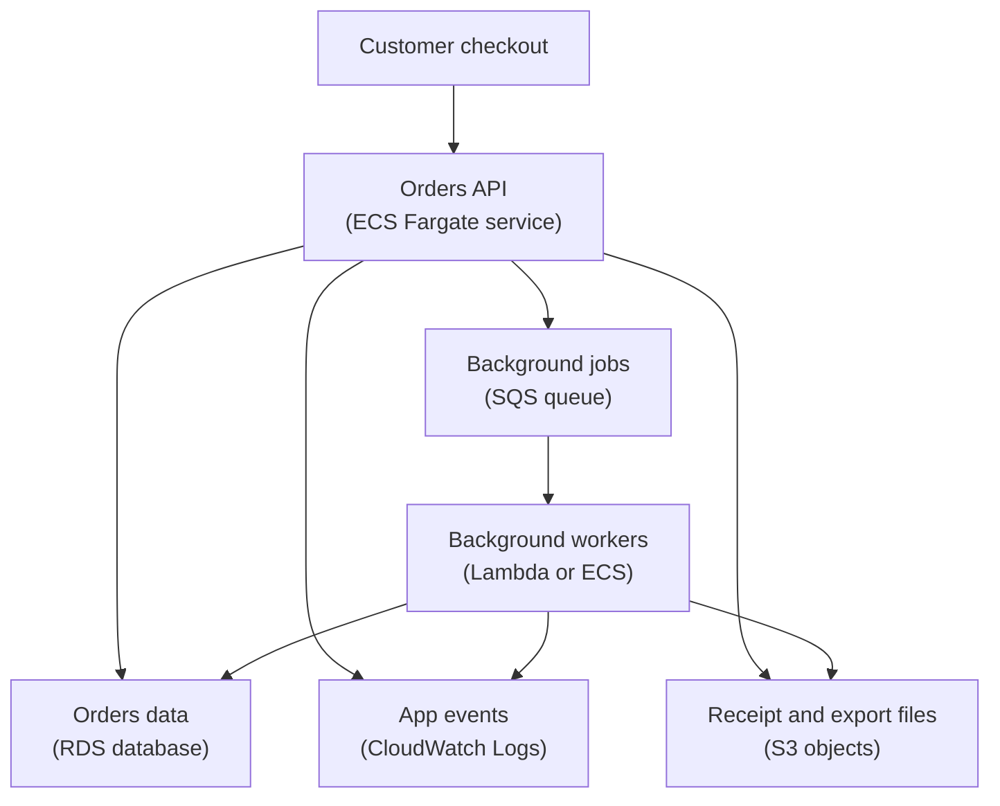

## Table of Contents

1. [Visibility Before Tuning](#visibility-before-tuning)
2. [The Orders Cost Map](#the-orders-cost-map)
3. [Tags Turn Spend Into Ownership](#tags-turn-spend-into-ownership)
4. [Cost Explorer Shows Movement](#cost-explorer-shows-movement)
5. [Budgets Catch Drift](#budgets-catch-drift)
6. [A Monthly Cost Snapshot](#a-monthly-cost-snapshot)
7. [Right-Sizing The Running Layers](#right-sizing-the-running-layers)
8. [Autoscaling Has A Cost Shape](#autoscaling-has-a-cost-shape)
9. [Failure Mode: The Release That Made Spend Jump](#failure-mode-the-release-that-made-spend-jump)
10. [Tradeoffs And Operating Habits](#tradeoffs-and-operating-habits)

## Visibility Before Tuning

A cloud bill is a delayed report of how your architecture behaved.
Every running task, database instance, log event, object, queue message, and function invocation leaves a cost trail.
Cost visibility means you can read that trail by service, environment, team, and workload instead of staring at one large account total.

Right-sizing means changing resource size or count so the workload has enough capacity without carrying unnecessary idle capacity.
The important word is "enough."
A tiny service can be cheap and broken.
A huge service can be stable and wasteful.
The useful target is the smallest shape that still protects latency, recovery, observability, and future traffic patterns you actually expect.

Right-sizing depends on visibility because you need to know what you are tuning.
If the bill only says "AWS," you cannot tell whether the money went to API tasks, database capacity, logs, S3 exports, or background workers.
If the bill says `Service=devpolaris-orders-api`, `Environment=prod`, and `Team=platform`, the team can discuss the specific owner and workload.
Now the team can ask: "Which layer changed, and is that layer sized for the work it is doing?"

This topic fits after deployment, runtime operations, observability, and data service choices.
You have already seen an orders API running on AWS.
Now you are learning how to keep that service affordable without making it fragile.

The running example is a Node.js service named `devpolaris-orders-api`.
It runs on ECS with Fargate behind an Application Load Balancer.
It writes order records to RDS, stores receipt and export files in S3, sends logs to CloudWatch Logs, and uses SQS with Lambda or ECS workers for background jobs.

That is a realistic cost surface.
The API itself is only one part of the bill.
The supporting services can grow quietly if nobody watches them.

> Cost visibility is not blame.
> It is the map you need before you make a safe change.

## The Orders Cost Map

Start with a plain map of what exists.
You are not building a finance spreadsheet yet.
You are naming the pieces that can create spend and the owner who can explain them.

For `devpolaris-orders-api`, the path looks like this:



Read the diagram as both a cost map and a request map.
ECS tasks cost while they run.
RDS costs according to the database shape you keep available.
S3 costs grow with stored objects and access patterns.
CloudWatch Logs grows with log volume and retention.
SQS and Lambda grow with background work.

The first lesson is that there is no single "orders API cost."
There is a group of costs that support the orders service.
Some are user-facing, like ECS tasks handling checkout.
Some are supporting work, like export files and receipt email workers.
Some are evidence, like logs that help you debug incidents.

A beginner mistake is to look only at the compute layer.
That misses the quiet spend that often surprises teams.
Runaway logs, retained exports, idle database capacity, and over-scaled workers can grow even when public traffic is flat.

The practical review starts by listing the workload pieces:

| Layer | Example Resource | Cost Question |
|---|---|---|
| API runtime | `devpolaris-orders-api` ECS service | Are tasks sized and counted for real traffic? |
| Worker runtime | `devpolaris-orders-worker` or Lambda functions | Are workers running only as fast as useful work needs? |
| Database | `devpolaris-orders-prod` RDS instance | Is the instance shape matched to database pressure? |
| Object storage | `devpolaris-orders-prod-artifacts` S3 bucket | Are temporary exports aging out safely? |
| Logs | `/ecs/devpolaris-orders-api` log group | Is retention intentional, and is log volume normal? |
| Queue | `orders-background-prod` SQS queue | Is backlog driving useful workers or repeated failures? |

This map does not tell you what to cut.
It tells you where to look.
That distinction matters.
Cost work goes wrong when people jump from "this service is expensive" to "make it smaller" without checking what the service is protecting.

## Tags Turn Spend Into Ownership

A tag is a key-value label attached to an AWS resource.
In plain English, it is a small note on the resource that says what it belongs to.
For cost work, the useful tags are the ones that answer ownership questions.

For the orders service, the team might standardize these tags:

```text
Service=devpolaris-orders-api
Environment=prod
Team=platform
Component=api
```

The exact set should match how your team works.
`Service` tells you which product or workload the resource supports.
`Environment` separates production from staging or development.
`Team` tells you who should review the spend.
`Component` can separate the API, worker, database, logs, or storage when one service has several parts.

Tags are not automatically a good cost report.
AWS must be able to see the tag on resources that support tagging, and cost allocation tags must be activated for billing reports before they become useful for cost analysis.
There can also be delay before new tag data appears in cost tools.
That is why tags are best treated as part of resource creation, not as cleanup after a bill surprises you.

Here is a simple ownership check a platform engineer might run during a review:

```bash
$ aws resourcegroupstaggingapi get-resources \
  --tag-filters Key=Service,Values=devpolaris-orders-api \
  --query 'ResourceTagMappingList[].{arn:ResourceARN,tags:Tags}'
[
  {
    "arn": "arn:aws:ecs:us-east-1:111122223333:service/devpolaris-prod/devpolaris-orders-api",
    "tags": [
      {"Key": "Service", "Value": "devpolaris-orders-api"},
      {"Key": "Environment", "Value": "prod"},
      {"Key": "Team", "Value": "platform"},
      {"Key": "Component", "Value": "api"}
    ]
  },
  {
    "arn": "arn:aws:rds:us-east-1:111122223333:db:devpolaris-orders-prod",
    "tags": [
      {"Key": "Service", "Value": "devpolaris-orders-api"},
      {"Key": "Environment", "Value": "prod"},
      {"Key": "Team", "Value": "platform"},
      {"Key": "Component", "Value": "database"}
    ]
  }
]
```

The command is only evidence.
The useful question is whether the important resources are visible through the same service tag.
If the ECS service is tagged but the RDS database and S3 bucket are not, Cost Explorer can make the API look cheaper than it really is.

Missing tags create "unowned" spend.
Unowned spend is dangerous because nobody feels safe changing it.
People either ignore it, or they cut it blindly.
Both are bad outcomes.

A good tag does not prove a resource is correctly sized.
It gives you a responsible conversation.
When `Team=platform` owns the RDS instance, the platform team can explain why it is large, what metric justifies it, and when it should be reviewed again.

## Cost Explorer Shows Movement

AWS Cost Explorer is the beginner-friendly place to inspect cost and usage trends.
It helps you answer questions like "which AWS service changed this month?" and "which tagged workload is responsible?"
It is a visibility tool, not a fix button.

Think of Cost Explorer like a dashboard for cost shape.
It can group by AWS service, account, region, usage type, and active cost allocation tags.
Those groupings turn one total into a set of smaller questions.

For `devpolaris-orders-api`, a useful first view is:

```text
Cost Explorer review

Date range:
  previous full month

Granularity:
  monthly, then daily for the suspicious window

Filters:
  tag Service = devpolaris-orders-api
  tag Environment = prod

Group by:
  AWS service
  tag Component
```

That view tells you whether the cost movement came from RDS, ECS, S3, CloudWatch, Lambda, SQS, or something else.
If CloudWatch Logs jumps while ECS stays flat, shrinking API tasks will not fix the issue.
If RDS dominates every month, the next question is database sizing and utilization.
If Lambda and SQS worker activity rise after a release, inspect queue behavior and worker retries.

Cost Explorer also needs interpretation.
A higher cost can be healthy when traffic rose, a new paid feature launched, or retention was intentionally extended for an audit.
A lower cost can be unhealthy when you cut capacity below what the service needs.

That is why cost movement should be compared with operating signals:

| Cost Movement | Operating Signal To Compare |
|---|---|
| ECS cost rose | request rate, CPU, memory, desired count, running tasks |
| RDS cost stayed high | CPU, connections, read/write latency, storage growth |
| S3 cost rose | object count, prefix growth, export retention, lifecycle rules |
| CloudWatch Logs rose | ingested log volume, retention, error loop logs |
| Lambda cost rose | invocations, duration, errors, retries, concurrency |
| SQS cost rose | message count, retries, queue depth, DLQ messages |

The table is not a pricing formula.
It is a diagnostic habit.
Cost Explorer shows where spend moved.
CloudWatch, service events, logs, and configuration explain why it moved.

## Budgets Catch Drift

AWS Budgets helps you notice when spend crosses a threshold or is forecasted to cross one.
It is most useful when the budget scope matches the way you operate.
A single budget for the whole account can catch broad surprises, but it does not tell the orders team whether their service changed.

For the orders service, a service-scoped budget is more useful:

```text
Budget: prod-orders-monthly

Scope:
  tag Service = devpolaris-orders-api
  tag Environment = prod

Example monthly limit:
  100 cost units

Alerts:
  actual spend reaches 70 cost units
  forecasted spend reaches 90 cost units

Owner:
  Team = platform
```

These are example numbers, not AWS prices.
The useful part is the structure: the budget has a workload, an environment, thresholds, and an owner.

A budget alert should start an investigation.
It does not know whether the extra spend is good or bad.
It only knows that actual or forecasted movement crossed the line you chose.

Imagine this alert:

```text
AWS Budgets alert

Budget:
  prod-orders-monthly

Status:
  forecasted above threshold

Current month:
  63 cost units used
  112 cost units forecasted

Largest movement:
  CloudWatch Logs and Lambda workers

Owner:
  platform
```

The alert gives the team a starting point.
It does not say "turn off Lambda."
It says "the service is forecasted to exceed the plan, and the movement appears to be in logs and workers."

That difference keeps cost management from becoming guesswork.
Budgets catch drift.
Engineers still diagnose the workload.

## A Monthly Cost Snapshot

A good monthly review is short and specific.
It should show where spend came from, what changed, who owns the change, and what decision comes next.
It does not need exact public pricing.
For learning, we can use fictional round numbers.

Here is a realistic status snapshot for `devpolaris-orders-api`.
The numbers are invented example cost units, not AWS prices and not a bill.

```text
devpolaris-orders-api monthly cost review

Scope:
  Service=devpolaris-orders-api
  Environment=prod

Month:
  2026-04

Total:
  100 example cost units
  up from 74 example cost units last month

Breakdown by layer:
  RDS database:                 31 units, up 6 units
  ECS Fargate API tasks:        22 units, up 2 units
  CloudWatch Logs:              18 units, up 14 units
  Lambda and SQS workers:       13 units, up 8 units
  S3 receipts and exports:      11 units, up 5 units
  Load balancer and other:       5 units, up 1 unit

Notes:
  traffic rose slightly
  checkout latency stayed normal
  worker retries rose after release 2026-04.18
  log volume rose after the same release
  monthly export objects did not expire
```

This snapshot is useful because it does not stop at "the bill went up."
It names the layer.
It compares the month with the previous month.
It connects cost movement to operating signals.

The first right-sizing target is not automatically the largest line.
RDS is the largest line, but it only rose a little.
CloudWatch Logs and workers changed sharply.
That suggests a release behavior change before a database resize conversation.

The second lesson is that a cost review should protect reliability.
If the API is healthy and traffic rose, some ECS increase may be expected.
If workers retried the same failing job many times, that is waste and risk.
If logs grew because the application started printing full payloads on every retry, that is both a cost problem and an operational noise problem.

The review should end with decisions:

| Finding | Decision |
|---|---|
| Worker retries rose after release | inspect failed messages and worker logs before scaling workers |
| Log volume jumped | reduce noisy error logs after preserving enough evidence |
| S3 exports did not expire | add lifecycle for temporary exports after confirming retention needs |
| RDS remains large | review utilization over a representative period before resizing |
| ECS API is steady | leave task size alone until CPU and memory evidence changes |

This is the tone you want in real teams.
No blame.
No blind cuts.
Evidence first, then careful tuning.

## Right-Sizing The Running Layers

Right-sizing is not one action.
Each AWS layer has its own control and its own risk.
The orders service gives us six useful layers to inspect.

### ECS tasks

For ECS on Fargate, task CPU and memory are part of the task definition.
Desired count is part of the service.
Those are different controls.

Task size answers "how much CPU and memory does one task get?"
Desired count answers "how many copies should run?"
You can waste money by making each task too large, by running too many tasks, or by doing both.

An example task definition review might show this:

```json
{
  "family": "devpolaris-orders-api",
  "cpu": "1024",
  "memory": "2048",
  "containerDefinitions": [
    {
      "name": "orders-api",
      "image": "111122223333.dkr.ecr.us-east-1.amazonaws.com/devpolaris-orders-api:2026-04.18",
      "essential": true
    }
  ]
}
```

The useful review question is not "can we make this smaller?"
The useful question is "what did CPU and memory actually do during normal traffic, peak traffic, and deployments?"
If memory sits low for weeks and CPU has plenty of headroom, a smaller task may be worth testing.
If memory has sharp peaks during export creation, cutting memory can turn a cost win into crashes.

Desired count needs the same care.
If the service normally needs three tasks for availability and traffic, running eight all day is probably waste.
If you reduce from three to one, you may save idle capacity but lose fault tolerance and deployment safety.

### RDS

RDS sizing is slower and riskier than changing an ECS desired count.
The database holds shared state.
If you resize too aggressively, checkout latency, connection waits, and recovery time can suffer.

A database review should compare cost with evidence:

```text
RDS review: devpolaris-orders-prod

Recent pattern:
  CPU mostly low
  connections steady during normal traffic
  write latency normal except export window
  storage growing because monthly export metadata was retained

Decision:
  do not resize during the release week
  first move export summary writes out of checkout path
  then review instance class after a representative period
```

The phrasing matters.
The team is not refusing to save money.
It is sequencing the work.
Fix the workload shape first, then resize the database when the metrics describe the real steady state.

### S3 lifecycle

S3 is often cheap per object compared with compute, but retained objects can still grow into real spend.
More important, S3 can hide forgotten data because objects do not complain while they sit there.

For the orders service, receipt PDFs may need longer retention because users and support may need them.
Temporary export files may not need the same life.
Monthly admin exports may need a clear retention rule agreed with the business.

A lifecycle note can stay short:

```text
S3 lifecycle intent

bucket:
  devpolaris-orders-prod-artifacts

receipts/:
  retain for customer and support needs

exports/monthly/:
  retain for the agreed reporting window

exports/tmp/:
  expire after the job retry and audit window
```

Do not add an expiration rule because "storage is expensive" and walk away.
Ask what evidence, downloads, audit trails, or recovery paths depend on those objects.
Deleting the wrong objects can save a little and create a support incident.

### CloudWatch Logs retention

Logs are evidence.
They are also stored data.
If your application logs too much, or if log groups keep data forever by accident, logs can become a surprise cost line.

The first check is whether retention is intentional:

```bash
$ aws logs describe-log-groups \
  --log-group-name-prefix /ecs/devpolaris-orders-api \
  --query 'logGroups[].{name:logGroupName,retention:retentionInDays,storedBytes:storedBytes}'
[
  {
    "name": "/ecs/devpolaris-orders-api",
    "retention": 30,
    "storedBytes": 1842000000
  },
  {
    "name": "/ecs/devpolaris-orders-worker",
    "retention": null,
    "storedBytes": 9360000000
  }
]
```

In this example, `null` means the worker log group has no explicit retention setting.
That may be intentional, but it deserves a decision.
A worker that retries noisy errors all night can create log volume much faster than a quiet API.

Right-sizing may require changing the application log behavior as well as retention.
Keep enough detail to diagnose a failed order.
Avoid logging the same large payload on every retry.

### Lambda and SQS workers

Worker cost usually follows volume, duration, retries, and concurrency.
If a worker is correct and there is real backlog, more concurrency can help.
If a worker is failing the same message repeatedly, more concurrency creates more failed work.

The worker review should include queue age, visible messages, errors, and DLQ count:

```text
Worker review

queue:
  orders-background-prod

visible messages:
  rising after release 2026-04.18

oldest message age:
  rising

worker errors:
  repeated ExportPayloadTooLarge

DLQ:
  empty, but retry count is high

Decision:
  reduce worker concurrency
  fix payload split logic
  replay with a small worker count
```

That decision protects cost and reliability together.
It stops the service from paying to repeat bad work while also protecting RDS, S3, and downstream APIs from a retry storm.

## Autoscaling Has A Cost Shape

Autoscaling changes capacity based on signals.
For ECS, it can change desired task count.
For workers, it can increase or decrease consumers.
For Lambda, concurrency behavior controls how much work can run at once.

Autoscaling is attractive because idle capacity feels wasteful and manual scaling is easy to forget.
But autoscaling is still a cost decision.
Every scaling policy has a shape.
Minimum capacity is what you pay for even when traffic is quiet.
Maximum capacity is how much spend and downstream pressure you allow during a burst.
The target metric decides which pressure the policy tries to control.

Here is a small service note:

```text
ECS autoscaling review

service:
  devpolaris-orders-api

minimum tasks:
  3

normal desired tasks:
  3 to 5 during weekday traffic

maximum tasks:
  10

target signal:
  average API CPU during request handling

warning:
  do not scale out just because checkout is slow when RDS latency is high
```

The warning is the important part.
If CPU is the bottleneck, more tasks can help.
If RDS is the bottleneck, more tasks may create more database connections and more cost.

Workers need a different cost shape.
Their scaling should follow queue pressure, but it must respect downstream safety.
Draining a queue quickly is not helpful if each message fails, retries, and writes more logs.

Lambda has a similar tradeoff.
Allowing high concurrency can process events quickly.
It can also increase pressure on RDS, S3, email providers, or partner APIs.
Reserved concurrency or event source scaling controls can be useful when the safe answer is "run fewer things at once."

Use this rule:
autoscaling saves money only when the metric matches useful work.
If the metric follows a failure loop, autoscaling can make the failure more expensive.

## Failure Mode: The Release That Made Spend Jump

Now let us walk through a cost jump.
This is the kind of problem that looks like finance work at first, but it is really an operational diagnosis.

On April 18, the team releases `devpolaris-orders-api` version `2026-04.18`.
The release adds a new monthly export feature.
The feature passes tests and checkout stays mostly healthy.
Two weeks later, the monthly budget alert fires.

The first Cost Explorer view shows this:

```text
Cost Explorer daily view

Scope:
  Service=devpolaris-orders-api
  Environment=prod

Day        ECS API   RDS   Logs   Lambda/SQS   S3   Notes
Apr 16     normal   high  normal  normal       normal
Apr 17     normal   high  normal  normal       normal
Apr 18     normal   high  rising  rising       rising  release 2026-04.18
Apr 19     normal   high  high    high         rising
Apr 20     normal   high  high    high         high
```

The API runtime did not explode.
The movement is logs, workers, and S3.
That tells the team not to start by shrinking ECS tasks.

The CloudWatch Logs search finds repeated errors:

```text
2026-04-19T02:14:11.908Z ERROR service=devpolaris-orders-worker
job=monthly-export
orderId=ord_4418
error=ExportPayloadTooLarge
retry=7
payloadBytes=1832044
message="export failed, retrying with full payload logged"

2026-04-19T02:14:14.227Z ERROR service=devpolaris-orders-worker
job=monthly-export
orderId=ord_4418
error=ExportPayloadTooLarge
retry=8
payloadBytes=1832044
message="export failed, retrying with full payload logged"
```

The log explains two costs at once.
The worker is retrying.
The worker is also logging a large payload on every retry.
That increases Lambda or ECS worker activity and CloudWatch Logs ingestion.

The queue snapshot adds more context:

```text
SQS queue: orders-background-prod

visible messages:
  rising

not visible messages:
  high during export window

oldest message age:
  rising

DLQ messages:
  0

worker concurrency:
  higher after autoscaling reacted to backlog
```

The queue has work waiting, but the absence of DLQ messages does not mean the system is healthy.
Messages are being retried and logged before they finally succeed or become visible again.
Autoscaling sees backlog and adds workers.
That makes the retry loop faster and more expensive.

The S3 review finds another part of the same release:

```text
S3 prefix review

bucket:
  devpolaris-orders-prod-artifacts

prefix:
  exports/tmp/2026-04/

finding:
  temporary export chunks retained after failed retries

expected:
  temporary chunks removed after successful export or lifecycle window
```

Now the cost jump has a story.
A release created larger export payloads.
Workers retried failed messages.
Autoscaling added workers because backlog rose.
Logs grew because every retry logged too much data.
S3 grew because temporary export chunks stayed behind.

The diagnosis path is practical:

1. Start in Cost Explorer with the `Service` and `Environment` tags.
2. Group by AWS service and component tag to find the moving layer.
3. Compare the movement with the release calendar.
4. Check CloudWatch Logs for repeated errors in the same window.
5. Check SQS queue age, retry behavior, and DLQ count.
6. Check worker concurrency or ECS desired count.
7. Check S3 prefixes that the release writes.
8. Decide which control reduces damage while the code is fixed.

The safe short-term response is not "cut everything."
The team can reduce worker concurrency, stop the retry storm, preserve enough logs for debugging, and keep messages in the queue.
Then it can fix the export payload split, reduce noisy logging, and add a lifecycle rule for temporary chunks after confirming retention needs.

RDS also deserves a review, but it is not the first fix in this story.
If the database was oversized before the release, that is a separate right-sizing candidate.
Mixing that resize into the incident would create extra risk while the worker failure is still active.

## Tradeoffs And Operating Habits

Cost work has a trap: every saving can sound responsible until you ask what it removes.
Fewer ECS tasks can reduce idle spend, but too few tasks can increase latency and make deployments less safe.
A smaller RDS instance can reduce waste, but an undersized database can slow checkout and make recovery harder.
Shorter log retention can reduce stored logs, but it can also remove the evidence you need after a delayed support report.
Aggressive S3 expiration can remove forgotten temporary files, but it can also delete exports someone still needs.
Lower worker concurrency can protect a database, but it can also let queue age grow.

That is the key tradeoff.
You are balancing cost, performance, resilience, and evidence.
Good right-sizing does not chase the smallest number.
It chooses the smallest safe shape and writes down why that shape is safe.

A practical operating note for the orders service might look like this:

```text
devpolaris-orders-api cost and right-sizing habits

Monthly:
  review Cost Explorer by Service, Environment, Team, and Component
  compare movement with release notes and traffic

Before resizing ECS:
  check CPU, memory, desired count, running count, and latency

Before resizing RDS:
  check database pressure over a representative period
  avoid combining resize with an active incident

Before changing log retention:
  confirm incident review and support evidence needs
  reduce noisy logs before relying only on shorter retention

Before changing S3 lifecycle:
  separate receipts, monthly exports, and temporary chunks
  confirm what can safely expire

Before increasing workers:
  check queue age, error rate, retry pattern, DLQ, and downstream pressure
```

This note is a memory aid for moments when the graph is moving and people want a fast answer.

Cost Explorer helps you see where spend moved.
Budgets help you notice drift before the month ends.
Tags connect spend to ownership.
CloudWatch metrics, logs, SQS state, RDS behavior, and S3 prefixes explain why the spend moved.
Right-sizing is the careful change you make after those pieces tell the same story.

That is how you keep AWS cost work practical.
You do not guess.
You look, connect the cost to the service owner, change one layer with evidence, and watch for the operational tradeoff you just accepted.

---

**References**

- [Analyzing your costs and usage with AWS Cost Explorer](https://docs.aws.amazon.com/console/billing/costexplorer) - Official AWS guide for viewing and analyzing cost and usage trends.
- [Organizing and tracking costs using AWS cost allocation tags](https://docs.aws.amazon.com/awsaccountbilling/latest/aboutv2/cost-alloc-tags.html) - Explains how cost allocation tags help group AWS costs by labels such as owner, application, and environment.
- [Creating a budget](https://docs.aws.amazon.com/cost-management/latest/userguide/budgets-create.html) - Documents AWS Budgets setup for tracking actual or forecasted cost and usage movement.
- [Amazon ECS task definition differences for Fargate](https://docs.aws.amazon.com/AmazonECS/latest/developerguide/fargate-tasks-services.html) and [Use a target metric to scale Amazon ECS services](https://docs.aws.amazon.com/AmazonECS/latest/developerguide/service-autoscaling-targettracking.html) - Cover Fargate task CPU and memory settings plus target tracking autoscaling behavior.
- [Monitoring Amazon RDS metrics with CloudWatch](https://docs.aws.amazon.com/AmazonRDS/latest/UserGuide/MonitoringOverview.html), [Scaling and high availability in Amazon RDS](https://docs.aws.amazon.com/AmazonRDS/latest/gettingstartedguide/scaling-ha.html), and [Viewing Aurora and RDS database recommendations](https://docs.aws.amazon.com/compute-optimizer/latest/ug/view-rds-recommendations.html) - Explain the database metrics and recommendation views useful before resizing RDS.
- [Setting an S3 Lifecycle configuration on a bucket](https://docs.aws.amazon.com/AmazonS3/latest/userguide/how-to-set-lifecycle-configuration-intro.html), [Working with log groups and log streams](https://docs.aws.amazon.com/AmazonCloudWatch/latest/logs/Working-with-log-groups-and-streams.html), [Configuring reserved concurrency for a function](https://docs.aws.amazon.com/lambda/latest/dg/configuration-concurrency.html), and [Amazon SQS visibility timeout](https://docs.aws.amazon.com/AWSSimpleQueueService/latest/SQSDeveloperGuide/sqs-visibility-timeout.html) - Cover the retention and concurrency controls used for storage, logs, Lambda workers, and queued retries.
