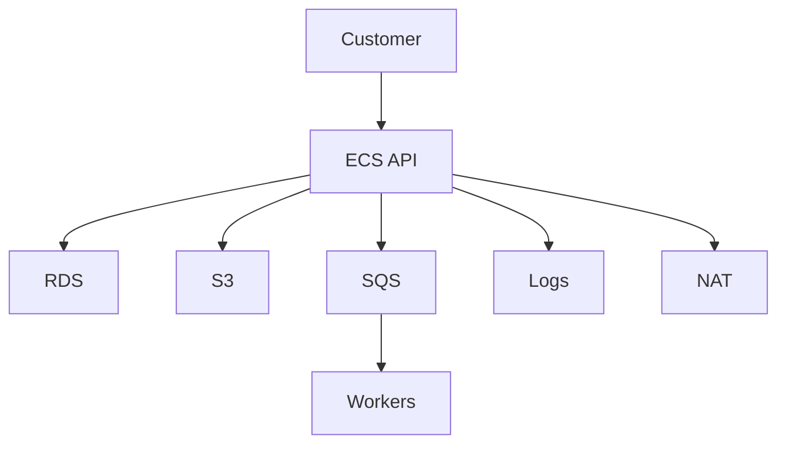

## Table of Contents

1. [The Problem](#the-problem)
2. [Cost Visibility](#cost-visibility)
3. [Cost Map](#cost-map)
4. [Tags](#tags)
5. [Cost Explorer](#cost-explorer)
6. [Budgets](#budgets)
7. [Spend Jumps](#spend-jumps)
8. [Ownership](#ownership)
9. [Putting It All Together](#putting-it-all-together)
10. [What's Next](#whats-next)

## The Problem

The previous article paired cost with resilience. Now the team has a practical blocker: the bill says spend increased, but the total does not explain why.

The orders service could be spending more because:

- ECS tasks ran longer or with larger task sizes.
- RDS storage or instance hours changed.
- S3 receipt, export, or temporary objects grew quietly.
- CloudWatch Logs ingested more application events after a release.
- NAT gateway data processing increased because private workloads moved more traffic.
- Background workers retried bad jobs and created more requests.

One account total cannot tell that story. Cost visibility turns AWS spend into owned evidence.

## Cost Visibility

Cost visibility is the ability to read AWS spend by service, environment, owner, workload, and time. It is not the same as cost optimization. Visibility comes first because the team needs to know what changed before deciding what to change.

A useful cost view answers:

| Question | Needed evidence |
| --- | --- |
| Which service created the spend? | Tags, accounts, Cost Explorer groupings |
| Which layer changed? | Service-level cost by AWS service |
| When did it move? | Daily or monthly trend |
| Who owns the decision? | Team or workload tag |
| Does the change match runtime behavior? | Logs, metrics, deploy records |

The gotcha is delay. Billing data is not the same as live telemetry. Cost Explorer data can lag behind runtime behavior. Use cost data to explain spend movement, then use observability and deployment evidence to explain why the spend moved.

## Cost Map

Start with the application path, not the bill.



For `devpolaris-orders-api`, the cost map might be:

| Layer | AWS cost surface |
| --- | --- |
| API runtime | ECS Fargate task CPU and memory |
| Database | RDS instance, storage, backups |
| Object storage | S3 receipts, exports, lifecycle behavior |
| Async work | SQS requests, worker runtime, Lambda invocations |
| Evidence | CloudWatch Logs ingestion and storage |
| Network path | NAT gateway hours and data processing |

This map does not replace Cost Explorer. It gives Cost Explorer a question. Instead of asking "why is AWS expensive?", ask "which layer of the orders path moved?"

## Tags

Tags turn resources into owned cost evidence. A tag is a key/value label on an AWS resource. A cost allocation tag is a tag activated for billing reports and Cost Explorer filtering.

For this module, useful tags are boring and consistent:

| Tag | Example |
| --- | --- |
| `Service` | `orders` |
| `Environment` | `prod` |
| `Team` | `platform` |
| `CostCenter` | `learning-platform` |
| `DataClass` | `customer-orders` |

Cost allocation tags need to be activated before they appear in billing views. AWS documentation also notes that tags can take time to appear in the Billing and Cost Management console after activation.

Two gotchas matter early.

First, do not put sensitive information in tags. Tags can appear in billing, logs, automation, and inventory views. A tag should not contain secrets, customer data, or private incident details.

Second, not every charge maps cleanly to one tagged resource. Tags improve visibility, but they do not remove the need for service maps and account structure.

## Cost Explorer

Cost Explorer lets teams view and analyze AWS cost and usage over time. It is where a beginner can start turning one bill into trends, filters, and groupings.

For the orders service, a useful view might group May spend by `Service` tag and AWS service:

```text
period: 2026-05-01 to 2026-06-01
granularity: monthly
group by: Service tag, AWS service
filter: Environment = prod
```

The exact screen matters less than the reading habit:

| Cost Explorer move | What it reveals |
| --- | --- |
| Group by AWS service | Which AWS product moved |
| Group by tag | Which workload or owner moved |
| Compare months | Whether spend changed suddenly or gradually |
| Filter environment | Avoid mixing prod with dev noise |
| Drill into usage type | Separate hours, requests, storage, and transfer |

Cost Explorer can show up to historical and forecasted windows, but the current month may not be immediate. Treat it as financial evidence with a refresh cycle, not as a live incident dashboard.

## Budgets

Budgets define expected cost or usage boundaries and send alerts when actual or forecasted values cross thresholds. They help catch drift before the monthly bill becomes the first signal.

A useful budget has an owner and a response path:

| Budget | Good owner question |
| --- | --- |
| Orders prod monthly cost | Did normal traffic, release behavior, or resource shape change? |
| CloudWatch Logs cost | Did log volume rise after a deploy? |
| S3 export storage | Are temporary exports expiring? |
| NAT gateway data processing | Did private workloads start routing more traffic through NAT? |

Budgets are not hard stop controls for most workloads. They are attention controls. If nobody owns the alert, the budget becomes another unread signal.

The practical habit is to pair each budget with the first view to open and the person or team that can explain the service.

## Spend Jumps

A spend jump is a clue, not a verdict.

Suppose orders spend rises in May. The visibility path should connect cost evidence to runtime evidence:

| Evidence | Question |
| --- | --- |
| Cost Explorer | Which service and usage type moved? |
| Deployment record | Did a release happen before the jump? |
| Metrics | Did traffic, queue depth, or retries rise? |
| Logs | Did error volume or log verbosity change? |
| S3 inventory or prefixes | Did objects accumulate in one path? |
| NAT metrics | Did private egress increase? |

The gotcha is cutting the first visible line item. If CloudWatch Logs jumped because an error loop produced millions of entries, shortening log retention may reduce storage later but does not fix the error loop. If S3 storage jumped because exports are not cleaned up, downsizing ECS will not help.

Visibility should tell you where to investigate next.

## Ownership

Cost visibility is not blame. It is ownership.

When spend is owned, a service team can explain why a resource exists, what failure it protects against, and what evidence would justify changing it. When spend is unowned, every review becomes archaeology.

The minimum ownership record for a resource is:

| Field | Example |
| --- | --- |
| Service | `orders` |
| Environment | `prod` |
| Owner | `platform` |
| Purpose | `receipt exports` |
| Review cadence | `monthly` |

Unowned spend should be investigated before it is deleted. A missing tag can be a hygiene issue, not proof that the resource is useless.

## Putting It All Together

The opening bill said spend increased, but it did not say why. Cost visibility built a better map.

A cost map names the AWS surfaces that can spend money. Tags turn resources into owned billing evidence. Cost Explorer shows trends, filters, and groupings. Budgets catch drift and route attention. Spend jumps connect billing changes to deployment, metric, log, storage, and network evidence. Ownership makes the conversation actionable.

The team is ready to optimize only when it can say which service moved, which layer moved, when it moved, and who can explain it.

## What's Next

The next article turns visibility into action. Right-sizing changes resource shape from evidence, with the goal of reducing waste without cutting away needed capacity, observability, or recovery margin.

---

**References**

- [Analyzing your costs and usage with AWS Cost Explorer](https://docs.aws.amazon.com/cost-management/latest/userguide/ce-what-is.html). Supports the Cost Explorer explanation, historical views, forecasts, refresh behavior, groupings, and API note.
- [Organizing and tracking costs using AWS cost allocation tags](https://docs.aws.amazon.com/awsaccountbilling/latest/aboutv2/cost-alloc-tags.html). Supports the cost allocation tag, activation, Cost Explorer filtering, reporting, and sensitive-tag guidance.
- [Managing your costs with AWS Budgets](https://docs.aws.amazon.com/cost-management/latest/userguide/budgets-managing-costs.html). Supports the budget and alerting explanation.
- [Detecting unusual spend with AWS Cost Anomaly Detection](https://docs.aws.amazon.com/cost-management/latest/userguide/manage-ad.html). Supports the spend-jump and billing-data-delay discussion.
