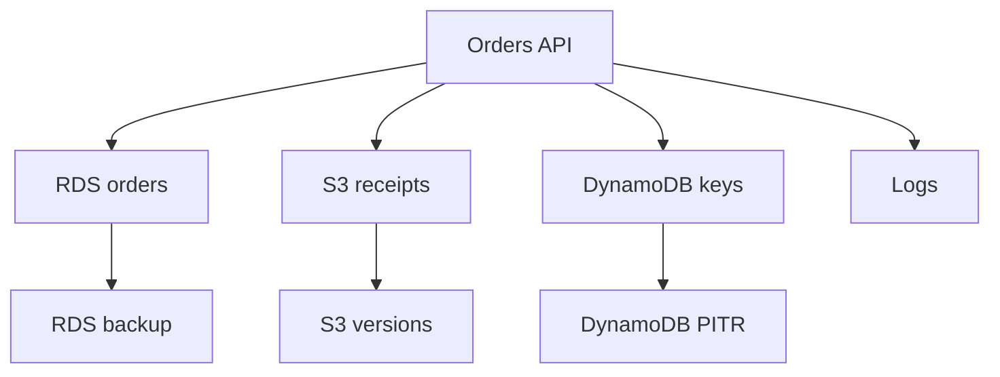

## Table of Contents

1. [The Problem](#the-problem)
2. [Recovery Planning](#recovery-planning)
3. [RTO And RPO](#rto-and-rpo)
4. [Recovery Strategies](#recovery-strategies)
5. [Recoverable Data](#recoverable-data)
6. [Backups](#backups)
7. [Restore](#restore)
8. [Bad Writes](#bad-writes)
9. [Failover](#failover)
10. [Drills](#drills)
11. [Putting It All Together](#putting-it-all-together)

## The Problem

The team has backups. That sounds comforting until the first real recovery question arrives.

An import job corrupts order status for the last three hours. Support asks whether customer receipts are still correct. Engineering asks which database restore point to use. Product asks how long checkout will be unavailable. Finance asks whether a partial recovery loses revenue records.

The uncomfortable facts appear:

- Nobody has restored the latest backup into a usable environment.
- Nobody knows whether RDS, S3, DynamoDB, and config can be recovered together.
- The team has a backup retention setting but no agreed data-loss target.
- Restoring a database creates a new resource, not an automatically fixed application.
- A failover plan exists in a diagram but has not been tested.

A backup answers "what copy exists?" A recovery plan answers "how do customers use the service again?"

## Recovery Planning

Recovery planning is the work of defining what must be recoverable, how quickly the service must return, how much data loss is acceptable, which backups or replicas are used, and how restore is validated.

It exists because recovery is a system path, not one AWS setting.

For `devpolaris-orders-api`, recovery may involve:

The plan needs to say which data matters, which restore point is acceptable, how the application points at recovered resources, how operators prove correctness, and how normal traffic resumes.

## RTO And RPO

RTO and RPO are the two plain-English recovery targets.

RTO, or recovery time objective, is how long the service can be unavailable before the impact is unacceptable.

RPO, or recovery point objective, is how much data loss the service can tolerate, measured as time between the last usable recovery point and the failure.

| Target | Plain question | Example |
| --- | --- | --- |
| RTO | How long can checkout be down? | Restore within 1 hour |
| RPO | How much order data can be lost? | Lose no more than 5 minutes |

The targets are business decisions that technical teams implement. Choosing aggressive targets without funding the design is wishful. Choosing loose targets without stakeholder agreement is risk hiding.

The gotcha is that different data can have different targets. Order records, receipts, export files, idempotency keys, and logs may not need the same recovery window.

## Recovery Strategies

Once RTO and RPO are named, the next question is how much of the recovery path should already exist before anything fails.

The simple rule is this: RTO is mostly about how much work remains during the incident. RPO is mostly about how fresh the recovered data is. Cost is mostly about how much duplicate environment, data replication, automation, and testing the team keeps ready all the time.

AWS commonly describes a disaster recovery ladder. The useful question is not "which box sounds more mature?" It is "what is already ready when the page arrives?"

| Strategy | Data | Infrastructure | Compute | Traffic | Cost shape |
| --- | --- | --- | --- | --- | --- |
| Backup and restore | Backups exist | Recreated from infrastructure code | Not running in recovery site | Primary site only | Lowest steady cost |
| Pilot light | Replicated or restorable data is ready | Core network, secrets, images, and routing plan exist | Scaled to zero or not deployed until recovery | Primary site only | Low to medium |
| Warm standby | Live copy or replica is ready | Full stack exists | Small complete stack already running | Usually primary site, with standby tested by health checks or synthetic traffic | Medium to high |
| Multi-site active/active | Multi-Region data design is live | Full stack exists in each active site | Capacity runs in multiple sites | Multiple sites serve users before failure | Highest |

Each step up the ladder lowers the amount of work left for the incident, but raises steady cost and operational complexity.

Pilot light is the pattern behind your "basic things ready, compute at zero" idea. For `devpolaris-orders-api`, the recovery Region might already have the VPC shape, replicated data, secrets, container images, task definitions, alarms, and DNS plan. The ECS service or worker fleet may run at zero desired tasks, or the app compute may be absent but deployable from known infrastructure code.

That saves money because the expensive app capacity is not sitting idle. It also means the RTO must include the work of starting tasks, scaling workers, checking secrets, validating the restored data path, and moving traffic. A 30-minute RTO might fit. A 2-minute RTO probably will not unless the startup and validation path is heavily automated and rehearsed.

Warm standby pays more to remove some of that work from the incident. The recovery environment already has a small but complete version of the service running. It might handle health checks, synthetic traffic, or a small slice of internal traffic. During recovery, the team scales it up instead of building it from cold pieces.

Multi-site active/active is the far end of the ladder. Both sites already serve users, so the traffic path is not waiting for a recovery event. The hard part moves into data design, conflict handling, deployment coordination, observability, and drills. If two Regions can accept writes, the application must know what happens when the same customer or order is touched in both places.

The ladder is not a maturity score. A monthly reporting service may be healthiest with backup and restore. Checkout might need pilot light or warm standby. A global payment path may justify active/active. The right answer is the cheapest tested strategy that actually meets the business RTO and RPO.

## Recoverable Data

Before choosing tools, name what must come back.

For the orders service:

| Data | Recovery need |
| --- | --- |
| RDS order records | Must restore customer order truth |
| S3 receipts | Customers and support need documents |
| DynamoDB idempotency keys | Prevent duplicate checkout side effects |
| SQS messages | Preserve or replay background work where needed |
| Config and secrets | Recovered service must point at correct resources |
| Logs and audit evidence | Explain what happened and validate recovery |

This prevents a common backup mistake: protecting the database and forgetting everything around it. A restored RDS instance is not enough if the app points at the wrong endpoint, secrets are stale, S3 receipts are missing, or queued work is replayed unsafely.

Recovery should restore a usable service path.

## Backups

Backups are recovery points. They may be snapshots, continuous backups, object versions, replicated data, or service-managed recovery points.

AWS Backup can organize recovery points in backup vaults for supported services. RDS supports automated backups and point-in-time recovery within a retention period. DynamoDB supports on-demand backups and point-in-time recovery. S3 can use versioning and lifecycle behavior to recover from overwrites or deletes when configured.

| Service area | Recovery mechanism |
| --- | --- |
| RDS | Automated backups, manual snapshots, PITR |
| DynamoDB | On-demand backups, PITR |
| S3 | Versioning, replication, backup where applicable |
| EBS | Snapshots |
| Cross-service plan | AWS Backup vaults and policies |

The gotcha is that a backup is not proof of recovery. It proves a copy exists. It does not prove restore time, application compatibility, permissions, DNS changes, validation, or cleanup.

## Restore

Restore creates a usable target from a recovery point. That target often has a new resource identity.

For RDS point-in-time recovery, AWS restores to a new DB instance. For DynamoDB point-in-time recovery, restore creates a new table. For S3 version recovery, the team may need to restore object versions or remove delete markers depending on the failure.

That means restore has application work around it:

| Restore step | Why it matters |
| --- | --- |
| Choose recovery point | Defines data loss |
| Create restored resource | Produces a usable target |
| Apply tags and permissions | Keeps ownership and access correct |
| Update config safely | Points app or jobs at the recovered resource |
| Validate data | Proves the target is correct |
| Resume traffic or jobs | Makes recovery visible to users |

The recovery target should be tested before traffic moves. A restored database with missing permissions or wrong security groups is still not a recovered service.

## Bad Writes

Not every recovery starts with an outage. Some start with wrong data.

A bad deploy may write incorrect order statuses. A script may delete rows. A worker may overwrite receipt objects. A retry bug may create duplicate side effects. In those cases, the service might still be online while the data is no longer trustworthy.

Bad writes are hard because the team must choose a point in time carefully. Restoring too far back loses valid orders. Restoring too late preserves corruption. Sometimes the safest path is targeted repair from logs, backups, exports, or application records.

The plan should answer:

| Question | Why it matters |
| --- | --- |
| When did corruption begin? | Defines restore window |
| Which data classes are affected? | Avoids broad unnecessary restore |
| What valid writes happened after? | Protects good customer actions |
| Can repair be targeted? | May reduce downtime and data loss |
| How is correctness verified? | Prevents silent partial recovery |

This is where observability and audit evidence become recovery tools.

## Failover

Failover means moving service responsibility to another healthy component or location.

The recovery strategy decides how much of that healthy location already exists. In a single Region, Multi-AZ RDS can help with Availability Zone failure by failing over to another Availability Zone. ECS services can run tasks across multiple Availability Zones. Load balancers can route around unhealthy targets.

For regional disaster recovery, failover is larger. A pilot light design may need to start compute before traffic moves. A warm standby design may scale an already-running recovery stack. An active/active design may route traffic away from a failed Region because the other Region is already serving.

Failover is not the same as restore:

| Mechanism | Primary job |
| --- | --- |
| Failover | Keep serving when one component or location fails |
| Restore | Rebuild usable state from a recovery point |
| Backup | Preserve a copy to restore from |
| Replication | Keep another copy updated elsewhere |

The gotcha is that failover can protect availability while still preserving bad data. Replication can copy a corrupted write. Active/active can keep serving users while the data problem spreads. Even fast failover still needs point-in-time recovery, backup protection, and drills for bad-write scenarios.

## Drills

A restore drill proves whether the plan works.

The drill should measure more than "backup exists." It should measure time, correctness, permissions, configuration, validation, traffic cutover, and cleanup.

For the orders service, a useful drill might:

1. Restore RDS to a test instance from a selected time.
2. Confirm the app can connect with a test task role and secret.
3. Verify sample orders and receipts.
4. Confirm idempotency and queued work behavior.
5. Record actual restore time and manual steps.
6. Delete or isolate test resources after review.

The drill creates evidence. If the target RTO is 1 hour and the drill takes 3 hours, the plan is not meeting the target yet. If restored resources miss tags or permissions, the plan needs repair before an incident.

## Putting It All Together

The opening team had backups but not a recovery plan. That is the dangerous gap.

Recovery planning defines RTO and RPO, then chooses the cheapest tested strategy that can meet them. Backup and restore keeps steady cost low but leaves more work for the incident. Pilot light keeps the core ready while compute starts later. Warm standby keeps a small full stack alive. Active/active keeps multiple sites serving traffic and moves the hard work into data design and operations.

The plan still has to name recoverable data, map backups across RDS, S3, DynamoDB, logs, config, and queues, and treat restore as a new usable system. Bad writes require careful point-in-time thinking and sometimes targeted repair. Failover helps service continuity, but it does not replace recovery points. Restore drills turn hope into evidence.

The plan is healthy when the team can say what must come back, how far back it may go, how long it should take, who performs the steps, and what evidence proves customers can use the service again.

---

**References**

- [REL13-BP01 Define recovery objectives for downtime and data loss](https://docs.aws.amazon.com/wellarchitected/2022-03-31/framework/rel_planning_for_recovery_objective_defined_recovery.html). Supports the RTO/RPO definitions and the need to set recovery objectives from business impact.
- [REL13-BP02 Use defined recovery strategies to meet the recovery objectives](https://docs.aws.amazon.com/wellarchitected/latest/framework/rel_planning_for_recovery_disaster_recovery.html). Supports the backup and restore, pilot light, warm standby, active/active, cost, and complexity tradeoff discussion.
- [Disaster recovery options in the cloud](https://docs.aws.amazon.com/whitepapers/latest/disaster-recovery-workloads-on-aws/disaster-recovery-options-in-the-cloud.html). Supports the recovery strategy ladder, pilot light switched-off compute behavior, warm standby distinction, active/passive routing, and active/active caveats.
- [Backup creation, maintenance, and restore](https://docs.aws.amazon.com/aws-backup/latest/devguide/recovery-points.html). Supports the AWS Backup recovery point, backup vault, and restore explanation.
- [Continuous backups and point-in-time recovery](https://docs.aws.amazon.com/aws-backup/latest/devguide/point-in-time-recovery.html). Supports the PITR and continuous-backup explanation.
- [Backing up and restoring your Amazon RDS DB instance](https://docs.aws.amazon.com/AmazonRDS/latest/gettingstartedguide/managing-backup-restore.html). Supports the RDS automated backup, manual snapshot, retention, and point-in-time restore discussion.
- [Backup and restore for DynamoDB](https://docs.aws.amazon.com/amazondynamodb/latest/developerguide/Backup-and-Restore.html). Supports DynamoDB on-demand backup, PITR, restore-to-new-table behavior, and PITR recovery-window details.
