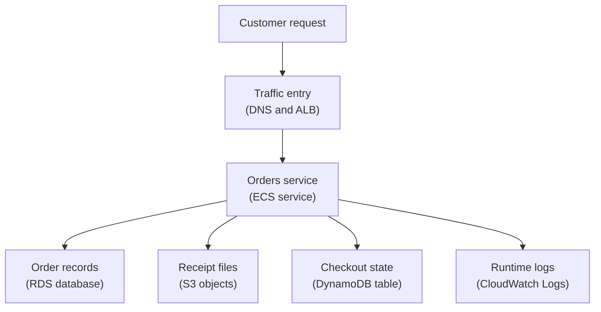

## Table of Contents

1. [What Recovery Planning Does](#what-recovery-planning-does)
2. [The Orders Service We Need to Bring Back](#the-orders-service-we-need-to-bring-back)
3. [RTO and RPO in Plain English](#rto-and-rpo-in-plain-english)
4. [What Must Be Recoverable](#what-must-be-recoverable)
5. [Backups Across the Data Path](#backups-across-the-data-path)
6. [Restore Is a New Usable System](#restore-is-a-new-usable-system)
7. [When Bad Writes Corrupt Orders](#when-bad-writes-corrupt-orders)
8. [Restore Drills Make the Plan Real](#restore-drills-make-the-plan-real)
9. [Failover and Multi-AZ Thinking](#failover-and-multi-az-thinking)
10. [The Recovery Tradeoff](#the-recovery-tradeoff)

## What Recovery Planning Does

A backup file by itself does not bring a service back.
It is only a possible starting point.
The useful question is bigger: if important data disappears, becomes wrong, or becomes unreachable, can the team put the service back into a working shape without guessing?

Recovery planning is the habit of answering that question before the incident.
It defines what must be recoverable, how far back the team may need to go, how long the restore may take, which AWS resources are involved, and how the application will safely use the restored target.
It exists because backups are passive.
They sit somewhere until a human or a runbook turns them into a running system again.

This work sits between normal runtime operations and disaster recovery.
Runtime operations keeps the current service healthy.
Recovery planning asks what happens when the current service is not enough anymore.
Maybe a table was deleted.
Maybe a bad deploy wrote wrong values.
Maybe an Availability Zone has trouble and the database must fail over.
Maybe a Region has trouble and the team needs a more serious recovery path.

The running example is a Node.js service called `devpolaris-orders-api`.
It runs on Amazon ECS (Elastic Container Service), which keeps container tasks running for the API.
It stores final orders in Amazon RDS (Relational Database Service), AWS's managed relational database service.
It stores receipt and export files in Amazon S3 (Simple Storage Service), AWS object storage.
It stores idempotency keys and job state in Amazon DynamoDB, a managed key-value and document database.
It writes runtime evidence to CloudWatch Logs, the AWS log store where the team reads application output.

That ordinary shape is enough to teach the real lesson.
The team does not need one backup setting.
It needs a recovery plan for the whole service path.

> A backup answers "what copy exists?" A recovery plan answers "how do customers use the service again?"

The rest of this article follows one service through that plan.
You will see how RTO and RPO guide decisions, why restore targets matter, how AWS backup features fit together, and why a restore drill is the difference between hope and evidence.

## The Orders Service We Need to Bring Back

Before you choose AWS settings, name the service and the promises it makes.
For `devpolaris-orders-api`, the business promise is simple.
Customers can place orders, see order status, download receipts, and retry checkout safely if the network or payment provider stutters.

The application shape looks like this:



Read the diagram from top to bottom.
Traffic reaches the load balancer, the load balancer sends requests to ECS tasks, and the tasks depend on three data stores plus logs.
If any one of those pieces is restored in isolation, the service may still be broken.
ALB means Application Load Balancer, the AWS load balancer that receives HTTP traffic and forwards it to healthy targets.

Here is a compact recovery card for the service:

```text
service: devpolaris-orders-api
environment: prod
runtime: ECS service devpolaris-orders-api in cluster devpolaris-prod
traffic: Route 53 DNS record orders.devpolaris.com -> ALB prod-orders-api
database: RDS PostgreSQL instance orders-prod
objects: S3 bucket devpolaris-orders-prod-objects
state: DynamoDB table devpolaris-checkout-state-prod
logs: CloudWatch log group /ecs/devpolaris-orders-api
release evidence: task definition revision, image digest, deploy time
```

This card is not paperwork for its own sake.
It keeps the team from saying "restore orders" and meaning five different things.
During an incident, vague words waste time.
Concrete resource names give the next engineer a place to look.

The card also shows why backups alone are not enough.
An RDS restore might create a good database.
That database still needs a network path, credentials, app configuration, and a safe decision about whether production should read from it.
An S3 object version might contain the missing receipt.
The application still needs the current object key to point at the correct version or a copy of it.

Recovery planning begins by making those dependencies visible.
Once the map is visible, RTO and RPO become useful instead of abstract.

## RTO and RPO in Plain English

RTO means recovery time objective.
It is the target for how long the service can be unavailable or degraded before the business pain becomes unacceptable.
If the orders API has an RTO of 30 minutes, the team is saying, "after this kind of incident, we are aiming to have a usable orders service again within 30 minutes."

RPO means recovery point objective.
It is the target for how much data the business can afford to lose, measured as time.
If the orders database has an RPO of 5 minutes, the team is saying, "after recovery, we should not lose more than about the last 5 minutes of accepted order writes."

These are objectives, not magic guarantees.
Writing `RTO: 30 minutes` in a document does not make a restore complete in 30 minutes.
The backup schedule, restore process, validation checks, app config, traffic switch, and human practice must make that target realistic.

Here is a simple example.
At 10:20 UTC, the team discovers that a bad release started corrupting order statuses at 10:12 UTC.
The service is still online, but it is writing dangerous data.
The team stops the bad release and now has two separate questions:

| Question | Plain meaning | Example answer |
|----------|---------------|----------------|
| RTO | How quickly must checkout be safe again? | "We need safe order writes back within 30 minutes." |
| RPO | How far back can recovered data be? | "We can reconcile a few minutes, but not lose an hour of orders." |
| Restore point | Which time is the last known good data state? | "Restore to just before the bad release began writing." |
| Recovery mode | How will users get a safe service again? | "Repair production from a side restore, or cut over if repair is unsafe." |

Notice that RTO and RPO do not choose the fix by themselves.
They shape the fix.
If the RTO is short, the team may first roll back the ECS service to stop more damage.
If the RPO is strict, the team must be careful not to restore so far back that it loses valid orders placed after the chosen time.

This is why a beginner should not think of recovery as "click restore."
The harder work is choosing the target.
A restore to 10:10 may remove the bad writes, but it may also exclude good orders created at 10:13 by customers who were not affected by the bug.
A restore to 10:19 may keep more good orders, but it may keep the corrupted rows too.

RTO and RPO help the team make that tradeoff out loud.
They turn a stressful argument into a decision about time, data, and business risk.

## What Must Be Recoverable

When people say "the orders service must be recoverable," they usually mean the database first.
That is understandable, because final order rows matter most.
But a real AWS service depends on more than one database.

For `devpolaris-orders-api`, the recovery surface looks like this:

| Recoverable piece | AWS place | Why it matters |
|-------------------|-----------|----------------|
| Final order data | RDS PostgreSQL | Source of truth for order status, payments, and line items |
| Receipt and export files | S3 bucket and object versions | Customer receipts and finance files may need earlier versions |
| Idempotency and job state | DynamoDB table | Retries must not create duplicate orders or lose job progress |
| Runtime recipe | ECS task definition and image digest | The service must run a known version with the right port and roles |
| Configuration | Task environment and service settings | The app must point at the restored database, table, bucket, and Region |
| Secret references | Secrets Manager ARNs or names | The app needs valid references without putting secret values in Git |
| DNS and traffic path | Route 53, ALB, target group | Users must reach healthy tasks after recovery |
| Logs and evidence | CloudWatch Logs, deploy records, audit events | The team needs to know what happened and prove the restore is safe |

Each row has a different recovery style.
RDS point-in-time recovery can rebuild a database at a chosen time.
S3 Versioning can expose an older object version after an overwrite or simple delete.
DynamoDB point-in-time recovery, often shortened to PITR, can restore table data to a new table.
ECS does not restore data, but it provides the running recipe that must be correct after data is restored.

The secret row deserves special care.
A recovery plan should not paste database passwords into a markdown file.
It should name the secret reference the service expects, such as `orders/prod/postgres`, and explain which application setting points at it.
That gives operators the dependency without spreading sensitive values.

A runtime config snapshot might look like this:

```text
service: devpolaris-orders-api
taskDefinition: devpolaris-orders-api:42

DATABASE_SECRET_ID=orders/prod/postgres
ORDERS_OBJECT_BUCKET=devpolaris-orders-prod-objects
CHECKOUT_STATE_TABLE=devpolaris-checkout-state-prod
AWS_REGION=us-east-1
PUBLIC_ORDERS_HOST=orders.devpolaris.com
```

During a restore, one of these names may change temporarily.
For example, a side restore might use `orders-prod-restore-20260502-101100` as the database host.
A DynamoDB inspection table might be named `devpolaris-checkout-state-restore-20260502-101100`.

That is where many teams get surprised.
The backup can be healthy while the app still reads the original broken target.
Recovery planning makes the configuration switch explicit.

## Backups Across the Data Path

AWS gives each data service its own recovery tools.
The beginner mistake is to treat those tools as interchangeable.
They are not interchangeable because the data is not interchangeable.

RDS snapshots and RDS point-in-time recovery protect the relational database.
A snapshot is a named backup of the DB instance at a point.
It is useful before a risky migration, before a bulk data change, or as a known recovery point.
Point-in-time recovery is useful when the team needs a specific moment rather than a named snapshot.

The important operational detail is that an RDS restore creates a new DB instance.
It does not safely rewind production in place.
That gives the team room to inspect the restored data before deciding whether to repair production or cut over.

You can see the shape of the restore intent in the command itself:

```bash
$ aws rds restore-db-instance-to-point-in-time \
    --source-db-instance-identifier orders-prod \
    --target-db-instance-identifier orders-prod-restore-20260502-101100 \
    --restore-time 2026-05-02T10:11:00Z
```

The source is the original database.
The target is a new database whose name includes the chosen restore time.
That name helps humans avoid mixing up the live database and the restored database during a repair.

S3 needs a different mental model.
The orders service writes receipts and exports to object keys like these:

```text
s3://devpolaris-orders-prod-objects/receipts/2026/05/order_ord_01HVA9.pdf
s3://devpolaris-orders-prod-objects/exports/daily/2026/05/02/orders.csv
s3://devpolaris-orders-prod-objects/manifests/export-job/job_01HX9A0.json
```

S3 Versioning helps when a key is overwritten or deleted without naming a specific version.
An older version may still exist behind the same key.
That is useful for receipt files and export files because the key customers or finance expect may be the same even when the current version is wrong.

A version listing gives direct evidence:

```bash
$ aws s3api list-object-versions \
    --bucket devpolaris-orders-prod-objects \
    --prefix exports/daily/2026/05/02/orders.csv
{
  "Versions": [
    {
      "Key": "exports/daily/2026/05/02/orders.csv",
      "VersionId": "3HL4kqtJlcpXroDTDmJrmSpXd3dIbrH",
      "IsLatest": false,
      "LastModified": "2026-05-02T08:05:21+00:00",
      "Size": 481923
    }
  ],
  "DeleteMarkers": [
    {
      "Key": "exports/daily/2026/05/02/orders.csv",
      "VersionId": "mF9pZs0exampleDeleteMarker",
      "IsLatest": true,
      "LastModified": "2026-05-02T10:19:44+00:00"
    }
  ]
}
```

The delete marker explains why a normal read looks like the object is gone.
The older version gives the team something specific to copy back or inspect.
Lifecycle rules sit beside versioning.
They decide when current objects, noncurrent versions, or delete markers should be expired.

Do not let one lifecycle rule speak for every prefix.
Temporary release files, finance exports, receipt PDFs, and cleanup manifests have different jobs.
They should have different retention decisions.
The recovery plan should say who chose those periods and why.

DynamoDB recovery is different again.
The checkout state table stores idempotency records and job status.
A typical item might look like this:

```json
{
  "pk": "IDEMPOTENCY#checkout_01HX9K7N3",
  "sk": "REQUEST",
  "requestHash": "sha256:18f9b31c",
  "status": "processing",
  "orderId": null,
  "jobId": "JOB#job_01HX9K7Q8",
  "createdAt": "2026-05-02T10:08:42Z",
  "expiresAt": "reviewed-by-application-policy"
}
```

Point-in-time recovery for DynamoDB protects against accidental writes or deletes by letting the team restore table data to a chosen time.
Like RDS, the restore target is a new resource.
The application will not magically read that new table unless configuration or repair code points at it.

For `devpolaris-orders-api`, DynamoDB restore is often an inspection and repair tool.
If idempotency records were deleted too early, the team may restore a side table, compare keys, and repair only the missing safety records.
It usually should not roll the whole checkout state table backward without thinking, because valid newer job state may exist in production.

## Restore Is a New Usable System

The most important recovery sentence is short: restore is not the same thing as backup.
A backup exists somewhere.
A restore creates something the service can use.

For AWS data services, that restored thing is often a new resource.
RDS point-in-time restore creates a new DB instance.
DynamoDB restore creates a new table.
An S3 object version may need to be copied back so the expected key serves the right content.
An ECS rollback points the service to a previous task definition, but the app still needs correct data targets.

That means every restore needs a target record.
Here is a good one:

```text
restore record: orders-data-incident-2026-05-02
incident: bad release wrote wrong order totals
last known good time: 2026-05-02T10:11:00Z
rds source: orders-prod
rds restore target: orders-prod-restore-20260502-101100
s3 bucket: devpolaris-orders-prod-objects
dynamodb source: devpolaris-checkout-state-prod
dynamodb side table: devpolaris-checkout-state-restore-20260502-101100
runtime guard: ECS service rolled back to task definition devpolaris-orders-api:41
traffic decision: keep production on original database until repair is validated
```

This record separates recovery work from recovery evidence.
The team can point at the restored database and say why it exists.
It can point at the old ECS task definition and say why the writer was rolled back.
It can point at the traffic decision and show that no one silently cut production over to a side resource.

A usable restore also needs validation.
Validation is not "AWS says restore complete."
It is checking that the data and the service behavior match the recovery goal.

For an orders database, validation might include:

```text
restored database validation
target: orders-prod-restore-20260502-101100

checks:
  sample corrupted order ord_01HX9M4Q has expected previous total
  latest valid order before restore time exists
  suspicious bad write pattern is absent
  database security group allows only review access
  app migrations table matches expected release boundary

decision:
  use restored database as repair source, not direct traffic target yet
```

The last line matters.
Direct cutover is only one recovery mode.
Sometimes the safer plan is to keep production running after rollback, then use the restored database to calculate repair statements for the corrupted rows.
Sometimes the safer plan is to cut over to the restored database because production is too damaged.

Both choices can be valid.
The difference is whether the team understands what good data would be lost, what bad data would remain, and how traffic will reach the chosen target.

## When Bad Writes Corrupt Orders

Now put the plan under pressure.
A new release of `devpolaris-orders-api` changes discount handling.
The deploy passes health checks because the process starts and `/healthz` returns `200`.
But the first busy hour after deploy shows strange order totals.

CloudWatch Logs gives the first useful clue:

```text
2026-05-02T10:14:38.611Z WARN service=devpolaris-orders-api release=2026-05-02.5
event=order_total_recalculated
orderId=ord_01HX9M4Q
subtotalCents=4200
discountCents=8400
totalCents=-4200
requestId=req_01HX9M4R
```

The problem is not "a request failed."
The problem is worse.
The app accepted a write that should not be valid.
A retry could write more wrong totals.
A dashboard could read those totals.
A finance export could include them.

The first recovery move is to stop new damage.
That may mean rolling back the ECS service to the previous task definition, disabling the bad write path, or temporarily rejecting checkout writes while the team understands the blast radius.
The exact move depends on the service, but the goal is the same: stop the bad writer before restoring anything.

Then the team diagnoses the time window.
A small database report can make the shape visible:

```text
orders=> select date_trunc('minute', updated_at) as minute,
orders->        count(*) filter (where total_cents < 0) as negative_totals,
orders->        count(*) as changed_orders
orders-> from orders
orders-> where updated_at >= '2026-05-02T10:00:00Z'
orders-> group by 1
orders-> order by 1;

 minute                  | negative_totals | changed_orders
-------------------------+-----------------+---------------
 2026-05-02 10:10:00+00  | 0               | 42
 2026-05-02 10:11:00+00  | 0               | 39
 2026-05-02 10:12:00+00  | 7               | 45
 2026-05-02 10:13:00+00  | 18              | 51
 2026-05-02 10:14:00+00  | 26              | 58
```

This output teaches the recovery decision.
The last clearly good minute appears before 10:12 UTC.
But there may also be valid orders after 10:12 UTC.
If the team simply cuts production over to a 10:11 restore, it may lose good later orders.

That is how teams accidentally overwrite good data while trying to remove bad data.
They choose a restore point that removes the corruption, then forget that other valid writes happened after that point.

A safer recovery path is slower, but more controlled:

1. Stop or roll back the bad writer.
2. Restore RDS to a side instance at the chosen last good time.
3. Keep production writes paused or guarded while the repair plan is built.
4. Compare production against the side restore for the affected rows.
5. Repair only the corrupted rows, or cut over only if repair cannot protect correctness.
6. Reconcile valid orders created after the restore time.
7. Resume traffic after validation and monitoring agree.

The key idea is that the side restore is evidence, not automatically the new production database.
It gives the team a clean reference point.
The repair still has to respect newer good data.

S3 and DynamoDB need the same care.
If a finance export was generated from corrupted totals, the team may restore or regenerate the export after the database repair.
If idempotency records were created during the bad window, the team may inspect the restored DynamoDB table and production table before deciding which keys are safe.

Recovery is a data decision, not only an AWS action.

## Restore Drills Make the Plan Real

A restore drill is a practice recovery in a controlled environment.
It exists because humans are bad at discovering missing steps under pressure.
The first time your team restores RDS should not be during the incident that needs RDS restored.

A good drill is narrow.
It does not need to simulate the end of the world.
It should prove one recovery path from backup to usable service.
For `devpolaris-orders-api`, a useful first drill might be:

```text
drill: orders-rds-side-restore
goal: prove the team can restore RDS, validate data, and run the API against the restored target in staging
source: latest approved production-like backup or safe test copy
restore target: orders-drill-restore-YYYYMMDD
runtime target: staging ECS task with DATABASE_SECRET_ID pointing at drill secret
validation:
  app starts
  /healthz passes
  sample order read succeeds
  write test is blocked unless drill explicitly allows it
  CloudWatch logs show drill release and restored database host
cleanup:
  delete drill resources after review
  keep drill notes and timings
```

The drill should measure the parts that RTO depends on.
How long did the database restore take?
How long did validation take?
How long did it take to update the secret reference or task definition?
How long did it take for the ECS task to become healthy?

The drill should also measure the parts that RPO depends on.
Could the team find the last restorable time?
Could it choose the intended restore point?
Could it prove which writes would be absent from the restored target?

CloudWatch Logs should make the drill visible:

```text
2026-05-02T14:22:09.103Z INFO service=devpolaris-orders-api env=staging
event=recovery_drill_start drill=orders-rds-side-restore
taskRevision=devpolaris-orders-api:drill-17

2026-05-02T14:31:44.889Z INFO service=devpolaris-orders-api env=staging
event=restore_target_validated
databaseHost=orders-drill-restore-20260502.c8r2.example.us-east-1.rds.amazonaws.com
sampleOrder=ord_drill_1001
readCheck=passed
```

The log is simple on purpose.
It proves that the restored database was actually used by a running service.
That is very different from a console page that says a backup exists.

A drill often finds boring missing pieces.
The restored database has the wrong security group.
The app secret points at the old host.
The ECS task role can read production secrets but not drill secrets.
The staging ALB health check points at `/health` while the service serves `/healthz`.
The cleanup step forgot to remove the restored resource.

Those are good findings.
They are much cheaper during a drill than during a customer incident.

## Failover and Multi-AZ Thinking

Backups help when data is missing or wrong.
Failover helps when a running component cannot serve from its current location.
Those are related, but they are not the same tool.

Multi-AZ means resources are placed across multiple Availability Zones in one AWS Region.
An Availability Zone is a separate data center location inside a Region.
For RDS, a Multi-AZ deployment can provide a standby path so the database can fail over when the primary side has trouble.

That helps with availability.
It does not protect you from a bad SQL write.
If the app updates `orders.total_cents` to a wrong value, that wrong value is still database data.
High availability can faithfully keep bad data available.

That is why the plan needs both backup thinking and failover thinking:

| Failure shape | Helpful tool | Beginner warning |
|---------------|--------------|------------------|
| RDS host or AZ trouble | RDS Multi-AZ failover | It helps availability, not bad data repair |
| Bad deploy writes wrong rows | RDS PITR or snapshot side restore | Restoring too far back may lose later good writes |
| S3 object overwritten | S3 Versioning | Lifecycle may eventually expire old versions |
| DynamoDB item deleted | DynamoDB PITR side table | App config still points at the original table |
| ECS task unhealthy | ECS rollback and ALB health | Rollback does not repair corrupted data |
| Regional trouble | Region-level recovery plan | This needs copied data, runtime config, and DNS decisions ahead of time |

For the orders API, basic Multi-AZ thinking starts with the normal production path.
Run ECS tasks in more than one Availability Zone.
Put the ALB in subnets that can reach those tasks.
Use an RDS deployment pattern that supports failover for the database need.
Keep DynamoDB and S3 usage in mind as regional services whose recovery story is different from a single ECS task.

Then be honest about regional trouble.
If the plan says "recover in another Region," the team must know what data, images, secrets references, task definitions, DNS records, and certificates need to exist there.
That is a bigger and more expensive plan than Multi-AZ inside one Region.

For a junior engineer, the practical lesson is this:

```text
Multi-AZ reduces some infrastructure downtime.
Backups and restores reduce some data-loss risk.
Rollback reduces some bad-release risk.
Regional recovery needs a separate design.
```

Do not let one of those replace the others in your head.
They answer different failure shapes.
The strongest plans combine them carefully, then test the combination.

## The Recovery Tradeoff

Stronger recovery costs more.
It can require more stored backups, more retained object versions, more replicated resources, more environments for drills, more monitoring, and more careful release records.
It can also add operational complexity.

That complexity is real.
If the team keeps every version forever, storage cost grows and privacy responsibility grows with it.
If the team builds a warm standby in another Region, it must keep config, secrets references, data copies, runtime images, and DNS decisions aligned.
If every restore requires five teams and no one practices, the written RTO is not believable.

Weak recovery has a cost too.
It turns incidents into long investigations.
It makes data loss larger.
It forces engineers to choose between losing valid orders and keeping corrupted rows.
It makes customers wait while the team discovers that the backup exists but the app cannot use it.

The useful tradeoff is not "maximum recovery everywhere."
It is matching recovery strength to the data and the business promise.

| Data or path | Stronger recovery gives | It also costs |
|--------------|-------------------------|---------------|
| RDS orders | Smaller data-loss window and clearer repair options | Backup storage, restore drills, validation work |
| S3 receipts | Older versions after overwrite or delete | Version storage and lifecycle design |
| DynamoDB idempotency | Safer retry repair after bad writes | PITR cost and careful side-table workflows |
| ECS runtime | Faster rollback to a known recipe | Release tracking and task definition discipline |
| Multi-AZ database | Better availability during some infrastructure failures | Higher database cost and failover testing |
| Regional recovery | More options during regional trouble | Duplicate operating surface and regular proof |

For `devpolaris-orders-api`, the sensible beginner plan is layered.
Protect final orders strongly.
Protect customer-visible files with versioning and reviewed lifecycle.
Protect checkout state enough to make retries safe.
Keep ECS rollback targets visible.
Practice side restores before production needs them.
Decide separately whether the business needs a Region-level recovery path.

That is the real shape of recovery planning.
It is not a pile of definitions.
It is a set of promises the service can actually keep when something goes wrong.

---

**References**

- [Plan for Disaster Recovery (DR) - AWS Well-Architected Reliability Pillar](https://docs.aws.amazon.com/wellarchitected/latest/reliability-pillar/plan-for-disaster-recovery-dr.html) - Explains RTO, RPO, and how recovery objectives should come from business needs.
- [Restoring a DB instance to a specified time for Amazon RDS](https://docs.aws.amazon.com/AmazonRDS/latest/UserGuide/USER_PIT.html) - Documents RDS point-in-time restore and the new DB instance recovery target.
- [Multi-AZ DB instance deployments for Amazon RDS](https://docs.aws.amazon.com/AmazonRDS/latest/UserGuide/Concepts.MultiAZSingleStandby.html) - Explains RDS high availability and failover support across Availability Zones.
- [How S3 Versioning works](https://docs.aws.amazon.com/AmazonS3/latest/userguide/versioning-workflows.html) - Describes object versions, delete markers, and restoring earlier object versions after overwrite or delete.
- [Lifecycle configuration elements](https://docs.aws.amazon.com/AmazonS3/latest/userguide/intro-lifecycle-rules.html) - Shows how S3 lifecycle actions handle current objects, noncurrent versions, and delete markers.
- [Restore a table in DynamoDB](https://docs.aws.amazon.com/amazondynamodb/latest/developerguide/pointintimerecovery_restores.html) - Explains DynamoDB point-in-time restore to a new table.
