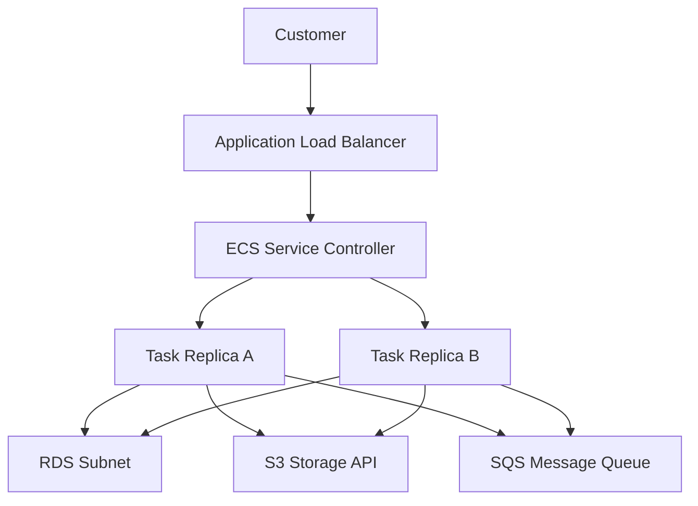

## Table of Contents

1. [The Workstation Illusion](#the-workstation-illusion)
2. [What Is Runtime Operations](#what-is-runtime-operations)
3. [Running Services and Orchestrators](#running-services-and-orchestrators)
4. [Container Images: The Static Candidates](#container-images-the-static-candidates)
5. [The Runtime Contract](#the-runtime-contract)
6. [The Health Layer Contract](#the-health-layer-contract)
7. [Capacity and Resource Load Balance](#capacity-and-resource-load-balance)
8. [Rollback: Returning to a Known Good Contract](#rollback-returning-to-a-known-good-contract)
9. [Putting It All Together](#putting-it-all-together)
10. [What's Next](#whats-next)

## The Workstation Illusion

The continuous integration pipeline is completely green. The container image has been successfully compiled and pushed to Amazon Elastic Container Registry (ECR). The release notes are finalized. From the build system's perspective, the software engineering work looks finished.

However, once you move into the production environment, the most critical operational questions have not yet been answered:

* Which exact software version is currently serving customer traffic?
* Did the newly started process receive the correct environment configurations and database credentials?
* Does the container process have the required IAM permissions to write files or publish messages?
* Will the load balancer send incoming HTTP requests only to replicas that are fully initialized?
* Is there sufficient CPU, memory, and task count capacity to handle the current customer volume?
* If the newly deployed version crashes under load, what specific revision can you safely restore?

An artifact proves that something was built. It does not prove that a customer can actually use it. Runtime operations is the collection of architectural boundaries, configurations, permissions, and feedback loops that turn a static build artifact into a safe, running production service.

*A container image is a candidate, not the live service. The runtime contract around it supplies the task definition, configuration, IAM roles, health signals, capacity rules, and rollback path that make production traffic safe.*

## What Is Runtime Operations

Runtime operations is the practice of keeping a deployed application running correctly after its build artifact is created. It bridges the gap between automated pipelines and day-to-day incident response, establishing the operational guardrails that protect live systems.

For an application running on AWS, runtime operations manages the lifecycle of the process and its dependencies across several distinct concerns:

Operational Telemetry and Target Questions:

| Operational Concern | Core Runtime Question |
| :--- | :--- |
| **Version Enforcement** | Which container image digest and orchestrator task definition are running right now? |
| **Configuration Delivery** | What environment variables, database URLs, and API credentials has the container loaded? |
| **Permission Boundaries** | What AWS resources is the container's active IAM task role authorized to communicate with? |
| **Traffic Trust** | What health checks and load balancer target rules decide when a container gets traffic? |
| **Capacity Management** | How many container replicas are running, and what rules trigger horizontal scaling? |
| **Recovery Strategy** | What is the exact sequence to rollback the code and configuration if a failure occurs? |

To build an intuitive mental model, you can think of a container image as the static body of the application. Runtime operations is the surrounding world that decides where that body lives, what values it wakes up with, how traffic enters it, and how operators determine it is safe.

## Running Services and Orchestrators

In a professional cloud architecture, an application container does not run as a loose, isolated process. High-volume systems are managed by an orchestrator, such as Amazon Elastic Container Service (ECS).

Let us visualize the request path and physical resource cabling of our application service, `devpolaris-orders-api`:

In the standard production design, customers do not send network packets directly to container tasks. They connect to a public Application Load Balancer (ALB). The ALB usually terminates TLS on an HTTPS listener and routes requests to healthy container tasks through private target groups.

The ECS Service Controller acts as the operational supervisor. Its primary job is to maintain the desired count of active containers, known as tasks. If a physical hardware node fails or an application process crashes due to an out-of-memory error, the service controller detects the loss and launches a replacement task automatically, maintaining system availability without human intervention.

The first essential runtime habit is to identify the specific controller responsible for keeping the workload alive, rather than attempting to manage container processes manually.

## Container Images: The Static Candidates

A container image is the compiled package containing your application code, runtime libraries, and system dependencies. In AWS, these images are stored in Amazon ECR. 

A built container image is a static package, and an image digest identifies its exact bytes. This immutability is highly valuable because it lets staging and production run the same artifact when both reference the same digest. Human-friendly tags such as `latest` or `production` can still move unless your repository disables tag mutation, so production runtime contracts should pin the digest they intend to run. However, because the image package is static, it cannot answer environment-specific questions:

Image Boundaries and Missing Information:

| Missing Information | Why the Static Image Cannot Contain It |
| :--- | :--- |
| **Staging vs. Production** | The image must remain identical across environments to ensure packaging consistency. |
| **Database Credentials** | Hardcoding passwords or connection strings in ECR images compromises security. |
| **Compute Sizing** | The amount of CPU allocation and RAM bounds are decided by the orchestrator at boot time. |
| **AWS API Credentials** | Permissions to write to S3 or publish to SQS are granted via dynamic IAM roles, not local files. |
| **Live Performance Health** | The code within the image cannot monitor its own network traffic or memory leaks. |

This is why pushing an image to ECR is not the same as deploying a release. The image is merely a candidate. The running service is the production fact.

## The Runtime Contract

Because a container image is static, it requires a surrounding contract to boot successfully. In Amazon ECS, this runtime contract is declared inside a JSON document called a Task Definition. 

A Task Definition is the recipe that tells the Fargate serverless platform exactly how to run the container. When you update an application, ECS creates a numbered revision of this task definition recipe:

* **Image Reference**: The ECR registry location and digest of the container image.
* **Port Mappings**: The internal port the container process listens on (such as port 3000), mapped to the load balancer ingress.
* **Resource Limits**: The precise CPU shares (such as 0.5 vCPU) and RAM limits (such as 1 GB) allocated to the process.
* **Environment Variables**: Non-sensitive settings, such as `NODE_ENV=production` or `LOG_LEVEL=info`.
* **Secret References**: Decoupled credentials fetched from Secrets Manager or Parameter Store at boot time.
* **Task Role**: The IAM identity granting the application code permissions to call S3, SQS, or DynamoDB.
* **Execution Role**: The IAM identity used by the ECS agent machinery to pull ECR images and write CloudWatch logs.
* **Logging Configuration**: The target CloudWatch Log Group folder where standard output is securely streamed.

The runtime contract can fail even if your application code is bug-free. A misspelled secret reference, an undersized memory limit, or a missing S3 IAM permission on the task role will cause the container to crash or reject transactions immediately upon startup.

## The Health Layer Contract

Once a container is running, the orchestrator must answer the core traffic trust question: *Should we route customer packets to this task?*

Health is not a single check. To operate reliably, you must understand the distinct layers of health telemetry:

* **Process State**: Proves that the Linux container process has not exited. This is a basic container engine check.
* **Task State**: Proves that the ECS agent has successfully placed, initialized, and transitioned the task to a running status.
* **Load Balancer Health**: Proves that the ALB can successfully establish TCP sockets and receive healthy HTTP responses (such as an HTTP 200) from the task's custom readiness endpoint.
* **Application Readiness**: Proves that the application has completed its internal startup checks, initialized connection pools, loaded caches, and is ready to accept transactions.
* **Operational SLA Metrics**: Proves that real customer requests are succeeding within latency boundaries, monitored via error rates and latency percentiles.

Responders often make the mistake of creating a single health check that queries every downstream database and third-party API. If a third-party email gateway experiences a brief blip, a deep health check will mark the entire orders API task unhealthy. The ALB will immediately stop routing traffic, and the ECS service controller will terminate and recreate every task in a continuous, destructive cycle. 

Keep your load balancer health checks fast and lightweight, reserving deep dependency metrics for background alerting dashboards.

## Capacity and Resource Load Balance

Capacity is the operational lever that answers: *Can this service absorb the current volume of transactions?*

For ECS services, the primary capacity control is the desired count parameter, which dictates the number of task replicas the service maintains. Autoscaling policies can dynamically adjust this desired count up or down based on incoming CPU utilization, memory pressure, or request counts.

However, scaling out compute resources is not a universal solution for system failure. Adding more tasks helps if your application is CPU-bound and downstream databases have idle headroom. 

If your relational database is already saturated and locking rows under heavy transactional load, scaling your compute tasks from 4 to 40 will open 10 times as many database connection pool handles. This connection storm will completely exhaust database memory, turning a slow response latency into a global production crash.

Capacity shifts must be treated as active operations. Responders must identify where the saturation resides before pulling compute scaling levers.

## Rollback: Returning to a Known Good Contract

Rollback is the emergency recovery path. It means returning the running service to a previous known-good state. 

In an ECS cluster, rollback is not a generic "undo" button. It is a precise operation that updates the ECS service definition back to a previous, stable Task Definition revision:

* **Recipe Reference**: Restores the previous, numbered task definition revision (such as changing the target from `orders-api:43` back to `orders-api:42`).
* **Image Digest**: Restores the exact immutable image hash, ensuring the old code is deployed.
* **Configuration Sync**: Restores the environment variable and secret coordinates that matched that specific version, preventing compatibility conflicts.
* **Metric Baselines**: Responders monitor active error rates and p95 latency graphs, verifying that the rollback has successfully returned the system to healthy baseline levels.

Config drift is the primary gotcha of manual rollbacks. If an operator changes a database password or deletes an IAM permission, rolling back the application code will not recover the service. To operate safely, the entire runtime contract—the image, variables, secrets, and permissions—must be versioned and deployed as a cohesive unit.

## Putting It All Together

A green build pipeline is only the first step in a software release. To run a stable cloud architecture, you must master the mechanics of runtime operations:

* **Acknowledge the Orchestrator**: Trust the ECS Service Controller to manage task lifecycles, and completely avoid manual container start scripts.
* **Isolate Static Packages**: Maintain static, immutable ECR container images, completely separating code packaging from environment configuration.
* **Secure the Runtime Contract**: Manage your task definition parameter recipes as versioned, high-priority operational assets.
* **Isolate Health Layers**: Enforce lightweight load balancer target checks, ensuring dependency blips do not trigger task termination loops.
* **Analyze Bottlenecks Before Scaling**: Verify database and queue limits before scaling compute task replicas to prevent connection saturation storms.
* **Design Reversible Rollbacks**: Record and maintain exact task definition revisions to enable rapid, safe recovery paths during incidents.

## What's Next

We have established the foundational mental model of runtime operations, separating build candidates from live running services. In the next article, we will follow the most critical operational event: an ECS rolling deployment. We will detail how to compile task definition revisions, execute service updates, configure rolling update percentages, analyze target group connection draining, and inspect deployment evidence from the terminal.

*Use this as the runtime operations checklist: anchor the image, version the task definition, separate config, split roles, keep health checks lightweight, size capacity deliberately, and preserve a known-good rollback path.*

---

**References**

* [Amazon ECS Services](https://docs.aws.amazon.com/AmazonECS/latest/developerguide/ecs_services.html) - AWS developer guide to compute controllers and load balancer targets.
* [Amazon ECS Task Definitions](https://docs.aws.amazon.com/AmazonECS/latest/developerguide/task_definitions.html) - Documentation on versioning container parameters and resource boundaries.
* [Task Definition Parameters](https://docs.aws.amazon.com/AmazonECS/latest/developerguide/task_definition_parameters.html) - Technical reference for image, port, role, log, and memory parameters.
* [Preventing image tag overwrites in Amazon ECR](https://docs.aws.amazon.com/AmazonECR/latest/userguide/image-tag-mutability.html) - Explains mutable and immutable image tag behavior in ECR.
* [Amazon ECS Application Auto Scaling](https://docs.aws.amazon.com/AmazonECS/latest/developerguide/service-auto-scaling.html) - Guide to configuring horizontal scale limits.
