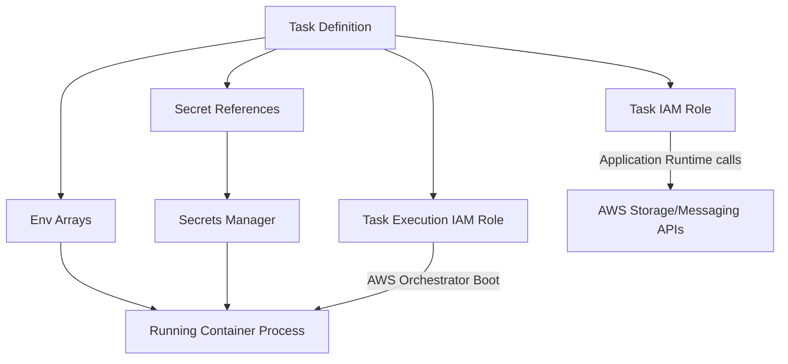

## Table of Contents

1. [The Credential Leaks Outage](#the-credential-leaks-outage)
2. [Decoupling Runtime Configurations](#decoupling-runtime-configurations)
3. [Environment Variables for Non-Sensitive Settings](#environment-variables-for-non-sensitive-settings)
4. [Securing Sensitive Credentials with Secrets Manager](#securing-sensitive-credentials-with-secrets-manager)
5. [ECS Delivery: Task Execution Roles vs. Task Roles](#ecs-delivery-task-execution-roles-vs-task-roles)
6. [Enforcing Startup Validation and Fail-Fast Habits](#enforcing-startup-validation-and-fail-fast-habits)
7. [Safe Debugging Without Plaintext Leaks](#safe-debugging-without-plaintext-leaks)
8. [Under-the-Hood: Memory Allocations and Process Leaks](#under-the-hood-memory-allocations-and-process-leaks)
9. [The Coordination of Secret Rotation](#the-coordination-of-secret-rotation)
10. [Putting It All Together](#putting-it-all-together)
11. [What's Next](#whats-next)

## The Credential Leaks Outage

During local development, managing database passwords is easy. You write plain-text credentials into a local configuration file named `.env`, load them into your process using a library, and run transactions. The file sits on your local hard disk, safe from external eyes.

A common catastrophe occurs when a developer accidentally commits this local `.env` file to a public git repository. Within minutes, automated crawler scripts scrape the repository, extract the plain-text password, connect to your database host over port 5432, delete your entire database schema, and demand a ransom. Hardcoding secrets in source files or baking them into compiled container images is a critical security vulnerability. 

An image moves through developer machines, registries, local caches, and vulnerability scanners. Baking secrets inside the image exposes them to every system that handles the package. 

To operate secure cloud services, you must decouple code compilation from environment configuration. The compiled container image must remain identical across environments, loading ordinary settings and sensitive credentials dynamically at boot time from secure, remote coordinate vaults.

## Decoupling Runtime Configurations

Runtime configuration is the collection of environment-specific values and references an application process loads at startup. Decoupling configuration ensures that the exact same ECR container image runs in staging and production without recompilation.

The container image contains only pure code, shared packages, and static assets. The orchestrator binds environment-specific facts at boot time:

Runtime Settings vs. Sensitive Secrets:

| Setting Type | Example Parameters | Secure Storage Coordinate |
| :--- | :--- | :--- |
| **Non-Sensitive Configurations** | `NODE_ENV=production`<br/>`LOG_LEVEL=info`<br/>`PORT=3000` | Task Definition environment variables array or Parameter Store keys. |
| **Sensitive Credentials** | `DATABASE_URL` connection strings<br/>`STRIPE_API_TOKEN` API keys | AWS Secrets Manager securely encrypted vaults. |

Config changes are releases. Modifying a timeout parameter, database URL, or feature flag setting alters production execution paths as radically as a code change. Every configuration update deserves the same review, rolling update, and rollback discipline as a software deployment.

## Environment Variables for Non-Sensitive Settings

Environment variables are standard key-value string parameters delivered to the operating system process at startup. In an Amazon ECS Task Definition, non-sensitive configurations are declared directly inside the container definitions array:

```json
{
  "name": "api",
  "environment": [
    { "name": "NODE_ENV", "value": "production" },
    { "name": "PORT", "value": "3000" },
    { "name": "LOG_LEVEL", "value": "info" },
    { "name": "RECEIPTS_ENABLED", "value": "true" }
  ]
}
```

These values are non-sensitive. It is completely safe for operators to read them during code reviews or inspect them inside the AWS console. The practical mistake is adding database connection strings, passwords, or session secrets directly into this standard environment array. Because task definitions are stored in plain-text inside AWS account histories, any plain-text secrets written here will be visible to any user or system authorized to describe task definitions.

## Securing Sensitive Credentials with Secrets Manager

Sensitive credentials must be stored securely outside the task definition plain-text. AWS provides Amazon Secrets Manager, which encrypts values at rest using KMS keys. Many workloads use the AWS managed key for Secrets Manager; customer managed keys are useful when you need custom key policies, cross-account access patterns, or stricter audit boundaries.

For ECS tasks, instead of writing plain-text passwords, you store the secure Amazon Resource Name (ARN) coordinate reference inside the `secrets` array of the container definition:

```json
{
  "name": "DATABASE_URL",
  "valueFrom": "arn:aws:secretsmanager:eu-west-2:111122223333:secret:orders/prod/db-4f22cd"
}
```

By structuring the contract this way, the plain-text password is never stored inside your git repository or task definition history. The task definition contains only the secure lookup coordinate, `valueFrom`.

To query secure secrets directly and verify credentials from your administrative terminal, you run the AWS Secrets Manager CLI:

```bash
$ aws secretsmanager get-secret-value \
    --secret-id "orders/prod/db"
```

The terminal returns the decrypted secret payload securely over HTTPS to the authorized caller:

```json
{
  "ARN": "arn:aws:secretsmanager:eu-west-2:111122223333:secret:orders/prod/db-4f22cd",
  "Name": "orders/prod/db",
  "VersionId": "b91f1a42-8c91-4e22-862d-2b91f1234567",
  "SecretString": "{\"username\":\"db_admin\",\"password\":\"super_secure_pass_99\",\"host\":\"orders-prod.c1234.us-east-1.rds.amazonaws.com\",\"port\":5432,\"dbname\":\"orders\"}",
  "CreatedDate": 1779836395.042
}
```

This output provides critical operational coordinates:

* `ARN`: The unique, immutable resource path of the secret used inside your task definitions.
* `VersionId`: The active version identifier, allowing you to trace credential revisions.
* `SecretString`: The highly sensitive plaintext JSON payload containing database ports, hosts, and passwords. Do not paste this output into tickets, chats, or logs.

## ECS Delivery: Task Execution Roles vs. Task Roles

ECS delivers configurations, secrets, and permissions using two distinct IAM roles cabled to the task. Mixing up these roles is the most common permission debugging failure for beginners:



To prevent slow permission debugging cycles, you must partition your understanding of these two roles:

Task Ingestion vs. Application Code Permissions:

| Role Coordinates | Task Execution IAM Role | Task IAM Role |
| :--- | :--- | :--- |
| **Who Uses It** | The AWS ECS agent host daemon at boot time. | The application code process at runtime. |
| **Operational Job** | Pulls images from ECR, writes logs to CloudWatch, and fetches configured secret values for startup injection. If a customer managed KMS key protects the secret, this path also needs key permission. | Writes files to S3, publishes messages to SQS, and queries DynamoDB. |
| **Common Outage** | Task fails to boot, throwing `SecretsManagerException` or ECR pull timeout. | Task boots successfully but returns `AccessDenied` when writing receipt PDFs. |
| **Example Policy** | `secretsmanager:GetSecretValue`<br/>`kms:Decrypt` (on secret KMS keys) | `s3:PutObject`<br/>`sqs:SendMessage` |

If Fargate cannot boot the task because it cannot pull the image or fetch the database password, check the Task Execution Role permissions. If the container boots successfully but application API requests return access errors, check the Task Role permissions.


*The startup path and runtime path use different trust boundaries. The execution role helps the platform fetch image, logs, and startup secret material; the task role is what the application code uses later when it calls AWS APIs.*

## Enforcing Startup Validation and Fail-Fast Habits

An application must validate its runtime contract immediately upon booting. It must verify the presence, syntax, and connectivity of its required configurations before claiming to be ready for customer traffic.

Let us write a robust Node.js initialization script demonstrating startup contract validation with safe logging practices:

```javascript
import dns from 'dns/promises';

function validateRuntimeContract() {
  const requiredKeys = ['PORT', 'DATABASE_URL', 'LOG_LEVEL', 'RECEIPTS_ENABLED'];
  const missingKeys = [];

  for (const key of requiredKeys) {
    if (!process.env[key]) {
      missingKeys.push(key);
    }
  }

  if (missingKeys.length > 0) {
    console.error(JSON.stringify({
      level: 'FATAL',
      timestamp: new Date().toISOString(),
      message: 'Runtime contract validation failed: missing required variables',
      missingCoordinates: missingKeys
    }));
    process.exit(1);
  }

  const port = parseInt(process.env.PORT, 10);
  if (isNaN(port)) {
    console.error(JSON.stringify({
      level: 'FATAL',
      message: 'Invalid contract syntax: PORT must be numeric',
      portValue: process.env.PORT
    }));
    process.exit(1);
  }

  console.log(JSON.stringify({
    level: 'INFO',
    message: 'Runtime contract verified successfully',
    logLevel: process.env.LOG_LEVEL,
    receiptsEnabled: process.env.RECEIPTS_ENABLED === 'true'
  }));
}

validateRuntimeContract();
```

This startup script enforces three essential operational boundaries:

1. **Verify Key Presence**: Loops through required configurations, collecting all failures before exiting, rather than failing on a single key.
2. **Validate Syntax Boundaries**: Parses port parameters, verifying integer limits before binding process sockets.
3. **Safe Logging**: Logs success and coordinates (`LOG_LEVEL`, `RECEIPTS_ENABLED`) without printing sensitive, plaintext values.

By calling this validator at the absolute entrypoint of your application thread, you make bad configuration deployments fail early, while the rolling update still has old capacity available. When the ECS deployment circuit breaker is enabled and the failure prevents the service from reaching steady state, ECS can mark the deployment failed and roll back automatically.

## Safe Debugging Without Plaintext Leaks

When a deployment fails due to a configuration mismatch, developers are often tempted to print the entire environment array to stdout (using commands like `console.log(process.env)`). This dangerous practice dumps plaintext database passwords, Stripe keys, and webhook signing credentials directly into CloudWatch Logs. 

Anyone with log access (support teams, dashboard users, security auditors) can read these credentials, creating a severe data compliance leak.

To debug configurations safely, you must structure your diagnostic checks to prove presence and shape without printing actual values:

* **Log Existence, Not Content**: Write checks that log `DATABASE_URL present: true`, rather than printing the connection string.
* **Inspect Metadata coordinates**: Verify access by checking KMS permissions or Secrets Manager ARNs; the coordinate path is public, while the credential is private.
* **Audit IAM Access Denials**: If a task role is missing permissions, read the exact action and resource fields returned in the `AccessDenied` log event, rather than guessing policy boundaries.

## Under-the-Hood: Memory Allocations and Process Leaks

In a Linux OS, when a process starts, the kernel allocates environment variables inside the process's address space. The variables are placed in the stack pointer memory region (`envp`) immediately above the command-line arguments. 

Any child process spawned by the primary container task inherits a full copy of this `envp` stack memory. 

If your primary container task spawns background shell wrappers or third-party diagnostic scripts, those child processes gain access to every database password and Stripe key loaded in the environment. Even worse, if the application experiences a core dump crash, the OS writes the stack memory to disk, leaving plaintext passwords stored inside the container's volatile block storage layers.

To minimize process memory leaks, high-security applications may bypass environment variable injection completely. Instead of injecting secrets via the task definition `secrets` array at boot time, the application code imports the AWS SDK directly. At runtime, the code calls Secrets Manager dynamically, receives the credentials in memory, uses them to establish connection pools, and avoids placing the values in the operating system's environment stack. The credential still exists in memory while the application uses it, but the leak surface is narrower than a process-wide environment variable inherited by every child process.

## The Coordination of Secret Rotation

Secret rotation is the security practice of changing sensitive credentials regularly to minimize the blast radius of leaks. Secrets Manager can store multiple secret versions and can run rotation through a configured Lambda rotation function, but rotation is not automatic for every secret just because the value lives in Secrets Manager. The running application tasks must coordinate to absorb the change:

* **Startup Injection Caveat**: If secrets are injected as environment variables at task boot time, running containers will continue to use the old password until they are replaced. You must trigger an ECS service deployment (`forceNewDeployment`) to force Fargate to spin up new task replicas that fetch the rotated password.
* **Dynamic API Fetching**: If your application fetches secrets dynamically over the SDK, configure your client wrappers with a local cache TTL (such as 1 hour) and a database retry trigger. If a database transaction fails due to authentication errors, the client must bypass the cache, fetch the rotated password from Secrets Manager, re-establish the pool, and resume transactions without downtime.
* **Reversible Rotation Windows**: When the database engine and rotation strategy support it, configure a brief overlap where old and new credentials can both work. This overlap window helps active tasks continue during the rolling update without dropping database connections.

## Putting It All Together

Decoupling configuration from code packaging is the foundation of secure cloud operations:

* **Strictly Decouple Configurations**: Never hardcode environment settings or secrets inside source repositories or container images.
* **Enforce Decoupled Secrets Manager**: Inject sensitive credentials via the Task Definition `secrets` block, keeping plaintext passwords out of Plaintext properties.
* **Trace Role Partition Boundaries**: Assign startup orchestrator permissions to the Task Execution Role, and application API permissions to the Task Role.
* **Enforce Fail-Fast Startup Checks**: Validate all required keys and syntax parameters immediately upon boot to trigger automated rollbacks during failed deploys.
* **Prevent Process Log Leaks**: Never print raw process environments or exception objects to standard output streams.
* **Coordinate Dynamic Rotations**: Enforce SDK caching TTLs and database overlap windows to rotate passwords without customer-facing downtime.

## What's Next

We have established secure configuration delivery, execution role boundaries, and startup validation habits. However, once a service is live, the operational environment changes constantly. In the next article, we will go deep into runtime controls: desired counts, Application Auto Scaling target tracking, SQS queue backlog monitoring, EventBridge Scheduler pipelines, and pause controls.


*Use this as the config and secrets checklist: keep ordinary settings in environment variables, store credentials behind secret references, separate execution and task roles, fail fast at startup, and coordinate rotation with running tasks.*

---

**References**

* [Systems Manager Parameter Store](https://docs.aws.amazon.com/systems-manager/latest/userguide/systems-manager-parameter-store.html) - AWS guide to centralized parameter and secret configurations.
* [AWS Secrets Manager Developer Guide](https://docs.aws.amazon.com/secretsmanager/latest/userguide/intro.html) - Documentation on storing, rotating, and retrieving sensitive credentials.
* [Rotate AWS Secrets Manager secrets](https://docs.aws.amazon.com/secretsmanager/latest/userguide/rotating-secrets.html) - Explains supported rotation patterns, rotation functions, and version stages.
* [Amazon ECS Task Role Permissions](https://docs.aws.amazon.com/AmazonECS/latest/developerguide/task-iam-roles.html) - Guide to defining IAM permissions for application container tasks.
* [ECS Task Execution Role Guide](https://docs.aws.amazon.com/AmazonECS/latest/developerguide/task_execution_IAM_role.html) - Documentation on configuring orchestrator startup permissions.
