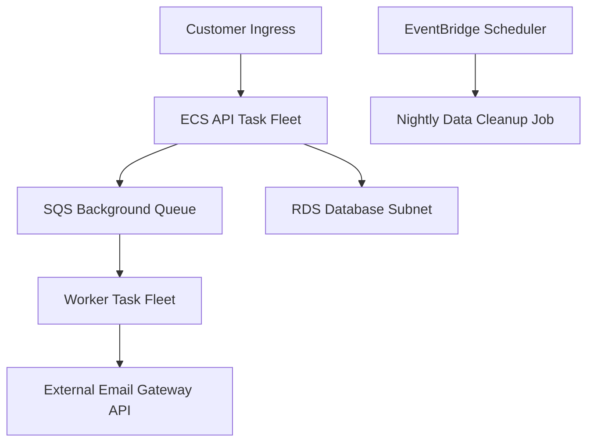
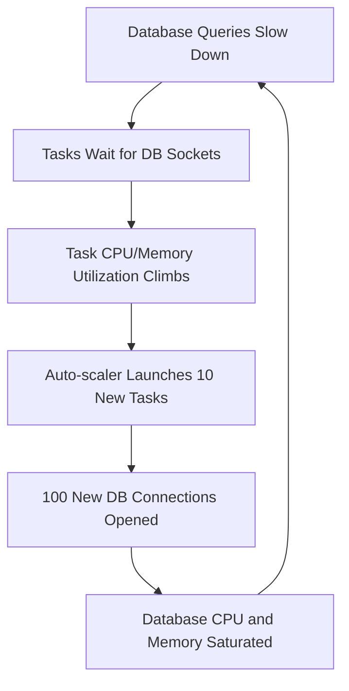

## Table of Contents

1. [The Mid-day Traffic Surge](#the-mid-day-traffic-surge)
2. [Knobs and Switches: Runtime Controls](#knobs-and-switches-runtime-controls)
3. [The Lever of Capacity Scaling](#the-lever-of-capacity-scaling)
4. [Desired Task Count Controls](#desired-task-count-controls)
5. [Automated Target Tracking Scaling Policies](#automated-target-tracking-scaling-policies)
6. [Diagnosing Backlogs: SQS Queue Telemetry](#diagnosing-backlogs-sqs-queue-telemetry)
7. [Schedules and Background Pipeline Jobs](#schedules-and-background-pipeline-jobs)
8. [Bounding Downstream Pressures: Concurrency Limits](#bounding-downstream-pressures-concurrency-limits)
9. [The Emergency Stop: Pause Controls](#the-emergency-stop-pause-controls)
10. [When Scaling Compute Destroys Database Performance](#when-scaling-compute-destroys-database-performance)
11. [Putting It All Together](#putting-it-all-together)

## The Mid-day Traffic Surge

Your production application is deployed, configured, healthy, and fully observable. Still, the operational environment changes constantly. One Tuesday afternoon, several system pressures collide simultaneously:

* Customer checkout traffic spikes by 300 percent after a marketing email is broadcast.
* The background SQS receipt email queue begins aging rapidly, delaying client emails by over an hour.
* The external email gateway service begins returning rate-limit throttling errors.
* A nightly data-cleanup scheduled script launches automatically during peak hours, saturating the relational database.
* A poison message block reaches the top of the processing queue, causing background workers to crash and restart repeatedly.

When these events occur, you cannot wait 10 minutes to deploy new code. You need immediate controls to adjust how the running systems behave. You need knobs to add compute capacity, slow down background work, pause scheduled jobs, or isolate poison messages in real time while your engineering team gathers evidence.

## Knobs and Switches: Runtime Controls

Runtime controls are the operational switches built into your cloud architecture that let you adjust the amount, timing, and flow of work without deploying code changes. 

Our application architecture exposes several controls across its layers:



To operate successfully, you must match every runtime control to the specific pressure it moves:

Runtime Control Levers:

| Control Knob | Operational Ingress | Target Pressure Moved |
| :--- | :--- | :--- |
| **Desired Task Count** | ECS Service API | Compute thread availability. |
| **Autoscaling Policy** | Application Auto Scaling | Automatic capacity matching during traffic spikes. |
| **Queue Redrive Rules** | SQS Dead Letter Queue | Isolates broken payloads from the main processor. |
| **Schedule State** | EventBridge Scheduler | Pauses or delays heavy recurring operations. |
| **Concurrency Limits** | Lambda / Application Pools | Limits connection storms sent to databases and APIs. |
| **Feature Flags** | Configuration Vault | Disables specific features without code rollouts. |

The safe operational question is not: *What switches can I pull?* It is: *What database, queue, or network pressure will this switch move, and what new pressure will it create?*

## The Lever of Capacity Scaling

Scaling means changing resource capacity to absorb load. It is a vital operational lever, but it does not fix the root cause of a software bug.

Scaling ECS tasks helps if your application is CPU-bound, memory-saturated, and downstream databases have idle headroom. Scaling SQS background workers helps if your message backlog is growing and external gateways are healthy. 

However, scaling can also push failure downstream. If an external API is rate-limiting your worker fleet, scaling your background tasks from 4 to 20 will simply increase the frequency of failed calls, accelerating gateway lockouts.

## Desired Task Count Controls

The desired count is the target number of task replicas the ECS Service Controller tries to maintain. If the desired count is manually set to `4`, ECS continually works toward four running tasks, but placement can still fail if subnets lack IP addresses, capacity providers lack room, images cannot be pulled, or health checks keep terminating replacements.

For background worker fleets, manual desired count changes are the first operational lever during incidents:

Desired Count Operational Procedures:

| Incident Situation | Desired Count Move | Operational Result |
| :--- | :--- | :--- |
| **Backlog queue aging rises** | Increase desired count carefully. | Allocates more CPU threads to drain waiting messages. |
| **External API throttling** | Decrease desired count. | Slows down processing to respect external API rate limits. |
| **Poison message crash loop** | Scale desired count to zero. | Halts worker executions, buying time for developers to inspect payloads. |
| **Database maintenance window** | Hold desired count low. | Minimizes query contention during database upgrades. |

The gotcha of manual overrides is autoscaling policy interaction. If you have enabled Application Auto Scaling target tracking, a manual desired count can later be adjusted by the auto-scaler when new CloudWatch datapoints and cooldown rules tell it to scale. Responders should know the service's minimum capacity, maximum capacity, active scaling policies, and cooldowns before executing manual task count overrides during incidents. In a true pause or controlled-drain incident, temporarily suspending dynamic scaling can make the manual move easier to reason about.

## Automated Target Tracking Scaling Policies

Autoscaling automates capacity matching by evaluating real-time metrics against target values. For ECS, target tracking policies act like a home thermostat: if CPU utilization stays above a 70% target, the auto-scaler can launch tasks; if utilization stays below the target after cooldown behavior and scale-in rules allow it, the auto-scaler can remove tasks. There is no special 30% scale-in line unless you configure a policy around that value.

Autoscaling is highly effective when the metric you track has a stable, linear relationship with container capacity. It is highly dangerous when the metric is a symptom of a downstream bottleneck.

Autoscaling Metric Evaluation:

| Metric Target | Optimal Operational Use | Cardinal Outage Risk |
| :--- | :--- | :--- |
| **ECS CPUUtilization** | CPU-bound web services. | Can stall if processes are waiting on blocked database threads. |
| **ECS MemoryUtilization** | Memory-heavy applications. | Endless scaling loop if tasks have memory leaks. |
| **ALB RequestCountPerTarget** | High-volume traffic swings. | Assumes all requests cost the same CPU cycles. |
| **SQS Backlog Metric** | Worker queues. | Can accelerate downstream rate-limit lockouts. |

Autoscaling also has dynamic time behavior. It operates after metrics change, requiring warmup and cooldown windows to prevent rapid, unstable capacity swings (known as thrashing).

## Diagnosing Backlogs: SQS Queue Telemetry

Queues separate customer-facing API transactions from slow background processes. The orders API writes the transaction to RDS, publishes a receipt message to SQS, and returns an immediate success page to the user, offloading email delivery to background workers.

To inspect queue depth from your administrative workstation, you query SQS attributes using the AWS CLI:

```bash
$ aws sqs get-queue-attributes \
    --queue-url "https://sqs.eu-west-2.amazonaws.com/123456789012/ReceiptQueue" \
    --attribute-names "ApproximateNumberOfMessages" "ApproximateNumberOfMessagesNotVisible"
```

The terminal returns approximate queue depth coordinates:

```json
{
  "Attributes": {
    "ApproximateNumberOfMessages": "14250",
    "ApproximateNumberOfMessagesNotVisible": "38"
  }
}
```

Every returned coordinate represents critical system health evidence:

* `ApproximateNumberOfMessages`: The visible backlog length (14,250 messages waiting in the queue). A high count indicates that incoming message volume is exceeding worker throughput.
* `ApproximateNumberOfMessagesNotVisible`: Messages currently being processed or waiting for their visibility timeout to expire. A high value can indicate slow workers, long processing time, or repeated failures.

For customer latency, the stronger signal is the CloudWatch metric `ApproximateAgeOfOldestMessage`, which reports how long the oldest non-deleted message has been waiting:

```bash
$ aws cloudwatch get-metric-statistics \
    --namespace "AWS/SQS" \
    --metric-name "ApproximateAgeOfOldestMessage" \
    --dimensions Name=QueueName,Value=ReceiptQueue \
    --start-time "2026-05-28T11:00:00Z" \
    --end-time "2026-05-28T12:00:00Z" \
    --period 300 \
    --statistics Maximum
```

A rising maximum age is a high-priority operational alarm, proving that emails or other background jobs are delayed.

If visible messages and message age are both rising, check the worker stdout logs. If workers are failing to delete messages after processing them, SQS will make those messages visible again after the visibility timeout, causing the fleet to process the same failing payloads repeatedly in an expensive loop.

## Schedules and Background Pipeline Jobs

Scheduled tasks are background operations triggered by time triggers rather than user actions. AWS provides Amazon EventBridge Scheduler to run scheduled events, targeting ECS tasks or Lambda functions.

Scheduled tasks write to production databases. They deserve the same review, permissions, and pause controls as your primary API. A nightly database cleanup script that is harmless at low volumes can collide with production traffic spikes or automated backup windows, locking database tables and causing global timeouts.

To prevent scheduled collisions during incidents, you can disable the trigger directly from your terminal:

```bash
$ aws scheduler update-schedule \
    --name "NightlyCleanupJob" \
    --schedule-expression "cron(0 2 * * ? *)" \
    --flexible-time-window "Mode=OFF" \
    --state "DISABLED" \
    --target '{"Arn":"arn:aws:lambda:eu-west-2:111122223333:function:cleanup-job","RoleArn":"arn:aws:iam::111122223333:role/EventBridgeSchedulerInvokeCleanup"}'
```

This CLI update halts the schedule instantly:

* `--name`: The target schedule to modify.
* `--schedule-expression`: Preserves the existing schedule expression while updating the state.
* `--state`: Transitions the schedule to `DISABLED`, preventing EventBridge from executing the task until the active incident is resolved.
* `--target`: Preserves the target and invocation role required by EventBridge Scheduler.

## Bounding Downstream Pressures: Concurrency Limits

Concurrency is the measure of how many operations run at the same split-second. Enforcing concurrency limits is a vital defensive design pattern that protects databases and APIs from resource saturation.

You must apply concurrency controls at the exact boundaries where downstream systems are weak:

* **Lambda Reserved Concurrency**: Clamps the maximum concurrent execution threads of a serverless function, reserving capacity or protecting downstream APIs from rate limits.
* **SQS Maximum Concurrency**: Controls the maximum number of concurrent Lambda pollers allowed to read from a queue, slowing down message consumption during downstream database outages.
* **Database Connection Pools**: Clamps the maximum database connections established per container task (such as limiting the pool to 10 connections), preventing container autoscaling from exhausting relational database connection limits.

## The Emergency Stop: Pause Controls

Pause controls are high-value operational switches designed to stop the bleeding during high-severity incidents. They buy your engineering team time to read evidence without turning the outage into a frantic code-deploy cycle.

Every pause control you design must adhere to three strict operational rules:

1. **Must Be Reversible**: You must be able to undo the pause instantly without redeploying code (e.g., toggling a feature flag or updating a scheduler state).
2. **Must Be Visible**: The paused state must be recorded on shared team dashboards, preventing adjacent engineers from troubleshooting a system that was paused on purpose.
3. **Must Have an Owner**: The engineer who paused the path must own the remediation plan, preventing paused states from accumulating as permanent, risky debt.

The major gotcha of pause controls is backlog pressure. Pausing background workers or disabling queue consumption halts the error loop, but it causes SQS queues to accumulate millions of waiting messages. Your team must plan how to drain these queues slowly and safely once the fix is deployed, preventing a secondary connection storm from crashing the database when workers are scaled back up.

## When Scaling Compute Destroys Database Performance

A classic cloud operations disaster is the compute-to-database connection loop. When relational database query performance degrades due to a missing index, query execution times rise. As checkout queries take longer, web containers spend more time waiting for database sockets to return.

On your high-level CPU dashboards, CPU usage climbs as containers accumulate waiting threads. The auto-scaler detects the CPU spike and automatically launches 10 new container tasks to absorb the load.



Each new container task boots, initializes its default connection pool, and opens 10 new sockets to the database. The database is suddenly hammered with 100 new connection requests, exhausting its memory, locking up, and causing all checkout requests to fail. 

Relying on auto-scaling compute capacity to solve database saturation will accelerate system collapse. Responders must verify database performance and active connection counts before pulling compute scaling levers during incidents.


*Scaling is a pressure move, not a universal fix. If the shared database is already the bottleneck, adding tasks opens more connections and can turn a slowdown into a connection storm.*

## Putting It All Together

Operating live cloud environments requires a thorough understanding of capacity levers, queue backlogs, and pause switches:

* **Verify Bottlenecks Before Scaling**: Never scale compute task fleets if the bottleneck resides in a shared relational database or rate-limited external gateway.
* **Trace Queue Backlog Age**: Base background worker alerts on SQS `ApproximateAgeOfOldestMessage` metrics rather than simple message counts.
* **Enforce Queue Redrive Policies**: Implement SQS Dead Letter Queues (DLQs) with a `maxReceiveCount` chosen for the workload. A short count isolates poison payloads quickly; a longer count gives flaky dependencies more retry room.
* **Secure and Version Schedules**: Treat scheduled jobs as active production writers, managing their triggers and permissions with release discipline.
* **Defend Boundaries with Concurrency**: Enforce strict database connection pool limits to prevent auto-scaling tasks from exhausting database limits.
* **Design Elegant Pause Controls**: Implement reversible, visible, and owned pause switches to buy diagnostic time during incidents.


*Use this as the runtime controls checklist: adjust desired count deliberately, let autoscaling follow the right metric, alarm on queue age, own schedules as production writers, bound concurrency, and keep pause switches reversible.*

---

**References**

* [Application Auto Scaling Guide](https://docs.aws.amazon.com/autoscaling/application/userguide/what-is-application-auto-scaling.html) - AWS guide to automated compute and task scaling.
* [Target tracking scaling policies for Application Auto Scaling](https://docs.aws.amazon.com/autoscaling/application/userguide/application-auto-scaling-target-tracking.html) - Documents target values, cooldowns, and scale-in behavior.
* [Amazon SQS Available CloudWatch Metrics](https://docs.aws.amazon.com/AWSSimpleQueueService/latest/SQSDeveloperGuide/sqs-available-cloudwatch-metrics.html) - Technical reference for monitoring backlogs, message age, and DLQs.
* [Using dead-letter queues in Amazon SQS](https://docs.aws.amazon.com/AWSSimpleQueueService/latest/SQSDeveloperGuide/sqs-dead-letter-queues.html) - Explains redrive policy behavior and choosing `maxReceiveCount`.
* [AWS EventBridge Scheduler](https://docs.aws.amazon.com/scheduler/latest/UserGuide/what-is-scheduler.html) - Documentation on scheduled task execution, retries, and states.
* [Managing Lambda Reserved Concurrency](https://docs.aws.amazon.com/lambda/latest/dg/configuration-concurrency.html) - Guide to setting execution limits on serverless threads.
