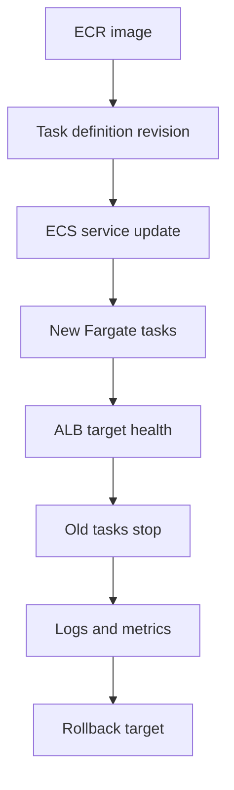

## Table of Contents

1. [What An ECS Service Update Really Changes](#what-an-ecs-service-update-really-changes)
2. [The Release Evidence Before The Update](#the-release-evidence-before-the-update)
3. [Task Definition Revisions Are The Runtime Recipe](#task-definition-revisions-are-the-runtime-recipe)
4. [From Image To Service Update](#from-image-to-service-update)
5. [Watching New Tasks Earn Traffic](#watching-new-tasks-earn-traffic)
6. [Health Checks Decide When Traffic Moves](#health-checks-decide-when-traffic-moves)
7. [Reading The Deployment After It Finishes](#reading-the-deployment-after-it-finishes)
8. [Failure Mode: Running Task, Unhealthy Target](#failure-mode-running-task-unhealthy-target)
9. [Rollback Means Choosing The Previous Revision](#rollback-means-choosing-the-previous-revision)
10. [Tradeoffs And Release Habits](#tradeoffs-and-release-habits)

## What An ECS Service Update Really Changes

The build is green, the Docker image exists, and the pipeline says the release artifact is ready.
That is the end of CI/CD packaging, but it is not yet the moment users run the new code.
For an ECS service, the deployment moment is when Amazon ECS starts new tasks from a new runtime recipe and those tasks become trusted by the load balancer.

An ECS service update changes which task definition revision the service should run.
A task definition revision is a numbered version of the instructions for starting your containers: image, ports, CPU, memory, roles, environment variables, secret references, health checks, and log routing.
When you update the service to a new revision, ECS starts replacement tasks from that revision and stops old tasks only when the deployment rules allow it.

This exists because production traffic should not depend on one manual container start.
A backend service needs a controller that can keep the desired number of tasks running, start new tasks during a release, attach those tasks to the Application Load Balancer, and stop older tasks after the new ones prove they are healthy.
That controller is the ECS service.

This article follows one concrete service: `devpolaris-orders-api`.
It is a Node.js API running on ECS with Fargate behind an Application Load Balancer, usually shortened to ALB.
The container listens on port `3000`, the public hostname is `https://orders.devpolaris.com`, and the image lives in Amazon ECR.

The path we care about is narrow and practical:
the image is pushed to ECR, a new task definition revision points at that image, the ECS service is updated, new Fargate tasks start, the target group checks them, old tasks stop, and the team verifies logs and metrics.
If the release is bad, rollback means pointing the service back to the previous known-good revision.
It is not magic.
It is a deliberate choice of what the service should run next.



Read the diagram as a release trail, not a checklist to memorize.
At each handoff, you ask a simple question.
Does the image exist?
Does the task definition point at it?
Is the service deploying that revision?
Are the new targets healthy?
Did the old revision leave safely?
Can you prove the new code is behaving?

## The Release Evidence Before The Update

Before touching the service, collect a small release record.
This prevents a very ordinary mistake: updating production and then trying to remember which revision was old, which image tag was new, and what healthy looked like before the change.
You want enough evidence that another engineer could understand the release without reading chat history.

For `devpolaris-orders-api`, the record starts like this:

```text
release: orders-api-prod-2026-05-02.2
cluster: devpolaris-prod
service: devpolaris-orders-api
old_task_definition: devpolaris-orders-api:41
new_task_definition: devpolaris-orders-api:42
new_image: 111122223333.dkr.ecr.us-east-1.amazonaws.com/devpolaris-orders-api:2026-05-02.2
desired_count: 2
load_balancer: orders-prod-alb
target_group: orders-api-tg
before_target_health: 2 healthy, 0 unhealthy
rollback_target: devpolaris-orders-api:41
```

That record looks simple, but it protects you in three ways.
First, it names the rollback target before anyone is stressed.
Second, it ties the human release name to the AWS revision that will actually run.
Third, it captures target health before the change, so you can tell whether the deployment created a new problem or exposed an existing one.

The old revision matters because ECS services are long-running.
The service is not "running image 2026-05-02.1" in isolation.
It is running a task definition revision, and that revision happens to include an image reference.
If you record only the image tag, you may miss a changed port, secret ARN, log group, or health check setting.

The first command is a sanity check, not a ritual.
It answers the question, "What does ECS believe this service is running before I change it?"

```bash
$ aws ecs describe-services \
>   --cluster devpolaris-prod \
>   --services devpolaris-orders-api \
>   --query 'services[0].{taskDefinition:taskDefinition,desired:desiredCount,running:runningCount,pending:pendingCount,deployments:deployments[*].{status:status,taskDefinition:taskDefinition,desired:desiredCount,running:runningCount,pending:pendingCount,rollout:rolloutState}}'
```

A healthy pre-release snapshot might read:

```text
taskDefinition: arn:aws:ecs:us-east-1:111122223333:task-definition/devpolaris-orders-api:41
desired: 2
running: 2
pending: 0

deployments:
  PRIMARY  devpolaris-orders-api:41  desired=2  running=2  pending=0  rollout=COMPLETED
```

This proves the service is steady before you ask it to change.
If it already has `pending=1`, repeated service events, or unhealthy targets, pause and understand that first.
Deploying into an already unstable service makes the release harder to read.

## Task Definition Revisions Are The Runtime Recipe

A task definition is the runtime recipe ECS uses to start tasks.
The family name is the recipe name, such as `devpolaris-orders-api`.
The revision number is the version of that recipe, such as `41` or `42`.
Together they form a target like `devpolaris-orders-api:42`.

This is close to how a package lockfile works in a Node project.
The app source might be the same, but a small dependency change can make the runtime different.
In ECS, a small task definition change can make the running service different even when the application code did not change.
Changing the image is common, but it is not the only meaningful change.

A short task definition excerpt shows the parts that matter for this release:

```json
{
  "family": "devpolaris-orders-api",
  "revision": 42,
  "networkMode": "awsvpc",
  "requiresCompatibilities": ["FARGATE"],
  "cpu": "512",
  "memory": "1024",
  "containerDefinitions": [
    {
      "name": "orders-api",
      "image": "111122223333.dkr.ecr.us-east-1.amazonaws.com/devpolaris-orders-api:2026-05-02.2",
      "portMappings": [
        {
          "containerPort": 3000,
          "protocol": "tcp"
        }
      ],
      "environment": [
        {
          "name": "PORT",
          "value": "3000"
        },
        {
          "name": "NODE_ENV",
          "value": "production"
        }
      ],
      "logConfiguration": {
        "logDriver": "awslogs",
        "options": {
          "awslogs-group": "/ecs/devpolaris-orders-api",
          "awslogs-region": "us-east-1",
          "awslogs-stream-prefix": "orders-api"
        }
      }
    }
  ]
}
```

The image line connects the CI/CD artifact to the runtime.
The port mapping tells ECS which container port can be registered with the target group.
The environment values tell the Node.js process how to start.
The log configuration gives the release a place to leave evidence after the container starts.

Every time you register a changed task definition, ECS creates a new revision.
You do not edit revision `41` in place.
You create revision `42`.
That detail is a gift during operations because it lets you compare what changed and point the service back to an older revision if needed.

For this article, we keep the deployment strategy itself simple.
We are not choosing between general rollout patterns.
We are following the AWS-specific path for a normal ECS rolling update, where the service replaces old tasks with new tasks while trying to keep enough healthy capacity available.

The important beginner habit is to treat a task definition revision as a release artifact.
It deserves review in the same way the container image does.
If revision `42` points at the right image but accidentally changes `PORT` from `3000` to `8080`, the deployment can still fail even though the image build was perfect.

## From Image To Service Update

The service update is intentionally small.
You are telling ECS, "For this service, use this task definition revision now."
The risk it prevents is manual drift: one engineer updating a task by hand, another changing the service later, and no single source of truth for what production should run.

For `devpolaris-orders-api`, the update command is short:

```bash
$ aws ecs update-service \
>   --cluster devpolaris-prod \
>   --service devpolaris-orders-api \
>   --task-definition devpolaris-orders-api:42
```

That command does not mean every old task disappears immediately.
It starts a deployment.
ECS now has a desired service state: keep desired count `2`, but satisfy that desired count with tasks from revision `42`.
The service scheduler decides how to start and stop tasks according to the service deployment configuration.

During the update, the service can temporarily have both old and new tasks.
That overlap is normal.
It is how ECS gives the new revision a chance to prove itself before old capacity goes away.

A deployment-in-progress record might look like this:

```text
release: orders-api-prod-2026-05-02.2
old_task_definition: devpolaris-orders-api:41
new_task_definition: devpolaris-orders-api:42
image: devpolaris-orders-api:2026-05-02.2
desired_count: 2

service deployments:
  PRIMARY  devpolaris-orders-api:42  desired=2  running=1  pending=1  rollout=IN_PROGRESS
  ACTIVE   devpolaris-orders-api:41  desired=2  running=2  pending=0  rollout=COMPLETED

target health:
  revision 42: 0 healthy, 1 initial
  revision 41: 2 healthy, 0 unhealthy
```

This is not a failure.
It says one new task is running or starting, one may still be pending, and the old revision is still serving traffic.
The release is in the "prove the new target" stage.

The mistake to avoid here is declaring success too early.
`update-service` returning successfully means AWS accepted the new desired state.
It does not mean users are safely running the new code.
The next proof comes from ECS events, task status, target group health, CloudWatch Logs, and application metrics.

## Watching New Tasks Earn Traffic

The first thing ECS must do is start tasks from the new revision.
If the image tag is wrong, the execution role cannot pull from ECR, or a secret cannot be injected, the task may never reach the point where the app starts.
That is why ECS service events are often the first useful diagnostic layer.

You read events to answer, "Did ECS start and register new tasks, or did the task fail before traffic was even possible?"

```text
2026-05-02T10:12:14Z service devpolaris-orders-api has started 1 tasks: task 9f4a8c1b.
2026-05-02T10:12:47Z service devpolaris-orders-api registered 1 targets in target-group orders-api-tg.
2026-05-02T10:13:18Z service devpolaris-orders-api has reached a steady state.
```

Those three lines tell a clean story.
The service started a task.
The service registered it with the target group.
The service eventually reached steady state.
The task did not merely exist; it joined the service path.

The target group is the next traffic gate.
An ECS task can be `RUNNING` while the ALB still refuses to send it traffic.
That is not AWS being picky.
That is the load balancer protecting users from a task that has not answered the health check yet.

The target health check is worth reading because it gives one private-IP-level view of the release:

```bash
$ aws elbv2 describe-target-health \
>   --target-group-arn arn:aws:elasticloadbalancing:us-east-1:111122223333:targetgroup/orders-api-tg/8f3d2b9a1c0e44aa
```

A healthy transition might look like this:

```text
Target: 10.0.42.18:3000
State: healthy
Description: Health checks passed

Target: 10.0.43.27:3000
State: healthy
Description: Health checks passed
```

That output answers a very specific question.
Can the ALB reach the new task IPs on the expected port and get an accepted health response?
If the answer is yes, ECS can safely move more of the service toward the new revision.

CloudWatch Logs then answer the app-level question.
Did the new container start the expected release, bind the expected port, load production config, and report readiness without leaking secrets?

```text
2026-05-02T10:12:31.482Z INFO service=devpolaris-orders-api release=2026-05-02.2
2026-05-02T10:12:31.516Z INFO port=3000 node_env=production
2026-05-02T10:12:31.921Z INFO database=startup_check_ok latency_ms=38
2026-05-02T10:12:32.004Z INFO health=ready path=/health
```

This log is not just comfort text.
It proves the process inside the container is the release you expected.
It also gives you a timestamp to compare with target health and metrics.

## Health Checks Decide When Traffic Moves

The ALB target group is the part of this setup that decides which task IPs should receive traffic.
ECS can start a task, but the ALB still needs proof that it can reach the task and that the app answers the health check correctly.
For `devpolaris-orders-api`, that proof is `GET /health` on port `3000`.

The health check prevents a common outage shape:
a task starts, the Node.js process exists, but the app is not actually ready for orders.
Maybe the database connection failed.
Maybe the app listens on the wrong port.
Maybe the health route returns `404`.
Without the target group health check, the load balancer could send customer requests to that task just because it is running.

The contract has several layers:

| Layer | Expected Value | What It Proves |
|-------|----------------|----------------|
| Task definition | `containerPort: 3000` | ECS knows which port to register |
| Node.js process | listens on `0.0.0.0:3000` | The process accepts traffic outside the container |
| Target group | target type `ip`, port `3000` | The ALB checks task ENIs directly |
| Health path | `GET /health` | The app exposes a readiness route |
| Success matcher | `200` | The target is trusted only on the intended success code |
| CloudWatch Logs | release and readiness lines | Humans can prove why the app became ready |

The ALB target state is not a decorative status field.
It is the routing decision.
When the new task becomes healthy, traffic can flow to it.
When old tasks are deregistered and drain, traffic stops flowing to them.
That sequence is how the service moves from revision `41` to revision `42` without treating all tasks as equal.

There is a useful humility here.
Health checks do not prove every possible business path.
They prove the selected readiness contract.
If `/health` only checks that the process is alive, it might trust a task that cannot create orders.
If `/health` calls every optional third-party system, it might reject a task that could serve normal orders just fine.
For this service, a good first contract is HTTP readiness plus a fast database check, because orders need the database.

## Reading The Deployment After It Finishes

A finished deployment should leave a clean service shape.
The new revision should be primary.
Desired count and running count should match.
Pending count should be zero.
Old revision tasks should no longer receive traffic.

The final service snapshot is the release record you keep:

```text
release: orders-api-prod-2026-05-02.2
cluster: devpolaris-prod
service: devpolaris-orders-api
task_definition: devpolaris-orders-api:42
desired_count: 2
running_count: 2
pending_count: 0
rollout_state: COMPLETED
target_health: 2 healthy, 0 unhealthy
old_revision_tasks: 0 registered
rollback_target: devpolaris-orders-api:41
```

This is the operational difference between "the command ran" and "the release is healthy."
The command ran at the beginning.
This record says the service reached the desired runtime state.

After target health, check runtime evidence.
For a small service, the first checks can be plain:
startup logs exist for the new release, error rate did not jump, latency is close to normal, and the order path has at least one successful synthetic or smoke request.
You do not need a wall of dashboards to learn the habit.
You need to know what good looks like and compare the release against it.

For `devpolaris-orders-api`, the first few minutes after deployment might be summarized like this:

```text
post_deploy_window: 2026-05-02T10:13:00Z to 2026-05-02T10:18:00Z
release: 2026-05-02.2
cloudwatch_logs: startup=2, health_ready=2, errors=0
target_health: 2 healthy
alb_5xx_count: 0
p95_latency_ms: 182
smoke_test: POST /v1/orders/smoke returned 201
```

The exact metrics depend on the team, but the pattern is stable.
You want one record that connects ECS state, load balancer health, logs, and user-facing behavior.
That record is what lets a teammate trust the release without guessing.

## Failure Mode: Running Task, Unhealthy Target

One realistic ECS failure is especially useful for beginners:
the new task starts, CloudWatch Logs show the app running, but the ALB target stays unhealthy.
This is frustrating because the word `RUNNING` looks like success.
In a load-balanced service, `RUNNING` is only one step.
The target still has to earn traffic.

Imagine revision `42` changed the Node.js app to read `PORT=8080` from a new config helper, but the task definition and target group still expect port `3000`.
The container starts.
The app logs a startup line.
ECS registers target `10.0.43.27:3000`.
The ALB checks port `3000` and times out because the app is listening on `8080`.

The service events point you to the load balancer layer:

```text
2026-05-02T10:24:09Z service devpolaris-orders-api has started 1 tasks: task 2d71f3aa.
2026-05-02T10:24:42Z service devpolaris-orders-api registered 1 targets in target-group orders-api-tg.
2026-05-02T10:26:11Z service devpolaris-orders-api task 2d71f3aa failed ELB health checks in target-group orders-api-tg.
2026-05-02T10:26:16Z service devpolaris-orders-api has started 1 tasks: task 8b3c90ed.
```

This is not an ECR image pull problem.
The task got far enough to start and register.
The next evidence should come from target health and app logs.

The target health reason makes the traffic failure concrete:

```text
Target: 10.0.43.27:3000
State: unhealthy
Reason: Target.Timeout
Description: Request timed out
Health check: GET /health on traffic port
```

Now compare that with the app startup log:

```text
2026-05-02T10:24:19.114Z INFO service=devpolaris-orders-api release=2026-05-02.2
2026-05-02T10:24:19.118Z INFO http listening address=0.0.0.0 port=8080
2026-05-02T10:24:19.220Z INFO health=ready path=/health
```

The mismatch is the lesson.
ECS and the ALB are checking `10.0.43.27:3000`.
The app is listening on `8080`.
The task is real, the app is real, and the target is still correctly unhealthy because traffic is going to the wrong port.

The fix direction is not "make health checks slower."
It is to repair the port contract.
Either make the app listen on `3000` again, or create a new task definition and service load balancer mapping that consistently uses `8080`.
For a production rollback, the fastest safe move is usually to return the service to revision `41` while the team prepares a corrected revision `43`.

This diagnosis path is the habit to keep:

1. ECS service events tell you the task started and failed ELB health checks.
2. Target health tells you the ALB timed out on `10.0.43.27:3000`.
3. CloudWatch Logs tell you the app listened on `8080`.
4. The task definition tells you the service registered container port `3000`.
5. The rollback target tells you which previous revision can restore the old contract.

The value is not the specific port number.
The value is the evidence chain.
You move from scheduler event, to load balancer reason, to application log, to task definition contract, to rollback choice.

## Rollback Means Choosing The Previous Revision

Rollback sounds like a special emergency mechanism, but the beginner mental model should stay plain.
An ECS service runs the task definition revision you tell it to run.
If revision `42` is bad and revision `41` was good, a manual rollback updates the service back to revision `41`.

That is why the release record named `rollback_target` before deployment.
When the target group is unhealthy and users are at risk, you do not want to search old pipeline output for the previous revision.
You want the answer already written down.

The rollback command is just another service update:

```bash
$ aws ecs update-service \
>   --cluster devpolaris-prod \
>   --service devpolaris-orders-api \
>   --task-definition devpolaris-orders-api:41
```

ECS now starts a new deployment toward revision `41`.
Old does not mean stale in this moment.
Old means known-good.
The service will again start tasks, register targets, wait for health, and stop tasks from the bad revision according to the deployment rules.

If your service uses ECS deployment circuit breaker with rollback enabled, ECS can mark a failed deployment and roll back to the last completed service revision automatically.
That is helpful, but it should not make the team careless.
Automatic rollback still depends on a previous successful deployment and on the failure being detected by the configured ECS mechanisms.
You still need release records, logs, metrics, and a human-readable explanation of what changed.

After rollback, write the final state just as carefully as you wrote the forward deployment:

```text
rollback: orders-api-prod-2026-05-02.2
reason: revision 42 listened on port 8080 while target group checked port 3000
rolled_back_to: devpolaris-orders-api:41
desired_count: 2
running_count: 2
pending_count: 0
target_health: 2 healthy, 0 unhealthy
next_action: prepare revision 43 with consistent port contract
```

This record keeps rollback from feeling like shame or mystery.
Rollback is a normal operational tool.
The bad release taught you something specific.
The previous revision restored the service while the team prepares the corrected revision.

## Tradeoffs And Release Habits

The main tradeoff in a normal ECS service update is speed versus confidence.
You want the release to finish quickly, but you also want enough overlap for new tasks to pass health before old tasks stop.
If you push for speed without health evidence, users become the health check.
If you make every check too slow or too deep, harmless delays can turn into long releases or unnecessary rollbacks.

Image tags have a related tradeoff.
A readable tag like `2026-05-02.2` is friendly for release records and humans.
An image digest gives stronger immutability because it identifies exact image content.
ECS can resolve image tags to digests for version consistency during deployments, but your team should still avoid moving production tags after a release record has been created.
Readable names help people.
Immutable references help machines and audits.

Keep the service update habit small and repeatable:

| Habit | Why It Helps |
|-------|--------------|
| Record old and new task definition revisions | Makes rollback target obvious |
| Record the image tag or digest | Connects CI/CD artifact to runtime |
| Check service state before deploying | Avoids hiding a pre-existing incident inside a release |
| Watch service events | Separates start failures from health failures |
| Read target health | Proves the ALB traffic gate trusts the new tasks |
| Check CloudWatch Logs | Proves the app started the expected release |
| Keep post-deploy evidence | Lets another engineer understand the release later |

Do not turn this into ceremony.
The point is calm operation.
A release should leave behind enough evidence that you can answer, "What changed, what is running, what is healthy, and how do we go back?"

For `devpolaris-orders-api`, the deploy path is now concrete.
ECR stores the image.
The task definition revision describes how to run it.
The ECS service update points production at that revision.
New Fargate tasks start.
The target group decides whether traffic should move.
CloudWatch Logs and metrics tell you whether the app behaves.
Rollback points the service at the previous known-good revision.

That is the AWS-specific path.
Once you can follow it with evidence, an ECS deployment stops feeling like a black box and starts feeling like a sequence of handoffs you know how to inspect.

---

**References**

- [Deploy Amazon ECS services by replacing tasks](https://docs.aws.amazon.com/AmazonECS/latest/developerguide/deployment-type-ecs.html) - Explains how the ECS rolling update deployment type replaces running tasks and uses deployment configuration.
- [Amazon ECS task definitions](https://docs.aws.amazon.com/AmazonECS/latest/userguide/task_definitions.html) - Defines task definitions as the JSON blueprint for images, CPU, memory, networking, roles, logging, and runtime settings.
- [AWS CLI update-service](https://docs.aws.amazon.com/cli/latest/reference/ecs/update-service.html) - Documents the command that updates an ECS service to a new task definition and starts a deployment.
- [Viewing Amazon ECS service event messages](https://docs.aws.amazon.com/AmazonECS/latest/developerguide/service-event-messages.html) - Shows where ECS service events come from and why they are the first troubleshooting layer for service problems.
- [Health checks for Application Load Balancer target groups](https://docs.aws.amazon.com/elasticloadbalancing/latest/application/target-group-health-checks.html) - Documents ALB target health checks, target states, reason codes, and routing behavior.
- [How the Amazon ECS deployment circuit breaker detects failures](https://docs.aws.amazon.com/AmazonECS/latest/developerguide/deployment-circuit-breaker.html) - Explains ECS failed-deployment detection and optional rollback to the last completed deployment.
