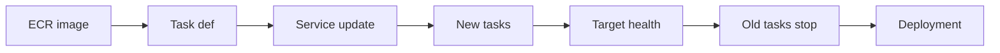

## Table of Contents

1. [The Problem](#the-problem)
2. [ECS Service](#ecs-service)
3. [Images](#images)
4. [Task Definitions](#task-definitions)
5. [Service Updates](#service-updates)
6. [Health Checks](#health-checks)
7. [Deployment Evidence](#deployment-evidence)
8. [Rollback](#rollback)
9. [Tradeoffs](#tradeoffs)
10. [Putting It All Together](#putting-it-all-together)
11. [What's Next](#whats-next)

## The Problem

The previous article separated an artifact from a running service. Now the team has a specific release to ship.

The image for `devpolaris-orders-api` is built and pushed to ECR. The pipeline says the artifact is ready. But users will not run that code until several runtime handoffs succeed:

- The task definition needs a new revision that points at the image.
- The ECS service needs to use that revision.
- New tasks need to start with the right CPU, memory, ports, config, roles, and logs.
- The ALB target group needs to decide the tasks are healthy.
- Old tasks should stop only when the deployment rules allow it.
- If the release is bad, the team needs a clear rollback target.

An ECS deployment is that handoff from image to trusted traffic.

## ECS Service

An ECS service is the controller that keeps a chosen number of tasks running. For a web API, it can also connect those tasks to a load balancer target group so traffic reaches only healthy targets.

For the orders API, the service owns the desired running state:

| Service question | Example answer |
| --- | --- |
| Which cluster? | `prod-apps` |
| Which task definition revision? | `orders-api:42` |
| How many tasks? | Desired count `4` |
| Which launch type or capacity? | Fargate |
| Which target group? | `orders-api-prod` |
| Which deployment rules? | Rolling update settings |

The service update is the release control. Updating the service to a new task definition revision tells ECS to replace old tasks with tasks started from the new recipe.

The common mistake is thinking the service "deploys an image." The service deploys a task definition revision. The image is one field inside that revision.

## Images

A container image is the packaged code and dependencies. In AWS, ECS commonly pulls that image from Amazon ECR.

The image should be identifiable. Tags are convenient for humans, but mutable tags can move. Digests are better evidence of exactly what package ran. A release record should let the team connect:

| Release fact | Why it matters |
| --- | --- |
| Git commit | What source produced the image |
| Image tag | Human-readable release label |
| Image digest | Exact image content |
| Build time | When the package was created |
| Vulnerability or scan status | Whether packaging checks passed |

The image alone still cannot run the service. It does not define the desired count, load balancer target group, task role, execution role, secret references, or health check behavior. Those live around the image in the runtime contract.

## Task Definitions

A task definition is the recipe ECS uses to start tasks. It includes container definitions, image references, CPU and memory, ports, environment variables, secrets, IAM roles, log configuration, and other runtime settings.

Every time the recipe changes, ECS creates a new task definition revision. That revision is important because rollback usually means returning the service to a previous revision.

For `orders-api:42`, the task definition might say:

```json
{
  "family": "orders-api",
  "containerDefinitions": [
    {
      "name": "api",
      "image": "111122223333.dkr.ecr.eu-west-2.amazonaws.com/orders-api@sha256:...",
      "portMappings": [{ "containerPort": 3000 }],
      "secrets": [{ "name": "DATABASE_URL", "valueFrom": "arn:aws:secretsmanager:..." }]
    }
  ]
}
```

The important field is not the JSON shape itself. The important idea is that the runtime recipe is versioned separately from the source repository. A healthy release records which revision went live.

## Service Updates

When the ECS service is updated to a new task definition revision, ECS starts new tasks and stops old tasks according to the deployment configuration.

For the default rolling deployment type, the service tries to keep enough healthy tasks available while it replaces the old revision. Deployment settings such as minimum healthy percent and maximum percent influence how many tasks can be running or stopped during the replacement.

The release path looks like this:



The gotcha is that a service can start new tasks while traffic still should not trust them. Running is not the same as healthy. The load balancer and application readiness decide when traffic can safely move.

## Health Checks

Health checks decide whether a task should receive traffic.

For a service behind an ALB, the target group health check calls a configured path and expects a healthy response. The ECS service uses load balancer health and task health as part of deployment behavior. If new tasks fail health checks, the deployment can stall or fail depending on configuration.

A good health check answers "can this task safely receive normal traffic?" It should be fast, stable, and tied to readiness. It should not do expensive deep checks on every load balancer probe.

| Check shape | Risk |
| --- | --- |
| `200` from process only | May mark task healthy before app is ready |
| Deep database query on every probe | Can amplify downstream pressure |
| Missing route or wrong port | Healthy app looks unhealthy to ALB |
| Slow startup with short grace | New tasks are killed before ready |

Health check grace period and application startup time matter. A task that needs migrations, warmup, or cache loading may need enough time before load balancer health failures count against it.

## Deployment Evidence

An ECS deployment leaves evidence. Read that evidence before changing the service again.

Useful evidence includes:

| Evidence | What it answers |
| --- | --- |
| Service events | What ECS tried and why it complained |
| Running task revisions | Which versions are actually running |
| Target health | Whether ALB trusts each task |
| Container logs | What the app reported at startup and runtime |
| Metrics | Whether errors, latency, CPU, memory, or target health changed |
| Deployment circuit breaker state | Whether ECS rolled back or marked deployment failed |

The first useful question is "where did the release path stop?" If the image cannot be pulled, the problem is before the app starts. If the task starts but the target is unhealthy, the problem may be port, health path, startup, security group, or app readiness. If target health is good but users see errors, the problem is inside the app path.

Deployment evidence turns "the deploy failed" into a specific failed handoff.

## Rollback

Rollback means returning the service to a previous known-good task definition revision or letting deployment rollback recover when configured.

For ECS, rollback is not a magic undo of every AWS change. It usually changes what task definition revision the service should run. If the bad release also changed secrets, target groups, IAM policies, database schema, or feature flags, rolling back only the task definition may not be enough.

Safe rollback needs a clear target:

| Needed fact | Example |
| --- | --- |
| Previous revision | `orders-api:41` |
| Previous image digest | `sha256:abc...` |
| Config compatibility | Same `DATABASE_URL` contract |
| Expected health | Target group had healthy tasks before release |
| Recovery evidence | 5xx and latency return to normal |

The gotcha is waiting too long to name the rollback target. During a calm deploy, record what is currently healthy. During a bad deploy, the team should not be hunting through memory for the last good revision.

## Tradeoffs

Deployment settings trade speed, cost, and risk.

Starting more replacement tasks can move faster, but it may temporarily increase capacity cost or downstream pressure. Keeping more old tasks during the deployment can protect availability, but it may require headroom. Stricter health checks can catch bad tasks earlier, but poorly designed checks can reject good tasks.

| Choice | Helps | Can hurt |
| --- | --- | --- |
| Faster rolling update | Shorter release window | Less time to observe bad tasks |
| More overlap | Availability during replacement | Temporary resource pressure |
| Deployment circuit breaker | Automated failure response | Only helps for the failure shapes it can detect |
| Strict health checks | Prevents bad traffic | Can cause churn if checks are fragile |

The operating habit is to choose deployment settings that match the service's risk. A customer-facing checkout API needs more caution than an internal batch worker.

## Putting It All Together

The opening image in ECR was only a release candidate. ECS deployment made it real.

The service owns desired running state. The image supplies packaged code. The task definition revision supplies the runtime recipe. A service update tells ECS to replace old tasks with new tasks from that revision. Health checks decide when targets earn traffic. Deployment evidence shows where the handoff succeeded or failed. Rollback returns the service to a previous known-good revision and verifies recovery with health, logs, and metrics.

The deployment is healthy when the team can point to the exact revision running, explain why traffic trusts it, and name the rollback target before they need it.

## What's Next

The next article focuses on the part of the runtime contract that most often surprises teams: config and secrets. A good image can still fail if it wakes up with the wrong values or permissions.

---

**References**

- [Amazon ECS services](https://docs.aws.amazon.com/AmazonECS/latest/developerguide/ecs_services.html). Supports the ECS service controller, desired count, load balancer, and deployment behavior explanations.
- [Amazon ECS task definitions](https://docs.aws.amazon.com/AmazonECS/latest/developerguide/task_definitions.html). Supports the task definition and task definition revision explanation.
- [Task definition parameters](https://docs.aws.amazon.com/AmazonECS/latest/developerguide/task_definition_parameters.html). Supports the image, port, secret, role, and log configuration examples.
- [Amazon ECS deployment types](https://docs.aws.amazon.com/AmazonECS/latest/developerguide/deployment-types.html). Supports the deployment type and rollback framing.
- [Rolling update](https://docs.aws.amazon.com/AmazonECS/latest/developerguide/deployment-type-ecs.html). Supports the rolling deployment behavior, minimum/maximum healthy percent, health checks, grace period, and deployment circuit breaker details.
