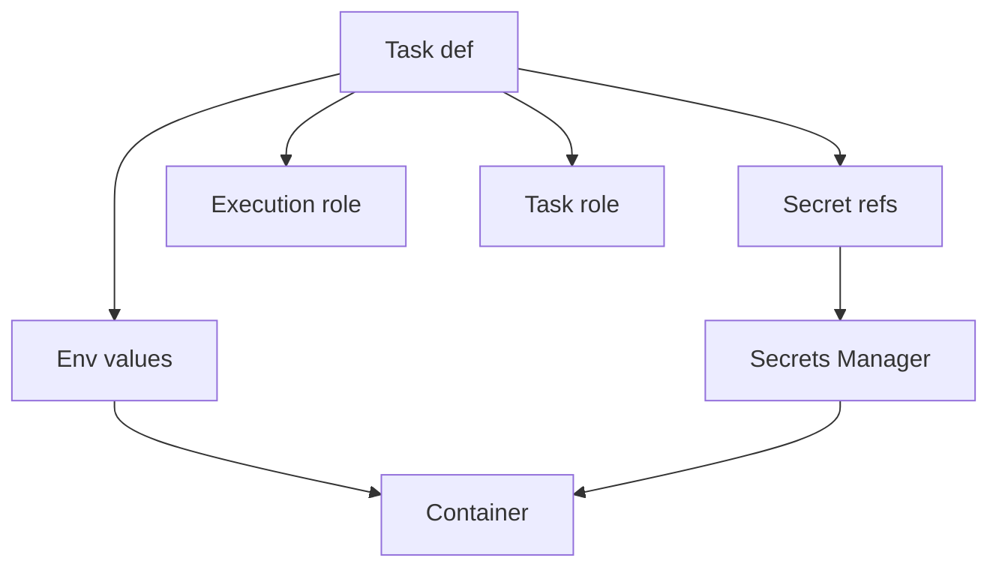

## Table of Contents

1. [The Problem](#the-problem)
2. [Runtime Config](#runtime-config)
3. [Environment Variables](#environment-variables)
4. [Secrets](#secrets)
5. [ECS Delivery](#ecs-delivery)
6. [Task Roles](#task-roles)
7. [Startup Validation](#startup-validation)
8. [Config Changes](#config-changes)
9. [Safe Diagnosis](#safe-diagnosis)
10. [Rotation](#rotation)
11. [Putting It All Together](#putting-it-all-together)
12. [What's Next](#whats-next)

## The Problem

The previous article showed how a new image becomes an ECS deployment. Now imagine the deployment starts, but the new tasks fail before serving traffic.

The image is good. Tests passed. The task definition revision exists. Still, production fails because:

- `DATABASE_URL` points at staging.
- `PAYMENT_WEBHOOK_SECRET` is missing.
- A secret was rotated, but old tasks still have the previous value.
- The task role cannot read from S3 or send to SQS.
- A developer prints environment variables to debug and leaks sensitive values into logs.

Runtime config and secrets are the values a service wakes up with. They are part of the release, even when no code changed.

## Runtime Config

Runtime config is the set of values attached to an application when it starts. It lets the same image run in different environments.

The image should contain code and dependencies. Runtime config should provide environment-specific facts:

| Runtime fact | Example |
| --- | --- |
| Environment name | `production` |
| Public base URL | `https://orders.devpolaris.com` |
| Timeout setting | `PAYMENT_TIMEOUT_MS=3000` |
| Feature setting | `RECEIPTS_ENABLED=true` |
| Secret reference | Database password in Secrets Manager |
| Permission boundary | Task role allowed to access S3 and SQS |

This separation matters because the same code may run on a laptop, in staging, and in production. Rebuilding the image for every environment mixes packaging with operation. Baking secrets into the image is worse because images move through registries, caches, scans, and developer machines.

The gotcha is that config changes can break production as surely as code changes. Changing a timeout, URL, secret ARN, or feature value deserves review, rollout, and rollback thinking.

## Environment Variables

Environment variables are a common way to pass ordinary settings into a process. In ECS, environment variables can be specified in the task definition container definition or loaded from supported environment files depending on the configuration.

Environment variables are useful for non-sensitive values:

```json
{
  "name": "api",
  "environment": [
    { "name": "NODE_ENV", "value": "production" },
    { "name": "PORT", "value": "3000" },
    { "name": "RECEIPTS_ENABLED", "value": "true" }
  ]
}
```

Those values are not secret. It is fine for operators to see them during review.

The practical mistake is putting sensitive values into ordinary environment entries because the app reads `process.env`. The app can still read secrets through environment variables at runtime, but the task definition should reference the secret source instead of storing the plaintext value.

## Secrets

A secret is a sensitive value such as a database password, API token, webhook signing secret, or private credential. In AWS, Secrets Manager and Systems Manager Parameter Store are common sources depending on the use case.

For ECS tasks, a container definition can reference Secrets Manager or Parameter Store values through the `secrets` field. ECS injects the value into the container at startup, and the task definition stores the reference rather than the plaintext.

```json
{
  "name": "DATABASE_URL",
  "valueFrom": "arn:aws:secretsmanager:eu-west-2:111122223333:secret:orders/prod/db"
}
```

That reference is safer than writing the database URL directly into the task definition. It still needs permissions, rotation thinking, and careful logging.

The gotcha is lifecycle. When a secret is injected as an environment variable, the running container receives the value at startup. If the secret changes later, the already-running process may not automatically use the new value. The service may need new tasks, application reload behavior, or a deliberate rotation plan.

## ECS Delivery

ECS delivers runtime values through the task definition and the roles attached to the task.

The delivery path looks like this:



There are two different IAM roles that beginners often mix up.

The task execution role is used by the ECS agent or Fargate platform for startup operations such as pulling images from ECR, sending logs to CloudWatch Logs, and retrieving secret values for injection.

The task role is the role your application code uses when it calls AWS services. If the orders API writes to S3 or sends SQS messages, those permissions belong on the task role.

| Role | Who uses it | Example job |
| --- | --- | --- |
| Task execution role | ECS startup machinery | Pull image, write logs, fetch injected secrets |
| Task role | Application code | Put S3 object, send SQS message, read DynamoDB |

When a task fails, knowing which role owns which job prevents slow permission debugging.

## Task Roles

The task role is an application permission boundary. It tells AWS what the running code is allowed to call.

For the orders API, the task role might allow:

| Permission need | Service |
| --- | --- |
| Write receipt PDFs | S3 |
| Send receipt jobs | SQS |
| Read idempotency records | DynamoDB |
| Publish order events | EventBridge |

The role should match the service's job. Do not reuse one broad role across unrelated services just because it makes deployment easier. A compromised or buggy task can only do what its role allows.

The gotcha is startup versus runtime. If ECS cannot pull the image, write logs, or inject the secret, inspect the execution role and task definition startup path. If the app starts but receives `AccessDenied` when calling S3, SQS, or DynamoDB, inspect the task role.

## Startup Validation

An application should validate its runtime contract before it claims to be ready for traffic.

Startup validation does not mean printing every config value. It means checking that required names exist, required values are parseable, and critical references have safe shapes.

For `devpolaris-orders-api`, startup validation might check:

| Check | Safe evidence |
| --- | --- |
| `PORT` exists and is numeric | Log `port configured` |
| `DATABASE_URL` exists | Log `database config present`, not the value |
| `PAYMENT_TIMEOUT_MS` parses | Log the numeric timeout |
| required AWS region exists | Log the region |
| feature flags are known | Log enabled flag names |

The health check should depend on readiness. If a task says it is healthy before startup validation completes, the load balancer can send traffic to an unready process.

The gotcha is over-validating. A startup check that calls every downstream dependency can turn a temporary dependency issue into a deployment failure loop. Keep startup validation focused on the contract needed to boot, and use separate metrics or alarms for deeper dependency health.

## Config Changes

A config change is a release because it changes production behavior.

Changing an environment variable may alter routing, timeouts, feature behavior, database targets, or queue names. Changing a secret reference may change which credential the app uses. Changing a task role may give or remove permissions. None of those changes require a new code build, but all of them can break the service.

Treat config changes like releases:

| Habit | Why it helps |
| --- | --- |
| Review the diff | Shows what runtime contract changed |
| Record old and new values safely | Gives rollback context without leaking secrets |
| Roll out gradually when possible | Reduces blast radius |
| Watch logs and metrics | Confirms the running service accepted the change |
| Name a rollback path | Avoids improvising during failure |

The practical rule: if a value changes what the running service does, it deserves release discipline.

## Safe Diagnosis

Debug config without leaking config.

When a task fails, the fastest unsafe move is to print every environment variable or secret. That puts sensitive values into CloudWatch Logs, support exports, screenshots, and incident notes.

Use safe evidence instead:

| Need | Safer evidence |
| --- | --- |
| Is a required env var present? | Log key name and `present=true` |
| Is a URL pointing at prod? | Log hostname or environment label, not credentials |
| Can the task read a secret? | Check IAM and secret ARN, not secret value |
| Is the role wrong? | Use `AccessDenied` action/resource from logs |
| Did rotation happen? | Log version label or timestamp, not plaintext |

For the orders API, a good error says `DATABASE_URL missing` or `AccessDenied for sqs:SendMessage on receipt queue`. A bad error prints the full database URL with username and password.

The goal is to leave enough evidence to fix the contract without creating a second incident.

## Rotation

Secret rotation changes sensitive values over time. Rotation protects systems from long-lived credentials, but it also creates runtime coordination.

If a database password rotates, the secret store changes first. Applications that read the secret at startup may need new tasks to receive the new value. Applications that fetch secrets dynamically need caching and refresh behavior. Databases and external providers may need overlap windows where old and new credentials both work.

Rotation should have a plan:

| Rotation question | Why it matters |
| --- | --- |
| Who owns the secret? | Defines change authority |
| How do running tasks receive the new value? | Avoids stale credentials |
| How is failure detected? | Connects rotation to logs and alarms |
| How can rotation be rolled back? | Protects production access |
| Where is the change recorded? | Creates audit and incident context |

The gotcha is assuming secret stores solve application behavior automatically. Secrets Manager can store and rotate values, but the service still needs a way to use the new value safely.

## Putting It All Together

The opening service had a good image and a bad runtime world. That is why config and secrets belong inside runtime operations.

Runtime config lets one image run in different environments. Environment variables carry ordinary settings. Secrets store sensitive values outside the image and task definition plaintext. ECS task definitions deliver values and references. The execution role supports startup operations. The task role gives the application AWS permissions. Startup validation checks the contract before traffic. Config changes are releases. Safe diagnosis proves presence and shape without leaking values. Rotation updates sensitive values with coordination.

The service is healthy when the image wakes up with the right values, the right permissions, safe evidence, and a recovery path if the contract changes badly.

## What's Next

The next article covers runtime controls after the service is live: desired count, autoscaling, queues, workers, schedules, concurrency, and pause controls.

---

**References**

- [Task definition parameters](https://docs.aws.amazon.com/AmazonECS/latest/developerguide/task_definition_parameters.html). Supports the ECS environment, secrets, image, port, CPU, memory, task role, execution role, and log configuration explanations.
- [Pass sensitive data to an Amazon ECS container](https://docs.aws.amazon.com/AmazonECS/latest/developerguide/specifying-sensitive-data.html). Supports the guidance about Secrets Manager, Parameter Store, and safer secret delivery patterns.
- [Pass Secrets Manager secrets through Amazon ECS environment variables](https://docs.aws.amazon.com/AmazonECS/latest/developerguide/secrets-envvar-secrets-manager.html). Supports the injected-secret behavior, permissions, and startup-value caveats.
- [Amazon ECS task IAM role](https://docs.aws.amazon.com/AmazonECS/latest/developerguide/task-iam-roles.html). Supports the task role explanation for application AWS API calls.
- [Amazon ECS task execution IAM role](https://docs.aws.amazon.com/AmazonECS/latest/developerguide/task_execution_IAM_role.html). Supports the execution role explanation for pulling images, sending logs, and retrieving secrets.
