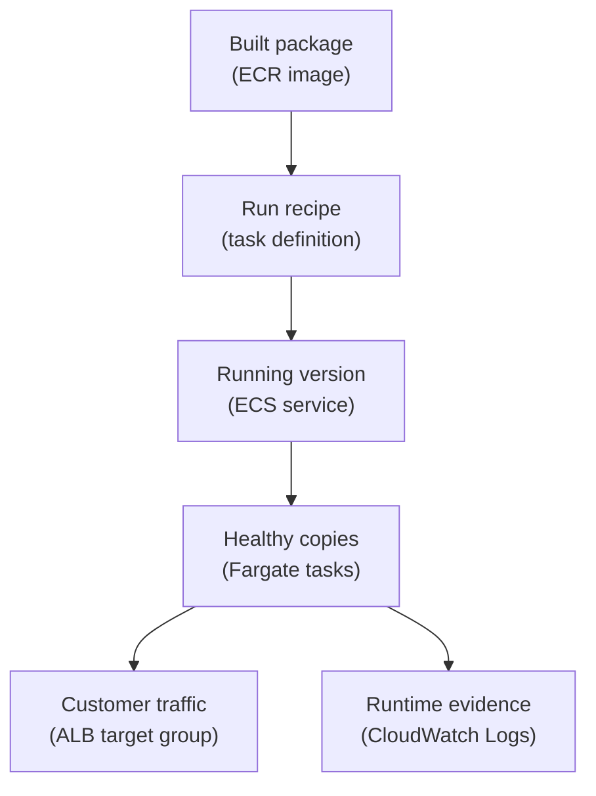

## Table of Contents

1. [The Build Is Done, But Runtime Work Starts](#the-build-is-done-but-runtime-work-starts)
2. [The Running Example](#the-running-example)
3. [The Runtime Contract](#the-runtime-contract)
4. [The Release Record](#the-release-record)
5. [From Artifact To Running Version](#from-artifact-to-running-version)
6. [Config, Secrets, And Permissions](#config-secrets-and-permissions)
7. [Health, Capacity, And Traffic](#health-capacity-and-traffic)
8. [Logs And The First Useful Question](#logs-and-the-first-useful-question)
9. [When The Image Exists But The Service Fails](#when-the-image-exists-but-the-service-fails)
10. [Rollback Target And Recovery Thinking](#rollback-target-and-recovery-thinking)
11. [Flexibility And Operational Surface Area](#flexibility-and-operational-surface-area)

## The Build Is Done, But Runtime Work Starts

A CI/CD pipeline can produce a good artifact and still leave production with unfinished work.
CI/CD means continuous integration and continuous delivery, the automation that tests code, builds a release, and prepares it for deployment.
An artifact is the thing that came out of that process, such as a container image in Amazon ECR.
That image proves the build happened.
It does not prove customers can use the service.

Runtime operations is the work of keeping a released application correctly running after the artifact exists.
It exists because production is more than a file in a registry.
Production needs a version to run, configuration to read, secrets to connect with, permissions to call other AWS services, health checks to decide whether traffic is safe, enough capacity to handle requests, logs to explain behavior, and a known rollback target if the new version is wrong.

This sits immediately after the CI/CD pipeline has produced a release candidate.
The pipeline may say, "image pushed."
Runtime operations asks, "is that image the version production is running, and is the running service healthy?"

The running example is a Node.js service called `devpolaris-orders-api`.
It runs on Amazon ECS with Fargate behind an Application Load Balancer, usually shortened to ALB.
The image lives in Amazon ECR.
The service runs from an ECS task definition.
Environment variables provide normal config.
AWS Secrets Manager provides sensitive values.
CloudWatch Logs stores stdout and stderr from the container.
The ALB health check decides whether each task is safe to receive traffic.

This article gives you a mental checklist for the moment after the build is green.
If you can name what must remain true at runtime, you can debug failed deployments without treating AWS as one large mystery box.

> A release is not alive because an image exists. It is alive because the right version is running, healthy, observable, and reversible.

## The Running Example

`devpolaris-orders-api` accepts order requests for a small learning platform.
The public URL is `https://orders.devpolaris.com`.
Customers never call ECS directly.
They call the ALB, and the ALB forwards safe requests to healthy ECS tasks.

The service shape is intentionally ordinary:

| Piece | Example |
|-------|---------|
| Application | Node.js API named `devpolaris-orders-api` |
| Image registry | ECR repository `devpolaris-orders-api` |
| Runtime | ECS service on Fargate |
| Public entry | ALB listener on HTTPS |
| App port | Container port `3000` |
| Config | `NODE_ENV`, `PORT`, `ORDER_TABLE_NAME`, `AWS_REGION` |
| Secrets | `DATABASE_URL`, `STRIPE_WEBHOOK_SECRET` |
| Logs | CloudWatch log group `/ecs/devpolaris-orders-api` |
| Health check | ALB requests `GET /healthz` |
| Steady capacity | Desired count `2` |
| Rollback target | Previous task definition revision and image digest |

This is the kind of service a junior developer can understand.
There is an HTTP process, a container image, a service that keeps copies running, and a load balancer that sends traffic to those copies.
Still, there are enough moving parts to teach the real runtime lesson.

If the image starts with the wrong port, the ALB sees unhealthy targets.
If the secret ARN is wrong, the task may never start.
If the app lacks permission to write to CloudWatch Logs, the deployment may be harder to diagnose.
If desired count is too low, one task crash can become customer-visible.
If nobody wrote down the previous good revision, rollback becomes a search exercise during a stressful moment.

Those are runtime operations problems.
They are not solved by saying "the Docker image built successfully."

## The Runtime Contract

A helpful way to think about runtime operations is to separate the artifact from the contract around it.
The artifact is the image.
The contract is everything production must know to run that image safely.

For `devpolaris-orders-api`, the contract has seven parts:

| Runtime Need | Plain-English Meaning | AWS Place To Check |
|--------------|-----------------------|--------------------|
| Running version | Which build is production using? | ECS service task definition |
| Config | What normal values does the app read? | Task definition environment |
| Secrets | What sensitive values does the app read? | Task definition secrets and Secrets Manager |
| Health | How does AWS know a task can receive traffic? | ALB target group health check |
| Capacity | How many copies should exist? | ECS service desired count |
| Logs | Where can humans read runtime evidence? | CloudWatch Logs |
| Rollback target | What known-good version can we return to? | Previous task definition and image digest |

This diagram keeps the same idea in one path.
Read it from top to bottom.
The image is only the first step.



The task definition is the most important bridge in this map.
It is the versioned recipe that tells ECS which image to run and how to run it.
Changing the image tag, environment variables, secrets, CPU, memory, port mapping, roles, or log configuration creates a new revision.

The ECS service is the long-running promise.
It says, "keep this many tasks running from this task definition, and connect them to this load balancer."
That promise is what makes a backend feel like a service instead of a one-time container start.

The ALB target group is the traffic filter.
It should only send user requests to task IPs that pass the health check.
Your health endpoint is part of the runtime contract.

CloudWatch Logs is the evidence trail.
When a task exits, loops, rejects a request, or fails startup, the logs should help the next engineer ask a better question.
Without logs, the team often falls back to guessing from status fields.

## The Release Record

Runtime operations gets easier when every release has a small record.
This record does not need to be fancy.
It needs to answer the questions a teammate will ask when production changes.

Here is a realistic snapshot for `devpolaris-orders-api` after a healthy deployment:

```text
Release: orders-api-prod-2026-05-02.1
Service: devpolaris-orders-api
Cluster: devpolaris-prod
Environment: production
Image tag: 2026-05-02.1
Image digest: sha256:9f4c4f6a0a4c2b7c8e9a61d15f2b0e7f5c2a8e61a4b7c0d9a1b2c3d4e5f67890
Task definition: devpolaris-orders-api:42
Previous good task definition: devpolaris-orders-api:41
Desired count: 2
Running count: 2
Healthy targets: 2/2
Health path: GET /healthz
Log group: /ecs/devpolaris-orders-api
Rollback target: devpolaris-orders-api:41
```

Notice what this record does.
It ties the human release name to the image, image digest, task definition revision, desired count, health, logs, and rollback target.
If a teammate says "production is on the new release," this is the evidence that makes the sentence meaningful.

The same state can be checked from ECS.
A trimmed command output might look like this:

```bash
$ aws ecs describe-services \
  --cluster devpolaris-prod \
  --services devpolaris-orders-api \
  --query 'services[0].{taskDefinition:taskDefinition,desired:desiredCount,running:runningCount,pending:pendingCount,rollout:deployments[0].rolloutState}'

{
  "taskDefinition": "arn:aws:ecs:us-east-1:111122223333:task-definition/devpolaris-orders-api:42",
  "desired": 2,
  "running": 2,
  "pending": 0,
  "rollout": "COMPLETED"
}
```

The command is not the lesson.
The lesson is the distinction between intent and reality.
Desired count is what the service is supposed to keep alive.
Running count is what ECS currently has alive.
Pending count means ECS is trying to start tasks.
Rollout state tells you whether ECS thinks the deployment finished.

You still need target health too, because "running" does not always mean "receiving traffic."
A process can be running while the ALB rejects it as unhealthy.
That is why the release record includes `Healthy targets: 2/2` alongside `Running count: 2`.

## From Artifact To Running Version

The image in ECR is the output of the build.
For this example, the image name is:

```text
111122223333.dkr.ecr.us-east-1.amazonaws.com/devpolaris-orders-api:2026-05-02.1
```

That image is still passive.
Nothing serves customer traffic because a tag exists.
ECS must start tasks from a task definition that points to the image.

Here is a short task definition excerpt.
It is not the whole file.
It shows the runtime details that matter for the mental model.

```json
{
  "family": "devpolaris-orders-api",
  "requiresCompatibilities": ["FARGATE"],
  "networkMode": "awsvpc",
  "cpu": "512",
  "memory": "1024",
  "executionRoleArn": "arn:aws:iam::111122223333:role/ecsTaskExecutionRole",
  "taskRoleArn": "arn:aws:iam::111122223333:role/devpolaris-orders-api-task",
  "containerDefinitions": [
    {
      "name": "orders-api",
      "image": "111122223333.dkr.ecr.us-east-1.amazonaws.com/devpolaris-orders-api:2026-05-02.1",
      "portMappings": [{ "containerPort": 3000, "protocol": "tcp" }],
      "environment": [
        { "name": "NODE_ENV", "value": "production" },
        { "name": "PORT", "value": "3000" }
      ],
      "secrets": [
        { "name": "DATABASE_URL", "valueFrom": "arn:aws:secretsmanager:us-east-1:111122223333:secret:prod/orders/database-AbCdEf" }
      ],
      "logConfiguration": {
        "logDriver": "awslogs",
        "options": {
          "awslogs-group": "/ecs/devpolaris-orders-api",
          "awslogs-region": "us-east-1",
          "awslogs-stream-prefix": "ecs"
        }
      }
    }
  ]
}
```

The first important line is the image.
That is the bridge from CI/CD into runtime.
The second important line is the port mapping.
The app listens on port `3000`, so ECS and the ALB must agree that `3000` is the container port.

The roles are easy to mix up, so slow down here.
The task execution role is used by ECS to do runtime setup work, such as pulling the ECR image, retrieving configured secrets, and sending logs through the configured log driver.
The task role is the identity your application code receives when it calls AWS APIs.

If the execution role is wrong, the task may fail before your Node.js process starts.
If the task role is wrong, the app may start and then fail when it tries to read or write an AWS resource.
That difference matters because it changes where you look first.

The task definition revision is the runtime version boundary.
`devpolaris-orders-api:42` is a complete runtime recipe, not merely the same app with a new image.
Rollback usually means pointing the ECS service back to a previous known-good recipe, not manually editing one field during an incident.

## Config, Secrets, And Permissions

Your laptop often hides configuration problems.
You may have a `.env` file, a local shell variable, a database URL in your terminal history, or credentials already loaded by your AWS profile.
Production has none of that unless you provide it.

Runtime config is the set of non-secret values the app needs to behave correctly.
For `devpolaris-orders-api`, examples are `NODE_ENV`, `PORT`, `ORDER_TABLE_NAME`, and `AWS_REGION`.
These values are not passwords.
They are still important because the app makes decisions from them.

Secrets are sensitive values.
For this service, `DATABASE_URL` and `STRIPE_WEBHOOK_SECRET` should not live in plain text in Git.
The task definition references secrets from Secrets Manager so ECS can inject them into the container at startup.

Permissions decide who can fetch and use those values.
The execution role needs permission to retrieve the configured secret value for injection.
The task role needs permission for whatever the running Node.js app does after startup, such as writing to DynamoDB or reading from S3.

Here is the beginner map:

| Runtime Item | Safe Home | Common Mistake |
|--------------|-----------|----------------|
| `PORT=3000` | Task definition environment | App listens on `8080` while ALB checks `3000` |
| `NODE_ENV=production` | Task definition environment | App starts in development behavior |
| `DATABASE_URL` | Secrets Manager reference | Secret ARN points to staging or does not exist |
| ECR pull permission | Execution role | Task cannot pull the image |
| App AWS API permission | Task role | App starts, then gets `AccessDenied` |
| CloudWatch log write setup | Log configuration and execution role | Task fails silently from the team's point of view |

One subtle point: injected secrets are read when the task starts.
If the secret value changes later, already-running tasks keep the value they received at startup.
You normally need to start fresh tasks, often by forcing a new deployment, so the running process sees the new value.

That behavior is not strange once you compare it to Node.js.
If a Node process reads `process.env.DATABASE_URL` at startup, changing a secret store somewhere else does not rewrite memory inside that already-running process.
You need a new process or explicit reload logic.

Good runtime operations makes these assumptions visible.
The release record should say which task definition revision is running.
The task definition should show which secret ARN is referenced.
The service events and logs should show whether the task started and whether the app could use the values it received.

## Health, Capacity, And Traffic

Health checks answer a simple question: should this running copy receive customer traffic?
That question is different from "did the process start?"
A Node.js process can start, bind a port, and still be unable to serve real requests because it cannot reach the database or has not finished startup.

For `devpolaris-orders-api`, the ALB target group checks:

```text
Protocol: HTTP
Path: /healthz
Port: traffic-port
Expected status: 200
```

The app should return `200` only when it is ready for normal traffic.
A health endpoint that always returns `200` is not useful.
A health endpoint that checks too many deep dependencies can also be painful, because a temporary downstream issue can remove every task from traffic at once.

For a beginner service, a practical health check usually confirms the process is alive, the HTTP server is accepting requests, and the app has completed its startup setup.
As the service matures, the team decides whether deeper dependency checks belong in the load balancer health path or in separate alarms.

Capacity is the other half of the runtime promise.
Desired count says how many task copies ECS should keep running.
For this service, desired count `2` gives the ALB two targets when everything is healthy.
If one task is replaced during deployment, the other can keep serving traffic.

Here is a healthy target snapshot:

```text
Target group: prod-orders-api
Health check: GET /healthz

Target IP       Port   State     Reason
10.0.18.42      3000   healthy   Health checks passed
10.0.27.113     3000   healthy   Health checks passed
```

This is the kind of evidence you want after a deployment.
The ECS service says two tasks are running.
The target group says two targets are healthy.
The logs show the app started with the expected release.
Those three signals together are much stronger than any one signal alone.

A mismatch tells you where to look.
If ECS says `running: 2` but the target group says `healthy: 0`, investigate port mapping, security groups, health path, startup time, and app readiness.
If ECS says `pending: 2`, investigate image pull, role permissions, subnet capacity, CPU and memory settings, and service events.
If ECS says `running: 1` while desired count is `2`, the service is trying to recover but cannot hold the promised shape.

## Logs And The First Useful Question

Logs are where the running service explains itself.
For Fargate tasks, you usually send container stdout and stderr to CloudWatch Logs with the `awslogs` log driver.
That means the ordinary output your container writes becomes searchable runtime evidence.

The first useful question is not "what failed?"
That is too broad.
The first useful question is "which layer produced the first meaningful error?"

A good startup log helps:

```text
2026-05-02T10:14:08.219Z INFO service=devpolaris-orders-api release=2026-05-02.1 task_revision=42 message="starting orders api"
2026-05-02T10:14:08.427Z INFO service=devpolaris-orders-api port=3000 message="http server listening"
2026-05-02T10:14:08.810Z INFO service=devpolaris-orders-api route=GET /healthz status=200 message="health check ready"
```

These lines are small, but they teach a lot.
They confirm the release, task revision, port, and health endpoint.
If the ALB still marks the target unhealthy, the next question is likely outside the Node process: target group path, target port, security group, or subnet routing.

A useful failure log is just as direct:

```text
2026-05-02T10:21:33.612Z ERROR service=devpolaris-orders-api release=2026-05-02.1
step=startup
error_name=ConfigError
message="DATABASE_URL is required"
```

That message points at runtime config, not the image build.
The image can be perfectly valid and still fail because production did not inject the secret the app expects.

Another common shape appears after startup:

```text
2026-05-02T10:24:09.155Z ERROR service=devpolaris-orders-api request_id=req_01HX9A0J3DF
route=POST /v1/orders
step=write_order
error_name=AccessDeniedException
message="not authorized to write order item"
```

This points at the task role.
The service started.
The health check may pass.
The first real request fails because the app identity cannot perform the AWS action it needs.

Logs do not replace metrics or health checks.
They give the detail you need after those higher-level signals tell you something changed.

## When The Image Exists But The Service Fails

The most important runtime failure pattern is this: the image exists, but the service does not become a healthy production service.
That sounds frustrating at first.
It becomes manageable when you split the failure by layer.

| Symptom | Likely Layer | First Check | Fix Direction |
|---------|--------------|-------------|---------------|
| Task never starts | Image pull or execution role | ECS stopped reason and service events | Fix image URI, tag, ECR access, or execution role |
| Task stops during startup | Config or secret | CloudWatch startup logs | Add missing env var or correct secret ARN |
| Task runs but target is unhealthy | Health check or networking | ALB target health reason | Fix port, path, security group, or readiness behavior |
| Task runs but requests fail | App permission or dependency | App logs for first request error | Fix task role or dependency config |
| Deployment stays pending | Capacity or placement | ECS service events | Adjust CPU, memory, subnets, or desired count |
| No useful logs appear | Logging setup | Task definition log configuration | Fix `awslogs` config or execution role |

Here is the kind of ECS event that sends you toward secret retrieval:

```text
(service devpolaris-orders-api) was unable to start a task.
Reason: ResourceInitializationError: unable to retrieve secret from Secrets Manager.
Task definition: devpolaris-orders-api:42
```

The right response is not to rebuild the image first.
The image may be fine.
The runtime recipe is asking ECS to fetch a secret it cannot retrieve.
You would inspect the secret ARN, Region, and execution role permission.

Here is the kind of target health snapshot that sends you toward the health path:

```text
Target IP       Port   State       Reason
10.0.18.42      3000   unhealthy   Health checks failed with status code 404
10.0.27.113     3000   unhealthy   Health checks failed with status code 404
```

This says the task is reachable enough to answer, but the ALB is checking a path the app does not serve successfully.
Maybe the app exposes `/healthz` but the target group checks `/health`.
Maybe the app changed its base path.
Maybe the health route exists but returns `404` until startup finishes.

Here is a capacity-shaped event:

```text
(service devpolaris-orders-api) has started 0 tasks:
insufficient CPU or memory configuration for requested task size in selected capacity.
desiredCount=2 taskDefinition=devpolaris-orders-api:42
```

The exact wording can vary, but the diagnosis path is the same.
Do not stare at the Node.js code first.
Check service events, pending tasks, task CPU and memory, Fargate capacity configuration, and subnet placement.

The failure mode section matters because it protects your attention.
When production is broken, your first instinct may be to rebuild, redeploy, or change code.
Runtime operations teaches you to ask what part of the contract is false.

## Rollback Target And Recovery Thinking

Rollback means returning production to a known-good runtime version.
For this ECS service, the clean rollback target is usually the previous task definition revision that points to the previous image digest and previous runtime settings.

That target should be known before you need it.
The release record above kept `devpolaris-orders-api:41` as the previous good revision, so the team can recover without searching through old pipeline runs during an incident.

A rollback command might look like this:

```bash
$ aws ecs update-service \
  --cluster devpolaris-prod \
  --service devpolaris-orders-api \
  --task-definition devpolaris-orders-api:41
```

You do not run this because a dashboard is red for one minute.
You run it when the evidence says the new revision is the problem and the previous revision is safer.
For example, revision `42` may reference a wrong secret, use the wrong port, or include an image that fails startup.

Rollback is not defeat.
It is a recovery tool.
The team can restore service first, then debug the broken revision without customers waiting on the answer.

A good rollback target includes more than an image tag.
Tags can be convenient for humans, but the strongest record includes the image digest.
The digest identifies the exact image content.
The task definition identifies the exact runtime recipe around that image.

After rollback, you still verify runtime state:

```text
Service: devpolaris-orders-api
Task definition: devpolaris-orders-api:41
Desired count: 2
Running count: 2
Healthy targets: 2/2
Recent 5xx: back to normal
Startup logs: release=2026-04-30.3 task_revision=41
```

This closes the loop.
The service is not "fixed" because the rollback command returned.
It is safer because the running version, health, traffic, and logs agree again.

## Flexibility And Operational Surface Area

ECS and Fargate give you useful flexibility.
You can choose the container image, CPU, memory, environment variables, secrets, IAM roles, subnets, security groups, health checks, desired count, deployment settings, and logging destination.
That flexibility is why the same platform can run many different backend services.

The cost is operational surface area.
Every configurable part is another place where production can be slightly wrong.
A wrong image tag, missing secret permission, strict health check, low memory limit, bad security group, or missing log configuration can turn a good build into a failed service.

This is the main tradeoff:

| You Gain | You Also Own |
|----------|--------------|
| One image can run in different environments | Environment-specific config must be correct |
| Secrets stay out of Git | Secret references and permissions must be maintained |
| Fargate removes host management | Task CPU, memory, network, and roles still matter |
| ALB protects traffic with health checks | Health path and readiness behavior must be designed |
| ECS can roll services forward and back | Task definition revisions must be tracked |
| CloudWatch centralizes logs | The app must emit useful startup and request evidence |

The practical answer is not to fear configuration.
The practical answer is to make the runtime contract visible.
Write down the release record.
Keep task definition changes reviewable.
Name the health endpoint clearly.
Log the release and task revision at startup.
Know which role does setup work and which role the app uses.
Keep the previous good task definition close.

That is the runtime operations mental model.
CI/CD produces the artifact.
Runtime operations keeps the artifact alive as a healthy, configured, observable, and reversible service.

---

**References**

- [Amazon ECS task definitions](https://docs.aws.amazon.com/AmazonECS/latest/userguide/task_definitions.html) - Explains task definitions as the versioned application blueprint that includes image, CPU, memory, roles, networking, and logging.
- [Deploy Amazon ECS services by replacing tasks](https://docs.aws.amazon.com/AmazonECS/latest/developerguide/deployment-type-ecs.html) - Describes how ECS services replace running tasks during rolling deployments and how desired count interacts with deployment behavior.
- [Amazon ECS task execution IAM role](https://docs.aws.amazon.com/AmazonECS/latest/developerguide/task_execution_IAM_role.html) - Clarifies the role ECS uses to pull images, retrieve setup-time resources, and prepare tasks.
- [Pass Secrets Manager secrets through Amazon ECS environment variables](https://docs.aws.amazon.com/AmazonECS/latest/userguide/secrets-envvar-secrets-manager.html) - Shows how ECS injects Secrets Manager values into containers and notes that running tasks need replacement to see updated secret values.
- [Health checks for Application Load Balancer target groups](https://docs.aws.amazon.com/elasticloadbalancing/latest/application/target-group-health-checks.html) - Explains how ALB target groups decide whether targets are healthy enough to receive traffic.
- [Send Amazon ECS logs to CloudWatch](https://docs.aws.amazon.com/AmazonECS/latest/developerguide/using_awslogs.html) - Covers the `awslogs` log driver path from ECS container output to CloudWatch Logs.
