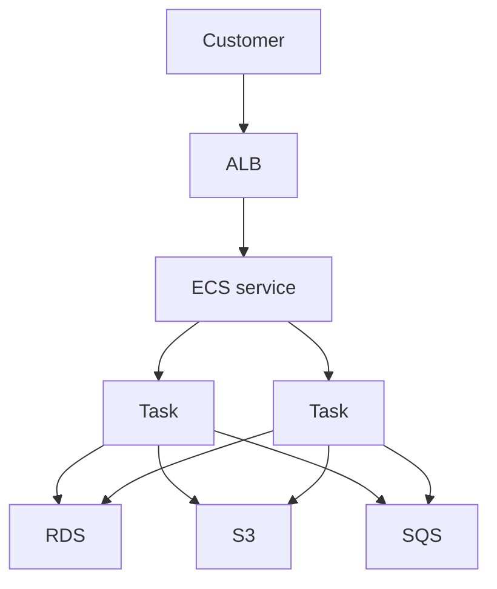

## Table of Contents

1. [The Problem](#the-problem)
2. [What Is Runtime Operations](#what-is-runtime-operations)
3. [Running Services](#running-services)
4. [Artifacts](#artifacts)
5. [Runtime Contract](#runtime-contract)
6. [Health](#health)
7. [Capacity](#capacity)
8. [Evidence](#evidence)
9. [Rollback](#rollback)
10. [Operational Surface Area](#operational-surface-area)
11. [Putting It All Together](#putting-it-all-together)
12. [What's Next](#whats-next)

## The Problem

The CI pipeline is green. The Docker image exists in Amazon ECR. The release notes are ready. From the build system's point of view, the work looks finished.

Production has a different question:

- Which version is actually running behind customer traffic?
- Did the new task receive the config and secrets it needs at startup?
- Can the task role call the AWS services the application uses?
- Will the load balancer send traffic only to healthy tasks?
- Is there enough capacity for current traffic?
- If the release fails, what exact version can the team return to?

An artifact proves that something was built. It does not prove that customers can use it. Runtime operations is the work that turns a release artifact into a safe running service.

## What Is Runtime Operations

Runtime operations is the work of keeping a released application correctly running after the build exists. It sits between CI/CD and day-to-day incident response.

For an AWS service, runtime operations answers a simple set of questions:

| Question | Runtime concern |
| --- | --- |
| What version should run? | Image, task definition, service deployment |
| What values should it receive? | Environment variables, secret references, config |
| What is it allowed to call? | Task role, execution role, IAM permissions |
| Should traffic trust it? | Health checks and target registration |
| Can it handle the work? | Desired count, scaling, queues, limits |
| Can we explain behavior? | Logs, metrics, traces, alarms |
| Can we recover? | Previous known-good version and rollback path |

The useful mental model is that a release has to become alive. A container image is the body of code. Runtime operations is the surrounding contract that decides where the code runs, what world it wakes up in, how traffic reaches it, and how operators know it is safe.

## Running Services

This module follows `devpolaris-orders-api`, a Node.js checkout service.

Customers do not call the task directly. They call the Application Load Balancer, usually shortened to ALB. The ALB forwards requests to healthy ECS tasks. The ECS service tries to keep the desired number of tasks running. The tasks read config, use secrets, write logs, and call data and messaging services.

That service controller matters. A production API should not depend on one manual container start. If a task exits, the service can replace it. If a deployment starts new tasks, the service can stop older tasks when the deployment rules allow it. If traffic rises, scaling can change the desired count.

The first runtime habit is to name the controller responsible for keeping the workload alive.

## Artifacts

An artifact is the built thing that can be deployed. For an ECS service, the artifact is usually a container image stored in Amazon ECR.

The artifact answers one question: what code and dependencies were packaged?

It does not answer:

| Missing answer | Why the artifact cannot answer it |
| --- | --- |
| Which environment is this? | Environment is attached at runtime |
| Which database should it use? | Connection details are config or secrets |
| Which port is exposed to the service? | ECS task definition maps container behavior |
| Which AWS APIs can it call? | IAM roles decide permissions |
| Is it healthy under traffic? | Runtime health checks and metrics decide |

This is why "image pushed" and "deployment successful" are not the same sentence. The image is a candidate. The running service is the production fact.

The gotcha is tag drift. A tag such as `latest` can move. A release should record the exact image digest or immutable image reference when possible so the team knows what ran and what rollback means.

## Runtime Contract

The runtime contract is everything the application expects when it starts: environment variables, secret references, ports, CPU and memory, command, log routing, roles, and health behavior.

In ECS, much of this contract lives in the task definition. A task definition is a recipe for starting one or more containers. A task definition revision is a numbered version of that recipe.

For `devpolaris-orders-api`, the runtime contract might include:

| Contract item | Example |
| --- | --- |
| Image | `orders-api` image in ECR |
| Port | Container listens on `3000` |
| Environment | `NODE_ENV=production` |
| Secret reference | `DATABASE_URL` from Secrets Manager |
| Task role | Permission to read S3 and send SQS messages |
| Execution role | Permission for ECS to pull images and write logs |
| Logs | Container output goes to CloudWatch Logs |
| Health path | `/healthz` responds when the app is ready |

The contract can break even when the image is good. A missing secret, wrong port, bad health path, or under-sized memory limit can make a healthy build fail in production.

## Health

Health is the runtime answer to "should traffic trust this workload?"

There are several health layers. The container process can be running. The ECS task can be running. The ALB target can be healthy. The application can still be unable to serve checkout because a dependency is unavailable. Those are related signals, not the same signal.

| Health layer | What it proves |
| --- | --- |
| Process is running | The container did not exit |
| ECS task is running | ECS placed and started the task |
| ALB target is healthy | The target responded to the configured health check |
| App readiness check passes | The app believes it can accept traffic |
| User metrics look healthy | Real requests are succeeding |

The practical mistake is making one health check prove too much. A load balancer health check should usually be quick and stable. Deep dependency checks may belong in separate metrics and alarms so one slow downstream service does not cause every task to churn.

Health checks decide traffic movement during deployments. That makes them release controls as well as monitoring details.

## Capacity

Capacity is the runtime answer to "can this service handle the current work?"

For ECS services, the simplest capacity control is desired count: how many tasks the service should try to keep running. Autoscaling can adjust that count based on signals such as CPU, memory, request count, or custom metrics.

Capacity is not a cure for every failure. More tasks help when the service is overloaded and dependencies can handle more callers. More tasks can hurt when the database is already saturated, an external API is rate limited, or each task repeats the same failing work.

The safe habit is to ask what pressure moves:

| Control | Pressure it may move | Pressure it may create |
| --- | --- | --- |
| More API tasks | More request handling | More database connections |
| More workers | Faster queue drain | More downstream API calls |
| Lower concurrency | Less downstream pressure | Slower backlog drain |
| Pause schedule | Stops repeated work | Delays expected jobs |

Capacity changes are operational moves. They should be made with evidence, not hope.

## Evidence

Runtime operations needs evidence because production behavior is not visible from one terminal.

The basic evidence path is:

| Evidence | Runtime question |
| --- | --- |
| ECS service events | What did the service try to do? |
| Task definition revision | What recipe started the task? |
| Target health | Does the load balancer trust the task? |
| CloudWatch logs | What did the application report? |
| Metrics and alarms | Is user impact or resource pressure rising? |
| CloudTrail | Who changed AWS resources or configuration? |

Evidence should be captured before frantic changes erase context. If a deployment failed, the service events, task revision, logs, target health, and alarms tell the story of what happened.

The first useful question is usually not "which setting should I change?" It is "what is the system trying to run right now, and where does the evidence stop matching the expected path?"

## Rollback

Rollback means returning the running service to a previous known-good runtime contract. For ECS, that usually means updating the service back to a previous task definition revision or letting deployment rollback behavior recover from a failed deployment.

The word "previous" is not enough. A rollback target should be specific:

| Rollback evidence | Why it matters |
| --- | --- |
| Previous task definition revision | Names the runtime recipe |
| Image digest or immutable reference | Names the exact code package |
| Config and secret version expectations | Avoids rolling code back into incompatible config |
| Health and metric baseline | Shows what "recovered" should look like |
| Deployment record | Explains when the bad version started |

The gotcha is config drift. Rolling back only the image may not recover the service if the failure came from a changed secret, environment variable, IAM role, target group, or scaling setting. Runtime operations treats rollback as returning to a known-good contract, including the image and the surrounding runtime settings.

## Operational Surface Area

Every runtime feature creates a surface someone must understand.

Task definitions create revision history. Secrets create rotation and permission boundaries. Health checks decide traffic trust. Autoscaling changes capacity. Logs, metrics, and alarms create evidence and attention. Schedules and queues move work out of request paths. Each piece helps the system run, but each piece can also be misconfigured.

This is why simple systems are valuable. A small service with one clear deployment path, a small runtime contract, stable health checks, and useful evidence is easier to operate than a flexible service with hidden switches everywhere.

The operating habit is to make each control visible:

| Runtime surface | Record the answer |
| --- | --- |
| Version | Which task definition revision is live? |
| Config | Which values are expected at startup? |
| Secrets | Where do sensitive values come from? |
| Health | What check decides traffic trust? |
| Capacity | What metric changes task count? |
| Recovery | What exact revision is safe to restore? |

## Putting It All Together

The opening build was green, but the release was not alive yet. Production still needed a running version, runtime config, secrets, permissions, health, capacity, evidence, and rollback.

Runtime operations is the work that keeps those facts understandable. ECS services keep tasks running. Artifacts provide deployable code. Task definitions describe the runtime contract. Health checks decide traffic trust. Capacity controls adjust work handling. Evidence explains behavior. Rollback returns to a known-good contract.

The system is healthy when a team can answer: what is running, why is it trusted, what evidence says it is working, and how do we recover if it is not?

## What's Next

The next article follows the most concrete runtime moment: an ECS deployment. It shows how a new image becomes a task definition revision, how an ECS service starts new tasks, how target health moves traffic, and what rollback really changes.

---

**References**

- [Amazon ECS services](https://docs.aws.amazon.com/AmazonECS/latest/developerguide/ecs_services.html). Supports the explanation of services maintaining desired task count and integrating with load balancers and deployments.
- [Amazon ECS task definitions](https://docs.aws.amazon.com/AmazonECS/latest/developerguide/task_definitions.html). Supports the task definition as the runtime recipe for containers, resources, roles, ports, environment, secrets, and logging.
- [Task definition parameters](https://docs.aws.amazon.com/AmazonECS/latest/developerguide/task_definition_parameters.html). Supports the details about image, CPU, memory, container ports, environment values, secrets, and log configuration.
- [Amazon ECS deployment types](https://docs.aws.amazon.com/AmazonECS/latest/developerguide/deployment-types.html). Supports the release and rollback discussion around service deployments.
- [Amazon ECS service auto scaling](https://docs.aws.amazon.com/AmazonECS/latest/developerguide/service-auto-scaling.html). Supports the capacity and desired-count discussion.
