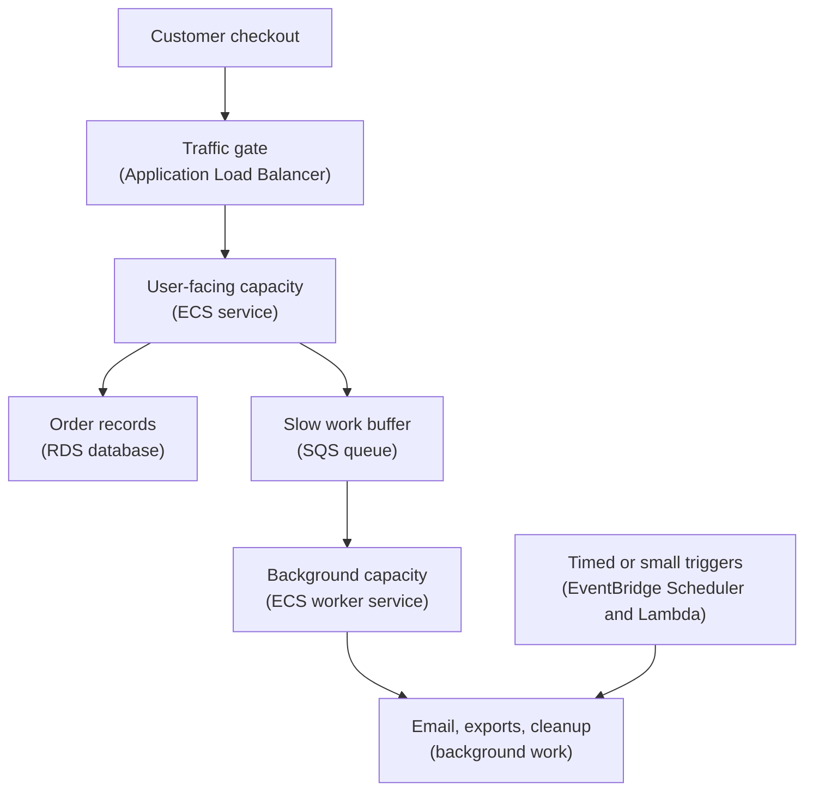

## Table of Contents

1. [Runtime Controls After Shipping](#runtime-controls-after-shipping)
2. [The Orders Runtime Map](#the-orders-runtime-map)
3. [Scaling Means Capacity, Not A Cure](#scaling-means-capacity-not-a-cure)
4. [Desired Count And Target Tracking](#desired-count-and-target-tracking)
5. [Slow Work Belongs Behind A Queue](#slow-work-belongs-behind-a-queue)
6. [Workers Need Their Own Controls](#workers-need-their-own-controls)
7. [Scheduled And Small Event Jobs](#scheduled-and-small-event-jobs)
8. [Controls That Buy Time](#controls-that-buy-time)
9. [Failure Mode: More Tasks Can Make Things Worse](#failure-mode-more-tasks-can-make-things-worse)
10. [Tradeoffs And Operating Habits](#tradeoffs-and-operating-habits)

## Runtime Controls After Shipping

Once a service is live, the work changes.
You are no longer only asking "does the code work?"
You are also asking "can we change how much work this system does without rebuilding the application?"

Runtime controls are the knobs and switches you use after a release is already running.
They include task counts, autoscaling rules, queue consumers, schedules, concurrency limits, deployment rollbacks, and temporary pauses.
They exist because production changes minute by minute, while code deploys should stay deliberate.

These controls fit between application code and incident response.
They do not replace good code.
They give you a safer first move when the system is overloaded, a downstream service is weak, a worker is misbehaving, or a schedule is firing at the wrong time.

The running example is a Node.js service named `devpolaris-orders-api`.
It runs on ECS with Fargate behind an Application Load Balancer.
Customers send checkout requests to the API.
The API writes the order, returns a response quickly, and sends slower work to background jobs.

Those slower jobs include receipt emails, fraud review enrichment, order exports, and cleanup of old export files.
Some jobs run as ECS workers that read from SQS queues.
Some small event jobs run as Lambda functions.
Nightly cleanup is started by EventBridge Scheduler.

This article ties those pieces together because operations rarely arrive as neat separate topics.
A traffic spike, a growing queue, and a slow database can all happen in the same hour.
The skill is knowing which control changes capacity, which control stops damage, and which control only hides the real problem for a few minutes.

> A runtime control is safest when you know what pressure it moves and what pressure it does not move.

We will keep the code small and the explanation practical.
You should leave this article able to look at an AWS service, a queue, a schedule, or a Lambda function and ask: "what can I safely turn up, turn down, pause, or roll back while I find the root cause?"

## The Orders Runtime Map

Before changing controls, build a simple picture of the system.
The goal is not a perfect architecture diagram.
The goal is to know where a request stops being a user-facing request and becomes background work.

For `devpolaris-orders-api`, checkout starts as HTTP.
The customer waits for this path.
Anything that happens inside this path affects checkout latency, which means it affects the user directly.

After the order is committed, slower work moves to queues and event jobs.
The customer should not wait while an email provider responds, a CSV export builds, or old temporary files get deleted.
Those jobs still matter, but they do not need to hold the checkout request open.

Here is the operating map:



Read the map from top to bottom.
The API is the front door for checkout.
RDS is the database dependency.
SQS is the buffer that stores work until workers are ready.
The trigger box groups two separate job starters:
EventBridge Scheduler starts time-based work, and Lambda handles small event reactions that do not need a long-running process.

This map also shows where controls live.
The API has an ECS desired count and autoscaling policy.
The worker has its own desired count, autoscaling policy, and queue behavior.
The schedule can be enabled or disabled.
The Lambda function has concurrency controls.
The deployment can be stopped or rolled back if the new version is unsafe.

A real team might keep those settings in infrastructure code.
In this article, we will name the artifacts so the system feels concrete:

| Runtime Piece | Example Name | Main Control |
|---------------|--------------|--------------|
| Checkout API | `devpolaris-orders-api` | ECS desired count and target tracking |
| Receipt worker | `devpolaris-orders-worker` | ECS desired count and SQS queue depth |
| Work queue | `orders-background-prod` | visibility timeout, DLQ, age of oldest message |
| Cleanup schedule | `orders-nightly-cleanup` | schedule state |
| Small event job | `devpolaris-orders-receipt-hook` | Lambda reserved concurrency |
| Rollout | ECS service deployment | stop or roll back deployment |

The important habit is separation.
Do not treat the whole runtime as one large "the app is slow" box.
Each part has its own pressure, evidence, and safe control.

## Scaling Means Capacity, Not A Cure

Scaling means changing capacity.
For an ECS service, that usually means changing the number of running tasks.
For Lambda, it usually means allowing more or fewer concurrent invocations.
For workers, it often means changing how many consumers pull messages from a queue.

Scaling does not fix every bottleneck.
It helps when the current capacity is the limiting factor.
It can hurt when the real limit is somewhere downstream.

Imagine the orders API has two Fargate tasks.
Each task can comfortably handle about 80 checkout requests per minute for the current workload.
Traffic rises to 220 requests per minute.
The database is healthy, downstream calls are healthy, and CPU rises on the API tasks.
Adding tasks is a reasonable response because the API layer is the part under pressure.

Now imagine the API tasks are only using moderate CPU, but RDS connections are near the pool limit and checkout latency is rising.
Adding more API tasks may create more database connections.
That can make the database problem worse.
The correct first move may be to reduce request pressure, inspect connection pools, pause nonessential workers, or roll back the change that increased database work.

This is why metrics matter before scaling.
You are not trying to collect every graph in AWS.
You are trying to answer one simple question: "which layer is actually saturated?"

A healthy diagnosis starts with a status snapshot like this:

```text
devpolaris-orders-api, last 15 minutes

ALB requests:
  215 per minute, rising

ALB target 5xx:
  low

Target response time:
  220 ms average, rising slowly

ECS service:
  desired=2 running=2 pending=0
  CPU average=78 percent
  memory average=54 percent

RDS:
  connections normal
  write latency normal
```

This points toward API capacity.
The service is running the desired number of tasks.
CPU is high.
The database does not look like the bottleneck.
Scaling out the API from two tasks to four may be the right short-term move.

A different snapshot tells a different story:

```text
devpolaris-orders-api, last 15 minutes

ALB requests:
  118 per minute, normal

ALB target 5xx:
  increased after 10:42

Target response time:
  high

ECS service:
  desired=4 running=4 pending=0
  CPU average=31 percent
  memory average=48 percent

RDS:
  connections high
  checkout write latency high

SQS:
  orders-background-prod age of oldest message rising
```

This does not look like "add more API tasks."
The API has spare CPU.
The database is under pressure.
The queue is falling behind because downstream work is slow.

Scaling has leverage because it is fast.
It is dangerous for the same reason.
If you scale the wrong layer, you can move the pressure into a weaker dependency.

## Desired Count And Target Tracking

In ECS, desired count is the number of tasks you ask the service to keep running.
If desired count is `3`, ECS tries to keep three healthy copies of that service alive.
If one task exits, ECS starts a replacement.

Desired count is beginner-friendly because it separates intent from reality.
Intent is "I want three."
Reality is "three are running, one is pending, or only two are healthy."

You can see that split in a small service view:

```bash
$ aws ecs describe-services \
  --cluster devpolaris-prod \
  --services devpolaris-orders-api \
  --query 'services[0].{desired:desiredCount,running:runningCount,pending:pendingCount,rollout:deployments[0].rolloutState}'
{
  "desired": 3,
  "running": 3,
  "pending": 0,
  "rollout": "COMPLETED"
}
```

The command is not the point.
The point is the habit.
Before you decide to scale, check whether ECS already has the count you asked for.
If desired is `4` but running is `2`, the problem may be task startup, health checks, subnet capacity, image pull, or deployment failure.
Increasing desired to `8` would only ask ECS to fail more times.

A manual scale-out is direct:

```bash
$ aws ecs update-service \
  --cluster devpolaris-prod \
  --service devpolaris-orders-api \
  --desired-count 4

serviceName: devpolaris-orders-api
desiredCount: 4
runningCount: 3
pendingCount: 1
```

Manual changes are useful during investigation, but production services usually need autoscaling.
Autoscaling means a policy changes desired count for you based on a metric.
With target tracking, you choose a metric and a target value, and AWS adjusts task count to keep the metric near that target.

For the orders API, a simple target tracking policy might aim for average CPU around 60 percent:

```json
{
  "PolicyName": "orders-api-cpu-60",
  "PolicyType": "TargetTrackingScaling",
  "TargetTrackingScalingPolicyConfiguration": {
    "TargetValue": 60.0,
    "PredefinedMetricSpecification": {
      "PredefinedMetricType": "ECSServiceAverageCPUUtilization"
    },
    "ScaleOutCooldown": 60,
    "ScaleInCooldown": 300
  }
}
```

The policy is not saying "CPU is the only signal that matters."
It is saying "when CPU is the service pressure we care about, add or remove tasks to keep average CPU near this target."

Target tracking works best when the metric moves with demand and improves when capacity is added.
CPU often fits that pattern for compute-heavy API work.
Request count per target can fit for HTTP traffic behind a load balancer.
Memory can fit when memory pressure rises predictably with load.

It works poorly when the metric is really a downstream symptom.
If checkout latency rises because RDS is slow, adding API tasks may not reduce latency.
It may increase database connections and make the queue slower.

That is the beginner tradeoff.
Autoscaling saves humans from constantly adjusting capacity.
It also needs a metric that represents the layer you can actually help by adding capacity.

## Slow Work Belongs Behind A Queue

A checkout request should do the work that must happen before the customer sees success.
It should validate input, reserve inventory if the product needs that, create the order record, and return a clear result.
It should not wait for every slow side effect if those side effects can safely happen after the order exists.

Receipt email is the classic example.
The customer cares that the order was accepted.
They also care about the email, but the email provider does not need to be inside the checkout response path.
If the provider is slow for six seconds, holding the HTTP request open makes checkout feel broken even though the order is already saved.

SQS, short for Simple Queue Service, gives you a buffer between "work was requested" and "a worker is ready to do it."
The API sends a message.
The worker receives the message later, processes it, and deletes it when done.
If workers are busy, messages wait in the queue instead of forcing checkout requests to wait.

The message should be small and specific:

```json
{
  "type": "receipt.email.requested",
  "orderId": "ord_1042",
  "email": "maya@example.com",
  "idempotencyKey": "receipt:ord_1042",
  "requestedAt": "2026-05-02T10:17:03Z"
}
```

The `idempotencyKey` is important.
SQS can deliver a message more than once.
The worker must be safe if it sees `receipt:ord_1042` twice.
It should detect that the receipt was already sent or that the send is already recorded, then skip the duplicate real-world effect.

The API log should show that checkout finished and queued the side work:

```text
2026-05-02T10:17:03.221Z INFO service=devpolaris-orders-api requestId=req_7JH9 route=POST /v1/orders orderId=ord_1042 status=created
2026-05-02T10:17:03.248Z INFO service=devpolaris-orders-api requestId=req_7JH9 queue=orders-background-prod messageType=receipt.email.requested messageId=8b6d4a25 status=sent
```

That log tells a support engineer two useful things.
The order was created.
The receipt job was placed on the queue.
If the email does not arrive, the next investigation starts with the worker and SQS, not with the checkout request.

Queues also give you a cleaner failure boundary.
If the email provider is down, workers can fail and retry messages.
The API can continue accepting orders if the queue is available and the business accepts delayed receipts.

That does not make queues free.
A queue turns immediate pain into delayed work.
You still need to watch queue depth, age of oldest message, worker errors, and the dead-letter queue, usually shortened to DLQ.
A DLQ is a separate queue where messages go after too many failed processing attempts.

The beginner SQS signals are:

| Signal | What It Suggests |
|--------|------------------|
| visible messages rising | workers are not keeping up |
| oldest message age rising | some work is waiting too long |
| not visible messages high | workers received many messages but have not finished |
| DLQ messages present | some messages repeatedly failed |
| worker errors rising | the consumer may be broken or a dependency is failing |

The queue is not a trash pile for work you do not care about.
It is a promise that the work can be processed later with evidence.

## Workers Need Their Own Controls

An SQS worker is a consumer.
It pulls messages, does the work, and deletes messages after success.
For `devpolaris-orders-api`, the worker is another ECS service named `devpolaris-orders-worker`.
It uses the same container image family as the API, but starts a worker command instead of listening on port `3000`.

That separation matters.
The API desired count should follow checkout traffic.
The worker desired count should follow queue pressure and downstream safety.
If you mix those controls, you can accidentally scale receipt sending just because web checkout traffic rose.

A worker service snapshot might look like this:

```text
ECS service: devpolaris-orders-worker

desired tasks:
  2

running tasks:
  2

queue:
  orders-background-prod

queue visible messages:
  420

oldest message age:
  18 minutes

worker error rate:
  low
```

This suggests workers are behind but not obviously broken.
If downstream services are healthy, adding workers may drain the queue faster.

Now compare that with a more dangerous snapshot:

```text
ECS service: devpolaris-orders-worker

desired tasks:
  8

running tasks:
  8

queue visible messages:
  falling quickly

worker error log:
  PaymentExportValidationError on 92 percent of messages

RDS write latency:
  high
```

This is not success.
The queue is falling because bad workers are consuming messages quickly.
They may be failing, retrying, writing partial state, or moving messages toward the DLQ.
More workers would make the blast radius larger.

The safe move may be to pause the worker:

```bash
$ aws ecs update-service \
  --cluster devpolaris-prod \
  --service devpolaris-orders-worker \
  --desired-count 0

serviceName: devpolaris-orders-worker
desiredCount: 0
runningCount: 2
pendingCount: 0
```

Desired count changes first.
Running count may take a short time to fall as ECS stops tasks.
That is normal.

Pausing a worker is not the same as deleting work.
The SQS messages remain in the queue unless a worker received and deleted them.
Messages already in flight become visible again after their visibility timeout if the worker does not delete them.

This is why "drain the queue" needs care.
Draining means processing queued messages until the backlog reaches an acceptable level.
It should not mean blindly increasing consumers until the graph looks empty.
If the worker is bad, draining can spread bad work.

A safer drain path looks like this:

1. Pause or reduce workers if they are failing in a repeated pattern.
2. Inspect one failed message and the matching worker log.
3. Fix or roll back the worker.
4. Restart with a small desired count, such as `1`.
5. Watch oldest message age, DLQ count, worker errors, and downstream latency.
6. Increase desired count only while the evidence stays healthy.

That path feels slower than "scale to twenty."
It is faster than repairing thousands of duplicated emails, partial exports, or repeated database writes.

## Scheduled And Small Event Jobs

Not all background work comes from checkout.
Some work starts because time passed.
Some starts because a small event arrived from another AWS service.

EventBridge Scheduler is a managed scheduler for running work at a time or interval.
For the orders system, it might start `orders-nightly-cleanup` every night.
That cleanup job removes expired export files from S3 and marks old export requests as expired.

The important design choice is that the API does not need a timer loop.
The API should serve checkout.
The schedule owns the clock.
The cleanup job owns the cleanup logic.

A schedule status view might look like this:

```bash
$ aws scheduler get-schedule \
  --name orders-nightly-cleanup \
  --query '{name:Name,state:State,expression:ScheduleExpression,target:Target.Arn}'
{
  "name": "orders-nightly-cleanup",
  "state": "ENABLED",
  "expression": "cron(0 3 * * ? *)",
  "target": "arn:aws:ecs:us-east-1:111122223333:cluster/devpolaris-prod"
}
```

The useful fields are simple.
The schedule is enabled.
The expression says when it runs.
The target tells you what AWS API or service receives the scheduled invocation.

If cleanup is deleting the wrong files, disabling the schedule can be safer than rushing a code change.
With EventBridge Scheduler, changing state uses an update operation that requires the schedule's required fields.
That is why teams often keep a small checked-in schedule payload and change `State` deliberately:

```json
{
  "Name": "orders-nightly-cleanup",
  "ScheduleExpression": "cron(0 3 * * ? *)",
  "FlexibleTimeWindow": { "Mode": "OFF" },
  "State": "DISABLED",
  "Target": {
    "Arn": "arn:aws:scheduler:::aws-sdk:ecs:runTask",
    "RoleArn": "arn:aws:iam::111122223333:role/orders-cleanup-scheduler"
  }
}
```

The risk this prevents is accidental data loss.
If the cleanup code or target input is wrong, another scheduled run can repeat the damage before a developer finishes a fix.
Disabling the schedule stops the next automatic trigger while the team checks S3 keys, logs, and the cleanup target input.

Lambda fits a different shape.
Use Lambda for small event jobs that have a clear trigger, a bounded amount of work, and narrow permissions.
For example, `devpolaris-orders-receipt-hook` might verify a partner webhook, normalize the payload, and send a clean message to SQS.

Lambda concurrency is how many invocations can run at the same time.
Reserved concurrency can protect a downstream system by capping one function.
If a partner sends a flood of webhook events and the function writes to RDS, a low reserved concurrency can keep that function from consuming every available database connection.

The control looks like this:

```bash
$ aws lambda put-function-concurrency \
  --function-name devpolaris-orders-receipt-hook \
  --reserved-concurrent-executions 2

{
  "ReservedConcurrentExecutions": 2
}
```

This does not fix bad code.
It slows the amount of code that can run at once.
That can be exactly what you need while protecting RDS, an email provider, or a partner API.

Lambda functions connected to SQS can also have event source mapping settings that limit how quickly one queue invokes one function.
That is useful when the function is correct but a dependency needs a slower drain.
The principle is the same: reduce concurrency where work enters the risky dependency.

## Controls That Buy Time

Operational controls are not only for growth.
They are also for containment.
Containment means reducing damage while you diagnose the system.

This is the part beginners often find surprising.
The safest first action in production is not always a code deploy.
A deploy changes code, starts a rollout, waits for health checks, and may introduce a second problem.
A control change can be smaller and easier to reverse.

Here are common controls for the orders runtime:

| Control | What It Changes | When It Helps |
|---------|-----------------|---------------|
| increase API desired count | more web tasks | API CPU is the bottleneck and dependencies are healthy |
| lower API desired count | fewer web tasks | you need to reduce pressure on RDS or a downstream service |
| pause worker desired count | no queue consumers | worker is doing bad work or dependency is unsafe |
| reduce worker desired count | slower queue drain | work is valid but downstream capacity is limited |
| disable schedule | no next timed run | scheduled job is risky or wrong |
| reserve Lambda concurrency | cap function parallelism | function could overwhelm a dependency |
| stop rollout | return to previous service revision | new deployment is unsafe |

The control should match the failure.
If a scheduled cleanup is deleting active files, increasing ECS tasks is irrelevant.
If a worker is sending duplicate emails, disabling the public API may be too broad.
If a new API revision fails health checks, pausing the receipt queue will not fix the rollout.

Stopping a rollout is one of the most protective controls.
If a new ECS service deployment is failing and the previous deployment was healthy, rolling back can restore the known-good task definition faster than editing code under pressure.

A rollout status might show the problem:

```text
Service: devpolaris-orders-api
Deployment: ecs-svc/083924731
Task definition: devpolaris-orders-api:42
Rollout state: IN_PROGRESS
Rollout reason: tasks failed ELB health checks

Previous deployment:
  devpolaris-orders-api:41
  rollout state: COMPLETED
```

If the deployment circuit breaker is enabled with rollback, ECS can automatically roll back certain failed deployments.
If it is not enough, or if the failure is visible before automation catches it, a manual stop with rollback may be the safer action.

```bash
$ aws ecs stop-service-deployment \
  --service-deployment-arn arn:aws:ecs:us-east-1:111122223333:service-deployment/devpolaris-prod/devpolaris-orders-api/ecs-svc-083924731 \
  --stop-type ROLLBACK

status: ROLLBACK_REQUESTED
reason: operator stopped unhealthy deployment
```

The important decision is not the command itself.
The important decision is that the team chooses the smallest reversible action that removes active risk.

Code changes still matter.
After the system is contained, you fix the bug, add a test, improve the worker validation, or change the target tracking policy.
The runtime control gives you room to do that carefully.

## Failure Mode: More Tasks Can Make Things Worse

Let us walk through the main failure mode because it is common and easy to misread.
Checkout latency rises.
The first instinct is to add more API tasks.
That works only if API task capacity is the real limit.

At 10:40, a new release of `devpolaris-orders-api` changes the checkout path.
It adds one extra database read per order and starts creating export summary rows synchronously.
The code passes tests, deploys, and reaches steady state.
Ten minutes later, alarms fire for checkout 5xx and high latency.

The first dashboard view looks like this:

```text
time    alb_req/min  target_5xx  api_cpu  api_tasks  rds_conn  rds_write_latency
10:35   116          0           42%      3          38        normal
10:40   119          3           45%      3          52        rising
10:45   121          28          48%      3          91        high
10:50   117          41          39%      5          128       high
```

The line at 10:50 is the warning.
Someone scaled API tasks from three to five.
CPU did not need help.
RDS connections and write latency got worse.

The next evidence is in the API logs:

```text
2026-05-02T10:47:12.611Z ERROR service=devpolaris-orders-api requestId=req_91K route=POST /v1/orders orderId=ord_1088
error=DatabaseTimeout step=write_export_summary elapsedMs=2800

2026-05-02T10:47:12.642Z WARN service=devpolaris-orders-api requestId=req_91K
message="checkout response failed after order write, export summary still pending"
```

This is not a web task shortage.
The API is spending time waiting on database work.
More API tasks create more concurrent database work.

The queue tells a related story:

```text
Queue: orders-background-prod
visible messages: 1,840
oldest message age: 42 minutes
not visible messages: 620
DLQ messages: 0

Worker logs:
  2026-05-02T10:48:03Z WARN worker=orders-worker orderId=ord_1088 step=export_summary retry=2 error=DatabaseTimeout
```

Workers are also pushing the same dependency.
If you scale workers up, they may drain SQS faster but increase database pressure.
If you leave them at high concurrency, the queue and database fight each other.

The diagnosis path is:

1. Start at customer impact: ALB 5xx and target response time.
2. Check ECS desired, running, and CPU to see whether API capacity is the limit.
3. Compare RDS metrics in the same time window.
4. Search API logs for the route and request IDs producing slow errors.
5. Check SQS visible messages, oldest message age, not visible messages, and DLQ.
6. Search worker logs for the same `orderId` or operation.
7. Compare the current task definition or release with the previous known-good version.

The safer control sequence might be:

1. Stop or roll back the API deployment if the new release introduced the database work.
2. Reduce API desired count only if it protects RDS and enough healthy tasks remain for critical traffic.
3. Pause or reduce workers so queued export work stops competing with checkout writes.
4. Keep SQS messages in the queue while you fix the worker or API.
5. Resume workers slowly and watch RDS latency, queue age, DLQ count, and worker errors.

Notice what we did not do.
We did not purge the queue.
We did not scale every service up.
We did not immediately deploy a rushed patch while the bad rollout was still creating pressure.

This is the mental model:
capacity helps the layer that lacks capacity.
Controls protect dependencies while you find the layer that lacks safety.

## Tradeoffs And Operating Habits

Runtime controls make a service easier to operate, but every control has a cost.
More tasks cost more money and can create more downstream load.
Fewer tasks reduce pressure but may increase latency or reduce availability.
More workers drain a queue faster but can overwhelm an email provider, RDS, or another API.
Fewer workers protect dependencies but increase message age.

Schedules remove timer code from your service, but they can repeat bad work exactly on time.
Lambda removes idle servers for small jobs, but concurrency can surprise a dependency if an event source sends a burst.
Autoscaling removes manual toil, but a bad scaling metric can automate the wrong response.

The practical habit is to write down the operating intent for each control.
You do not need a giant document.
A small service note is enough:

```text
devpolaris-orders runtime controls

orders API:
  normal desired count: 3
  scale signal: API CPU or request count per target
  do not scale up when RDS latency is the active bottleneck

orders worker:
  normal desired count: 2
  queue: orders-background-prod
  safe pause: desired count 0
  resume path: start at 1 worker and watch DLQ plus RDS latency

orders-nightly-cleanup:
  safe pause: disable schedule
  first evidence: cleanup log group and S3 key prefix

receipt hook Lambda:
  safe throttle: reserved concurrency 2
  first evidence: function logs by webhookId or orderId
```

That note is valuable because incidents make people forget context.
It tells the next engineer which control is safe, which metric matters, and which dependency can be harmed by the wrong move.

Good operating habits also keep controls reversible.
If you manually change desired count, record why.
If you disable a schedule, create a reminder to re-enable it or remove it.
If you set reserved concurrency low, remember that it can throttle valid work later.
If you pause workers, watch queue age so delayed work does not become a separate incident.

The key tradeoff is speed versus confidence.
Runtime controls are faster than code changes.
Code changes are usually the permanent fix.
A calm operator uses controls to reduce active harm, then uses code, tests, and configuration review to remove the cause.

For `devpolaris-orders-api`, that means:

| Situation | First Safer Control | Follow-Up Fix |
|-----------|---------------------|---------------|
| API CPU high, dependencies healthy | increase desired count or rely on target tracking | tune autoscaling and load test |
| RDS saturated | reduce pressure from API or workers | fix query, pool, or release behavior |
| worker sends bad side effects | pause worker desired count | fix worker and replay carefully |
| cleanup job deletes wrong files | disable schedule | fix target input and add safer validation |
| Lambda overwhelms dependency | lower reserved concurrency | redesign batching or downstream usage |
| new deployment fails health | stop rollout or roll back | fix image, config, or health issue |

This is ordinary production work, and it is the difference between a service that merely deployed and a service that can be operated.
The goal is not to touch every knob.
The goal is to know which knob protects users while you gather evidence.

---

**References**

- [Automatically scale your Amazon ECS service](https://docs.aws.amazon.com/AmazonECS/latest/userguide/service-auto-scaling.html) - Official ECS guide to service autoscaling, desired task count, and how scaling policies change capacity.
- [Use a target metric to scale Amazon ECS services](https://docs.aws.amazon.com/AmazonECS/latest/developerguide/service-autoscaling-targettracking.html) - Explains target tracking policies and how ECS Service Auto Scaling adds or removes tasks based on a selected metric.
- [How the Amazon ECS deployment circuit breaker detects failures](https://docs.aws.amazon.com/AmazonECS/latest/developerguide/deployment-circuit-breaker.html) - Documents how ECS detects failed deployments and can roll back to the last completed deployment.
- [Amazon SQS visibility timeout](https://docs.aws.amazon.com/AWSSimpleQueueService/latest/SQSDeveloperGuide/sqs-visibility-timeout.html) and [Using dead-letter queues in Amazon SQS](https://docs.aws.amazon.com/AWSSimpleQueueService/latest/SQSDeveloperGuide/sqs-dead-letter-queues.html) - Explain how received messages become temporarily invisible, retry after failure, and move to a DLQ after repeated failures.
- [Amazon EventBridge Scheduler](https://docs.aws.amazon.com/eventbridge/latest/userguide/using-eventbridge-scheduler.html) and [Changing the schedule state in EventBridge Scheduler](https://docs.aws.amazon.com/scheduler/latest/UserGuide/managing-schedule-state.html) - Cover scheduled targets and the enabled or disabled schedule state used for operational pauses.
- [Configuring reserved concurrency for a function](https://docs.aws.amazon.com/lambda/latest/dg/configuration-concurrency.html) and [Configuring scaling behavior for SQS event source mappings](https://docs.aws.amazon.com/lambda/latest/dg/services-sqs-scaling.html) - Explain Lambda concurrency controls used to limit event-driven work and protect downstream dependencies.
