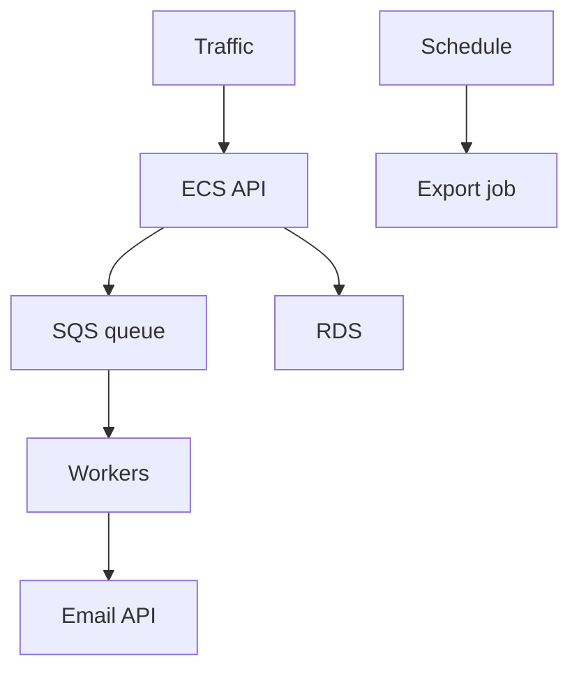
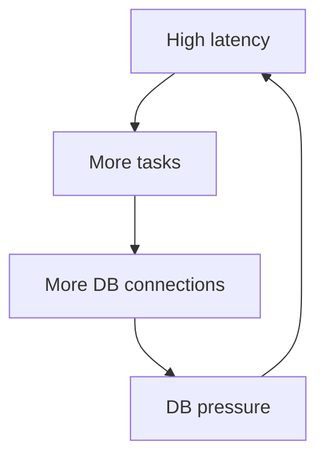

## Table of Contents

1. [The Problem](#the-problem)
2. [Runtime Controls](#runtime-controls)
3. [Scaling](#scaling)
4. [Desired Count](#desired-count)
5. [Autoscaling](#autoscaling)
6. [Queues And Workers](#queues-and-workers)
7. [Schedules](#schedules)
8. [Concurrency](#concurrency)
9. [Pause Controls](#pause-controls)
10. [When Scaling Hurts](#when-scaling-hurts)
11. [Putting It All Together](#putting-it-all-together)
12. [What's Next](#whats-next)

## The Problem

The service is deployed, configured, healthy, and observable. Production still changes.

One afternoon, the orders system sees several pressures at once:

- Checkout traffic rises after a campaign.
- The receipt queue starts aging.
- The email provider returns rate-limit errors.
- A nightly export schedule starts while the database is already busy.
- A new worker version processes jobs too quickly and overwhelms a downstream API.

The team needs controls that change how the running system behaves without turning every move into a code deployment. Some controls add capacity. Some slow work down. Some pause work. Some buy time while engineers read evidence.

## Runtime Controls

Runtime controls are the knobs and switches used after a service is live. They do not replace good code, tests, or deployment discipline. They let operators adjust the amount, timing, and flow of work while the application keeps running.

For the orders system, controls exist at several layers:

Each control moves different pressure:

| Control | What it changes |
| --- | --- |
| Desired count | How many ECS tasks should run |
| Autoscaling | How task count changes from metrics |
| Queue depth | How much work is waiting |
| Worker count | How quickly background work drains |
| Schedule | When recurring work starts |
| Concurrency | How many units run at once |
| Pause switch | Whether a risky path temporarily stops |

The safe question is not "what can I change?" It is "what pressure will this change move?"

## Scaling

Scaling means changing capacity. It does not mean fixing the root cause.

Adding API tasks can help if existing tasks are CPU-bound and dependencies can absorb more requests. Adding workers can help if a queue is growing and downstream systems are healthy. Increasing Lambda concurrency can help if functions are throttled and the destination can handle the extra parallelism.

Scaling can also expose the next bottleneck. If RDS is already saturated, more API tasks may create more database connections and make latency worse. If an email provider is rate limiting, more workers may produce more failed attempts.

| Pressure | Scaling may help when | Scaling may hurt when |
| --- | --- | --- |
| CPU-bound API | Tasks are saturated | Database or provider is bottleneck |
| Growing queue | Workers are under-provisioned | Downstream rejects more calls |
| Lambda throttles | Work is safe to parallelize | Destination has strict limits |
| Scheduled batch | More tasks shorten safe work | Batch competes with user traffic |

Scaling is a lever. Evidence decides whether to pull it.

## Desired Count

Desired count is the number of tasks an ECS service should try to keep running.

If desired count is `4`, ECS tries to keep four tasks running. If one task stops, the service starts a replacement. During deployments or scaling events, the actual count can temporarily differ while ECS moves toward the desired state.

Desired count is a blunt but useful control. It can add or remove API or worker capacity. It is also easy to misunderstand. Changing desired count does not change the container image, task definition, health check, database size, or external provider limits.

For workers, desired count is often the first operational lever:

| Situation | Desired-count move |
| --- | --- |
| Queue age rising and provider healthy | Increase workers carefully |
| Provider rate limiting | Decrease workers or lower concurrency |
| Worker bug causing damage | Scale workers to zero temporarily |
| Maintenance window | Hold workers low or paused |

The gotcha is manual drift. If autoscaling is enabled, a manual desired-count change may be overwritten by the scaling policy. Operators need to know whether desired count is manually controlled or policy-controlled.

## Autoscaling

Autoscaling changes capacity based on signals. For ECS services, Application Auto Scaling can adjust desired count using policies such as target tracking.

Target tracking tries to keep a metric near a target value. For example, keep average CPU around a chosen percentage, keep request count per target near a chosen level, or scale workers based on a custom queue metric.

Autoscaling is useful when the relationship between metric and capacity is stable. It is less useful when the metric is a symptom of a downstream bottleneck.

| Metric | Good use | Watch out |
| --- | --- | --- |
| ECS CPU | CPU-bound service | CPU low while dependency is slow |
| Memory | Memory-bound service | Memory leak needs fix, not endless scaling |
| ALB request count per target | Web traffic distribution | Requests may be cheap or expensive |
| SQS queue age | Worker backlog | Downstream may be rate limited |

Autoscaling also has time behavior. It reacts after metrics change. It may need warmup and cooldown periods. It should be paired with alarms so humans know when automatic control is not enough.

## Queues And Workers

Queues separate user-facing work from background work. Workers drain that background work.

The orders API should not make a customer wait for every receipt email, export, fraud enrichment, or cleanup job. It can write the order, publish a message, and let workers process the slower work.

SQS metrics make the backlog visible. The two beginner metrics to understand are how many messages are waiting and how old the oldest waiting message is. A small queue can be fine if age stays low. A large queue may be acceptable during a planned batch. A rising oldest-message age usually means work is falling behind.

| Queue signal | What it suggests |
| --- | --- |
| Visible messages rising | More work is waiting |
| Oldest message age rising | Work is delayed |
| Receives high, deletes low | Workers may be failing |
| DLQ growing | Poison messages need review |

Workers need their own controls. API scaling and worker scaling are not the same. If receipt emails are behind, adding API tasks may do nothing. If workers are overwhelming the provider, scaling API tasks may be irrelevant and scaling workers down may be safer.

## Schedules

Some work starts because time passed: exports, cleanup, reconciliation, reporting, retry sweeps, or reminder jobs.

EventBridge Scheduler and EventBridge rules can start scheduled work on AWS. The target might be Lambda, ECS RunTask, Step Functions, or another supported destination.

A schedule is a production writer. It deserves the same care as an API path:

| Schedule question | Why it matters |
| --- | --- |
| What target runs? | Names the work that starts |
| What permissions are used? | Defines what the schedule can change |
| What retry policy exists? | Prevents silent or repeated failure |
| What happens on failure? | Sends evidence to logs, alarms, or DLQ |
| Can it be disabled safely? | Provides a pause control |

The gotcha is time overlap. A nightly export that was harmless at low volume can collide with real traffic, backups, or database maintenance. Runtime controls include knowing when to pause, reschedule, or reduce scheduled work.

## Concurrency

Concurrency is how much work runs at the same time.

Concurrency appears in several places: number of ECS tasks, worker threads, Lambda reserved concurrency, SQS event source maximum concurrency, Step Functions parallel paths, or a provider-specific client limit inside the app.

More concurrency is not always better. It increases pressure on dependencies. Lower concurrency can protect a database or third-party API while letting work continue slowly.

| Control | Useful when |
| --- | --- |
| Lambda reserved concurrency | Limit or reserve function capacity |
| SQS event source max concurrency | Control how many Lambda pollers process a queue |
| Worker count | Control background drain rate |
| App client pool size | Limit database or HTTP parallelism |
| Step Functions Map concurrency | Bound parallel workflow fanout |

The practical habit is to put limits near the pressure. If the email provider is weak, a provider-specific worker concurrency limit may be safer than scaling the whole service down.

## Pause Controls

Some controls stop the wrong work before it spreads.

Pause controls buy time:

| Control | Example |
| --- | --- |
| Scale worker service to zero | Stop processing a harmful queue |
| Disable schedule | Stop a cleanup job from repeating |
| Turn off feature flag | Stop new work from entering a risky path |
| Lower concurrency | Reduce downstream pressure |
| Block a route at API layer | Stop a dangerous public operation |

A pause should be visible, owned, and reversible. Hidden emergency switches become future outages when nobody remembers they are still on.

The gotcha is backlog. Pausing work often moves pressure into a queue or later window. That may be exactly what you want during an incident, but the team must plan how to drain safely after the fix.

## When Scaling Hurts

Scaling can make a weak system worse.

Imagine checkout latency rises because RDS is near its connection limit. An engineer adds more API tasks. Each task opens its own database connections. The database gets more pressure. Latency rises again. The dashboard now shows more capacity and worse customer experience.

This failure shape is common enough to learn early:

Before scaling, ask:

| Question | Why it matters |
| --- | --- |
| Which layer is saturated? | Scale the bottleneck, not a neighbor |
| Can dependencies handle more calls? | Avoid pushing failure downstream |
| Is work safe to parallelize? | Prevent duplicate or harmful side effects |
| What metric proves improvement? | Know whether the move worked |
| How do we undo it? | Avoid permanent emergency settings |

Runtime controls are powerful because they are quick. That is also why they need discipline.

## Putting It All Together

The opening system had live pressure: more traffic, growing queues, rate limits, scheduled work, and a risky worker. A code deploy was not the first or only move.

Runtime controls let the team adjust live behavior. Scaling changes capacity. Desired count controls ECS task count. Autoscaling changes desired count from metrics. Queues and workers separate slow work from request paths. Schedules start recurring work and need owners. Concurrency limits protect dependencies. Pause controls stop damage. The team still needs evidence, because scaling can help one bottleneck and worsen another.

The design is healthy when operators know which control moves which pressure, which metric proves the move helped, and how to return the system to normal after the incident.

## What's Next

Runtime controls keep services operating, but every control has cost and resilience consequences. The next module covers cost and resilience: how to keep AWS systems affordable, recoverable, and honest about tradeoffs.

---

**References**

- [Amazon ECS service auto scaling](https://docs.aws.amazon.com/AmazonECS/latest/developerguide/service-auto-scaling.html). Supports the service desired-count and Application Auto Scaling behavior discussion.
- [Automatically scale your Amazon ECS service using target tracking policies](https://docs.aws.amazon.com/AmazonECS/latest/developerguide/service-autoscaling-targettracking.html). Supports the target tracking explanation and the relationship between metrics and desired count.
- [Available CloudWatch metrics for Amazon SQS](https://docs.aws.amazon.com/AWSSimpleQueueService/latest/SQSDeveloperGuide/sqs-available-cloudwatch-metrics.html). Supports the queue depth, age of oldest message, receive/delete, and DLQ signal discussion.
- [Configuring maximum concurrency for Amazon SQS event sources](https://docs.aws.amazon.com/lambda/latest/dg/services-sqs-scaling.html). Supports the Lambda/SQS concurrency control explanation.
- [What is Amazon EventBridge Scheduler?](https://docs.aws.amazon.com/scheduler/latest/UserGuide/what-is-scheduler.html). Supports the scheduled work explanation, including targets, retry behavior, and delivery controls.
