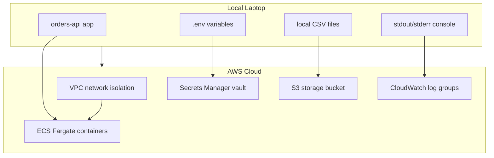

## Table of Contents

1. [The Local Laptop Baseline](#the-local-laptop-baseline)
2. [Sharing Your App: The Laptop Lid Limits](#sharing-your-app-the-laptop-lid-limits)
3. [The Cloud as Professional Computers](#the-cloud-as-professional-computers)
4. [Translating Your Laptop Setup to the Cloud](#translating-your-laptop-setup-to-the-cloud)
5. [Isolated Network Rooms](#isolated-network-rooms)
6. [Identity and the Default-Deny Access Gate](#identity-and-the-default-deny-access-gate)
7. [Durable Log Streams Outside the Container](#durable-log-streams-outside-the-container)
8. [Putting It All Together](#putting-it-all-together)

## The Local Laptop Baseline

When you build a software application on your local laptop, you are operating within a complete, self-contained world. The machine sits physically in front of you, and its local operating system handles all the operational details automatically. You open a terminal window, type a start command, and watch logs scroll by in real time. If your code needs a database, you spin up a service on localhost, and the database writes records directly to a file on your local hard drive. When you need to configure private API keys, you declare them inside a plain text environment file, knowing that only your machine can read that file.

This local environment is highly intuitive because everything shares the same physical host, memory namespace, and network adapter. You are the absolute administrator of this machine. If your application wants to write a file, open a network port, or read system metrics, it simply issues system calls to your local kernel, which executes the request without hesitation.

The challenge arises when you decide to move this working application out of your private local environment and into Amazon Web Services. Suddenly, the direct, single-machine model disappears. You are no longer logging into a physical box that you can touch, and you cannot run your startup commands in an active terminal scrollback. The cloud changes the physical nature of computing, and before you can choose services or write configuration files, you must understand the new relationship between your code and the underlying infrastructure.

## Sharing Your App: The Laptop Lid Limits

The moment you decide to share your local application with friends, customers, or colleagues, your personal laptop immediately fails as a hosting environment. The physical design of a laptop is optimized for individual, intermittent use, not for constant public service:

* If you close the laptop lid to pack up for the day, the hardware goes to sleep, and your website immediately disappears for every user.
* If your home router changes its physical IP address, the public DNS routes break, and users can no longer find your server.
* If a domestic power outage occurs or your local Wi-Fi drops, your application path is severed instantly.
* If a sudden surge of users visits your website, your laptop's cooling fans spin up, its processor throttles, and your local network bandwidth is completely overwhelmed.

To share a website reliably, you need a different hosting model. You need a computer that stays powered on twenty-four hours a day, possesses a stable public address that never changes, resides inside a professional network with redundant high-speed internet cables, and features dedicated power generators and cooling systems. This is the physical reality that drives us to move our code off the laptop and into the cloud.

## The Cloud as Professional Computers

The cloud is not a gaseous, abstract space. It is a physical network of massive, highly secure buildings filled with professional computer racks owned and operated by AWS. When you deploy an application to AWS, your code is placed onto a real CPU chip and stored on real physical hard drives inside one of these global data centers.

The primary difference is that you do not physically purchase, wire, or maintain these machines. AWS wraps their physical hardware in automation software and exposes it as programmatic interfaces. Instead of ordering a server from a manufacturer and waiting weeks for it to arrive, you send a signed HTTP command to the AWS control-plane API, which instantly allocates virtualized processor and memory slices on a physical server inside their network.

This virtualization changes how you view compute. You are renting execution capacity on demand. If your application needs more power to handle a surge of customers, you do not need to physically install new RAM chips; you simply send an API command to scale your compute capacity in seconds. This compute job is handled by the AWS compute family, such as virtual EC2 servers, serverless Fargate container tasks, or event-driven Lambda functions. The physical location of the machine changes, but the core job remains the same: executing your application code.

## Translating Your Laptop Setup to the Cloud

To make sense of the vast AWS console catalog, translate your familiar local laptop setup directly to its cloud-native counterparts. Every cloud resource is simply a specialized version of a job your laptop performed locally:

* **Compute Execution**: Your local application process running on your laptop's CPU maps to ECS Fargate compute tasks in the cloud.
* **Secrets Management**: Your plaintext `.env` file stored on local disk maps to encrypted Secrets Manager vaults in the cloud, which inject connection keys securely into your running container's memory.
* **Object Storage**: Your local files and exports written to your hard drive map to durable S3 object buckets in the cloud, ensuring files survive container restarts.
* **Durable Database**: Your local database running on `localhost` maps to transactional RDS relational databases in the cloud.
* **Observability Logs**: Your local terminal stdout scrollback maps to persistent CloudWatch log groups in the cloud, keeping your logs readable after the process exits.

The flowchart traces the transition from a single local laptop host to a coordinated cloud topology, showing how each local component maps to a dedicated, secure cloud resource inside our VPC network boundary.

## Isolated Network Rooms

When your application runs on your laptop, it binds to `localhost` or a local IP address block. It is naturally protected from external internet threats because it sits behind your local router and private network. Unless you explicitly configure port forwarding, automated hackers on the public internet cannot connect to your local database.

In the cloud, this private boundary must be designed and created deliberately. When you launch a compute container on an AWS physical host, it sits on a vast network shared by millions of other virtual servers. To prevent unauthorized access, the very first step is to draw a digital boundary around your resources. The service that draws this boundary is the Virtual Private Cloud, commonly called a VPC.

A VPC is a private, logically isolated network partition that you define inside an AWS Region. Inside this private boundary, you create subnets, gateways, and route tables. The core private network habit is to place all application compute containers, relational databases, and background workers inside private VPC subnets that have no direct routing paths to the public internet. You then place public entry points, like load balancers, in narrow public subnets that act as highly controlled front doors, ensuring your core systems are never directly exposed to raw public traffic.

## Identity and the Default-Deny Access Gate

On your laptop, your local user account has administrator sudo privileges. Your application can write to S3, call external APIs, or read system directories because the operating system trusts your active local session.

In the cloud, this all-powerful default posture is a massive security vulnerability. If a container had unrestricted access to your entire AWS account, a single code vulnerability could allow an attacker to delete your databases or access other client data. To prevent this, AWS operates on a default-deny foundation governed by Identity and Access Management, commonly called IAM.

Unless an action is explicitly allowed by a security policy, AWS blocks it. Every single request inside the cloud is an API call that must pass through the IAM permission gate. When your container attempts to write a file to an S3 bucket or read a database URL, AWS validates the task's identity first. It asks: Who is making the request, what specific action are they attempting, and what target resource is involved? Instead of hardcoding static password keys into your codebase, you assign a low-privilege IAM task role to your container, which dynamically assumes temporary, short-lived API credentials at runtime.

Sensitive API credentials, like database connection strings, are vaulted inside AWS Secrets Manager. Secrets Manager encrypts the values at rest and decrypts them only when authorized by an IAM request, allowing your containers to securely pull database credentials at boot time without exposing them to developers or Git repositories.

## Durable Log Streams Outside the Container

When you test an application locally, troubleshooting is simple because the process runs directly in your active shell session. If an error occurs, you watch the traceback scroll by on your screen, or you open the terminal logs to inspect the failure.

In the cloud, you do not have a terminal window to watch. Runtimes are headless and automated. If a container encounters a database connection error and crashes, the physical instance hosting the container is immediately destroyed by the scheduler, taking the terminal scrollback history with it.

To diagnose failures, you must route all operational evidence to a persistent location that exists outside the compute runtime. CloudWatch Logs acts as this permanent vault, capturing the application's stdout and stderr streams and preserving them even after the container ceases to exist. CloudWatch Metrics tracks numeric trends, like database connection limits and memory leaks, while CloudTrail records every management API call in the account. Observability is the continuous practice of collecting these signals to verify that your system is performing as intended, turning mysterious cloud behavior into visible, debuggable evidence.

## Putting It All Together

The transition from a local laptop to AWS is a shift in scaling, durability, and boundary design, not a change in the core mechanics of computing.

When you run an app locally, all components are concentrated on a single physical machine. In the cloud, we spread these responsibilities across specialized, cooperative services to achieve scale and security. The local laptop baseline maps cleanly to its cloud-native counterparts:

* The compute execution job moves from local CPU processors to ECS Fargate container tasks.
* The private IP namespace moves from localhost to a private, logically isolated VPC network boundary.
* Unstructured file storage moves from ephemeral local disks to durable S3 object buckets.
* Structured ledgers move from local database engines to transactional, Multi-AZ RDS database instances.
* Sensitive configuration credentials move from plaintext env files to encrypted Secrets Manager vaults.
* Permission gates move from sudo user access to default-deny IAM roles and policies.
* Diagnostic scrollback moves from the active terminal to persistent CloudWatch log groups.

By mapping local concepts to their cloud-native equivalents and structuring them as a continuous, cooperative narrative, we demystify the cloud console and build our systems with architectural intent.

---

**References**

- [Amazon ECS on AWS Fargate](https://docs.aws.amazon.com/AmazonECS/latest/developerguide/AWS_Fargate.html) - Technical guide on serverless container compute runtimes.
- [What is Amazon VPC](https://docs.aws.amazon.com/vpc/latest/userguide/what-is-amazon-vpc.html) - Documentation on virtual private networks, subnets, and routing boundaries.
- [AWS IAM Overview](https://docs.aws.amazon.com/IAM/latest/UserGuide/introduction.html) - Introduction to default-deny access gates and identity-based security policies.
- [Amazon CloudWatch Logs Overview](https://docs.aws.amazon.com/AmazonCloudWatch/latest/logs/WhatIsCloudWatchLogs.html) - Guide on routing stdout streams to persistent diagnostic groups.
