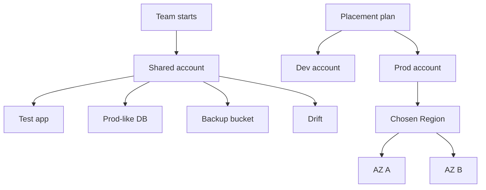
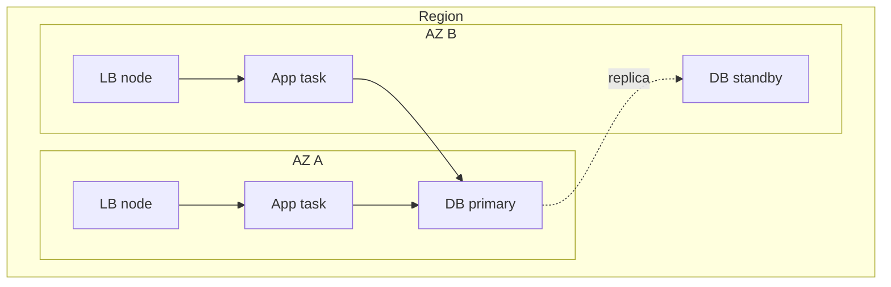

## Table of Contents

1. [The Problem](#the-problem)
2. [Accounts](#accounts)
3. [Separate Accounts](#separate-accounts)
4. [Regions](#regions)
5. [Availability Zones](#availability-zones)
6. [Resource Scope](#resource-scope)
7. [Placement Review](#placement-review)
8. [Putting It All Together](#putting-it-all-together)
9. [What's Next](#whats-next)

## The Problem

A team wants to learn AWS by moving a small orders API out of local development. Someone opens the console, uses the shared engineering account, and creates production-like resources because the test needs to feel real. The app runs. The database has data. A backup export lands in S3. Nobody stops to write down where the workload actually lives.

Weeks later, the quick test has become awkward infrastructure:

- The app runs in the shared account where experiments, demos, and production-like resources sit beside each other.
- The database was created in one Region, while the app work moved to another Region during a later deployment.
- The backup bucket uses a different Region because that was the console setting on the day it was created.
- Both app copies run in one Availability Zone, so one local failure can remove the whole running layer.

The immediate problem is not that the team used the wrong AWS service. The problem is that they skipped the placement question:

> Where should this workload live, and what boundary am I creating?

This article follows the app from "just create a resource" into three placement decisions. First, the account decides the ownership, security, billing, and quota boundary. Then the Region decides the geographic and service endpoint home. Then Availability Zones decide whether one local infrastructure failure can take out every copy of the workload.

The habit is simple: before creating a resource, name the account, Region, and zone shape you intend. If those answers are accidental, the workload is already drifting.

## Accounts

An AWS account is the first hard boundary around a workload. It is the container where AWS resources are created and owned. It has its own account ID, identities, permissions, billing boundary, service quotas, and default isolation from other accounts.

That boundary changes how you read every resource. If the orders database is in account `333333333333`, then looking from account `222222222222` does not prove the database is missing. It proves you are standing outside the boundary that owns it. If a staging administrator can change production-like resources because both environments live in one shared account, the account boundary is not helping you.

AWS makes this separation visible in identity checks. Before investigating or creating anything, confirm which account receives the request:

```bash
$ aws sts get-caller-identity
{
  "Account": "333333333333",
  "Arn": "arn:aws:sts::333333333333:assumed-role/orders-prod-deployer/maya"
}
```

The `Account` field tells you which resource boundary you are operating inside. The `Arn` tells you which role session AWS sees. A deployer role in the production account is a different posture from an administrator role in a shared sandbox account, even if the same person is at the keyboard.

The non-obvious truth is that account placement is a design decision, not an administrative detail. The account decides who can be granted access by default, where costs are naturally separated, which quotas the workload consumes, and how far many mistakes can spread. A bad security group rule in a sandbox account is still bad, but it is less dangerous when production data and production operators are not in the same boundary.



The diagram is not a full landing zone. It is the first correction. The workload needs a real home before it needs a sophisticated organization structure.

## Separate Accounts

You do not need a new account for every tiny resource. You need a separate account when the boundary itself should be different.

Production and non-production usually deserve separate accounts because the cost of confusion is high. A developer should be able to break a development database without also owning the production database. A staging load test should not consume the same account-level quota that production depends on. A broad permission needed for an experiment should not automatically become broad permission near customer data.

Different workloads may also deserve separate accounts when they have different owners, data sensitivity, compliance needs, release rhythms, or cost reporting needs. The point is to avoid pretending that tags, naming, and good intentions are the same as a security and billing boundary.

| Boundary Question | Usually Same Account | Usually Separate Account |
| --- | --- | --- |
| Same environment? | App resources that move together inside production | Production and development |
| Same data sensitivity? | Services handling the same class of data | Public demo data and regulated customer data |
| Same operators? | One team owns the full workload | Two teams need different administration paths |
| Same quota and cost risk? | Small related components with shared budget | Load tests, sandboxes, or unrelated workloads |

For the orders API, a beginner-friendly account split might be `orders-dev` and `orders-prod`. That is enough to make the main idea real. The development account can hold experiments and throwaway resources. The production account can hold the app, database, backups, logs, and roles that operate the customer-facing workload.

AWS Organizations and Control Tower can help manage many accounts, but those tools are not the mental model. The mental model is simpler: an account is the first place you say, "these resources belong together, and mistakes here should not automatically cross into that other place."

## Regions

After account, choose the Region. A Region is a separate geographic area such as `us-east-1`, `eu-west-2`, or `ap-southeast-2`. Most AWS services support Regional resources. When you create a Regional resource, it belongs to the Region where you created it. Looking in another Region can make the console appear empty even when the resource is healthy somewhere else.

That is why the Region selector affects the architecture. If the app runs in `us-east-1`, the database lives in `us-west-2`, and the backup bucket is in `eu-west-1`, the workload has a messy placement story. It may still function, but every recovery plan, data movement path, access review, and cost discussion starts with extra questions.

Choose a Region by asking what the workload needs to be near:

| Region Choice | What It Answers | Example Pressure |
| --- | --- | --- |
| User latency | Where should requests feel close? | Most customers are in Europe, so `eu-west-2` or `eu-west-1` may be a better home than `us-east-1`. |
| Data requirements | Where is the data allowed or expected to live? | Customer records may need a specific country or regional posture. |
| Dependency location | Where are nearby systems already running? | The app should not call a database across Regions without a deliberate reason. |
| Service availability | Does the service exist there? | Newer or specialized services can vary by Region. |
| Recovery design | Is this single-Region or multi-Region? | A standby copy in another Region is a design, not an accident. |

Regional isolation is a feature. It lets you build independent copies of resources in different places. It also means AWS does not automatically make every resource appear everywhere. Some services provide replication features, but replication is something you configure and operate, not something you assume.

S3 is a good example of why beginner shortcuts can mislead. A general purpose S3 bucket name is globally unique within a partition by default, so the name can feel global. But when you create the bucket, you still choose an AWS Region, and objects in that bucket stay in that Region unless you explicitly transfer or replicate them. A globally unique name is not the same as globally placed data.

The practical habit is to record one primary Region for the workload. If a resource belongs outside that Region, write down why. Sometimes the reason is valid: lower latency for another user group, disaster recovery, compliance, or a service-specific pattern. Without a reason, a cross-Region split is usually just drift.

## Availability Zones

Inside a Region are Availability Zones, usually shortened to AZs. An Availability Zone is an isolated location within a Region. AWS connects AZs in a Region with low-latency, high-bandwidth, redundant networking, but the AZs are physically separate enough that one local failure should not automatically affect every AZ.

AZs answer a different question from Regions. A Region asks, "Which geographic home should this workload use?" An AZ asks, "If one local location has a problem, does every running copy disappear?"

Many resources have an AZ shape even when the service name does not make it obvious. A VPC spans the Availability Zones in its Region, but a subnet lives entirely inside one AZ. When you place EC2 instances, containers, load balancer nodes, or databases into subnets, the subnet choice often decides the AZ placement.

For the orders API, the difference between one-zone and multi-zone placement looks like this:



The exact database shape depends on the service and configuration. The important placement idea is broader: do not put every running copy in one AZ and then call the workload resilient. Multi-AZ resilience needs enough healthy application copies, routing that can use them, and data services configured for the failure you care about.

There are two common AZ gotchas.

First, a subnet cannot span AZs. If you want an app to run in two AZs, you need subnets in two AZs and the service configuration has to use them. "The VPC is multi-AZ" is not enough. The actual workload must be placed across the zones.

Second, AZ names can be tricky across accounts. In older accounts in several older Regions, `us-east-1a` in one account might not be the same physical location as `us-east-1a` in another account. AWS provides AZ IDs, such as `use1-az1`, as consistent cross-account identifiers. Most beginners will not need AZ IDs on day one, but they explain why serious cross-account network designs should not rely only on the letter at the end of the AZ name.

## Resource Scope

AWS resources can be global, Regional, or zonal. This scope tells you where to search, what can fail independently, and which placement choice matters.

| Scope | Examples | What It Means | Common Mistake |
| --- | --- | --- | --- |
| Global or account-scoped | IAM roles, AWS Organizations, Route 53, CloudFront | The resource is not owned by one normal workload Region, even though it may interact with Regional resources. | Searching only the current Region for an IAM role or DNS zone. |
| Regional | VPCs, load balancers, RDS databases, CloudWatch log groups, S3 buckets | The resource belongs to one Region unless you explicitly create or replicate another copy. | Creating the app in one Region and the data or evidence in another by accident. |
| Zonal | Subnets, EC2 instances, many attached storage and network placements | The resource is tied to one Availability Zone. | Running every copy in one AZ and expecting Regional resilience. |

This table is a reading tool, not a complete service inventory. Some services have both global and Regional pieces. Some Regional services create zonal capacity underneath. Some services hide most of the zone work for you. The useful habit is to ask the scope before you debug or deploy.

The Amazon Resource Name, or ARN, often helps. For many Regional resources, the ARN includes a Region field. For global resources, that field can be blank. The next article will spend more time on ARNs. For now, treat the Region field as one more clue about where the resource lives.

Resource scope also changes how a failure feels. A wrong IAM permission can affect callers across Regions because the identity boundary is account-wide. A regional service problem or disabled opt-in Region can affect resources in that Region. A single-AZ placement problem can affect only the resources concentrated in that AZ, unless the whole application depended on them.

## Placement Review

The safest beginner workflow is a short placement review before the resource exists. It can be a design note, a pull request checklist, or a conversation in the deployment plan. The format matters less than the habit.

For the orders API, the review might look like this:

| Question | Decision | Why |
| --- | --- | --- |
| Which account owns production? | `orders-prod` | Production data, access, costs, and quotas need a hard boundary from experiments. |
| Which account owns experiments? | `orders-dev` | Developers need freedom to test without touching production. |
| Which primary Region? | `eu-west-2` | The first users and data requirements are UK-focused. |
| Which AZ shape? | Two AZs for app and entry path | One AZ should not remove every running copy. |
| Which resources are intentionally outside that Region? | None at launch | Cross-Region recovery can be added deliberately later. |
| Which global resources are involved? | IAM roles and DNS | They support the workload but do not make the app itself global. |

This is where the opening story changes. The team no longer creates the database wherever the console happened to be pointed. They choose the production account. They choose the workload Region. They choose subnets in at least two AZs for the running layer. They decide whether the backup bucket belongs in the same Region at launch or whether cross-Region replication is part of a real recovery design.

There is still plenty left to design. Accounts do not replace least privilege. Regions do not replace backups. Availability Zones do not replace a working application health model. But placement gives every later design a stable coordinate system.

## Putting It All Together

The first AWS placement habit is to slow down before "Create resource."

Start with the account. It is the resource container, security boundary, billing boundary, and quota boundary. Production-like resources do not belong in a shared sandbox just because the experiment became useful. If production and non-production need different risk, access, cost, or quota behavior, give them separate accounts.

Then choose the Region. Most resources live in a specific Region, and resources in one Region do not automatically appear in another. Pick the Region for users, data requirements, service availability, dependencies, and recovery intent. If something belongs in another Region, make that reason explicit.

Then choose the Availability Zone shape. AZs protect against local infrastructure failures only when the workload actually uses more than one zone. A VPC can span the Region, but subnets are zonal. App copies, load balancer nodes, and data services need real multi-AZ placement to benefit from the design.

The opening team had production-like resources in the wrong boundary and awkward locations because nothing forced the placement question early. The better version is not complicated:

- Development experiments live in a development account.
- Production resources live in a production account.
- The app, database, logs, and first backup path have a clear primary Region.
- The running layer spans more than one Availability Zone.
- Any global, Regional, or zonal exception is named instead of discovered during an incident.

That is the practical answer to the primary question: the workload should live where its ownership, geography, and resilience choices are intentional.

## What's Next

After you know where a workload lives, you need to identify the pieces precisely. A name that looks clear to a human may not be unique. A resource may need an ARN for a policy. A cost review may depend on tags that show owner, environment, and workload.

The next article is **Resources, ARNs, and Tags**. It takes the placement map from this article and answers the next question: how do I point to the exact AWS thing I mean, and how do I keep the inventory understandable as the workload grows?

---

**References**

- [What is an AWS account?](https://docs.aws.amazon.com/accounts/latest/reference/accounts-welcome.html). Supports the explanation that an AWS account is a resource container, security boundary, identity and access boundary, and billing boundary.
- [Benefits of using multiple AWS accounts](https://docs.aws.amazon.com/accounts/latest/reference/welcome-multiple-accounts.html). Supports the account-separation guidance for security control, isolation, teams, billing, and quota allocation.
- [AWS Regions and Availability Zones](https://docs.aws.amazon.com/global-infrastructure/latest/regions/aws-regions-availability-zones.html). Supports the Region and Availability Zone mental model, including Region isolation, Regional resources, low-latency AZ networking, and multi-AZ placement guidance.
- [Enable or disable AWS Regions in your account](https://docs.aws.amazon.com/accounts/latest/reference/manage-acct-regions.html). Supports the notes about opt-in Regions, Region independence, IAM availability in enabled Regions, and choosing Regions for latency or requirements.
- [Subnets for your VPC](https://docs.aws.amazon.com/vpc/latest/userguide/configure-subnets.html). Supports the statement that subnets reside in one Availability Zone and that public, private, and isolated subnet behavior is route-driven.
- [AWS service endpoints](https://docs.aws.amazon.com/general/latest/gr/rande.html). Supports the distinction between Regional endpoints, independent resources in Regions, and services with global endpoints such as IAM, Organizations, Route 53, and CloudFront.
- [Sharing Regional resources compared to global resources](https://docs.aws.amazon.com/ram/latest/userguide/working-with-regional-vs-global.html). Supports the global-versus-Regional resource scope explanation and the use of the ARN Region field as a clue.
- [AZ IDs](https://docs.aws.amazon.com/global-infrastructure/latest/regions/az-ids.html). Supports the cross-account Availability Zone name caveat and the use of AZ IDs as consistent identifiers.
- [General purpose buckets overview](https://docs.aws.amazon.com/AmazonS3/latest/userguide/UsingBucket.html). Supports the S3 note that buckets are created in a Region, bucket names are globally unique within a partition by default, and objects stay in their Region unless explicitly transferred.
