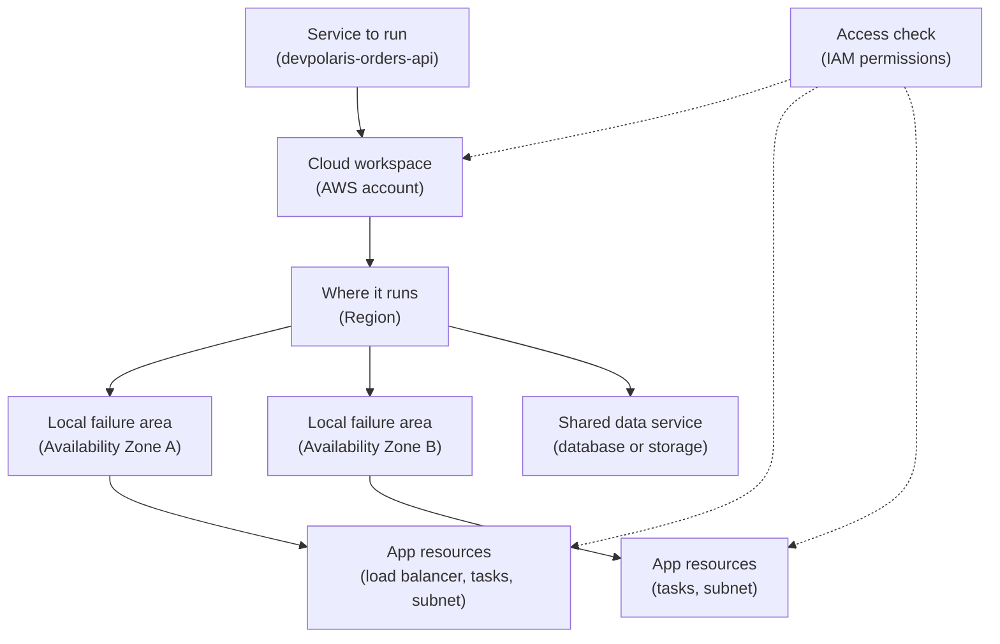
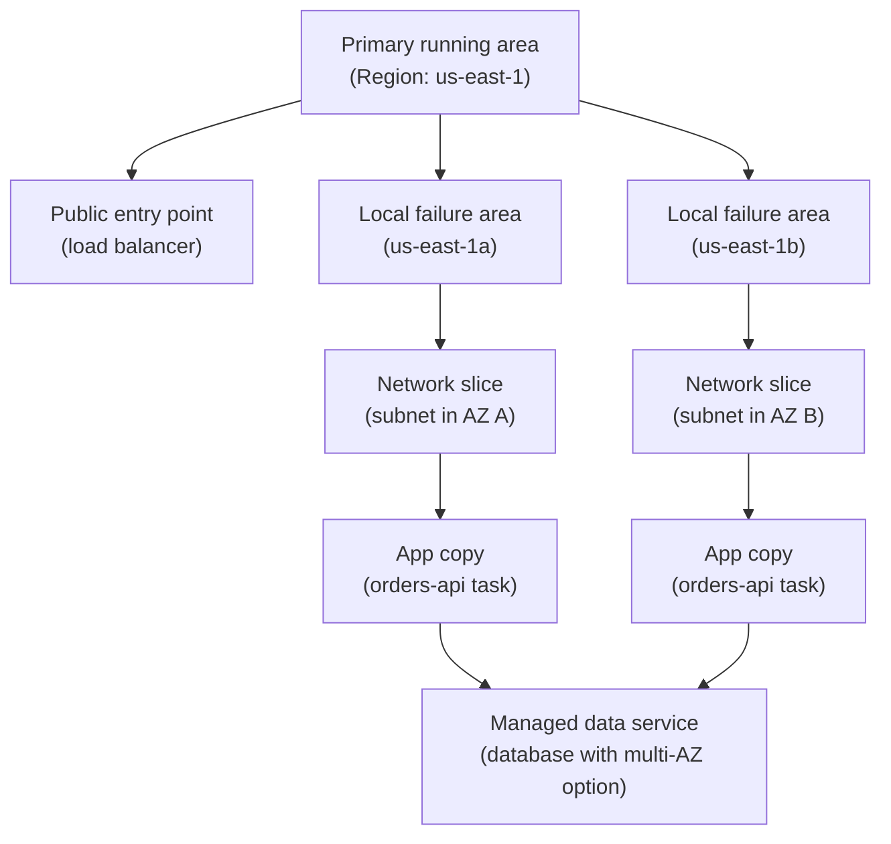

## Table of Contents

1. [The Three Questions Before You Deploy](#the-three-questions-before-you-deploy)
2. [Accounts: The Workspace Boundary](#accounts-the-workspace-boundary)
3. [Account IDs And Environment Checks](#account-ids-and-environment-checks)
4. [Regions: The Place Your Service Runs](#regions-the-place-your-service-runs)
5. [Availability Zones: Nearby Failure Boundaries](#availability-zones-nearby-failure-boundaries)
6. [Regional, Zonal, And Global Resource Thinking](#regional-zonal-and-global-resource-thinking)
7. [Wrong Account And Wrong Region Failures](#wrong-account-and-wrong-region-failures)
8. [Choosing A First Region And AZ Posture](#choosing-a-first-region-and-az-posture)

## The Three Questions Before You Deploy

Before you deploy anything to AWS, the confusing part is often not the service name.
It is knowing which boundary you are inside.
You open the Console, see a long list of services, choose one, and suddenly a small selector in the top-right corner says `us-east-1`.
Another page shows a 12-digit number.
A database screen asks for Availability Zones.
None of those words feel like code, but they decide where your work lives and what kind of mistake it can survive.

For this article, keep one small backend in your mind: `devpolaris-orders-api`.
It is a simple API that accepts checkout requests, writes order records, and exposes a `/health` endpoint.
The team is not ready for a global platform.
They only need a safe first AWS home for development, staging, and production.

The first boundary is the workspace where cloud resources belong.
AWS calls that an **AWS account**.
An account is not only a login.
It is the container for resources, access rules, and billing.
If `devpolaris-orders-api` has a staging account and a production account, those accounts are separate workspaces.
A bad experiment in staging should not be able to delete production.

The second boundary is the real-world area where resources run.
AWS calls that an **AWS Region**.
A Region is a geographic AWS area such as `us-east-1`, `us-west-2`, or `eu-west-1`.
If the API runs in `us-east-1`, the database, logs, and load balancer usually need to be there too.
If you look in a different Region, the resources may look missing even though they still exist.

The third boundary is a smaller failure area inside a Region.
AWS calls that an **Availability Zone (AZ)**.
An AZ is an isolated location inside one Region.
AWS documents each Region as having at least three AZs.
If one AZ has a problem, a service spread across more than one AZ has a better chance of staying online.

That gives you three beginner questions:

| Question | Plain Meaning | AWS Term |
|----------|---------------|----------|
| Where does this cloud work belong? | Separate workspace | AWS account |
| Where in the world does it run? | Geographic area | Region |
| What local failure can it survive? | Isolated location inside a Region | Availability Zone |

This order matters.
You do not first ask "which database engine should I use?"
You ask "which account am I changing, which Region am I looking at, and how many AZs does this service need?"
Those questions stop simple mistakes before they become production incidents.

Here is the mental model we will use through the article:



Read the main line from top to bottom.
The app belongs to an account.
Inside that account, it runs in a Region.
Inside that Region, some resources sit in one AZ and some sit in another.
The dotted lines are different.
IAM (Identity and Access Management, AWS's permission system) is not a place where the app runs.
It is the access check AWS performs when a person, script, or service tries to touch something.

This article will keep returning to one operating habit:

> Before you create, delete, debug, or deploy, say the account and Region out loud.

That sounds almost too simple.
It is not.
Many beginner AWS failures are just "right command, wrong boundary."

## Accounts: The Workspace Boundary

An AWS account is the first line around your work.
It owns resources.
It collects costs.
It has users, roles, and permissions.
It has a root user, which is the original highest-access identity for that account.
In normal daily work, you avoid using the root user and use safer identities instead, but the important point here is that the account is the top-level workspace.

Think of an account like a separate project folder, but for cloud infrastructure.
Inside one folder, the team creates a load balancer, a database, logs, secrets, and permissions.
Inside another folder, the team can create similar resources with similar names.
The folders look alike because the environments are alike, but they are still separate folders.

For `devpolaris-orders-api`, a small team might start with three accounts:

| Account Name | Environment | What It Is For | What A Mistake Should Affect |
|--------------|-------------|----------------|------------------------------|
| `devpolaris-dev` | Development | Learning, experiments, early integration | Test data only |
| `devpolaris-staging` | Staging | Release checks before production | Release confidence |
| `devpolaris-prod` | Production | Real checkout traffic | Customers and money |

An environment is a copy of the system used for a different purpose.
Development is where the team experiments.
Staging is where the team checks whether the next release behaves like production.
Production is where real users send real requests.

You can run multiple environments inside one AWS account by using names, tags, and careful permissions.
Small personal projects often start that way.
A team service usually grows out of that quickly.
Separate accounts make the boundary harder to cross by accident.
That is the safety you are buying with the extra setup.

The benefit is clear when someone runs a dangerous command.
Imagine a cleanup script that deletes old test databases.
If the script has credentials for the development account, the blast radius is development.
Blast radius means the area that can be damaged by one mistake.
If the same script accidentally has production credentials, it can damage production.

The account boundary does not remove the need for permissions.
It gives permissions a smaller world to operate inside.
A developer can have broad access in `devpolaris-dev`, limited access in `devpolaris-staging`, and read-only access in `devpolaris-prod`.
That shape lets people learn and debug without making production feel like a trap.

Here is a small account map for the orders API:

```text
DevPolaris AWS setup

Account: devpolaris-dev
  Purpose: experiment safely
  Example resources:
    orders-api-dev-load-balancer
    orders-api-dev-db
    orders-api-dev-logs

Account: devpolaris-staging
  Purpose: test releases before production
  Example resources:
    orders-api-staging-load-balancer
    orders-api-staging-db
    orders-api-staging-logs

Account: devpolaris-prod
  Purpose: serve real users
  Example resources:
    orders-api-prod-load-balancer
    orders-api-prod-db
    orders-api-prod-logs
```

Notice that the resource names are similar.
That is normal.
The account boundary is what makes "prod database" different from "staging database" even when the service shape is almost identical.

This is why senior engineers often ask a boring question before helping with AWS:
"Which account are you in?"
They are not slowing you down.
They are checking the biggest boundary first.

## Account IDs And Environment Checks

Every AWS account has a 12-digit account ID.
It looks like `123456789012`.
That number uniquely identifies the account.
It is not a password, but you should still treat it carefully because it identifies a real workspace.

You will see account IDs in ARNs.
An ARN (Amazon Resource Name) is AWS's full resource identifier, similar to a full path for a cloud object.
For example, this IAM role ARN includes the account ID in the middle:

```text
arn:aws:iam::123456789012:role/orders-api-deploy
```

The useful beginner habit is to check the account before running a command that changes infrastructure.
The AWS CLI (AWS Command Line Interface, the terminal tool for calling AWS APIs) can ask AWS who your current credentials belong to.
The command uses STS (AWS Security Token Service, the service that can answer questions about the caller identity).

```bash
$ aws sts get-caller-identity
{
    "UserId": "AROAXAMPLEID:maya",
    "Account": "123456789012",
    "Arn": "arn:aws:sts::123456789012:assumed-role/orders-api-admin/maya"
}
```

This output is not just trivia.
It tells Maya that her terminal is currently acting in account `123456789012`.
If that number belongs to `devpolaris-prod`, she should pause before creating, deleting, or changing anything.

A team can make this easier by keeping a tiny account register.
It does not need to be fancy.
It only needs to remove guessing.

| Environment | Account Alias | Account ID | Normal Human Access |
|-------------|---------------|------------|---------------------|
| Development | `devpolaris-dev` | `111111111111` | Developers can create test resources |
| Staging | `devpolaris-staging` | `222222222222` | Developers can deploy and debug |
| Production | `devpolaris-prod` | `333333333333` | Developers read, deploy role changes |

An account alias is a human-friendly name for sign-in.
It is easier to recognize `devpolaris-prod` than `333333333333`.
The ID is still the stable identifier you should check in logs, ARNs, policies, and CLI output.

Many teams use named CLI profiles.
A profile is a saved AWS CLI configuration with its own credentials and default Region.
The profile name is not security by itself.
It is a label that helps a human choose the right credentials.

```bash
$ aws configure list --profile devpolaris-staging
      Name                    Value             Type    Location
      ----                    -----             ----    --------
   profile      devpolaris-staging           manual    --profile
access_key     ****************ABCD shared-credentials-file
secret_key     ****************WXYZ shared-credentials-file
    region                us-east-1      config-file    ~/.aws/config
```

The line to notice is `region`.
The profile carries both identity and location.
That is helpful, but it can also hide mistakes.
A profile named `devpolaris-staging` can still be misconfigured to point at the production role or the wrong Region.
The profile name is a hint, not proof.

A safer pre-deploy check prints the account, role, and Region together:

```bash
$ aws sts get-caller-identity --profile devpolaris-staging --output text
AROAXAMPLEID:maya  222222222222  arn:aws:sts::222222222222:assumed-role/orders-api-deploy/maya

$ aws configure get region --profile devpolaris-staging
us-east-1
```

For `devpolaris-orders-api`, that check means:
"I am using the staging deploy role in the staging account, and my default Region is `us-east-1`."
Now the deployment script has a much better chance of touching the intended boundary.

The account ID also helps when reading error messages.
If an error mentions an ARN with `333333333333`, and you expected staging account `222222222222`, the issue is not the load balancer.
The issue is that the request crossed into the wrong account.

## Regions: The Place Your Service Runs

After you know the account, ask where the service should run.
A Region is a separate geographic AWS area.
It is not just a label in the Console.
It decides where many resources are created, where data may live, and how far users travel over the network to reach your service.

For `devpolaris-orders-api`, suppose most early users are on the eastern side of the United States.
A reasonable first Region is `us-east-1`, which is US East (N. Virginia).
The team might also choose `us-east-2`, US East (Ohio), if service availability, latency, pricing, and company requirements fit better.
The important beginner lesson is not that one of those is always correct.
The lesson is that you choose one first home on purpose.

Region choice usually balances four questions:

| Question | Why It Matters | Beginner Check |
|----------|----------------|----------------|
| Are users close to it? | Shorter distance usually means lower latency | Where are most requests coming from? |
| Are needed services available there? | Not every feature exists in every Region | Does the service page support this Region? |
| Are there data rules? | Some teams must keep data in certain countries or areas | Where is customer data allowed to live? |
| Is the team comfortable operating there? | People debug faster in known places | Do dashboards, runbooks, and defaults use this Region? |

Latency means delay.
If a user in New York sends a checkout request to a service in Oregon, the request crosses a much longer path than a request to Virginia or Ohio.
That extra distance can make the app feel slower.
It also makes debugging harder because more network path sits between the user and the service.

Data rules matter too.
Some companies promise customers that data stays in a particular geographic area.
Some teams have legal or compliance requirements.
Compliance means rules the business must follow, often because of law, contracts, or audits.
You do not need to become a lawyer to understand the engineering habit:
choose a Region that matches the data promise before you create the database.

Most AWS resources are regional.
That means you create and view them inside one Region.
If you create a load balancer in `us-east-1`, then switch the Console to `us-west-2`, you should not expect to see that same load balancer.
It did not disappear.
You changed maps.

Here is the same service viewed through two Region selectors:

```text
AWS Console view

Account: devpolaris-staging (222222222222)

Selected Region: us-east-1
  Load balancers:
    orders-api-staging-alb
  Databases:
    orders-api-staging-db
  Log groups:
    /aws/ecs/orders-api-staging

Selected Region: us-west-2
  Load balancers:
    none
  Databases:
    none
  Log groups:
    none
```

For a beginner, that empty `us-west-2` view can be scary.
It looks like the service was deleted.
The first diagnostic question is simple:
"Am I in the same Region where the service was created?"

You can make the CLI answer that question.
This command lists enabled Regions for the account, then the team checks the one used by the app:

```bash
$ aws account list-regions \
>   --region-opt-status-contains ENABLED_BY_DEFAULT ENABLED \
>   --query 'Regions[?RegionName==`us-east-1`]'
[
    {
        "RegionName": "us-east-1",
        "RegionOptStatus": "ENABLED_BY_DEFAULT"
    }
]
```

Some newer Regions require opt-in before an account can use them.
Opt-in means the account owner must enable the Region first.
If a deployment tries to use a Region that is disabled for the account, the fix is not to rename the service.
The fix is to enable the Region intentionally or choose a Region that is already enabled.

The simple starting rule is this:
pick one primary Region for each environment, write it down, and make your CLI profiles, infrastructure variables, dashboards, and runbooks agree with it.

## Availability Zones: Nearby Failure Boundaries

Once the Region is chosen, the next question is how to survive a local failure inside that Region.
That is where Availability Zones come in.
An Availability Zone is an isolated location inside a Region.
Each AZ has one or more data centers with separate facilities, power, networking, and connectivity.
AZs in the same Region are connected with low-latency networking, which means they are close enough for many application architectures to use together.

The plain-English picture is this:
a Region is the city area, and Availability Zones are separate buildings or campuses inside that area.
They are close enough to work together.
They are separated so one building problem should not automatically take down the whole city area.
Do not push the analogy too far, but it is useful for the first mental model.

For a small backend, AZ thinking usually shows up through subnets and load balancers.
A subnet is a smaller network slice inside a VPC.
A VPC (Virtual Private Cloud) is your private network area in AWS.
In AWS, a subnet lives in one Availability Zone.
If you want app tasks in two AZs, you usually need at least one subnet in each of those AZs.

Here is a beginner-friendly two-AZ shape for `devpolaris-orders-api`:



The load balancer is regional in the way the team uses it.
It can send traffic to app copies in more than one AZ.
If one app copy or one AZ has trouble, the other side can still receive traffic if the service was designed that way.

The key phrase is "if the service was designed that way."
Putting the words "multi-AZ" in a diagram does not create resilience by magic.
Resilience means the service can keep doing its job when one part fails.
For the orders API, that means more than one app copy, health checks, a database posture that matches the risk, and deployment code that does not update every copy at the same time.

You can ask AWS which AZs are available to your account in a Region:

```bash
$ aws ec2 describe-availability-zones \
>   --filters Name=zone-type,Values=availability-zone \
>   --region us-east-1 \
>   --query 'AvailabilityZones[].{Name:ZoneName,Id:ZoneId,State:State}'
[
    {
        "Name": "us-east-1a",
        "Id": "use1-az1",
        "State": "available"
    },
    {
        "Name": "us-east-1b",
        "Id": "use1-az2",
        "State": "available"
    },
    {
        "Name": "us-east-1c",
        "Id": "use1-az3",
        "State": "available"
    }
]
```

Notice that the output has both `Name` and `Id`.
The name looks like `us-east-1a`.
The AZ ID looks like `use1-az1`.
This distinction matters when multiple accounts are involved.
In older Regions and older accounts, an AZ name such as `us-east-1a` might not map to the same physical location in every account.
The AZ ID is the stable way to compare the physical location across accounts.

For a single small team working in one account, AZ names are usually enough for daily work.
For cross-account networking or shared infrastructure, compare AZ IDs.
That prevents a subtle mistake where two teams think they placed resources together because the letter matches, but the physical AZ does not.

The beginner version of the rule is:
letters are convenient, IDs are safer when accounts need to agree.

## Regional, Zonal, And Global Resource Thinking

AWS resources do not all live at the same scope.
Scope means the boundary where a resource exists.
Some resources are regional.
Some are zonal.
Some behave globally.
If you know the scope, debugging gets much easier.

A regional resource belongs to one Region.
Many everyday resources work this way.
A load balancer, many databases, a log group, and many compute services are created and viewed in a specific Region.
If you choose the wrong Region in the Console or CLI, you may not see them.

A zonal resource belongs to one Availability Zone.
An EC2 instance is a good beginner example.
EC2 means Elastic Compute Cloud, AWS's virtual machine service.
If one virtual machine runs in `us-east-1a`, that particular machine is in that AZ.
If that AZ has a problem, that machine can be affected.

A global resource is not managed as a normal per-Region resource.
IAM is a common beginner example because users, groups, roles, and policies are account-level concepts rather than things you create separately in every Region.
Route 53, AWS's DNS service, is another service people often meet as global.
DNS (Domain Name System) is the internet system that maps names like `api.example.com` to addresses.

The tricky part is that "global" does not mean "no location exists anywhere."
It means the resource is not something you manage independently in each Region in the ordinary way.
Some global services still have internal control planes in particular Regions and data planes spread elsewhere.
A control plane is the part of a service that accepts changes, such as create, update, and delete.
A data plane is the part that serves normal application traffic.
For a beginner, the main lesson is simpler:
do not expect global services to show up or behave like normal regional resources.

Here is a practical map:

| Scope | Plain Meaning | Common Example | Beginner Mistake |
|-------|---------------|----------------|------------------|
| Account-level or global | Not created separately in each Region | IAM role | Looking for the role in a Region picker |
| Regional | Created inside one Region | Load balancer, log group, many databases | Looking in `us-east-1` for a `us-east-1` resource |
| Zonal | Tied to one AZ | EC2 instance, subnet | Putting every app copy in one AZ |

S3 is a useful edge case for learning.
S3 means Simple Storage Service, AWS's object storage service.
An S3 bucket name lives in a global namespace by default, which means bucket names must be unique across a large shared naming space.
But when you create a general purpose bucket, you choose a Region for it.
Objects in that bucket stay in that Region unless you explicitly transfer or replicate them.

That sounds strange at first:
global name, regional data.
But it is a good reminder that you should always ask the concrete question:
"What part of this service is global, and what part is regional?"

For `devpolaris-orders-api`, the team might think about scope like this:

```text
devpolaris-orders-api resource scope

Account-level or global:
  IAM role used by CI/CD to deploy
  DNS record for api.devpolaris.example

Regional in us-east-1:
  Application Load Balancer
  App service for running orders-api copies
  CloudWatch log group for application logs
  Orders database
  S3 bucket for order export files

Zonal inside us-east-1:
  Subnets
  Individual virtual machines or app task placements
```

This list is not asking you to memorize services.
CloudWatch is AWS's monitoring and logs service.
It is training your eyes.
When something is missing, broken, or duplicated, ask what scope it lives at before changing anything.

## Wrong Account And Wrong Region Failures

The most painful beginner AWS bugs often look boring in hindsight.
The command was valid.
The resource name was correct.
The person had credentials.
The mistake was that the request went to the wrong account or wrong Region.

Start with the wrong-account failure.
Maya wants to deploy `devpolaris-orders-api` to staging.
Her terminal is accidentally using the production profile.
The deploy script creates a new task definition.
A task definition is a versioned description of how to run a containerized app.
The command succeeds because she has deploy access in production.
That is what makes the mistake dangerous.

The first clue appears in the caller identity:

```bash
$ aws sts get-caller-identity --profile orders-api
{
    "UserId": "AROAPRODEXAMPLE:maya",
    "Account": "333333333333",
    "Arn": "arn:aws:sts::333333333333:assumed-role/orders-api-deploy/maya"
}
```

If staging is supposed to be `222222222222`, this output is enough to stop.
Do not keep debugging the deploy script.
The script is holding production credentials.
The fix direction is to switch to the staging profile or role, then add a preflight check that refuses to deploy unless the account ID matches the intended environment.

A good deployment preflight can be boring and strict:

```text
deploy target check

service: devpolaris-orders-api
expected environment: staging
expected account: 222222222222
actual account:   333333333333
expected Region:  us-east-1
actual Region:    us-east-1

status: BLOCKED
reason: account mismatch
```

This kind of check feels small until the day it saves production.
It does not need clever logic.
It only needs to compare the boundary you meant with the boundary AWS says you are using.

Now look at a wrong-Region failure.
The team knows the staging load balancer exists.
Maya runs a CLI command and sees no results:

```bash
$ aws elbv2 describe-load-balancers \
>   --profile devpolaris-staging \
>   --region us-west-2 \
>   --query 'LoadBalancers[].LoadBalancerName'
[]
```

An empty list does not prove the load balancer was deleted.
It proves there are no matching load balancers in `us-west-2` for that account.
If the service lives in `us-east-1`, the fix is to query the correct Region:

```bash
$ aws elbv2 describe-load-balancers \
>   --profile devpolaris-staging \
>   --region us-east-1 \
>   --query 'LoadBalancers[].LoadBalancerName'
[
    "orders-api-staging-alb"
]
```

The diagnostic path is account first, Region second, resource third.
If you skip the first two, you can waste an hour investigating a healthy service from the wrong map.

Wrong-AZ failures are quieter.
They often appear as a design weakness rather than a command error.
For example, the team creates two app copies, but both land in the same AZ because only one subnet was configured.
The service looks redundant, but it is not redundant against an AZ failure.

The status snapshot might look like this:

```text
orders-api-staging placement check

Region: us-east-1

Task ID        Availability Zone   Health
orders-101     us-east-1a          healthy
orders-102     us-east-1a          healthy

status: RISK
reason: both app copies are in one Availability Zone
fix: add a subnet in a second AZ and allow placement across both subnets
```

This is not a reason to panic for every learning project.
It is a reason to be honest about what the design can survive.
Two app copies in one AZ can survive one app process crashing.
They may not survive that AZ having a problem.

Here is a simple diagnosis checklist for boundary problems:

| Symptom | First Check | Likely Fix |
|---------|-------------|------------|
| Resource is missing in Console | Region selector | Switch to the Region where it was created |
| CLI changes wrong environment | `aws sts get-caller-identity` | Use the intended profile or role |
| ARN shows unexpected number | Account ID in ARN | Stop and compare against account register |
| App has two copies but one AZ | Subnet and placement view | Add subnet in another AZ and spread placement |
| Region access fails | Region opt-in status | Enable the Region or choose an enabled Region |

This checklist is deliberately plain.
Cloud debugging is easier when the first questions are plain.

## Choosing A First Region And AZ Posture

A small backend does not need a global architecture on day one.
It does need a clear first posture.
Posture means the shape you choose before traffic arrives: which account, which Region, how many AZs, and what tradeoff you accept.

For `devpolaris-orders-api`, a sensible beginner production posture might be:

```text
devpolaris-orders-api first AWS posture

Accounts:
  devpolaris-dev
  devpolaris-staging
  devpolaris-prod

Primary Region:
  us-east-1

Production AZ posture:
  app entry point spans at least two AZs
  app compute can run in at least two AZs
  database uses the managed service's multi-AZ option when production risk justifies the cost

Development posture:
  cheaper, simpler setup is allowed
  document that it is not production-resilient
```

This posture is not the only correct answer.
It is a clear answer.
That matters because vague cloud setups drift.
One engineer creates staging in `us-east-1`.
Another creates a log bucket in `us-west-2`.
A tutorial copy-paste creates a database in `us-east-2`.
Nobody notices until the bill, dashboard, or deployment path becomes confusing.

The first tradeoff is simplicity versus fault tolerance.
Fault tolerance means the service can keep working when one part fails.
One Region and one AZ is cheaper and easier to understand.
Two AZs cost more and require better network and deployment setup, but they protect against a local AZ problem.
Two Regions protect against larger regional problems, but they add much more complexity: data replication, traffic routing, failover testing, and operational runbooks.

For most small backends, start with one Region and at least two AZs for production-facing app paths.
Use one AZ or a smaller shape for development if cost matters, but label it honestly.
Do not pretend a dev shortcut is a production design.

Here is a decision table you can use when starting:

| Need | Good First Choice | What You Give Up |
|------|-------------------|------------------|
| Learning AWS cheaply | One dev account, one Region, one AZ | Low resilience, less separation |
| Team staging and production | Separate staging and prod accounts | More setup and account switching |
| Small real backend | One primary Region, two AZ app path | More networking and health checks |
| Strict data location | Region chosen for data requirement | Fewer easy fallback choices |
| Regional disaster recovery | Second Region later | Much higher operational complexity |

The second tradeoff is closeness versus service availability.
The nearest Region may be best for latency, but only if the services and features you need are available there.
If a required feature is missing, choose a nearby Region that supports the workload instead of forcing the architecture into a Region that cannot run it cleanly.

The third tradeoff is automation versus human clarity.
Automation should carry account IDs and Regions as explicit inputs.
Humans should still be able to read the plan.
A deployment output that says `deploying staging to us-east-1 in account 222222222222` is much safer than one that says `deploying now`.

A small preflight record before every production deploy might look like this:

```text
production deploy preflight

service: devpolaris-orders-api
version: 2026.05.02.4
target account: devpolaris-prod (333333333333)
target Region: us-east-1
expected AZ posture: app across us-east-1a and us-east-1b
operator: maya

checks:
  caller identity matches prod account: pass
  Region matches service home: pass
  load balancer has two healthy AZs: pass
  database endpoint is in expected Region: pass

status: ready to deploy
```

That record is short, but it teaches the team how to think.
It says the service has a home.
It says production is a different workspace.
It says the Region is intentional.
It says two AZs are part of the expected production shape.

As the system grows, the team can add more advanced choices.
They might add a second Region for disaster recovery, which means a plan to restore service after a large failure.
They might centralize logging in a separate account.
They might use AWS Organizations, an AWS service for managing many accounts, when the account set grows.
They might add stricter permissions and automated policy checks.
Those are useful later.
They are not the first thing a beginner needs.

The first thing is simpler:
know the workspace, know the place, know the local failure boundary.
When those three are clear, every later AWS service has somewhere to fit.

---

**References**

- [AWS Regions and Availability Zones](https://docs.aws.amazon.com/global-infrastructure/latest/regions/aws-regions-availability-zones.html) - Defines Regions, Availability Zones, regional resources, zonal resources, and the basic failure-isolation model.
- [AWS Regions](https://docs.aws.amazon.com/global-infrastructure/latest/regions/aws-regions.html) - Lists Region codes, geography, opt-in status, and official commands for checking Region availability.
- [AWS Availability Zones](https://docs.aws.amazon.com/global-infrastructure/latest/regions/aws-availability-zones.html) - Explains AZ names, AZ IDs, account-specific AZ mapping, and commands for listing AZs.
- [View AWS Account Identifiers](https://docs.aws.amazon.com/accounts/latest/reference/manage-acct-identifiers.html) - Documents the 12-digit AWS account ID and how to retrieve it with the AWS CLI.
- [Global Services, AWS Fault Isolation Boundaries](https://docs.aws.amazon.com/whitepapers/latest/aws-fault-isolation-boundaries/global-services.html) - Explains how global services differ from normal regional and zonal services.
- [Amazon S3 General Purpose Buckets Overview](https://docs.aws.amazon.com/AmazonS3/latest/userguide/UsingBucket.html) - Clarifies the S3 bucket naming namespace and the fact that buckets are created in a chosen Region.
