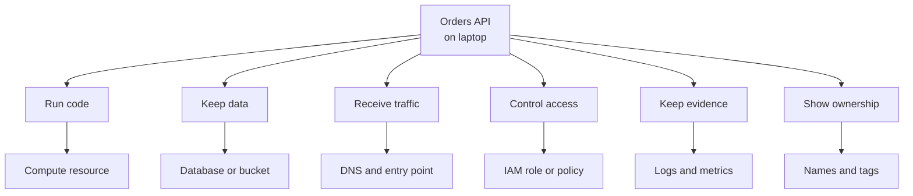

## Table of Contents

1. [The Problem](#the-problem)
2. [The Local App](#the-local-app)
3. [The Cloud Jobs](#the-cloud-jobs)
4. [Resources Have Places](#resources-have-places)
5. [Every Action Has A Caller](#every-action-has-a-caller)
6. [Traffic Needs A Front Door](#traffic-needs-a-front-door)
7. [Evidence Moves Out Of The Terminal](#evidence-moves-out-of-the-terminal)
8. [What AWS Takes Over](#what-aws-takes-over)
9. [The First Operating Checklist](#the-first-operating-checklist)
10. [Putting It All Together](#putting-it-all-together)
11. [What's Next](#whats-next)

## The Problem

A team has an orders API that works locally. On a laptop, the story feels small and clear. The developer starts the server, opens `localhost`, watches logs scroll by, reads secrets from a `.env` file, and writes test orders to a local database.

Then the team tries to put the same app in AWS. The code has not become mysterious, but the hidden jobs around the code are suddenly visible:

- The API needs somewhere to run when the developer's laptop is closed.
- Order records and export files need homes that survive deploys.
- Customers need a stable way to enter the system from the internet.
- The app needs permission to read secrets and write exports without becoming an administrator.
- The team needs shared evidence after the process exits, not one person's terminal scrollback.

That is the first AWS question:

> What is AWS actually taking over from my app, laptop, repo, and servers?

The answer is not "everything." AWS takes over some infrastructure jobs by giving you resources: compute, storage, networks, identities, logs, metrics, and control-plane APIs. Your team still owns the application behavior, the data meaning, the access choices, the network exposure, the release process, and the evidence you trust.

This article follows that one orders API as local responsibilities become cloud jobs. The goal is not to memorize services. The goal is to learn the questions that keep an AWS system understandable:

| Question | Why It Matters |
| --- | --- |
| What job is AWS doing for this part of the app? | Keeps the service name attached to an application need. |
| Where does that resource live? | Prevents wrong-account, wrong-Region, and wrong-placement confusion. |
| Who or what can act on it? | Separates identity, permission, and workload behavior. |
| What evidence proves it exists and works? | Makes operations depend on signals, not guesses. |
| What remains the team's responsibility? | Stops "managed service" from becoming "no one owns it." |

Keep those questions nearby. They are the mental model.

## The Local App

Local development compresses many responsibilities into one place. The laptop is the runtime, the network, the secret store, the log viewer, and sometimes the database host. The repo holds the app code and usually some deployment scripts or configuration. A human supplies context by knowing which terminal, branch, and environment they are using.

For the orders API, the local shape might look like this:

```text
developer laptop
  -> repo: orders-api
  -> process: npm start
  -> traffic: http://localhost:3000
  -> data: local Postgres
  -> exports: ./exports/orders.csv
  -> secrets: .env
  -> evidence: terminal logs
```

That setup is good for fast feedback. It is bad as a production operating model. If the laptop sleeps, the API stops. If the local disk fails, the exports may disappear. If another engineer needs to debug checkout, the evidence is trapped in someone else's session. If a secret leaks into the wrong file, AWS cannot guess the team's intent.

Moving to AWS means each hidden local job gets an explicit home. Some homes are managed services. Some are network paths. Some are identities. Some are logs, metrics, or tags. The code still matters, but the code is no longer the whole system.

## The Cloud Jobs

Start by translating the app, not by opening the service catalog. The orders API needs the same jobs it needed locally. It just needs those jobs to survive real traffic, real failures, real teammates, and real audit questions.



The useful first map is small:

| Local Responsibility | Cloud Job | Example AWS Resource |
| --- | --- | --- |
| Keep the process alive | Run code | ECS service, EC2 instance, or Lambda function |
| Keep order records | Store structured data | RDS database or DynamoDB table |
| Keep export files | Store objects | S3 bucket |
| Accept customer requests | Provide a public entry path | Route 53 record, load balancer, target group |
| Read private config | Protect sensitive values | Secrets Manager secret plus IAM permission |
| Write logs after exit | Keep operational evidence | CloudWatch log group and metric |
| Show who owns it | Organize resources | Account, name, tag, ARN |

This table is not a recommendation to use every service named in it. It is a translation layer. When the app fails, you can ask which job failed. Is the runtime not starting? Is the data store unreachable? Is the public entry path sending traffic to unhealthy targets? Is the app missing permission? Is the evidence missing?

The first non-obvious AWS truth is that resources are organized around AWS boundaries, not around your repo. Your repo may define the desired system, but AWS stores the running reality as resources in accounts, Regions, networks, and service APIs. A good engineer keeps the app story visible across those boundaries.

## Resources Have Places

On a laptop, "where is the app?" has an easy answer. It is on this machine, in this directory, using this terminal. AWS splits that answer into several placement questions.

The first boundary is the AWS account. An account contains resources and data, provides identity and access management capabilities, and is a security and billing boundary. If production and staging use separate accounts, being an administrator in staging does not automatically mean you can change production. Looking in the wrong account can make a real resource look missing.

The second boundary is the Region. A Region is a separate geographic area such as `us-east-1` or `eu-west-1`. Many resources are Regional. If the orders API's load balancer is in `us-east-1`, searching for it in `us-west-2` can show an empty view even though the resource exists.

Inside a Region are Availability Zones. An Availability Zone is an isolated location within a Region. You use zones when placement affects resilience. Two running copies of the API in two zones can survive more local failures than one copy in one zone, but only if the rest of the path also supports that shape.

For now, use this placement record:

| Placement Question | Orders API Example | What It Prevents |
| --- | --- | --- |
| Which account? | `prod` account `333333333333` | Debugging production from a sandbox boundary |
| Which Region? | `us-east-1` | Recreating a resource that was only hidden by the Region selector |
| Which zone or subnet? | app tasks spread across two private subnets | Thinking "multi-AZ" is true when every copy landed together |
| Which precise resource? | `arn:aws:ecs:us-east-1:333333333333:service/orders/orders-api-prod` | Confusing a similar name in another environment for the real one |

Amazon Resource Names, or ARNs, matter because names alone are often too human. `orders-api-prod` is useful in conversation. An ARN is useful when a policy, event, or audit record must identify a resource unambiguously. Some ARNs include a Region and account ID, and some resource types omit one or both, so treat the ARN as evidence, not as a format to guess from memory.

The next article will slow down on accounts, Regions, and Availability Zones. In this article, the habit is enough: before changing anything, ask where the resource lives.

## Every Action Has A Caller

AWS is operated through requests. A person opens the console. A CI job deploys. An ECS task reads a secret. A Lambda function writes to a table. An AWS service acts on your behalf. Each request has a caller, an action, a target resource, and a decision.

IAM roles are central to that model. A role is an AWS identity with permissions, but it is not tied to one long-term password or access key. When a person, workload, or service assumes a role, AWS gives temporary credentials for that role session. The role's permissions say what the session can do. The role's trust relationship says who or what can assume it.

For the orders API, the runtime should not use a developer's personal access key. It should use a workload role with the smallest practical job:

```text
caller: orders-api task role
actions: read the database secret, write monthly export objects, emit logs
targets: one secret, one export bucket prefix, one log group
not needed: administrator access, every S3 bucket, every secret
```

That small story prevents a common beginner mistake. Access is not one blob called "AWS credentials." It is a question about the caller, the action, and the resource.

| Question | Example |
| --- | --- |
| Who is asking? | `orders-api-task` role |
| What action is requested? | `secretsmanager:GetSecretValue` or `s3:PutObject` |
| Which resource is targeted? | one secret ARN or one bucket prefix ARN |
| Is the request allowed? | IAM policy and resource policy evaluation |
| Can the network path also reach it? | VPC route, endpoint, DNS, and security group path |

That last row is important. Permission and reachability are different. The app can have permission to read a secret and still fail if it cannot reach the service endpoint. It can reach a database host and still fail because the database credentials or IAM decision are wrong. Keep those questions separate and AWS errors become much less slippery.

## Traffic Needs A Front Door

Local traffic starts at `localhost`. Production traffic needs a public entry point and a controlled private path behind it.

For the orders API, a simple path might be:

```text
customer browser
  -> orders.example.com
  -> load balancer in public subnets
  -> target group health check
  -> API task in private subnets
  -> database in data subnets
```

The front door is not just a URL. It is a chain of resources doing separate jobs. DNS gives the name. A load balancer receives requests. A target group decides which running copies are healthy enough for traffic. Subnets and route tables decide where packets can go. Security groups and other controls decide what is allowed on those paths.

This is why "the app is running" does not always mean "customers can reach the app." A task can be alive while the load balancer refuses to send traffic because the health check path is wrong. A database can be private and still reachable by the app because the app lives inside the VPC and the right private path is allowed. A resource can have permission to call an AWS API and still lack the network path to reach that API from its subnet.

The second non-obvious AWS truth is that public and private are built from placement, routing, addressing, and rules. They are not just labels in a diagram. A subnet named `private` is only private if its routing and exposure match that intent.

Later networking articles will take this path apart carefully. For the mental model, one question is enough: where does traffic enter, and what proves the next hop is allowed and healthy?

## Evidence Moves Out Of The Terminal

On the laptop, the terminal is the first evidence source. In AWS, evidence lives beside the resources doing the work. That is why operating a cloud app feels strange at first: the signal is no longer in one place.

CloudWatch Logs stores log events in log streams, and log streams belong to log groups. For a containerized API, a log group is often the durable home for application output after the container exits. CloudWatch metrics are time-ordered data points with names, namespaces, and dimensions. Alarms watch metrics over time and call attention to states the team cares about.

CloudTrail answers a different question. It records AWS account activity, including actions made through the console, SDKs, command line tools, and AWS services. If the export bucket policy changed, application logs may show the symptom. CloudTrail is the place to ask who or what changed the AWS control plane.

The orders API needs several kinds of evidence:

| Question | Evidence Source |
| --- | --- |
| Is traffic entering the right front door? | DNS record, load balancer listener, target health |
| Is the runtime alive? | service events, running task count, health checks |
| What did the app say? | CloudWatch log group and log streams |
| Did an AWS resource change? | CloudTrail event |
| Is the user experience degrading? | metrics, alarms, latency, error rate |
| Did cost move after a release? | cost reports, activated cost allocation tags |

Do not make one evidence source carry the whole system. Logs show what code emitted. Target health shows whether a load balancer trusts a running copy. CloudTrail shows account activity. Cost data shows what was charged. Tags connect resources back to the app and owner, but only useful tags that have been applied and activated for cost allocation can organize cost reports and Cost Explorer views.

The third non-obvious AWS truth is that evidence has scope. A log line may prove the app saw an error. It does not prove who changed a bucket policy. A CloudTrail event may prove a policy changed. It does not prove the checkout code handled the next request correctly.

## What AWS Takes Over

"Managed" is one of the easiest cloud words to overread. A managed service means AWS operates more of the underlying platform. It does not mean AWS owns the application outcome.

AWS describes this as shared responsibility. AWS is responsible for the infrastructure that runs AWS Cloud services. Customers are responsible for choices inside the cloud: data, application code, identity and access choices, configuration, and service-specific settings. The exact split changes by service. Using S3 is not the same responsibility shape as managing an EC2 instance.

For the orders API, read the split like this:

| Area | AWS Takes Over | The Team Still Owns |
| --- | --- | --- |
| Runtime | Physical infrastructure and managed compute options | App code, image, config, health endpoint, scaling intent |
| Data | Managed storage or database platform features | Schema, data meaning, retention, access, deletion safety |
| Access | IAM policy engine and temporary credential machinery | Which roles exist and which permissions are appropriate |
| Network | VPC, routing, load balancing, and private connectivity primitives | Public/private design, rules, dependency paths, exposure review |
| Evidence | Log, metric, alarm, and audit event services | Useful log content, alarm thresholds, dashboards, incident habits |
| Cost | Metering and billing data | Resource choices, tags, budgets, cleanup, tradeoffs |

This is the practical tradeoff of AWS. You get powerful building blocks and managed operations, but the decisions become explicit. The database is not "safe" because it is in AWS. It is safer when the account boundary, subnet placement, access policy, backups, monitoring, and deletion controls match the data's job.

## The First Operating Checklist

Once the orders API is in AWS, the team needs a small operating record. It should be boring. Boring is good here. The record connects the app to the cloud resources that make it real.

```text
application: orders-api
environment: prod
account: 333333333333
region: us-east-1
runtime: orders-api-prod service
front door: orders.example.com -> orders-api-prod-alb
data: orders-prod database, orders-exports-prod bucket
runtime role: orders-api-task
secrets: orders-api/prod/database
logs: /aws/ecs/orders-api-prod
owner: checkout
cost tags: Application=orders, Environment=prod, Owner=checkout
```

That record is not infrastructure as code. It is an orientation map for humans. When a deploy breaks, it tells the team where to start. When finance asks about cost, it tells the team which tags and resources should group spend. When a security review asks what the app can touch, it points to the workload role and resource ARNs.

Use the same five questions against each line:

| Resource | Job | Place | Caller | Evidence | Team Responsibility |
| --- | --- | --- | --- | --- | --- |
| API service | run code | prod account, Region, subnets | deployment role, runtime role | service events, task health, logs | code, image, config, desired count |
| Load balancer | receive traffic | public subnets | users, platform operators | listener, target health, metrics | routing intent, certificates, health path |
| Database | keep orders | data subnets, Region | app role or database user | connection health, backups, metrics | schema, migrations, access, retention |
| Export bucket | keep files | prod account, bucket, Region | app role, finance reader | object metadata, access logs or events | key design, policy, lifecycle, deletion safety |
| Log group | keep app output | account and Region | runtime logging path | log streams and events | useful messages, retention, alerting |

This checklist is the first operating habit. It is not complete enough for a mature production system, but it is enough to stop clicking randomly. Each resource has a job, a place, a caller, evidence, and a remaining owner.

## Putting It All Together

Return to the team at the start. The orders API worked locally, then AWS forced the team to answer where code runs, where data lives, who can act, how traffic enters, and where evidence appears.

The mental model turns that confusion into a path:

- The laptop runtime becomes a compute resource with health, placement, and deployment choices.
- The local database and export folder become data resources with access, retention, and recovery choices.
- `localhost` becomes a public entry path, then private hops through the app and data tiers.
- The `.env` file becomes secret storage plus an IAM role that can read only what the app needs.
- Terminal output becomes log groups, metrics, alarms, and audit events with different scopes.
- The repo remains the source for code and desired configuration, but AWS holds the running resources that must be inspected directly.

AWS did not take over the whole app. It took over infrastructure jobs by turning them into resources your team can create, place, permit, observe, tag, and pay for. That is why the first AWS skill is not memorizing product names. It is asking the same operating questions until the system becomes readable:

```text
job -> resource -> place -> caller -> evidence -> team responsibility
```

Use that loop when AWS feels too large. It will keep the service catalog in the background and the application in the foreground.

## What's Next

This article used accounts, Regions, and Availability Zones as placement words. The next article makes them precise.

Accounts decide the first ownership, billing, and security boundary. Regions decide the geographic and resource boundary. Availability Zones decide local failure boundaries inside a Region. Before you choose a database, subnet, load balancer, or deployment shape, you need that map clear.

Next: Accounts, Regions, and Availability Zones.

---

**References**

- [What is an AWS account?](https://docs.aws.amazon.com/accounts/latest/reference/accounts-welcome.html). Supports the account model as a resource container, identity and access boundary, billing boundary, and isolation unit.
- [AWS Regions and Availability Zones](https://docs.aws.amazon.com/global-infrastructure/latest/regions/aws-regions-availability-zones.html). Supports the Region and Availability Zone placement model, including Region isolation and local failure boundaries.
- [What is Amazon VPC?](https://docs.aws.amazon.com/vpc/latest/userguide/what-is-amazon-vpc.html). Supports the VPC, subnet, route table, internet gateway, endpoint, and private network mental model used for traffic placement.
- [Identify AWS resources with Amazon Resource Names (ARNs)](https://docs.aws.amazon.com/IAM/latest/UserGuide/reference-arns.html). Supports the explanation that ARNs identify AWS resources unambiguously and may include service, Region, account ID, and resource identifiers.
- [IAM roles](https://docs.aws.amazon.com/IAM/latest/UserGuide/id_roles.html). Supports the role model, temporary credentials, service roles, service-linked roles, and trust relationship discussion.
- [Shared Responsibility Model](https://aws.amazon.com/compliance/shared-responsibility-model/). Supports the split between AWS responsibility for cloud infrastructure and customer responsibility for data, applications, configuration, access, and service-specific choices.
- [Amazon CloudWatch Logs concepts](https://docs.aws.amazon.com/AmazonCloudWatch/latest/logs/CloudWatchLogsConcepts.html). Supports the log event, log stream, log group, retention, and monitoring terminology.
- [Metrics concepts](https://docs.aws.amazon.com/AmazonCloudWatch/latest/monitoring/cloudwatch_concepts.html). Supports the CloudWatch metric model of namespaces, metrics, dimensions, data points, and alarms.
- [Understanding CloudTrail events](https://docs.aws.amazon.com/awscloudtrail/latest/userguide/cloudtrail-events.html). Supports the distinction between application evidence and AWS account activity evidence.
- [Organizing and tracking costs using AWS cost allocation tags](https://docs.aws.amazon.com/awsaccountbilling/latest/aboutv2/cost-alloc-tags.html). Supports tag behavior, activated cost allocation tags, Cost Explorer filtering, and the warning not to put sensitive information in tags.
