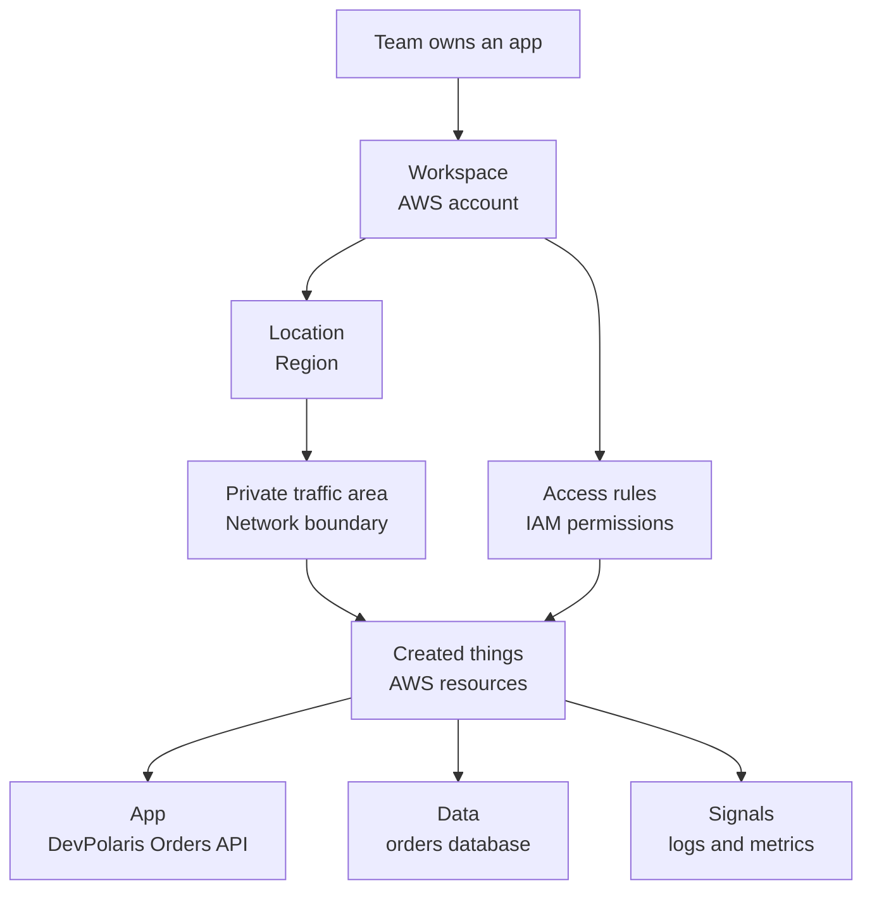
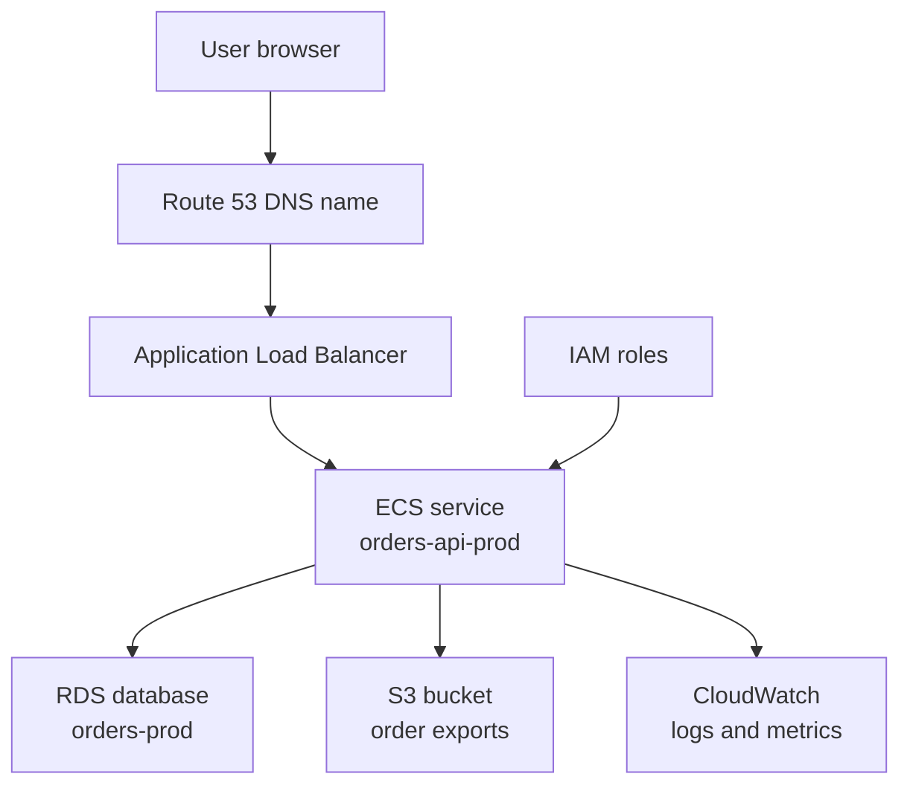

## Table of Contents

1. [What AWS Is Trying To Give You](#what-aws-is-trying-to-give-you)
2. [The Example: One Team, One Orders API](#the-example-one-team-one-orders-api)
3. [Accounts Are The Boundary](#accounts-are-the-boundary)
4. [Regions And Availability Zones Are The Map](#regions-and-availability-zones-are-the-map)
5. [Every Button Is An API Call](#every-button-is-an-api-call)
6. [Resources Have Names, Tags, And ARNs](#resources-have-names-tags-and-arns)
7. [Managed Services Still Need Owners](#managed-services-still-need-owners)
8. [The First Small AWS Architecture](#the-first-small-aws-architecture)
9. [Failure Modes For Beginners](#failure-modes-for-beginners)
10. [What This Mental Model Prepares You For](#what-this-mental-model-prepares-you-for)

## What AWS Is Trying To Give You

Your laptop can run an app, store files, listen on a port, and write logs.
That is enough for learning.
It is not enough for a real service that many people use.

A real service needs machines that stay on when your laptop sleeps.
It needs storage that survives a restart.
It needs networking so users can reach it.
It needs permissions so not every teammate can delete production.
It needs logs and metrics so the team can understand what happened when something breaks.

AWS gives you those building blocks as rented infrastructure.
You do not buy the physical servers.
You ask AWS to create resources for you.
A resource is one thing AWS manages, such as a virtual machine, a load balancer, a database, a storage bucket, or a log group.

The beginner mistake is trying to memorize service names too early.
EC2, S3, IAM, VPC, RDS, ECS, Lambda, CloudWatch, Route 53, and dozens more can start to feel like a wall of nouns.
The better first move is to learn the shape of the place.

AWS is a set of APIs (application programming interfaces, meaning controlled entry points that software can call).
The AWS Console, AWS CLI, SDKs, Terraform, and CI/CD pipelines all talk to those APIs.
When you click a button in the Console, something similar to an API request happens behind the scenes.
When Terraform creates a VPC, it also calls AWS APIs.

That means AWS is not mainly a website.
The website is one doorway.
The real system is a small set of places, things, and rules:
an account is the workspace, a Region is the real-world location, a resource is something you created, a permission is a rule about who can do what, and an API call is one request sent to AWS.

This article uses one running example:
the `devpolaris-orders-api` team is preparing to run its checkout service on AWS.
We will not build the full system yet.
We will learn how to look at the AWS map before we start placing things on it.

> AWS feels less confusing when you ask, "which account, which Region, which resource, and who is allowed to touch it?"

## The Example: One Team, One Orders API

Imagine a small team owns a Node.js backend called `devpolaris-orders-api`.
The service handles checkout requests.
It validates carts, checks discount codes, writes order records, and emits order events.

In the CI/CD module, this service already showed up as a deployment target.
Now we are zooming out.
Before a pipeline can deploy the service, the team needs a cloud home for it.

The team wants a simple production shape:

```text
users
  -> public DNS name
  -> load balancer
  -> backend service
  -> database
  -> logs and metrics
```

That shape is familiar even if the AWS names are not.
A DNS name points users to the service.
A load balancer spreads traffic across running app tasks.
A backend service runs the code.
A database stores orders.
Logs and metrics show whether the service is healthy.

In AWS, those pieces may become Route 53, an Application Load Balancer, ECS, RDS, and CloudWatch.
You do not need to master those services yet.
For now, treat them as named rooms in a building.
Later articles will walk into each room.

Before the AWS names feel natural, translate them into ordinary questions.
You do not need to love the vocabulary yet.
You only need to know what each word is trying to protect you from.

| Plain Question | AWS Word | What It Means |
|----------------|----------|---------------|
| Where does this team's cloud work live? | Account | A separate workspace for resources, billing, and access |
| Where in the world should it run? | Region | A geographic AWS area, like `us-east-1` or `eu-west-1` |
| Who can change it? | Permission | A rule that allows or blocks an action |
| What private space does traffic use? | Network boundary | The app's cloud network area, usually a VPC later |
| What did we create? | Resource | A thing AWS runs or stores for you |

With that translation in mind, the first AWS mental model looks like this:



Read the diagram from top to bottom.
The team does not throw the app into a vague cloud.
The team chooses a workspace, chooses a location, gives people and services the right access rules, then creates resources inside a network boundary.

That is all the diagram is saying.
It is not trying to teach every AWS service at once.
It is giving you a place to put the words before the product names start piling up.

That is the map you need before the service names start to matter.

## Accounts Are The Boundary

An AWS account is the first big boundary.
For a beginner, it helps to think of it as a separate cloud workspace.
It is not just a login screen.
It is where resources live, where bills collect, and where access rules start.

If your company has a staging account and a production account, those accounts are like two separate workrooms.
Both workrooms may contain similar things: a load balancer, an app service, a database, and logs.
The point of separating them is that a mistake in the staging room should not automatically touch the production room.

AWS assigns each account a 12-digit account ID.
That ID appears inside many resource identifiers.
It helps distinguish "this load balancer in the production account" from "a similar load balancer in the staging account."

A realistic account check looks like this:

```bash
$ aws sts get-caller-identity
{
  "UserId": "AIDAEXAMPLEUSERID",
  "Account": "123456789012",
  "Arn": "arn:aws:iam::123456789012:user/maya"
}
```

This output answers a quiet but important question:
"which AWS account am I touching right now?"

That matters because many AWS mistakes are not complicated.
They are simple boundary mistakes.
A person thinks they are in staging but creates a resource in production.
A script points to the wrong account.
A dashboard shows the wrong environment.
A permission policy grants access to a whole account instead of one resource.

For `devpolaris-orders-api`, the team might use separate accounts:

| Account | Purpose | Example Risk |
|---------|---------|--------------|
| `devpolaris-dev` | Experiments and early testing | Someone deletes a test database |
| `devpolaris-staging` | Release checks before production | Bad config blocks a release |
| `devpolaris-prod` | Real checkout traffic | Mistake can affect customers |

This separation is not decoration.
It gives mistakes a smaller place to land.
If a junior engineer experiments in the dev account, they should not be able to delete the production database by accident.

Accounts also make cost and ownership easier to understand.
If production spend jumps, the team can look at the production account.
If a staging resource is left running, the staging account carries the bill.

The rule is simple:

> Before you change AWS, know the account.

## Regions And Availability Zones Are The Map

After the account, the next question is location.
AWS is not one giant data center and a Region is not a language setting.
A Region is a real geographic AWS area where resources can run, such as `us-east-1` in Northern Virginia or `eu-west-1` in Ireland.

Think of it like choosing the city where your rented workshop will sit.
If your app, database, and logs all live in the same city, they can usually talk to each other with low delay.
If you accidentally look in a different city, it may seem like your resources disappeared.

Most resources live in one Region.
If you create a database in `us-east-1`, you will not see that same database when your Console is set to `eu-west-1`.
This is one of the first confusing AWS moments for beginners:
"I created it, but now I cannot find it."

Often, the resource is not gone.
You are looking in the wrong Region.

Inside a Region are Availability Zones.
An Availability Zone is an isolated location inside a Region.
You can think of it as a failure boundary.
If one Availability Zone has trouble, the goal is that another Availability Zone in the same Region can keep running.

AWS connects Availability Zones in a Region with low-latency networking.
That is why production systems often spread across multiple Availability Zones.
You are trying to avoid a service shape where one local failure can stop everything.

For `devpolaris-orders-api`, a first production plan might look like this:

| Layer | Region | Availability Zone Choice |
|-------|--------|--------------------------|
| Load balancer | `us-east-1` | Spans two or more AZs |
| App tasks | `us-east-1` | Run in at least two AZs |
| Database | `us-east-1` | Primary plus standby pattern later |
| Logs | `us-east-1` | Stored with the service signals |

That table does not mean every system must start huge.
It means the team should know what failure it is accepting.

If every app task runs in one Availability Zone, a zone problem can take down the whole backend.
If the app runs in two Availability Zones but the database is single-AZ, the database is still a single point of failure.
If the service runs in `us-east-1` but the team checks logs in `us-west-2`, debugging becomes confusing fast.

The location question appears again and again:

```text
Where is the resource?
Which Region?
Which Availability Zone?
Is the service regional, zonal, or global?
```

You do not need to memorize every AWS service today.
But you should build the habit of asking where a resource lives.

## Every Button Is An API Call

The AWS Console is useful.
It lets you click through resources, inspect state, and learn what exists.
But the Console can hide the real model if you treat it like the only way AWS works.

The better mental model is:
AWS is controlled through APIs.

Several tools can call those APIs:

| Tool | How It Feels | What It Really Does |
|------|--------------|---------------------|
| AWS Console | Click buttons in a browser | Sends API requests |
| AWS CLI | Run terminal commands | Sends API requests |
| SDK | Call AWS from code | Sends API requests |
| Terraform | Review and apply infrastructure code | Sends API requests |
| CI/CD pipeline | Deploy from automation | Sends API requests |

That is why the same resource can be created in many ways.
You can create a storage bucket in the Console.
You can create it with the AWS CLI.
You can create it with Terraform.
You can create it from a deployment workflow.

The resource does not care which doorway you used.
AWS receives an API request, checks whether the caller has permission, and then creates, updates, reads, or deletes the resource.

This mental model helps later when you learn Infrastructure as Code.
Terraform is not a separate cloud.
Terraform is a careful way to decide which AWS API calls should happen.
It compares desired state in code with real state in AWS, then calls AWS APIs to close the gap.

It also helps with debugging permissions.
In AWS, permissions usually live in IAM (Identity and Access Management, AWS's system for users, roles, and access rules).
A permission is very literal.
It says one identity can perform one action on one resource, or it says that action is blocked.

That is different from how people talk in a team.
A manager might say, "Maya is allowed to manage staging."
AWS needs the machine-readable version:
Maya can call this API action, against these resources, in this account.

When a CLI command fails, it is usually not because the terminal is special.
It is because the API request was denied, malformed, or sent to the wrong account or Region.

A permission failure may look like this:

```text
An error occurred (AccessDenied) when calling the CreateBucket operation:
User arn:aws:iam::123456789012:user/maya is not authorized
to perform s3:CreateBucket on resource arn:aws:s3:::devpolaris-orders-exports
```

That message is not friendly, but it is useful.
It tells you four things:
the API call, the caller, the action, and the resource.

The beginner move is to read it slowly instead of panicking.
Which action was denied?
Who made the request?
Which resource did they try to touch?
Which account is in the ARN?

That is AWS giving you the shape of the problem.

## Resources Have Names, Tags, And ARNs

AWS resources need identifiers.
Humans need names.
Teams need tags.
Policies often need ARNs.

An ARN is an Amazon Resource Name.
It is a string that identifies a resource across AWS.
The exact shape changes by service, but many ARNs follow this pattern:

```text
arn:partition:service:region:account-id:resource
```

For example:

```text
arn:aws:ecs:us-east-1:123456789012:service/devpolaris-prod/orders-api-prod
arn:aws:logs:us-east-1:123456789012:log-group:/ecs/orders-api
arn:aws:iam::123456789012:role/orders-api-task-role
```

Read those from left to right.
They tell you the partition, service, Region, account, and resource.
IAM ARNs often have an empty Region field because IAM is a global service.
That blank spot is not a typo.
It is part of how the service identifies resources.

Names help humans.
Tags help teams.
ARNs help AWS policies and APIs point at the exact thing.

For `devpolaris-orders-api`, a small naming and tagging plan might be:

| Resource | Name | Important Tags |
|----------|------|----------------|
| ECS service | `orders-api-prod` | `service=orders-api`, `env=prod`, `owner=checkout` |
| Log group | `/ecs/orders-api` | `service=orders-api`, `env=prod` |
| Database | `orders-prod` | `service=orders-api`, `data=customer-orders` |
| S3 bucket | `devpolaris-orders-exports` | `service=orders-api`, `purpose=exports` |

This may sound like housekeeping.
It becomes important during real work.

If an alarm fires, tags help you find the owner.
If a bill jumps, tags help you find the service.
If a security review asks which resources store customer orders, tags help you answer without guessing.
If an IAM policy is too broad, ARNs help you narrow it.

The failure mode is messy resources.
Someone creates `test-bucket-2`.
Someone else creates `new-prod-db`.
A month later, nobody knows which service owns them.
The team becomes afraid to delete anything.

Good names and tags are not about being tidy.
They make cloud work less scary.

## Managed Services Still Need Owners

AWS has many managed services.
A managed service is a service where AWS runs part of the operation for you.
For example, with Amazon RDS, AWS manages much of the database infrastructure.
With S3, AWS manages the storage service.
With ECS on Fargate, AWS manages the server capacity behind your containers.

Managed does not mean ownerless.
It means the responsibility is shared.

AWS is responsible for the security and operation of the cloud itself.
You are responsible for how you use it:
which data you store, which permissions you grant, which network paths are public, which backups you configure, and which alerts you watch.

For a beginner, this is the most important safety mindset.
AWS can make it easy to create infrastructure.
That does not mean the infrastructure is automatically safe.

Here is the practical split:

| Area | AWS Handles | Your Team Handles |
|------|-------------|-------------------|
| Physical data centers | Buildings, power, hardware | Choosing safe architecture |
| Managed database service | Database infrastructure | Schema, data, access, backups |
| Object storage service | Storage platform | Bucket access, data lifecycle |
| IAM service | Permission system | Policies, roles, credentials |
| Monitoring tools | Signal collection tools | Useful alarms and response |

This is why a cloud engineer asks boring questions that matter:

```text
Who can delete this?
Is this public?
Where are backups?
Which account owns the bill?
Which team receives the alarm?
What happens if one Availability Zone fails?
```

Those questions are not advanced.
They are the cloud version of checking whether a Linux service starts after reboot.
They keep the system from depending on luck.

## The First Small AWS Architecture

Now we can sketch a first AWS architecture without going deep into every service.

For `devpolaris-orders-api`, a basic production shape might be:



Read it slowly.
Route 53 gives users a name to call.
The load balancer receives HTTP traffic.
The ECS service runs the backend.
The database stores order data.
The S3 bucket stores exported files.
CloudWatch receives logs and metrics.
IAM roles decide what the service is allowed to do.

This is not the only possible architecture.
It is just a useful first map.

The same map also gives you a debugging path.
If users cannot reach checkout, ask where the request stops.
Does DNS resolve?
Does the load balancer have healthy targets?
Is the ECS service running tasks?
Can the app reach the database?
Are logs arriving?
Did a permission change block the service from reading a secret or writing an export?

The map turns "AWS is broken" into smaller questions.

```text
symptom:
  checkout returns 503

first questions:
  does the load balancer have healthy targets?
  is the ECS service running the expected task count?
  did the app fail readiness?
  are logs arriving in /ecs/orders-api?
```

That is the habit you want.
Do not debug "the cloud."
Debug one boundary at a time.

## Failure Modes For Beginners

AWS beginner mistakes often come from losing the mental model.
The good news is that the mistakes are understandable.
They usually trace back to account, Region, permissions, naming, or responsibility.

Here are the common failure shapes.

| Failure | What It Feels Like | Better First Question |
|---------|--------------------|-----------------------|
| Wrong account | "I changed it, but prod did not change" | Which account did the tool use? |
| Wrong Region | "The resource disappeared" | Which Region is selected? |
| Missing permission | "AWS says AccessDenied" | Which action and resource were denied? |
| Bad name or tag | "Nobody knows what owns this" | Which service, env, and owner tags are missing? |
| Public by accident | "Why is this reachable from the internet?" | Which network or resource policy allows access? |
| Managed service confusion | "AWS should handle this" | Which part is AWS's job, and which part is ours? |

Let us take the wrong Region mistake.

A teammate creates an ECS service in `us-east-1`.
Later, they open the AWS Console while the selected Region is `us-west-2`.
They do not see the service.
They think the deploy failed.
They start changing the pipeline.

The fix is not to rewrite the pipeline.
The fix is to check the Region.

The same thing happens with the CLI.
If your CLI is configured for `us-west-2`, and the service lives in `us-east-1`, your command may show nothing useful.

```text
expected service:
  account: 123456789012
  region: us-east-1
  service: orders-api-prod

CLI context:
  account: 123456789012
  region: us-west-2

result:
  you are looking in the right account but the wrong region
```

That is why senior engineers often ask simple questions first.
They are not trying to slow you down.
They have learned that cloud mistakes often hide in plain sight.

## What This Mental Model Prepares You For

This article does not make you an AWS expert.
That is not the goal.
The goal is to give you a map so later service details have a place to land.

When you learn compute, you will know to ask which account and Region the server or container lives in.
When you learn networking, you will understand why location and boundaries matter.
When you learn IAM, you will recognize the caller, action, resource, and account inside an error.
When you learn storage and databases, you will ask who owns access, backups, and data lifecycle.
When you learn Terraform, you will understand that it is calling AWS APIs to manage resources in a controlled way.

For now, keep these five questions close:

1. Which account am I touching?
2. Which Region am I using?
3. Which resource is involved?
4. Which identity is making the request?
5. Which part is AWS responsible for, and which part is our team responsible for?

Those questions will save you a lot of confusion.
They are simple, but they are not small.
They are the foundation for almost every AWS conversation that comes next.

---

**References**

- [AWS Regions and Availability Zones](https://docs.aws.amazon.com/global-infrastructure/latest/regions/aws-regions-availability-zones.html) - Explains Regions, Availability Zones, regional resources, and why multi-AZ design matters.
- [View AWS account identifiers](https://docs.aws.amazon.com/accounts/latest/reference/manage-acct-identifiers.html) - Documents AWS account IDs and why account identifiers appear in resource names.
- [Identify AWS resources with Amazon Resource Names](https://docs.aws.amazon.com/IAM/latest/UserGuide/reference-arns.html) - Explains ARN format and why ARNs are used to point at resources unambiguously.
- [AWS CLI User Guide](https://docs.aws.amazon.com/cli/latest/userguide/cli-chap-welcome.html) - Shows how the AWS CLI provides terminal access to AWS services through API calls.
- [AWS Shared Responsibility Model](https://aws.amazon.com/compliance/shared-responsibility-model/) - Explains the split between what AWS operates and what customers must configure and protect.
