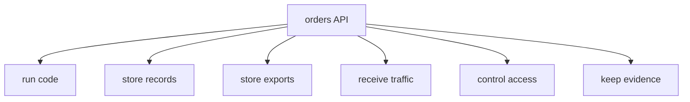

## Table of Contents

1. [What AWS Gives Your App](#what-aws-gives-your-app)
2. [The Example: One Orders API](#the-example-one-orders-api)
3. [The Beginner Questions](#the-beginner-questions)
4. [What Job Moves To AWS?](#what-job-moves-to-aws)
5. [Which Resource Does The Job?](#which-resource-does-the-job)
6. [Where Does It Live?](#where-does-it-live)
7. [How Do We Recognize It Later?](#how-do-we-recognize-it-later)
8. [Who Can Change Or Use It?](#who-can-change-or-use-it)
9. [What Evidence Says It Works?](#what-evidence-says-it-works)
10. [What Is Still Our Job?](#what-is-still-our-job)
11. [Common Beginner Confusions](#common-beginner-confusions)
12. [Quick Recap: The AWS Questions](#quick-recap-the-aws-questions)

## What AWS Gives Your App

Start with the question a new AWS learner can actually feel:

> I built something on my laptop. What exactly am I moving into AWS, and how will I know it is really there?

That is a better question than "Which AWS service should I learn first?"
On your laptop, an app can feel like one object.
You run a command.
The process starts.
The browser opens `localhost`.
Logs print in the terminal.
Environment variables come from your shell or a `.env` file.
Data may live in a local database, a folder, or a file.

AWS separates those hidden jobs into resources.
A resource is one thing AWS creates or manages for you: a server, container service, function, bucket, database, network, role, secret, log group, or alarm.
That is why AWS feels crowded at first.
It is not one big replacement for your laptop.
It is a set of managed places where each app job can live.

The first learning move is to translate the app before memorizing services.

| Local App Need | Cloud Job | AWS Words You Will Meet |
|----------------|-----------|-------------------------|
| Start the process | Run code | EC2, ECS, Lambda |
| Save uploads or exports | Store files | S3 |
| Keep records | Store structured data | RDS, DynamoDB |
| Answer a URL | Receive traffic | Route 53, load balancers, VPC |
| Read a password or token | Protect access | IAM, Secrets Manager |
| Print logs and errors | Keep evidence | CloudWatch |
| Know what belongs together | Organize resources | accounts, Regions, names, tags, ARNs |

The service names matter later.
The jobs matter first.
If you can name the job, you have a place to put the service name when you learn it.

## The Example: One Orders API

Let's follow one small app.
`devpolaris-orders-api` is a Node.js backend for checkout.
Locally, it receives HTTP requests, validates carts, writes order records, creates finance exports, reads secrets, and prints logs.

A local development setup might look like this:

```text
developer laptop
  -> node server.js
  -> http://localhost:3000
  -> local database
  -> ./exports/orders.csv
  -> terminal logs
  -> .env values
```

That setup is good for learning and development.
It is not a production home.
If the laptop sleeps, the app stops.
If the disk fails, the local data may disappear.
If a teammate needs to debug the service, your terminal scrollback is not shared evidence.
If customers need to reach it, `localhost` is not enough.

Moving to AWS does not change what the app needs.
It changes which resource handles each need.



In AWS words, a first rough shape might be:

```text
users
  -> public DNS name
  -> load balancer
  -> running backend service
  -> database
  -> export bucket
  -> logs and metrics
  -> permissions around each action
```

Do not treat that as the final architecture.
Treat it as an orientation note.
It tells us which jobs exist before we argue about the best service for each job.

## The Beginner Questions

The rest of this article answers one loop of questions.
These are the questions to keep in your head when AWS starts to feel like a wall of product names.

- What job am I moving from my laptop, repo, shell, or app to AWS?
- Which AWS resource does that job?
- Where does that resource live?
- How do I recognize it later?
- Who can change or use it?
- What evidence tells me it is working?
- Which part is AWS handling, and which part is still my team's job?

Notice what is missing.
We are not starting with every service category, every billing detail, or every identity feature.
Those topics matter, but they land better after you know what you are trying to place.

For `devpolaris-orders-api`, a small resource note might look like this:

```text
service: devpolaris-orders-api
environment: prod
public name: orders.devpolaris.com
runtime: orders-api-prod
database: orders-prod
exports: devpolaris-orders-exports-prod
logs: /aws/ecs/orders-api-prod
owner: checkout
```

This note is not fancy.
It is useful because it connects the app to the resources that support it.
When a deploy, bug report, or access request appears, the team has something concrete to inspect.

## What Job Moves To AWS?

The first question is about the job, not the product.
If you skip this step, every AWS service looks equally possible.
If you name the job, many services become obviously irrelevant.

For the orders API, the first jobs are ordinary software jobs:
run the backend code, receive HTTP traffic, keep order records, write export files, read secrets, and keep logs.
Those are not AWS ideas yet.
They are app needs.

Now the cloud translation becomes easier:

| App Job | What We Need From AWS |
|---------|-----------------------|
| Run the backend | A compute resource that starts and keeps code running |
| Receive requests | A name and traffic entry point |
| Store records | A database resource |
| Store exports | A file or object storage resource |
| Read secrets | A secure place for sensitive values plus permission to read them |
| Debug behavior | Logs, metrics, health checks, and alarms |

This is why "AWS has too many services" is a normal beginner feeling.
AWS has many services because production systems have many jobs.
The trick is not to learn every service at once.
The trick is to keep asking which job you are solving right now.

There is also an important tradeoff hiding here.
One local process is simple because everything is close together.
Cloud resources are more explicit, which adds setup work.
The benefit is that each job can get the right durability, scaling, security, and operational evidence.

## Which Resource Does The Job?

Once the job is clear, we can ask which AWS resource is responsible.
The word "resource" matters because AWS is not only a website you click through.
Behind the Console, CLI, SDKs, and infrastructure tools are API calls that create, read, update, and delete resources.

For a first version of the orders API, the resource map might look like this:

| Job | Example Resource | What It Does |
|-----|------------------|--------------|
| Public name | Route 53 record | Gives users a stable name |
| HTTP entry | Application Load Balancer | Receives HTTP or HTTPS traffic |
| Backend runtime | ECS service | Keeps backend tasks running |
| Order records | RDS database | Stores structured order data |
| Export files | S3 bucket | Stores generated CSV exports |
| Runtime secret | Secrets Manager secret | Holds private configuration |
| Runtime access | IAM role | Lets the app call only approved AWS APIs |
| Evidence | CloudWatch log group | Keeps logs after the process exits |

This table is intentionally small.
The next AWS Foundations article goes deeper into the service map.
Here, the mental model is the point:
every resource should have a job.

If a teammate says, "Why do we have this bucket?", a good answer sounds like this:

```text
The orders API writes finance export files there.
The bucket is in prod.
The checkout team owns it.
The app role can write exports.
Finance can read the final files.
```

That answer is much stronger than "S3 stores stuff."
It connects the resource to the app, the environment, the owner, and the permission story.

## Where Does It Live?

The next question is where the resource lives.
AWS has several boundaries, but beginners only need the first two right away:
the account and the Region.

An AWS account is the workspace that contains resources, permissions, billing records, and audit history.
Many teams use separate accounts for development, staging, and production so a mistake in one workspace is less likely to become a production incident.

A Region is a geographic AWS area, such as `us-east-1` or `eu-west-1`.
Many application resources live in one Region.
If you create an ECS service in `us-east-1` and look for it in `us-west-2`, the Console can look empty even though the resource exists.

That mistake is common enough that the first AWS CLI habit should be an orientation check:

```bash
$ aws sts get-caller-identity
{
  "UserId": "AROAXAMPLE:maya",
  "Account": "333333333333",
  "Arn": "arn:aws:sts::333333333333:assumed-role/devpolaris-prod-admin/maya"
}

$ aws configure get region
us-east-1
```

Read this as:

```text
account: 333333333333
Region: us-east-1
identity: devpolaris-prod-admin/maya
```

That is enough to prevent a lot of early confusion.
If the expected production account is `333333333333`, the account looks right.
If the command says `222222222222`, you are pointed at a different workspace.
If the expected Region is `us-east-1` and your CLI says `us-west-2`, fix the context before changing resources.

Availability Zones, often shortened to AZs, are local failure boundaries inside a Region.
They matter for resilient production designs, but they do not need to dominate the first mental model.
For now, remember the simple version:
account answers "which workspace?"
Region answers "which AWS location?"
AZ answers "which local failure boundary inside that Region?"

## How Do We Recognize It Later?

After a few weeks, an AWS account can contain many resources.
Recognition becomes part of engineering, not paperwork.
When someone opens the Console or reads a CLI response, they need to know whether they are looking at the right target.

AWS gives you several clues.
A human name helps teammates talk.
A generated ID helps AWS track the resource.
Tags group resources by owner, environment, service, or cost purpose.
An Amazon Resource Name, or ARN, is AWS's precise reference for a resource.

One ECS service might be recorded like this:

```text
human name:
  orders-api-prod

account:
  333333333333

Region:
  us-east-1

ARN:
  arn:aws:ecs:us-east-1:333333333333:service/devpolaris-prod/orders-api-prod

tags:
  service=devpolaris-orders-api
  env=prod
  owner=checkout
```

Use those fields for different kinds of certainty.
The name is a clue for humans.
The tags tell the team what the resource belongs to.
The account and Region place it.
The ARN or generated ID gives AWS an exact target.

Tags should not contain secrets or personal data.
They appear in too many inventory, cost, and operational views to be treated as private storage.
Use tags to organize resources, not to hide sensitive values.

The practical habit is simple:
before changing or deleting a resource, find at least two pieces of evidence that it is the right one.
For production, that usually means account and Region, plus a name, tag, ARN, or owner record that matches the app story.

## Who Can Change Or Use It?

Now ask who is allowed to touch the resource.
On your laptop, the answer may be whoever has your shell.
In AWS, humans, pipelines, and running applications all act through identities.
Permissions decide which actions those identities can take on which resources.

This is why an AWS permission error is more readable than it first appears.

```text
An error occurred (AccessDeniedException) when calling the GetSecretValue operation:
User: arn:aws:sts::333333333333:assumed-role/orders-api-task-role/task
is not authorized to perform: secretsmanager:GetSecretValue
on resource: arn:aws:secretsmanager:us-east-1:333333333333:secret:orders/prod/database-url
```

Read it as one request:

```text
caller:   orders-api-task-role
action:   secretsmanager:GetSecretValue
resource: orders/prod/database-url
result:   denied
```

The error is not saying "AWS does not like the app."
It says one identity tried one action on one resource and the permission check failed.
That gives you a smaller debugging path.

For a beginner, the permission question should stay plain:

- Which identity is making the request?
- Which action is it trying?
- Which resource is the target?
- Should that identity be allowed to do that action?

The safer direction is usually to grant the smallest permission that lets the job work.
For the orders API, the runtime role may need to read one database secret and write to one export bucket.
It probably does not need every action on every bucket.

## What Evidence Says It Works?

The next question is evidence.
Local development often gives you immediate feedback.
You see the terminal.
You refresh the browser.
You edit and restart.

Cloud systems need shared evidence because the app no longer lives inside one person's laptop.
The useful evidence depends on the job.

| Job | Evidence To Check |
|-----|-------------------|
| Traffic reaches the app | DNS record, load balancer listener, healthy targets |
| Code is running | service status, running task or instance count, deployment status |
| Records are stored | database connection, query result, backup status |
| Files are written | object path, timestamp, size, access result |
| Secrets are readable | app startup logs, permission result, secret version |
| Users are not broken | logs, metrics, alarms, error rate, latency |

For the orders API, a small health note might say:

```text
public name: orders.devpolaris.com
health path: /health
load balancer targets: healthy
running tasks: 2
latest deploy: 2026-05-12 14:10 UTC
error rate: below alarm threshold
logs: /aws/ecs/orders-api-prod
```

This evidence does not prove the app has no bugs.
It proves the basic cloud path exists:
traffic has an entry point, the runtime has healthy copies, and the team has logs to inspect.

The failure version is also useful.
If DNS points to the wrong load balancer, the app can be healthy and still unreachable.
If the load balancer has no healthy targets, DNS may be correct but traffic has nowhere safe to go.
If logs are missing, the app may be failing before it reaches the logging path or the runtime may lack permission to write them.

Evidence keeps debugging grounded.
It helps you ask "Which job is failing?" instead of "Which AWS screen should I click next?"

## What Is Still Our Job?

Managed services can make AWS sound as if the team has less responsibility.
That is partly true.
If you use a managed database, AWS operates much of the database platform.
If you run containers on Fargate, AWS handles the underlying container infrastructure.
If you use S3, AWS handles object storage durability at a scale a small team would not build itself.

But "managed" does not mean "unowned."
Your team still owns the app code, data model, access choices, network exposure, backup decisions, alarms, cost habits, and release process.

Use this split:

| Area | AWS Helps With | Your Team Still Owns |
|------|----------------|----------------------|
| Runtime | Managed infrastructure options | App code, image, config, health |
| Data | Managed storage and database services | Schema, access, lifecycle, backups |
| Access | IAM policy engine | Which permissions are appropriate |
| Traffic | Networking and load balancing services | Public/private design and target health |
| Signals | Metrics, logs, and alarms services | Useful log content and alert choices |

The beginner question is:

> Which part did AWS take off our plate, and which part is still ours?

That question prevents two opposite mistakes.
One mistake is treating AWS as raw servers and rebuilding everything yourself.
The other is assuming AWS will make an unsafe design safe.
Good cloud engineering lives between those extremes.

## Common Beginner Confusions

Most early AWS confusion comes from losing one of the questions.
The fix is often less dramatic than it feels.

Here is the wrong Region mistake:

```text
expected service:
  account: 333333333333
  Region: us-east-1
  service: orders-api-prod

current view:
  account: 333333333333
  Region: us-west-2

result:
  right account, wrong Region
```

The app did not disappear.
The learner is looking in the wrong place.
Fix the Region before redeploying or recreating anything.

Here is the unclear-resource mistake:

```text
resource review:
  name: temp-export-bucket
  tags: env=dev
  owner: missing
  data: unknown
```

The safe move is not to delete it because the name says `temp`.
First identify the owner, data risk, account, Region, and creation path.
Then remove it through the workflow that owns it.

Here is the broad-permission mistake:

```text
requested action:
  s3:*

requested resource:
  arn:aws:s3:::devpolaris-orders-*
```

The review question is not "Does this policy work?"
It probably works too broadly.
The better question is whether the caller needs every S3 action on every matching bucket.
If the app only writes finance exports, narrow the action and resource to that job.

These examples all point back to the same habit:
keep the app job visible, then check resource, location, identity, evidence, and ownership.

## Quick Recap: The AWS Questions

When AWS feels too large, return to the questions from the beginning.

| Question | Short Answer Habit |
|----------|--------------------|
| What job am I moving to AWS? | Name the app need before naming the service. |
| Which AWS resource does that job? | Point to the resource responsible for runtime, data, traffic, access, or evidence. |
| Where does it live? | Check account and Region before assuming a resource is missing. |
| How do I recognize it later? | Use name and tags for humans, ARN or ID for precision. |
| Who can change or use it? | Read permission problems as caller, action, resource, result. |
| What evidence says it works? | Look for health, logs, metrics, status, and real output. |
| What is still our job? | Separate what AWS operates from what the team configures and owns. |

You do not need to answer every question perfectly on day one.
The goal is to stop treating AWS as a menu of mysterious services.
Start with the familiar app.
Ask what job moved.
Find the resource doing that job.
Check where it lives, who can touch it, how it is recognized, and what evidence proves it works.

That loop is the foundation for the rest of the AWS roadmap.
Compute, networking, storage, identity, observability, deployment operations, cost, and resilience all become easier when you can keep the app job in view.

---

**References**

- [AWS Regions and Availability Zones](https://docs.aws.amazon.com/global-infrastructure/latest/regions/aws-regions-availability-zones.html) - Used for the account, Region, and Availability Zone orientation model.
- [AWS CLI get-caller-identity](https://docs.aws.amazon.com/cli/latest/reference/sts/get-caller-identity.html) - Used for the caller-identity orientation check.
- [Identify AWS resources with Amazon Resource Names](https://docs.aws.amazon.com/IAM/latest/UserGuide/reference-arns.html) - Used for the ARN explanation and resource identity examples.
- [IAM JSON policy elements: Resource](https://docs.aws.amazon.com/IAM/latest/UserGuide/reference_policies_elements_resource.html) - Used for the permission examples that connect actions to exact resources.
- [What is Tag Editor?](https://docs.aws.amazon.com/tag-editor/latest/userguide/tagging.html) - Used for tag behavior and the warning not to store sensitive data in tags.
- [AWS Shared Responsibility Model](https://aws.amazon.com/compliance/shared-responsibility-model/) - Used for the split between what AWS operates and what customers still configure and monitor.
