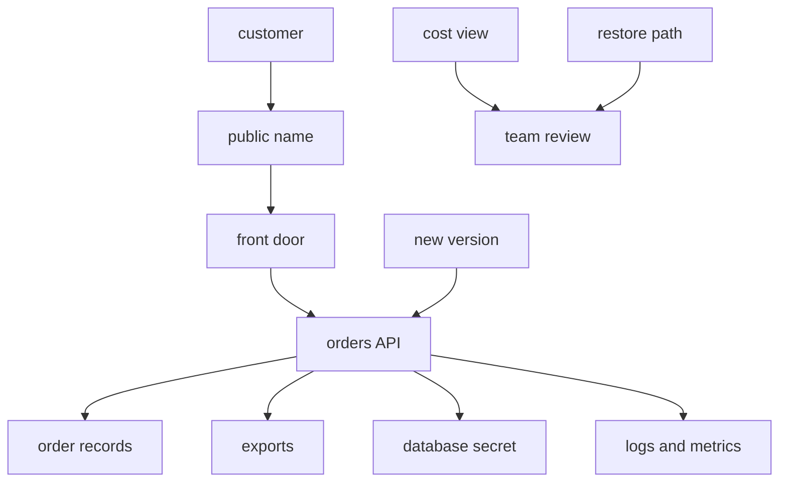

## Table of Contents

1. [The Problem](#the-problem)
2. [The Job-Based Map](#the-job-based-map)
3. [The Orders API](#the-orders-api)
4. [Traffic: What Handles Public Entry](#traffic-what-handles-public-entry)
5. [Compute: Where The Code Runs](#compute-where-the-code-runs)
6. [State: Where Data Lives](#state-where-data-lives)
7. [Access: Who Can Touch What](#access-who-can-touch-what)
8. [Signals: Where Evidence Lives](#signals-where-evidence-lives)
9. [Operations: Deployment, Cost, And Recovery](#operations-deployment-cost-and-recovery)
10. [Debugging With The Map](#debugging-with-the-map)
11. [Putting It All Together](#putting-it-all-together)

## The Problem

A team is moving a small checkout backend into AWS. The app is familiar. It accepts orders, reads product and payment settings, stores order records, writes monthly finance exports, and needs to survive normal production change.

The AWS console is less familiar. The team starts searching service names first, and every search creates more noise:

- Users need a public URL, but Route 53, VPCs, subnets, listeners, target groups, and security groups all seem related.
- The code needs to run, but EC2, ECS, Fargate, Lambda, and ECR all appear in compute conversations.
- The app needs records, files, secrets, logs, deployment evidence, cost visibility, and recovery, but those needs do not live in one service.

The mistake is starting with names. AWS has many service names because production systems have many jobs. The beginner question should be:

> Which AWS service family should I look at first for this app need?

This article builds that map around one production backend. Each section starts with the app need, points to the first AWS family to inspect, and shows the evidence a teammate would use later. By the end, the map has become a debugging habit as well as a study aid.

## The Job-Based Map

The service map starts with plain questions. Do not ask whether the app uses "the right AWS service" before you know which job you are asking about.

| Guiding question | First service family | First AWS services to recognize |
|------------------|----------------------|---------------------------------|
| What handles public traffic? | Traffic | Route 53, VPC, subnets, Application Load Balancer, target groups |
| Where does code run? | Compute | EC2, ECS with Fargate, Lambda |
| Where does state live? | Storage and databases | S3, RDS, DynamoDB, EBS, EFS |
| Who grants access? | Identity and secrets | IAM, IAM roles, Secrets Manager |
| Where do logs, metrics, and alarms live? | Observability | CloudWatch Logs, CloudWatch metrics, CloudWatch alarms, CloudTrail |
| Which services help deployment? | Release operations | ECR, ECS task definitions, ECS services, health checks |
| Which services help cost and recovery? | Cost and resilience | AWS Budgets, Cost Explorer, AWS Backup, service-specific backups |

Read the table from left to right. The job comes first. The service family comes second. The exact service name comes last.

That order keeps the map useful. "We use ECS" is a label. "The orders API runs as an ECS service with two Fargate tasks behind an Application Load Balancer" tells you where the code runs, how traffic reaches it, and which layer to inspect when health changes.

There is one more habit to add early: write the map as a small design note, not as a memory exercise. The note should name the production resource, the job it performs, and the first evidence to check.

## The Orders API

The running example is `devpolaris-orders-api`. It is a normal backend, not a special cloud demo. It receives checkout requests, writes order records, creates export files for finance, reads a database secret, and emits logs after each request.

Before choosing services, write the jobs in app language:

```text
orders API needs:
  public traffic to reach the app
  backend code to keep running
  order records to persist
  finance export files to persist
  private config to stay out of the image
  logs and metrics after the process exits
  releases to move safely from image to traffic
  cost and recovery controls before the app grows
```

Now the AWS shape has something to answer.



A first production map might look like this:

| App job | First AWS service | Why this is the first family to inspect |
|---------|-------------------|-----------------------------------------|
| Public name | Route 53 | Users need a stable DNS name for the API. |
| HTTP entry | Application Load Balancer | Requests need a controlled entry point and target health checks. |
| Network home | VPC and subnets | Public entry points, app tasks, and data services need placement. |
| Runtime | ECS with Fargate | The team wants to run a container without managing EC2 instances. |
| Container image | ECR | Deployments need a managed image registry. |
| Order records | RDS | Orders need relational data and transactions. |
| Export files | S3 | CSV files need object storage. |
| Runtime secret | Secrets Manager | The database URL should not be hardcoded into the image. |
| Runtime permission | IAM role | The task needs limited permission to read the secret and write exports. |
| Operational evidence | CloudWatch | Logs, metrics, and alarms need a durable home. |
| Cost watch | AWS Budgets and Cost Explorer | The team needs alerts and usage views before spend surprises become normal. |
| Recovery | AWS Backup or service backups | Important state needs a restore path as well as a storage location. |

Many architectures can be correct. Another backend might use Lambda because requests are short and event-driven. Another might use DynamoDB because every query is known by key. Another might use EC2 because it needs host-level control.

The map does not choose forever. It gives you a first place to look.

## Traffic: What Handles Public Entry

Traffic answers a concrete question:

> How does a customer request reach healthy backend code?

For the orders API, the first path is a chain, not a vague statement like "the internet hits ECS":

```text
orders.devpolaris.com
  -> Route 53 DNS record
  -> Application Load Balancer
  -> listener rule
  -> target group
  -> healthy ECS task
```

Route 53 is the first service family to inspect when the name itself is wrong. It can register domains, route DNS traffic, and run health checks. But Route 53 does not prove that the backend is healthy. It only points the user toward the entry point.

The Application Load Balancer is the first service family to inspect when the name reaches AWS but requests fail at the front door. An ALB receives application traffic, evaluates listener rules, forwards requests to target groups, and uses health checks to decide which targets should receive traffic.

That creates a useful traffic note:

```text
traffic:
  public name: orders.devpolaris.com
  entry point: alb-orders-prod
  listener: HTTPS 443
  target group: tg-orders-api-prod
  health path: /health
  backend port: 3000
```

The non-obvious truth is that a running backend can still be absent from traffic. The ECS task can exist, the container can start, and the app can still receive no customer requests if the target group sees failed health checks, the listener points to the wrong group, or the network path blocks the backend port.

So the traffic family teaches an order:

```text
name -> load balancer -> listener -> target group -> target health -> app port
```

If the domain is wrong, changing the task definition is too late in the path. If every target is unhealthy, changing the DNS record is too early. Follow the request until the layer that stops it.

## Compute: Where The Code Runs

Compute answers:

> What runs the application process?

On a laptop, the answer might be `npm start`. In AWS, the answer is a runtime shape. EC2 gives you virtual servers. ECS runs and manages containers. Fargate lets ECS run containers without your team managing the EC2 instances underneath. Lambda runs code in response to events without managing servers.

The orders API is a long-running HTTP container, so ECS with Fargate is the first compute family to inspect. The useful runtime shape is more specific than the labels "ECS" and "Fargate":

```text
compute:
  cluster: devpolaris-prod
  service: orders-api-prod
  task definition: orders-api:42
  desired tasks: 2
  launch type: Fargate
  container image: orders-api:2026.05.14.1
  container port: 3000
```

ECS has a few pieces beginners should separate. A task definition is the blueprint for the application. It names the container image, CPU, memory, port mappings, logging configuration, roles, environment values, secrets, and other runtime settings. A task is a running copy of that blueprint. An ECS service keeps the desired number of tasks running.

That separation is where many production mistakes hide. A deployment might register a new task definition but not update the service. A service might desire two tasks but have zero running because the image cannot start. A task might run but fail the load balancer health check because the app listens on the wrong port.

Use workload shape before service loyalty:

| Workload shape | First compute service to inspect | Why |
|----------------|----------------------------------|-----|
| Needs full server control | EC2 | You choose and manage the virtual server shape and operating system behavior. |
| Long-running container API | ECS with Fargate | The service runs containers while AWS handles the server capacity layer. |
| Short event-driven work | Lambda | Code starts when an event invokes it and scales around that event model. |
| Scheduled worker | Lambda or ECS task | The choice depends on runtime length, packaging, dependencies, and operational fit. |

The compute family teaches a habit: describe how the code becomes a running process. "It runs on AWS" is too vague. Name the service, desired count, package, port, role, and health signal.

## State: Where Data Lives

State answers:

> What kind of information must survive after the process exits?

The orders API has more than one kind of state. Order records are structured business data. Export files are objects. A container image is a deployment artifact. A virtual machine might need a block volume. A shared tool might need a mounted filesystem.

That is why "where do we store data?" is still too broad. Start with the promise the data needs.

| State need | First AWS service to inspect | What the service is good at first |
|------------|------------------------------|-----------------------------------|
| Order records with transactions | RDS | Managed relational databases such as PostgreSQL or MySQL. |
| Finance export CSV files | S3 | Object storage in buckets, addressed by object keys. |
| Known-key items at high scale | DynamoDB | Key-value and document data models with managed NoSQL behavior. |
| Disk attached to an EC2 instance | EBS | Block storage volumes for EC2 instances. |
| Shared mounted files | EFS | Managed NFS file storage that multiple compute clients can mount. |

For this backend, the first state note is small:

```text
records:
  service: RDS
  database: rds-orders-prod
  data: order records
  recovery question: can we restore a usable database?

exports:
  service: S3
  bucket: devpolaris-orders-exports-prod
  prefix: monthly/
  data: finance CSV files
  access question: who can write and who can read?
```

The non-obvious truth is that each storage service has a different data contract. S3 stores objects in buckets. Treating it like a mounted disk leads to the wrong design. RDS runs relational database engines and takes over many database administration tasks, but your team still owns schema design, query behavior, and application use. DynamoDB works best when the access pattern is designed around keys instead of ad hoc joins.

A good map also names recovery early. "The data is in RDS" is not the same as "we can restore checkout after a bad migration." "The export is in S3" is not the same as "finance can find the correct bucket, prefix, and version." The state family should always lead to the restore question.

## Access: Who Can Touch What

Access answers:

> Which caller is allowed to perform which action on which resource?

IAM is the first family to inspect because every AWS API request has an identity and an authorization decision. The caller might be a human, a CI job, an ECS task, a Lambda function, or an AWS service acting through a role.

For the orders API, the app should not carry a developer access key. It should run with a task role. That role should allow only the actions the runtime actually needs:

```text
caller:
  orders-api-task-role

allowed actions:
  secretsmanager:GetSecretValue on orders/prod/database-url
  s3:PutObject on devpolaris-orders-exports-prod/monthly/*

not allowed:
  s3:* on every bucket
  secretsmanager:* on every secret
  administrator access
```

Secrets Manager belongs in the same access conversation because secrets are private runtime values, not ordinary config. It can store and retrieve credentials, API keys, and other secrets. The app still needs permission to read the specific secret, and the runtime path still matters.

One ECS gotcha is worth learning early. If a Secrets Manager secret is injected into a container as an environment variable, the value is injected when the container starts. If the secret later rotates, the already running container does not automatically receive the new value. The service needs a new task or deployment path to pick up the new secret value.

That gotcha changes how you read an incident. A database password may be rotated correctly in Secrets Manager while the running task still uses the old value. The useful conclusion is more specific than "Secrets Manager is broken": check runtime configuration, deployment, and task freshness.

Keep the first access review small:

| Request | Better first question |
|---------|-----------------------|
| ECS task reads a database secret | Which task role is the caller, and does it need only this secret? |
| App writes monthly exports | Which bucket and prefix does the task role need? |
| CI updates the ECS service | Which deploy role can register task definitions and update this service? |
| Human reads production logs | Which read-only role grants CloudWatch access without changing resources? |

The access family teaches a habit: name the caller, action, and resource before widening permissions. Access and network reachability are separate questions. A role can be allowed while packets cannot reach the endpoint. Packets can reach the endpoint while IAM denies the action.

## Signals: Where Evidence Lives

Signals answer:

> What evidence tells us whether the app is working?

CloudWatch is the first family most beginners inspect for runtime evidence. CloudWatch can monitor AWS resources and applications, collect metrics, store logs, show dashboards, and trigger alarms. CloudWatch Logs stores log events in log streams and log groups, so logs survive after a container exits.

For the orders API, a signal note might be:

```text
signals:
  app logs: /aws/ecs/orders-api-prod
  load balancer metrics: request count, 5xx, target response time
  ECS metrics: CPU, memory, running task count
  RDS metrics: connections, CPU, storage, latency
  alarms: high 5xx, no healthy targets, database connection pressure
```

This note does not make observability automatic. The app still needs useful log lines. The team still needs meaningful alarm thresholds and owners. A log that says `error` is weak evidence. A log that names the request, route, dependency, status, and error gives the next engineer a path.

```text
2026-05-14T10:31:04Z ERROR checkout failed
request_id=req_8f17
route=POST /orders
status=503
dependency=rds-orders-prod
message="database connection timed out"
```

CloudTrail is a different kind of signal. It records AWS account activity such as actions taken through the console, CLI, SDKs, APIs, and AWS services. If a bucket policy changed or an ECS service was updated, application logs might show the symptom. CloudTrail is where you look for the control-plane change.

The non-obvious truth is that no single evidence source owns the whole story. Target health tells you whether the load balancer trusts a backend. ECS task state tells you whether the runtime exists. Application logs tell you what the code experienced. CloudWatch metrics show trends and thresholds. CloudTrail tells you who or what changed AWS resources.

The signals family teaches a habit: choose evidence that matches the question.

## Operations: Deployment, Cost, And Recovery

Operations answers three practical questions:

> How does a new version become healthy traffic?

> What spend should someone notice?

> What restore path protects important state?

For an ECS container service, deployment is a chain. ECR stores the container image. The ECS task definition points at the image and runtime settings. The ECS service starts tasks from the new revision and replaces old ones according to its deployment settings. The load balancer health check decides whether traffic should trust the new tasks. CloudWatch shows logs, metrics, and alarms during the change.

```text
deployment:
  image: ecr/orders-api:2026.05.14.1
  task definition: orders-api:42
  service: orders-api-prod
  desired tasks: 2
  health check: /health
  evidence: target health, ECS events, app logs, 5xx metrics
```

The important tradeoff is speed versus proof. A deployment event can prove AWS accepted a new desired state. It does not prove the app read the right secret, connected to the database, passed health checks, and served real checkout traffic. That proof comes from traffic, compute, access, and signals together.

Cost visibility is also operational work. AWS Budgets can track costs and usage and send alerts when actual or forecasted spend crosses a threshold. Cost Explorer lets teams view and analyze cost and usage trends. These services make drift visible during architecture review. The earlier you tag resources by service, environment, and owner, the easier it is to understand which part of the app is spending money.

Recovery belongs beside cost because both become painful when they are added too late. AWS Backup can centralize and automate data protection for supported resources. Many services also have their own backup, snapshot, versioning, retention, or restore controls. The first question is not "which backup feature exists?" It is:

```text
If this state is damaged or deleted, how do we restore a usable system?
```

A first operations note might say:

```text
cost:
  required tags: service=orders-api, env=prod, owner=checkout
  budget: prod monthly budget alert
  review: Cost Explorer grouped by service and tag

recovery:
  RDS backup enabled
  export bucket retention reviewed
  restore drill owner assigned
  critical alarms routed to the on-call path
```

The operations family teaches a habit: deployment, cost, and recovery are not afterthoughts. They are part of how the service runs.

## Debugging With The Map

Debugging with the map answers:

> Which job is failing?

That is usually better than asking which AWS service is broken. Start with the user path, then move to runtime, state, access, signals, deployment, cost, or recovery only when the evidence points there.

Here is a checkout incident:

```text
incident:
  checkout requests return 503 after release 2026.05.14.1

traffic:
  orders.devpolaris.com resolves to the expected load balancer
  listener forwards to tg-orders-api-prod
  target health: 0 healthy, 2 unhealthy

compute:
  ECS desired tasks: 2
  ECS running tasks: 2
  task definition: orders-api:42

signals:
  CloudWatch log group: /aws/ecs/orders-api-prod
  error: DATABASE_URL is missing

access and secrets:
  task definition references orders/prod/database-url
  task role can read the secret
  secret was rotated after the previous tasks started
```

The map narrows the story. DNS has evidence pointing away from it because the name reaches the expected load balancer. ECS did start the runtime because two tasks are running. Target health is failing because the app returns an unhealthy response. Logs point to missing database configuration. The secret exists and the role can read it, but the running task needs to be refreshed after the secret change.

The correction is now specific: update the runtime reference if it is wrong, or roll new tasks so the container receives the current secret value. That is a very different conversation from "AWS is down."

Here is another incident:

```text
incident:
  finance export job says upload complete
  finance cannot find the CSV in S3

map checks:
  compute: did the export task run?
  access: did s3:PutObject succeed?
  state: which bucket and key did the app write?
  signals: does the log name the bucket, key, and request id?

log clue:
  bucket=devpolaris-orders-export
  key=monthly/2026-05/orders.csv

documented destination:
  bucket=devpolaris-orders-exports-prod
  prefix=monthly/
```

The likely problem is configuration drift, not object storage in general: the app wrote to an old bucket name. The service map makes that visible because it separates runtime, access, state, and evidence.

Many AWS failures are ordinary once the job is named: wrong account, wrong Region, wrong name, wrong target group, wrong role, wrong secret version, wrong bucket, wrong restore assumption. The map gives those checks a calm order.

## Putting It All Together

The AWS core services map is a way to keep the application story visible inside a large service catalog.

The team in the opener needed traffic, compute, storage, secrets, logs, deployment, cost visibility, and recovery. Searching service names first made the problem noisy. Mapping jobs first made it orderly.

For the orders API, the map now answers the first questions:

- Public traffic starts at Route 53, moves through an Application Load Balancer, and depends on target health before it reaches the app.
- Code runs as an ECS service on Fargate, using a task definition that describes the image, port, logging, roles, and secrets.
- State is split by shape: RDS for order records, S3 for export files, and other storage services only when their promises match the data need.
- Access starts with IAM: caller, action, resource, and only then permission changes.
- Secrets Manager keeps private runtime values out of the image, but running tasks still need a deployment path to receive changed secret values.
- CloudWatch and CloudTrail provide different evidence: runtime behavior, metrics, alarms, and account activity.
- ECR, ECS deployments, health checks, budgets, cost views, backups, and restore drills make the service operable after the first launch.

This article closes the foundations module by turning AWS names back into app needs. The next AWS modules go deeper into those families one at a time: identity and security, networking, compute, storage, observability, cost, and recovery. Keep the same first question with you:

> What job is this service doing for the app?

That question is the bridge from service names to practical AWS engineering.

---

**References**

- [What is Amazon VPC?](https://docs.aws.amazon.com/vpc/latest/userguide/what-is-amazon-vpc.html). Supports the traffic and placement map around VPCs, subnets, route tables, gateways, and private AWS service access.
- [What is Amazon Route 53?](https://docs.aws.amazon.com/Route53/latest/DeveloperGuide/Welcome.html). Supports the DNS role of Route 53, including domain names, DNS routing, and health checking.
- [What is an Application Load Balancer?](https://docs.aws.amazon.com/elasticloadbalancing/latest/application/introduction.html) and [Health checks for Application Load Balancer target groups](https://docs.aws.amazon.com/elasticloadbalancing/latest/application/target-group-health-checks.html). Support the front-door, listener, target group, and target health explanations.
- [What is Amazon Elastic Container Service?](https://docs.aws.amazon.com/AmazonECS/latest/developerguide/Welcome.html), [Architect for AWS Fargate for Amazon ECS](https://docs.aws.amazon.com/AmazonECS/latest/developerguide/AWS_Fargate.html), and [Amazon ECS task definitions](https://docs.aws.amazon.com/AmazonECS/latest/developerguide/task_definitions.html). Support the ECS, Fargate, service, task, and task definition model.
- [What is Amazon EC2?](https://docs.aws.amazon.com/AWSEC2/latest/UserGuide/concepts.html) and [What is AWS Lambda?](https://docs.aws.amazon.com/lambda/latest/dg/welcome.html). Support the compute comparison between virtual servers, container services, and event-driven functions.
- [What is Amazon S3?](https://docs.aws.amazon.com/AmazonS3/latest/userguide/Welcome.html), [What is Amazon RDS?](https://docs.aws.amazon.com/AmazonRDS/latest/UserGuide/Welcome.html), [What is Amazon DynamoDB?](https://docs.aws.amazon.com/amazondynamodb/latest/developerguide/Introduction.html), [What is Amazon EBS?](https://docs.aws.amazon.com/ebs/latest/userguide/what-is-ebs.html), and [What is Amazon EFS?](https://docs.aws.amazon.com/efs/latest/ug/whatisefs.html). Support the storage and database map for objects, relational data, key-value/document data, block volumes, and shared file systems.
- [What is IAM?](https://docs.aws.amazon.com/IAM/latest/UserGuide/introduction.html), [IAM roles](https://docs.aws.amazon.com/IAM/latest/UserGuide/id_roles.html), [What is AWS Secrets Manager?](https://docs.aws.amazon.com/secretsmanager/latest/userguide/intro.html), and [Pass Secrets Manager secrets through Amazon ECS environment variables](https://docs.aws.amazon.com/AmazonECS/latest/developerguide/secrets-envvar-secrets-manager.html). Support the caller/action/resource access model, temporary-role model, secrets storage, and ECS secret injection gotcha.
- [What is Amazon CloudWatch?](https://docs.aws.amazon.com/AmazonCloudWatch/latest/monitoring/WhatIsCloudWatch.html), [What is Amazon CloudWatch Logs?](https://docs.aws.amazon.com/AmazonCloudWatch/latest/logs/WhatIsCloudWatchLogs.html), and [What Is AWS CloudTrail?](https://docs.aws.amazon.com/awscloudtrail/latest/userguide/cloudtrail-user-guide.html). Support the distinction between metrics, logs, alarms, runtime evidence, and account activity.
- [What is Amazon ECR?](https://docs.aws.amazon.com/AmazonECR/latest/userguide/what-is-ecr.html) and [Deploy Amazon ECS services by replacing tasks](https://docs.aws.amazon.com/AmazonECS/latest/developerguide/deployment-type-ecs.html). Support the deployment path from image registry to task replacement and health evidence.
- [Managing your costs with AWS Budgets](https://docs.aws.amazon.com/cost-management/latest/userguide/budgets-managing-costs.html), [Analyzing your costs and usage with AWS Cost Explorer](https://docs.aws.amazon.com/cost-management/latest/userguide/ce-what-is.html), and [What is AWS Backup?](https://docs.aws.amazon.com/aws-backup/latest/devguide/whatisbackup.html). Support the cost visibility and centralized backup planning discussion.
