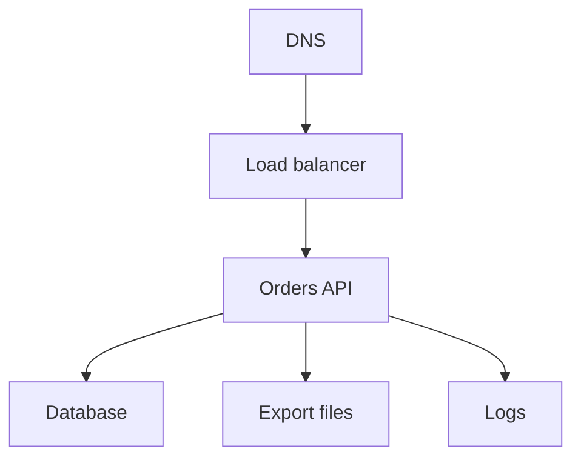

## Table of Contents

1. [The Job-Based Map](#the-job-based-map)
2. [The Running Example](#the-running-example)
3. [Traffic: Names, Networks, And Entry Points](#traffic-names-networks-and-entry-points)
4. [Compute: Where The Code Runs](#compute-where-the-code-runs)
5. [Data: Files, Volumes, And Databases](#data-files-volumes-and-databases)
6. [Access: Who Can Touch What](#access-who-can-touch-what)
7. [Signals: How You Know It Is Working](#signals-how-you-know-it-is-working)
8. [Operations: Images, Secrets, Deployments, And Health](#operations-images-secrets-deployments-and-health)
9. [Cost And Resilience: Small Choices Before Traffic Grows](#cost-and-resilience-small-choices-before-traffic-grows)
10. [Debugging With The Map](#debugging-with-the-map)
11. [Quick Recap: The Service Map Questions](#quick-recap-the-service-map-questions)

## The Job-Based Map

The first AWS Foundations article started with your local app.
It asked what changes when the app moves from your laptop into AWS.
This article asks the next beginner question:

> I know what my app needs to do. How do I choose the AWS service family that handles each job?

That is a better starting point than the AWS service menu.
The menu is large because real systems need many different jobs handled separately.
Your app needs code to run.
It needs data to live somewhere.
It needs users to reach it.
It needs permissions.
It needs logs and health evidence.
It needs a safe way to release new versions.
It needs cost and recovery choices before the first real traffic spike.

So do not start with "Should I use EC2, ECS, Lambda, S3, RDS, DynamoDB, IAM, VPC, or CloudWatch?"
Start with the job:

- Is this about users reaching the app?
- Is this about where code runs?
- Is this about files, records, or disks?
- Is this about who can use or change something?
- Is this about evidence that the app is working?
- Is this about releasing a new version safely?
- Is this about cost, backup, or failure recovery?

Those questions turn AWS from a product list into a map.
Each service family has a job in the system.
The exact service choice can change later, but the job usually stays clear.

Here is the map we will use:

| App Need | AWS Service Family | First Services To Recognize |
|----------|--------------------|-----------------------------|
| Users need to reach the app | Traffic | Route 53, VPC, subnets, route tables, load balancers |
| Code needs to run | Compute | EC2, ECS with Fargate, Lambda |
| Files and records need a home | Data | S3, EBS, EFS, RDS, DynamoDB |
| Something needs permission | Access | IAM users, roles, policies |
| The team needs evidence | Signals | CloudWatch metrics, logs, alarms |
| A new version needs to start safely | Operations | ECR, ECS task definitions, Secrets Manager, health checks |
| The system needs limits and recovery | Cost and resilience | AWS Budgets, backups, multi-AZ design |

Read the table from left to right.
The app need comes first.
The AWS family comes second.
The service names come last.

That order matters for learning.
If you start with service names, AWS feels like memorization.
If you start with the app job, AWS feels like a set of answers.

## The Running Example

We will keep using `devpolaris-orders-api`.
It is a small checkout backend.
It receives orders, validates carts, stores order records, writes finance exports, reads secrets, and emits logs.

Before we choose service names, list the jobs the app needs AWS to handle:

- A public name for users.
- A traffic entry point.
- A runtime for the backend code.
- A database for order records.
- A file store for finance exports.
- A way to read secrets without hardcoding them.
- Logs, metrics, and alarms.
- Permissions around every action.
- A release path for new versions.
- Cost and recovery controls.

Now the service map has a reason to exist.
It is not a catalog.
It is a translation from app needs to AWS service families.

Here is a first teaching shape:



In AWS words, the first version might become:

| Job | Possible AWS Service | Why It Appears |
|-----|----------------------|----------------|
| Public name | Route 53 | Users need a stable domain name |
| HTTP entry | Application Load Balancer | The app needs a public traffic door and health checks |
| Backend runtime | ECS with Fargate | The team wants to run a container without managing servers |
| Order records | Amazon RDS | Orders need relational storage |
| Finance exports | Amazon S3 | CSV files need durable object storage |
| Runtime secret | Secrets Manager | The app needs private configuration |
| Logs and alarms | CloudWatch | The team needs operational evidence |
| Permissions | IAM | AWS must know who can do what |

This is not the only correct design.
Another team might use EC2 because it needs server control.
Another might use Lambda for an event-driven workflow.
Another might use DynamoDB for known-key access patterns.

The point is not to copy this exact architecture.
The point is to ask which job you are solving before choosing the service.

## Traffic: Names, Networks, And Entry Points

Traffic answers the question:

> How do users or other services reach the app?

For a public backend, traffic usually starts with a name and ends at healthy running code.
For `devpolaris-orders-api`, the first path might be:

```text
orders.devpolaris.com
  -> DNS record
  -> Application Load Balancer
  -> target group
  -> ECS tasks
```

Several AWS services can appear in that path.
Route 53 can host DNS records.
A VPC gives resources a private network boundary.
Subnets place resources inside Availability Zones.
Route tables decide where traffic goes next.
Security groups and network ACLs filter traffic.
An Application Load Balancer receives HTTP or HTTPS and forwards to healthy targets.

A beginner does not need every networking detail yet.
The first split is enough:
the public entry lets users reach the app, while the private network lets backend pieces talk without making every resource public.

Use a short traffic note:

```text
traffic path:
  public name: orders.devpolaris.com
  entry point: Application Load Balancer
  backend target: ECS target group orders-api-prod
  health path: /health
  network home: vpc-devpolaris-prod
```

This note gives the reader an order.
If the domain points to the wrong place, debugging ECS is too late.
If the load balancer has no healthy targets, changing DNS is too early.
If the network rule blocks the task port, the app can be running and still be unreachable.

The traffic family teaches a habit:
follow the request path before changing services.

Later networking articles will teach VPCs, subnets, route tables, security groups, network ACLs, public and private access, DNS, TLS, and load balancer health.
For this map article, the job is simpler:
name, entry point, network path, target, health.

## Compute: Where The Code Runs

Compute answers the question:

> Where does my application process run?

On your laptop, the answer might be `node server.js`.
In AWS, the answer depends on how much control the app needs and how the work starts.

For `devpolaris-orders-api`, the team has a long-running HTTP backend packaged as a container image.
That points toward ECS with Fargate as a reasonable first service to inspect.
ECS gives the team a service, task definition, desired task count, and integration with a load balancer.
Fargate means the team does not manage EC2 instances for the container runtime.

That does not make ECS the answer to every compute problem.
Use workload shape first:

| Workload Shape | First AWS Service To Inspect | Why |
|----------------|------------------------------|-----|
| Needs server control | EC2 | You manage the operating system and process model |
| Long-running container service | ECS with Fargate | AWS runs the container infrastructure for you |
| Short event-driven work | Lambda | Code runs when an event invokes it |
| Scheduled or queue-driven worker | Lambda or ECS task | The best fit depends on runtime length and packaging |

The compute choice should answer six plain questions:

- What code runs?
- What package starts it?
- How many copies should exist?
- How does traffic reach it?
- What role does it run with?
- What evidence proves it is healthy?

For an ECS service, a first runtime note might be:

```text
runtime:
  service: orders-api-prod
  cluster: devpolaris-prod
  task definition: orders-api:42
  desired tasks: 2
  package: container image
  container port: 3000
  health path: /health
```

That record is more useful than "we use ECS."
It tells a teammate what to inspect.

Compute failures often look like another layer at first.
Users may see `503`.
The load balancer may show zero healthy targets.
But the real issue may be the container crashing because an environment value is missing.
The service map keeps the reader from guessing.

## Data: Files, Volumes, And Databases

Data answers the question:

> What shape of information does my app need to keep?

Do not start with "S3 or RDS?"
Start with the data shape.
Order records, uploaded images, monthly CSV exports, attached disks, shared files, and key-value lookups are not the same problem.

For `devpolaris-orders-api`, the app has at least two data shapes.
Order records need relationships, updates, and queries.
Finance exports are whole files that need durable storage and access control.

That gives us this first map:

| Data Need | First AWS Service To Inspect | Why |
|-----------|------------------------------|-----|
| Order records | Amazon RDS | Relational data, transactions, SQL queries |
| Finance export files | Amazon S3 | Durable object storage for files |
| VM disk state | Amazon EBS | Block storage attached to EC2 |
| Shared mounted files | Amazon EFS | Managed network file system |
| Known-key items | DynamoDB | Key-value or document access pattern |

The names are less important than the promise each service makes.
S3 stores objects.
RDS runs relational databases.
DynamoDB fits access patterns built around keys.
EBS behaves like a block volume for EC2.
EFS behaves like a managed shared filesystem.

A small data note for the orders service might say:

```text
records:
  service: Amazon RDS
  resource: rds-orders-prod
  data: order records
  risk: production customer state

files:
  service: Amazon S3
  bucket: devpolaris-orders-exports-prod
  prefix: monthly/
  data: finance CSV exports
  risk: internal business data
```

This note prevents vague design and vague permissions.
The app does not need "database access" in general.
It needs the right database connection.
The app does not need "S3 access" in general.
It needs the required actions on one bucket or prefix.

The data family teaches a habit:
ask what promise the data needs before choosing a service.

Later storage and database articles will teach S3 object keys, RDS connection paths, DynamoDB access patterns, EBS, EFS, backups, retention, and safe deletion.
Here we only need the first map.

## Access: Who Can Touch What

Access answers the question:

> Who or what can use or change this AWS resource?

In AWS, that usually means IAM.
IAM stands for Identity and Access Management.
IAM includes users, roles, policies, and the evaluation logic that decides whether a request is allowed.

For beginners, the most useful sentence is:

> A caller tries an action on a resource.

For the orders API, the running app may need to read a database secret.
That request has a caller, an action, and a target:

```text
caller:
  orders-api-task-role

action:
  secretsmanager:GetSecretValue

resource:
  arn:aws:secretsmanager:us-east-1:333333333333:secret:orders/prod/database-url
```

The app does not get access just because it runs in AWS.
It needs a role.
The role needs a policy.
The policy needs the right action and resource.
The target service may also have its own resource policy or network controls.

Keep the first review small:

| Request | Better First Question |
|---------|-----------------------|
| ECS task reads a database secret | Does the task role need only this secret? |
| CI/CD updates the service | Does the deploy role need only this ECS service? |
| App writes export files | Does the role need only this bucket and prefix? |
| Human reads logs | Does the person need read-only log access? |

Access errors can feel frustrating, but they are also useful evidence.
An `AccessDenied` response means AWS enforced a boundary.
Now the team can ask whether the boundary is correct, whether the app used the wrong identity, or whether the request pointed at the wrong resource.

The access family teaches a habit:
name the caller, action, and resource before widening permissions.

Later identity articles will teach IAM roles, policies, principals, temporary credentials, service roles, and audit trails in detail.

## Signals: How You Know It Is Working

Signals answer the question:

> What evidence tells me the app is healthy or broken?

Without signals, a team has to guess.
With useful signals, the team can follow a request, see a dependency failure, and decide whether a release is safe.

CloudWatch is the first AWS observability service many beginners meet.
It can store metrics, logs, alarms, dashboards, and events from many AWS services and applications.
That does not mean observability appears by itself.
Your app still needs useful log lines.
Your alarms still need meaningful thresholds.
Your dashboard still needs context.

For `devpolaris-orders-api`, a first signal plan might be:

```text
logs:
  CloudWatch log group: /aws/ecs/orders-api-prod
  include request id, route, status, dependency errors

metrics:
  load balancer request count and target errors
  ECS CPU and memory
  database connections and latency

alarms:
  high 5xx rate
  no healthy targets
  database connection failures
```

A useful log line carries enough context to move the team forward:

```text
2026-05-06T10:31:04Z ERROR checkout failed
request_id=req_8f17
route=POST /orders
status=503
dependency=rds-orders-prod
message="database connection timed out"
```

That line names the request, route, status, dependency, and failure.
It does not merely say "error."
It gives the team a next place to look.

The signals family teaches a habit:
do not ask whether AWS is working in general.
Ask what evidence each layer gives you.

Later observability articles will teach CloudWatch logs, metrics, alarms, dashboards, tracing, and request correlation in more depth.

## Operations: Images, Secrets, Deployments, And Health

Operations answers the question:

> How does a new version become safely running code?

Running code once is not the whole job.
A team needs to package the app, store the package, attach runtime configuration, provide secrets safely, roll out a new version, and prove health before real traffic depends on it.

For an ECS container service, the operational path might be:

```text
build image
  -> push image to ECR
  -> register task definition
  -> update ECS service
  -> wait for healthy targets
  -> watch logs and metrics
```

ECR stores container images.
An ECS task definition describes how a task should run: image, CPU, memory, ports, environment, secrets, logging, and roles.
Secrets Manager can hold sensitive values.
The load balancer and ECS service use health checks to decide whether a task should receive traffic.

A release note might look like this:

```text
release: 2026.05.06.3
image: 333333333333.dkr.ecr.us-east-1.amazonaws.com/orders-api:2026.05.06.3
task definition: orders-api:42
service: orders-api-prod
secret: orders/prod/database-url
health path: /health
target health: 2 healthy, 0 unhealthy
logs: /aws/ecs/orders-api-prod
```

This note connects the release to evidence.
The team can inspect the image tag, task definition, secret reference, service rollout, target health, and logs.

The important tradeoff is speed versus proof.
A deployment event can tell you AWS accepted a change.
It cannot prove the app started correctly, read its secrets, connected to the database, passed health checks, and served real requests.
That proof comes from health and signals.

The operations family teaches a habit:
do not stop at "deployed."
Follow the version until it is healthy.

Later runtime operations articles will teach task definitions, environment variables, secrets, rollout behavior, rollback choices, and health checks in detail.

## Cost And Resilience: Small Choices Before Traffic Grows

Cost and resilience answer two questions:

> What will keep costing money?

> What can fail, and how would we recover?

These questions appear early, even for small systems.
An always-on runtime costs money.
A database costs money.
A load balancer costs money.
Log storage costs money.
Backups cost money.
Cross-AZ traffic and NAT gateways can surprise teams if nobody watches the bill.

Resilience has the same pattern.
A single-AZ dependency can fail locally.
A missing backup can turn a small mistake into data loss.
An alarm with no owner can fail silently.
A restore plan nobody has tested is only a hope.

For `devpolaris-orders-api`, a first review might say:

```text
cost visibility:
  required tags: service, env, owner
  budget: monthly prod budget alert
  log retention: 30 days for normal app logs

resilience:
  app path spans two AZs
  database backup enabled
  restore process documented
  critical alarms routed to owner
```

The tradeoffs are real.
Running across two AZs can cost more than one AZ, but it reduces the chance that one local failure takes down the whole app path.
Keeping logs forever may feel safe, but it creates storage cost and review noise.
Short log retention is cheaper, but it may remove evidence before an incident review.
Backups only matter if the team can restore from them.

AWS Budgets can help notice spend drift.
AWS Backup can centralize backup policy for supported resources.
Service-specific backup and retention controls still matter.

The cost and resilience family teaches a habit:
ask about cost and recovery while the system is still small enough to change.

Later cost and resilience articles will teach budgets, right sizing, backups, recovery objectives, retention, and safe deletion.

## Debugging With The Map

Debugging with the map answers the question:

> Which job is failing?

That is usually a better first question than "which AWS service is broken?"
The service map gives you an order to inspect.
Start with the user path, then move toward the backend, data, access, and signals.

Here is a checkout failure:

```text
incident:
  checkout requests return 503 after release 2026.05.06.3

traffic:
  orders.devpolaris.com resolves to the expected load balancer

load balancer:
  target group orders-api-prod
  healthy targets: 0
  reason: health checks failed with code 500

compute:
  ECS desired tasks: 2
  ECS running tasks: 2
  task definition: orders-api:42

signals:
  CloudWatch log group: /aws/ecs/orders-api-prod
  error: secret "orders/prod/database-url" not found
```

The map narrows the problem.
DNS works, so the public name is not the first suspect.
The load balancer is reachable, but targets are unhealthy.
ECS tasks are running, so AWS started the compute.
Logs show the app cannot find its database secret.

The next questions are now specific:

- Does the task definition reference the correct secret name?
- Is the secret in the same account and Region?
- Does the task role have permission to read that secret?
- Did the release change the environment name?

That is a different conversation from "AWS is broken."
The service map turned a broad failure into an operations, access, or configuration problem.

Here is another failure:

```text
incident:
  finance export job says "upload complete"
  finance cannot find the CSV file in S3

map checks:
  compute: did the task run the export code?
  access: did S3 PutObject succeed or fail?
  data: which bucket and key did the app write?
  account and Region: is finance looking in the same place?

log clue:
  bucket=devpolaris-orders-export
  key=prod/2026-05/orders.csv

likely correction:
  documented bucket is devpolaris-orders-exports-prod
  app configuration points at the old bucket name
```

This failure is not exotic.
Many cloud bugs are name, Region, account, permission, and configuration mistakes.
The map helps you choose the first question instead of guessing.

## Quick Recap: The Service Map Questions

The core services map is a question loop.
Use it when the AWS service list feels too large or when a failure feels vague.

| Question | Service Family | First Evidence |
|----------|----------------|----------------|
| How do users reach the app? | Traffic | DNS target, load balancer, target health, network rules |
| Where does code run? | Compute | service, task, instance, function, desired count, health |
| What shape of data is this? | Data | bucket, database, table, volume, file system, key pattern |
| Who can use or change it? | Access | caller, action, resource, IAM role, policy, error |
| How do we know it works? | Signals | logs, metrics, alarms, traces, health checks |
| How does a new version start safely? | Operations | image, task definition, secret, rollout, health evidence |
| What costs money or can fail? | Cost and resilience | budget, tags, backups, retention, AZ posture, restore plan |

A beginner does not need every AWS service on day one.
A beginner needs the first map:
traffic, compute, data, access, signals, operations, cost, and resilience.

When you learn the later AWS modules, keep bringing every service back to one question:

> What job is this service doing for the app?

That question is the bridge from service names to practical cloud engineering.

---

**References**

- [How Amazon VPC works](https://docs.aws.amazon.com/vpc/latest/userguide/how-it-works.html), [What is Amazon Route 53?](https://docs.aws.amazon.com/Route53/latest/DeveloperGuide/Welcome.html), and [Health checks for Application Load Balancer target groups](https://docs.aws.amazon.com/elasticloadbalancing/latest/application/target-group-health-checks.html) - Used for the traffic map: VPC networking, DNS routing, load balancer target groups, and target health.
- [What is Amazon EC2?](https://docs.aws.amazon.com/AWSEC2/latest/UserGuide/concepts.html), [Amazon ECS task definitions](https://docs.aws.amazon.com/AmazonECS/latest/developerguide/task_definitions.html), and [How Lambda works](https://docs.aws.amazon.com/lambda/latest/dg/concepts-basics.html) - Used for the compute comparison between virtual machines, container task definitions, and event-driven functions.
- [What is Amazon S3?](https://docs.aws.amazon.com/AmazonS3/latest/userguide/Welcome.html), [What is Amazon RDS?](https://docs.aws.amazon.com/AmazonRDS/latest/UserGuide/Welcome.html), and [What is Amazon DynamoDB?](https://docs.aws.amazon.com/amazondynamodb/latest/developerguide/Introduction.html) - Used for the data service map covering object storage, relational records, and key-value or document access patterns.
- [IAM roles](https://docs.aws.amazon.com/IAM/latest/UserGuide/id_roles.html), [What is Amazon ECR?](https://docs.aws.amazon.com/AmazonECR/latest/userguide/what-is-ecr.html), and [Pass Secrets Manager secrets through Amazon ECS environment variables](https://docs.aws.amazon.com/AmazonECS/latest/developerguide/secrets-envvar-secrets-manager.html) - Used for runtime access, container image storage, and secret injection into ECS tasks.
- [Metrics in Amazon CloudWatch](https://docs.aws.amazon.com/AmazonCloudWatch/latest/monitoring/working_with_metrics.html) and [Working with log groups and log streams](https://docs.aws.amazon.com/AmazonCloudWatch/latest/logs/Working-with-log-groups-and-streams.html) - Used for the signal model around metrics, logs, log groups, and operational evidence.
- [Creating a budget](https://docs.aws.amazon.com/cost-management/latest/userguide/budgets-create.html) and [What is AWS Backup?](https://docs.aws.amazon.com/aws-backup/latest/devguide/whatisbackup.html) - Used for the cost and resilience section covering budget alerts and centralized backup planning.
