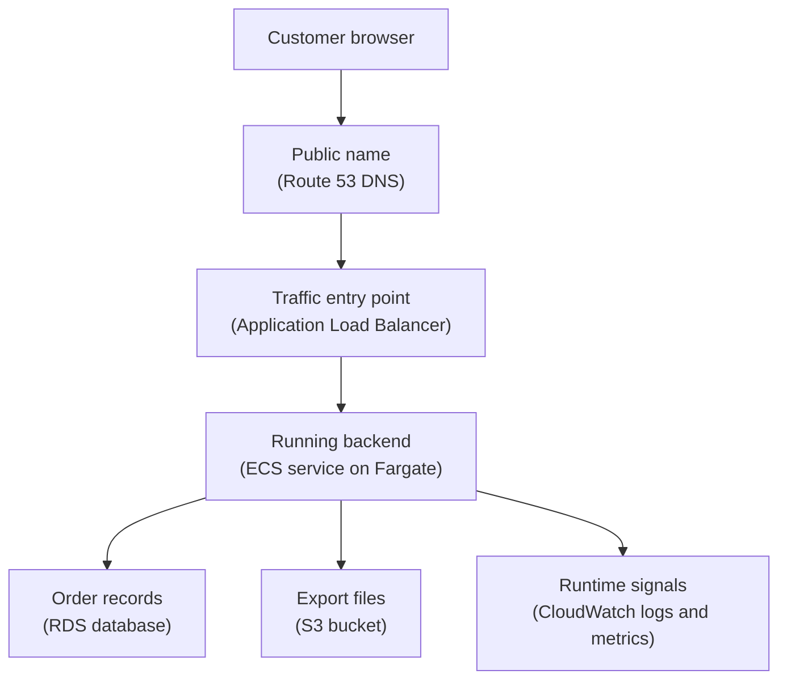
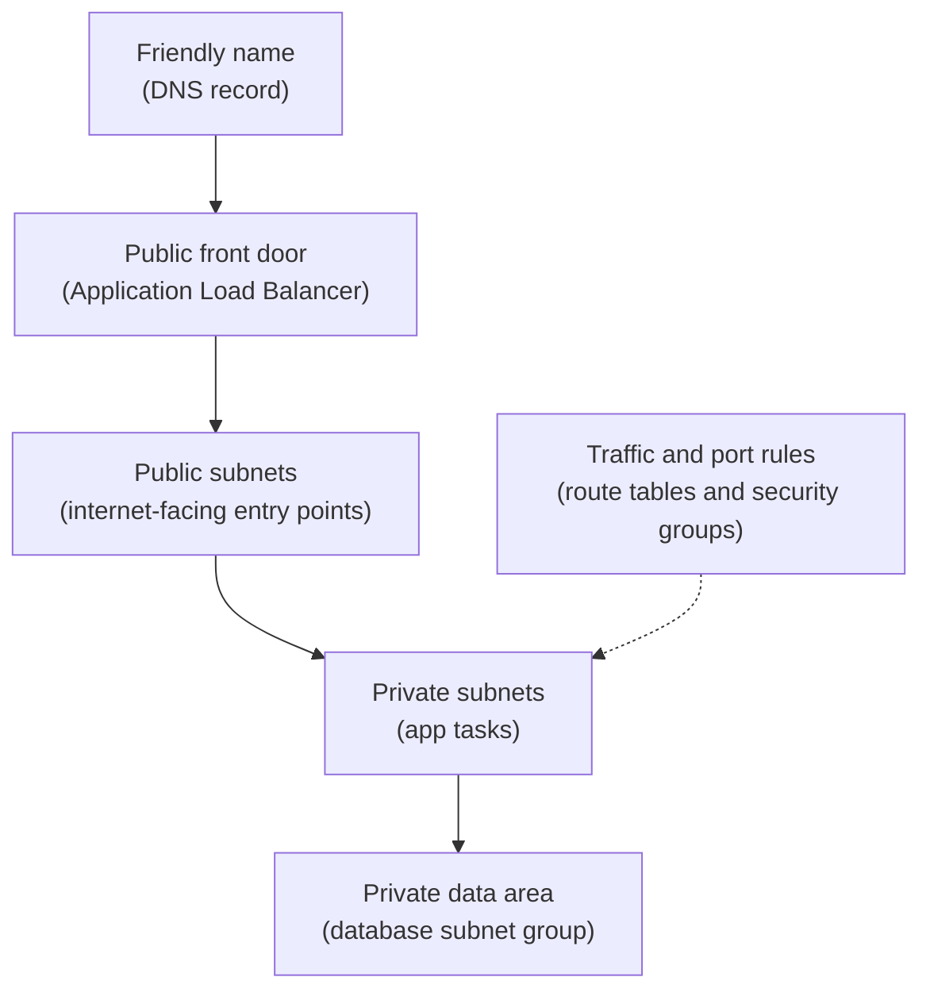

## Table of Contents

1. [The Job-Based Map](#the-job-based-map)
2. [The Running Example](#the-running-example)
3. [Traffic: Names, Networks, And Entry Points](#traffic-names-networks-and-entry-points)
4. [Compute: Where The Code Runs](#compute-where-the-code-runs)
5. [Data: Files, Volumes, And Databases](#data-files-volumes-and-databases)
6. [Access: Who Can Touch What](#access-who-can-touch-what)
7. [Signals: How You Know It Is Working](#signals-how-you-know-it-is-working)
8. [Operations: Images, Secrets, Deployments, And Health](#operations-images-secrets-deployments-and-health)
9. [Cost And Resilience: Small Choices Before Traffic Grows](#cost-and-resilience-small-choices-before-traffic-grows)
10. [Debugging With The Map](#debugging-with-the-map)

## The Job-Based Map

When you first look at AWS, the service list can feel like a wall of names before you know what problem you are solving.
That is a normal beginner feeling.
The trick is not to memorize every service.
The trick is to ask what job a service is doing in the system.

A core services map is a practical way to group AWS services by job.
It answers questions like:
where does traffic enter, where does code run, where does data live, who is allowed to touch it, and how do we know it is healthy?
The formal AWS names matter, but they come second.
The plain-English job comes first.

This map exists because real cloud systems are made from cooperating parts.
Your laptop can run a backend, write files, print logs, and connect to a database in one place.
AWS splits those responsibilities into separate managed resources.
That split is helpful, but only if you can see how the pieces fit together.

The map fits after the earlier foundation articles.
You already learned that AWS work happens inside accounts and Regions, that resources have names and ARNs, and that managed services still need owners.
Now we are placing the first major service families on that mental map.

The running example is `devpolaris-orders-api`, a small backend for checkout traffic.
We will not design an advanced production platform.
We will sketch a first useful backend architecture and learn the question each AWS service helps answer.

> Do not ask, "Should I use EC2, ECS, Lambda, RDS, or S3?" first. Ask, "What job needs doing?"

Here is the whole article in one table.
You will see the same services again later, but this first view keeps them at map level.

| Job In The System | Beginner Question | Common AWS Services |
|-------------------|-------------------|---------------------|
| Connectivity | How do users and services reach each other? | VPC, subnets, route tables, load balancer, Route 53 |
| Compute | Where does the application code run? | EC2, ECS with Fargate, Lambda |
| Storage and databases | Where do files, disks, and records live? | S3, EBS, EFS, RDS, DynamoDB |
| Identity and security | Who or what can call this API? | IAM users, roles, policies |
| Observability | What is happening right now? | CloudWatch metrics, logs, alarms |
| Deployment operations | How does a new version start safely? | ECR, ECS task definitions, Secrets Manager, health checks |
| Cost and resilience | What does this cost, and what can fail? | AWS Budgets, backups, multi-AZ design |

Notice what this table does not do.
It does not say "S3 is better than RDS" or "Lambda is better than ECS."
Those are different tools for different jobs.
The beginner mistake is comparing service names before comparing the job.

## The Running Example

The `devpolaris-orders-api` team owns a Node.js service.
It receives checkout requests, validates the cart, stores an order record, and sometimes writes an export file for finance.
The team wants a simple first AWS shape for production.

In ordinary words, the service needs these pieces:

```text
public name
  -> traffic entry point
  -> running backend
  -> database for orders
  -> file storage for exports
  -> logs, metrics, alarms
  -> permissions around every action
```

In AWS words, that might become:

```text
Route 53
  -> Application Load Balancer
  -> ECS service running on Fargate
  -> RDS database
  -> S3 bucket
  -> CloudWatch
  -> IAM roles and policies
```

That translation is the whole point of this article.
The AWS names are not random.
Each one carries one responsibility in the system.

Here is the first architecture map.
Read it top to bottom.
It shows customer traffic first, then the main things the backend touches while handling a request.



Three supporting responsibilities sit around that path:

| Responsibility | AWS Service | Why It Stays Outside The Traffic Path |
|----------------|-------------|---------------------------------------|
| Access checks | IAM roles and policies | They decide what the backend may call, not where customer requests flow. |
| Release package | ECR image and ECS task definition | They tell ECS what to run when the service starts or deploys. |
| Guardrails | Budgets and backups | They help the team notice spend and recover data when operations go wrong. |

This is not the only good design.
You could run the backend on EC2.
You could use Lambda for smaller event-driven jobs.
You could choose DynamoDB instead of RDS if the data access pattern fits a key-value style.
The map is not a final answer.
It is a way to make better first questions.

For this article, keep one test in your head:

```text
If checkout returns an error, which box should I inspect first?
```

That question keeps the map practical.
Architecture is not just drawing boxes.
It is deciding where evidence will appear when something breaks.

## Traffic: Names, Networks, And Entry Points

Traffic is the first job because users cannot call a service they cannot reach.
Before AWS service names appear, think about three ordinary ideas:
a human-friendly name, a private traffic area, and a front door for requests.

The human-friendly name is DNS (Domain Name System, the system that turns names like `api.devpolaris.com` into network destinations).
In AWS, Route 53 can register domains, host DNS records, route traffic, and run health checks.
For `devpolaris-orders-api`, Route 53 might hold a record for `orders.devpolaris.com`.

The private traffic area is a VPC (Virtual Private Cloud, a logically isolated network dedicated to your AWS account).
A VPC is where you place many networked resources.
Inside it are subnets, which are smaller IP address ranges where resources actually launch.
Route tables decide where subnet traffic goes.

The front door is usually a load balancer for a web backend.
An Application Load Balancer receives HTTP or HTTPS requests, checks which backend targets are healthy, and sends traffic to those targets.
The load balancer keeps the public entry point separate from the app tasks behind it.

For a beginner, this is the traffic map:



The diagram does not show every AWS networking detail.
It shows the job split.
DNS gives users a name.
The load balancer receives traffic.
Subnets place resources into smaller network areas.
The dotted side check combines route tables and security groups so the map does not repeat the same rule beside every subnet.
Route tables decide where packets can go, and security groups act like resource-level firewall rules.

The public/private subnet idea is worth slowing down for.
A public subnet is not public because every resource inside it is magically open.
It is public because its route table has a route to an internet gateway.
A private subnet does not have that direct inbound path from the internet.

That distinction helps you design the first safe shape:
the load balancer sits in public subnets because users must reach it.
The app tasks sit in private subnets because users should not call tasks directly.
The database sits deeper, reachable only from the app security group.

Here is the traffic table for `devpolaris-orders-api`:

| Piece | Plain Job | AWS Term | First Check When It Breaks |
|-------|-----------|----------|-----------------------------|
| `orders.devpolaris.com` | Name users type | Route 53 record | Does DNS point to the load balancer? |
| Public front door | Receive HTTP requests | Application Load Balancer | Are targets healthy? |
| Private network | Hold service resources | VPC | Are resources in the expected VPC? |
| Smaller network areas | Place resources by exposure | Subnets | Public or private route table? |
| Traffic rules | Allow only needed ports | Security groups | Is the source allowed? |

The important habit is not "memorize VPC."
The habit is "find the path."
When a request fails, you want to know whether the name, front door, network route, or port rule stopped it.

## Compute: Where The Code Runs

Compute means the place where your code actually executes.
For a backend service, this is where Node.js handles HTTP requests, reads environment variables, talks to the database, and writes logs.

AWS gives you several compute choices.
At this level, you only need the beginner decision shape:
do you want a server you manage, a container service that runs your image, or a function that runs in response to events?

Amazon EC2 is a virtual server.
You choose an instance type, operating system image, storage, network placement, and security rules.
EC2 feels close to a Linux server you would SSH into.
That control is useful when you need custom system setup, long-running processes, or a familiar VM model.

Amazon ECS (Elastic Container Service) runs containers.
A container is a packaged application process with its dependencies, like a Docker image built from `devpolaris-orders-api`.
With Fargate, AWS manages the server capacity behind the ECS task, so the team focuses more on the container image, CPU, memory, environment, networking, logs, and desired task count.

AWS Lambda runs function code in response to events.
It is useful for small units of work such as resizing an uploaded image, reacting to a queue message, or handling a lightweight API route.
It is not the default mental model for a long-running containerized web service, although many teams do build APIs with Lambda and API Gateway.

Use this table as a first-pass decision guide:

| Compute Choice | Plain Meaning | Good First Use | What You Still Own |
|----------------|---------------|----------------|--------------------|
| EC2 | A virtual server | You need OS-level control | Patching, process manager, scaling plan, disk care |
| ECS on Fargate | Run containers without managing EC2 hosts | You already package the app as a container | Image, task definition, CPU/memory, networking, health |
| Lambda | Run code when an event arrives | Small event or request handlers | Function code, timeout behavior, permissions, logs |

For `devpolaris-orders-api`, ECS on Fargate is a clean teaching example.
The team builds a container image.
ECS starts tasks from that image.
The load balancer sends requests to healthy tasks.
CloudWatch receives the logs.

That does not make ECS "the best" choice.
It makes ECS a good fit for this job:
run a containerized backend as a service.

The compute decision always has a tradeoff.
EC2 gives more direct control, but you own more server operation.
Fargate removes host management, but you work inside the ECS task model.
Lambda removes long-running server thinking, but your code must fit the event and execution model.

The beginner version of the decision is enough for now:

```text
Need a whole server?
  Think EC2.

Have a containerized service?
  Think ECS with Fargate.

Have a small event-driven job?
  Think Lambda.
```

Later modules can add deeper choices like autoscaling, deployment strategies, queue workers, and platform ownership.
For now, keep the job clear:
compute is where code runs.

## Data: Files, Volumes, And Databases

Data is where beginners often compare the wrong things.
S3, EBS, EFS, RDS, and DynamoDB are all "storage" in a broad sense.
They do very different jobs.

Start with the shape of the data.
Is it a file you store and fetch by name?
Is it a disk attached to one server?
Is it a shared filesystem?
Is it structured relational data with SQL queries?
Is it key-value or document data where access patterns are known?

Amazon S3 is object storage.
An object is a file plus metadata, stored inside a bucket and found by a key.
For `devpolaris-orders-api`, S3 is a good place for generated exports like `exports/2026-05/orders.csv`.
The app does not mount S3 like a normal disk.
It asks S3 to put or get objects.

Amazon EBS is block storage for EC2 instances.
Think of it as a disk volume attached to a virtual server.
It matters when you run servers that need persistent disk storage.
For an ECS Fargate service, you may not think about EBS directly at first.

Amazon EFS is a shared filesystem.
It can be mounted by multiple compute resources that need shared file access.
It is useful for some legacy or file-sharing workloads, but it is not the first choice for storing order records.

Amazon RDS is a managed relational database service.
Relational means tables, rows, columns, constraints, and SQL queries.
For orders, payments, customers, and checkout state, this is often the most familiar first model because the data has relationships and transactional rules.

Amazon DynamoDB is a managed NoSQL database.
NoSQL here means the data is usually accessed by key-value or document patterns instead of flexible SQL joins.
It can be a good fit when the access pattern is clear, such as "fetch cart by customer ID" or "read order summary by order ID."
It is less friendly if the team keeps discovering new ad hoc relational queries every week.

Here is the service map for data:

| Data Shape | Plain Job | AWS Service | Beginner Fit For Orders API |
|------------|-----------|-------------|------------------------------|
| Export file | Store and fetch objects by key | S3 | CSV exports and generated reports |
| Server disk | Persistent block volume | EBS | EC2-based services that need a disk |
| Shared files | Filesystem mounted by many clients | EFS | Shared file workloads, not default order data |
| Relational records | SQL tables and transactions | RDS | Orders, customers, payment records |
| Key-based records | Known lookup patterns | DynamoDB | Carts, sessions, event status, simple order reads |

The table is not telling you to use every service.
A first backend might only need RDS and S3.
That is healthy.
Cloud design is not a collection game.

The decision usually comes from the question your app asks.
If the code says "save this CSV and let finance download it later," S3 fits.
If the code says "create an order and its line items in one transaction," RDS fits.
If the code says "read this user's cart by one known key at high volume," DynamoDB might fit.

The failure mode is treating all data as the same kind of storage.
Putting relational order data into object files makes querying painful.
Putting generated exports into a relational table can make simple file delivery awkward.
Mounting a shared filesystem because it feels familiar can hide better object-storage or database choices.

Ask the data question before the service question:

> Is this a file, a disk, a shared filesystem, a relational record, or a key-based item?

## Access: Who Can Touch What

Every AWS action has a caller.
The caller might be a human in the Console, a CLI command on your laptop, a CI/CD pipeline, an ECS task, or another AWS service.
IAM (Identity and Access Management, AWS's access rule system) decides what that caller can do.

This matters because cloud services talk to each other all the time.
The `devpolaris-orders-api` container may need to read a database password, write an object to S3, and send logs to CloudWatch.
Those actions should not use a developer's personal access key.
The running service should get its own role.

An IAM role is an identity with permissions that can be assumed by something that needs it.
Unlike a long-lived user password or access key, a role session uses temporary credentials.
For an ECS task, that means the task can receive permissions without baking secrets into the container image.

Keep the IAM model small:

```text
caller
  wants to perform action
  on resource
  under conditions
```

An access decision for `devpolaris-orders-api` might look like this:

```text
caller:   arn:aws:iam::123456789012:role/orders-api-task-role
action:   s3:PutObject
resource: arn:aws:s3:::devpolaris-orders-exports/prod/*
result:   allowed
reason:   task role policy permits writes to that prefix
```

That same task role should not be able to delete every bucket in the account.
It should not be able to read unrelated payroll exports.
It should receive the minimum useful permission for the job.
That is the practical meaning of least privilege.

Beginner IAM errors look scary because the messages are dense.
Read them like a sentence.
They usually tell you who tried, what action failed, and which resource was involved.

```text
An error occurred (AccessDeniedException) when calling the GetSecretValue operation:
User: arn:aws:sts::123456789012:assumed-role/orders-api-task-role/ecs-task
is not authorized to perform: secretsmanager:GetSecretValue
on resource: arn:aws:secretsmanager:us-east-1:123456789012:secret:orders/prod/db-password
```

The fix is not "make the app admin."
The fix is to answer four questions:
which role is the app using, which action is missing, which secret is it reading, and should this app really read that secret?

IAM is a map layer, not a service you add at the end.
It touches compute, storage, databases, deployments, logs, and cost tools.
If a service does anything in AWS, ask which identity it uses.

## Signals: How You Know It Is Working

A cloud service without signals is uncomfortable to operate.
You can deploy it, but you cannot easily tell whether it is healthy.
You need logs, metrics, and alarms before the first real incident.

CloudWatch is the first AWS observability service most beginners meet.
CloudWatch metrics are numeric measurements over time, such as request count, CPU use, memory use, database connections, or load balancer 5xx errors.
CloudWatch Logs stores log events in log groups and log streams.
Alarms watch metrics and notify you or trigger an action when a threshold is reached for a period of time.

For `devpolaris-orders-api`, a useful first signal set might be:

| Signal | Plain Question | Where It Might Appear |
|--------|----------------|-----------------------|
| App logs | What did the service say happened? | CloudWatch Logs group `/ecs/orders-api` |
| Load balancer 5xx | Is the front door returning server errors? | CloudWatch metrics for the load balancer |
| Target health | Does the load balancer see healthy tasks? | Target group health checks |
| CPU and memory | Are tasks close to their limits? | ECS or Container Insights metrics |
| Database connections | Is the app exhausting DB connections? | RDS metrics |

The point is not to create dozens of alarms on day one.
The point is to choose signals that match the architecture map.
If traffic enters through a load balancer, watch the load balancer.
If code runs in ECS tasks, watch task health and logs.
If orders live in RDS, watch the database signals that would block checkout.

A healthy snapshot might look like this:

```text
service: devpolaris-orders-api
region: us-east-1

route53 record:
  orders.devpolaris.com -> orders-api-alb-123.us-east-1.elb.amazonaws.com

target group:
  healthy targets: 2
  unhealthy targets: 0

ecs service:
  desired tasks: 2
  running tasks: 2

cloudwatch:
  log group: /ecs/orders-api
  latest app log: 2026-05-02T10:24:11Z GET /health 200
```

That snapshot teaches a debugging path.
You do not start with "AWS is down."
You check the name, front door, targets, tasks, and logs.

Here is the first failure shape:

```text
customer symptom:
  GET https://orders.devpolaris.com/checkout returns 503

load balancer target group:
  healthy targets: 0
  unhealthy targets: 2

latest app log:
  2026-05-02T10:31:04Z ERROR failed to connect to database
  detail: password authentication failed for user "orders_app"
```

The load balancer is doing its job.
It is telling you the backend targets are not healthy.
The app log then points to the next box in the map:
the app cannot connect to the database.

That is why observability belongs in the service map.
It turns a vague outage into a sequence of smaller checks.

## Operations: Images, Secrets, Deployments, And Health

Running a backend is not only "choose compute."
You also need a way to ship new versions, pass configuration safely, and decide whether a new task should receive traffic.
Those are runtime operations.

For a containerized `devpolaris-orders-api`, the image usually goes into ECR (Elastic Container Registry, AWS's managed container image registry).
ECR stores the container image that ECS will pull when starting a task.
The image should contain the application code and dependencies, not production secrets.

ECS uses a task definition as the blueprint for running the container.
The task definition says which image to run, how much CPU and memory to request, which port the container listens on, which role the task uses, which logs driver to use, and which environment values or secrets should be available.

A small task definition snapshot might look like this:

```json
{
  "family": "orders-api",
  "networkMode": "awsvpc",
  "requiresCompatibilities": ["FARGATE"],
  "cpu": "512",
  "memory": "1024",
  "executionRoleArn": "arn:aws:iam::123456789012:role/orders-api-execution-role",
  "taskRoleArn": "arn:aws:iam::123456789012:role/orders-api-task-role",
  "containerDefinitions": [
    {
      "name": "orders-api",
      "image": "123456789012.dkr.ecr.us-east-1.amazonaws.com/orders-api:2026-05-02.3",
      "portMappings": [{ "containerPort": 3000 }],
      "secrets": [
        {
          "name": "DATABASE_URL",
          "valueFrom": "arn:aws:secretsmanager:us-east-1:123456789012:secret:orders/prod/database-url"
        }
      ],
      "logConfiguration": {
        "logDriver": "awslogs",
        "options": {
          "awslogs-group": "/ecs/orders-api",
          "awslogs-region": "us-east-1",
          "awslogs-stream-prefix": "ecs"
        }
      }
    }
  ]
}
```

Do not try to memorize every field.
Read it by job.
The image says what code to run.
CPU and memory say what resources the task needs.
The task role says what the app can do in AWS.
The secret points to sensitive configuration.
The log configuration says where the app writes evidence.

Secrets need special care.
AWS Secrets Manager can store credentials and other sensitive values.
ECS can inject a secret into a container when the task starts.
That is better than putting the password into Git, a Docker image, or a plain environment file on a developer laptop.

There is an important operational detail:
if the secret changes after a task starts, the already-running container does not magically receive the new value.
You need to start new tasks, often by forcing a new ECS deployment.
That is the kind of small fact that prevents long debugging sessions.

Health checks are the final gate before traffic.
The Application Load Balancer periodically calls a configured path, often `/health`.
A task should only receive real traffic after it passes the health check.

For a small backend, the health endpoint should test what the request path truly needs, but not do expensive work.
A useful first `/health` might confirm the process is alive and can reach required dependencies.
If the database is required for checkout, a database connection failure should make the target unhealthy.

The operational chain looks like this:

```text
build image
  -> push image to ECR
  -> register new ECS task definition revision
  -> update ECS service
  -> start new tasks
  -> pass health checks
  -> receive traffic
```

Each arrow is a place where a deployment can fail.
That is not bad.
It gives you evidence.
If the image push fails, look at ECR permissions or repository names.
If tasks fail to start, look at task definition, image pull, CPU/memory, secrets, and subnet settings.
If health checks fail, look at app logs and the health endpoint.

## Cost And Resilience: Small Choices Before Traffic Grows

Cost and resilience are not advanced topics.
They belong in the first map because every AWS resource has an owner, a bill, and a failure shape.

AWS Budgets can track cost and usage and notify you when spending crosses a threshold you set.
For beginners, a budget is not about perfect forecasting.
It is an early smoke alarm.
If the dev account suddenly spends more than expected, the team should know before the month ends.

A small team might start with this budget plan:

| Budget | Scope | Why It Exists |
|--------|-------|---------------|
| `devpolaris-dev-monthly` | Dev account monthly cost | Catch experiments left running |
| `orders-prod-monthly` | Production account or service tags | Notice traffic or resource growth |
| `orders-data-transfer` | Data transfer usage | Catch unexpected public traffic patterns |

Budgets do not replace design thinking.
They tell you when the design is costing more than expected.
Tags make this much easier because the bill can be grouped by service, environment, or owner.

Resilience means the service can handle some failures without becoming unavailable or losing important data.
For this first architecture, the main beginner idea is Multi-AZ thinking.
An Availability Zone is a failure boundary inside a Region.
If every important piece depends on one zone, one local problem can stop the service.

Multi-AZ thinking does not mean "make everything global."
It means you ask where single points of failure are hiding.

```text
weak shape:
  one app task
  one subnet
  one database instance
  no tested restore path

better first production shape:
  at least two app tasks
  subnets in at least two Availability Zones
  database option that fits the team's recovery needs
  backup plan and restore test
```

Backups are part of resilience.
AWS Backup can centralize and automate backup policies across supported services.
Some services also have their own backup features, such as database snapshots.
The important beginner rule is simple:
a backup you never test is a hope, not a recovery plan.

For `devpolaris-orders-api`, the first resilience checklist might be:

| Question | Good Beginner Answer |
|----------|----------------------|
| Can one app task die? | ECS starts another task and the load balancer avoids unhealthy targets |
| Can one Availability Zone have trouble? | App tasks run across more than one AZ |
| Can the database be restored? | Backups exist and the team has tested restore steps |
| Can someone notice cost drift? | Budgets notify the owner before surprise spend grows |
| Can someone find service resources? | Tags include `service=orders-api`, `env=prod`, and `owner=checkout` |

The tradeoff is cost versus protection.
More replicas, backups, logs, and multi-AZ resources usually cost more than a single tiny resource.
Less protection is cheaper until a failure happens.
The engineering decision is to match the protection to the importance of the service.

For checkout, downtime and lost order data matter.
That does not mean the first version needs every advanced pattern.
It means the team should know which risks it is accepting.

## Debugging With The Map

The service map becomes most useful when something breaks.
Beginners often start by clicking around the Console at random.
Senior engineers usually start with the path of the request and the last known healthy signal.

Use the boxes from the architecture diagram as a checklist:

```text
1. Name: does DNS resolve to the expected load balancer?
2. Entry point: is the load balancer reachable?
3. Health: does the target group have healthy targets?
4. Compute: is the ECS service running the desired task count?
5. App logs: what changed in CloudWatch around the failure time?
6. Data: can the app reach RDS or S3?
7. Access: did IAM deny a needed action?
8. Cost and limits: did a quota, budget alarm, or resource setting change behavior?
```

Here is a realistic debug snapshot for `devpolaris-orders-api`:

```text
incident:
  checkout requests return 503 after release 2026-05-02.3

dns:
  orders.devpolaris.com resolves to the expected load balancer

load balancer:
  target group orders-api-prod
  healthy targets: 0
  reason: Health checks failed with code 500

ecs:
  desired tasks: 2
  running tasks: 2
  latest task definition: orders-api:42

cloudwatch logs:
  2026-05-02T10:31:04Z ERROR database connection failed
  2026-05-02T10:31:04Z detail secret "orders/prod/database-url" not found

likely next check:
  Does orders-api-task-role have permission to read the expected secret ARN?
  Did the task definition point to the right secret name in us-east-1?
```

The useful thing about this snapshot is the order.
DNS works, so you move forward.
The load balancer is reachable, but targets are unhealthy.
ECS tasks are running, so the task process started.
CloudWatch logs show the app cannot find its database secret.
Now the problem is no longer "AWS."
It is either secret naming, Region, or IAM permission.

Here is another failure shape:

```text
incident:
  finance export job says "upload complete"
  finance cannot find the CSV file in S3

map checks:
  compute: did the task run the export code?
  access: did S3 PutObject succeed or fail?
  storage: which bucket and key did the app write?
  region/account: is finance looking in the same account and Region?

log clue:
  2026-05-02T11:08:19Z INFO uploaded export
  bucket=devpolaris-orders-export
  key=prod/2026-05/orders.csv

likely correction:
  The app wrote to devpolaris-orders-export, but the documented bucket is devpolaris-orders-exports.
  Fix the environment value and add a startup check that prints the configured bucket name.
```

This second example is intentionally plain.
Many cloud bugs are not deep AWS mysteries.
They are name, Region, account, permission, and configuration mistakes.
The map helps you find them calmly.

When you learn the later AWS modules, keep bringing every service back to the same question:

> What job is this service doing in the system, and what evidence will it give me when that job fails?

That question is the bridge from beginner vocabulary to practical cloud engineering.
It keeps AWS from becoming a pile of product names.
It turns the product list into an operating map.

---

**References**

- [How Amazon VPC works](https://docs.aws.amazon.com/vpc/latest/userguide/how-it-works.html), [What is Amazon Route 53?](https://docs.aws.amazon.com/Route53/latest/DeveloperGuide/Welcome.html), and [Health checks for Application Load Balancer target groups](https://docs.aws.amazon.com/elasticloadbalancing/latest/application/target-group-health-checks.html) - Official networking references for VPCs, subnets, route tables, DNS routing, and load balancer target health.
- [What is Amazon EC2?](https://docs.aws.amazon.com/AWSEC2/latest/UserGuide/concepts.html), [Amazon ECS task definitions](https://docs.aws.amazon.com/AmazonECS/latest/developerguide/task_definitions.html), and [How Lambda works](https://docs.aws.amazon.com/lambda/latest/dg/concepts-basics.html) - Official compute references for virtual servers, container task blueprints, and event-run functions.
- [What is Amazon S3?](https://docs.aws.amazon.com/AmazonS3/latest/userguide/Welcome.html), [What is Amazon RDS?](https://docs.aws.amazon.com/AmazonRDS/latest/UserGuide/Welcome.html), and [What is Amazon DynamoDB?](https://docs.aws.amazon.com/amazondynamodb/latest/developerguide/Introduction.html) - Official storage and database references for object storage, relational databases, and key-value/document databases.
- [IAM roles](https://docs.aws.amazon.com/IAM/latest/UserGuide/id_roles.html), [What is Amazon ECR?](https://docs.aws.amazon.com/AmazonECR/latest/userguide/what-is-ecr.html), and [Pass Secrets Manager secrets through Amazon ECS environment variables](https://docs.aws.amazon.com/AmazonECS/latest/developerguide/secrets-envvar-secrets-manager.html) - Official references for runtime identity, image storage, and injecting secrets into ECS tasks.
- [Metrics in Amazon CloudWatch](https://docs.aws.amazon.com/AmazonCloudWatch/latest/monitoring/working_with_metrics.html) and [Working with log groups and log streams](https://docs.aws.amazon.com/AmazonCloudWatch/latest/logs/Working-with-log-groups-and-streams.html) - Official observability references for metrics, alarms, log groups, and log streams.
- [Creating a budget](https://docs.aws.amazon.com/cost-management/latest/userguide/budgets-create.html) and [What is AWS Backup?](https://docs.aws.amazon.com/aws-backup/latest/devguide/whatisbackup.html) - Official cost and resilience references for budget alerts and centralized backup policies.
