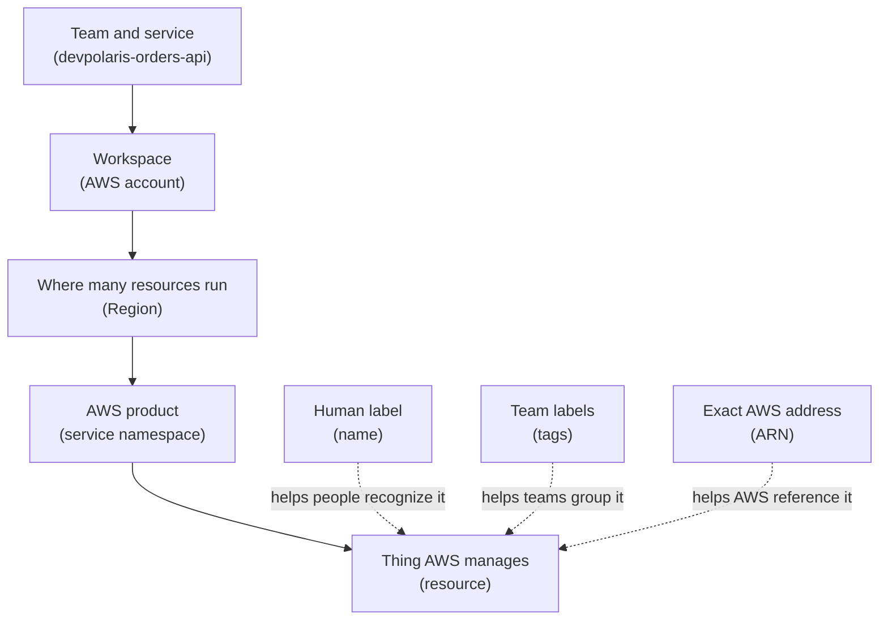

## Table of Contents

1. [The Labels That Keep AWS Understandable](#the-labels-that-keep-aws-understandable)
2. [Names, IDs, and ARNs Are Different Jobs](#names-ids-and-arns-are-different-jobs)
3. [Read an ARN From Left to Right](#read-an-arn-from-left-to-right)
4. [Account and Region Checks](#account-and-region-checks)
5. [Tags Turn Resources Into Team Inventory](#tags-turn-resources-into-team-inventory)
6. [A Naming and Tagging Plan](#a-naming-and-tagging-plan)
7. [Tags for Cost, Security, and Cleanup](#tags-for-cost-security-and-cleanup)
8. [Failure Modes You Will Actually See](#failure-modes-you-will-actually-see)
9. [The Review Habit](#the-review-habit)

## The Labels That Keep AWS Understandable

When a team starts using AWS, the first hard problem is often not creating a resource.
It is knowing which resource you are looking at later.
A cloud account can fill up with buckets, databases, log groups, roles, queues, alarms, and test resources faster than you expect.
If those things have weak names and missing tags, the team slowly loses confidence.
Nobody wants to delete `test-2` because nobody knows whether `test-2` is safe to delete.

This article is about the three labels you will meet again and again in AWS:
names, tags, and Amazon Resource Names (ARNs).
A name is the human-friendly label you type or see in the console.
A tag is a key-value label that helps your team sort resources by service, owner, environment, cost, or cleanup rule.
An ARN is the formal AWS identifier that permissions, logs, APIs, and automation use when they need to point at one exact resource.

Those three labels exist because people and machines need different levels of precision.
A human wants to see `orders-api-prod`.
A finance report wants to group all resources tagged `service=devpolaris-orders-api`.
An IAM policy (Identity and Access Management policy, meaning an AWS permission document) may need the exact string for one ECS service, one S3 bucket, or one IAM role.

These labels fit into the AWS map you already saw in the earlier foundation articles.
The account is the workspace.
The Region is where many resources run.
The service is the AWS product, such as ECS, S3, CloudWatch, or IAM.
The resource is the thing that service manages for you.
Names, tags, and ARNs sit on top of that map so humans, reports, and permission checks can talk about the same thing.

We will use one running example:
the `devpolaris-orders-api` team is preparing a small production setup.
The service has an ECS service for the backend, a CloudWatch log group for app logs, an S3 bucket for exports, and an IAM role used by the running app.
The article will show how to name those resources, tag them, read their ARNs, and diagnose mistakes when a permission or cleanup task points at the wrong thing.



Read the solid path first.
It says where the thing lives.
The dotted links are not extra places where the resource runs.
They are different ways to label or reference the same resource.

> A good AWS label answers a boring question before it becomes an expensive question.

## Names, IDs, and ARNs Are Different Jobs

The first beginner trap is treating every identifier as if it means the same thing.
In AWS, similar-looking strings often serve different jobs.
A resource name helps a human recognize the thing.
A resource ID is often generated by AWS so the service can track the thing safely.
An ARN is the full AWS reference used when a policy, log, or API needs precision across services, accounts, and Regions.

Think about a database table in an app you already know.
The row might have a display name, a primary key, and a full URL in an admin screen.
Those are related, but you would not use them interchangeably.
The display name is for humans.
The primary key is for the database.
The URL tells your browser exactly where to go.
AWS labels work in a similar way.

For `devpolaris-orders-api`, the production app might use labels like this:

| Thing | Example | Main job |
|-------|---------|----------|
| Human name | `orders-api-prod` | Helps the team recognize the resource |
| AWS-generated ID | `vpc-0b1c2d3e4f5a67890` | Lets one AWS service track a specific object |
| Tag | `service=devpolaris-orders-api` | Groups related resources across services |
| ARN | `arn:aws:ecs:us-east-1:123456789012:service/devpolaris-prod/orders-api-prod` | Identifies a resource for policies and APIs |

The name is useful, but it is not always globally unique.
Two accounts can contain similar names.
Two Regions can contain similar names.
Staging and production can both have a resource called `orders-api`.
That does not mean they are the same resource.
The account, Region, service, and resource identifier tell the full story.

The AWS-generated ID is useful, but it is often not friendly.
If a security group is called `sg-0d12a34b56c789012`, you probably cannot tell whether it belongs to checkout, billing, or a developer experiment.
That is why names and tags still matter.
They add human meaning around IDs that are safe for machines but hard for people.

An ARN is the identifier you should slow down and read during permissions work.
It often appears in IAM policies, access denied messages, audit logs, and deployment tools.
AWS documentation describes ARN formats as service-specific, which is important.
The general shape is consistent, but the resource part can be a name, an ID, a path, or a service-specific string.
You should learn the habit of reading an ARN, then checking the service documentation when the resource segment is unfamiliar.

Here is a realistic snapshot from the AWS CLI:

```bash
$ aws ecs describe-services \
>   --cluster devpolaris-prod \
>   --services orders-api-prod \
>   --region us-east-1 \
>   --query 'services[0].{name:serviceName,arn:serviceArn,status:status}'
{
  "name": "orders-api-prod",
  "arn": "arn:aws:ecs:us-east-1:123456789012:service/devpolaris-prod/orders-api-prod",
  "status": "ACTIVE"
}
```

The `name` field is the label the team chose.
The `arn` field is the exact AWS reference.
The `status` field tells you the service exists and is active.
If a policy or deploy script talks about this ECS service, the ARN is the string you compare carefully.

## Read an ARN From Left to Right

An Amazon Resource Name looks noisy until you split it into pieces.
The usual mental model is:
partition, service, Region, account, then resource.
The partition is the larger AWS partition, such as standard AWS Regions, China Regions, or AWS GovCloud (US) Regions.
Most beginner examples use the standard `aws` partition.
The service is the AWS product namespace, such as `ecs`, `logs`, `s3`, or `iam`.
The Region and account tell you where the resource belongs when that service uses those fields.
The resource segment is the service-specific part at the end.

```text
arn:aws:ecs:us-east-1:123456789012:service/devpolaris-prod/orders-api-prod
|   |   |   |         |            |
|   |   |   |         |            resource: service/devpolaris-prod/orders-api-prod
|   |   |   |         account: 123456789012
|   |   |   Region: us-east-1
|   |   service: ecs
|   partition: aws
literal prefix: arn
```

That split gives you a calm reading order.
You do not have to understand the whole string at once.
Ask one small question per segment:
which partition, which service, which Region, which account, which resource?

Not every ARN fills every slot.
Some resources omit the Region, the account ID, or both.
That does not mean the ARN is broken.
It means the service identifies that type of resource differently.
IAM is a global service, so IAM role ARNs often have an empty Region field.
S3 bucket ARNs commonly omit both Region and account fields in the ARN string.

Compare these examples:

| Resource | ARN | What to notice |
|----------|-----|----------------|
| ECS service | `arn:aws:ecs:us-east-1:123456789012:service/devpolaris-prod/orders-api-prod` | Has service, Region, account, and resource path |
| CloudWatch log group | `arn:aws:logs:us-east-1:123456789012:log-group:/ecs/devpolaris-orders-api-prod` | The resource includes `log-group:` and the log group path |
| S3 bucket | `arn:aws:s3:::devpolaris-orders-api-prod-exports` | Empty Region and account fields are normal for this ARN shape |
| IAM role | `arn:aws:iam::123456789012:role/devpolaris-orders-api-task-role` | Empty Region field is normal for IAM |

The resource segment is where many beginners get surprised.
Sometimes it uses slashes.
Sometimes it uses colons.
Sometimes it contains a generated ID.
Sometimes it contains a name you chose.
AWS services define their own resource shapes, so do not invent an ARN by guessing unless you are very sure.
It is safer to copy the ARN from the resource detail page, CLI output, Terraform state, CloudFormation output, or the official service documentation.

This is also where wildcards become useful and dangerous.
In an IAM policy `Resource` element, `*` can match many resources.
That is convenient when a service does not support resource-level permissions, or when a carefully bounded pattern is acceptable.
It is risky when the wildcard is wider than the team intended.

These two resource patterns feel similar, but they do not carry the same risk:

```json
{
  "narrow": "arn:aws:s3:::devpolaris-orders-api-prod-exports/*",
  "broad": "arn:aws:s3:::devpolaris-*"
}
```

The first pattern talks about objects inside one bucket.
The second pattern can match any bucket whose name starts with `devpolaris-`, depending on the action and policy context.
That may include staging, production, experiments, and old resources.
When you see a wildcard, ask what else it could match six months from now.

## Account and Region Checks

Most AWS confusion gets smaller when you check account and Region early.
Names can repeat.
Tags can be missing.
The console can be set to a different Region.
The CLI can be using a profile that points at another account.
Before you debug a missing resource, a denied deploy, or a strange cost report, prove where your tool is looking.

Start with the caller identity.
This tells you which AWS account and identity the CLI is using:

```bash
$ aws sts get-caller-identity
{
  "UserId": "AROAXAMPLEID:github-actions-deploy",
  "Account": "123456789012",
  "Arn": "arn:aws:sts::123456789012:assumed-role/devpolaris-deploy/github-actions-deploy"
}

$ aws configure get region
us-east-1
```

That output is boring in the best way.
It says the deploy job is using account `123456789012`.
It says the default CLI Region is `us-east-1`.
Now you can compare those values with the ARN in the error message or resource detail page.

Imagine the deployment for `devpolaris-orders-api` fails like this:

```text
An error occurred (AccessDeniedException) when calling the UpdateService operation:
User: arn:aws:sts::123456789012:assumed-role/devpolaris-deploy/github-actions-deploy
is not authorized to perform: ecs:UpdateService on resource:
arn:aws:ecs:us-west-2:123456789012:service/devpolaris-prod/orders-api-prod
because no identity-based policy allows the ecs:UpdateService action
```

Do not start by adding more permissions.
Read the message slowly.
The caller is in account `123456789012`.
The denied resource is also in account `123456789012`.
But the resource ARN says `us-west-2`.
If the real production ECS service lives in `us-east-1`, the deploy script may be sending the request to the wrong Region.

That is a very different fix from "grant more access."
The fix may be to set the deployment Region correctly:

```bash
$ aws ecs update-service \
>   --cluster devpolaris-prod \
>   --service orders-api-prod \
>   --force-new-deployment \
>   --region us-east-1
```

The important lesson is not the ECS command.
The lesson is the diagnostic path:
compare caller account, CLI Region, resource ARN account, and resource ARN Region before changing a policy.
Many permission errors are real permission errors.
Some are location errors wearing a permission error costume.

Here is the small checklist I use before changing a policy:

| Check | What you compare | Why it matters |
|-------|------------------|----------------|
| Caller account | `aws sts get-caller-identity` | Proves which workspace you are touching |
| CLI or tool Region | CLI config, deploy env var, console selector | Proves where the request is going |
| ARN account | Account segment inside the ARN | Catches staging versus production mix-ups |
| ARN Region | Region segment inside the ARN | Catches resources that look missing or denied |
| Resource name | Tail of the ARN or detail page | Confirms the exact target |

Senior engineers ask these questions because they save time.
They also protect production.
Adding a broad policy because of a wrong Region is how a small bug becomes a wide permission grant.

## Tags Turn Resources Into Team Inventory

A tag is a key-value label attached to an AWS resource.
AWS uses tags as metadata, which means descriptive data about the resource.
A tag might say `service=devpolaris-orders-api`, `env=prod`, or `owner=checkout`.
The tag does not run your app.
It helps people and tools find, group, bill, secure, and clean up the app's resources.

Tags matter because AWS is organized by service, but teams often work by application.
The console has separate pages for ECS, S3, CloudWatch, IAM, RDS, and many more services.
Your team does not think "today I own some ECS and a little S3."
Your team thinks "we own the orders API."
Tags give AWS a way to answer that team-shaped question.

For the orders API, the useful question is not:
"show me all ECS services."
The useful question is:
"show me everything that belongs to `devpolaris-orders-api` in production."
That crosses service boundaries.
Tags are the glue that makes the cross-service view possible.

AWS tag keys and values are case sensitive.
That means `env=prod`, `Env=prod`, and `environment=production` are three different conventions.
The computer will not understand that your team meant the same thing.
If the team uses inconsistent keys, tag-based search and cost reports become less trustworthy.

A healthy beginner tag set is small and boring:

| Tag key | Example value | Why the team needs it |
|---------|---------------|-----------------------|
| `service` | `devpolaris-orders-api` | Groups all resources for one app |
| `env` | `prod` | Separates dev, staging, and production |
| `owner` | `checkout` | Shows who responds when something breaks |
| `cost-center` | `platform-learning` | Helps billing reports group spend |
| `data-classification` | `internal` | Helps reviewers understand data risk |
| `managed-by` | `terraform` | Shows whether humans should edit it directly |

This set is not magic.
Your organization may use different keys.
The important part is consistency.
Five boring keys used everywhere are better than twenty clever keys used randomly.

Do not put secrets or personal data in tags.
Personal data means anything that identifies a person, such as an email address, phone number, customer name, or support ticket containing private details.
AWS documentation warns that tags are used for billing and administration and are not meant for sensitive information.
Treat tags as visible labels, not a private note field.

This is a safe tag:

```text
owner=checkout
service=devpolaris-orders-api
env=prod
```

This is not a safe tag:

```text
customer-email=alex@example.com
debug-token=eyJhbGciOi...
incident-note=customer card failed on order 9217
```

Tags should make ownership and operations easier without leaking information.
If a tag would make you nervous in a billing report, a screenshot, or a support case, do not use it.

## A Naming and Tagging Plan

Names are still important even when tags and ARNs exist.
A good name helps you scan the console, read a log line, or review a Terraform plan without stopping every few seconds.
The name should tell a human what the resource is for.
The tags should tell the team how the resource fits into ownership, billing, and cleanup.
The ARN should give AWS the exact reference when a machine needs it.

For `devpolaris-orders-api`, a simple naming pattern is:

```text
{service-short}-{env}-{purpose}
```

That gives names like:

| Resource kind | Suggested name | Why it reads well |
|---------------|----------------|-------------------|
| ECS cluster | `devpolaris-prod` | Shared production cluster for DevPolaris services |
| ECS service | `orders-api-prod` | The production backend service |
| Log group | `/ecs/devpolaris-orders-api-prod` | Logs are clearly tied to ECS and the service |
| S3 bucket | `devpolaris-orders-api-prod-exports` | Export bucket for production orders API |
| IAM role | `devpolaris-orders-api-prod-task-role` | Role used by the running app task |

There is a tradeoff here.
Long names carry more meaning, but very long names become hard to read.
Short names are pleasant until several teams create similar resources.
The goal is not to encode every detail into the name.
The goal is to make the name useful at a glance, then let tags carry the structured details.

Here is the matching tag plan:

| Resource | `service` | `env` | `owner` | `managed-by` | `data-classification` |
|----------|-----------|-------|---------|--------------|-----------------------|
| ECS service | `devpolaris-orders-api` | `prod` | `checkout` | `terraform` | `internal` |
| Log group | `devpolaris-orders-api` | `prod` | `checkout` | `terraform` | `internal` |
| S3 exports bucket | `devpolaris-orders-api` | `prod` | `checkout` | `terraform` | `confidential` |
| IAM task role | `devpolaris-orders-api` | `prod` | `checkout` | `terraform` | `internal` |

Notice the S3 exports bucket has a different data classification.
That is not decoration.
If the bucket stores order exports, it may deserve tighter review than a log group or role.
The tag helps humans ask the right question before they change access or lifecycle rules.

If you are creating resources with the AWS CLI, many services let you add tags during creation.
The exact command shape depends on the service, so do not memorize one universal syntax.
The habit is what matters:
create the resource with the minimum useful tags, then verify the tags are present.

Here is a small verification-style example:

```bash
$ aws resourcegroupstaggingapi get-resources \
>   --tag-filters Key=service,Values=devpolaris-orders-api Key=env,Values=prod \
>   --region us-east-1 \
>   --query 'ResourceTagMappingList[].{arn:ResourceARN,tags:Tags}'
[
  {
    "arn": "arn:aws:ecs:us-east-1:123456789012:service/devpolaris-prod/orders-api-prod",
    "tags": [
      { "Key": "service", "Value": "devpolaris-orders-api" },
      { "Key": "env", "Value": "prod" },
      { "Key": "owner", "Value": "checkout" }
    ]
  },
  {
    "arn": "arn:aws:logs:us-east-1:123456789012:log-group:/ecs/devpolaris-orders-api-prod",
    "tags": [
      { "Key": "service", "Value": "devpolaris-orders-api" },
      { "Key": "env", "Value": "prod" },
      { "Key": "owner", "Value": "checkout" }
    ]
  }
]
```

This output proves two things.
The resources exist in `us-east-1`.
They have the tags needed to group them as production orders API resources.
If the output is empty, do not assume the resources are gone.
Check account, Region, resource type support, and tag spelling.

AWS Tag Editor gives you a console path for the same kind of work.
It can search for taggable resources in one or more Regions.
It can include resources that have tags and resources that have no tags.
That is useful when you are cleaning up an account that has grown messy.

## Tags for Cost, Security, and Cleanup

Tags become more valuable when other systems use them.
A tag sitting on a resource is only a label.
A tag used by billing, access rules, dashboards, cleanup jobs, and owner reports becomes part of how the team operates.
That is why tag design is an engineering decision, not just a naming preference.

For cost, AWS cost allocation tags can group spend by tag key after the tags are activated in Billing and Cost Management.
That activation step matters.
If your team tags resources today but never activates the tag key for cost allocation, your cost reports may not show the grouping you expect.
You should still tag resources when you create them, but you also need the billing setup that makes those tags useful in reports.

A monthly cost snapshot might look like this:

```text
Cost view: May 2026 month-to-date
Filter: tag service = devpolaris-orders-api

Service             Environment   Cost
ECS                 prod          $62.40
CloudWatch Logs     prod          $11.08
S3                  prod          $4.73
RDS                 prod          $83.19
Untagged            unknown       $28.44
```

The interesting line is `Untagged`.
It is not automatically a disaster.
Some costs may not support the exact tag view you expected, and some resources may be new.
But it is a useful investigation queue.
If `Untagged` keeps growing, the team may be creating resources without the tag plan.

For security, tags can support access decisions in some IAM designs.
This is often called ABAC (attribute-based access control, meaning access based on labels such as tags rather than only named roles or users).
You do not need to master ABAC today.
The beginner lesson is simpler:
if access rules depend on tags, missing or misspelled tags can become a security and deployment problem.

For example, a team might allow deploy automation to update resources only when they carry `service=devpolaris-orders-api` and `env=prod`.
That kind of rule can reduce accidental changes to unrelated services.
It also means a resource with missing tags may be denied even if its name looks correct.

For cleanup, tags help you distinguish active production resources from temporary experiments.
A safe cleanup system should be conservative.
It should not delete a resource just because the name contains `test`.
Names can lie.
A safer cleanup query might require `env=dev`, `managed-by=terraform`, and `expires-on=2026-05-15`.

Here is a practical cleanup table:

| Cleanup signal | Good use | Risk if missing |
|----------------|----------|-----------------|
| `env=dev` | Limits cleanup to non-production resources | Cleanup job might include staging or prod |
| `owner=checkout` | Shows who to ask before deleting | Nobody knows who can approve deletion |
| `expires-on=2026-05-15` | Gives temporary resources a review date | Experiments live forever |
| `managed-by=terraform` | Tells whether code should remove it | Manual deletion may fight infrastructure code |

The tradeoff is discipline.
Tags add a small amount of work at creation time.
They save much more work during incidents, cost reviews, access reviews, and cleanup.
But they only save that work when the team uses a shared vocabulary.
Random tags create the feeling of organization without the benefit.

## Failure Modes You Will Actually See

The fastest way to learn names, tags, and ARNs is to see how they fail.
These failures are not exotic.
They happen when real teams move quickly, when multiple accounts look similar, or when automation copies a pattern from one place to another.

The first failure is a broad ARN.
A broad ARN usually shows up in a policy review.
The policy might work, but it works by allowing more than the deployment needs.

```json
{
  "Effect": "Allow",
  "Action": "ecs:UpdateService",
  "Resource": "arn:aws:ecs:*:123456789012:service/*"
}
```

This resource pattern says any Region in account `123456789012`, and any ECS service resource that matches the service pattern.
Maybe the deploy job only needs to update `orders-api-prod` in `us-east-1`.
If so, the policy should be narrowed toward the exact service ARN, or at least a much tighter pattern.
The fix direction is not "never use wildcards."
The fix direction is "make every wildcard explain itself."

The second failure is missing tags.
The resource exists, the app works, and the bill arrives.
But the team cannot connect the cost to an owner.

```text
Resource search results

ARN                                                                  service   env    owner
arn:aws:ecs:us-east-1:123456789012:service/devpolaris-prod/orders-api-prod  yes       yes    yes
arn:aws:logs:us-east-1:123456789012:log-group:/ecs/orders-api-temp         no        no     no
arn:aws:s3:::devpolaris-orders-api-prod-exports                            yes       yes    no
```

The diagnosis is simple:
search by expected service and environment tags, then search for resources with no useful tags.
The fix is not only to add the missing tags once.
The better fix is to update the creation path, such as Terraform, CloudFormation, a service template, or a runbook, so future resources are created with the same required tags.

The third failure is duplicate-looking resources.
You see `orders-api-prod` in two places and assume one is wrong.
Then you notice the ARNs:

```text
arn:aws:ecs:us-east-1:123456789012:service/devpolaris-prod/orders-api-prod
arn:aws:ecs:us-east-1:210987654321:service/devpolaris-prod/orders-api-prod
```

The names match.
The accounts do not.
This could be staging versus production, a sandbox copy, or a migration account.
Do not decide based on the name alone.
Check the account ID, tags, and owning team before deleting or changing either resource.

The fourth failure is a wrong account or Region inside a policy.
The policy looks precise, but it points to the wrong place.

```json
{
  "Effect": "Allow",
  "Action": "logs:CreateLogStream",
  "Resource": "arn:aws:logs:us-west-2:123456789012:log-group:/ecs/devpolaris-orders-api-prod:*"
}
```

If the log group lives in `us-east-1`, this permission will not help the app create log streams there.
The error may mention `AccessDenied`, but the root problem is the ARN's Region.
The fix is to correct the ARN, not widen the policy to every Region unless there is a real multi-Region requirement.

The fifth failure is abandoned resources.
An abandoned resource is not always broken.
It may quietly keep costing money, storing data, or holding permissions long after the team forgot it.
The clue is usually a weak name, old creation date, missing owner tag, or tag values that no longer match any current service.

```text
Cleanup review: dev account

Name                         Type          Age       Tags
orders-api-loadtest-2025     log group     231 days  service=devpolaris-orders-api, env=dev
temp-export-bucket           S3 bucket     188 days  env=dev
new-test-role                IAM role      144 days  no useful tags
orders-api-prod              ECS service   12 days   service=devpolaris-orders-api, env=prod, owner=checkout
```

The safe cleanup move is not to delete everything that looks old.
First, separate production from non-production.
Second, identify an owner.
Third, check whether infrastructure code still declares the resource.
Fourth, check whether the resource stores data.
Only then should the team remove it through the same system that created it.

Here is the failure-mode map in plain language:

| Failure | What it feels like | First diagnosis | Safer fix direction |
|---------|--------------------|-----------------|---------------------|
| Broad ARN | Policy passes review poorly | Ask what each wildcard can match | Narrow the ARN or document the reason |
| Missing tags | Cost or owner is unknown | Search by required tag keys | Add tags and fix the creation path |
| Duplicate-looking resources | Two resources seem identical | Compare account, Region, and ARN | Treat names as clues, not identity |
| Wrong account or Region | Access denied or empty search | Compare caller context with ARN | Correct the target before widening access |
| Abandoned resources | Old resources keep costing money | Check tags, age, owner, and code | Delete through the owning workflow |

These failures teach the same habit:
do not trust one label by itself.
Use the name for human recognition, tags for grouping, and ARN for exact AWS identity.

## The Review Habit

Before you grant access, delete a resource, or explain a cost spike, pause for a small review.
This is not ceremony.
It is how you avoid acting on the wrong resource.
The review should fit on one screen and answer the questions that AWS will not answer for you.

For `devpolaris-orders-api`, a careful review might look like this:

```text
Resource review

Human name:        orders-api-prod
Service:           Amazon ECS
Account:           123456789012
Region:            us-east-1
ARN:               arn:aws:ecs:us-east-1:123456789012:service/devpolaris-prod/orders-api-prod
Required tags:      service=devpolaris-orders-api, env=prod, owner=checkout
Managed by:         terraform
Data risk:          internal
Action requested:   allow deploy role to run ecs:UpdateService
```

That review catches the common mistakes.
If the account is wrong, stop.
If the Region is wrong, stop.
If the tags do not match the service and environment, stop and investigate.
If the requested action is wider than the resource needs, narrow it before merging the policy.

A good naming and tagging system gives beginners confidence.
They can look at an error message and know where to start.
They can ask better questions in a review.
They can find the owner of a resource without reading months of chat history.
They can clean up old experiments without guessing.

The deeper lesson is that AWS resources do not become understandable by accident.
They become understandable when the team gives each resource a human name, consistent tags, and precise ARNs in policies and automation.
That small discipline turns a crowded account into a place you can safely operate.

---

**References**

- [Identify AWS resources with Amazon Resource Names (ARNs)](https://docs.aws.amazon.com/IAM/latest/UserGuide/reference-arns.html) - Official IAM guide to ARN structure, ARN segments, omitted fields, paths, and wildcard examples.
- [IAM JSON policy elements: Resource](https://docs.aws.amazon.com/IAM/latest/UserGuide/reference_policies_elements_resource.html) - Explains how IAM policies use ARNs in `Resource` and how wildcards behave.
- [What is Tag Editor?](https://docs.aws.amazon.com/tag-editor/latest/userguide/tagging.html) - Defines AWS tags as key-value metadata and explains safe tag usage and tagging methods.
- [Finding resources to tag](https://docs.aws.amazon.com/tag-editor/latest/userguide/find-resources-to-tag.html) - Shows how Tag Editor searches taggable resources across selected Regions, including resources with no tags.
- [Organizing and tracking costs using AWS cost allocation tags](https://docs.aws.amazon.com/awsaccountbilling/latest/aboutv2/cost-alloc-tags.html) - Explains how activated cost allocation tags help group AWS costs.
- [Controlling access to AWS resources using tags](https://docs.aws.amazon.com/IAM/latest/UserGuide/access_tags.html) - Explains how IAM policies can use tag condition keys for resources that support tag-based access control.
