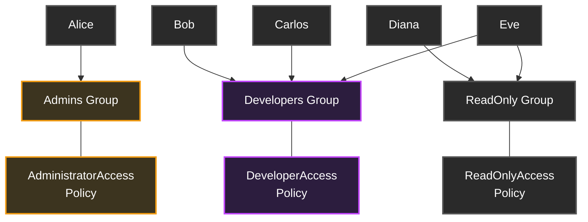
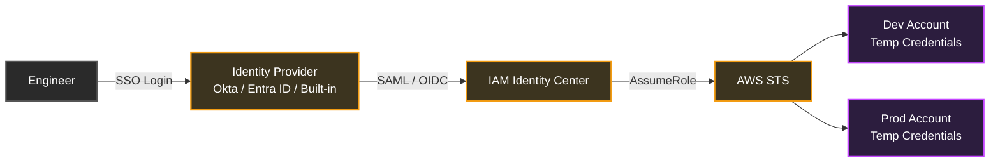
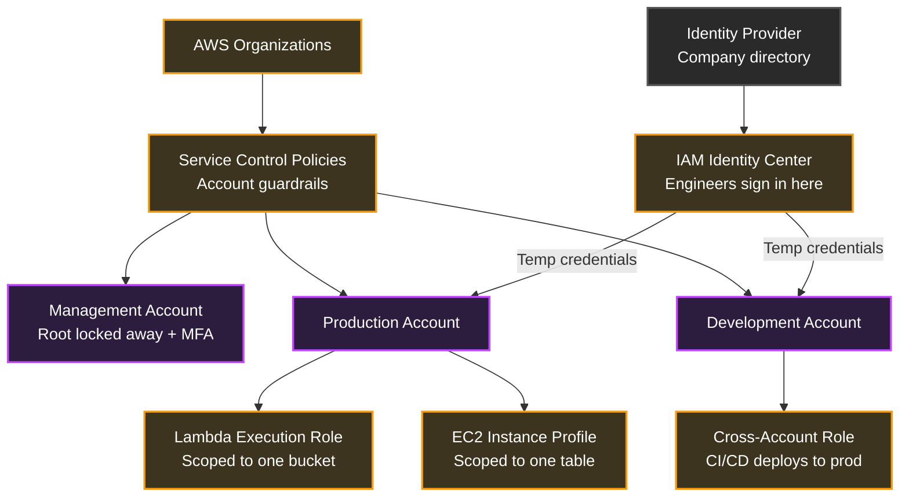

## Table of Contents

1. [The Root User](#the-root-user)
2. [IAM Users](#iam-users)
3. [IAM Groups](#iam-groups)
4. [The Credential Problem](#the-credential-problem)
5. [IAM Roles](#iam-roles)
6. [IAM Identity Center](#iam-identity-center)
7. [The Policy Language](#the-policy-language)
8. [Least Privilege](#least-privilege)
9. [MFA](#mfa)
10. [Putting It All Together](#putting-it-all-together)
11. [What's Next](#whats-next)

## The Root User
<!-- section-summary: The account begins with one identity that owns everything, so daily AWS work needs a safer access path. -->

The moment you create an AWS account, you get a **root user**. This identity has unrestricted access to everything in the account: every service, every resource, every billing configuration. A normal IAM policy cannot limit what this identity can do. It can delete infrastructure, close the account, change billing settings, and recover access after an IAM lockout.

Think of it like the master key to a building. You need it to exist. You might need it in a real emergency, like when the only remaining administrators are locked out. But you do not carry a master key around for daily work. You lock it away.

Only a handful of operations should require root: closing the account, changing some account-level settings, handling certain support and billing changes, and recovering from rare access failures. For literally everything else, use a different identity.

Securing the root user starts with **multi-factor authentication**, usually shortened to MFA. MFA means sign-in requires a second proof beyond the password. AWS requires root MFA registration within 35 days of the first console sign-in attempt if MFA is not already enabled. The strongest option is a phishing-resistant passkey or hardware security key rather than a one-time code app on your phone. A passkey is bound to the legitimate AWS sign-in domain, so even a perfect login page clone cannot harvest it.

Beyond MFA, never create access keys for the root user. An access key is a pair of secret values used by the AWS CLI, SDKs, scripts, and applications to call AWS APIs. The AWS CLI is the terminal tool for calling AWS. An SDK is a programming library that lets application code call AWS. Root access keys are the single most dangerous credential in an AWS account because they grant full API access with no natural expiration. If legacy root access keys exist, delete them.

So the root user is locked away. Now your team needs access.

## IAM Users
<!-- section-summary: IAM users give named people account access, but they also create long-lived credentials that need cleanup. -->

The natural first step is creating **IAM users**. Each user gets a unique identity inside one AWS account, represented by an ARN like `arn:aws:iam::123456789012:user/alice`. An ARN is AWS's full address for a cloud identity or resource, similar to a full path for infrastructure. A user can have a password for logging into the AWS Console, access keys for programmatic access through the CLI or SDK, and MFA devices bound to that identity.

When your team is three people, this works. You create `alice`, `bob`, and `carlos`, give each a console password, generate access keys for local development, and attach some permissions. Simple.

But here's the thing. You just created three sets of long-lived credentials that never expire unless someone manually rotates or deletes them. Those access keys can sit in `~/.aws/credentials` files on laptops, in CI/CD environment variables, maybe in a `.env` file that is one bad `.gitignore` away from GitHub. CI/CD means the automated build and deployment system. Each set of credentials is a static secret that grants access around the clock until it is explicitly revoked.

We'll come back to why that is dangerous. First, deal with the more immediate headache: what happens when the team goes from 3 users to 15?

## IAM Groups
<!-- section-summary: Groups reduce repeated permission work when teams grow, but they do not remove the underlying static credentials. -->

With 3 users, you can manage permissions individually. Attach a policy to Alice, copy a similar one to Bob, make a small exception for Carlos. With 15 users, this falls apart fast.

Say 8 engineers need the same permissions: read and write access to one S3 bucket, permission to deploy Lambda functions, and read access to CloudWatch logs. S3 is AWS object storage for files, images, backups, exports, and reports. Lambda runs code without you managing servers. CloudWatch collects metrics, logs, and alarms. Without groups, you attach the same set of policies to 8 individual users. When the team needs a new permission, you have to remember to update all 8. When someone joins, you have to remember which policies the others have. When someone leaves, you have to find and detach everything.

**IAM groups** solve this repetition. A group is a named collection of IAM users that share the same permissions. Create a group called `Developers`, attach the policies to the group once, and add users to it. Users inherit permissions from every group they belong to.



Notice Eve belongs to both `Developers` and `ReadOnly`. A user can be in multiple groups and receives the combined permissions. New engineer joins? Add them to the right group. Engineer leaves? Remove them from the groups.

There are a few important limits. Groups cannot be nested, so you cannot put one group inside another. A group is not an identity in IAM, which means you cannot reference a group as a `Principal` in a policy. A principal is the caller a policy is talking about. Groups are only an administrative convenience for organizing user permissions. And groups do not have credentials. A group never signs in to anything. Only users do.

Groups reduce repeated policy work, but the users still have long-lived credentials. The next problem is the credential itself.

## The Credential Problem
<!-- section-summary: Static access keys keep working until someone removes them, which makes leaks and offboarding hard to contain. -->

Let's go back to the growing startup. You have 15 IAM users organized into groups. Permissions are more manageable. But every one of those users may still have access keys, and those keys are a problem.

Those keys never expire. An access key created today works forever unless someone manually deactivates or deletes it. It lives outside AWS, sitting in config files on laptops, in CI/CD secrets, in shared password managers, and every copy is a potential leak. It cannot be scoped by device or intent on its own: if stolen, it works just as well for the attacker as it did for your engineer.

It also creates offboarding nightmares. When someone leaves, you have to find and rotate every key they touched. Did they copy a key into a Docker image? Into a Lambda environment variable? Into a Slack message six months ago? AWS can deactivate the IAM user's active keys, but it cannot automatically erase every place those secret values were pasted.

CloudTrail, AWS's activity record for API calls, can show that a key made a request. But if the same long-lived key was used from a laptop, a script, and a deployment job, the evidence becomes harder to read. Was the request the person, the script, a copied key, or an attacker?

Modern AWS access tries to avoid credentials that work forever. If a temporary credential leaks, the exposure is limited to the time left in that session, often minutes or hours.

IAM roles solve this by giving callers temporary credentials instead of permanent keys.

## IAM Roles
<!-- section-summary: Roles let AWS hand out temporary credentials to people, services, applications, and other accounts. -->

An **IAM role** is an identity without permanent credentials. It defines a set of permissions that can be assumed by whoever needs them: an EC2 instance, a Lambda function, a container task in ECS, a user from another AWS account, or a human through federation. EC2 provides virtual servers. ECS runs containers.

When something assumes a role, AWS Security Token Service, usually shortened to STS, issues temporary credentials: an access key ID, a secret access key, and a session token. These three values grant access together, but they expire automatically after a configured duration. No permanent secret has to sit in a config file. No manual rotation is needed for the session. It just stops working.

To understand a role, ask two policy questions.

**The trust policy** defines who can assume this role. It is a resource-based policy attached to the role itself. Without a matching trust policy, nobody can use the role, even if they have broad IAM permissions somewhere else.

**The permission policies** define what the role can do once it has been assumed. These are the same identity-based policies you attach to a user, group, or role.

Here is a concrete example. Your application runs on EC2 and needs to read files from one S3 bucket. The old way is to generate access keys for an IAM user and store them on the instance. The modern way is to create a role.

Trust policy, telling AWS that EC2 instances can assume this role:

```json
{
  "Version": "2012-10-17",
  "Statement": [
    {
      "Effect": "Allow",
      "Principal": {
        "Service": "ec2.amazonaws.com"
      },
      "Action": "sts:AssumeRole"
    }
  ]
}
```

Permission policy, granting the role access to a specific S3 bucket:

```json
{
  "Version": "2012-10-17",
  "Statement": [
    {
      "Effect": "Allow",
      "Action": [
        "s3:GetObject",
        "s3:ListBucket"
      ],
      "Resource": [
        "arn:aws:s3:::my-data-bucket",
        "arn:aws:s3:::my-data-bucket/*"
      ]
    }
  ]
}
```

Notice the two-ARN pattern for S3. The bucket ARN without a suffix allows `ListBucket` on the bucket itself. The ARN with `/*` allows `GetObject` on the objects inside. Omitting either one is a common reason for staring at `AccessDenied` even when the policy looks close.

You attach this role to the EC2 instance through an **instance profile**, which is the wrapper EC2 uses to place an IAM role on an instance. The AWS SDK running on that instance automatically fetches temporary credentials from the instance metadata service, uses them to call S3, and refreshes them before they expire. No keys in config files. No secrets to rotate. No credentials that outlast the runtime that needed them.

Roles show up everywhere in AWS. Lambda execution roles give functions permission to call other services. ECS task roles give each container task its own AWS identity. Cross-account roles let Account A assume a role in Account B without sharing credentials between accounts. Service-linked roles are roles AWS services create and manage so the service can operate in your account.

Roles solve credential problems for services and automation. But what about your 15 engineers who still have IAM users with passwords and access keys? Can humans get the same temporary credential model?

Yes. IAM Identity Center gives humans the same temporary-credential model.

## IAM Identity Center
<!-- section-summary: Identity Center replaces daily IAM users with workforce sign-in and temporary account sessions. -->

Let's revisit the startup scenario. You have 15 engineers with IAM users. Three have left. You are not sure all their keys are rotated. Someone committed a key to GitHub last month. Every new hire needs an IAM user created, credentials generated, MFA configured, and the right groups attached. Every departure means chasing down access keys across tools and accounts.

**IAM Identity Center** eliminates most of that. It replaces daily IAM users with federated access: engineers sign in through a central identity source, and Identity Center issues temporary credentials for each AWS account and permission set they are allowed to use. An identity source is the directory of people and groups AWS trusts for workforce sign-in. It can be Identity Center's built-in directory, Okta, Microsoft Entra ID, Active Directory, or another supported identity provider.

Here is what the flow looks like:



The engineer authenticates once against the identity provider. From there, Identity Center handles which AWS accounts the engineer can access, which permission sets they can use, and how long each session lasts.

This changes every problem from the IAM user model. Onboarding becomes adding the person to the right group and account assignment. Offboarding becomes disabling or deleting the person in the identity source, and they cannot start new AWS sessions. Credential leaks shrink because there are no long-lived AWS access keys for normal human work. Audit is cleaner because CloudTrail records which role session was used and which human identity started it.

For the CLI, engineers run `aws sso login`, authenticate in their browser, and the AWS CLI receives temporary credentials through the configured profile. No access keys need to sit in `~/.aws/credentials`.

So when should you still use IAM users? Only for narrow cases where federation is not possible: a legacy third-party tool that only supports static access keys, or a break-glass emergency procedure where the normal identity system may be unavailable. These should be rare, scoped, documented, and reviewed.

Now we have covered who can access AWS: root users, IAM users, groups, roles, and Identity Center identities. But how do we express what they are allowed to do?

AWS uses policies to express those permissions.

## The Policy Language
<!-- section-summary: Policies are JSON rules that say which caller can take which action on which resource under which conditions. -->

We have been saying "attach a policy" and "grant permissions" without looking closely at what a policy actually is. Let's fix that.

Every permission in AWS is expressed as a **JSON policy document**. A policy is a set of rules that say: allow or deny these API actions on these resources, under these conditions.

Here is a minimal policy that lets someone list objects in one S3 bucket:

```json
{
  "Version": "2012-10-17",
  "Statement": [
    {
      "Effect": "Allow",
      "Action": "s3:ListBucket",
      "Resource": "arn:aws:s3:::my-app-uploads"
    }
  ]
}
```

A policy contains one or more statements. Each statement has a few important fields:

| Element | What it controls | Example |
|---|---|---|
| **Effect** | Whether this statement allows or denies | `"Effect": "Allow"` |
| **Action** | Which API calls | `"Action": ["s3:GetObject", "s3:PutObject"]` |
| **Resource** | Which AWS resources, usually by ARN | `"Resource": "arn:aws:s3:::my-bucket/*"` |
| **Condition** | Which request facts must be true | `"Condition": {"IpAddress": {"aws:SourceIp": "10.0.0.0/8"}}` |
| **Principal** | Who the policy applies to, used in resource-based policies | `"Principal": {"Service": "lambda.amazonaws.com"}` |

Notice the `Version` field. It is normally `"2012-10-17"`. It names the policy language version, not the date you wrote the policy. Using an older version string changes how some policy features work, so use the current policy language version unless AWS documentation tells you otherwise.

Policy documents appear in several places with different names. **Identity-based policies** attach to users, groups, or roles. They say what that identity is allowed to do. **Resource-based policies** attach directly to resources, like an S3 bucket policy or SQS queue policy, and say which principals can use that resource. SQS is AWS's managed queue service for passing messages between systems. The trust policy on an IAM role is also a resource-based policy, because it controls who can assume that role.

**Permission boundaries** set a maximum on what identity-based policies can grant. A boundary only limits permissions that another policy grants. **Service control policies**, or SCPs, apply through AWS Organizations, AWS's service for grouping multiple AWS accounts under central management. SCPs set maximum permissions across member accounts or account groups. Even if an IAM policy says allow, an SCP deny still wins.

Here is the critical rule: **an explicit Deny always wins**. If any applicable policy says deny, access is denied. Ten other allow statements cannot override that deny. If there is no matching allow, access is denied by default. Guardrails use that rule to block dangerous actions without needing to know every permission granted below them.

So now you know how permissions are expressed. Policies define what is allowed. But how do you decide how much permission to grant?

To answer that, use least privilege.

## Least Privilege
<!-- section-summary: Least privilege starts broad only when needed, then narrows access to the actions and resources actually used. -->

"Give each identity only the permissions it needs" is the short version of least privilege. In practice, least privilege takes work because on day one you often do not know exactly what a new workload needs.

A practical way to get there is to narrow access in stages.

**Phase 1: Start with a broad but temporary starting point.** When a new Lambda function needs S3 access in a development account, you might start with read access to S3 so the team can prove the workflow. That read access is broader than the final policy should be, but it gets the first version moving in a low-risk place.

**Phase 2: Monitor actual usage.** CloudTrail records API calls. After the function has been running through normal workflows for a few weeks, you have data on which S3 actions it really uses and which buckets it touches.

**Phase 3: Generate a scoped policy.** IAM Access Analyzer can review CloudTrail activity and generate a policy template based on the actions the identity actually used. Access Analyzer is AWS tooling for analyzing policies and access paths. Review still matters, but the reviewer now has evidence instead of guesses.

**Phase 4: Review and maintain.** Use IAM last accessed information to spot permissions that have not been used. If a role has had `dynamodb:DeleteTable` for six months and never used it, remove it. DynamoDB is AWS's managed table-like database. Permissions drift over time, so schedule reviews.

Here is what this progression looks like in policy form:

```json
{
  "Version": "2012-10-17",
  "Statement": [
    {
      "Sid": "BroadStartingPoint",
      "Effect": "Allow",
      "Action": "s3:*",
      "Resource": "*"
    }
  ]
}
```

After running real workflows and using Access Analyzer as evidence, the policy should move toward something like this:

```json
{
  "Version": "2012-10-17",
  "Statement": [
    {
      "Sid": "ScopedToActualUsage",
      "Effect": "Allow",
      "Action": [
        "s3:GetObject",
        "s3:PutObject",
        "s3:ListBucket"
      ],
      "Resource": [
        "arn:aws:s3:::my-app-uploads",
        "arn:aws:s3:::my-app-uploads/*"
      ]
    }
  ]
}
```

The broad policy grants S3 actions across every bucket in the account. The scoped policy grants three actions on one bucket. If the broad credential leaks, an attacker may reach all S3 data in the account. If the scoped credential leaks, they can affect one upload bucket.

**Conditions** let you narrow things further. You can require that actions work only from specific IP ranges, from a private network path, or when MFA is present:

```json
{
  "Effect": "Allow",
  "Action": "s3:DeleteObject",
  "Resource": "arn:aws:s3:::my-app-uploads/*",
  "Condition": {
    "IpAddress": {
      "aws:SourceIp": "10.0.0.0/8"
    },
    "Bool": {
      "aws:MultiFactorAuthPresent": "true"
    }
  }
}
```

This says: you can delete objects only if the request comes from the `10.x.x.x` internal network and the caller authenticated with MFA. Even if an access key leaks, an attacker outside that network or without MFA cannot use this statement for deletes.

Add MFA so a stolen password is not enough to use the account.

## MFA
<!-- section-summary: MFA gives human sign-in a second proof, so a stolen password is not enough by itself. -->

Everything covered so far reduces risk. Temporary credentials limit how long a stolen session works. Least privilege limits what a compromised identity can do. SCPs limit what entire accounts can do. But none of that helps enough if an attacker has your password and there is no second proof protecting sign-in.

**Multi-factor authentication** requires a second verification step beyond a password. Even if every other defense fails and an attacker gets the password, MFA can still stop the sign-in.

The strongest MFA option is a passkey or hardware security key using FIDO2. These are phishing-resistant because the authenticator is bound to the legitimate AWS sign-in domain. An attacker can build a convincing AWS login clone, but the passkey will not respond because the domain does not match. A step down in security, but still much better than password-only, is a virtual authenticator app such as Google Authenticator or Authy, which generates time-based one-time codes. These are free and easy to set up, but they can be phished in real time if an attacker proxies the login flow.

For the root user, MFA is mandatory. AWS requires it within 35 days of the first console sign-in attempt if it is not already enabled.

For IAM users, you can enforce MFA through policy. Here is a pattern that denies all actions except MFA self-setup when MFA is not active:

```json
{
  "Version": "2012-10-17",
  "Statement": [
    {
      "Sid": "DenyAllExceptMFASetupWithoutMFA",
      "Effect": "Deny",
      "NotAction": [
        "iam:CreateVirtualMFADevice",
        "iam:EnableMFADevice",
        "iam:ListMFADevices",
        "iam:GetUser",
        "sts:GetSessionToken"
      ],
      "Resource": "*",
      "Condition": {
        "BoolIfExists": {
          "aws:MultiFactorAuthPresent": "false"
        }
      }
    }
  ]
}
```

This forces users to configure MFA before they can do anything else. When they sign in without MFA, the only actions available are the ones needed to set up MFA. Once MFA is active, the condition no longer matches, the deny does not apply, and their normal permissions can take effect.

## Putting It All Together
<!-- section-summary: The full IAM model locks root away, replaces static secrets with sessions, and uses policies to control each request. -->

Let's go back to the startup, but now with IAM set up properly.



The diagram connects the pieces in the order we introduced them.

**The root user** is locked away with MFA and no access keys. It exists for ownership and rare recovery, not daily work.

**IAM users and groups** explain the first access model. Users give named identities. Groups reduce repeated policy work. But both still leave you with long-lived human credentials if you use them as the normal daily path.

**IAM roles** handle service-to-service access and delegated sessions. Lambda, EC2, ECS, deployment workflows, and cross-account access all use temporary credentials that expire automatically.

**IAM Identity Center** handles normal human access. Engineers sign in through the workforce directory, choose assigned accounts and permission sets, and receive temporary role sessions. Offboarding becomes a directory change instead of a credential hunt.

**Policies** express what each identity can do. AWS evaluates one request at a time: principal, action, resource, and context. Explicit deny wins. Missing allow fails by default.

**Least privilege and MFA** keep the blast radius small. Least privilege narrows what a session can do. MFA makes it harder for someone else to start the session. Temporary credentials limit how long the session survives.

Compare this to the original pile of IAM users with long-lived keys. The improved model changes daily operations. Onboarding takes minutes instead of a manual IAM checklist. Offboarding stops new access from one directory change. Incident response goes from "find every copy of the leaked key" to "the session expired and the role has one narrow policy."

IAM is the access foundation that keeps AWS manageable after more people, workloads, accounts, and automation start using it.

## What's Next
<!-- section-summary: The next article turns the model into daily access flows for engineers, applications, containers, and pipelines. -->

You now understand the identity types, policy language, and security principles that make IAM work. But understanding the concepts and using them day to day are different things.

The next article gets practical. It follows people, local CLI sessions, applications, containers, and CI/CD workflows as they receive AWS access without permanent keys.

---

**References**

- [AWS security credentials](https://docs.aws.amazon.com/IAM/latest/UserGuide/security-creds.html) - Explains root users, IAM users, federated principals, long-term credentials, and temporary credentials.
- [Root user best practices](https://docs.aws.amazon.com/IAM/latest/UserGuide/root-user-best-practices.html) - Documents root credential guidance, root access key guidance, and central root access management for member accounts.
- [Multi-factor authentication for AWS account root user](https://docs.aws.amazon.com/IAM/latest/UserGuide/enable-mfa-for-root.html) - Documents root MFA registration requirements and root MFA options.
- [IAM users](https://docs.aws.amazon.com/IAM/latest/UserGuide/id_users.html) - Defines IAM users, user credentials, user ARNs, and AWS guidance to prefer federation for human access.
- [IAM user groups](https://docs.aws.amazon.com/IAM/latest/UserGuide/id_groups.html) - Documents how IAM groups organize IAM users and permissions.
- [IAM roles](https://docs.aws.amazon.com/IAM/latest/UserGuide/id_roles.html) - Explains roles, temporary credentials, trust policies, service roles, and cross-account delegation.
- [What is IAM Identity Center](https://docs.aws.amazon.com/singlesignon/latest/userguide/what-is.html) - Describes centralized workforce access, permission assignments across accounts, and temporary AWS account sessions.
- [Security best practices in IAM](https://docs.aws.amazon.com/IAM/latest/UserGuide/best-practices.html) - Covers federation, temporary credentials, MFA, least privilege, Access Analyzer, access-key exceptions, and permissions guardrails.
- [Policy evaluation logic](https://docs.aws.amazon.com/IAM/latest/UserGuide/reference_policies_evaluation-logic.html) - Documents how AWS evaluates policies and how explicit denies override allows.
- [IAM Access Analyzer policy generation](https://docs.aws.amazon.com/IAM/latest/UserGuide/access-analyzer-policy-generation.html) - Describes generating policies from CloudTrail activity and key limitations.
