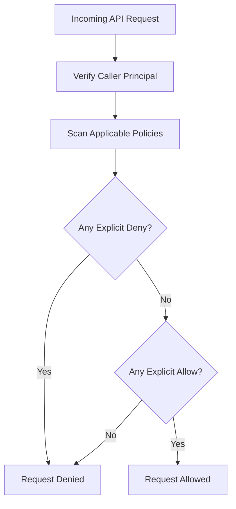

## Table of Contents

1. [The Localhost Trust Trap](#the-localhost-trust-trap)
2. [What Is IAM](#what-is-iam)
3. [Principals](#principals)
4. [Actions and Resources](#actions-and-resources)
5. [How Policies Are Evaluated](#how-policies-are-evaluated)
6. [Putting It All Together](#putting-it-all-together)
7. [What's Next](#whats-next)

## The Localhost Trust Trap

When you run a web application on a personal laptop, security is rarely a boot-time obstacle. Your laptop is an environment built on local trust. The database running on localhost accepts connections because you configured a local password in a dot-environment file, and your application code reads and writes local files because your laptop operating system automatically trusts the logged-in user session. If you need to make an API call to a cloud provider from your local terminal, the local command-line interface simply reads a static, administrative access key from a hidden credentials file in your home directory.

However, once that same application moves to a professional cloud provider like AWS, this expectation of automatic local trust completely breaks down. The application container boots in an isolated virtual cluster, attempts to retrieve its database credentials from a vaulted storage system, and immediately crashes with an Access Denied error. The team is left with several confusing questions:

* Why did the deployment pipeline report success when the running application cannot perform its basic startup duties?
* Why does the S3 upload work perfectly from the developer's laptop terminal, but fail when run inside the cloud container?
* How does the system distinguish between a human developer, a deployment script, and a running container when they all try to touch the same database?

These are not general security problems. They are specific authorization questions. In the cloud, there is no automatic trust based on physical proximity or user logins. Calls to AWS services, such as fetching a secret, uploading to S3, or writing logs, become signed API requests with an exact caller and an exact action. IAM evaluates those AWS API requests. Database queries, operating system file reads, and raw network packets still have their own controls, such as database users, Linux permissions, security groups, and NACLs. To operate safely, you need to understand which requests IAM evaluates and which layer protects the rest.

## What Is IAM

AWS Identity and Access Management, commonly known as IAM, is the core service that controls authentication and authorization for every request made to AWS resources. Authentication is the process of verifying who is making the request, while authorization is the process of deciding whether that verified caller is allowed to perform the specific task they are asking to do.

To build a reliable mental model of IAM, you must stop thinking of security as a broad network wall and start viewing it as a precise request gatekeeper. Every action in AWS is a structured API request, and IAM evaluates that request by dissecting it into four primary coordinates:

* **The Principal**: The caller asking AWS to do something.
* **The Action**: The specific operation the caller wants to perform.
* **The Resource**: The physical or logical object being targeted.
* **The Context**: Extra operational circumstances, such as the caller's IP address or the request timestamp.

Every request evaluates to either allowed or denied. If IAM cannot find a policy that explicitly permits the request, the default decision is a strict denial. This is the foundation of least-privilege security. You do not write rules to block dangerous behavior; instead, you block everything by default and write narrow rules that open precise, audited pathways for the exact jobs your workloads must perform.

The workflow of a request moving through this gatekeeper follows a vertical path from authentication to final authorization.




*Every AWS API call enters IAM as a request with a caller, action, target resource, and context. The safest mental model is a narrow gate: explicit denies win, and anything without a written allow is denied by default.*

By mapping every Access Denied error to these coordinates, debugging becomes an operational checklist rather than a guessing game. If your container cannot write to an S3 bucket, you do not broad-stroke the permissions of the entire account. You identify the exact principal of the running container, the specific write action it attempted, the unique ARN of the bucket, and the exact policy that failed to authorize the path.

## Principals

A principal is the authenticated identity that makes a request to AWS. In your local development environment, the principal is effectively your personal user account. In a professional cloud environment, however, we must separate human identities from application workloads to prevent administrative power from leaking into running code.

IAM recognizes several distinct categories of principals, each tailored to a specific operational role:

* **Root User**: The original administrative owner of the AWS account, created when the account is first opened. IAM identity policies do not restrict root, so the root user must be locked away with multi-factor authentication and never used for daily development, deployment, or workload runtimes. In AWS Organizations, service control policies can still place guardrails around member accounts, including root activity.
* **Federated Human Roles**: Temporary role sessions for people, usually delivered through IAM Identity Center or another identity provider. This is the preferred model for workforce access because the person signs in through a central identity system and receives a time-limited AWS role session.
* **IAM Users**: Long-lived individual identities with static login credentials or access keys. They still exist, but they should be rare in modern environments and avoided for normal human access when federation is available.
* **Workload Roles**: Ephemeral identities assumed by running software, such as containers, serverless functions, or automated deployment pipelines. Roles do not have permanent passwords or keys; instead, the AWS hosting runtime dynamically hands temporary credentials to the workload.

Keeping these principals separate is critical for operational safety. For example, if a developer named Maya is debugging a system, her human session principal carries different permissions than the running database container. 

Human vs Workload Principal Coordinates:

* **Maya (Human Support)**:
  * Principal ARN: `arn:aws:sts::123456789012:assumed-role/prod-support/maya`
  * Authorized Task: Inspect log metadata and check database connectivity.
* **Deploy Pipeline**:
  * Principal ARN: `arn:aws:sts::123456789012:assumed-role/github-deploy/run-9921`
  * Authorized Task: Register new container versions and update infrastructure state.
* **Orders API Container**:
  * Principal ARN: `arn:aws:sts::123456789012:assumed-role/orders-task-role/task-42`
  * Authorized Task: Read the production database password and write transaction receipts.

If Maya uses her personal developer credentials to run a local script that writes to S3, she only proves that *her* principal is allowed to perform the write. It does not prove that the running container principal will succeed. Debugging cloud authorization requires you to always inspect the exact caller that AWS sees, rather than assuming that developer success translates to application success.

## Actions and Resources

Once IAM authenticates the principal, it evaluates what that caller is trying to do and where they are trying to do it. These are represented by actions and resources. 

An action is a specific API operation exposed by an AWS service, written in a lowercase, service-prefixed format. A resource is the target object, often identified by a standardized Amazon Resource Name (ARN). ARNs give AWS a precise way to name resources across partitions, services, regions, accounts, and resource paths, though each service has its own exact ARN shape.

Common Application Actions and Resources:

* **App Behavior**: Load database credentials at container startup.
  * Service Action: `secretsmanager:GetSecretValue`
  * Target Resource: `arn:aws:secretsmanager:us-east-1:123456789012:secret:prod/db-password-AbCdEf`
* **App Behavior**: Upload a generated transaction receipt.
  * Service Action: `s3:PutObject`
  * Target Resource: `arn:aws:s3:::company-receipts-prod/receipts/*`
* **App Behavior**: Write runtime debug output.
  * Service Action: `logs:CreateLogStream`
  * Target Resource: `arn:aws:logs:us-east-1:123456789012:log-group:/aws/ecs/orders-prod:*`

This level of precision is how you build a secure application boundary. If your application only needs to read a single database password, you do not grant it `secretsmanager:*` permissions on every secret in the account. You target the specific `GetSecretValue` action and point it directly at the unique ARN of the database secret. 

If the application is ever compromised, the blast radius is strictly limited to that single value. The attacker cannot list other secrets, modify encryption keys, or read unrelated configuration parameters.

## How Policies Are Evaluated

An IAM policy is a JSON document that explicitly defines authorization rules. Policies do not float freely; they are attached to principals (identity-based policies) or directly to resources (resource-based policies) to establish who can perform which actions.

To write effective policies, you must understand how IAM evaluates them. The evaluation logic operates under a strict set of rules:

* **Explicit Deny Overrides All**: If any applicable policy contains a statement that denies an action, the final decision is immediately denied, regardless of how many other policies explicitly allow it.
* **Default Deny**: If no policy explicitly allows an action, the request is denied by default.
* **Allow Requires Explicit Statement**: An action is only permitted if an applicable policy explicitly allows it and no policy explicitly denies it.

These three rules are the center of IAM, but they are not the only boundary in a mature AWS organization. Service control policies can limit the maximum permissions available inside member accounts. Permission boundaries can limit what an IAM role or user can ever receive. Session policies can further narrow a temporary session. Resource-based policies can grant access from the resource side. When a beginner debugs access, the safe habit is to ask which layers apply before assuming one identity policy tells the whole story.

Let us inspect a realistic, identity-based policy attached to our application container's workload role.

```json
{
  "Version": "2012-10-17",
  "Statement": [
    {
      "Sid": "AllowReceiptUpload",
      "Effect": "Allow",
      "Action": "s3:PutObject",
      "Resource": "arn:aws:s3:::company-receipts-prod/receipts/*"
    },
    {
      "Sid": "DenyUnencryptedUpload",
      "Effect": "Deny",
      "Action": "s3:PutObject",
      "Resource": "arn:aws:s3:::company-receipts-prod/receipts/*",
      "Condition": {
        "StringNotEquals": {
          "s3:x-amz-server-side-encryption": "aws:kms"
        }
      }
    }
  ]
}
```

This policy demonstrates the interplay between `Allow` and `Deny`. The first statement explicitly permits the container to write receipts to the production S3 bucket. The second statement, however, introduces a strict guardrail: it explicitly denies any upload request that does not request KMS encryption.

If the application attempts to upload a plaintext receipt without specifying KMS encryption, the second statement matches, triggering an explicit deny. Because an explicit deny overrides all allows, the upload fails immediately with an Access Denied error. The container is protected from accidentally uploading unencrypted files, even though the first statement appeared to grant broad write access.

## Putting It All Together

Understanding the IAM mental model changes how you design, deploy, and debug software in the cloud. Instead of treating security as a post-development compliance step, you integrate it directly into the application lifecycle:

* **Local Trust is an Illusion**: Recognize that localhost convenience does not exist in the cloud. Expect to configure explicit permissions for every service dependency from day one.
* **Isolate Your Principals**: Never share administrative keys or developer profiles with running application containers. Ensure that every workload runs under its own distinct, minimal identity.
* **Target Actions and Resources**: Avoid wildcard permissions like `s3:*` or `secretsmanager:*` on all resources (`*`). Take the time to specify the exact actions and unique ARNs your code requires.
* **Leverage the Evaluation Logic**: Use explicit allows for standard operations, and use explicit denies with request conditions to enforce safety guardrails like mandatory encryption or source IP limits.

By treating security as a structured request evaluation, you convert mysterious Access Denied crashes into predictable, solvable configuration steps. You build systems that are inherently secure, highly auditable, and resilient to operational errors.

## What's Next

We now have a clean mental model of how AWS evaluates API requests against principals, actions, and resources. However, a major practical question remains: How does our running application container securely prove its identity to AWS without carrying permanent access keys baked into our codebase or environment configurations? In the next article, we will explore Workload Roles, temporary security sessions, and how the AWS SDK automatically retrieves and refreshes credentials without developer intervention.


*Use this as the identity-security checklist: stop relying on localhost trust, model every cloud call as an IAM request, identify the exact principal, bind actions to resources, respect explicit denies, and grant only the narrow path the workload needs.*

---

**References**

- [AWS IAM Overview](https://docs.aws.amazon.com/IAM/latest/UserGuide/introduction.html) - Introduction to the core AWS Identity and Access Management service.
- [IAM Policy Evaluation Logic](https://docs.aws.amazon.com/IAM/latest/UserGuide/reference_policies_evaluation-logic.html) - Detailed breakdown of how IAM evaluates multiple policies to reach an allow or deny decision.
- [Understanding Principals in AWS](https://docs.aws.amazon.com/IAM/latest/UserGuide/reference_policies_elements_principal.html) - Explanation of the different principal types and how they are evaluated in trust and resource policies.
- [Root user best practices](https://docs.aws.amazon.com/IAM/latest/UserGuide/root-user-best-practices.html) - Guidance for securing and limiting use of the AWS account root user.
- [Service control policies](https://docs.aws.amazon.com/organizations/latest/userguide/orgs_manage_policies_scps.html) - Documents organization guardrails for member accounts.
- [AWS IAM Identity Center](https://docs.aws.amazon.com/singlesignon/latest/userguide/what-is.html) - Describes the recommended workforce access service.
