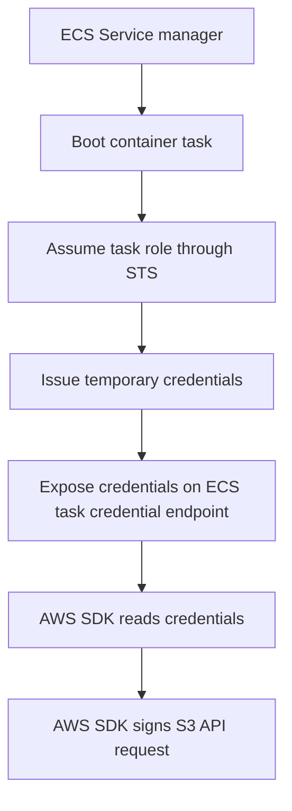

## Table of Contents

1. [The Danger of Permanent Keys](#the-danger-of-permanent-keys)
2. [What Is a Workload Role](#what-is-a-workload-role)
3. [How Temporary Credentials Work](#how-temporary-credentials-work)
4. [The SDK Default Credential Provider Chain](#the-sdk-default-credential-provider-chain)
5. [ECS Task Roles vs Task Execution Roles](#ecs-task-roles-vs-task-execution-roles)
6. [Putting It All Together](#putting-it-all-together)
7. [What's Next](#whats-next)

## The Danger of Permanent Keys

To make your application talk to AWS services, your code must sign every API request using access credentials. A common and dangerous shortcut is to generate a pair of permanent credentials consisting of an access key ID and a secret access key for a personal administrative user, and paste those keys directly into a dot-environment file inside the production container.

While this approach immediately solves the database or S3 connection failure, it introduces three severe security vulnerabilities:

* **Static credential exposure**: Permanent keys do not expire. If you accidentally commit the credentials file to a Git repository, log the environment variables during a system crash, or let someone inspect the container image, those keys are compromised. Anyone who finds them can access your AWS account indefinitely.
* **Manual rotation burden**: Because the keys are permanent, rotating them requires you to manually generate new keys, update the configuration of every running container, redeploy the system, and delete the old keys, creating high operational risk.
* **No audit precision**: If multiple developers and containers share the same administrative keys, the account's audit logs will show that the administrative user performed every action. You cannot prove whether a specific S3 deletion was performed by an automated background script, a deployment pipeline, or a compromised container.

The solution to these risks is passwordless cloud authorization. Instead of teaching your application code to carry a permanent key, you configure the AWS hosting runtime to dynamically assign a temporary identity to the running code. The application never sees a static password; instead, it receives credentials that expire automatically, require zero manual rotation, and leave a precise, auditable trail of activity.

## What Is a Workload Role

A workload role is an IAM role that you assign to running application code, such as an ECS container task, a Lambda function, or an EC2 instance. Unlike human users who have permanent passwords, a role has no long-lived keys. It represents a specific job description that a running workload is authorized to perform.

A workload role behaves like a runtime identity profile for one software job. The hosting service assumes the role on behalf of the running code, and the resulting temporary session becomes the caller AWS sees in API requests.

To implement a workload role, you must configure two distinct policies that govern the role's behavior:

* **The Trust Policy**: A resource-based policy attached directly to the role that defines *who* is allowed to assume it. For a containerized application, the trust policy specifies that the AWS ECS task runner service is a trusted entity permitted to step into the role.
* **The Permissions Policy**: An identity-based policy attached to the role that defines *what* the role is allowed to do once assumed. For instance, the permissions policy might allow the role to write to one specific S3 bucket prefix.

This division is an essential cloud security habit. If you attach a perfect permissions policy to a workload role but fail to configure the trust policy, the ECS service will not be allowed to assume the role at container boot, and the application will fail with a credentials error. Conversely, if you trust the ECS service but write a permission policy that is too broad, the workload will operate with excessive privileges, increasing the blast radius if the code is compromised.

Trust vs Permission Policy Separation:

* **Trust Policy (Who is allowed to assume the role)**:
  * Trusted Entity: `ecs-tasks.amazonaws.com`
  * Action: `sts:AssumeRole`
  * Security Job: Allow the ECS tasks service to assume this workload role when starting an authorized task.
* **Permissions Policy (What the assumed role is allowed to do)**:
  * Allowed Action: `s3:PutObject`
  * Target Resource: `arn:aws:s3:::receipts-prod/uploads/*`
  * Security Job: Limit the container to writing transaction receipts under a single folder path.

By separating the trust boundary from the operational boundary, you ensure that permissions are only active when the authorized hosting environment boots your code. You eliminate the risk of a developer accidentally assuming the workload's identity from a local terminal.

## How Temporary Credentials Work

When the AWS hosting runtime starts your application, it does not inject permanent credentials. Instead, the hosting service assumes the workload role through the AWS Security Token Service, known as STS, and exposes the resulting temporary credentials to the workload through the runtime's local credential endpoint. STS is the service that issues temporary, short-lived security credentials for the role session.

Temporary credentials function as expiring API signing material for one authorized role session. They let the workload sign AWS requests without carrying a permanent access key in code, configuration, or the container image.

The resulting temporary credential set contains three distinct values:

* **Access Key ID**: A temporary key identifier prefixed with ASIA, indicating that it represents a temporary session rather than a permanent IAM user.
* **Secret Access Key**: A temporary cryptographic signing secret.
* **Session Token**: A security token that must accompany every API request to prove that the temporary key and secret key are part of a valid, authorized session.
* **Expiration Timestamp**: The exact time when the session will expire, usually set between fifteen minutes and twelve hours.

The workflow of the runtime assuming a role and delivering these credentials follows a vertical, secure pipeline.



When the expiration timestamp is reached, AWS rejects API requests signed with that credential set. Before that happens, the ECS runtime refreshes the role session and the AWS SDK retrieves fresh credentials from the container credential endpoint.

Because this lifecycle is fully automated, the developer does not write credential rotation scripts. The system refreshes credentials before expiration without interrupting the application's runtime traffic.


*A workload role replaces permanent keys with short-lived credentials. The hosting runtime and STS issue the session, runtime metadata exposes it to the SDK, and the SDK signs AWS API requests without hardcoded secrets in application code.*

## The SDK Default Credential Provider Chain

A common developer concern is how to manage these temporary credentials inside the application codebase. If the keys are dynamic, rotate hourly, and require a session token, does the application code need to constantly query STS, track expiration times, and pass tokens into every service client?

The answer is no. You do not write credential management logic. The AWS SDK's default credential provider chain acts as a standard credential discovery pipeline. It scans the local runtime environment for valid credentials. The exact order varies slightly by SDK and version, but the practical sources are familiar:

* **Environment Variables**: The SDK checks for `AWS_ACCESS_KEY_ID`, `AWS_SECRET_ACCESS_KEY`, and `AWS_SESSION_TOKEN`. This is useful for local testing or CI/CD pipelines.
* **Shared Credentials File**: The SDK scans the local filesystem for a credentials file, typically populated by the AWS CLI during local development.
* **ECS Container Credentials**: If running inside an ECS task, the SDK queries the local container metadata endpoint to fetch temporary credentials issued by the ECS agent.
* **EC2 Instance Metadata**: If running on an EC2 virtual server, the SDK queries the instance metadata service to retrieve credentials assigned to the host's instance profile.

Because of this automated provider chain, your application code remains completely free of credential configurations. You instantiate your AWS service clients with zero parameters:

```javascript
import { S3Client } from "@aws-sdk/client-s3";

// The SDK automatically locates valid runtime credentials, reads the session
// token when one exists, and refreshes temporary credentials before expiration.
const s3 = new S3Client();
```

Writing credential-free code is a vital cloud development rule. If you hardcode credential paths or manually inject keys into client constructors, you break the default provider chain. 

Your application will fail to read the rotated credentials issued by the hosting runtime, causing the service to crash when the initial temporary session expires.

## ECS Task Roles vs Task Execution Roles

When deploying containerized applications on AWS ECS, developers frequently encounter credential failures because they confuse the two distinct roles assigned to a single task definition.

The anchor is caller separation. The task execution role authorizes platform startup work performed by ECS, while the task role authorizes AWS API calls made by your application process after it starts.

Most production ECS services use two different roles, and each role exists for a different caller:

* **Task Execution Role (Infrastructure Startup)**: Used by the ECS agent before your application code starts. It grants the ECS platform permission to pull your container image from the private ECR registry, write startup container signals to CloudWatch Logs, and fetch secrets that are injected from the task definition at startup.
* **Task Role (Application Runtime)**: Used by your application code *inside* the container after it boots. It grants your JavaScript, Python, or Go code permission to call AWS APIs, such as uploading files to S3 or reading passwords from Secrets Manager.

This distinction is the source of many common deployment errors. For example, if your Node.js application receives an Access Denied error when calling S3, adding S3 permissions to the Task Execution Role will not resolve the issue.

The ECS agent will have the permission, but the application code running inside the container will still be blocked because its Task Role lacks the required S3 policy.

ECS Role Separations:

* **Task Execution Role**:
  * Used By: ECS Agent.
  * Common Permissions: `ecr:GetAuthorizationToken`, `ecr:BatchGetImage`, `logs:CreateLogStream`, `logs:PutLogEvents`.
  * Operational Job: Pull the container image and set up logging before the application boots.
* **Task Role**:
  * Used By: Application Code.
  * Common Permissions: `s3:PutObject`, `secretsmanager:GetSecretValue`, `dynamodb:PutItem`.
  * Operational Job: Authorize the application's runtime business logic.

Always map your permissions based on who performs the action. If the platform needs to perform a boot action, assign it to the Task Execution Role. If your application code calls an API at runtime, assign it strictly to the Task Role.

One security detail matters when ECS runs on EC2 capacity: containers are not a hard security boundary. Tasks on the same EC2 host share the underlying instance, so platform teams must protect instance metadata access and avoid assuming that one container can never affect another. Fargate reduces this host-management surface for most beginner workloads, but least-privilege task roles still matter.

## Putting It All Together

Migrating from static credentials to dynamic workload roles is the most significant security improvement you can make to your cloud architecture:

* **Banish Static Keys**: Delete all long-lived administrative keys from your environment configurations, Git repositories, and container images.
* **Configure Trust Policies**: Remember that a workload role requires a trust policy that permits the hosting service (such as ECS) to assume the role.
* **Trust the SDK Chain**: Instantiate your AWS clients with zero parameters. Let the SDK's default provider chain automatically locate, use, and rotate temporary credentials.
* **Keep Task Roles Separate**: Do not bundle runtime application permissions into the task execution role. Enforce the boundary between ECS startup permissions and application runtime permissions.

By adopting passwordless workload roles, you secure your workloads against credential theft, eliminate manual key rotation tasks, and build an infrastructure that is inherently secure from boot to runtime.

## What's Next

Now that our application container runs securely under a workload role and signs API requests using temporary credentials, we face the next security challenge: Where do our third-party credentials, database passwords, and API tokens live? How do we encrypt them securely under the hood, and how do we verify who accessed them without printing sensitive plaintext values in our application logs? In the next article, we will explore Secrets Manager, KMS envelope encryption, CloudTrail audit trails, and safe console logging practices.


*Use this as the workload-role checklist: remove static keys, assign a role to the workload, configure who can assume it, limit what it can do, let temporary credentials rotate, and keep the task role separate from the execution role.*

---

**References**

- [IAM Roles for Amazon ECS Tasks](https://docs.aws.amazon.com/AmazonECS/latest/developerguide/task-iam-roles.html) - Documentation on how to assign runtime roles to ECS container tasks.
- [Amazon ECS task execution IAM role](https://docs.aws.amazon.com/AmazonECS/latest/developerguide/task_execution_IAM_role.html) - Documents platform startup permissions for pulling images, writing logs, and injecting startup secrets.
- [AWS SDK Default Credential Provider Chain](https://docs.aws.amazon.com/sdk-for-javascript/v3/developer-guide/setting-credentials-node.html) - Explanation of how the AWS SDK automatically resolves credentials across environment variables, ECS metadata, and EC2 hosts.
- [AWS Security Token Service (STS) Overview](https://docs.aws.amazon.com/STS/latest/APIReference/welcome.html) - Technical details on how STS generates short-lived, temporary security credentials.
