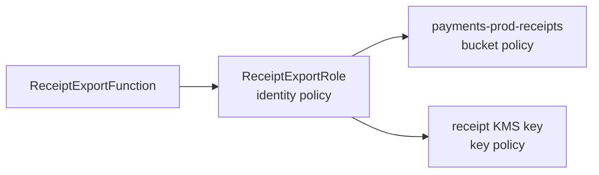
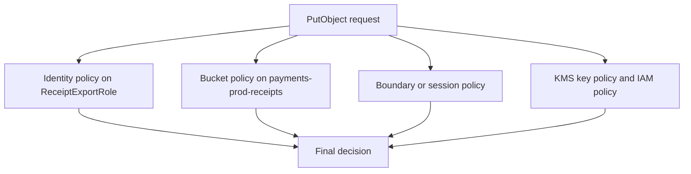

## Table of Contents

1. [A Request Needs a Policy Decision](#a-request-needs-a-policy-decision)
2. [What a Policy Statement Says](#what-a-policy-statement-says)
3. [Identity Policies and Resource Policies](#identity-policies-and-resource-policies)
4. [How AWS Evaluates a Request](#how-aws-evaluates-a-request)
5. [Write the Receipt Export Role](#write-the-receipt-export-role)
6. [Add Conditions for Real Boundaries](#add-conditions-for-real-boundaries)
7. [S3 and KMS Need Matching Permissions](#s3-and-kms-need-matching-permissions)
8. [PassRole and Permission Boundaries](#passrole-and-permission-boundaries)
9. [Move From Broad Access to Least Privilege](#move-from-broad-access-to-least-privilege)
10. [Debug AccessDenied With Evidence](#debug-accessdenied-with-evidence)
11. [Putting It All Together](#putting-it-all-together)
12. [What's Next](#whats-next)

## A Request Needs a Policy Decision
<!-- section-summary: Temporary credentials answer who is calling, and IAM policies answer what that caller may do. -->

The previous article focused on access paths for people, applications, servers, containers, and CI/CD workflows. Those callers should receive **temporary credentials** through IAM Identity Center, IAM roles, and federation. Temporary credentials prove who is making a signed AWS request, and they expire automatically after a session window.

Now the next question arrives. A caller has credentials, but AWS still has to decide whether that caller may perform the requested action. The answer comes from **IAM policies**, which are JSON rules that describe allowed and denied API actions. JSON is a structured text format that AWS uses for policy documents.

A concrete production workflow makes this easier to follow. A payments application creates monthly customer receipt files. A Lambda function named `ReceiptExportFunction` reads finalized payment records, writes receipt PDFs into an S3 bucket named `payments-prod-receipts`, and uses an AWS KMS key to encrypt those receipt objects. Lambda runs code without managing servers. S3 stores objects such as files, exports, reports, and backups. KMS manages cryptographic keys used to protect sensitive data.

The function runs with an IAM role named `ReceiptExportRole`. The role gives the function an AWS identity, and the policies attached to that role describe what the function may do. If the policy grants broad S3 access, the function can touch more receipt data than it needs. If the policy misses one required action, the export job fails with `AccessDenied`.

Policies turn a vague sentence like "the receipt job needs S3 access" into a specific authorization decision. The rest of this article follows that receipt export until the policy becomes narrow, testable, and understandable during an incident.


*The policy decision starts from one signed request. The useful facts are the caller, the action, the target resource, and the request context.*

## What a Policy Statement Says
<!-- section-summary: A policy statement names the effect, action, resource, and optional request conditions for one authorization rule. -->

An **IAM policy** is a JSON document with one or more statements. Each statement describes one rule. The rule usually says whether a caller can perform certain actions on certain resources, and it can add conditions that must match the request.

The first policy statement can stay very small. In the receipt export case, it only needs to describe one S3 object write. The example looks like this:

```json
{
  "Version": "2012-10-17",
  "Statement": [
    {
      "Sid": "WriteReceiptObjects",
      "Effect": "Allow",
      "Action": "s3:PutObject",
      "Resource": "arn:aws:s3:::payments-prod-receipts/exports/*"
    }
  ]
}
```

The `Version` field names the policy language version. Most modern IAM policies use `2012-10-17`. This value describes the language rules, so it stays the same even when the policy was written in 2026.

The `Statement` array holds the actual rules. `Sid` is a statement identifier that gives the rule a readable name. AWS can make the decision without `Sid`. People still need it when they review policies, search CloudTrail events, or explain why a role has a permission.

The important statement fields work together as one rule. The same pieces appear again and again in IAM policies. This table uses the receipt export as the example:

| Element | Simple meaning | Receipt export example |
|---|---|---|
| **Effect** | Whether the rule allows or denies | `Allow` |
| **Action** | Which AWS API action is covered | `s3:PutObject` |
| **Resource** | Which AWS resource the action can touch | `arn:aws:s3:::payments-prod-receipts/exports/*` |
| **Condition** | Which request facts must match | only a specific prefix, tag, network path, or service |
| **Principal** | Who the rule talks about in resource policies | a role, account, service, or federated caller |

An **action** maps to an AWS API permission. `s3:PutObject` allows an object write request to S3. `kms:GenerateDataKey` allows a caller or AWS service to ask KMS for a data key that can encrypt new data. `lambda:UpdateFunctionConfiguration` allows a caller to change a Lambda function's settings.

A **resource** is usually named by an ARN, which stands for Amazon Resource Name. An ARN is the full AWS address of a resource. The S3 object ARN above means every object under the `exports/` prefix inside the `payments-prod-receipts` bucket.

A **condition** checks details from the request context. The request context contains facts such as the caller, action, resource, source IP address, requested Region, MFA state, tags, and service-specific values. Conditions let the policy say "this action is allowed only when these facts are true."

The policy statement has enough pieces to describe one rule. The next step is knowing where that rule can live, because AWS has several policy types.

## Identity Policies and Resource Policies
<!-- section-summary: Identity policies attach to callers, while resource policies attach to resources and name who may use them. -->

The receipt export role needs an **identity-based policy**. An identity-based policy attaches to an IAM user, group, or role. It says what that identity can do after it has authenticated or assumed the role. The principal is already known because the policy sits on the identity, so identity-based policies do not include a `Principal` element.

The S3 bucket can also have a **resource-based policy**. A resource-based policy attaches to a resource and names the principals that may use that resource. S3 bucket policies, SQS queue policies, KMS key policies, VPC endpoint policies, and IAM role trust policies are common examples. The `Principal` field appears here because the resource policy must say who the resource trusts.

The receipt export has several policy layers around one workflow. The role policy and bucket policy both matter. The KMS key policy joins the same path:



The role policy can allow `s3:PutObject` on the receipt bucket. The bucket policy can deny insecure requests or allow only approved role ARNs. The KMS key policy can decide whether the role or the account can use that encryption key. A successful encrypted S3 write may need all of these policy layers to line up.

IAM also has different packaging choices for identity policies. An **AWS managed policy** is created and maintained by AWS. It can help a team get started, but AWS designs it for broad common use cases. A **customer managed policy** is created by your team and can be attached to more than one identity. An **inline policy** lives inside one specific identity and gets deleted with that identity.

For production least privilege, customer managed policies are usually the clean long-term shape. They can have names, versions, review history, and repeated use across similar roles. Inline policies still make sense for one-off rules that must stay bound to a single identity, but they become harder to compare and update when several roles need similar access.

The receipt export role now has policy documents in the right places. AWS still has to combine them for each request.

## How AWS Evaluates a Request
<!-- section-summary: AWS evaluates the caller, action, resource, and context, then lets explicit denies and missing allows decide the outcome. -->

AWS authorization happens one request at a time. The receipt function calls `PutObject`. AWS gathers the **principal** from the temporary role session, the **action** from the API request, the **resource** from the bucket and object ARN, and the **context** from request details such as encryption, network path, tags, and service-specific fields.

The policy decision follows a few rules that show up constantly in real debugging. The first rule is **explicit deny wins**. If any applicable policy has a matching `Deny`, AWS denies the request even when another policy has a matching `Allow`.

The second rule is **missing allow means deny**. AWS starts from no access. A request needs a matching allow from the relevant policy path. If the receipt export role tries to delete a receipt object and no policy allows `s3:DeleteObject`, AWS denies the delete request.

The third rule is **permission ceilings can reduce allowed access**. A permissions boundary, a session policy, or an AWS Organizations service control policy can leave an identity with fewer effective permissions than its identity policy appears to grant. Service control policies are covered in the next article, but the idea is simple: a lower policy can allow an action, and a higher ceiling can still keep that action unavailable.

The same-account S3 write has several checks in the path. AWS may need to consider more than one policy layer. The diagram shows that path:



This is why policy debugging can feel surprising at first. The role might allow S3 writes, but the bucket policy might deny non-TLS traffic. The role might allow KMS usage, but the key policy might leave that role outside the trusted path. The deployment role might create the Lambda function, but it might lack `iam:PassRole` for the execution role.


*Use the layers as a debugging order. A failed request can be blocked by a deny, a missing allow, or a ceiling that reduces an otherwise valid permission.*

A safer writing process follows the workflow step by step. The receipt export role is the first piece because the Lambda function uses that role for its AWS calls.

## Write the Receipt Export Role
<!-- section-summary: A least-privilege role starts from the actual workflow: which service writes which objects with which key. -->

The `ReceiptExportRole` belongs to the Lambda function. It should have only the permissions needed to export receipt files. That means the role needs to write objects under one S3 prefix and use the one KMS key that protects those objects.

The role can begin with the S3 permissions. This policy gives the function the object write and prefix list access it needs. The two statements cover different S3 resource shapes:

```json
{
  "Version": "2012-10-17",
  "Statement": [
    {
      "Sid": "WriteReceiptExports",
      "Effect": "Allow",
      "Action": "s3:PutObject",
      "Resource": "arn:aws:s3:::payments-prod-receipts/exports/*"
    },
    {
      "Sid": "ListReceiptExportPrefix",
      "Effect": "Allow",
      "Action": "s3:ListBucket",
      "Resource": "arn:aws:s3:::payments-prod-receipts",
      "Condition": {
        "StringLike": {
          "s3:prefix": "exports/*"
        }
      }
    }
  ]
}
```

Notice the two S3 resource shapes. `s3:PutObject` works on object ARNs, so it uses `arn:aws:s3:::payments-prod-receipts/exports/*`. `s3:ListBucket` works on the bucket itself, so it uses `arn:aws:s3:::payments-prod-receipts`. This bucket-versus-object split causes many real `AccessDenied` errors.

The list permission has a prefix condition because the function only needs to see the export area. The prefix condition does not create folders in S3. S3 object keys are strings, and `exports/2026-06/customer-123.pdf` is one object key. The condition simply limits which key names the list request may inspect.

The function also needs KMS permission for encrypted object writes. The exact key ARN keeps the statement tied to one encryption key. The KMS statement can be small:

```json
{
  "Sid": "UseReceiptExportKey",
  "Effect": "Allow",
  "Action": "kms:GenerateDataKey",
  "Resource": "arn:aws:kms:us-east-1:123456789012:key/1234abcd-12ab-34cd-56ef-1234567890ab"
}
```

For a role that only writes new encrypted receipt objects, `kms:GenerateDataKey` is the important KMS permission because S3 needs a data key for object encryption. If the same role later reads encrypted receipts, it will also need `kms:Decrypt`. That action belongs in the policy only when the workflow actually reads the objects.

This role policy now describes the happy path. Real production access usually needs one more layer: conditions that match how the request should arrive.

## Add Conditions for Real Boundaries
<!-- section-summary: Conditions narrow a broad-looking allow by matching request facts such as prefixes, encryption, service path, tags, or MFA. -->

A **condition** makes a policy statement depend on facts from the request. Conditions are powerful because they let a team keep the action list readable while still controlling how the action can happen. For the receipt export, useful conditions might require a specific S3 prefix, a specific encryption key, secure transport, or a request that comes through an approved service path.

The S3 bucket can deny requests that arrive without TLS. TLS is the encryption protocol behind HTTPS. This kind of deny belongs on the bucket because it protects the bucket regardless of which role, user, or service tries to call it.

```json
{
  "Version": "2012-10-17",
  "Statement": [
    {
      "Sid": "DenyInsecureTransport",
      "Effect": "Deny",
      "Principal": "*",
      "Action": "s3:*",
      "Resource": [
        "arn:aws:s3:::payments-prod-receipts",
        "arn:aws:s3:::payments-prod-receipts/*"
      ],
      "Condition": {
        "Bool": {
          "aws:SecureTransport": "false"
        }
      }
    }
  ]
}
```

This deny works as a guard on the resource. If a caller somehow has broad S3 permissions elsewhere, the bucket still rejects insecure transport. The deny also explains itself during review: receipt objects should only move over encrypted connections.

Tags can also keep writes in one business lane. The role policy can require S3 object tagging during upload, so every receipt export carries an ownership tag. The condition checks the requested object tag:

```json
{
  "Sid": "RequireReceiptExportTag",
  "Effect": "Allow",
  "Action": [
    "s3:PutObject",
    "s3:PutObjectTagging"
  ],
  "Resource": "arn:aws:s3:::payments-prod-receipts/exports/*",
  "Condition": {
    "StringEquals": {
      "s3:RequestObjectTag/project": "receipt-export"
    }
  }
}
```

This pattern is useful when storage, audit, and lifecycle rules depend on tags. The application must upload the object with the expected tag. Because S3 treats object tagging as an extra permission on tagged uploads, the statement includes `s3:PutObjectTagging` with `s3:PutObject`. If the tag is missing, AWS denies the write even though the action and resource match.

Conditions should stay tied to a real reason. A condition copied from another policy can silently block a valid workflow because the request context differs between services. For example, a condition that works for direct S3 calls from a CLI profile may fail when the same write comes through Lambda or another AWS service.

The receipt export now has action, resource, and condition rules. The most common next surprise is that S3 and KMS each have their own permission paths.

## S3 and KMS Need Matching Permissions
<!-- section-summary: Encrypted S3 access succeeds only when the S3 permissions and KMS key permissions both allow the same workflow. -->

S3 and KMS often appear together because many production buckets use customer managed KMS keys for encryption. That gives teams control over the key policy, key rotation settings, access review, and CloudTrail evidence for key usage. It also means a receipt export can fail even when the S3 policy looks correct.

An encrypted object write has two permission families. S3 needs permission to write the object into the bucket. KMS needs permission to use the key for encryption. The role policy can include both, but the KMS key policy must also permit the account or role path that uses the key.

This is the key point for KMS: every KMS key has exactly one **key policy**, and the key policy is the primary control for that key. IAM policies can help grant KMS permissions only when the key policy allows IAM policies to participate. If the key policy blocks the path, adding `kms:GenerateDataKey` to the role policy will not rescue the write.

KMS resource names have their own detail. In an IAM policy statement for KMS key usage, the policy should name the KMS key ARN. This is the resource shape to look for:

```json
"arn:aws:kms:us-east-1:123456789012:key/1234abcd-12ab-34cd-56ef-1234567890ab"
```

An alias name like `alias/receipt-export-key` is friendly for humans and deployment code, but it is not the same resource identifier for key usage in an IAM policy. Alias ARNs apply to alias-management operations. Key usage statements should point at the key ARN, or at a carefully limited wildcard for keys in one trusted account and Region.

The review can use a small table. These rows connect each workflow step to the permission family that supports it. The common missing piece appears in the last column:

| Workflow step | Permission family | Common missing piece |
|---|---|---|
| Write receipt object | S3 object permission | `s3:PutObject` on the object ARN |
| List export prefix | S3 bucket permission | `s3:ListBucket` on the bucket ARN |
| Encrypt object | KMS key usage | `kms:GenerateDataKey` on the key ARN |
| Read encrypted object later | KMS key usage | `kms:Decrypt` on the key ARN |
| Let IAM policy affect the key | KMS key policy | key policy enables the account or role path |

This table shows why least privilege has to follow the real workflow rather than a service name. "S3 access" is too vague. A receipt export that writes encrypted objects needs a specific S3 object path and a specific KMS key path.


*Encrypted S3 writes need both sides. The S3 object permission and the KMS key permission must match the same workflow.*

Now the application role can write receipt files. The deployment pipeline still needs permission to attach that role to the Lambda function.

## PassRole and Permission Boundaries
<!-- section-summary: PassRole controls which execution roles builders can attach to services, and boundaries cap delegated permission creation. -->

`iam:PassRole` is the permission that lets a caller hand an IAM role to an AWS service. The caller is not assuming the role for itself. The caller is configuring a service, such as Lambda or EC2, so that the service can use the role later.

In the receipt export workflow, the deployment pipeline updates `ReceiptExportFunction`. The pipeline needs Lambda permissions to update the function, and it also needs `iam:PassRole` for `ReceiptExportRole`. Without that permission, the pipeline may create most of the function configuration and then fail when it tries to attach the execution role.

The PassRole statement can stay narrow. This version names the receipt export role and limits role passing to Lambda. The condition keeps the role tied to the intended AWS service:

```json
{
  "Version": "2012-10-17",
  "Statement": [
    {
      "Sid": "PassOnlyReceiptExportRoleToLambda",
      "Effect": "Allow",
      "Action": [
        "iam:GetRole",
        "iam:PassRole"
      ],
      "Resource": "arn:aws:iam::123456789012:role/ReceiptExportRole",
      "Condition": {
        "StringEquals": {
          "iam:PassedToService": "lambda.amazonaws.com"
        }
      }
    }
  ]
}
```

This statement names the exact role and the exact service. The deployment pipeline can pass `ReceiptExportRole` to Lambda. It cannot pass an administrator role to Lambda, and it cannot pass the receipt role to another service.

PassRole deserves careful review because it can become an indirect privilege jump. Suppose a developer has no direct permission to read receipt objects. If that developer can pass a powerful role to a Lambda function and update the function code, the service can read the objects on their behalf. Scoped PassRole keeps service configuration from becoming a side door around the normal permissions.

`iam:PassRole` is also special in CloudTrail evidence. It is a permission, not an API call. CloudTrail records the service operation that used the role, such as `CreateFunction` or `UpdateFunctionConfiguration`, and that event shows which role was passed.

**Permissions boundaries** solve a different delegation problem. A permissions boundary is a managed policy that sets the maximum permissions an IAM user or role can receive from identity-based policies. The entity can use only actions that both its identity policy and boundary allow.

For example, a platform team may let application teams create Lambda execution roles in a development account. The boundary can say that app-created roles may use logging, selected S3 prefixes, and selected KMS keys, but may not manage IAM, change Organizations settings, or use production receipt buckets. The app team can still build roles inside that ceiling, and the ceiling prevents accidental or intentional expansion past the approved range.

PassRole controls which role can be handed to which service. Boundaries control how powerful delegated identities can become. Together, they keep role creation and service configuration inside a reviewable lane.

## Move From Broad Access to Least Privilege
<!-- section-summary: Least privilege improves through a cycle of temporary broad access, observed usage, generated policy drafts, testing, and review. -->

**Least privilege** means granting only the permissions required for a task. In AWS, that means naming the actions, resources, and conditions that support the workflow, then removing access that the workflow does not use. The receipt export role should write receipt files, use one KMS key, and write logs. It should not delete buckets, read unrelated customer uploads, manage IAM, or decrypt every key in the account.

Real teams often do not know the final action list on the first day. AWS also recommends a practical path: start with broader permissions while exploring the use case, then reduce permissions as the workflow matures. The important safety detail is where and how that broad access is used. A temporary broad policy in a development account with a review date is very different from a permanent broad policy in production.

The receipt export process can move in stages. A team can turn rough access into reviewed access. This table shows the loop:

| Stage | What the team does | Result |
|---|---|---|
| Prototype | Use a short-lived broader policy in a sandbox | The workflow proves which services are involved |
| Observe | Run normal export paths and collect CloudTrail evidence | The team sees which actions the role actually used |
| Generate | Use IAM Access Analyzer policy generation | A draft policy appears from access activity |
| Review | Add missing intentional actions and remove broad wildcards | The policy matches the business workflow |
| Test | Run the export, failure path, retry path, and deployment path | The team catches missing permissions before production |
| Maintain | Review last accessed information on a cadence | Old access gets removed as the workflow changes |

IAM Access Analyzer can generate a policy from CloudTrail activity for an IAM user or role. That gives reviewers a starting point based on observed actions rather than guesses. The generated policy still needs human review because some actions may be missing from the generated result, and some observed actions may come from a test path that production should not keep.

Two limitations matter for this article's example. Access Analyzer policy generation does not identify action-level activity for all data events, and `iam:PassRole` does not appear as a standalone CloudTrail API event. The policy draft can still be useful, but reviewers must handle S3 data access and PassRole intentionally.

Least privilege also needs naming discipline. A policy named `ReceiptExportWriteOnly` should match what it grants. A role named `ReceiptExportRole` should belong to the receipt export function. A condition named `RequireReceiptExportTag` should check the receipt-export tag. Clear names help people catch permissions that drift away from their original reason.

After the team narrows the policy, the next daily skill is debugging. That matters because AWS errors often name the symptom before they reveal the policy layer that caused it.

## Debug AccessDenied With Evidence
<!-- section-summary: AccessDenied debugging works best when you identify the caller, action, resource, context, and policy layer that made the request fail. -->

`AccessDenied` means AWS rejected the authorization request. The rejection can come from an explicit deny, a missing allow, a condition mismatch, a permissions boundary, a session policy, a resource policy, a KMS key policy, a VPC endpoint policy, or an Organizations guardrail. Guessing from the service name usually wastes time because the failed request needs the same four facts AWS evaluated: principal, action, resource, and context.

The caller comes first. A human can run `aws sts get-caller-identity` before retrying a CLI request. For a Lambda function, CloudTrail and logs can show the assumed role session. The caller should be `ReceiptExportRole`, rather than a personal IAM user, old access key, or a different role from another environment.

The action and resource come next. The error message often names the missing action, such as `s3:PutObject`, `kms:GenerateDataKey`, or `iam:PassRole`. The resource ARN matters just as much. A policy that allows object writes under `exports/*` will not allow a write under `archive/*`.

The policy layers then need a steady order. A compact path helps the team avoid guessing from the service name alone. This table gives the common checks:

| Check | What to look for | Receipt export example |
|---|---|---|
| Caller | The active principal is the expected role session | `ReceiptExportRole` |
| Identity allow | The role policy allows the action and resource | `s3:PutObject` on `exports/*` |
| Resource policy | The bucket or key policy leaves the path open | no bucket deny, key policy permits IAM path |
| Conditions | Request facts match the condition keys | tag, prefix, TLS, Region, service path |
| Permission ceilings | Boundaries, session policies, and SCPs leave the action available | boundary allows S3 and KMS usage |
| PassRole | Deployment caller can pass only approved roles | pipeline can pass the Lambda role |

The IAM policy simulator can help test identity-based policies and permissions boundaries. It is useful when you want to ask, "Would this role policy allow this action on this ARN?" It may not fully answer resource policy, KMS key policy, service-specific context, or VPC endpoint questions, so treat it as one tool in the evidence path.

CloudTrail gives the historical evidence. For a failed receipt export, look for the S3, KMS, Lambda, or IAM event around the failure time. The event can show the role session, source IP, request parameters, error code, and sometimes the policy type involved in the denial.

Good debugging also improves the policy. If the export needs `kms:Decrypt` because it now reads an existing encrypted template, add that action to the specific key and record why. If the function writes to a new `archive/` prefix, decide whether that is a real workflow change or a bug in the object key. Every fix should make the policy clearer, not merely broader.

## Putting It All Together
<!-- section-summary: A production IAM policy works when each layer matches the workflow and each future reviewer can explain the access. -->

The receipt export started as a simple sentence: "the function needs S3 access." That sentence became a real AWS permission design only after the workflow had names. The caller is `ReceiptExportRole`. The action is `s3:PutObject`. The resource is the `exports/*` prefix in `payments-prod-receipts`. The encryption key is one KMS key in one account and Region. The deployment pipeline can pass the role only to Lambda.

The final design has several policy layers. Each one has a different job. The layers line up like this:

| Layer | Role in the design |
|---|---|
| Trust policy | Lets Lambda assume `ReceiptExportRole` |
| Identity policy | Lets the role write receipt objects and use the receipt KMS key |
| Bucket policy | Protects the bucket with resource-level denies or approved principal rules |
| KMS key policy | Allows the key path needed for encrypted receipt writes |
| PassRole policy | Lets the deployment pipeline attach only the approved execution role |
| Boundary or guardrail | Keeps delegated role creation inside an approved ceiling |

This is the practical version of least privilege. The policy can stay plain and readable. It needs to match the work, name the right resources, include the conditions that matter, and leave a reviewer able to explain why each permission exists.

Policy design also connects directly to operations. CloudTrail shows which requests happened. Access Analyzer can help generate policy drafts from observed activity. Last accessed information can show permissions that have gone stale. `AccessDenied` debugging becomes a path through caller, action, resource, context, and policy layer.


*The final policy map is a review checklist: name the caller, action, resource, conditions, ceilings, and evidence before widening access.*

At this point, the IAM model is ready for one account and one workflow. The next problem is scale: many accounts, many teams, central guardrails, cross-account access, and evidence that survives local changes.

## What's Next

The next article moves above individual policies and into account-level operations. It covers AWS Organizations, service control policies, cross-account roles, CloudTrail, Access Analyzer, credential reports, and review cadence.

That is where policy decisions become part of a wider access system. Local IAM grants the workflow. Organization guardrails limit what accounts can ever do. Evidence helps the team prove what access exists and remove permissions that no longer belong.

---

**References**

- [Policy evaluation logic](https://docs.aws.amazon.com/IAM/latest/UserGuide/reference_policies_evaluation-logic.html) - Documents how AWS evaluates identity policies, resource policies, boundaries, SCPs, and explicit denies.
- [IAM JSON policy element reference](https://docs.aws.amazon.com/IAM/latest/UserGuide/reference_policies_elements.html) - Defines the main JSON policy elements used in IAM policies.
- [IAM JSON policy elements: Principal](https://docs.aws.amazon.com/IAM/latest/UserGuide/reference_policies_elements_principal.html) - Explains how principals work in resource-based policies and trust policies.
- [IAM JSON policy elements: Condition](https://docs.aws.amazon.com/IAM/latest/UserGuide/reference_policies_elements_condition.html) - Explains request context and condition matching.
- [Identity-based policies and resource-based policies](https://docs.aws.amazon.com/IAM/latest/UserGuide/access_policies_identity-vs-resource.html) - Compares policy types that attach to identities and resources.
- [Managed policies and inline policies](https://docs.aws.amazon.com/IAM/latest/UserGuide/access_policies_managed-vs-inline.html) - Describes AWS managed, customer managed, and inline IAM policies.
- [Security best practices in IAM](https://docs.aws.amazon.com/IAM/latest/UserGuide/best-practices.html) - Covers least privilege, managed-policy starting points, Access Analyzer, and permissions reviews.
- [IAM Access Analyzer policy generation](https://docs.aws.amazon.com/IAM/latest/UserGuide/access-analyzer-policy-generation.html) - Describes generating policies from CloudTrail activity and key limitations.
- [Required permissions for Amazon S3 API operations](https://docs.aws.amazon.com/AmazonS3/latest/userguide/using-with-s3-policy-actions.html) - Maps S3 API operations to required IAM permissions.
- [Policies and permissions in Amazon S3](https://docs.aws.amazon.com/AmazonS3/latest/userguide/access-policy-language-overview.html) - Explains S3 bucket and user policies, resources, and policy elements.
- [Key policies in AWS KMS](https://docs.aws.amazon.com/kms/latest/developerguide/key-policies.html) - Explains KMS key policies and how they control access to KMS keys.
- [Using IAM policies with AWS KMS](https://docs.aws.amazon.com/kms/latest/developerguide/iam-policies.html) - Explains how IAM policies work with KMS key policies.
- [Specifying KMS keys in IAM policy statements](https://docs.aws.amazon.com/kms/latest/developerguide/cmks-in-iam-policies.html) - Documents key ARN requirements for KMS policy statements.
- [Grant a user permissions to pass a role to an AWS service](https://docs.aws.amazon.com/IAM/latest/UserGuide/id_roles_use_passrole.html) - Explains `iam:PassRole`, `iam:PassedToService`, and CloudTrail behavior for passed roles.
- [Permissions boundaries for IAM entities](https://docs.aws.amazon.com/IAM/latest/UserGuide/access_policies_boundaries.html) - Defines permissions boundaries and effective permission behavior.
- [Troubleshoot access denied error messages](https://docs.aws.amazon.com/IAM/latest/UserGuide/troubleshoot_access-denied.html) - Documents explicit and implicit denies and common access-denied troubleshooting paths.
- [IAM policy testing with the IAM policy simulator](https://docs.aws.amazon.com/IAM/latest/UserGuide/access_policies_testing-policies.html) - Explains testing and troubleshooting identity-based policies and permissions boundaries.
