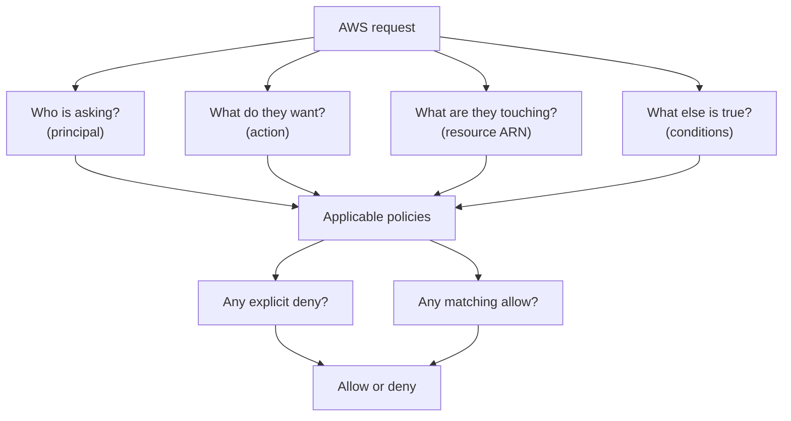

## Table of Contents

1. [The Request Check IAM Is Trying To Answer](#the-request-check-iam-is-trying-to-answer)
2. [The Running Example: One API, Two AWS Touches](#the-running-example-one-api-two-aws-touches)
3. [Principals: Who Is Asking?](#principals-who-is-asking)
4. [Root, IAM Users, Groups, And Roles](#root-iam-users-groups-and-roles)
5. [Policies: The Permission Sentence](#policies-the-permission-sentence)
6. [Actions, Resources, And Conditions](#actions-resources-and-conditions)
7. [The ECS Task Role For The Orders API](#the-ecs-task-role-for-the-orders-api)
8. [Explicit Deny And Real AccessDenied Messages](#explicit-deny-and-real-accessdenied-messages)
9. [A Calm Diagnostic Path](#a-calm-diagnostic-path)
10. [The Least-Privilege Tradeoff](#the-least-privilege-tradeoff)

## The Request Check IAM Is Trying To Answer

Every useful AWS system eventually asks the same plain question:
should this request be allowed?

That question sits behind Console clicks, AWS CLI commands, Terraform applies, CI/CD deploys, and code running inside AWS.
IAM (Identity and Access Management, AWS's permission system) is the service that helps AWS answer that question.
It is not a firewall and it is not a place where your app runs.
It is the permission layer AWS checks when someone or something tries to use an AWS API.

The check is easier to understand when you do not start with the JSON.
Start with the request.
AWS needs to know who is asking, what action they want to perform, which resource they are trying to touch, what conditions are true around the request, whether any policy allows it, and whether any policy explicitly denies it.

That is the core mental model.
IAM is not mainly a list of product features.
It is a decision process.

You will hear many IAM nouns:
principal, user, group, role, policy, action, resource, ARN, condition, explicit deny.
Those words are useful only when they answer the request check.
If you can read an error and find the caller, action, resource, and reason for denial, IAM becomes much less scary.

Here is the beginner picture:



Read the diagram from the request outward.
AWS does not ask whether the service is important or whether the developer is in a hurry.
It checks the information in the request against the policies that apply.

By default, IAM does not allow a request.
That default is important.
If there is no matching permission, the request is denied.
If there is a matching allow and no matching deny, the request can succeed.
If there is a matching explicit deny, the request is denied even if another policy allows it.

That last sentence is the one to remember.
An explicit deny wins.

> IAM gets easier when you treat every error as a request story, not as a wall of security vocabulary.

## The Running Example: One API, Two AWS Touches

We will keep one service in view:
`devpolaris-orders-api`.

It is a Node.js backend for checkout.
It receives order requests, validates the cart, writes order records, and sometimes exports order data for reporting.
The team is preparing to run it on AWS with ECS on Fargate.
ECS (Elastic Container Service) runs containers.
Fargate is the compute option where AWS manages the server capacity behind those containers.

The application needs two AWS permissions at runtime:

1. Read one secret from AWS Secrets Manager.
2. Write export files under one S3 prefix.

The secret might hold the database connection string:

```text
secret name:
  devpolaris/orders-api/prod/database-url

secret ARN:
  arn:aws:secretsmanager:us-east-1:123456789012:secret:devpolaris/orders-api/prod/database-url-a1b2c3
```

The S3 bucket might store export files:

```text
bucket:
  devpolaris-orders-api-prod-exports

allowed object prefix:
  orders-api/

example object ARN:
  arn:aws:s3:::devpolaris-orders-api-prod-exports/orders-api/2026-05-02/orders.json
```

An S3 prefix is not a real folder in the same way a Linux directory is.
It is the beginning of an object key.
The S3 console may show it like a folder, but the permission usually talks about object names that start with that prefix.

The service should not read every secret in the account.
It should not write anywhere in the bucket.
It should not use a human developer's access key.
It should not use the AWS account root user.

It should run with an IAM role made for the running application.
That role should have only the permissions the app needs.

This gives us a practical IAM target:

| Runtime Need | AWS Action | Resource Scope |
|--------------|------------|----------------|
| Read database URL secret | `secretsmanager:GetSecretValue` | One Secrets Manager secret ARN |
| Write export object | `s3:PutObject` | Objects under one S3 prefix |
| Run as the app | ECS task role | Role attached to the ECS task definition |

Notice the shape.
We are not saying "give the app S3 access" or "give the app Secrets Manager access."
Those sentences are too vague.
We are saying exactly which request should pass.

That is how you keep IAM practical.
You begin with the app behavior, then translate behavior into actions and resources.

## Principals: Who Is Asking?

A principal is the authenticated thing making the request.
Authenticated means AWS knows who the request is coming from.
In a web app, you may already know this idea as "the current user."
In AWS, the current caller might be a person, a role session, an AWS service, or in a few cases an anonymous caller.

When Maya runs an AWS CLI command from her laptop, the principal might be an assumed role session:

```bash
$ aws sts get-caller-identity
{
  "UserId": "AROAXAMPLEID:maya",
  "Account": "123456789012",
  "Arn": "arn:aws:sts::123456789012:assumed-role/devpolaris-developer/maya"
}
```

This output answers the first IAM question:
who is asking?

The `Arn` field says the current caller is not the root user and not a plain IAM user.
It is a role session.
Maya assumed the role named `devpolaris-developer`, and the session name is `maya`.
The role decides what permissions the session can use.

When `devpolaris-orders-api` runs on ECS, the principal should look different.
The app should be using a task role session, not Maya's credentials:

```text
caller:
  arn:aws:sts::123456789012:assumed-role/devpolaris-orders-api-prod-task-role/ecs-task-9f3a

plain English:
  the running ECS task is asking AWS while acting as the orders API task role
```

That distinction matters.
If the app uses Maya's access key, the app keeps working only because a human credential was smuggled into runtime.
That is fragile and unsafe.
If Maya leaves the team, rotates her key, or loses access, the service can break.
If the key leaks, the attacker gets Maya's permissions, not the app's narrow runtime permissions.

The principal should match the work.
Humans use human access.
Deployment automation uses a deploy role.
The running application uses a runtime role.

Here are the first IAM nouns in plain language:

| Word | Plain Meaning | Beginner Check |
|------|---------------|----------------|
| Principal | The caller AWS is evaluating | Does the ARN match the person, service, or role you expected? |
| Role session | Temporary credentials created from a role | Does the session name tell you which tool or task used it? |
| Service principal | An AWS service acting in a trust policy | Is this service allowed to assume the role? |
| Anonymous principal | No signed identity | Did you intend public access? |

You do not need to memorize every principal type today.
You need the habit of finding the caller in an error message.

The caller is usually the first clue.
If an error says the caller is `arn:aws:iam::123456789012:user/maya`, but you expected an ECS task role, the policy may not be the real problem.
The app may be running with the wrong credentials.

## Root, IAM Users, Groups, And Roles

AWS account access starts with the root user.
The root user is the original identity created with the AWS account.
It has very broad account-level power.
It is not a normal daily developer login.

For a beginner, the safest mental model is:
root is for rare account ownership tasks, not normal engineering work.
Protect it with MFA (multi-factor authentication, a second proof during sign-in), avoid root access keys, and do not use it to deploy applications.

An IAM user is an identity created inside one AWS account.
It can have a console password, access keys, and policies.
Older AWS setups used IAM users for many human developers.
Modern AWS guidance usually prefers federation or IAM Identity Center for human access, because those approaches issue temporary credentials instead of long-lived user keys.

You will still see IAM users in real accounts.
When you do, think:
"this is a named identity in one account, often with long-lived credentials."

An IAM group is a collection of IAM users.
Groups help attach permissions to several users at once.
Groups are not principals in the same way users and roles are.
You do not sign in as a group.
You sign in as a user, and the user's group memberships can add permissions.

An IAM role is an identity that is meant to be assumed.
Assumed means a trusted caller receives temporary credentials for that role.
The caller might be a human, a CI/CD job, ECS, Lambda, or another AWS service.
Roles are the normal way to give AWS workloads permissions without putting permanent keys into code.

Here is the practical comparison:

| Identity | What It Is For | Credential Shape | Good Beginner Use |
|----------|----------------|------------------|-------------------|
| Root user | Account ownership and rare emergency tasks | Root sign-in credentials | Lock it down, avoid daily use |
| IAM user | Named identity inside one account | Often long-lived password or access keys | Understand legacy setups and special cases |
| IAM group | Permission management for IAM users | No sign-in by itself | Attach shared policies to users |
| IAM role | Temporary access for trusted callers | Temporary credentials | Humans, deploy jobs, ECS tasks, and services |

The `devpolaris-orders-api` runtime should use a role.
That role might be named `devpolaris-orders-api-prod-task-role`.

The role needs two pieces:

1. A trust policy that says who can assume the role.
2. A permissions policy that says what the role can do after it is assumed.

The trust policy answers:
"is ECS allowed to hand this role to a task?"

The permissions policy answers:
"once the task has this role, can it read this secret and write this S3 object?"

Those are separate questions.
This is one of the first IAM ideas that feels weird but becomes useful fast.
Being allowed to wear the badge is not the same thing as what the badge can open.

For our app, the trust side is about ECS tasks.
The permission side is about Secrets Manager and S3.

That split also helps during debugging.
If the task cannot start with the role, inspect the trust relationship and ECS task definition.
If the task starts but gets `AccessDenied` when reading the secret, inspect the permissions attached to the role.

## Policies: The Permission Sentence

A policy is a permission document.
Most IAM policies are JSON.
That can make them look more complicated than they are.
At the beginner level, a policy statement is a sentence with a few important blanks.

| Policy Part | Plain Meaning |
|-------------|---------------|
| `Effect` | Allow or deny the request |
| `Action` | Which AWS API operation or family of operations |
| `Resource` | Which AWS resource the action applies to |
| `Condition` | Extra rules that must be true |

In an identity-based policy, the principal is implied.
That means if the policy is attached to `devpolaris-orders-api-prod-task-role`, AWS already knows the policy is about that role.
You do not put a `Principal` element inside that kind of policy.

In a resource-based policy, the principal is written directly in the policy.
An S3 bucket policy and an IAM role trust policy are common examples.
Those policies live on a resource, so they must say which principal they are talking about.

This is the difference:

| Policy Type | Attached To | Where Principal Comes From |
|-------------|-------------|----------------------------|
| Identity-based policy | User, group, or role | The attached identity is the principal |
| Resource-based policy | Resource, such as an S3 bucket or role trust policy | The policy names the principal |

The orders API role needs an identity-based permissions policy.
Here is a small teaching example.
It is not trying to be a full production policy for every company.
It shows how the request check maps to JSON.

```json
{
  "Version": "2012-10-17",
  "Statement": [
    {
      "Sid": "ReadOnlyTheOrdersDatabaseSecret",
      "Effect": "Allow",
      "Action": "secretsmanager:GetSecretValue",
      "Resource": "arn:aws:secretsmanager:us-east-1:123456789012:secret:devpolaris/orders-api/prod/database-url-a1b2c3"
    },
    {
      "Sid": "WriteOnlyOrdersApiExports",
      "Effect": "Allow",
      "Action": "s3:PutObject",
      "Resource": "arn:aws:s3:::devpolaris-orders-api-prod-exports/orders-api/*"
    },
    {
      "Sid": "DenyS3RequestsWithoutTLS",
      "Effect": "Deny",
      "Action": "s3:*",
      "Resource": [
        "arn:aws:s3:::devpolaris-orders-api-prod-exports",
        "arn:aws:s3:::devpolaris-orders-api-prod-exports/*"
      ],
      "Condition": {
        "Bool": {
          "aws:SecureTransport": "false"
        }
      }
    }
  ]
}
```

Read the first statement as plain English:
allow this role to call `secretsmanager:GetSecretValue` on this one secret.

Read the second statement:
allow this role to call `s3:PutObject` only for object keys under `orders-api/` in this one bucket.

Read the third statement:
deny S3 requests to this bucket when the request is not using secure transport.

The third statement is a condition example.
A condition is an extra test.
The deny applies only when `aws:SecureTransport` is `false`.
If a normal AWS SDK request uses HTTPS, this condition does not match and this deny statement does not block it.

This example also teaches a quiet S3 detail.
Writing an object uses an object ARN:

```text
arn:aws:s3:::devpolaris-orders-api-prod-exports/orders-api/*
```

Listing a bucket would use the bucket ARN:

```text
arn:aws:s3:::devpolaris-orders-api-prod-exports
```

Those are different resources.
If the app later starts listing the prefix before writing, the request changes.
The policy would need to change too.
That is not IAM being annoying.
It is IAM forcing you to name the real operation.

## Actions, Resources, And Conditions

An action is the AWS operation the caller wants to perform.
Actions usually look like `service:OperationName`.
For example:
`secretsmanager:GetSecretValue`, `s3:PutObject`, `ecs:UpdateService`, and `logs:CreateLogStream`.

The action should match what the app or tool actually does.
This sounds obvious until you debug a real service.
The app may say "read config", but the AWS action is `secretsmanager:GetSecretValue`.
The deploy script may say "restart the service", but the AWS action is `ecs:UpdateService`.
The export worker may say "upload report", but the AWS action is `s3:PutObject`.

The resource is the AWS thing the action targets.
Permissions usually identify resources with ARNs (Amazon Resource Names, AWS's full resource identifiers).
You already saw ARNs in the foundations article.
In IAM, ARNs matter because they let a policy point at one secret, one bucket prefix, one role, or one service instead of the whole account.

For the orders API, the useful resource checks are:

| Need | Action | Resource ARN |
|------|--------|--------------|
| Read the database URL | `secretsmanager:GetSecretValue` | One secret ARN |
| Upload an export | `s3:PutObject` | Objects under one prefix |
| Update the ECS service during deploy | `ecs:UpdateService` | One ECS service ARN |

The condition is the "only when" part.
Not every statement needs a condition.
Conditions are useful when the resource and action are not enough.

Examples:

| Condition Idea | Plain Meaning | Why It Helps |
|----------------|---------------|--------------|
| `aws:SecureTransport` | Only allow or deny based on HTTPS use | Prevents unsafe transport for S3 requests |
| `aws:PrincipalArn` | Check which principal is calling | Restricts access to a known role in some resource policies |
| `s3:prefix` | Check the requested S3 listing prefix | Allows listing only a specific area of a bucket |
| `aws:RequestedRegion` | Check the requested AWS Region | Keeps some actions inside approved Regions |

Conditions can express important rules, but they can also make policies harder to read.
Do not add one because it looks advanced.
Add one when you can say the plain rule clearly:
"this request is allowed only when it is using HTTPS" or "this list request is allowed only for this prefix."

The beginner trap is thinking that `Action`, `Resource`, and `Condition` are independent decorations.
They work together.
AWS evaluates the request as a whole.

Imagine this request:

```text
principal:
  arn:aws:sts::123456789012:assumed-role/devpolaris-orders-api-prod-task-role/ecs-task-9f3a

action:
  s3:PutObject

resource:
  arn:aws:s3:::devpolaris-orders-api-prod-exports/orders-api/2026-05-02/orders.json

context:
  aws:SecureTransport = true
```

The policy we saw allows that action on that object ARN.
The explicit deny for insecure S3 requests does not match because `aws:SecureTransport` is true.
So the request has a path to allow.

Now change only the object key:

```text
resource:
  arn:aws:s3:::devpolaris-orders-api-prod-exports/manual-backups/orders.json
```

The principal is the same.
The action is the same.
The context is still secure.
But the resource no longer starts with `orders-api/`.
The allow statement does not match.
The result is denied by default.

That is IAM doing its job.
The app asked to write outside its lane.

## The ECS Task Role For The Orders API

When a container runs on ECS, it should not carry a hardcoded access key.
The cleaner pattern is to give the ECS task an IAM task role.
ECS makes temporary credentials for that role available to the containers in the task.
The AWS SDK in the Node.js app can find those credentials automatically through the container credential provider.

There are two ECS roles beginners often mix up:

| Role | Who Uses It | What It Is For |
|------|-------------|----------------|
| Task execution role | ECS and Fargate agent | Pulling the image, writing logs, fetching some startup data |
| Task role | Your application code | Calling AWS services from inside the container |

For `devpolaris-orders-api`, reading the database secret and writing S3 exports are application behavior.
Those permissions belong on the task role.

Pulling the container image from ECR and sending container logs to CloudWatch are platform startup behavior.
Those permissions usually belong on the task execution role.

Mixing these roles creates confusion.
If you put app permissions on the execution role, the app may still fail because the app is not using that role.
If you put image-pull permissions on the task role, the task may fail before your app even starts.

A task definition review might look like this:

```text
ECS task definition review

family:
  devpolaris-orders-api-prod

taskRoleArn:
  arn:aws:iam::123456789012:role/devpolaris-orders-api-prod-task-role

executionRoleArn:
  arn:aws:iam::123456789012:role/devpolaris-orders-api-prod-execution-role

container:
  orders-api

runtime AWS calls from app:
  secretsmanager:GetSecretValue
  s3:PutObject
```

The line to notice is `taskRoleArn`.
That is the role your Node.js code should use when it calls Secrets Manager or S3.

If the app logs show `AccessDenied`, do not immediately edit the execution role.
First check which role appears in the error.
If the error says `assumed-role/devpolaris-orders-api-prod-task-role`, you are looking at the app's task role.
If the task fails before the container starts, then the execution role may be part of the story.

The request check keeps the roles separate:

```text
app reads secret:
  principal = task role session
  action = secretsmanager:GetSecretValue
  resource = database secret ARN

ECS pulls image:
  principal = execution role session
  action = ECR image pull actions
  resource = image repository
```

Those are not the same request.
They should not be debugged as if they are.

## Explicit Deny And Real AccessDenied Messages

Access denied messages look unfriendly at first.
They are long, they contain ARNs, and they often arrive while something important is broken.
The trick is to read them as structured clues.

Start with a missing allow.
The orders API starts, then fails while reading its database URL:

```text
2026-05-02T10:14:22.418Z ERROR orders-api config.load failed
AccessDeniedException: User: arn:aws:sts::123456789012:assumed-role/devpolaris-orders-api-prod-task-role/ecs-task-9f3a
is not authorized to perform: secretsmanager:GetSecretValue
on resource: arn:aws:secretsmanager:us-east-1:123456789012:secret:devpolaris/orders-api/prod/database-url-a1b2c3
because no identity-based policy allows the secretsmanager:GetSecretValue action
```

Read it in five calm passes:

| Clue | Value In The Message |
|------|----------------------|
| Caller | `devpolaris-orders-api-prod-task-role/ecs-task-9f3a` |
| Account | `123456789012` |
| Action | `secretsmanager:GetSecretValue` |
| Resource | The database URL secret ARN |
| Reason | No identity-based policy allows the action |

That is a narrow problem.
The task role is being used.
The action is clear.
The resource is the secret.
The likely fix is to attach or correct an identity-based policy on the task role so it allows `secretsmanager:GetSecretValue` on that secret.

Do not fix this by adding `secretsmanager:*` on `*`.
That would make the error disappear by giving the app much more access than it needs.
The calm fix is smaller:
allow the exact action on the exact secret.

Now look at an S3 prefix mistake.
The app can write under `orders-api/`, but a new export path accidentally uses `manual-backups/`:

```text
2026-05-02T10:25:09.021Z ERROR orders-api export.write failed
AccessDenied: User: arn:aws:sts::123456789012:assumed-role/devpolaris-orders-api-prod-task-role/ecs-task-9f3a
is not authorized to perform: s3:PutObject
on resource: arn:aws:s3:::devpolaris-orders-api-prod-exports/manual-backups/orders.json
because no identity-based policy allows the s3:PutObject action
```

The important clue is the resource.
The object path is outside the allowed `orders-api/` prefix.
That could be an application configuration bug, not an IAM bug.

A safe fix direction might be:
change the app's export prefix back to `orders-api/`.
Only widen the IAM policy if the new prefix is an intentional product requirement.

Now look at an explicit deny.
Suppose the organization has a guardrail that denies production S3 writes unless they use secure transport.
The app has an allow for `s3:PutObject`, but a misconfigured client somehow sends an insecure request:

```text
AccessDenied: User: arn:aws:sts::123456789012:assumed-role/devpolaris-orders-api-prod-task-role/ecs-task-9f3a
is not authorized to perform: s3:PutObject
on resource: arn:aws:s3:::devpolaris-orders-api-prod-exports/orders-api/2026-05-02/orders.json
with an explicit deny in an identity-based policy
```

This is different from "no identity-based policy allows."
There is a deny that matches the request.
Adding another allow will not fix it.
The explicit deny wins.

The right question changes:
which deny statement matched, and why?

If the deny is based on `aws:SecureTransport = false`, the fix is to correct the client or endpoint behavior so the request uses HTTPS.
Do not remove the deny just to make the error go away.
The deny is protecting a rule the team probably wanted.

This is why wording matters.
`no policy allows` points you toward a missing or mismatched allow.
`explicit deny` points you toward a guardrail, boundary, service control policy, resource policy, or deny statement that matched.

## A Calm Diagnostic Path

When IAM breaks, the worst first move is guessing.
The second worst move is adding broad permissions because the deploy is blocked.
Use the request check instead.

Start with the caller.
From a terminal, `sts get-caller-identity` tells you which identity your CLI is using:

```bash
$ aws sts get-caller-identity --profile devpolaris-prod
{
  "UserId": "AROAXAMPLEID:maya",
  "Account": "123456789012",
  "Arn": "arn:aws:sts::123456789012:assumed-role/devpolaris-developer/maya"
}
```

For an ECS runtime error, the caller usually comes from the log message.
You can also inspect the ECS task definition to confirm which role the app should be using:

```bash
$ aws ecs describe-task-definition \
>   --task-definition devpolaris-orders-api-prod \
>   --region us-east-1 \
>   --query 'taskDefinition.{taskRoleArn:taskRoleArn,executionRoleArn:executionRoleArn}'
{
  "taskRoleArn": "arn:aws:iam::123456789012:role/devpolaris-orders-api-prod-task-role",
  "executionRoleArn": "arn:aws:iam::123456789012:role/devpolaris-orders-api-prod-execution-role"
}
```

Then compare the action and resource in the error with the policy.
You are checking whether the exact request has a matching allow and no matching deny.

For a policy simulation check, IAM can evaluate a principal policy against actions and resources.
The output is not a replacement for understanding, but it is useful evidence:

```bash
$ aws iam simulate-principal-policy \
>   --policy-source-arn arn:aws:iam::123456789012:role/devpolaris-orders-api-prod-task-role \
>   --action-names secretsmanager:GetSecretValue \
>   --resource-arns arn:aws:secretsmanager:us-east-1:123456789012:secret:devpolaris/orders-api/prod/database-url-a1b2c3 \
>   --query 'EvaluationResults[].{action:EvalActionName,decision:EvalDecision,resource:EvalResourceName}'
[
  {
    "action": "secretsmanager:GetSecretValue",
    "decision": "allowed",
    "resource": "arn:aws:secretsmanager:us-east-1:123456789012:secret:devpolaris/orders-api/prod/database-url-a1b2c3"
  }
]
```

The simulator answers a narrow question:
"would this principal be allowed to make this kind of request against this resource?"
Run the same shape for `s3:PutObject` and one object ARN under the `orders-api/` prefix when the S3 write is the request you are checking.

If the simulator says `allowed` but the app still fails, keep going.
The app may be using a different role than you simulated.
The resource ARN in the real error may differ.
A condition may depend on runtime context that your simulation did not include.
The secret may use a customer managed KMS key and require `kms:Decrypt`.
The deny may live in a resource policy or organization guardrail.

That is why you keep the diagnostic path small and ordered:

```text
IAM diagnostic path

1. Identify the caller.
   Check the ARN in the error or run sts get-caller-identity.

2. Identify the action.
   Copy the exact action from the error, such as s3:PutObject.

3. Identify the resource.
   Copy the exact ARN from the error and check account, Region, and name.

4. Check the expected role.
   For ECS, compare taskRoleArn and executionRoleArn.

5. Look for a matching allow.
   The allow must match principal, action, resource, and conditions.

6. Look for an explicit deny.
   If a deny matches, another allow will not solve it.

7. Fix the smallest wrong thing.
   Correct the app config, role attachment, resource ARN, condition, or policy.
```

This path works because it follows the same decision AWS is making.
You are not trying random doors.
You are rebuilding the request.

## The Least-Privilege Tradeoff

Least privilege means giving an identity only the permissions it needs for its job.
For `devpolaris-orders-api`, that means one secret and one S3 prefix, not every secret and every bucket.

The benefit is obvious during a bad day.
If the app has narrow access and a bug tries to upload to the wrong place, IAM blocks it.
If the app's runtime credentials leak, the attacker gets a smaller set of permissions.
If a developer reviews the policy, they can understand what the app is supposed to touch.

The cost is also real.
Narrow policies require more thinking.
When the app changes behavior, the policy may need to change.
If the team makes policies too tight without understanding the app, deployments can fail and people may start asking for broad access just to move faster.

That is the tradeoff:

| Choice | What You Gain | What You Give Up |
|--------|---------------|------------------|
| Broad policy | Fewer permission errors at first | Bigger blast radius and weaker review |
| Narrow policy | Smaller blast radius and clearer intent | More policy maintenance as the app changes |
| Conditions | Stronger rules for context-sensitive access | More places where a request can fail |
| Separate roles per workload | Cleaner ownership and audit trails | More IAM resources to name and manage |

For a beginner team, the goal is not a perfect policy on day one.
The goal is a policy that clearly matches the service's current behavior and can be reviewed without guesswork.

A good review question sounds like this:

```text
Can the orders API do its job with this access?

yes:
  read the database URL secret
  write exports under orders-api/

no:
  read unrelated secrets
  list every bucket
  delete objects
  update ECS services
  create new IAM roles
```

That review is not bureaucracy.
It is a simple way to keep the role honest.
The role should describe the job.
If the job changes, update the role intentionally.

The final IAM habit is calm precision.
When a request fails, do not read the error as "AWS hates me."
Read it as:
who asked, what action, which resource, under what conditions, and which policy decision followed?

Once you can answer those questions, IAM becomes a tool you can operate, not a maze you hope to survive.

---

**References**

- [Policy evaluation logic](https://docs.aws.amazon.com/IAM/latest/UserGuide/reference_policies_evaluation-logic.html) - Explains how AWS evaluates a request, combines policy types, and lets explicit deny override allow.
- [Policies and permissions in AWS Identity and Access Management](https://docs.aws.amazon.com/IAM/latest/UserGuide/access_policies.html) - Defines identity-based policies, resource-based policies, policy statements, actions, resources, conditions, and root user policy limits.
- [Root user best practices for your AWS account](https://docs.aws.amazon.com/IAM/latest/UserGuide/root-user-best-practices.html) - Gives the official guidance for protecting the root user and preferring temporary credentials for normal access.
- [Amazon ECS task IAM role](https://docs.aws.amazon.com/AmazonECS/latest/developerguide/task-iam-roles.html) - Shows how ECS task roles provide credentials to containers and separates task role permissions from ECS agent permissions.
- [GetSecretValue](https://docs.aws.amazon.com/secretsmanager/latest/apireference/API_GetSecretValue.html) - Documents the Secrets Manager action used by the running app to retrieve one secret value.
- [Policies and permissions in Amazon S3](https://docs.aws.amazon.com/AmazonS3/latest/userguide/access-policy-language-overview.html) - Documents S3 policy resources for bucket-level and object-level permissions, including objects under a prefix.
