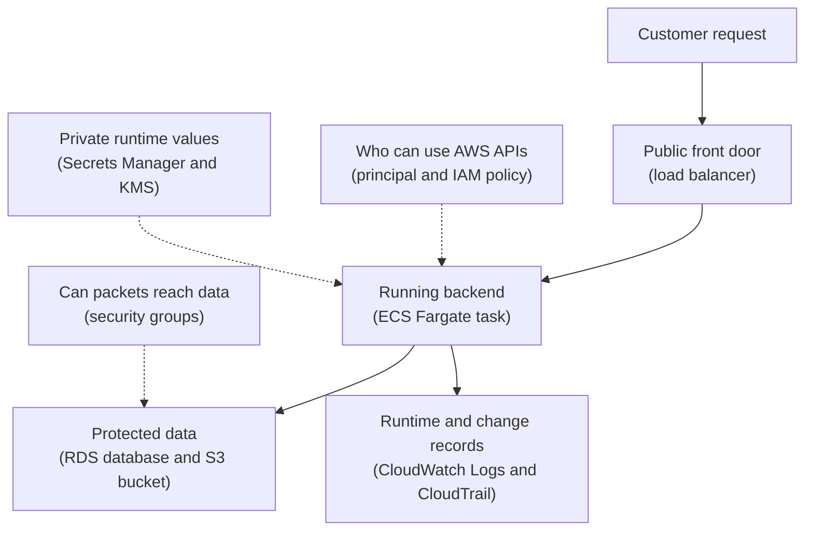

## Table of Contents

1. [Security As Several Different Checks](#security-as-several-different-checks)
2. [The Running Example](#the-running-example)
3. [The Security Checklist](#the-security-checklist)
4. [Identity And Permission Checks](#identity-and-permission-checks)
5. [Resource Rules Are Separate Doors](#resource-rules-are-separate-doors)
6. [Network Reachability Is A Different Question](#network-reachability-is-a-different-question)
7. [Secrets And Encryption Protect Different Things](#secrets-and-encryption-protect-different-things)
8. [Audit Records Tell You What Happened](#audit-records-tell-you-what-happened)
9. [A Practical Diagnosis Path](#a-practical-diagnosis-path)
10. [Tradeoffs For A First Secure Design](#tradeoffs-for-a-first-secure-design)

## Security As Several Different Checks

When people first say "AWS security," it can sound like one giant lock around the cloud.
That mental model creates trouble.
You see an error, someone says "it is a security issue," and the next question becomes too vague to answer.
Security issue where?
The app role?
The database network rule?
The secret value?
The encryption key?
The audit trail?

AWS security is easier when you split it into smaller checks.
Each check answers a different question.
Some checks happen when you call an AWS API.
Some checks happen when a network packet tries to reach a port.
Some checks protect a password or token.
Some checks decide whether encrypted data can be read.
Some checks do not block anything directly, but leave records so the team can understand what happened later.

This article is a mental model for those checks.
It is not a full IAM tutorial yet.
It is not a full networking tutorial yet.
Those pieces each deserve their own article.
Here we are learning how to ask the right first question before jumping into the wrong console page.

The most important beginner split is this:
IAM permissions and network reachability are different questions.
IAM (Identity and Access Management, AWS's permission system) decides whether a person, script, or AWS service can perform an AWS action like `secretsmanager:GetSecretValue` or `s3:PutObject`.
Network reachability decides whether traffic can move from one place to another, such as an ECS task connecting to an RDS database on port `5432`.

You can pass one check and fail the other.
An app can have IAM permission to read a secret, but no network path to the database described inside that secret.
An app can reach the database port, but still fail because it does not know the database password.
A developer can open the AWS Console and see an S3 bucket, but still be blocked from downloading an object because the bucket policy or encryption key says no.

That is why good AWS debugging starts with separate questions.
Not "is security blocking me?"
Instead:
who is asking, what are they allowed to do, what resource is being touched, can the network path reach it, where is the secret, which encryption key protects it, and where is the audit record?

> Security gets less mysterious when every failure has a specific door.

AWS and your team both have responsibilities here.
AWS runs the physical data centers, the managed service control planes, and the underlying infrastructure.
Your team chooses identities, policies, network rules, secret storage, encryption settings, tags, alarms, and review habits.
For this article, that ownership idea is only background.
The practical skill is learning which check to inspect first.

## The Running Example

Keep one service in your head through the article: `devpolaris-orders-api`.
It is a Node.js backend that receives checkout requests, validates carts, writes order records, stores occasional export files, and emits logs for support.
The likely first AWS shape is simple enough to reason about:
ECS on Fargate runs the container, RDS stores orders, S3 stores export files, Secrets Manager stores database credentials, and CloudWatch stores application logs.

The service does not need exotic security ideas to have real security questions.
Even a small backend has several actors:
a human developer, a CI/CD deploy role, an ECS task role, an ECS task execution role, the RDS database user, and AWS services acting on the team's behalf.
An actor that can make a request is called a principal.
In AWS, a principal might be a role, a user, an AWS service, or a temporary role session.

The app also has several resources.
A resource is one thing AWS manages or protects, such as an ECS service, an RDS database, an S3 bucket, a secret, a KMS key, or a CloudWatch log group.
Security is the conversation between principals, actions, resources, network paths, and records.

Here is the first useful map.
Read the solid arrows as the normal request path.
Read the dotted lines as checks or records around that path.



This diagram avoids one common mistake.
IAM is not drawn as a main traffic hop between the app and the database.
That is because IAM does not normally open TCP connections for you.
IAM decides whether AWS API calls are allowed.
The database connection still needs a network path, database credentials, and database-side authorization.

For `devpolaris-orders-api`, a normal checkout request might pass these checks:
the customer reaches the load balancer over HTTPS.
The load balancer can send traffic to healthy ECS tasks.
The ECS task can reach the RDS database network address.
The app can retrieve the database secret from Secrets Manager.
The task role has permission to call Secrets Manager.
The secret and database storage are encrypted.
CloudWatch receives runtime logs.
CloudTrail records AWS API changes, such as someone editing a security group rule.

That is a lot for one word called "security."
The value of the mental model is that each part has its own evidence.
You can inspect IAM errors, security group rules, secret metadata, KMS key access, app logs, and CloudTrail records separately.

## The Security Checklist

Before learning the deeper pieces, it helps to keep a plain checklist nearby.
This is the checklist a senior engineer usually runs mentally when a secure AWS app fails.
You do not need every AWS service name yet.
You need the shape of the questions.

| Check | Plain Question | Common AWS Evidence |
|-------|----------------|---------------------|
| Identity | Who is asking? | `aws sts get-caller-identity`, role ARN, CloudTrail `userIdentity` |
| Permission | What action is allowed? | IAM policy, access denied error, policy simulator |
| Resource rule | Does the resource also allow it? | S3 bucket policy, KMS key policy, secret resource policy |
| Network | Can traffic reach the port? | Security groups, subnets, route tables, load balancer target health |
| Secret | Where is the private value stored? | Secrets Manager secret ARN, version label, rotation status |
| Encryption | Which key protects the data? | KMS key ARN, service encryption setting, key policy |
| Audit | What record proves the change? | CloudTrail event, CloudWatch log event, deployment record |

Notice how the checks are not all the same kind of thing.
IAM policies are rules around API calls.
Security groups are rules around network traffic.
Secrets Manager stores private values.
KMS manages keys that services use for encryption.
CloudTrail tells you who did what in AWS.
CloudWatch logs usually tell you what your app printed while running.

The checklist is also useful because AWS errors often mention only one failed check.
If the task role lacks `secretsmanager:GetSecretValue`, the app may crash before it even tries to reach the database.
If the database security group blocks the app task, the app may show a timeout and never mention IAM.
If a KMS key policy blocks decrypt, you may see an access error even though the secret policy looks correct.

Here is a small identity sanity check from a deploy terminal:

```bash
$ aws sts get-caller-identity --profile devpolaris-staging
{
    "UserId": "AROASTAGINGDEPLOY:maya",
    "Account": "222222222222",
    "Arn": "arn:aws:sts::222222222222:assumed-role/orders-api-deploy/maya"
}
```

This output does not prove the deploy can do everything.
It only answers the first question:
who is the terminal acting as right now?
That answer matters because every later permission decision depends on the caller.

For the running service, the caller is often not Maya.
When the Node.js code inside the ECS task calls AWS, the caller should be the task role.
That detail is easy to miss.
Your laptop identity and the app's runtime identity are separate.
Fixing one does not fix the other.

## Identity And Permission Checks

Identity answers "who is asking?"
Permission answers "what is that identity allowed to do?"
AWS evaluates these when a principal calls an AWS API.
The API might be `ecs:UpdateService`, `s3:GetObject`, `secretsmanager:GetSecretValue`, `kms:Decrypt`, or `logs:PutLogEvents`.

For beginners, roles are the safer default mental model than long-lived access keys.
An IAM role is an identity with permissions that someone or something can assume.
Assume means "receive temporary credentials for this role."
Temporary credentials expire, which makes them safer than copying permanent keys into a config file.

For ECS, there are two role names that beginners often mix up.
The task execution role lets ECS do platform work, such as pulling the container image and sending logs.
The task role is what your application code uses when it calls AWS services.
If `devpolaris-orders-api` needs to read a secret or write an S3 export, those permissions belong on the task role.

A small ECS task definition snapshot makes the split visible:

```json
{
  "family": "devpolaris-orders-api",
  "taskRoleArn": "arn:aws:iam::333333333333:role/orders-api-task",
  "executionRoleArn": "arn:aws:iam::333333333333:role/orders-api-execution",
  "containerDefinitions": [
    {
      "name": "orders-api",
      "image": "333333333333.dkr.ecr.us-east-1.amazonaws.com/devpolaris-orders-api:2026-05-02.1",
      "secrets": [
        {
          "name": "DATABASE_URL",
          "valueFrom": "arn:aws:secretsmanager:us-east-1:333333333333:secret:orders-api/prod/database-AbCdEf"
        }
      ]
    }
  ]
}
```

The important lines are not the image tag.
The important lines are the two role ARNs.
If the Node.js process receives an access denied error while reading the database secret, you inspect `orders-api-task`, not `orders-api-execution`.
The execution role may be perfectly fine while the app role is missing a permission.

A minimal policy for reading one database secret might look like this:

```json
{
  "Version": "2012-10-17",
  "Statement": [
    {
      "Effect": "Allow",
      "Action": "secretsmanager:GetSecretValue",
      "Resource": "arn:aws:secretsmanager:us-east-1:333333333333:secret:orders-api/prod/database-AbCdEf"
    }
  ]
}
```

This is an identity-based policy because it attaches to an identity, usually a role.
It says the role can perform one action on one secret.
That is better than allowing `secretsmanager:*` on every secret in the account.

IAM has one rule that is worth learning early:
an explicit deny wins.
If one policy allows an action but another applicable policy explicitly denies it, the request is denied.
That means debugging IAM is not only "find an allow."
You also ask whether a permissions boundary, service control policy, resource policy, session policy, or explicit deny is narrowing the result.

Here is the kind of app log you might see when the task role is wrong:

```text
2026-05-02T09:14:22.481Z ERROR orders-api boot failed
AccessDeniedException: User: arn:aws:sts::333333333333:assumed-role/orders-api-task/3f9d7c
is not authorized to perform: secretsmanager:GetSecretValue
on resource: arn:aws:secretsmanager:us-east-1:333333333333:secret:orders-api/prod/database-AbCdEf
```

This error is not a network error.
The app reached the Secrets Manager API well enough to get a permission decision back.
The fix direction is IAM:
check the task role, check the secret ARN, check the action name, then check whether another policy type denies the call.

This is the first big beginner win.
When the error says "not authorized to perform," start with identity and permission.
Do not spend the first hour changing subnets.

## Resource Rules Are Separate Doors

Some AWS resources have their own policies too.
An identity policy can say "Maya may read this object."
The S3 bucket policy can still say "only requests from this account may read objects."
The KMS key policy can still say "this role may not decrypt with this key."
Those resource-side rules are separate doors.

This can feel strange if you are used to app code where one permission check lives in one place.
AWS often combines several policy types.
That design is useful because the resource owner can protect the resource even when identities live elsewhere.
It is also confusing because a single "AccessDenied" error might come from the caller policy, the resource policy, the key policy, or an organization-level rule.

S3 is the easiest place to feel this.
Imagine `devpolaris-orders-api` writes finance exports to `s3://devpolaris-prod-order-exports`.
The task role needs `s3:PutObject`.
The bucket policy may also restrict which roles can write.
If the bucket uses a customer managed KMS key, the role may also need permission to use that key for encryption.

The practical question is:
which thing owns the final say?
For an S3 object write, the answer can include the IAM role policy, the bucket policy, the object ownership settings, and the KMS key policy.
That does not mean you panic.
It means you inspect the doors in order.

Here is a short failure snapshot:

```text
2026-05-02T10:03:41.119Z ERROR export upload failed
AccessDenied: Access Denied
operation: PutObject
bucket: devpolaris-prod-order-exports
key: daily/2026-05-02/orders.csv
```

This output is less helpful than the Secrets Manager error because S3 errors can be terse.
The diagnosis starts by naming the principal and resource:
the principal is `orders-api-task`.
The action is `s3:PutObject`.
The resource is the bucket path `arn:aws:s3:::devpolaris-prod-order-exports/daily/2026-05-02/orders.csv`.
Then you check identity policy, bucket policy, and encryption key access.

Resource policies are useful, but they can become hard to reason about when every resource has custom exceptions.
A good first design uses narrow identity policies and simple resource policies.
Use resource policies when the resource truly needs to defend itself, such as cross-account access, public access prevention, or key usage control.
Do not turn every resource policy into a second copy of every IAM role policy.

For a beginner, remember this:
an IAM allow is not always the whole answer.
Some resources get a vote too.

## Network Reachability Is A Different Question

Network reachability answers "can traffic get there?"
It is not the same as IAM.
If `devpolaris-orders-api` connects to RDS PostgreSQL on port `5432`, IAM is usually not the thing moving packets.
The app needs a route, a reachable address, a security group rule, and database credentials.

A security group is a resource-level firewall.
It controls inbound and outbound traffic for supported resources inside a VPC.
For the orders API, the app task has one security group and the database has another.
The safer pattern is to allow database inbound traffic only from the app security group, not from the whole internet and not from every private IP range.

The rule reads like a sentence:
allow PostgreSQL from the orders API tasks to the orders database.

| Resource | Security Group | Inbound Rule | Why |
|----------|----------------|--------------|-----|
| Load balancer | `sg-orders-alb` | HTTPS `443` from internet | Customers need the front door |
| ECS tasks | `sg-orders-api` | App port from `sg-orders-alb` | Only the load balancer should call tasks |
| RDS database | `sg-orders-db` | PostgreSQL `5432` from `sg-orders-api` | Only app tasks should reach the database |

That table is not an IAM policy.
There is no `secretsmanager:GetSecretValue` here.
This is about packets and ports.
If the database rule is missing, the app can have perfect IAM permissions and still fail to connect.

A typical network failure looks different from an IAM failure:

```text
2026-05-02T10:18:07.774Z ERROR database connection failed
Error: connect ETIMEDOUT 10.20.12.31:5432
service=devpolaris-orders-api
db_host=orders-prod.cluster-cxample.us-east-1.rds.amazonaws.com
```

This error does not say "not authorized."
It says the connection timed out.
That means the first useful questions are network questions:
is the task in the expected subnets?
Does the task security group allow outbound traffic?
Does the database security group allow inbound traffic from the task security group?
Do route tables and network ACLs block the path?
Is the database endpoint correct?

An AWS CLI snapshot can show the security group relationship without opening five Console tabs:

```bash
$ aws ec2 describe-security-groups \
  --group-ids sg-orders-db \
  --query "SecurityGroups[0].IpPermissions"
[
  {
    "IpProtocol": "tcp",
    "FromPort": 5432,
    "ToPort": 5432,
    "UserIdGroupPairs": [
      {
        "GroupId": "sg-orders-api",
        "Description": "orders api tasks to postgres"
      }
    ]
  }
]
```

The line to notice is `GroupId: sg-orders-api`.
That means the database accepts traffic from resources using the app security group.
If you expected this line and it is missing, you found a likely cause.

The opposite failure can also happen.
A port may be open, but the app still cannot read AWS resources.
For example, an ECS task can reach the public Secrets Manager endpoint but receive `AccessDeniedException`.
That is not solved by opening database port `5432`.
The fix stays in IAM.

This split is one of the most valuable habits in AWS:
permission errors and timeout errors point to different doors.

## Secrets And Encryption Protect Different Things

Secrets and encryption are related, but they are not the same thing.
A secret is a private value the app needs, such as a database password, API token, OAuth client secret, or signing key.
Encryption is a way to make stored or transmitted data unreadable without the right key.

Secrets Manager helps you store, retrieve, and rotate private values.
For `devpolaris-orders-api`, the database connection details might live in one secret.
The task role needs permission to read that secret.
The app should not keep the password hardcoded in Git, in the container image, or in a plain environment file.

A secret can carry structured data.
For a database, teams often store JSON like this:

```json
{
  "host": "orders-prod.cluster-cxample.us-east-1.rds.amazonaws.com",
  "port": 5432,
  "username": "orders_app",
  "password": "not-a-real-password",
  "dbname": "orders"
}
```

This block is evidence of the shape, not a recommendation to print secrets in logs.
In a real system, the app should read the value at runtime and avoid logging the password.
If a support log needs to show configuration, log the secret ARN or database host, not the secret value.

Encryption answers a different question:
if someone gets access to stored bytes, can they read the data?
RDS storage encryption protects database storage at rest.
S3 server-side encryption protects objects at rest.
TLS protects network traffic in transit.
KMS (Key Management Service) manages keys that many AWS services can use for encryption.

The beginner confusion is thinking encryption replaces authorization.
It does not.
Encrypted data can still be read by a principal that is allowed to decrypt it.
An untrusted principal should be blocked by IAM, resource policies, key policies, or service settings before encryption becomes the last line of defense.

KMS introduces its own access question.
If the orders export bucket uses a customer managed KMS key, the task role may need both `s3:PutObject` and permission to use the KMS key.
That second permission is not decorative.
S3 needs to use the key while handling the encrypted object write.

Here is a simple way to separate the ideas:

| Protection | What It Protects | Beginner Check |
|------------|------------------|----------------|
| Secrets Manager | Private values the app must know | Can the task role read the secret ARN? |
| RDS credentials | Database login inside the database | Does the username and password work? |
| Security group | Network path to a port | Can the app task reach the database endpoint? |
| KMS key | Ability to encrypt or decrypt data | Can the caller and service use the key? |
| TLS | Data moving over the network | Is the client using encrypted connection settings? |

That table shows why a startup failure can require more than one fix.
The app may read the secret successfully, then fail to connect to RDS because of a security group.
Or it may reach RDS, then fail database login because the password inside the secret is stale.
Or it may write to S3 in staging, then fail in production because the production bucket uses a customer managed KMS key and the task role lacks key access.

Secrets reduce the damage of leaked source code.
Encryption reduces the damage of exposed storage or intercepted traffic.
Permissions decide who can ask for either one.
Audit records help you prove who changed them.

## Audit Records Tell You What Happened

Audit records answer "what happened, when, and by whom?"
They are not only for compliance teams.
They are how you debug changes that happened before you arrived.
When a security group rule changes, a secret is updated, a role policy is attached, or an ECS service is deployed, the team needs a record.

AWS has two names that beginners mix up: CloudTrail and CloudWatch.
CloudTrail records AWS account activity, including actions taken through the Console, CLI, SDKs, and AWS APIs.
CloudWatch collects runtime signals such as application logs, metrics, alarms, and dashboards.
Both are useful, but they answer different questions.

For `devpolaris-orders-api`, CloudWatch might show:
the app printed `connect ETIMEDOUT`.
CloudTrail might show:
Maya changed the database security group twenty minutes before the timeout started.
Those two records together tell the story.

Here is a CloudTrail lookup for a security group change:

```bash
$ aws cloudtrail lookup-events \
  --lookup-attributes AttributeKey=EventName,AttributeValue=AuthorizeSecurityGroupIngress \
  --max-results 1
{
  "Events": [
    {
      "EventTime": "2026-05-02T09:58:31+00:00",
      "Username": "maya",
      "EventName": "AuthorizeSecurityGroupIngress",
      "Resources": [
        {
          "ResourceName": "sg-orders-db",
          "ResourceType": "AWS::EC2::SecurityGroup"
        }
      ]
    }
  ]
}
```

This does not prove the rule is correct.
It proves a relevant change happened.
The next step is to inspect the event details or the current security group rules.
Audit records narrow the search from "someone changed something" to "this principal changed this resource at this time."

CloudTrail event history is especially helpful for recent management events.
For longer retention or deeper querying, teams create trails or CloudTrail Lake event data stores.
You do not need to design the audit archive on day one, but you should know that a production account needs durable records outside one person's memory.

CloudWatch logs are the app's side of the story.
Good app logs should include the service name, environment, request ID, and the failed dependency.
They should not include passwords, tokens, or full secret values.
If a log line leaks a secret, the fix is not only "delete the log."
The team should rotate the secret and review who could read the log group.

Audit records do not prevent every mistake.
They make mistakes explainable.
That matters during incidents because guessing burns time.

## A Practical Diagnosis Path

Now we can put the mental model to work.
Imagine a deploy for `devpolaris-orders-api` succeeds, but the new tasks keep restarting.
The load balancer shows unhealthy targets.
The app logs show a startup failure.

The first useful evidence is the CloudWatch log line:

```text
2026-05-02T11:06:44.220Z ERROR orders-api startup failed
service=devpolaris-orders-api env=prod task=3f9d7c
reason="database initialization failed"
cause="AccessDeniedException: not authorized to perform secretsmanager:GetSecretValue"
secret="arn:aws:secretsmanager:us-east-1:333333333333:secret:orders-api/prod/database-AbCdEf"
```

This is not yet a database problem.
The app failed before it had the password.
The diagnosis starts with the identity that called Secrets Manager.
For an ECS task, that is the task role.
You inspect the task definition and confirm `taskRoleArn` is `orders-api-task`.

Next you inspect the role policy.
You are looking for the exact action and the exact secret ARN.
If the policy only allows the staging secret, production will fail.
If the policy allows `GetSecretValue` but a permissions boundary denies production secrets, the result is still denied.
If the secret uses a customer managed KMS key, you also check whether the role can use the key as needed.

Suppose you fix that IAM problem and deploy again.
The app now gets past secret loading, but the log changes:

```text
2026-05-02T11:21:09.018Z ERROR database connection failed
service=devpolaris-orders-api env=prod task=81ac2e
host=orders-prod.cluster-cxample.us-east-1.rds.amazonaws.com port=5432
cause="connect ETIMEDOUT 10.20.12.31:5432"
```

This is the moment where beginners often keep editing IAM because the previous problem was IAM.
The error changed.
Now the useful door is network reachability.
Check whether the ECS task security group is allowed into the RDS security group on port `5432`.
Check whether the tasks and database are in the expected VPC.
Check whether route tables and network ACLs match the intended private path.

Suppose the security group is fixed and the app reaches the database, but login fails:

```text
2026-05-02T11:32:55.604Z ERROR database authentication failed
service=devpolaris-orders-api env=prod
database=orders user=orders_app
cause="password authentication failed for user orders_app"
```

That is neither IAM nor a security group timeout.
The app reached the database and received a database authentication decision.
Now the useful checks are the secret value, the database user, and rotation history.
Maybe the password in Secrets Manager changed but the RDS user password did not.
Maybe rotation updated one side and failed before updating the other.

The same path works for S3 exports:
if the error says `AccessDenied` on `s3:PutObject`, inspect task role and bucket policy.
If it says `AccessDenied` on `kms:Encrypt` or `kms:GenerateDataKey`, inspect the KMS key policy and role permissions.
If it says `ENOTFOUND` or timeout to an endpoint, inspect network and DNS.
If nobody knows who changed the rule, inspect CloudTrail.

Here is the diagnosis path as a compact checklist:

| Symptom | First Door To Inspect | Why |
|---------|-----------------------|-----|
| `not authorized to perform secretsmanager:GetSecretValue` | Task role IAM policy | AWS returned a permission decision |
| `connect ETIMEDOUT host:5432` | Security groups and network path | The app could not complete a TCP connection |
| `password authentication failed` | Secret value and database user | The database rejected the credentials |
| `AccessDenied` on `s3:PutObject` | IAM role, bucket policy, KMS key | S3 write authorization can involve multiple policies |
| Unknown recent change | CloudTrail event history | You need who, what, and when |

The skill is not memorizing every possible error.
The skill is reading the shape of the error and choosing the right first door.

## Tradeoffs For A First Secure Design

A secure first design should be understandable.
That matters because a system nobody understands becomes unsafe in a different way.
People copy policies, open ports, skip rotation, and ignore logs when the design feels like a maze.

For `devpolaris-orders-api`, a practical first design might use:
one task role for the orders API, one execution role for ECS platform work, one database secret, one app security group, one database security group, encryption enabled on RDS and S3, CloudWatch logs for the app, and CloudTrail for account activity.
That is not the most advanced design possible.
It is a design a small team can operate and debug.

The main tradeoff is simplicity versus tight boundaries.
One broad role is easy to set up, but dangerous because every future bug receives too much access.
Many tiny roles and policies reduce blast radius, but they create more things to name, review, and troubleshoot.
The useful middle ground is one role per workload and one narrow policy per job.
The orders API gets the secret and bucket access it needs.
The billing worker, if it appears later, gets its own role.

Network rules have the same tradeoff.
Opening the database to a whole private CIDR range is quick, but it allows more resources to try database connections.
Allowing only `sg-orders-api` is tighter and easier to explain.
The price is that you must update rules when a new legitimate caller appears.
That update is worth it for production data.

KMS key choices also carry tradeoffs.
AWS owned or AWS managed keys make encryption easy for many services.
Customer managed keys give more control over key policy, rotation choices, and audit visibility, but they add another access path to manage.
For a beginner team, the right question is not "custom key everywhere?"
The right question is "where do we need extra control enough to operate the extra policy safely?"

Secrets rotation has a similar shape.
Rotation reduces the life of a stolen password, but broken rotation can break the app if the database and secret fall out of sync.
That does not mean avoid rotation forever.
It means test rotation in staging, monitor it, and know the rollback path before enabling it for production.

Here is a practical starting posture:

| Area | Beginner-Friendly Default | What To Tighten Later |
|------|---------------------------|------------------------|
| IAM | One task role per workload | Split roles when jobs diverge |
| S3 | Bucket private by default | Add resource policy only for clear cross-account or service needs |
| Network | Database allows only app security group | Add separate caller groups as new services appear |
| Secrets | Store database credentials in Secrets Manager | Add tested rotation and alerting |
| Encryption | Use service encryption defaults where acceptable | Use customer managed KMS keys where control matters |
| Audit | Use CloudTrail event history and app logs | Add organization trails or CloudTrail Lake for long retention |

The goal is not to make security feel small.
The goal is to make it navigable.
When you can name each check, you can build safer systems without turning every debug session into a guessing game.

The next time `devpolaris-orders-api` fails, do not ask "is AWS security broken?"
Ask a better sequence:
who is asking, what action did they try, which resource did they touch, can traffic reach the target, what secret did the app need, what key protects the data, and what record proves the last change?

That sequence is the mental model.
It will serve you across IAM, networking, secrets, encryption, observability, and incident response.

---

**References**

- [Policy evaluation logic - AWS Identity and Access Management](https://docs.aws.amazon.com/IAM/latest/UserGuide/reference_policies_evaluation-logic.html) - Explains how AWS evaluates identity-based policies, resource-based policies, boundaries, and explicit denies.
- [Amazon ECS task IAM role - Amazon Elastic Container Service](https://docs.aws.amazon.com/AmazonECS/latest/developerguide/task-iam-roles.html) - Shows why application containers use the task role for AWS API permissions.
- [Create a security group for your VPC - Amazon Virtual Private Cloud](https://docs.aws.amazon.com/vpc/latest/userguide/creating-security-groups.html) - Introduces security groups as VPC resource traffic controls.
- [What is AWS Secrets Manager? - AWS Secrets Manager](https://docs.aws.amazon.com/secretsmanager/latest/userguide/intro.html) - Covers storing, retrieving, and rotating application secrets.
- [AWS KMS concepts - AWS Key Management Service](https://docs.aws.amazon.com/kms/latest/developerguide/concepts-intro.html) - Explains KMS keys, access control, encryption operations, and auditability.
- [What Is AWS CloudTrail? - AWS CloudTrail](https://docs.aws.amazon.com/awscloudtrail/latest/userguide/cloudtrail-user-guide.html) - Defines CloudTrail events and how they record activity across Console, CLI, SDK, and API actions.
