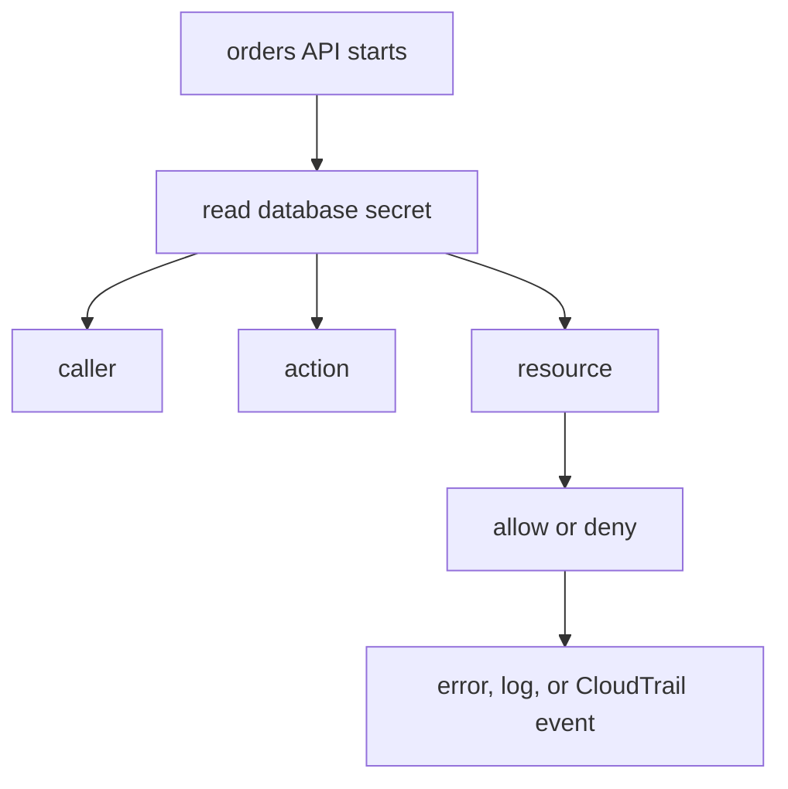

## Table of Contents

1. [The Request AWS Is Judging](#the-request-aws-is-judging)
2. [Humans, Pipelines, And Running Apps](#humans-pipelines-and-running-apps)
3. [Identity: Who Is Asking?](#identity-who-is-asking)
4. [Permission: What Can They Do?](#permission-what-can-they-do)
5. [Resource: What Are They Touching?](#resource-what-are-they-touching)
6. [Evidence: How Access Shows Up](#evidence-how-access-shows-up)
7. [Quick Recap](#quick-recap)

## The Request AWS Is Judging

The first real AWS security question usually does not arrive as a policy-design exercise.
It arrives as a small break in a service that was supposed to be boring.
A team deploys `devpolaris-orders-api`, the task starts, and then the app dies before it can accept traffic.
The log says the app could not load the database password.

```text
2026-05-13T09:02:18Z INFO boot service=orders-api env=prod revision=42
2026-05-13T09:02:19Z ERROR startup failed step=load_database_secret
error="AccessDeniedException: not authorized to perform secretsmanager:GetSecretValue"
```

The beginner question is not "What is every AWS security service?"
It is much more immediate:

> My app is running in AWS now. Who is allowed to touch it, how does the app prove who it is, and where do secrets belong?

That question gives us the article's thread.
The orders API is no longer one process on one laptop.
It is a running container, a deployment workflow, a database secret, an export bucket, a log stream, and a few humans trying to understand what happened.
The team cannot fix the failure by saying "security blocked it."
They need to read the request AWS was judging.

AWS security becomes practical when you can break a failing request into a few parts:

- Who is making this AWS request?
- Is it a human, a deploy pipeline, or the running app?
- What action is it trying to take?
- Which resource is the target?
- Where should secrets live?
- What evidence proves access worked or failed?

The failed secret read can be written as a small record:

```text
caller:    arn:aws:sts::333333333333:assumed-role/orders-api-task-role/ecs-task-42
action:    secretsmanager:GetSecretValue
resource:  arn:aws:secretsmanager:us-east-1:333333333333:secret:orders/prod/database-AbCdEf
context:   account=333333333333 region=us-east-1
result:    denied
```

That record is the mental model.
The caller is the identity AWS sees.
The action is the operation being requested.
The resource is the target.
The context is extra information AWS can use while deciding.
The result is the decision.

Once the team has that shape, the failure becomes smaller.
They are not debugging "AWS security."
They are debugging one caller trying one action against one secret.
IAM roles, policies, Secrets Manager, CloudTrail, and application logs all matter, but they matter because they help answer one part of that request story.



The diagram is intentionally small.
If the first mental model is too wide, the reader gets a service catalog instead of a way to think.
We will stay with this one startup failure and follow the questions in order.

## Humans, Pipelines, And Running Apps

The first mistake in this incident is assuming the orders API has one identity.
It does not.
Maya, the developer on call, has an identity when she opens the Console or runs the AWS CLI.
The deploy pipeline has an identity when it updates the ECS service.
The running ECS task has an identity when the Node.js code calls Secrets Manager.

Those actors are close together in one workflow, so beginners often blur them.
Maya merges a pull request.
The pipeline deploys a new task definition.
ECS starts a task.
The app reads a secret.
The error appears in the app log.
It feels like one chain, but AWS sees several callers along the way.

```text
Maya
  -> approves the change

Deploy pipeline
  -> registers a task definition
  -> updates the ECS service

ECS task
  -> starts the app container
  -> app calls Secrets Manager
```

If the deploy succeeded, the deploy role probably had enough permission to update ECS.
That does not tell us whether the running app has permission to read the database secret.
The next request happens later, from a different caller.

This split also explains why one shared admin key is such a poor design.
It makes the first setup easy, but it erases the story.
If the same credential can deploy, read secrets, write files, and run emergency scripts, the team loses the ability to say which actor needed which power.
It also increases the damage if that credential leaks.

A healthier first design gives each actor its own job:

| Actor | Job | Access Shape |
|-------|-----|--------------|
| Human operator | Inspect evidence and approve repairs | Temporary support role |
| Deploy pipeline | Publish a new service version | Deploy role with ECS update permissions |
| Running app | Read the database secret and write exports | Workload role with narrow runtime permissions |

The table is not the lesson by itself.
The lesson is the separation.
When the app cannot read the secret, the team should inspect the app's runtime role.
When the pipeline cannot update the service, the team should inspect the deploy role.
When Maya cannot view logs, the team should inspect the support role.
Keeping those actors separate makes failures easier to route.

## Identity: Who Is Asking?

Now Maya has a concrete next move.
Before changing any policy, she needs to prove who AWS thinks is making the failing request.
Identity comes before permission because adding permission to the wrong identity changes nothing.

From her terminal, Maya can check her own AWS caller:

```bash
$ aws sts get-caller-identity
{
  "UserId": "AROAXAMPLE:maya",
  "Account": "333333333333",
  "Arn": "arn:aws:sts::333333333333:assumed-role/prod-support/maya"
}
```

This is useful, but it is not the app's identity.
It only proves that Maya is using the production support role.
The app failed inside an ECS task, so the caller we care about should look like the orders API task role.

The expected runtime caller is closer to this:

```text
arn:aws:sts::333333333333:assumed-role/orders-api-task-role/ecs-task-42
```

If the log or CloudTrail event shows a different role, the team has found the first problem.
Maybe the task definition points at the wrong task role.
Maybe the service is still running an old task definition revision.
Maybe the app is accidentally using a baked-in access key instead of the runtime credentials.
Those are identity-delivery problems, not permission-design problems.

This is where AWS terminology becomes useful.
The authenticated caller in an AWS request is often called a principal.
For this incident, the principal should be the ECS task role session.
The exact word matters less than the habit:
name the caller before deciding what the caller should be allowed to do.

Clear role names help the story survive outside your head.
`orders-api-task-role` is reviewable.
`prod-admin` is not.
If an error message says the app is using `prod-admin`, the name itself tells the team something has drifted.

## Permission: What Can They Do?

Once the caller is right, the next question is permission.
The orders API task role is supposed to read one database secret.
It is not supposed to update ECS services, read every secret in the account, or attach IAM policies.

That expectation can be written in plain English before it becomes JSON:

```text
The running orders API may read the production database secret.
The running orders API may write daily export files under orders-api/*.
The running orders API may not administer IAM, deploy services, or read unrelated secrets.
```

This is the first version of least privilege.
Least privilege does not mean the policy is clever.
It means the permission follows the job.
If the app only needs a database password and an export path, the role should not carry a general "production app" permission bundle.

The secret-read part might become a policy statement like this:

```json
{
  "Effect": "Allow",
  "Action": "secretsmanager:GetSecretValue",
  "Resource": "arn:aws:secretsmanager:us-east-1:333333333333:secret:orders/prod/database-AbCdEf"
}
```

This JSON is not the starting point.
It is the encoded version of the sentence above.
The sentence matters because it lets a teammate review the intent without becoming an IAM specialist first.

The first unsafe repair would be much broader:

```json
{
  "Effect": "Allow",
  "Action": "secretsmanager:*",
  "Resource": "*"
}
```

That might make the startup error disappear.
It also gives the app far more power than the failure justified.
The team would have traded one startup issue for a larger blast radius.
The better fix is to allow the action the app actually needs on the secret it actually uses.

## Resource: What Are They Touching?

The resource is the target of the request.
In the startup failure, the target is the database secret.
That sounds obvious, but many real mistakes hide here.
The app may point at the development secret from a production task.
The role may allow the old secret ARN after a rename.
The task may run in the right account but use a secret name from the wrong environment.

For the orders API, Maya writes down the resource story:

```text
runtime secret:
  orders/prod/database

expected account:
  333333333333

expected Region:
  us-east-1

expected caller:
  orders-api-task-role
```

This is not busywork.
It prevents a common AWS debugging loop where people widen a policy because they never checked the target.
If the app asks for `orders/staging/database`, production permissions should not help.
If the app asks for a secret in `us-west-2`, a `us-east-1` policy review may be looking at the wrong object.

Secrets also show why "resource" and "value" are different.
The secret resource has a name, ARN, tags, version metadata, permissions, and audit trail.
The secret value is the private string the app needs.
An operator can often inspect the resource safely without reading the value.

That difference keeps support work safer.
Maya may need to confirm that `orders/prod/database` exists and changed ten minutes ago.
She does not necessarily need to print the password.
Good security design lets support inspect safe metadata while keeping the private value behind a narrower path.

## Evidence: How Access Shows Up

The final part of the story is evidence.
Evidence is what keeps the team from guessing.
In this incident, there are three useful evidence sources: the app log, the AWS error, and CloudTrail.

The AWS error gives the authorization story:

```text
AccessDeniedException: User:
arn:aws:sts::333333333333:assumed-role/orders-api-task-role/ecs-task-42
is not authorized to perform: secretsmanager:GetSecretValue
on resource:
arn:aws:secretsmanager:us-east-1:333333333333:secret:orders/prod/database-AbCdEf
because no identity-based policy allows the action
```

Read it as a request.
The caller is the task role session.
The action is `GetSecretValue`.
The resource is the production database secret.
The reason is a missing allow in the identity policy path.
That points to a narrow permission fix.

CloudTrail can add the account activity story.
If the secret was changed shortly before the startup failure, an event might show:

```json
{
  "eventTime": "2026-05-13T08:59:31Z",
  "eventSource": "secretsmanager.amazonaws.com",
  "eventName": "PutSecretValue",
  "awsRegion": "us-east-1",
  "userIdentity": {
    "type": "AssumedRole",
    "arn": "arn:aws:sts::333333333333:assumed-role/prod-support/maya"
  },
  "requestParameters": {
    "secretId": "orders/prod/database"
  }
}
```

That event does not print the secret.
It tells the team who changed the secret value and when.
If the app started failing after that event, the team should check the secret value, the database user's password, and the task rollout sequence.
That is a different investigation from an IAM denial.

Application logs close the loop:

```text
2026-05-13T09:04:11Z INFO config name=DATABASE_URL present=true source=secret-reference
2026-05-13T09:04:12Z ERROR database login failed user=orders_app
```

This log means the app did receive a database URL.
The failure moved past AWS authorization and into database authentication.
The next fix is not "add more IAM."
It is to align the secret value with the database user and restart the tasks that still hold the old value.

That is the connective habit for the whole module:
read the evidence, decide which part of the request story changed, and make the smallest fix that matches that evidence.

## Quick Recap

The orders API incident began as a vague security failure.
By following the request story, it became a small set of answerable questions.

| Question | Answer Habit |
|----------|--------------|
| Who is making this AWS request? | Identify the human role, deploy role, or workload role session |
| Is it a human, pipeline, or running app? | Route the fix to the actor that made the failing request |
| What action is it trying to take? | Look for the AWS action name or the app behavior behind it |
| Which resource is the target? | Check the ARN, account, Region, name, and environment |
| Where should secrets live? | Store production private values in a managed secret resource |
| What evidence proves access worked or failed? | Use AWS errors, `get-caller-identity`, app logs, and CloudTrail events |

The point is not to memorize every AWS security service at once.
The point is to keep one request visible.
Once you can read caller, action, resource, decision, and evidence, the rest of the identity and security module has somewhere to attach.

---

**References**

- [How IAM works - AWS Identity and Access Management](https://docs.aws.amazon.com/IAM/latest/UserGuide/intro-structure.html) - Defines the request components AWS evaluates, including principal, action, resource, and request context.
- [IAM roles - AWS Identity and Access Management](https://docs.aws.amazon.com/IAM/latest/UserGuide/id_roles.html) - Explains roles, role assumption, and temporary security credentials.
- [Amazon ECS task IAM role - Amazon Elastic Container Service](https://docs.aws.amazon.com/AmazonECS/latest/developerguide/task-iam-roles.html) - Shows how application containers use the task role permissions when calling AWS services.
- [Policy evaluation logic - AWS Identity and Access Management](https://docs.aws.amazon.com/IAM/latest/UserGuide/reference_policies_evaluation-logic.html) - Verifies the basic allow and deny behavior behind AWS authorization decisions.
- [What is AWS Secrets Manager? - AWS Secrets Manager](https://docs.aws.amazon.com/secretsmanager/latest/userguide/intro.html) - Covers Secrets Manager as a managed place for storing, retrieving, and rotating secrets.
- [CloudTrail userIdentity element - AWS CloudTrail](https://docs.aws.amazon.com/awscloudtrail/latest/userguide/cloudtrail-event-reference-user-identity.html) - Explains how CloudTrail records the identity that made an AWS request.
