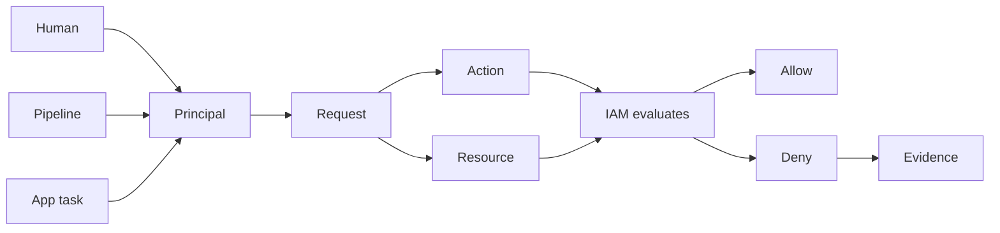

## Table of Contents

1. [The Problem](#the-problem)
2. [What Is IAM](#what-is-iam)
3. [Principals](#principals)
4. [Actions And Resources](#actions-and-resources)
5. [Policies](#policies)
6. [Roles](#roles)
7. [Trust Policies](#trust-policies)
8. [Secrets](#secrets)
9. [Evidence](#evidence)
10. [Sample Access Shape](#sample-access-shape)
11. [Putting It All Together](#putting-it-all-together)
12. [What's Next](#whats-next)

## The Problem

The orders API worked on a laptop. The app read `DATABASE_URL` from a local `.env` file, wrote export files into a test bucket, and used the developer's AWS profile when it needed to try something against AWS.

Then the same app moved into AWS. A deploy pipeline registers a new ECS task definition. ECS starts the task. The app boots, asks Secrets Manager for the production database password, and dies before it can accept traffic.

```text
2026-05-13T09:02:18Z INFO boot service=orders-api env=prod revision=42
2026-05-13T09:02:19Z ERROR startup failed step=load_database_secret
error="AccessDeniedException: not authorized to perform secretsmanager:GetSecretValue"
```

The team now has several problems that look like one problem:

- The deploy succeeded, but the running app still cannot read its secret.
- A reviewer sees a proposed fix that grants `secretsmanager:*` on `*`.
- A developer can run AWS CLI commands from their laptop, but that only proves the developer's identity.
- A CloudTrail event names an assumed role, and nobody is sure whether that role belongs to a human, a pipeline, or the app.

Those are IAM questions. IAM is AWS Identity and Access Management, and the useful beginner question is not "What is every security service in AWS?" It is smaller:

> Who is asking AWS to do something, what are they asking to do, and which resource are they trying to touch?

Once the team can answer that, the secret failure becomes less mysterious. The app is not blocked by "security" in general. One principal tried one action against one resource, and AWS denied that request.

## What Is IAM

IAM is the AWS system that controls authentication and authorization for requests to AWS resources. Authentication answers who the caller is. Authorization answers whether that caller is allowed to perform the requested action.

The failed secret read can be written as a small record:

```text
principal: arn:aws:sts::333333333333:assumed-role/orders-api-task-role/ecs-task-42
action:    secretsmanager:GetSecretValue
resource:  arn:aws:secretsmanager:us-east-1:333333333333:secret:orders/prod/database-AbCdEf
context:   account=333333333333 region=us-east-1
decision:  denied
```

That record is the mental model. The principal is the caller AWS sees. The action is the operation being requested. The resource is the target. The context is extra request information AWS can evaluate. The decision is the result after IAM checks the relevant policies.



The diagram is small because the first habit should stay small. Before changing a policy, name the caller, action, and resource. If any of those are wrong, a broader permission may hide the real mistake.

IAM also starts from denial. A request is denied unless an applicable policy allows it, and an explicit deny overrides an allow. That default is what makes narrow permissions possible. You do not list every dangerous thing the app cannot do. You allow the few requests the app should make, then use evidence to check that nearby requests still fail.

## Principals

A principal is the authenticated caller in an AWS request. It might represent a person, a workload, a CI/CD system, an AWS service, or a role session created from one of those actors.

The orders workflow has at least three principals, even though humans experience it as one deploy:

| Actor | Example principal shape | What it should do |
| --- | --- | --- |
| Human support | `arn:aws:sts::333333333333:assumed-role/prod-support/maya` | Inspect logs, metadata, and evidence during an incident. |
| Deploy pipeline | `arn:aws:sts::333333333333:assumed-role/orders-deploy/github-run-8841` | Publish a new service version and pass the approved runtime role. |
| Running app | `arn:aws:sts::333333333333:assumed-role/orders-api-task-role/ecs-task-42` | Read its own database secret and write its own export files. |

Keeping those principals separate is not paperwork. It is how a team avoids fixing the wrong thing. If Maya can read the secret from her laptop, the running app may still be denied. If the deploy role can update ECS, the task role may still lack `secretsmanager:GetSecretValue`. If CloudTrail shows `orders-api-task-role`, the request came from the workload session, not from the human who clicked deploy.

Principal wording also changes depending on policy type. In an identity-based policy attached to a user or role, the principal is implied by the attachment. In a resource-based policy or a role trust policy, the `Principal` element names who is allowed to use the resource or assume the role. That distinction becomes important when you read a role's permissions and trust side by side.

## Actions And Resources

An action is the AWS operation the principal wants to perform. A resource is the AWS object the action targets. IAM policies use service action names such as `secretsmanager:GetSecretValue`, `s3:PutObject`, and `iam:AttachRolePolicy`.

Start from the app behavior, then map that behavior to AWS action and resource shapes:

| App behavior | IAM action | Resource shape |
| --- | --- | --- |
| Load the production database password | `secretsmanager:GetSecretValue` | One Secrets Manager secret ARN |
| Write an export file | `s3:PutObject` | Object ARNs under one bucket prefix |
| List export files before writing | `s3:ListBucket` | The bucket ARN, usually narrowed by a prefix condition |
| Attach a managed policy to a role | `iam:AttachRolePolicy` | An IAM role ARN |

The table shows a common gotcha. Similar app behavior can use different AWS resources. For S3, writing an object uses an object resource such as `arn:aws:s3:::devpolaris-orders-exports-prod/orders-api/daily.csv`. Listing keys uses the bucket resource, then a condition can narrow which prefix the app may list.

That is why broad permissions are so tempting. `s3:*` on `*` avoids learning the difference between bucket actions and object actions. It also gives the app a much larger blast radius. A narrow policy takes more thought because it follows the actual behavior.

The same habit catches configuration mistakes. If the app asks for `orders/staging/database` from production, production permissions should not help. If it asks for a secret in the wrong Region or account, widening the policy in the current account may not fix the real target.

## Policies

A policy is the rule document IAM evaluates when deciding whether a request should be allowed. Most permission policies are JSON documents made of statements. The important fields for this article are `Effect`, `Action`, `Resource`, and sometimes `Condition`.

The narrow secret permission reads like the English sentence behind it:

```text
Allow the orders API task role to read the production database secret.
```

The policy statement is the encoded version:

```json
{
  "Effect": "Allow",
  "Action": "secretsmanager:GetSecretValue",
  "Resource": "arn:aws:secretsmanager:us-east-1:333333333333:secret:orders/prod/database-AbCdEf"
}
```

That is reviewable because every field has a job. `Effect` says this statement allows something. `Action` names the operation. `Resource` names the target. The role attachment says which principal receives the permission.

The unsafe repair is shorter:

```json
{
  "Effect": "Allow",
  "Action": "secretsmanager:*",
  "Resource": "*"
}
```

That might make the startup error disappear. It also lets the app do far more than read one database secret. The policy fixed the symptom by making the runtime role harder to reason about.

IAM decisions follow a few rules that are worth memorizing early:

| Policy situation | Result |
| --- | --- |
| No applicable allow | Denied by default |
| Applicable allow and no explicit deny | Allowed |
| Any applicable explicit deny | Denied, even if another policy allows |
| Allow exists, but a boundary, session policy, SCP, or resource policy does not allow the request | Denied by that other control path |

The last row is where many real `AccessDenied` errors become confusing. The role's identity policy may look right, but another policy type can still limit the request. The fix is to read the denial reason before adding a new allow.

## Roles

An IAM role is an AWS identity with permissions, designed to be assumed by a trusted caller. Unlike an IAM user, a role does not carry a normal long-term password or access key. When something assumes the role, AWS issues temporary credentials for that role session.

Roles are the main way to keep humans, pipelines, and workloads from sharing the same authority:

| Role | Caller that assumes it | Permission shape |
| --- | --- | --- |
| `prod-support` | Human operators through the approved identity path | Inspect evidence and safe metadata. |
| `orders-deploy` | The deployment system | Update the service and pass approved runtime roles. |
| `orders-api-task-role` | ECS tasks running the orders API | Read one secret and write one export prefix. |

This separation changes debugging. The app's `AccessDenied` should lead you to the app runtime role, not to Maya's support role. A deploy failure should lead to the deploy role, not to the task role. A CloudTrail event with an assumed role ARN should make you ask which actor could have assumed that role.

ECS has one detail beginners often trip over. The task execution role lets ECS do platform work such as pulling images and sending logs. The task role is what application code uses when it calls AWS APIs. If Node.js code inside the orders API calls Secrets Manager, the `secretsmanager:GetSecretValue` permission belongs on the task role.

Good role names make this visible. `orders-api-task-role` says runtime app. `orders-deploy` says release pipeline. `prod-admin` says almost nothing except "be careful."

## Trust Policies

A role has two different questions attached to it:

| Question | Policy that answers it | Example |
| --- | --- | --- |
| Who may assume this role? | Trust policy | ECS tasks may assume `orders-api-task-role`. |
| What may the role session do after assumption? | Permissions policy | The app may read one secret. |

Those two policies solve different problems. A permissions policy that allows `s3:PutObject` does not let GitHub, ECS, or a human assume the role. A trust policy that lets ECS assume the role does not grant the app access to S3 or Secrets Manager after it receives credentials.

A workload trust policy is small in concept:

```json
{
  "Effect": "Allow",
  "Principal": {
    "Service": "ecs-tasks.amazonaws.com"
  },
  "Action": "sts:AssumeRole"
}
```

This says the ECS tasks service principal can assume the role. The permissions attached to the role decide what the resulting task role session can do.

Trust policies are where cross-account and pipeline designs often go wrong. A broad trust policy can let the wrong caller become the role. A narrow permissions policy cannot help if an unexpected caller is trusted to assume it. Read trust as the front door and permissions as the room key after entry.

## Secrets

A secret has two parts that are easy to blur: the secret resource and the secret value. The resource has a name, ARN, Region, account, metadata, tags, versions, permissions, and evidence. The value is the private string the app needs.

For the orders API, the resource might be:

```text
arn:aws:secretsmanager:us-east-1:333333333333:secret:orders/prod/database-AbCdEf
```

The value might be a database connection string. The app needs the value at runtime. A support role may only need to know that the resource exists, when it changed, and which app is allowed to read it. Those are different jobs, so they should not automatically receive the same permission.

Secrets Manager gives teams a managed place to store, retrieve, manage, and rotate secrets. IAM decides who can call actions such as `secretsmanager:GetSecretValue` on the secret. The safe access shape is specific:

```text
principal: orders-api-task-role
action:    secretsmanager:GetSecretValue
resource:  orders/prod/database secret
```

That shape is different from "the app can access secrets." It names one runtime role, one read action, and one production secret. If the app later needs the payment webhook secret, add that need deliberately. Do not treat the first secret permission as a general secret-reading bundle.

Secrets also move failures into different layers. If IAM denies `GetSecretValue`, the app never received the value. If the app receives the value and then the database rejects the login, the next problem is database authentication or stale secret content. More IAM will not fix the database password.

## Evidence

Evidence keeps IAM work from becoming guesswork. For the orders API, the useful evidence sources are the AWS error, the caller identity, application logs, and CloudTrail.

An `AccessDenied` message often gives the shape directly:

```text
AccessDeniedException: User:
arn:aws:sts::333333333333:assumed-role/orders-api-task-role/ecs-task-42
is not authorized to perform: secretsmanager:GetSecretValue
on resource:
arn:aws:secretsmanager:us-east-1:333333333333:secret:orders/prod/database-AbCdEf
because no identity-based policy allows the action
```

Read that as a request, not as noise. The user field is the principal. The action is `secretsmanager:GetSecretValue`. The resource is the secret. The reason says no identity-based policy allows it. If the app should read that exact secret, add the narrow allow to the task role.

A different reason changes the fix:

```text
with an explicit deny in a service control policy
```

In that case, another allow on the task role will not override the explicit deny. The team needs to understand the guardrail that denied the request.

The AWS CLI can prove the caller for the shell where it runs:

```bash
aws sts get-caller-identity
```

That is useful when Maya is debugging her own session. It does not prove the app's runtime identity unless the command runs from the same runtime path the app uses.

CloudTrail adds account activity evidence. It can show API activity by users, roles, and AWS services, including who called an action and when. Application logs add app-level evidence, such as whether the app found a secret reference, received a value, or failed later while connecting to the database. Use both. CloudTrail tells you what AWS saw; the app log tells you what the code experienced.

## Sample Access Shape

The anchor design for the orders API can fit on one page. It is not a final production template. It is the shape a review should be able to explain.

| Principal | Should allow | Nearby request that should fail |
| --- | --- | --- |
| `prod-support` | Read logs and inspect safe resource metadata | Print production secret values by default |
| `orders-deploy` | Update the ECS service and pass approved runtime roles | Read application database passwords |
| `orders-api-task-role` | Read `orders/prod/database` and write under `orders-api/*` | Attach IAM policies or read unrelated secrets |

For the runtime role, the access story starts in plain English:

```text
The running orders API may read the production database secret.
The running orders API may write daily export files under orders-api/*.
The running orders API may list only the export prefix it owns.
```

The first statement becomes the secret policy shown earlier. The S3 behavior becomes two permissions because `PutObject` and `ListBucket` are different actions with different resource shapes:

| Behavior | Permission shape |
| --- | --- |
| Write `orders-api/2026-05-13.csv` | Allow `s3:PutObject` on `arn:aws:s3:::devpolaris-orders-exports-prod/orders-api/*` |
| List owned export keys | Allow `s3:ListBucket` on `arn:aws:s3:::devpolaris-orders-exports-prod` with an `s3:prefix` condition for `orders-api/*` |
| Write `manual-backups/2026-05-13.csv` | Deny by absence of an allow |

The "deny by absence" row matters. A good policy should fail the nearby request that does not belong to the app. If both export paths pass, the policy is too broad. If both fail, the caller, action, resource, or condition is wrong. If the owned prefix passes and the manual backup prefix fails, the permission matches the job.

That is least privilege in its most practical form: enough access to do the job, with a boundary close enough that a wrong path becomes visible.

## Putting It All Together

The startup failure began as a vague AWS security problem. IAM turns it into a request story:

| Opening problem | IAM shape |
| --- | --- |
| The deploy succeeded, but the app cannot read the secret | Deploy role and runtime role are different principals. Inspect the task role. |
| Someone proposed `secretsmanager:*` on `*` | Replace generic access with one action on one secret ARN. |
| A developer can use AWS from a laptop | That proves the developer's caller, not the app's caller. |
| CloudTrail names an assumed role | Map the role session back to the human, pipeline, service, or workload that assumed it. |

The working loop is steady:

1. Name the principal.
2. Name the action.
3. Name the resource.
4. Check the policies that apply.
5. Read the evidence before widening access.

That loop does not make IAM small, but it makes IAM readable. Roles, trust policies, permission statements, secret reads, and CloudTrail events all attach to the same question: should this caller be allowed to perform this action on this resource right now?

## What's Next

Now that a role means "an identity that a trusted caller can assume," the next question is how a running workload gets credentials without storing an AWS access key in code or deployment config.

The next article focuses on workload access and temporary credentials: how ECS, EC2, Lambda, and similar runtimes deliver short-lived credentials to application code, why that is safer than long-lived keys, and how to prove which role a workload is actually using.

---

**References**

- [How IAM works - AWS Identity and Access Management](https://docs.aws.amazon.com/IAM/latest/UserGuide/intro-structure.html). Supports the request model of principal, action, resource, context, authentication, and authorization.
- [IAM roles - AWS Identity and Access Management](https://docs.aws.amazon.com/IAM/latest/UserGuide/id_roles.html). Supports role assumption, temporary security credentials, and the split between trust and permissions policies.
- [AWS JSON policy elements: Principal - AWS Identity and Access Management](https://docs.aws.amazon.com/IAM/latest/UserGuide/reference_policies_elements_principal.html). Supports how principals are specified in resource-based policies and role trust policies.
- [IAM JSON policy element reference - AWS Identity and Access Management](https://docs.aws.amazon.com/IAM/latest/UserGuide/reference_policies_elements.html). Supports the policy vocabulary for `Effect`, `Action`, `Resource`, and `Condition`.
- [Policy evaluation logic - AWS Identity and Access Management](https://docs.aws.amazon.com/IAM/latest/UserGuide/reference_policies_evaluation-logic.html). Supports default deny, explicit allow, and explicit deny behavior.
- [Amazon ECS task IAM role - Amazon Elastic Container Service](https://docs.aws.amazon.com/AmazonECS/latest/developerguide/task-iam-roles.html). Supports the distinction between the task role used by application code and the task execution role used by ECS platform work.
- [Actions, resources, and condition keys for Amazon S3 - Service Authorization Reference](https://docs.aws.amazon.com/service-authorization/latest/reference/list_amazons3.html). Supports the S3 action and resource examples for `PutObject`, `ListBucket`, object ARNs, bucket ARNs, and prefix conditions.
- [Actions, resources, and condition keys for AWS Secrets Manager - Service Authorization Reference](https://docs.aws.amazon.com/service-authorization/latest/reference/list_awssecretsmanager.html). Supports the `GetSecretValue` action and secret resource examples.
- [What is AWS Secrets Manager? - AWS Secrets Manager](https://docs.aws.amazon.com/secretsmanager/latest/userguide/intro.html). Supports the description of Secrets Manager as a managed place to store, retrieve, manage, and rotate secrets.
- [What Is AWS CloudTrail? - AWS CloudTrail](https://docs.aws.amazon.com/awscloudtrail/latest/userguide/cloudtrail-user-guide.html). Supports the use of CloudTrail as account activity evidence for users, roles, and AWS services.
- [Troubleshoot access denied error messages - AWS Identity and Access Management](https://docs.aws.amazon.com/IAM/latest/UserGuide/troubleshoot_access-denied.html). Supports reading authorization failures by caller, action, resource, and denial reason.
