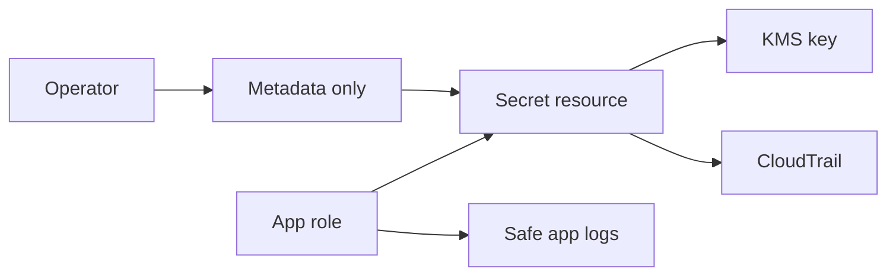

## Table of Contents

1. [The Problem](#the-problem)
2. [What Counts As A Secret](#what-counts-as-a-secret)
3. [Secrets Manager](#secrets-manager)
4. [Parameter Store](#parameter-store)
5. [KMS](#kms)
6. [Who Can Read The Secret](#who-can-read-the-secret)
7. [Rotation](#rotation)
8. [Evidence](#evidence)
9. [Sample Secret Shape](#sample-secret-shape)
10. [Putting It All Together](#putting-it-all-together)

## The Problem

The previous article gave the application a workload role. That solved one dangerous habit: the app no longer needs a long-lived AWS access key baked into a container image, copied into a deployment variable, or passed around in chat.

But the role creates the next question. If the app can now ask AWS for things, where should its private values live?

- The orders API needs a database password.
- The payment webhook handler needs a signing secret.
- A deploy pipeline needs to reference those values without printing them.
- A support engineer needs evidence that the app received the right secret, but should not see the secret itself.

Pasting those values into a task definition, a Terraform variable, a build log, or a ticket may fix the next deployment. It also creates new places where the secret now exists. Production secret handling is the practice of giving the value one managed home, giving the workload a narrow way to read it, and leaving evidence that proves the path worked without copying the private value into the evidence.

The AWS services in this story have separate jobs. Secrets Manager stores secret values with lifecycle features. Parameter Store can hold encrypted configuration values. KMS protects the encrypted material. IAM decides which role can ask for the value. CloudTrail and application logs help prove what happened.



The diagram is intentionally small because the model should stay small. Secrets are not safe because they are hidden somewhere mysterious. They are safe when storage, access, encryption, delivery, rotation, and evidence each have a clear boundary.

## What Counts As A Secret

A secret is any value that lets a person, process, or system do something it should not be able to do without permission. The shape does not matter. A secret can look like a password, token, connection string, private key, signing secret, API key, OAuth client secret, or certificate private key.

The better test is consequence. If copying the value lets someone read production data, impersonate the app, accept fake webhooks, decrypt protected data, or call a vendor as your company, treat it as a secret.

Some configuration is important but not secret. `PORT=3000`, `NODE_ENV=production`, a feature flag name, or a public base URL may affect behavior, but those values do not usually grant authority by themselves. Putting every setting into a secret store makes operations harder without adding much protection. The private values need the stronger path.

| Value | Secret? | Why |
| --- | --- | --- |
| Database password | Yes | It can open a connection to protected data. |
| Payment webhook signing secret | Yes | It lets the app decide whether an incoming event is trusted. |
| Vendor API token | Yes | It lets callers act as your service with the vendor. |
| Public application URL | Usually no | It identifies the app, but does not grant access by itself. |
| Log level | Usually no | It changes behavior, but is not a credential. |

The risk is not only that a human might read a value. Secrets spread. A value pasted into the wrong place can move into shell history, infrastructure state, deployment history, container inspection output, screenshots, logs, search indexes, and backup systems. A good design reduces how many systems ever touch the plaintext value.

## Secrets Manager

AWS Secrets Manager is the normal home for values with a secret lifecycle: database credentials, service credentials, OAuth tokens, API keys, webhook signing secrets, and similar private runtime values. It gives the value a resource name, an ARN, versions, staging labels such as `AWSCURRENT`, IAM permissions, encryption through KMS, and CloudTrail events.

That resource model matters. A secret is no longer an invisible string floating through deployment scripts. It is something the team can name, tag, rotate, monitor, and reference from a runtime.

For the orders service, the secret names might be:

| Secret name | Reader | Purpose |
| --- | --- | --- |
| `prod/orders/database` | Orders API role | Connect to the production orders database. |
| `prod/orders/payment-webhook` | Orders API role | Verify payment webhook signatures. |
| `prod/orders/vendor-token` | Orders worker role | Call a fulfillment vendor. |

The secret value should not appear in the task definition. The task definition should reference the secret. In an ECS task, that can look like a container environment variable whose `valueFrom` is a Secrets Manager ARN. The app still reads `PAYMENT_WEBHOOK_SECRET` from its environment, but the task definition carries the pointer, not the plaintext.

That distinction is easy to underrate. Environment variables are a delivery shape. Secrets Manager is the storage and control plane. The dangerous move is not that the app reads an environment variable. The dangerous move is storing the production secret in the same operational surfaces that everyone can inspect.

Secrets Manager is also where rotation starts to make sense. A version can become current, the previous version can remain identifiable, and a rotation workflow can update the matching database or external service. The secret resource gives the team a place to coordinate that lifecycle.

## Parameter Store

AWS Systems Manager Parameter Store is close enough to Secrets Manager that teams often confuse the two. It provides hierarchical storage for configuration data and supports `SecureString` parameters for encrypted sensitive values. It can be a good fit for stable encrypted configuration, especially when a team already uses Parameter Store heavily for application settings.

The useful beginner distinction is lifecycle.

| Need | Better default | Reason |
| --- | --- | --- |
| Database password that should rotate | Secrets Manager | It is designed for secret lifecycle and rotation workflows. |
| Third-party API token with incident rotation | Secrets Manager | The value is an access credential with a clear private lifecycle. |
| Encrypted app setting used by deployment tooling | Parameter Store `SecureString` | Hierarchical parameter names and config workflows may be enough. |
| Public config such as a base URL | Parameter Store `String` or normal config | It does not need secret handling if it grants no authority. |

Parameter Store `SecureString` is still encrypted through KMS. With decryption enabled, a caller that has the right permissions can receive the plaintext value. That means the same rule still applies: encryption is not a replacement for access control. You still decide which role can call the parameter API and, when customer managed keys are involved, which role can use the key.

A common naming pattern is to keep non-secret config and secrets visibly separate:

| Name | Type | Example value |
| --- | --- | --- |
| `/prod/orders/public-base-url` | `String` | `https://orders.example.com` |
| `/prod/orders/log-level` | `String` | `info` |
| `/prod/orders/payment-webhook` | `SecureString` or Secrets Manager reference | Private signing value |

The rule is not "always use one service." The rule is "do not let sensitive values become ordinary configuration by accident." If a value carries authority, put it in an encrypted path with narrow read access and a rotation story.

## KMS

AWS Key Management Service, usually called KMS, manages keys that AWS services use to encrypt and decrypt data. In this article, KMS is not where the application password lives. KMS protects the encrypted material used by Secrets Manager and Parameter Store.

Secrets Manager uses envelope encryption. In plain English, Secrets Manager uses a data key to encrypt the secret value, and that data key is protected by a KMS key. When an approved caller reads the secret, Secrets Manager uses KMS as part of the decrypt path and returns the plaintext secret to the caller.

That split creates a helpful mental model:

| Layer | Question it answers |
| --- | --- |
| Secret resource | Which private value are we talking about? |
| IAM policy | Which identity can read or manage it? |
| KMS key | Which key protects the encrypted value? |
| Application code | What happens to the plaintext after the app receives it? |

The gotcha is that "encrypted at rest" is not the same as "safe in use." Encryption protects the stored value. It does not stop a broad IAM policy from allowing the wrong role to read it. It does not stop application code from printing the value. It does not rotate the matching password in a database or vendor system.

Metadata is another gotcha. Secrets Manager encrypts the secret value, but not every piece of metadata around the secret. Names, descriptions, rotation settings, the KMS key ARN, and tags are not the place for private values. A tag like `owner=checkout` is useful. A tag like `password=...` creates a leak in a field designed for search, billing, and inventory.

Customer managed KMS keys add another permission boundary. They can be useful when a team wants tighter key policy, audit separation, or service-specific conditions. They also mean the caller may need both permission to read the secret and permission for the KMS decrypt path. If the secret exists and IAM looks right but reads still fail, the KMS key policy is part of the story.

## Who Can Read The Secret

The workload role article matters here because AWS access should attach to the job the process is doing. A secret policy that says "the production account can read this" is too broad. The useful question is narrower: which role needs this exact value?

For ECS, there are two common paths.

| Access pattern | Role that needs permission | What happens |
| --- | --- | --- |
| ECS injects a secret at container startup | Task execution role | The ECS agent retrieves the value and passes it to the container. |
| App code calls Secrets Manager while running | Task role | The application uses its workload role to retrieve the value through the SDK or API. |

Startup injection is often the simplest first design. The app reads an environment variable, but the deployment config references a secret ARN. The task execution role needs permission to fetch the referenced secret. When the secret changes, running tasks usually need to be replaced before they receive the new value.

Runtime fetching gives the application more control. The app can cache the secret, refresh it, handle retries, and fetch the latest version after a rotation. That power comes with application complexity. The task role now needs direct read permission, and the code must avoid turning every request into a secret lookup.

Human access should be rarer than runtime access. Most support work does not require seeing the plaintext value. A support role may need to describe a secret, inspect tags, see last changed time, check version staging labels, or search CloudTrail. A break-glass role that can read plaintext should be narrow, logged, and socially expensive to use.

The safest access design usually sounds boring:

| Actor | Allowed action |
| --- | --- |
| Orders API task execution role | Read only the secrets injected into the orders container. |
| Orders API task role | Read only secrets the app fetches directly at runtime, if any. |
| Deploy role | Reference secret ARNs in deployment definitions, not read plaintext values. |
| Support role | Read metadata and evidence, not secret values. |
| Break-glass role | Read plaintext only for an approved emergency. |

This is where least privilege becomes practical. The policy should say which role can read which secret, not merely which team is trusted.

## Rotation

Rotation means replacing a secret value and moving the system to the new value. The important part is that most secrets have two sides. A database password exists in the secret store and in the database user. A webhook signing secret exists in the secret store and in the payment provider. A vendor token exists in the secret store and in the vendor account.

Updating only one side can break the app.

Secrets Manager supports automatic rotation patterns, including managed rotation for supported managed secrets and Lambda-based rotation for other types. The mechanism differs by secret type, but the operational shape stays similar:

| Step | Question |
| --- | --- |
| Create new value | Where does the new password, token, or signing secret come from? |
| Update backing system | Did the database, provider, or service accept the new value? |
| Update secret version | Which value is now `AWSCURRENT`? |
| Refresh workloads | Do running processes need restart or runtime refresh? |
| Verify behavior | Do logs and metrics show successful use without printing the secret? |
| Retire old value | Is the old value disabled after the cutover window? |

The refresh step is where many teams get surprised. If ECS injected a secret into the environment when the task started, that running process does not magically update because the stored secret changed. The service needs a new deployment, or old tasks need to stop and start, before the process receives the new environment value.

Runtime fetching changes that tradeoff. The app can retrieve the current version after a rotation, especially if it uses a caching strategy with a reasonable refresh window. That can reduce restarts, but it makes secret handling part of application code. For many apps, startup injection is simpler until there is a real need for live refresh.

Rotation is not only a scheduled hygiene task. It is also an incident response tool. If a secret appears in logs, source control, a ticket, or a third-party incident report, assume the old value may be known and rotate it. Deleting the visible copy is not enough.

## Evidence

Good evidence answers operational questions without becoming a new leak. When the payment webhook fails, an operator needs to know whether the app received a secret, whether the right role read it, whether the key path worked, and whether the value is stale. They do not need the plaintext signing secret in a log line.

A useful startup log proves presence and source, not content:

```text
2026-05-14T09:15:41Z INFO service=orders-api env=prod revision=42
2026-05-14T09:15:41Z INFO secret=PAYMENT_WEBHOOK_SECRET present=true source=ecs-secret-reference
2026-05-14T09:15:43Z INFO payment_webhook verification=ready
```

A dangerous startup log prints the value:

```text
PAYMENT_WEBHOOK_SECRET=whsec_real_prod_value
```

That line turns a config bug into a security incident. The secret now exists in log storage and in any system that receives, indexes, exports, or screenshots the log.

CloudTrail gives a different kind of evidence. It can show API activity for Secrets Manager, including who called an action such as `GetSecretValue`, when, from which role, and against which secret. Secrets Manager does not include `SecretString` or `SecretBinary` response fields in CloudTrail log entries, which is exactly what you want from audit evidence.

An evidence review should stay tied to the failure mode:

| Symptom | Evidence to check | What it suggests |
| --- | --- | --- |
| Environment variable missing | Task definition secret reference, task execution role, deployment revision | The injection path is wrong or the task is stale. |
| `AccessDenied` from app code | Caller role, secret ARN, `GetSecretValue` permission | The task role cannot read that secret. |
| KMS decrypt error | Secret's KMS key and key policy | The secret policy may be right while the key path is blocked. |
| Old value after rotation | Task start time, secret last changed time, deployment events | Running tasks may still hold the old startup value. |
| Secret in logs | Application logging, log sinks, retention, exports | Treat it as exposure and rotate the value. |

Evidence is not a separate compliance chore at the end. It is part of the design. Before production, the team should know how to prove a secret exists, who can read it, when it changed, which workload used it, and whether the app logged safely.

## Sample Secret Shape

A secret value should match how the application uses it. For a database credential, a small JSON object is easier to rotate and reason about than one long connection string hidden inside another string.

```json
{
  "username": "orders_app",
  "password": "generated-and-rotated-outside-code",
  "engine": "postgres",
  "host": "orders-prod.cluster-example.us-east-1.rds.amazonaws.com",
  "port": 5432,
  "dbname": "orders"
}
```

The private field is the password. The rest of the object still deserves care because it describes production infrastructure, but it is not the same kind of credential. Keeping the secret shape explicit helps rotation code update the right field and helps application code avoid parsing fragile connection strings.

For a webhook signing secret, the shape can be smaller:

```json
{
  "current": "stored-secret-value",
  "provider": "payment-provider",
  "purpose": "webhook-signature"
}
```

Do not copy these literal example values into real systems. The point is the structure. A good secret has a clear name, an owner, a purpose, a reader, a rotation expectation, and no plaintext copies in surrounding metadata.

For the orders service, the complete shape might look like this:

| Field | Example |
| --- | --- |
| Secret name | `prod/orders/payment-webhook` |
| Owner tag | `checkout` |
| Reader | Orders API task execution role or task role |
| KMS key | AWS managed key for Secrets Manager, or a customer managed key for stricter control |
| Rotation trigger | Provider rotation or exposure incident |
| Safe evidence | CloudTrail reads, secret metadata, app presence logs |

This is enough for another engineer to understand the secret without asking for the value.

## Putting It All Together

The workload role gave the app an AWS identity. Secrets Manager and KMS answer what that identity is allowed to receive, how the private value is protected while stored, and what evidence remains after the app uses it.

Count back to the original problem:

- The database password and webhook signing secret get managed homes instead of being pasted into deployment text.
- The app role or task execution role receives only the specific value it needs.
- KMS protects the stored secret material, while IAM controls who can ask for it.
- Rotation updates the stored value and the matching outside system, then refreshes workloads that still hold the old value.
- Operators can inspect metadata, CloudTrail, deployment events, and safe logs without printing the plaintext secret.

Secret handling is healthy when it becomes uneventful. The value has one managed home. The workload has one controlled path to receive it. The team can prove what happened without turning the proof into another place where the secret lives.

---

**References**

- [What is AWS Secrets Manager?](https://docs.aws.amazon.com/secretsmanager/latest/userguide/intro.html). Supports the explanation of Secrets Manager as the service for managing, retrieving, and rotating application credentials, API keys, and other secrets.
- [Pass sensitive data to an Amazon ECS container](https://docs.aws.amazon.com/AmazonECS/latest/developerguide/specifying-sensitive-data.html). Supports the ECS startup-injection model, use of Secrets Manager or Parameter Store, and the need to launch new tasks or force a new deployment after secret changes.
- [Amazon ECS task execution IAM role](https://docs.aws.amazon.com/AmazonECS/latest/developerguide/task_execution_IAM_role.html). Supports the distinction between task execution role permissions for secret injection and task role permissions for application code.
- [Pass Secrets Manager secrets programmatically in Amazon ECS](https://docs.aws.amazon.com/AmazonECS/latest/developerguide/secrets-app-secrets-manager.html). Supports the runtime-fetching pattern where application code retrieves secrets with the task role.
- [AWS Systems Manager Parameter Store](https://docs.aws.amazon.com/systems-manager/latest/userguide/systems-manager-parameter-store.html). Supports the description of hierarchical parameters, `String`, `StringList`, and `SecureString` values, and Parameter Store's role in configuration and secrets management.
- [AWS KMS encryption for Parameter Store SecureString parameters](https://docs.aws.amazon.com/systems-manager/latest/userguide/secure-string-parameter-kms-encryption.html). Supports the explanation that `SecureString` values use KMS for encryption and decryption.
- [Secret encryption and decryption in AWS Secrets Manager](https://docs.aws.amazon.com/secretsmanager/latest/userguide/security-encryption.html). Supports the explanation of envelope encryption, KMS key choice, KMS permissions, and which secret metadata is not encrypted.
- [Rotate AWS Secrets Manager secrets](https://docs.aws.amazon.com/secretsmanager/latest/userguide/rotating-secrets.html). Supports the rotation model where the secret and the backing database or service must both be updated.
- [GetSecretValue](https://docs.aws.amazon.com/secretsmanager/latest/apireference/API_GetSecretValue.html). Supports the permissions and evidence notes for `GetSecretValue`, `kms:Decrypt` with customer managed keys, CloudTrail entries, and omission of `SecretString` and `SecretBinary` from CloudTrail logs.
- [Log AWS Secrets Manager events with AWS CloudTrail](https://docs.aws.amazon.com/secretsmanager/latest/userguide/monitoring-cloudtrail.html). Supports the CloudTrail evidence path for Secrets Manager API activity.
