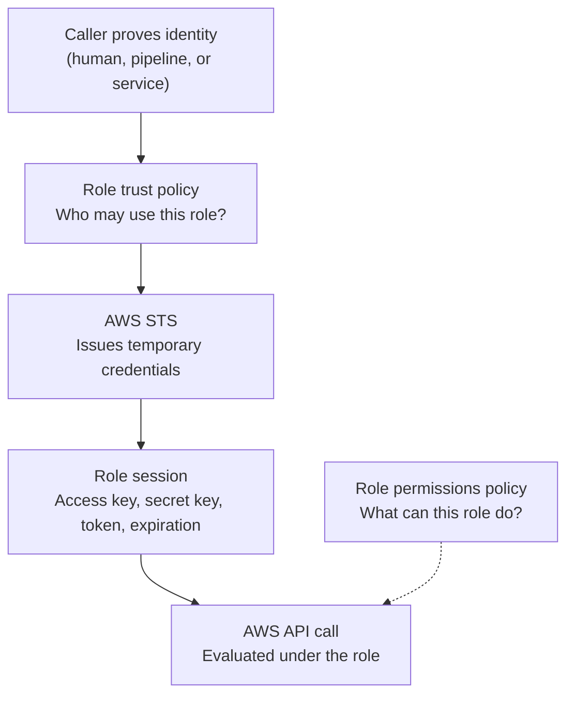

## Table of Contents

1. [The Problem With Keys That Never Expire](#the-problem-with-keys-that-never-expire)
2. [Temporary Credentials In One Picture](#temporary-credentials-in-one-picture)
3. [Role Assumption Is A Controlled Handoff](#role-assumption-is-a-controlled-handoff)
4. [Three Ways Access Shows Up](#three-ways-access-shows-up)
5. [GitHub Actions Deploys Without Stored AWS Keys](#github-actions-deploys-without-stored-aws-keys)
6. [The ECS Task Gets Its Own Runtime Credentials](#the-ecs-task-gets-its-own-runtime-credentials)
7. [The Permission Check Has Two Doors](#the-permission-check-has-two-doors)
8. [Failure Modes And A Diagnostic Path](#failure-modes-and-a-diagnostic-path)
9. [The Tradeoff: More Setup, Less Damage](#the-tradeoff-more-setup-less-damage)

## The Problem With Keys That Never Expire

A local `.env` file can make AWS access feel simple at first.
You paste an access key ID and a secret access key into the file, your script runs, and AWS accepts the request.
That feels close to using a database password or a Stripe API token.

The hidden problem is time.
A long-lived AWS access key keeps working until someone rotates it, disables it, or deletes it.
If it leaks into a build log, a laptop backup, a screenshot, a package cache, or an old repository, the key may still work months later.

Temporary credentials are AWS credentials that expire automatically.
They still contain an access key ID and secret access key, but they also include a session token.
AWS checks that session token on every request.
When the session expires, AWS stops accepting the credentials.

Role assumption is the usual way you get those temporary credentials.
A role is an AWS identity with permissions, but without permanent access keys of its own.
A caller proves who they are, asks AWS Security Token Service (STS) for a session, and STS returns short-lived credentials for that role.

The reason this exists is not just neat security vocabulary.
It exists because a team needs to let humans, pipelines, and running services touch AWS without giving each one a permanent production key.
The role becomes a controlled handoff point.
AWS can ask, "who is asking to use this role, are they trusted, and what will the role allow them to do?"

This article follows one running example:
the `devpolaris-orders-api` team deploys a Node.js orders service to AWS from GitHub Actions, then runs that service on Amazon ECS.
The deploy pipeline needs permission to update ECS.
The running app needs permission to read a small runtime setting and write order export files.
Those are different jobs, so they should not share one permanent key.

Here is the risk we are trying to remove:

```text
Old shape

.github/workflows/deploy.yml
  -> reads AWS_ACCESS_KEY_ID from GitHub Secrets
  -> reads AWS_SECRET_ACCESS_KEY from GitHub Secrets
  -> uses the same key until a human rotates it

Leak result
  -> attacker can reuse the key later
  -> damage lasts until someone notices and disables it
```

The better shape is not "never authenticate."
AWS still needs proof.
The better shape is "prove identity now, receive access for a short time, and let that access die on its own."

That reduces blast radius.
Blast radius means how much damage a mistake or leak can cause.
A permanent key can turn one bad log line into a long incident.
A short session turns the same leak into a smaller window, and often into a useless secret by the time someone finds it.

## Temporary Credentials In One Picture

AWS API calls need credentials because AWS must know who is making the request.
The request might come from your laptop, a GitHub Actions runner, a backend container, or another AWS service.
The access pattern changes, but the question is the same:
which principal is calling, and what is that principal allowed to do?

A principal is the identity making a request.
It can be a user, a role session, an AWS service, or a federated identity from another system.
For temporary credentials, the principal you see in logs is usually an assumed role session.
That means the original caller borrowed a role for a limited time.

The handoff looks like this:



Read the diagram as two checks.
The trust policy controls who may start a role session.
The permissions policy controls what that session can do after it exists.

Those two checks are easy to mix up.
If GitHub Actions cannot assume the role at all, you look at the trust policy.
If GitHub Actions successfully assumes the role but cannot update the ECS service, you look at the role permissions.

Temporary credentials work almost like normal AWS credentials while they are valid.
Your AWS CLI, SDK, Terraform run, or deploy script signs requests with them.
The difference is that the request includes the session token, and AWS knows the expiration.

That gives the team a safer default.
The pipeline does not need to store an AWS secret forever.
The ECS task does not need a secret baked into the container image.
A human does not need to copy an access key into five terminals.

Here is the quick comparison:

| Credential shape | Where it usually lives | What happens if it leaks | Better use |
|------------------|------------------------|---------------------------|------------|
| Long-lived access key | `.env`, CI secret, laptop profile | Works until rotated or deleted | Rare fallback cases |
| Temporary role session | Memory, runner environment, SDK provider | Stops working after expiration | Human access, CI/CD, workloads |
| ECS task role credentials | ECS credential endpoint for the task | Rotated by ECS and tied to the task | App runtime AWS calls |

The beginner trap is thinking temporary credentials are weaker because they disappear.
For daily operation, that disappearing act is the point.
You want access to be strong enough for the job and short enough that old copies stop mattering.

## Role Assumption Is A Controlled Handoff

Role assumption is easiest to understand as a handoff at a front desk.
The caller arrives with proof.
The role has a rule about which proof it accepts.
If the proof matches, STS gives the caller a temporary badge for that role.

The badge does not contain every permission the caller had before.
It contains the permissions attached to the role.
That is the important mental shift.
When you assume a role, AWS evaluates your later actions as that role session.

For the `devpolaris-orders-api` deploy pipeline, the role might be named:

```text
arn:aws:iam::123456789012:role/devpolaris-orders-api-deploy
```

That role is not a person.
It is a permission shape.
It says, "a trusted deploy caller may update this ECS service, register a new task definition revision, and read the small pieces of state needed during deploy."

The caller still matters.
The deploy role should not trust every caller in the world.
It should trust a narrow source, such as one GitHub repository and one production environment.
That is why a role has a trust policy.

A role handoff has three questions:

| Question | AWS place to check | Example answer |
|----------|--------------------|----------------|
| Who is allowed to borrow this role? | Trust policy | GitHub OIDC jobs from `devpolaris/devpolaris-orders-api` |
| What can the borrowed role do? | Permissions policy | `ecs:UpdateService` on the production ECS service |
| How long does the borrowed access last? | STS session | Long enough for one deploy, not a forever key |

Notice the order.
Trust comes before permissions.
AWS does not ask whether the role can update ECS until the caller is allowed to become that role session.

This order matters during debugging.
If the handoff fails, no deploy permission was used yet.
The failure is at the door.
If the handoff succeeds and the update fails, the caller got through the door, but the role does not allow the requested action.

You can see the handoff with `aws sts get-caller-identity`.
This command is a simple identity check.
It tells you which principal the current credentials represent.

```bash
$ aws sts get-caller-identity
{
  "UserId": "AROAXAMPLEDEPLOY:github-actions-9482",
  "Account": "123456789012",
  "Arn": "arn:aws:sts::123456789012:assumed-role/devpolaris-orders-api-deploy/github-actions-9482"
}
```

The word `assumed-role` is the clue.
The deploy job is not using an IAM user named `github-deployer`.
It is using a temporary session for the role `devpolaris-orders-api-deploy`.
The final segment, `github-actions-9482`, is the session name.
Good session names make audit logs easier to read.

For a beginner, this output is one of the best calming tools in AWS.
When something fails, first prove who AWS thinks you are.
Then debug from that identity forward.

## Three Ways Access Shows Up

Not every AWS caller should get credentials in the same way.
Human access, pipeline access, and service runtime access have different jobs.
Treating them as one bucket is how teams end up with one overbroad key copied everywhere.

Human access is for people who log in to inspect, review, or fix things.
In a mature AWS setup, human users usually authenticate through a workforce identity system, then receive temporary AWS access.
That keeps the person's normal login separate from the short AWS session they use for a task.

Pipeline access is for automation that runs because code changed.
The pipeline should not be a human user.
It should not carry a key created by a person who might leave the team.
It should prove, "I am this workflow from this repository, on this branch or environment," then assume a deploy role.

Service runtime access is for code that is already running.
The `devpolaris-orders-api` container may need to read a parameter, write to an S3 bucket, or publish an event.
The app should not read AWS keys from `.env`.
It should receive credentials from the compute platform through a role attached to the task.

Here is the simple split:

| Access path | Who is calling? | Better AWS shape | Main mistake to avoid |
|-------------|-----------------|------------------|------------------------|
| Human access | Maya uses the console or CLI | Federated login and a role session | Permanent admin access keys on laptops |
| Pipeline access | GitHub Actions deploy job | OIDC to STS, then a deploy role | AWS keys stored as repository secrets |
| Runtime access | ECS task running the app | ECS task role credentials | Baking secrets into images or `.env` files |

The same AWS service can appear in more than one row.
For example, both the deploy pipeline and the running ECS task might call AWS APIs.
They still need different roles because they have different responsibilities.

The deploy role may update infrastructure.
The task role should not.
The task role may read a runtime setting or write application data.
The deploy role usually should not need broad data access.

That separation makes review easier.
When someone asks, "why can production deploy read the orders export bucket?", you should have a clear answer.
If there is no answer, the permission probably belongs somewhere else.

This is least privilege in practical form.
Least privilege means giving an identity only the access it needs for its job.
It is not about making work painful.
It is about making mistakes smaller and reviews easier.

## GitHub Actions Deploys Without Stored AWS Keys

Now let us put the pipeline story on the table.
The `devpolaris-orders-api` team wants GitHub Actions to deploy to AWS after tests pass.
The old way stores `AWS_ACCESS_KEY_ID` and `AWS_SECRET_ACCESS_KEY` as GitHub Secrets.
The safer way uses GitHub Actions OpenID Connect (OIDC) and an AWS role.

OIDC is a way for one system to send signed identity information to another system.
For this case, GitHub gives the workflow job a short-lived identity token.
AWS trusts GitHub as an identity provider, checks the token claims, and then STS issues AWS credentials for the deploy role.

The important part is that GitHub does not store an AWS secret.
The workflow asks for an identity token at runtime.
AWS decides whether that exact workflow run may assume the role.

The workflow only needs the smallest AWS-related shape:

```yaml
permissions:
  id-token: write
  contents: read

jobs:
  deploy-production:
    environment: production
    steps:
      - uses: actions/checkout@v4
      - uses: aws-actions/configure-aws-credentials@v4
        with:
          role-to-assume: arn:aws:iam::123456789012:role/devpolaris-orders-api-deploy
          aws-region: us-east-1
      - run: aws ecs update-service --cluster devpolaris-prod --service orders-api-prod
```

Do not focus on memorizing the YAML.
Focus on what is missing.
There is no `AWS_SECRET_ACCESS_KEY` stored in the repository.
The job asks GitHub for an OIDC token, then exchanges that proof for temporary AWS credentials.

On the AWS side, the role trust policy must be narrow.
For GitHub OIDC, AWS documentation calls out the `token.actions.githubusercontent.com:sub` condition because it is the claim that says which repository, branch, or environment the job came from.
If that condition is too wide, another workflow could borrow the same role.

A careful trust shape for this example looks like this:

| Trust check | Example value | Why it matters |
|-------------|---------------|----------------|
| Federated provider | `token.actions.githubusercontent.com` | The caller is GitHub's OIDC provider |
| Action | `sts:AssumeRoleWithWebIdentity` | The job exchanges a web identity token for AWS credentials |
| Audience | `sts.amazonaws.com` | The token is meant for AWS STS |
| Subject | `repo:devpolaris/devpolaris-orders-api:environment:production` | Only this repo's production environment may use the role |

That table is the heart of the setup.
The deploy role is not saying "any GitHub workflow may deploy."
It is saying "this production job from this repository may request a role session."

After the credentials are configured, the job can prove what it received:

```bash
$ aws sts get-caller-identity
{
  "UserId": "AROAXAMPLEDEPLOY:GitHubActions",
  "Account": "123456789012",
  "Arn": "arn:aws:sts::123456789012:assumed-role/devpolaris-orders-api-deploy/GitHubActions"
}
```

That output is useful evidence in a deployment log.
It proves the workflow is not using a plain IAM user key.
It also proves the account number and role name before the deploy command changes anything.

In a real team, you might keep this identity check near the deploy step.
It is not a security control by itself.
It is a diagnostic breadcrumb.
When a deploy fails later, the first question is already answered.

## The ECS Task Gets Its Own Runtime Credentials

The deploy pipeline is not the only caller.
After deployment, the `devpolaris-orders-api` container runs inside ECS.
At runtime, the app may need to call AWS APIs too.

For example, the app might read a feature setting from AWS Systems Manager Parameter Store and write daily order export files to S3.
Those are application actions.
They should use the ECS task role, not the GitHub deploy role.

An ECS task role is attached to the task definition.
When the task starts, ECS provides temporary role credentials to the containers in that task.
AWS SDKs can discover those credentials automatically through the container credential provider.

The task definition has two role fields that beginners often confuse:

| ECS role field | Who uses it? | Example job |
|----------------|--------------|-------------|
| `executionRoleArn` | ECS agent or Fargate platform | Pull image from ECR and write logs |
| `taskRoleArn` | Your application code | Read parameters, write S3 objects, call AWS APIs |

If the app gets `AccessDenied` while calling S3, do not start by editing the execution role.
The execution role helped start the task.
The task role is what your app uses after it is running.

A quick task definition check looks like this:

```bash
$ aws ecs describe-task-definition \
>   --task-definition devpolaris-orders-api:42 \
>   --query 'taskDefinition.{executionRole:executionRoleArn,taskRole:taskRoleArn}'
{
  "executionRole": "arn:aws:iam::123456789012:role/ecsTaskExecutionRole",
  "taskRole": "arn:aws:iam::123456789012:role/devpolaris-orders-api-task"
}
```

This output tells you whether the running app has a task role at all.
If `taskRole` is `null`, your app probably has no runtime AWS permissions from ECS.
If `taskRole` points at the wrong role, the app may be borrowing the wrong permission shape.

Inside the container, ECS exposes a credential endpoint through an environment variable.
You normally let the AWS SDK use it.
During a careful debug session, you may inspect the shape without printing real secrets:

```text
AWS_CONTAINER_CREDENTIALS_RELATIVE_URI=/v2/credentials/9f7c-example

credential response shape:
  RoleArn: arn:aws:iam::123456789012:role/devpolaris-orders-api-task
  AccessKeyId: ASIA...
  SecretAccessKey: hidden
  Token: present
  Expiration: 2026-05-02T15:40:00Z
```

The `ASIA` prefix is a common clue that you are looking at temporary AWS credentials.
Do not log the real secret access key or token.
The point of this debug check is to prove the role and expiration, not to copy credentials around.

In CloudTrail, calls made by the task appear as assumed role activity.
The session includes the role name and task-related context, so an operator can connect an AWS API call back to a running workload.

That audit trail is one reason task roles are so helpful.
You are not guessing which container had a secret in its environment.
You can look for role sessions and narrow the investigation to a task, service, or deployment.

## The Permission Check Has Two Doors

Most confusing IAM role failures come from mixing up trust and permission.
It helps to picture two doors.
The first door is role assumption.
The second door is the API action.

Door one asks:
is this caller trusted to assume this role?

Door two asks:
now that the caller has this role session, does the role allow this action on this resource?

For the GitHub deploy pipeline, door one is the OIDC trust policy.
The caller is a GitHub Actions job.
AWS checks the OIDC provider, the audience, and the subject condition.
If those claims match, STS returns temporary credentials.

Door two is the role permissions policy.
The deploy role may allow `ecs:RegisterTaskDefinition` and `ecs:UpdateService` on the production service.
It should not automatically allow reading every S3 bucket or changing every IAM role.

For the ECS task, door one is usually handled by AWS service trust.
The ECS task role trusts the ECS tasks service path that vends task credentials.
Door two is still the task role permissions policy.
That policy decides whether the app can read a parameter or write to one bucket path.

This split is why adding permissions does not fix every failure.
If GitHub cannot assume the role, adding `ecs:UpdateService` to the role does nothing.
The session never exists.
If GitHub already assumed the role, editing the OIDC trust condition does not grant `ecs:UpdateService`.
The role got borrowed, but the borrowed role is not allowed to do that action.

Here is the practical diagnosis map:

| Symptom | Which door failed? | First place to inspect |
|---------|--------------------|------------------------|
| `Not authorized to perform sts:AssumeRoleWithWebIdentity` | Door one | Role trust policy and GitHub OIDC claims |
| `AccessDeniedException` for `ecs:UpdateService` | Door two | Deploy role permissions policy |
| App gets `AccessDenied` for `s3:PutObject` | Door two | ECS task role permissions policy |
| App has no AWS credentials | Before door two | Task definition `taskRoleArn` and ECS credential endpoint |
| Works locally but fails in Actions | Caller mismatch | `aws sts get-caller-identity` in both places |

When you read an AWS error, slow down on three fields:
the principal, the action, and the resource.
The principal tells you who AWS thinks is calling.
The action tells you what API operation was denied.
The resource tells you what exact thing the caller tried to touch.

Those fields usually point you to the right door.
That is much safer than granting a broader policy because a deploy is blocked.

## Failure Modes And A Diagnostic Path

Let us walk through the failure shape you will see most often with GitHub Actions OIDC.
The workflow is configured.
The role exists.
The deploy job starts.
Then the credentials step fails before the ECS update runs.

```text
Error: Could not assume role with OIDC.

Not authorized to perform sts:AssumeRoleWithWebIdentity on role:
arn:aws:iam::123456789012:role/devpolaris-orders-api-deploy
```

This is a door one failure.
The job did not get temporary AWS credentials.
Do not edit the ECS deploy permission yet.
The ECS command has not happened.

Start by checking what the job claims to be.
In GitHub Actions OIDC, the important claim is usually the subject.
Maybe the AWS trust policy allows:

```text
repo:devpolaris/devpolaris-orders-api:environment:production
```

But the workflow job is missing:

```text
environment: production
```

That small missing line changes the OIDC subject.
AWS sees a different caller than the trust policy expected, so STS refuses the handoff.
The fix is not a broader wildcard.
The safer fix is to make the workflow and trust policy agree on the intended environment.

The second common failure happens after role assumption succeeds:

```text
An error occurred (AccessDeniedException) when calling the UpdateService operation:
User: arn:aws:sts::123456789012:assumed-role/devpolaris-orders-api-deploy/GitHubActions
is not authorized to perform: ecs:UpdateService on resource:
arn:aws:ecs:us-east-1:123456789012:service/devpolaris-prod/orders-api-prod
because no identity-based policy allows the ecs:UpdateService action
```

This is a door two failure.
The principal is already an assumed role.
The denied action is `ecs:UpdateService`.
The denied resource is the production ECS service.
Now you inspect the deploy role permissions policy.

The fix direction is narrow.
Add or correct the needed ECS action on the intended ECS service ARN.
Do not solve this by attaching administrator access to the deploy role.
That would make every future pipeline bug more dangerous.

The third common failure happens in the running app:

```text
orders-api runtime error

AccessDenied: User:
arn:aws:sts::123456789012:assumed-role/devpolaris-orders-api-task/7d2f8b3e
is not authorized to perform: s3:PutObject on resource:
arn:aws:s3:::devpolaris-orders-api-prod-exports/daily/2026-05-02.json
```

This error is not about GitHub Actions.
The principal is the ECS task role.
That means the app has runtime credentials, but the task role does not allow the S3 write.

The diagnosis path is short and repeatable:

1. Check the caller with `aws sts get-caller-identity` when you can.
2. Read the denied action and resource from the error.
3. Decide whether the failure happened before or after role assumption.
4. Inspect the trust policy only for assumption failures.
5. Inspect the permissions policy for action failures.
6. For ECS runtime, confirm `taskRoleArn`, not only `executionRoleArn`.
7. Check CloudTrail when you need to tie a request back to a session.

Here is a small field guide:

| Failure | What it usually means | Safer fix direction |
|---------|-----------------------|---------------------|
| `ExpiredToken` | Temporary session was reused after expiration | Start a fresh session or rerun the job |
| OIDC assume role denied | Trust policy does not match repo, branch, environment, or audience | Narrowly correct the trust condition |
| ECS API denied in deploy | Deploy role lacks the needed action or resource | Add the specific ECS permission |
| S3 denied in app | Task role lacks app data permission | Add the specific bucket or prefix permission |
| Wrong account in caller identity | Tool is using the wrong profile or role | Fix profile, role ARN, account target, or environment |

This is the part that saves you during a real release.
You do not need to know every IAM feature.
You need to identify which identity made the request, which door failed, and which policy controls that door.

## The Tradeoff: More Setup, Less Damage

Temporary credentials are not free magic.
They make the system safer, but they ask for more setup up front.
You need roles, trust policies, permission policies, session names, and a habit of checking the caller.

The tradeoff is worth it because permanent keys make the easiest path dangerous.
They are simple to paste and hard to track.
They work from places you forgot.
They keep working after the person who created them moved teams.

Temporary credentials move the complexity to the boundary.
The team spends time defining who may assume a role and what the role may do.
After that, daily work gets safer because callers receive short sessions instead of carrying forever secrets.

For `devpolaris-orders-api`, the final shape is clear:

| Job | Role | Short version |
|-----|------|---------------|
| Human review | Human role session | People inspect AWS through federated temporary access |
| Production deploy | `devpolaris-orders-api-deploy` | GitHub Actions OIDC assumes a deploy role |
| App runtime | `devpolaris-orders-api-task` | ECS provides task role credentials to the container |

Each role has a reason.
Each role has a different permission boundary.
Each session can show up in `sts get-caller-identity` and CloudTrail.

That is the habit to build.
Before you add an AWS key to `.env`, ask whether the caller can use a role instead.
Before you widen a policy, ask whether the failure is trust or permission.
Before you debug a deploy, prove the caller identity.
Before you debug an app's AWS access, check the task role.

The goal is not to memorize STS.
The goal is to stop treating AWS access like a password copied into every place that needs it.
AWS access should be a short, intentional handoff.
The caller proves who they are, STS issues temporary credentials for the right role, and AWS evaluates the work under that role.

That is how a small team can let automation move quickly without leaving permanent production keys scattered across laptops, repositories, and running containers.

---

**References**

- [Temporary security credentials in IAM](https://docs.aws.amazon.com/IAM/latest/UserGuide/id_credentials_temp.html) - Explains how AWS STS creates short-term credentials, why they expire, and how they differ from long-term access keys.
- [IAM roles](https://docs.aws.amazon.com/IAM/latest/UserGuide/id_roles.html) - Defines IAM roles, trust policies, role sessions, and why roles do not carry long-term access keys.
- [AssumeRole](https://docs.aws.amazon.com/STS/latest/APIReference/API_AssumeRole.html) - Documents the STS API used when an AWS principal requests temporary credentials for a role.
- [AssumeRoleWithWebIdentity](https://docs.aws.amazon.com/STS/latest/APIReference/API_AssumeRoleWithWebIdentity.html) - Documents the STS API used by OIDC-style callers that exchange a web identity token for temporary AWS credentials.
- [Create a role for OpenID Connect federation](https://docs.aws.amazon.com/IAM/latest/UserGuide/id_roles_create_for-idp_oidc.html) - Shows the AWS-side trust setup for OIDC providers, including GitHub `sub` conditions.
- [Amazon ECS task IAM role](https://docs.aws.amazon.com/AmazonECS/latest/developerguide/task-iam-roles.html) - Explains how ECS provides task role credentials to containers and why task roles separate app permissions from execution permissions.
