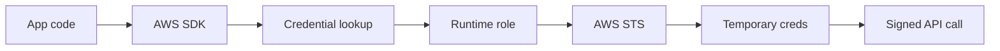

## Table of Contents

1. [The Problem](#the-problem)
2. [What Is a Workload Role](#what-is-a-workload-role)
3. [Temporary Credentials](#temporary-credentials)
4. [Credential Lookup](#credential-lookup)
5. [ECS Tasks](#ecs-tasks)
6. [EC2 Instances](#ec2-instances)
7. [Lambda Functions](#lambda-functions)
8. [Pipelines And Role Assumption](#pipelines-and-role-assumption)
9. [Common Failure Shapes](#common-failure-shapes)
10. [Putting It All Together](#putting-it-all-together)
11. [What's Next](#whats-next)

## The Problem

The previous article treated IAM as a request story: one caller wants to perform one action on one resource, and AWS decides whether that request is allowed. That shape is useful, but it leaves a practical question open.

Who is the caller when the code is not a human?

The receipt worker is a small example. When an order is paid, `devpolaris-receipt-worker` renders a PDF and writes it to an S3 bucket. On a laptop, the SDK finds the developer's local AWS profile and the upload works. In production, the code runs as a task, instance, function, or deploy job. It still needs to call AWS APIs, but nobody wants a reusable AWS key baked into the app.

The tempting shortcuts are familiar:

- A container gets `AWS_ACCESS_KEY_ID` and `AWS_SECRET_ACCESS_KEY` as environment variables.
- An EC2 instance gets one broad role because several scripts happen to run on the same host.
- A pipeline can deploy the service, so someone assumes the running app must have the same AWS access.
- An ECS task gets `AccessDenied`, and the team adds S3 permission to the task execution role instead of the task role.

All four mistakes blur identity. They make it harder to answer the IAM question from the previous article: which caller is AWS judging?

This article is about the safer shape. Running code should receive an AWS identity from the runtime that starts it. The app should not carry a static access key. The role should describe the workload's job, the credentials should be temporary, and evidence should show the assumed role session that made the request.

## What Is a Workload Role

A workload role is the IAM role your running code uses when it calls AWS. AWS documentation names the role differently depending on the runtime. ECS has a task role. EC2 uses an instance profile that contains a role. Lambda has an execution role. A deploy pipeline may assume a deployment role. The service names differ, but the design question is the same:

What job is this running thing allowed to do in AWS?

For the receipt worker, the answer is narrow. The production worker may write receipt PDFs under one bucket prefix. It does not need every S3 action. It does not need access to unrelated buckets. It does not need permission to edit IAM, update ECS services, or read every secret in the account.

That job sentence becomes the role shape:

```text
workload:
  devpolaris-receipt-worker-prod

trusted runtime:
  ECS tasks for this service

allowed AWS work:
  s3:PutObject on arn:aws:s3:::devpolaris-receipts-prod/receipts/*
```

Two sides matter. The trust policy says who is allowed to receive credentials for the role. The permissions policy says what those credentials can do after they exist.

That split is one of the first non-obvious IAM habits. If the role has the right S3 permission but its trust policy excludes the runtime, the app will not receive the role. If the runtime is trusted but the permission is too broad, the app works with more power than its job needs. If the permission is attached to a different role, the error will keep pointing at the caller that actually made the request.

The role is the identity AWS attaches to the running workload. The app still makes normal AWS SDK calls, but the runtime supplies the credentials for that role session.

## Temporary Credentials

Workload roles do not mean "no credentials." AWS API requests still have to be signed. The improvement is that the credentials are issued for a session instead of being long-lived access keys stored in code, images, shell history, CI variables, or screenshots.

Temporary credentials include an access key ID, a secret access key, a session token, and an expiration time. The session token is the part many beginners miss. If an app uses temporary credentials, all three credential values travel together. When the session expires, AWS rejects those credentials and the runtime or SDK must use fresh ones.



The expiration does not make a bad role safe by itself. A temporary admin session is still an admin session while it is alive. The safety comes from the combination: a limited lifetime, a role scoped to the workload's real job, and logs that show which role session made the request.

This changes the incident story. If a static key leaks from a container image, the key can keep working until someone finds and disables it. If a temporary role session leaks, the window is shorter, and the session can only do what the role allows. The team still has to rotate, investigate, and reduce blast radius, but the credential lifetime is no longer pretending to be permanent infrastructure.

## Credential Lookup

Most application code should not manually pass AWS credentials into each client. It should create an ordinary AWS SDK client and let the SDK find credentials through its provider chain.

That provider chain is the bridge between code and runtime. In an ECS task, the SDK can use the container credential provider. On EC2, it can use the instance metadata service for the instance profile role. In Lambda, the runtime exposes credentials for the function's execution role. The exact chain differs by SDK and configuration, but the operating habit is stable: let the runtime be the source of AWS identity.

This is why a clean runtime environment is part of security design. `AWS_REGION` and `RECEIPT_BUCKET` are normal configuration. `AWS_ACCESS_KEY_ID`, `AWS_SECRET_ACCESS_KEY`, and `AWS_SESSION_TOKEN` are credentials. If static credential environment variables are left in the container, the SDK may use those instead of the runtime role. The app can appear to work while CloudTrail shows the wrong caller.

The first debugging question is therefore not "which policy should I edit?" It is "which credential source did the app actually use?"

`aws sts get-caller-identity` is useful when you can run it from the same runtime context. The output should point at the workload role session, not a developer, not a CI role, and not an old IAM user. If the ARN is wrong, changing the intended role's policy will not fix the request because AWS is judging a different caller.

## ECS Tasks

ECS is where role confusion shows up quickly because there are two common roles in one task definition.

The task execution role is for ECS platform work. It lets ECS pull container images, write logs, and perform other actions needed to start and manage the task. The task role is for the application code inside the container. If the Node.js worker calls S3, the S3 permission belongs on the task role.

That distinction prevents a very common false repair. The receipt worker receives `AccessDenied` from S3. Someone sees "ECS task" and adds `s3:PutObject` to the execution role. The next task still fails because the application did not call S3 as the execution role. It called S3 as the task role session.

Task roles also give better evidence. ECS task credentials include task context for auditing, so a CloudTrail event can tie API activity back to the task that received the credentials. That is much more readable than a shared IAM user key named `prod-app`.

There is still a boundary gotcha. ECS task roles separate permissions better than a shared EC2 instance profile, but the shared host still matters. AWS treats container isolation as a workload boundary with host-level caveats, and ECS on EC2 needs extra care around metadata access and task isolation. Keep using task roles, but avoid packing unrelated trust zones onto the same host and assuming the role name alone creates hard isolation.

## EC2 Instances

On EC2, the workload role is attached through an instance profile. The instance profile is the container AWS uses to attach an IAM role to an instance. Applications on the instance can retrieve temporary role credentials from the instance metadata service and use them to sign AWS requests.

This is a good fit for a single-purpose host. If `receipt-worker-prod-1` only runs the receipt worker, an instance profile role named around that job is easy to explain. The role can allow receipt writes and little else.

The trouble starts when one instance becomes a shared box. A cron job, a migration script, a log shipper, and a one-off admin tool may all be able to reach the same instance profile credentials. From IAM's point of view, those processes are using the same caller unless you add another isolation layer. That makes the policy either too narrow for one process or too broad for another.

This is why containers, Lambda functions, and managed runtimes often feel cleaner for workload identity. They let the role follow the workload more closely. EC2 can still be secure, but the instance profile belongs to the instance, so the instance should have a clear job.

## Lambda Functions

Lambda uses an execution role. When the function is invoked, Lambda assumes that role and makes credentials available to the function runtime. The function code can then call AWS APIs through the SDK in the same normal way.

The execution role should describe what the function does while it runs. A function that writes receipts to one S3 prefix should not share a broad role with an image processor, a billing repair function, and a database migration. Shared roles look convenient until one function needs a new permission and every other function inherits it.

Lambda also has a trust side. The role's trust policy must allow the Lambda service principal to assume it. If that trust is wrong, the function cannot use the role correctly. If the trust is right but the function gets `AccessDenied`, read the action and resource in the error before widening the policy.

One small habit helps: avoid having function code manually assume its own execution role. Lambda is already doing that runtime assumption for you. Manual role hops inside the function are for special cases, such as accessing a separate cross-account role, and they deserve their own review.

## Pipelines And Role Assumption

Pipelines have their own identity story. A deployment job is a workload too, but it is not the same workload as the app it deploys.

A CI job may start with an external identity, federated identity, or runner credential. It then assumes a deployment role through AWS STS. That deploy role might register an ECS task definition, update an ECS service, create a Lambda version, or publish infrastructure changes. The session name can appear in the assumed role ARN and in audit evidence, which helps connect the change back to a build or release.

After deployment, the running app uses its runtime role. The deploy role and the app role should be separate because their jobs are different. The pipeline may need permission to change the service. The app may need permission to read one secret or write one bucket prefix. Giving the app deploy power turns a runtime bug into a release-system risk. Giving the deploy job every runtime permission turns a CI leak into a data-access incident.

There is one connector between them: passing a role to a service. Many AWS services let a caller configure a resource with an IAM role that the service will use later. For that setup step, the deployment identity may need `iam:PassRole` for approved workload roles. That permission should be narrow. A deploy role that can pass any powerful role to any service can indirectly grant more access than the pipeline should have.

The clean mental model is a handoff:

```text
pipeline assumes deploy role
deploy role configures service with approved workload role
AWS runtime assumes workload role
app code uses workload role credentials
```

Each line is a different caller. Keeping those callers separate is what makes audit logs and AccessDenied errors useful.

## Common Failure Shapes

Most workload-role failures are easier to read once you separate credential delivery from permission design. A missing credential source is different from a correct caller with a narrow policy. A deploy role failure is different from a runtime role failure.

| Symptom | Usually Means | First Question |
| --- | --- | --- |
| `Unable to locate credentials` | The runtime did not deliver credentials, or the SDK could not reach the runtime provider. | Is the role attached to this task, instance, or function, and is the app using the default provider chain? |
| `AccessDenied` names the expected workload role | The app is using the right identity, but the action, resource, or condition does not allow this request. | Does the denied action and resource match the job the role should have? |
| `AccessDenied` names a human, CI, or old IAM user | The app is not using the intended runtime role. | Where did those credentials enter the environment or SDK configuration? |
| ECS app still fails after editing the execution role | The permission was added to the platform role, not the application task role. | Which role appears in the denied caller ARN? |
| Works locally but fails in AWS | A local profile hid the missing or narrow runtime role. | What does `get-caller-identity` show inside the running workload? |
| Deploy fails with `iam:PassRole` | The deploy identity cannot configure the service with that workload role. | Should this deploy role be allowed to pass exactly this role to exactly this AWS service? |

The table is not a replacement for reading the error. It is a way to slow down before widening permissions. The caller ARN, action, and resource usually tell you whether the issue is identity delivery, permission scope, or deployment authority.

## Putting It All Together

The receipt worker started with a simple need: write PDFs to S3. The unsafe shortcut was to put a reusable AWS key in the container. That would make the upload work, but it would give the credential the wrong lifetime and make the caller harder to explain.

The workload-role design answers the original problem in smaller pieces.

The role describes the running code's job. The trust policy lets the right runtime receive credentials. The permissions policy allows the specific AWS actions and resources the workload needs. AWS issues temporary credentials for the role session. The SDK finds those credentials through the runtime provider. CloudTrail and error messages show the assumed role session that made the request.

That gives the team practical answers:

- The app calls AWS without carrying a static access key.
- ECS task roles, EC2 instance profiles, Lambda execution roles, and pipeline deploy roles are related shapes, not interchangeable names.
- Temporary credentials reduce credential lifetime, but least privilege still decides blast radius.
- The SDK credential chain is part of the architecture, so stray static credential variables can mask the runtime role.
- `AccessDenied` should be read as caller, action, and resource before anyone widens a policy.
- Deployment roles may pass approved workload roles to services, but they should not become the app's runtime identity.

The final habit is simple: ask what is running, what role it should receive, and what job that role should allow. If those three answers are clear, workload access becomes explainable instead of magical.

## What's Next

Workload roles answer who the running app is when it calls AWS. The next question is what private values the app should read after it has that identity.

The receipt worker might need a signing key. The orders API might need a database password. A webhook handler might need a vendor token. Those values should not live in source code or ordinary environment files either.

The next article covers secrets, encryption, and security evidence: where sensitive runtime values belong, who can read them, how encryption fits in, and what proof shows the app used them safely.

---

**References**

- [IAM roles](https://docs.aws.amazon.com/IAM/latest/UserGuide/id_roles.html). Supports the explanation that roles are IAM identities with permissions, have no long-term access keys, and provide temporary credentials when assumed.
- [Temporary security credentials in IAM](https://docs.aws.amazon.com/IAM/latest/UserGuide/id_credentials_temp.html). Supports the temporary credential model and the guidance to use temporary credentials instead of long-term credentials where possible.
- [AssumeRole](https://docs.aws.amazon.com/STS/latest/APIReference/API_AssumeRole.html). Supports the role-session, trust-policy, session-duration, and temporary credential details used in the temporary credentials and pipeline sections.
- [AWS SDKs and Tools standardized credential providers](https://docs.aws.amazon.com/sdkref/latest/guide/standardized-credentials.html). Supports the credential provider chain explanation and the runtime-provider mental model.
- [Container credential provider](https://docs.aws.amazon.com/sdkref/latest/guide/feature-container-credentials.html). Supports the ECS container credential lookup path used by SDKs and tools.
- [Amazon ECS task IAM role](https://docs.aws.amazon.com/AmazonECS/latest/developerguide/task-iam-roles.html). Supports the ECS task role explanation, the split from task execution permissions, CloudTrail task context, and the container-boundary warning.
- [Use an IAM role to grant permissions to applications running on Amazon EC2 instances](https://docs.aws.amazon.com/IAM/latest/UserGuide/id_roles_use_switch-role-ec2.html). Supports the EC2 instance profile pattern and temporary credentials through instance metadata.
- [Defining Lambda function permissions with an execution role](https://docs.aws.amazon.com/lambda/latest/dg/lambda-intro-execution-role.html). Supports the Lambda execution role explanation and Lambda's runtime role assumption behavior.
- [Using an IAM role in the AWS CLI](https://docs.aws.amazon.com/cli/latest/userguide/cli-configure-role.html). Supports the CLI and tool role-assumption model, source credentials, and role session naming.
- [Grant a user permissions to pass a role to an AWS service](https://docs.aws.amazon.com/IAM/latest/UserGuide/id_roles_use_passrole.html). Supports the `iam:PassRole` discussion for deployment identities that configure services with approved workload roles.
