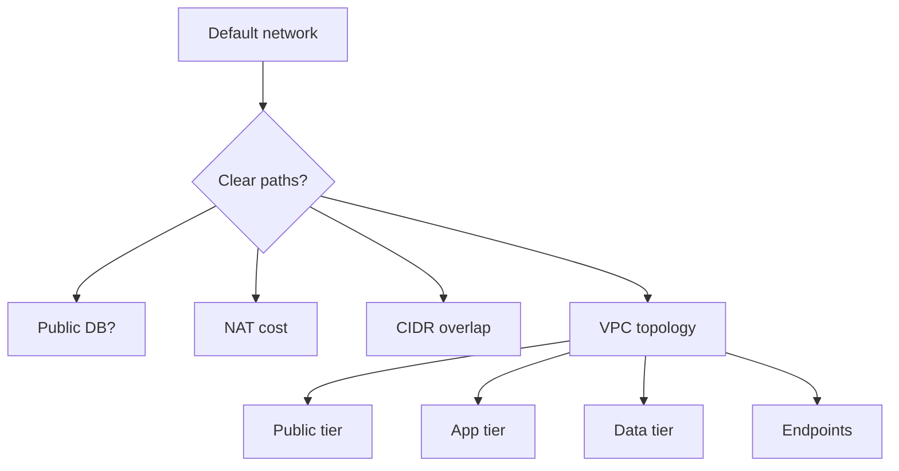
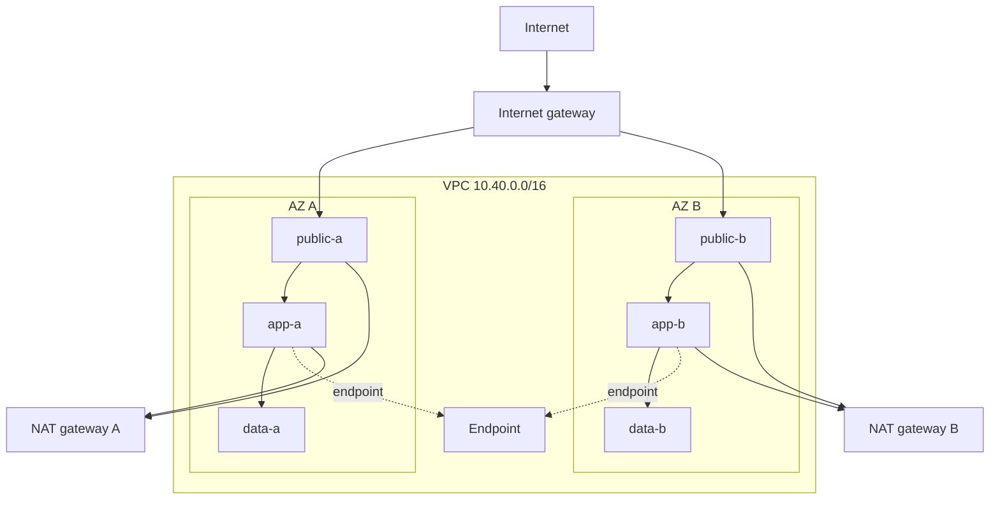
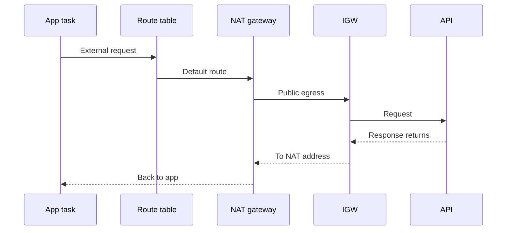

## Table of Contents

1. [The Problem](#the-problem)
2. [What Is a VPC](#what-is-a-vpc)
3. [CIDR Blocks](#cidr-blocks)
4. [Subnets](#subnets)
5. [Route Tables](#route-tables)
6. [Internet Gateway](#internet-gateway)
7. [NAT Gateway](#nat-gateway)
8. [VPC Endpoints](#vpc-endpoints)
9. [Sample Topology](#sample-topology)
10. [Putting It All Together](#putting-it-all-together)
11. [What's Next](#whats-next)

## The Problem

A team starts quickly. They launch a few EC2 instances, a database, and a worker in the default network because it is already there. Everything can reach everything else. The app deploys. The demo works.

Then the network becomes hard to explain:

- The database has a public address, and nobody is fully sure whether the internet can reach it.
- The app instances need software updates, but the team cannot say which private resources should have outbound internet access.
- A second environment needs to connect later, and the chosen IP range overlaps with a developer VPN or another VPC.
- The NAT gateway bill is higher than expected because private workloads send a lot of traffic through it, including traffic to AWS services that could have stayed private.

This article is about the first shape you give an AWS network so those questions have clear answers. The shape is not a firewall rule yet. It is topology: where the network boundary is, which address ranges belong to it, where workloads sit, and which route each subnet uses when traffic leaves.

The working mental model is simple: put only entry points in public subnets, put application workloads in private subnets, put databases in data subnets, and make every route table say what kind of exit that subnet is allowed to use.

## What Is a VPC

A virtual private cloud, usually called a VPC, is the private network boundary you create inside one AWS Region. It is dedicated to your AWS account and logically isolated from other virtual networks in AWS. You choose the IP address range for it, then create subnets, gateways, route tables, and security controls inside it.

That boundary matters because it gives your system a place to live. Without a deliberate VPC design, resources still have network placement, but the placement is accidental. A database may land beside an internet-facing server. A route table may allow internet access for more subnets than intended. Later, when another VPC, VPN, or on-premises network needs to connect, overlapping IP ranges can make the connection impossible without redesign.

A VPC spans the Availability Zones in its Region. A subnet does not. That split is easy to miss. The VPC is the regional container; each subnet is tied to exactly one Availability Zone. A resilient topology repeats the same tiers across at least two Availability Zones so one zone failure does not remove the whole application path.

The important habit is to treat the VPC as the place where network intent starts. If a resource is reachable from the internet, that should be because it sits in a subnet whose route table allows that path and because the resource has the right public address behavior. If a resource is private, that should be visible in its subnet choice and route table, not only in its name.

## CIDR Blocks

Every VPC needs an IPv4 CIDR block. CIDR is the notation that describes the address range, such as `10.40.0.0/16`. The smaller the number after the slash, the larger the range. A `/16` gives many addresses. A `/24` gives fewer. A `/28` is very small.

AWS allows IPv4 VPC CIDR blocks from `/16` through `/28`. That technical range is not the same as a good design range. In real systems, the VPC CIDR has to leave room for subnets, growth, and future connections to other networks. It also must not overlap with networks you may need to route to later. Overlap is one of the most painful early mistakes because two private networks that both use the same address range cannot be routed together cleanly.

For beginner planning, think of CIDR as the street grid for your VPC. You are not placing every building yet. You are reserving enough address space for neighborhoods, future neighborhoods, and roads between them. A tiny CIDR can make the first demo look tidy and the second environment impossible.

| Planning choice | What it means | Why it matters later |
| --- | --- | --- |
| VPC CIDR | The full private address range for the VPC | It must leave room for all subnets and avoid overlap with future connected networks. |
| Subnet CIDR | A slice of the VPC range in one Availability Zone | It must fit the resources that land in that zone and tier. |
| Non-overlap | No two connected networks use the same address range | VPC peering, VPN, Direct Connect, and transit designs all depend on routable, distinct ranges. |
| Growth buffer | Unused address space kept for later | New tiers, more Availability Zones, and managed services often need more subnet space than expected. |

There are two gotchas worth learning early.

First, you cannot increase or decrease an existing VPC CIDR block after creating it. You can associate additional CIDR blocks with a VPC, but that is different from resizing the original range. It can help, but it is not as clean as choosing a sane range at the start.

Second, AWS reserves the first four IP addresses and the last IP address in each subnet CIDR block. A `/28` has 16 total IPv4 addresses, but not 16 usable addresses for your resources. Small subnets disappear faster than they look on a whiteboard, especially when managed services place network interfaces into them.

For a teaching example, this article will use `10.40.0.0/16` for one production VPC. The exact range is not magic. The habit matters more: choose a range intentionally, record why it was chosen, and check it against every network you may need to connect.

## Subnets

A subnet is a range of IP addresses inside the VPC. It is also the placement unit for many AWS resources. When you launch a workload, database, endpoint, or load balancer node, you usually choose subnets.

Subnets do two jobs at once. They place resources in an Availability Zone, and they attach those resources to a route table. This is why subnet design is topology design. If you create one large flat subnet and put everything in it, there is no clear network boundary between public entry points, private app workloads, and data services. If you create subnets by tier and by zone, the design becomes readable.

The common three-tier shape looks like this:

| Tier | Example subnets | What belongs here | Route shape |
| --- | --- | --- | --- |
| Public | `public-a`, `public-b` | Internet-facing entry points, NAT gateways, public load balancer nodes | Default route to an internet gateway |
| Private app | `app-a`, `app-b` | Application servers, containers, workers, internal services | Default route to a NAT gateway only when outbound internet is required |
| Data | `data-a`, `data-b` | Databases, caches, private data services | Usually no internet default route |

The names help humans, but the route tables make the names true. A subnet named `private-a` is not private because the name says so. It is private because its route table does not send traffic directly to an internet gateway.

That distinction prevents a common database mistake. A database in a public subnet has taken the first step toward internet reachability even if another control still blocks traffic. A database in data subnets with no internet gateway route is easier to reason about: the topology itself says the database tier is not an internet entry point.

Notice the repeated pattern across zones. Public, app, and data subnets exist in both Availability Zones. That does not make the app highly available by itself, but it gives the application architecture a place to run across zones.

## Route Tables

A route table is a set of routes that tells AWS where traffic should go when it leaves a subnet. Each route has a destination and a target. The destination is the address range the packet is trying to reach. The target is the gateway, network interface, endpoint, or local route that should receive that traffic next.

Every route table in a VPC has a local route for the VPC CIDR. That local route is what lets resources inside the VPC talk to private addresses in other subnets, subject to packet controls such as security groups and network ACLs. You do not add a route from `app-a` to `data-a` for basic same-VPC communication. The local route already covers the VPC range.

The route that changes the subnet's role is usually the default route: `0.0.0.0/0` for IPv4. That means "anything not matched by a more specific route." If a subnet's default route points to an internet gateway, it is a public subnet. If it points to a NAT gateway, resources can start outbound internet connections without becoming direct inbound internet targets. If there is no default route outside the VPC, the subnet is isolated from external destinations unless more specific private routes exist.

| Route table | Associated subnets | Destination | Target | Meaning |
| --- | --- | --- | --- | --- |
| `rt-public` | `public-a`, `public-b` | `10.40.0.0/16` | `local` | Traffic inside the VPC stays local. |
| `rt-public` | `public-a`, `public-b` | `0.0.0.0/0` | Internet gateway | Public subnets can send internet-bound IPv4 traffic to the internet gateway. |
| `rt-app-a` | `app-a` | `10.40.0.0/16` | `local` | App workloads can reach private VPC addresses. |
| `rt-app-a` | `app-a` | `0.0.0.0/0` | NAT gateway A | App workloads in AZ A can initiate outbound internet access through same-zone NAT. |
| `rt-data-a` | `data-a` | `10.40.0.0/16` | `local` | Data services can receive private VPC traffic. |
| `rt-data-a` | `data-a` | none | none | No general internet exit from the data subnet. |

This table is not a full production design. It is a way to read topology. Ask what routes exist for the subnet, then ask what resource is allowed to have public addressing and what packet controls apply. The route table tells you the path. The next article covers the filters on that path.

The route table association is also important. A VPC has a main route table, and subnets use it unless you explicitly associate them with another route table. For deliberate topology, use explicit route table associations for each tier. That makes the design reviewable. A new subnet should not accidentally inherit a broad main route table just because nobody associated it with the right one.

## Internet Gateway

An internet gateway is the VPC component that lets resources communicate with the internet. It must be attached to the VPC, and routing must point internet-bound traffic to it.

For IPv4 internet access through an internet gateway, two things must line up:

- The subnet route table needs a route to the internet gateway, commonly `0.0.0.0/0`.
- The resource needs a public IPv4 address or Elastic IP address behavior that lets the internet gateway translate between the public address and the private address.

This is why "public subnet" does not simply mean "subnet with internet somewhere nearby." A subnet is public when its route table has a route to an internet gateway. A private subnet can still contain a resource with a public IP by mistake, but without a route to the internet gateway that public IP does not create normal internet communication.

In a clean topology, public subnets are narrow. They hold internet entry components and NAT gateways. The public tier is not where you put every resource that needs to download updates. It is where you put the few components that should be directly involved in internet entry or internet egress.

| Component | Public subnet? | Why |
| --- | --- | --- |
| Internet-facing load balancer nodes | Yes | They are the controlled public entry point for users. |
| NAT gateway | Yes for public NAT | It needs a path to the internet gateway so private subnets can use it for outbound access. |
| Application server | Usually no | It should normally receive traffic through an entry point, not directly from the internet. |
| Database | No | Data services should not become public entry points. |

This does not make the public tier unsafe by itself. It makes it explicit. The public subnet route says, "this is where internet paths are allowed to begin or leave." The packet controls decide which packets are allowed across that path.

## NAT Gateway

Private workloads often need outbound access. They may download operating system packages, pull container images, call third-party APIs, or send telemetry. A NAT gateway lets resources in private subnets initiate connections to destinations outside the VPC while preventing unsolicited inbound connections from those outside destinations.

The direction matters. NAT is not a back door into private subnets. The connection starts from inside the VPC. The NAT gateway translates the private source address to the NAT gateway address for the external path, then translates response traffic back to the original private source.

For a public NAT gateway, the gateway lives in a public subnet and uses the internet gateway for the outside leg. The private app subnet route table points `0.0.0.0/0` to the NAT gateway. The public subnet route table points `0.0.0.0/0` to the internet gateway.

NAT gateways are useful, but they create two common surprises.

The first surprise is cost. AWS charges for each hour a NAT gateway is available and for each gigabyte it processes. If many private workloads send high-volume traffic through NAT, the bill can grow quickly. If the traffic is mostly to AWS services that support VPC endpoints, an endpoint may keep that path private and reduce NAT processing.

The second surprise is Availability Zone design. A NAT gateway is created in a specific Availability Zone and is redundant within that zone. If private workloads in multiple zones all share one NAT gateway and that gateway's zone has a problem, the other zones can lose outbound internet access. The usual resilient pattern is one NAT gateway per Availability Zone, with each private subnet routing to the NAT gateway in the same zone.

| NAT design | Simpler? | More resilient? | Cost shape | When it appears |
| --- | --- | --- | --- | --- |
| One NAT gateway shared by all private subnets | Yes | Weaker for multi-AZ workloads | Lower hourly count, possible cross-AZ data transfer | Small dev environments or low-risk systems |
| One NAT gateway per Availability Zone | Less simple | Stronger | Higher hourly count, less cross-zone dependency | Production multi-AZ workloads |
| No NAT for data subnets | Yes for data tier intent | Stronger isolation | Avoids accidental internet egress | Databases and private data services |

Topology is a tradeoff. You do not add NAT everywhere because "private subnets need NAT." You add NAT where a private subnet truly needs outbound external access, and you make the cost and resilience choice visible.

## VPC Endpoints

Many private workloads do not really need "the internet." They need an AWS service. A worker might read from S3. An application might call Secrets Manager. A database migration job might write logs. Sending all of that through NAT treats AWS service traffic like general outbound internet traffic, even when a private path exists.

A VPC endpoint lets resources in your VPC reach supported AWS services without the same internet gateway or NAT gateway path. There are several endpoint types. For this topology article, two are enough to understand:

| Endpoint type | Common use | How the path is represented | Beginner mental model |
| --- | --- | --- | --- |
| Gateway endpoint | Amazon S3 and DynamoDB | A route table entry to an AWS-managed prefix list | A private route for a specific service family |
| Interface endpoint | Many AWS services through AWS PrivateLink | Endpoint network interfaces in selected subnets | A private network interface for service access |

Gateway endpoints are especially important for NAT cost surprises. For S3 and DynamoDB, a gateway endpoint adds service-specific routes to the selected route tables. Traffic for that service uses the endpoint route instead of the broad default route. AWS documents no additional charge for gateway endpoints, which makes them a common early improvement when private subnets send a lot of S3 or DynamoDB traffic.

Interface endpoints work differently. They create endpoint network interfaces in the subnets you select. Workloads reach the AWS service through those private addresses. The details vary by service, but the topology idea is stable: private workloads can reach supported AWS services without needing a general internet route for that specific traffic.

Endpoints do not remove the need for packet controls or IAM permissions. They answer a topology question: "Can this private workload reach the AWS service over a private path instead of sending the traffic through NAT or an internet gateway?"

## Sample Topology

Imagine a small orders service. Users reach the service through an internet-facing entry point. The app runs in containers or instances. The database stores orders. The app reads objects from S3 and sends messages to another AWS service. The team wants the service to run across two Availability Zones.

The topology can be described without any command line:

| Layer | Subnets | Route table behavior | Example resources |
| --- | --- | --- | --- |
| Public entry | `public-a`, `public-b` | Local VPC route plus default route to internet gateway | Public load balancer nodes, NAT gateways |
| Private app | `app-a`, `app-b` | Local VPC route, same-zone NAT default route if needed, endpoint routes for AWS services | App tasks, workers, internal services |
| Data | `data-a`, `data-b` | Local VPC route only, or specific private routes when required | Databases, caches |
| Service access | App route tables and endpoint subnets | Prefix-list route for gateway endpoints or private endpoint interfaces | S3 gateway endpoint, interface endpoints for supported services |

This design answers the opener's problems.

The database is not public by placement. It lives in data subnets whose route tables do not point to the internet gateway. Later, packet controls can restrict which app security group reaches the database port, but the topology already says the database is not an internet tier.

Public and private access are no longer guesses. Public subnets have an internet gateway route. App subnets use NAT only for outbound access they truly need. Data subnets avoid general internet egress. Endpoint routes make AWS service access visible.

NAT cost becomes explainable. If app workloads send software update or third-party API traffic through NAT, that is expected. If they send heavy S3 traffic through NAT while no S3 gateway endpoint exists, that is a design smell the route tables can reveal.

IP overlap is less likely because the CIDR plan has been chosen as a regional address plan, not as an afterthought. You can still make mistakes, but the question is now explicit during design: "What networks might this VPC need to connect to?"

## Putting It All Together

The first useful AWS network design is not complicated. It is deliberate.

Start with the VPC as the private regional boundary. Choose a CIDR range that gives the network room to grow and avoids future overlap. Split that range into subnets by Availability Zone and job. Use public subnets only for public entry and public egress components. Put app workloads in private subnets. Put databases and data services in data subnets. Use route tables to make those roles true.

Then choose exits carefully. An internet gateway gives public subnets a direct internet path. A NAT gateway gives private subnets outbound-initiated access without making them direct inbound targets. VPC endpoints give private paths to supported AWS services and can remove traffic from the NAT path.

The flat default network failed because it could not answer simple questions. Is the database public? Which subnet is allowed to reach the internet? Why is this NAT gateway so busy? Can this VPC connect to another network later?

A planned topology answers those questions before the incident:

- The database lives in data subnets with no internet gateway route.
- The app lives in private subnets and uses same-zone NAT only where outbound internet is needed.
- S3 or DynamoDB traffic can use gateway endpoints instead of general NAT egress.
- CIDR choices are recorded before another VPC, VPN, or on-premises network needs a route.
- Route tables show the allowed paths, while the next layer decides which packets may use those paths.

That last point is the handoff. Topology tells traffic where it could go. It does not, by itself, approve every packet.

## What's Next

The next article takes this topology and adds packet controls. A public subnet can have an internet route and still allow only specific entry traffic. A private app subnet can have a route to the database and still be blocked by a missing rule. A data subnet can be reachable inside the VPC while accepting only the app tier.

That is the job of security groups and network ACLs. Security groups protect resources and network interfaces. Network ACLs protect subnet boundaries. Now that the topology is clear, the next question is sharper: which packets should be allowed on each path?

---

**References**

- [How Amazon VPC works](https://docs.aws.amazon.com/vpc/latest/userguide/how-it-works.html). Supports the VPC, subnet, route table, default VPC, internet gateway, and NAT mental model used throughout the article.
- [VPC basics](https://docs.aws.amazon.com/vpc/latest/userguide/vpc-subnet-basics.html). Supports the explanation that a VPC spans Availability Zones in a Region and includes default VPC resources such as the main route table.
- [VPC CIDR blocks](https://docs.aws.amazon.com/vpc/latest/userguide/vpc-cidr-blocks.html). Supports VPC CIDR sizing, RFC 1918 recommendations, secondary CIDR behavior, overlap constraints, and the warning that existing CIDR blocks cannot be resized.
- [Subnet CIDR blocks](https://docs.aws.amazon.com/vpc/latest/userguide/subnet-sizing.html). Supports subnet sizing, non-overlapping subnet ranges, and the five reserved addresses in each subnet.
- [Subnets for your VPC](https://docs.aws.amazon.com/vpc/latest/userguide/configure-subnets.html). Supports subnet placement in one Availability Zone, subnet types, route table association, and the recommendation to use private subnets for protected resources.
- [Route table concepts](https://docs.aws.amazon.com/vpc/latest/userguide/RouteTables.html). Supports destination, target, local route, main route table, custom route table, and route table association terminology.
- [Enable internet access for a VPC using an internet gateway](https://docs.aws.amazon.com/vpc/latest/userguide/VPC_Internet_Gateway.html). Supports the public subnet definition, internet gateway routing requirements, and public IPv4 or Elastic IP requirement for IPv4 internet communication.
- [NAT gateways](https://docs.aws.amazon.com/vpc/latest/userguide/vpc-nat-gateway.html). Supports the explanation that NAT gateways allow outbound connections from private subnets while preventing unsolicited inbound connections.
- [NAT gateway basics](https://docs.aws.amazon.com/vpc/latest/userguide/nat-gateway-basics.html). Supports the Availability Zone resilience guidance for same-zone NAT routing.
- [Pricing for NAT gateways](https://docs.aws.amazon.com/vpc/latest/userguide/nat-gateway-pricing.html). Supports the NAT cost discussion, including hourly and per-gigabyte processing charges and endpoint-based cost reduction guidance.
- [Gateway endpoints](https://docs.aws.amazon.com/vpc/latest/privatelink/gateway-endpoints.html). Supports the S3 and DynamoDB gateway endpoint explanation, route table behavior, prefix lists, and no-additional-charge statement for gateway endpoints.
- [AWS PrivateLink concepts](https://docs.aws.amazon.com/vpc/latest/privatelink/concepts.html). Supports the interface endpoint and PrivateLink mental model used for private AWS service access.
