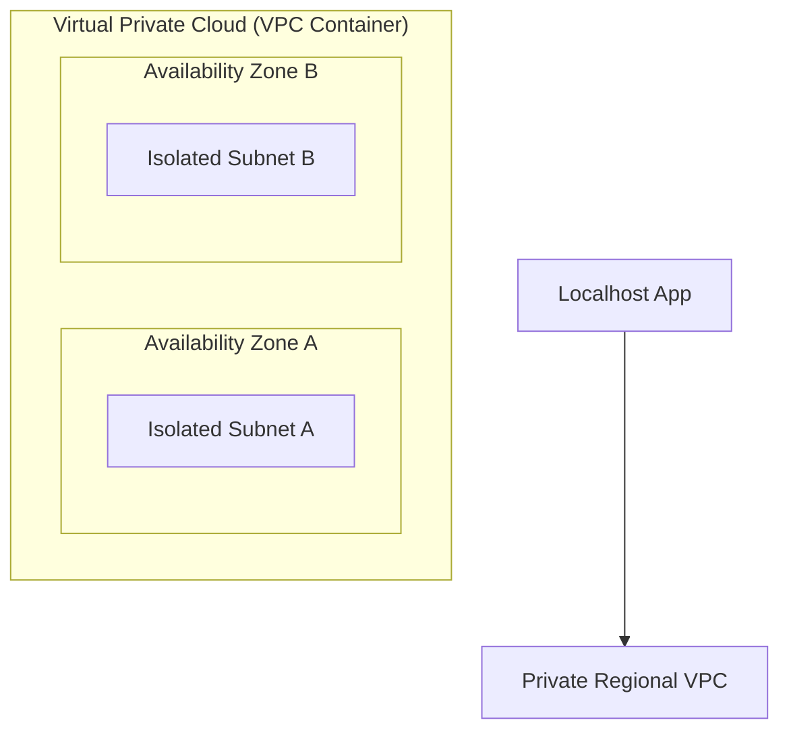
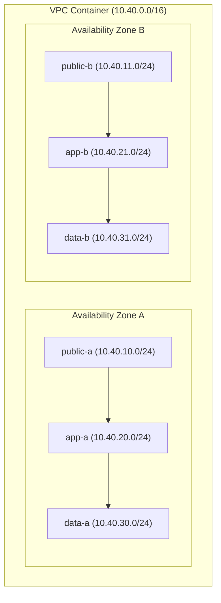
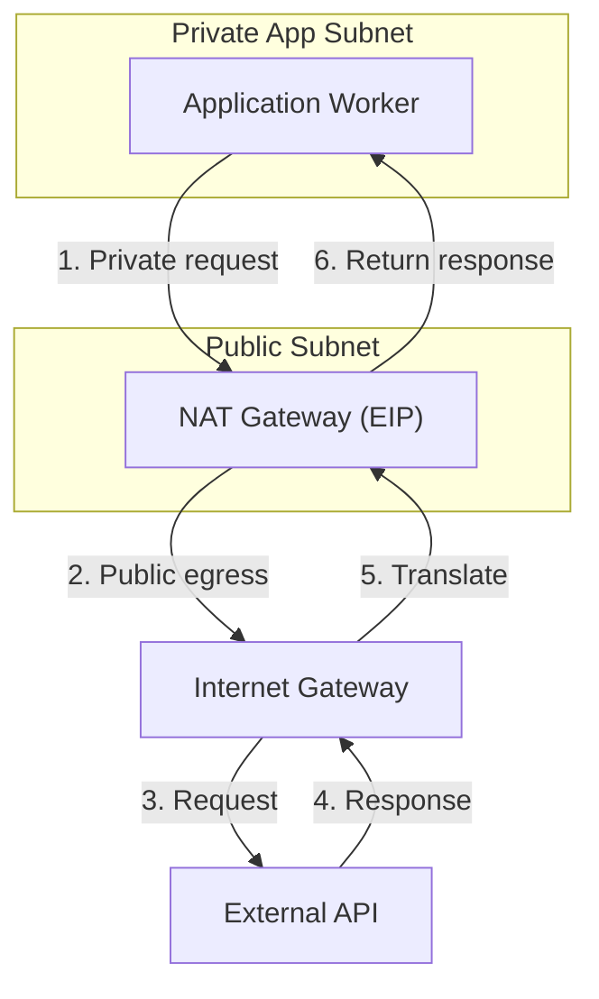

## Table of Contents

1. [Localhost vs. The Cloud Network](#localhost-vs-the-cloud-network)
2. [The Virtual Private Cloud Boundary](#the-virtual-private-cloud-boundary)
3. [CIDR Block Address Planning](#cidr-block-address-planning)
4. [Subnet Segmentation Across Availability Zones](#subnet-segmentation-across-availability-zones)
5. [Route Tables and Traffic Routing](#route-tables-and-traffic-routing)
6. [Internet Gateways vs. NAT Gateways](#internet-gateways-vs-nat-gateways)
7. [VPC Gateway Endpoints](#vpc-gateway-endpoints)
8. [Putting It All Together](#putting-it-all-together)
9. [What's Next](#whats-next)

## Localhost vs. The Cloud Network

When you develop an application on your local laptop, networking is practically invisible. You start your application server, and it binds automatically to the local loopback address: `127.0.0.1`. If your application needs to write to or read from a database, you boot a database process on the same machine, pointing your database client to another port on `localhost`. 

On your laptop, no firewalls, no subnets, and no routing tables exist between your code and your database. Because they share the exact same physical system, their communication is guaranteed to be private, fast, and completely isolated from the outside world.

Once you move your application to the cloud, that simple loopback model disappears. Your database, your web API, and your background queue workers no longer share a single system. They run on completely separate virtual machines hosted inside massive public datacenters. 

If you launch these virtual servers without a deliberate network boundary, they are placed by default on a flat, public network. This means your database receives a public IP address, leaving its port exposed to anyone scanning the internet. 

Additionally, your servers share the same broad IP space with thousands of other cloud customers, making private communication difficult to isolate. To run securely in the cloud, you must recreate the isolation of localhost by constructing your own private network boundary.

## The Virtual Private Cloud Boundary

A Virtual Private Cloud, commonly referred to as a VPC, is a logically isolated private network container that you create inside a single AWS Region. It is dedicated strictly to your AWS account, cabled logically apart from all other virtual networks in the cloud. Within this boundary, you have complete control over defining private IP address spaces, dividing those spaces into subnets, cabled routing tables, and attaching security gateways.

The VPC acts as the absolute baseline for all cloud infrastructure security. Without an explicit VPC boundary, network placement is entirely accidental. A database might land directly adjacent to an internet-facing frontend node on the same public tier, exposing critical data to unnecessary risk. 

By defining a deliberate VPC topology, you ensure that every resource is assigned to an isolated network tier with explicit paths inside and outside your system.

A VPC spans all Availability Zones within its home Region. This regional container is then divided into subnets, each of which is tied to exactly one Availability Zone. A resilient VPC design leverages this zone division by duplicating identical subnet tiers across multiple Availability Zones, ensuring that the failure of a single physical datacenter does not take down the entire application path.

## CIDR Block Address Planning

Before you can place virtual servers or databases inside your VPC, you must define the IP address range they will use. AWS represents this range using Classless Inter-Domain Routing (CIDR) notation. A CIDR block consists of an IP address followed by a slash and a number, such as `10.40.0.0/16`. 

The number after the slash represents the subnet mask, which dictates the size of the address block. A smaller number after the slash provides a larger pool of addresses, whereas a larger number provides fewer addresses. AWS allows you to choose private VPC CIDR blocks between a `/16` (65,536 addresses) and a `/28` (16 addresses).

Planning your CIDR block requires careful foresight. If you allocate a tiny CIDR block for your initial VPC, you may run out of IP addresses as your application scales or as you add managed services that require network interfaces. 

Conversely, if you assign CIDR blocks casually, you run the risk of IP address collision. If two private networks utilize the same CIDR range, they cannot peer or route traffic directly to one another.

To prevent IP collisions, follow these three foundational habits:
* **Plan for Future Connectivity**: Always assume your VPC will eventually need to connect to other environments, such as a developer VPN, another VPC in your organization, or a physical office network. Choose a distinct CIDR block that does not overlap with any of these existing networks.
* **Leave Room for Subnets**: A broad VPC CIDR block like `10.40.0.0/16` can be cleanly divided into smaller, manageable blocks for your individual subnets, leaving plenty of unused address space for future growth.
* **Account for Reserved IPs**: AWS automatically reserves the first four IP addresses and the last IP address in every single subnet CIDR block. If you create a tiny `/28` subnet containing 16 total addresses, only 11 of them are actually usable, which can quickly lead to address exhaustion.

## Subnet Segmentation Across Availability Zones

A subnet is a dedicated range of IP addresses within your overall VPC CIDR block. It serves as the primary placement unit for virtual servers, database interfaces, container tasks, and load balancers. 

By segmenting your VPC into distinct subnets, you can establish clear physical boundaries between public entry points, internal application logic, and backend data stores.

A secure, production-ready network topology utilizes a three-tier subnet architecture, repeated across at least two Availability Zones:

* **The Public Tier**: Holds internet-facing resources like Application Load Balancers and NAT Gateways. These subnets are configured to assign public IP addresses, and their route tables send outbound traffic directly to the internet.
* **The Private Application Tier**: Houses the application code, container tasks, API workers, and internal services. Resources here do not receive public IP addresses and cannot be reached directly from the internet. They can only initiate outbound connections via a NAT Gateway when necessary.
* **The Data Tier**: Dedicated strictly to databases, key-value caches, and highly sensitive data engines. These subnets are completely isolated, with absolutely no route to the internet, ensuring that data stores remain completely unreachable from outside the private network.

Duplicating this three-tier layout across multiple Availability Zones provides a stable network topology. If one physical zone suffers an outage, the load balancer in the remaining public subnets can seamlessly route traffic to application tasks running in the alternative private subnets.

## Route Tables and Traffic Routing

A route table contains a set of routing rules that determines where network packets are sent when they leave a subnet. Each rule consists of a destination and a target. The destination represents the destination IP address range that the packet is trying to reach, while the target represents the gateway, network interface, or connector through which the packet must pass.

Every route table in a VPC is automatically cabled with a default `local` route for the VPC's overall CIDR block. This local route allows all resources within the VPC to communicate privately with one another across subnets, subject to packet filters. 

To control how a subnet interacts with the outside world, you add a default route, represented as `0.0.0.0/0` in IPv4, pointing to an external target.

The route tables are what actually make a subnet "public" or "private". A subnet is not public because of its name; it is public because its associated route table explicitly directs internet-bound traffic to an Internet Gateway.

* **Public Subnet Route Table**:
  * Local Destination (`10.40.0.0/16`) -> Target `local` (Allows private same-VPC communication).
  * Default Outbound Destination (`0.0.0.0/0`) -> Target `Internet Gateway` (Allows direct, bidirectional public internet access).

* **Private App Subnet Route Table**:
  * Local Destination (`10.40.0.0/16`) -> Target `local` (Allows private same-VPC communication).
  * Default Outbound Destination (`0.0.0.0/0`) -> Target `NAT Gateway` (Allows outbound-initiated internet access for patches and third-party APIs).

* **Data Subnet Route Table**:
  * Local Destination (`10.40.0.0/16`) -> Target `local` (Allows private same-VPC communication).
  * No outbound route to `0.0.0.0/0` is registered, completely isolating the database tier from the outside world.

Every VPC contains a default main route table. If a subnet is created without an explicit association, it automatically inherits this main table. To ensure a secure, reviewable topology, you should always create custom route tables for each tier and associate them explicitly with their target subnets.

## Internet Gateways vs. NAT Gateways

To allow traffic to enter or leave your VPC, you must attach network gateways. The type of gateway you choose dictates whether the communication path is bidirectional or strictly outbound-initiated.

An Internet Gateway is a horizontally scaled, redundant VPC component that enables direct, bidirectional communication between resources in your public subnets and the internet. To communicate through an Internet Gateway, a resource must live in a public subnet, its route table must point default traffic to the Internet Gateway, and the resource must be assigned a public IPv4 or Elastic IP address.

A NAT Gateway is a managed Network Address Translation service that enables resources in private subnets to initiate outbound connections to the internet, while preventing the internet from initiating unsolicited inbound connections back to those resources. 

The NAT Gateway lives in a public subnet, receives a public Elastic IP address, and acts as a proxy for private instances. When a private worker initiates an API call, the NAT Gateway translates the private source IP to its own public Elastic IP for the outside leg, and then routes the return response back to the private worker.

Operating NAT Gateways introduces two critical engineering tradeoffs:

* **Resilience and AZ Alignment**: A NAT Gateway is cabled with built-in redundancy within a single Availability Zone. However, if you deploy only one NAT Gateway and share it across private subnets in multiple Availability Zones, a failure in that NAT Gateway's zone will take down outbound internet access for all other zones. To build a highly resilient architecture, always deploy one NAT Gateway per Availability Zone, routing private subnets to their same-zone gateway.
* **Processing and Idle Costs**: AWS charges a continuous hourly fee for each active NAT Gateway, plus a processing charge for every gigabyte of data passing through it. If your private application workers send heavy volumes of traffic through a NAT Gateway, your bill can escalate rapidly.

## VPC Gateway Endpoints

When application workers running in private subnets need to interact with core AWS services like Amazon S3 or Amazon DynamoDB, directing that traffic through a NAT Gateway is a costly design mistake. Because S3 and DynamoDB are regional public AWS services, private resources would ordinarily have to route through the NAT Gateway to reach them, incurring processing charges for every gigabyte of data transferred.

A VPC Gateway Endpoint solves this problem by establishing a private, direct routing path to supported AWS services. When you create a Gateway Endpoint for S3 or DynamoDB, you associate it with your VPC's route tables. AWS automatically appends a highly specific route to these tables, pointing the service's public prefix list (such as `pl-63a5400a` for Amazon S3) directly to the gateway endpoint (`vpce-xxxxxxxx`).

Because the endpoint route is more specific than the broad `0.0.0.0/0` NAT Gateway route, all S3 and DynamoDB traffic automatically bypasses the NAT Gateway entirely.

* **Private App Route Table with S3 Gateway Endpoint**:
  * Local Destination (`10.40.0.0/16`) -> Target `local`
  * S3 Prefix List (`pl-63a5400a`) -> Target `vpce-s3` (Sends S3 traffic privately with zero NAT fee).
  * Default Outbound Destination (`0.0.0.0/0`) -> Target `NAT Gateway` (Directs all other internet traffic through NAT).

AWS does not charge any hourly or processing fees for using VPC Gateway Endpoints. By placing a Gateway Endpoint in your private route tables, you secure S3 traffic inside the AWS network while reducing your NAT Gateway processing costs to zero.

## Putting It All Together

Designing a secure cloud network topology means moving from accidental placement to deliberate boundaries. By applying the structure of a VPC, you replicate the isolation of localhost at a regional cloud scale.

* **The Regional VPC**: Establishes your private network container, cabled apart from all other cloud customers.
* **CIDR Planning**: Reserves a distinct, non-overlapping street-grid (such as `10.40.0.0/16`) that leaves ample room for subnets and avoids future IP address conflicts.
* **Subnet Segmentation**: Duplicates a secure three-tier layout (Public, Private App, Data) across multiple Availability Zones to eliminate single points of failure.
* **Route Tables**: Acts as the physical routing brain, making subnets truly public or private based on where their default outbound routes point.
* **Gateways**: Internet Gateways allow public entry points to accept user requests, while NAT Gateways provide private subnets with secure, outbound-initiated egress.
* **VPC Endpoints**: Bypasses expensive NAT Gateway paths for core AWS services like S3 and DynamoDB, keeping high-volume traffic secure and free.

A clean topology outlines where network paths are cabled. However, routing rules only make paths possible; they do not dictate which packets are permitted to use those paths. To lock down our system, we need to apply precise packet-filtering gates at both the subnet and resource levels.

## What's Next

Now that we have established our physical VPC topology, our next step is to control packet access. A public subnet may have an active internet route, but we still need to restrict which public ports are open to the world. A private application subnet may have a route to the database tier, but we must ensure that only our backend code can query our data store.

In the next article, we will compare the two primary AWS packet-filtering layers: stateful **Security Groups** protecting individual resource interfaces, and stateless **Network ACLs** guarding subnet boundaries. We will learn how to write clean workload references instead of fragile IP lists, and how to verify our filters using VPC Flow Logs metadata.

---

**References**

- [How Amazon VPC works](https://docs.aws.amazon.com/vpc/latest/userguide/how-it-works.html) - Explains VPC containers, subnets, route tables, and core gateway routing mechanics.
- [VPC basics](https://docs.aws.amazon.com/vpc/latest/userguide/vpc-subnet-basics.html) - Describes how a VPC spans regional Availability Zones and covers default VPC resources.
- [VPC CIDR blocks](https://docs.aws.amazon.com/vpc/latest/userguide/vpc-cidr-blocks.html) - Outlines CIDR sizing rules, private address spaces, and secondary block allocation.
- [Subnet CIDR blocks](https://docs.aws.amazon.com/vpc/latest/userguide/subnet-sizing.html) - Focuses on subnet IP planning, sizing considerations, and the five reserved AWS IPs.
- [Subnets for your VPC](https://docs.aws.amazon.com/vpc/latest/userguide/configure-subnets.html) - Outlines subnet zone limits, route table associations, and recommendations for private tiers.
- [Route table concepts](https://docs.aws.amazon.com/vpc/latest/userguide/RouteTables.html) - Details destination routes, targets, local routing, and custom subnet table routing.
- [Enable internet access for a VPC using an internet gateway](https://docs.aws.amazon.com/vpc/latest/userguide/VPC_Internet_Gateway.html) - Defines the public subnet routing contract and public IPv4 addressing requirements.
- [NAT gateways](https://docs.aws.amazon.com/vpc/latest/userguide/vpc-nat-gateway.html) - Focuses on outbound address translation, private egress, and NAT gateway placement.
- [NAT gateway basics](https://docs.aws.amazon.com/vpc/latest/userguide/nat-gateway-basics.html) - Provides architectural guidelines for single-zone and multi-zone NAT gateway designs.
- [Pricing for NAT gateways](https://docs.aws.amazon.com/vpc/latest/userguide/nat-gateway-pricing.html) - Explains hourly fees, gigabyte processing costs, and pricing strategies using endpoints.
- [Gateway endpoints](https://docs.aws.amazon.com/vpc/latest/privatelink/gateway-endpoints.html) - Focuses on gateway endpoints for S3 and DynamoDB, prefix lists, and route integration.
