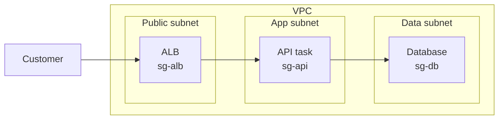
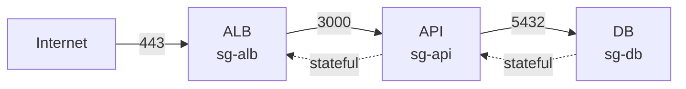
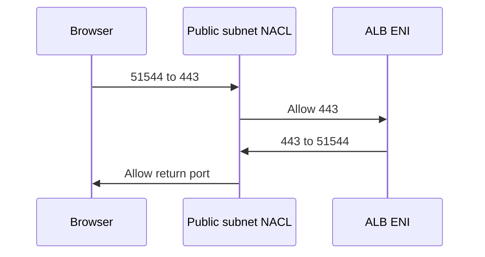

## Table of Contents

1. [The Packet Path](#the-packet-path)
2. [One Conversation](#one-conversation)
3. [Security Groups](#security-groups)
4. [Group References](#group-references)
5. [Network ACLs](#network-acls)
6. [Return Traffic](#return-traffic)
7. [VPC Flow Logs](#vpc-flow-logs)
8. [Which Layer](#which-layer)
9. [Putting It All Together](#putting-it-all-together)
10. [What's Next](#whats-next)

## The Packet Path

The previous article built the VPC topology: public subnets for the load balancer, private application subnets for the API, private data subnets for the database, and route tables that decide where packets can go next.

That topology gives packets a possible path.
It does not decide whether the packets are allowed.

For `devpolaris-orders-api`, the intended path is simple:

```text
Customer -> public load balancer -> private API task -> private database
```

The route tables can make that path possible.
But possible is not the same as permitted.
The load balancer still needs permission to talk to the API task.
The API task still needs permission to talk to the database.
The database should not accept traffic directly from the load balancer, from the internet, or from a random instance that happens to live in the same VPC.

AWS gives you two built-in packet filters for this job:

- **Security groups** control traffic at the resource or network interface level.
- **Network ACLs**, usually pronounced "NACLs", control traffic at the subnet boundary.

Use security groups as the main firewall for workloads.
Use NACLs as broader subnet guardrails when you need an extra boundary, such as denying a known unwanted CIDR range before traffic reaches any resource in the subnet.
Then use VPC Flow Logs when you need evidence about which traffic was accepted or rejected.

Here is the shape we will keep returning to:



Notice the two levels.
The NACL sits around a subnet.
The security group sits on the resource's network interface, often called an ENI.
If both layers are present, a packet has to satisfy the relevant subnet rule and the relevant resource rule.

## One Conversation

Before reading rule tables, name the conversation you want to allow.
That keeps the design from turning into "open port 443 somewhere" guesswork.

For the orders API, the first customer request becomes three separate network conversations:

| Conversation | Source | Destination | Port | Why it exists |
|--------------|--------|-------------|------|---------------|
| Browser to ALB | Internet clients | Public ALB | TCP 443 | Customers reach the HTTPS front door |
| ALB to API | ALB nodes | API task ENIs | TCP 3000 | The load balancer forwards requests to private targets |
| API to database | API task ENIs | Database ENI | TCP 5432 | The application stores order data |

That table is more useful than a generic rule list because each row says who needs to start a connection.
It also shows who should not be trusted.
The database does not need to accept traffic from the whole VPC.
It needs to accept database traffic from the API tasks.
The API task does not need to accept traffic from a developer laptop.
It needs to accept application traffic from the load balancer.

The packet filters should express those relationships.
That is the main reason security group references are so useful.
Instead of saying "allow traffic from `10.40.0.0/16`", you can say "allow traffic from resources that are associated with `sg-alb`" or "allow traffic from resources that are associated with `sg-api`".

The difference is small in the console and large in real systems.
A CIDR range says "anything with an address in this range".
A security group reference says "this workload group".
When private IP addresses change during scaling, replacement, or deployments, the relationship remains intact.

## Security Groups

A security group is the rule set attached to a resource's network interface.
For EC2 instances, ECS tasks that use `awsvpc` networking, RDS instances, load balancers, and many other VPC-connected resources, the security group is the firewall you read first.

It answers this question:

> Which sources may reach this resource, and which destinations may this resource reach?

Security groups have a few behaviors that matter more than the console layout:

| Behavior | What it means in practice |
|----------|---------------------------|
| Resource-level | The rule follows the resource or ENI, not every subnet member. |
| Stateful | Return traffic for an allowed request is automatically allowed. |
| Allow-only | You add permissions. You do not add deny rules. |
| All rules evaluated together | If any attached security group rule allows the traffic, the traffic can pass that layer. |
| Inbound and outbound are separate | A resource can be strict about who reaches it and also strict about where it may connect. |

Stateful is the behavior beginners usually feel before they can name it.
If the API task starts an HTTPS request to an AWS service endpoint, the response packet returns to a temporary client port on the task.
You do not need to add an inbound rule for that temporary return port in the API task's security group.
The security group remembers the allowed conversation.

That is why security groups are comfortable as the primary workload firewall.
You can express the intended initiator and port without writing both halves of every return path.

For the orders service, the important inbound rules might look like this:

| Security group | Attached to | Inbound rule | Why |
|----------------|-------------|--------------|-----|
| `sg-alb` | Public ALB | TCP 443 from `0.0.0.0/0` and `::/0` if using IPv6 | Let customers reach the HTTPS front door |
| `sg-api` | API task ENIs | TCP 3000 from `sg-alb` | Let only the load balancer call the app port |
| `sg-db` | Database ENI | TCP 5432 from `sg-api` | Let only the API tasks call the database |

The database rule is the one to stare at.
It does not say "from private subnets".
It says "from the API security group".
That means an unrelated instance in the same private subnet is not automatically allowed to reach the database just because it has a nearby private IP address.

Outbound rules deserve the same care, even though many examples leave them wide open.
When you create a new security group, AWS starts it with no inbound rules and an outbound rule that allows all outbound traffic.
That default is convenient while building.
It can be too broad for production systems that should only call known services, known internal targets, or known egress paths.

Security groups are still not identity and authorization.
They do not prove that the API is allowed to read a table or call an AWS API.
They only decide whether packets at a protocol, port, and source or destination may pass.
IAM, application authentication, database users, and TLS still matter above the network layer.

## Group References

Security group references are one of the cleanest ways to avoid fragile network rules.
They let one group name another group as a source or destination.
The rule then applies to the private IP addresses on network interfaces associated with the referenced group.

Here is the same orders path as relationships:



This is the rule set the diagram implies:

| Rule owner | Direction | Protocol and port | Source or destination | Meaning |
|------------|-----------|-------------------|-----------------------|---------|
| `sg-alb` | Inbound | TCP 443 | `0.0.0.0/0` | Public clients may start HTTPS connections to the ALB |
| `sg-api` | Inbound | TCP 3000 | `sg-alb` | ALB-associated ENIs may call the API port |
| `sg-db` | Inbound | TCP 5432 | `sg-api` | API-associated ENIs may call the database port |
| `sg-api` | Outbound | TCP 443 | AWS service endpoint CIDRs, prefix lists, or egress path | API tasks may call required external or AWS service endpoints |
| `sg-api` | Outbound | TCP 5432 | `sg-db` | API tasks may call the database if outbound is restricted |

The first three inbound rules are the heart of the design.
They describe who may begin each conversation.
The outbound rows matter if the team removes the default allow-all outbound rule.

Two non-obvious details keep this model honest.

First, security groups are aggregated when several are attached to one resource.
Think of the attached rules as one combined permission set.
Adding a broad temporary security group to a resource can accidentally open it even if the original group was tight.

Second, referencing a security group does not copy that group's rules.
If `sg-db` allows inbound traffic from `sg-api`, the database is allowing traffic from resources that have `sg-api` attached.
It is not importing every rule inside `sg-api`.
That distinction matters when teams expect a reference to mean "trust whatever this group trusts".
It does not.
It means "trust members of this group on this protocol and port".

## Network ACLs

A network ACL controls traffic as it enters or leaves a subnet.
Every subnet is associated with exactly one NACL at a time, and a NACL can be associated with multiple subnets.

That scope makes NACLs useful, but also blunt.
If a NACL denies a packet, the packet is blocked for every resource in the associated subnet.
That can be exactly what you want for a broad guardrail.
It can also break unrelated workloads that happen to share the same subnet.

NACLs differ from security groups in four big ways:

| Question | Security group | Network ACL |
|----------|----------------|-------------|
| Where does it apply? | Resource or ENI | Subnet boundary |
| Can it deny traffic? | No, allow rules only | Yes, allow and deny rules |
| How are rules evaluated? | All matching permissions are considered together | Rules are checked in number order until one matches |
| Is return traffic automatic? | Yes, stateful | No, stateless |

The ordered rule behavior is the one that creates surprises.
A NACL rule has a number.
AWS evaluates the lowest numbered rule first.
When traffic matches a rule, evaluation stops.
A later allow rule cannot rescue a packet that already matched an earlier deny rule.

That makes NACLs good for simple, broad statements like:

| Rule number | Direction | Traffic | Source or destination | Action | Meaning |
|-------------|-----------|---------|-----------------------|--------|---------|
| 90 | Inbound | All | `203.0.113.0/24` | DENY | Block a known unwanted external range before broad allows |
| 100 | Inbound | TCP 443 | `0.0.0.0/0` | ALLOW | Let public HTTPS reach the subnet |
| 140 | Outbound | TCP 1024-65535 | `0.0.0.0/0` | ALLOW | Let responses return to internet clients |
| `*` | Any | All | All | DENY | Deny anything not matched earlier |

The deny rule is lower than the allow rule because order matters.
If the broad allow came first, packets from `203.0.113.0/24` to port 443 would match the allow rule and never reach the deny rule.

Default and custom NACLs start from different operating assumptions.
The default NACL for a VPC is configured to allow all inbound and outbound traffic, with final `*` rules that deny anything not matched.
A new custom NACL starts more restrictive: only the final deny rules exist until you add allows.

That is why custom NACLs can cause sudden outages when associated too early.
The association applies to the whole subnet.
If the custom NACL does not include both the request path and the response path, traffic that worked through security groups can still fail at the subnet boundary.

## Return Traffic

Security groups remember an allowed conversation.
NACLs do not.

That one sentence explains most NACL confusion.
When a packet enters a subnet, the inbound NACL rules are checked.
When the response packet leaves the subnet, the outbound NACL rules are checked as a separate event.
The NACL does not say, "I saw the request, so the response is fine."
It asks the outbound rules from scratch.

Consider a public ALB receiving HTTPS traffic from a browser:



The browser chooses a temporary source port for the connection.
That temporary port is called an ephemeral port.
The request goes to destination port 443 on the ALB.
The response comes back from source port 443 to the browser's ephemeral port.

For a stateless NACL, both halves need rules.
If inbound 443 is allowed but outbound ephemeral ports are denied, the request can enter the subnet and the response can be dropped on the way out.

The same idea appears when a private instance starts an outbound request.
The outbound NACL rule must allow the request to leave.
The inbound NACL rule must allow the response back to the instance's ephemeral port.

Here is a simplified rule pair for a subnet where instances start outbound HTTPS requests:

| Direction | Rule | Protocol and port | Source or destination | Action | Why |
|-----------|------|-------------------|-----------------------|--------|-----|
| Outbound | 100 | TCP 443 | `0.0.0.0/0` | ALLOW | Instances may start HTTPS requests |
| Inbound | 140 | TCP 32768-65535 | `0.0.0.0/0` | ALLOW | Responses may return to Linux ephemeral ports |
| Any | `*` | All | All | DENY | Unmatched traffic is denied |

The exact ephemeral range depends on the client that started the connection.
AWS documentation lists different ranges for different clients, including common Linux kernels, Elastic Load Balancing, Windows versions, NAT gateways, and Lambda.
That variability is another reason teams usually keep NACLs simple and use security groups for precise workload permissions.

NACLs are valuable guardrails.
They are just not a friendly place to express every application relationship.
If you write dozens of subnet ACL rules trying to model every service-to-service call, the subnet becomes hard to operate and easy to break.

## VPC Flow Logs

After rules exist, you still need visibility.
When a request fails, you want to know whether traffic reached an ENI, which direction it was moving, which port it used, and whether AWS recorded it as accepted or rejected.

VPC Flow Logs provide that kind of evidence.
You can create flow logs for a VPC, a subnet, or a network interface.
The records can be published to CloudWatch Logs, Amazon S3, or Amazon Data Firehose.

Flow Logs record flow metadata.
They are not packet capture.
They do not show the HTTP path, request body, SQL query, TLS plaintext, or application error message.
They show fields such as source address, destination address, source port, destination port, protocol, packet and byte counts, time window, action, and log status.

A tiny default-format example might look like this:

```text
2 123456789010 eni-api123 10.40.0.25 10.40.10.18 51544 3000 6 12 8400 1715700000 1715700060 ACCEPT OK
2 123456789010 eni-db456 10.40.10.18 10.40.20.30 42022 5432 6 4 2800 1715700000 1715700060 REJECT OK
```

The exact field order depends on the flow log format, but the useful reading habit is stable:

| Field idea | What it helps you ask |
|------------|------------------------|
| Source and destination addresses | Which ENIs or resources were involved? |
| Source and destination ports | Which side started the connection and which service port was targeted? |
| Protocol | Was this TCP, UDP, ICMP, or something else? |
| `ACCEPT` or `REJECT` | Did the packet pass the security group and NACL checks for that ENI? |
| Time window | Did the evidence line up with the request you tested? |
| Flow direction or traffic path, if included | Did the packet move ingress or egress, and through what kind of path? |

Flow Logs are useful when they answer a narrow network question:

- Is the ALB attempting to reach the API task ENI on port 3000?
- Are database packets reaching the database ENI but being rejected?
- Are responses being rejected in the opposite direction, which often points to a stateless NACL problem?
- Is traffic using the ENI, subnet, or VPC you thought it was using?

They are less useful when the question is above the network layer.
If a request reaches the API and the API returns `500`, Flow Logs will not tell you why the application failed.
If TLS negotiation fails because the certificate is wrong, Flow Logs will not explain the certificate mismatch.
If IAM denies an AWS API call, Flow Logs may show the network connection, but IAM logs and service logs explain the authorization result.

Flow Logs also have operational limits.
They are not instant real-time streams.
They aggregate traffic into records and publish after processing.
AWS also documents traffic types that Flow Logs do not capture, including some AWS infrastructure traffic such as instance metadata, DHCP, Amazon DNS traffic to the Amazon-provided DNS server, and other reserved paths.

Use Flow Logs as network evidence, not as your only observability system.

## Which Layer

The safest mental model is simple:

> Security groups describe workload relationships. NACLs describe subnet guardrails. Flow Logs describe what the network layer observed.

That gives you a practical decision table:

| Need | Best starting point | Reason |
|------|---------------------|--------|
| Allow the ALB to call API tasks | Security group reference | The relationship is between two workload groups |
| Allow API tasks to call the database | Security group reference | The database should trust the API group, not the whole subnet |
| Block a known bad CIDR from a public subnet | NACL deny rule before broad allows | The same deny should apply before traffic reaches any subnet member |
| Restrict all resources in a subnet from a broad path | NACL | The boundary is the subnet, not one resource |
| Prove whether packets were accepted or rejected | VPC Flow Logs | Logs show flow metadata and action |
| Explain an HTTP `500` after traffic reaches the app | Application logs and metrics | The network allowed the packet; the app answered badly |

The tradeoff is control versus operating complexity.
Security groups are precise and workload-shaped, so they are usually where you spend most of your design effort.
NACLs are broad and ordered, so a small mistake can affect every resource in a subnet.
Flow Logs help you see network evidence, but they do not replace clear rule design.

Here is a compact comparison to keep in your head:

| Layer | Good at | Be careful with |
|-------|---------|-----------------|
| Route table | Making a path possible | It does not permit traffic by itself |
| Security group | Saying which workload may talk to which workload | Broad sources like `0.0.0.0/0` on admin or database ports |
| NACL | Adding subnet-wide allow or deny guardrails | Rule order, stateless return traffic, and shared subnet blast radius |
| Flow Logs | Showing network metadata for accepted and rejected flows | Expecting packet contents, application errors, or instant real-time traces |

## Putting It All Together

Return to the opening problem.
The VPC topology gave `devpolaris-orders-api` a path:

```text
Customer -> public ALB -> private API task -> private database
```

The packet filters make that path safe enough to use.

The ALB security group allows HTTPS from clients because the ALB is the public front door.
The API task security group allows the app port from the ALB security group because the load balancer is the only expected caller.
The database security group allows the database port from the API security group because the database should serve the app, not the whole VPC.

The NACLs stay broad and boring unless the subnet needs an extra guardrail.
If the team creates custom NACLs, each subnet needs rules for both the request and the response traffic.
That is where ephemeral return ports matter.

Flow Logs then give the team a way to verify the network story.
An `ACCEPT` record can show that the packet reached the ENI and passed the network filters.
A `REJECT` record can show that a security group or NACL blocked the flow.
The record will not tell the team what was inside the packet, but it can tell them where the network conversation stopped.

The useful habit is to ask three questions in order:

- Does the route table make the path possible?
- Do the security groups and NACLs allow the packet and its return traffic?
- Do Flow Logs show accepted or rejected metadata for the ENIs involved?

That keeps topology, permission, and evidence separate.
When those jobs are separate in your mind, AWS networking stops feeling like one big opaque firewall and starts feeling like a small set of layered decisions.

## What's Next

Now that the workload path is placed and filtered, the next question is how this VPC connects beyond its own boundary.
A private application often needs to reach other VPCs, shared services, partner networks, or an on-premises network without turning every dependency into a public internet path.

The next article moves from packet permissions to connectivity choices: VPC peering, transit gateways, VPNs, Direct Connect, and the habits that keep hybrid network paths understandable.

---

**References**

- [Control traffic to your AWS resources using security groups](https://docs.aws.amazon.com/vpc/latest/userguide/vpc-security-groups.html). Supports the security group mental model, stateful behavior, resource association, and default security group context.
- [Security group rules](https://docs.aws.amazon.com/vpc/latest/userguide/security-group-rules.html). Supports allow-only rules, new security group inbound and outbound defaults, aggregated rules across multiple attached groups, and security group references.
- [Control subnet traffic with network access control lists](https://docs.aws.amazon.com/vpc/latest/userguide/vpc-network-acls.html). Supports NACL subnet scope, association behavior, ordered rules, stateless behavior, and subnet boundary evaluation.
- [Custom network ACLs for your VPC](https://docs.aws.amazon.com/vpc/latest/userguide/custom-network-acl.html). Supports custom NACL default deny behavior, response-traffic requirements, ordered examples, and ephemeral port ranges.
- [Default network ACL for a VPC](https://docs.aws.amazon.com/vpc/latest/userguide/default-network-acl.html). Supports the default NACL behavior that allows all inbound and outbound traffic with final deny rules.
- [Infrastructure security in Amazon VPC](https://docs.aws.amazon.com/vpc/latest/userguide/infrastructure-security.html). Supports the recommendation to use security groups as the primary network control and NACLs as stateless coarse-grained guardrails.
- [Logging IP traffic using VPC Flow Logs](https://docs.aws.amazon.com/vpc/latest/userguide/flow-logs.html). Supports the Flow Logs purpose, destinations, accepted/rejected traffic use cases, and out-of-path collection behavior.
- [Flow log records](https://docs.aws.amazon.com/vpc/latest/userguide/flow-log-records.html). Supports the flow-record fields, aggregation behavior, action values, and metadata-focused interpretation of Flow Logs.
- [Flow log record examples](https://docs.aws.amazon.com/vpc/latest/userguide/flow-logs-records-examples.html). Supports the accepted/rejected examples and the security-group-versus-NACL statefulness examples.
- [Flow log limitations](https://docs.aws.amazon.com/vpc/latest/userguide/flow-logs-limitations.html). Supports the limitations around delayed visibility, unchanged configuration, skipped records, and traffic types that VPC Flow Logs do not capture.
