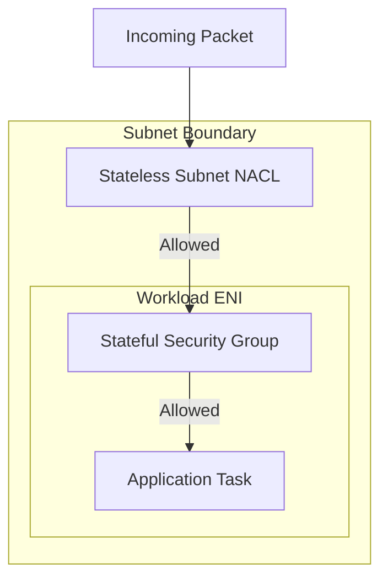
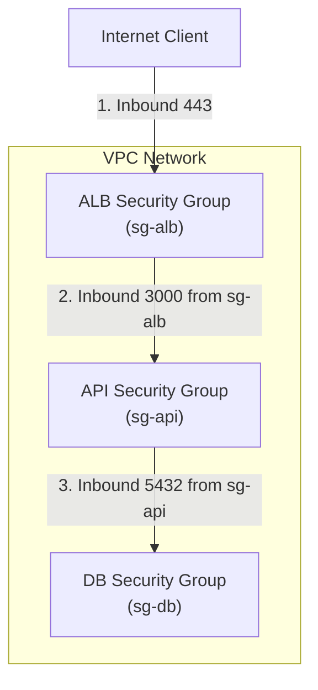
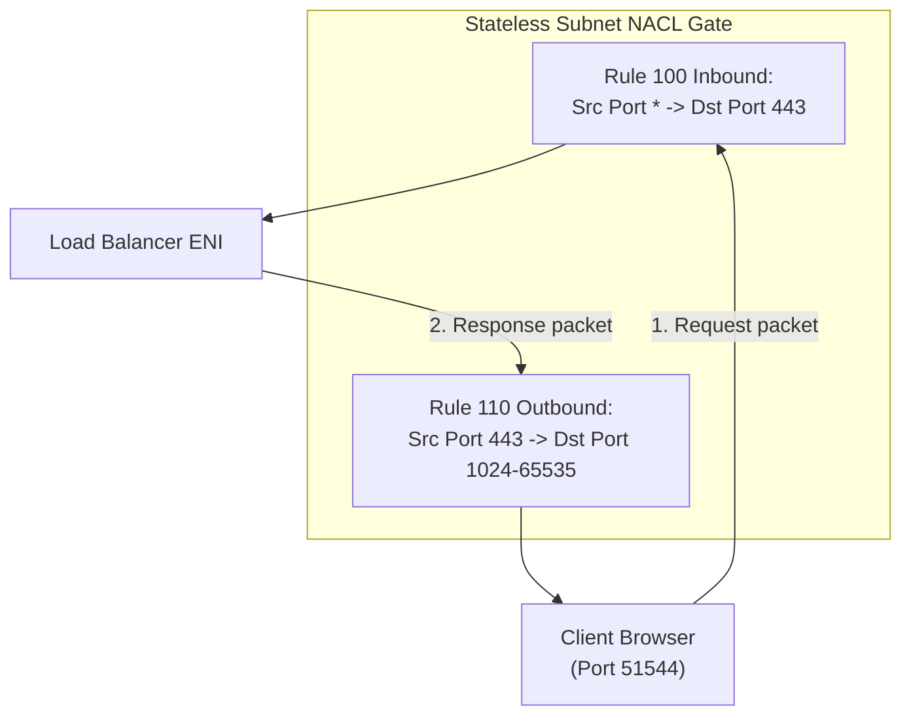

## Table of Contents

1. [Workload Isolation at the Packet Level](#workload-isolation-at-the-packet-level)
2. [Mapping Your Application's Network Conversations](#mapping-your-applications-network-conversations)
3. [Security Groups: Stateful Resource-Level Firewalls](#security-groups-stateful-resource-level-firewalls)
4. [Workload References: Eliminating Brittle IP Lists](#workload-references-eliminating-brittle-ip-lists)
5. [Network ACLs: Stateless Subnet Boundaries](#network-acls-stateless-subnet-boundaries)
6. [The Return Traffic Challenge and Ephemeral Ports](#the-return-traffic-challenge-and-ephemeral-ports)
7. [VPC Flow Logs: Deciphering Network Evidence](#vpc-flow-logs-deciphering-network-evidence)
8. [Choosing the Right Network Control Layer](#choosing-the-right-network-control-layer)
9. [Putting It All Together](#putting-it-all-together)
10. [What's Next](#whats-next)

## Workload Isolation at the Packet Level

Our VPC network topology establishes isolated public entry points, private application workloads, and protected database subnets. Route tables determine where packets *could* travel inside our system. However, topology alone does not dictate whether those packets are actually *permitted* to pass.

When you develop an application on your laptop's localhost, you trust that because PostgreSQL is bound strictly to `127.0.0.1`, only code running on your local machine can connect to it. 

In the cloud, once you deploy that database to a virtual server inside a private subnet, it receives a real private IP address like `10.40.20.30`. Even though the subnet has no direct route to the internet, any other virtual server running within the same broad VPC can attempt to send packets to your database port.

To protect our system, we need double-layered packet gates that enforce a zero-trust architecture at the network layer. 

AWS provides two built-in packet-filtering layers for this job:
* **Security Groups** protect resources at the network interface level, evaluating workload-to-workload relationships.
* **Network Access Control Lists (NACLs)** protect subnets at the boundary level, enforcing broad perimeter guardrails.

The technical anchor is packet filtering at two different scopes. Security Groups are stateful allow lists attached to network interfaces, while NACLs are stateless ordered rule lists attached to subnets.

If both layers are active, a packet must successfully pass through both the subnet NACL and the resource's Security Group to reach its destination.

*Read packet filtering as two rule scopes in series. The subnet NACL checks boundary rules without remembering connections, while the workload security group stays attached to the resource and remembers allowed return traffic.*

## Mapping Your Application's Network Conversations

Before you begin configuring firewall rules in the AWS console, you must clearly outline the specific network conversations your application needs to conduct. Configuring rules port-by-port without a map leads to overly permissive rules that can compromise security.

For a standard application stack, the end-to-end traffic path consists of three distinct, isolated conversations:

* **Browser to Load Balancer**: External clients start public HTTPS connections to the Application Load Balancer (ALB) on port 443.
* **Load Balancer to Application**: ALB nodes forward incoming traffic to the private application servers or container tasks on application port 3000.
* **Application to Database**: Backend application code sends SQL queries to the private database instances on database port 5432.

Designing around these conversations allows you to apply the principle of least privilege. The database subnet does not need to accept packets from the entire VPC; it only needs to accept database traffic from the application servers. 

The application servers do not need to accept connections from arbitrary developer boxes; they only need to accept requests forwarded by the load balancer.

## Security Groups: Stateful Resource-Level Firewalls

A Security Group acts as a virtual firewall attached directly to your resource's Elastic Network Interface (ENI). For virtual servers, serverless containers running on ECS Fargate, database instances, and load balancers, the Security Group is the primary line of defense.

At its core, a Security Group is a stateful allow list for an ENI. It answers which other sources may start traffic to this interface and which destinations this interface may start traffic toward.

Security Groups possess five foundational characteristics that govern their behavior:

* **Attached to Network Interfaces**: Rules follow individual resource interfaces, not subnets or servers.
* **Allow-Only Rules**: You can only add rules that explicitly permit traffic. You cannot create a rule that denies a specific IP address block; traffic is blocked by default unless a rule allows it.
* **All Rules Evaluated Together**: Inbound and outbound rules are aggregated. If any rule matches the packet, the connection is allowed.
* **Fully Stateful Behavior**: If an inbound request is permitted to pass, the return outbound response is automatically allowed, regardless of any outbound rules.
* **Separate Inbound and Outbound Scopes**: Outbound rules determine which external systems a resource is permitted to initiate connections to.

The stateful nature of Security Groups is their most powerful feature. When your application worker initiates an HTTPS call to an external payment API, the response packet returns to a random high-numbered port on your worker. 

Because Security Groups are stateful, the firewall automatically remembers the outbound request and allows the response packet to return safely. You do not need to open high-numbered ports to the entire internet to accept response packets.

Security Groups are still not the only network control around an instance. AWS does not use security groups to filter several built-in VPC services, including AmazonProvidedDNS, DHCP, EC2 instance metadata, ECS task metadata endpoints, the Amazon Time Sync Service, and reserved addresses used by the default VPC router. That detail matters when a beginner tries to "block everything outbound" with one security group. The rule may block ordinary application traffic, but some platform services are handled outside the security group path and need their own controls, such as IAM, instance metadata options, resolver rules, or application configuration.

## Workload References: Eliminating Brittle IP Lists

In early cloud setups, developers often allowed traffic by listing specific IP addresses, such as allowing database traffic from `10.40.10.15` (the current IP of an API worker). 

In modern cloud environments, instances and containers scale up and down dynamically. During a deployment or an auto-scaling event, your API workers are destroyed and replaced, receiving completely new private IP addresses.

Hardcoding IP addresses forces you to rewrite firewall rules constantly, which inevitably leads to configuration drift and outages. AWS solves this problem by allowing Security Groups to reference other Security Groups as a source or destination.

Instead of writing a rule that allows traffic from a specific subnet or IP address, you configure your database's Security Group (`sg-db`) to allow inbound traffic on port 5432 from any interface associated with your application's Security Group (`sg-api`).

Referencing a Security Group does not copy that group's rules. It simply establishes an architectural relationship: "Trust any interface that carries this specific Security Group label." 

As your API tasks scale from two copies to ten, AWS dynamically monitors their Elastic Network Interfaces and automatically allows database packets from their new private IPs without requiring a single manual firewall update.

## Network ACLs: Stateless Subnet Boundaries

A Network Access Control List (NACL) is an optional layer of security that acts as a packet filter at your subnet boundaries. Any packet entering or leaving a subnet must traverse the associated NACL. Every subnet in your VPC must be associated with exactly one NACL at a time, although a single NACL can protect multiple subnets.

A NACL functions as an ordered stateless rule table for a subnet. It evaluates each packet independently and stops at the first matching allow or deny rule.

NACLs differ from Security Groups in three fundamental ways:

* **Stateless Operation**: NACLs are completely stateless. They do not remember connections. If you allow an inbound request to enter a subnet, you must explicitly write an outbound rule allowing the response to exit.
* **Supports Deny Rules**: Unlike Security Groups, NACLs allow you to write explicit `DENY` rules. This makes them highly effective for blocking known malicious IP blocks before they can reach any resource within your subnet.
* **Strict Numerical Evaluation**: NACL rules are numbered. AWS evaluates rules in strict numerical order, starting with the lowest number. As soon as a packet matches a rule, evaluation stops, and the matching action (`ALLOW` or `DENY`) is applied.

All VPCs are created with a default main NACL that is pre-configured to allow all inbound and outbound traffic. This main NACL includes a final catch-all rule, represented as an asterisk (`*`), that denies any packet not matched by an earlier rule.

If you create a custom NACL, it begins with only the catch-all deny rules. If you associate a custom NACL with a subnet before writing any allow rules, all inbound and outbound traffic for that subnet will be blocked instantly, taking your workloads offline.

## The Return Traffic Challenge and Ephemeral Ports

Because NACLs are stateless, they do not track connection state. Every single conversation must be allowed with both an inbound rule and an outbound rule.

When a client browser establishes a connection with your Application Load Balancer, the browser selects a temporary, short-lived port from its own operating system to initiate the request. This temporary port is called an ephemeral port. 

The client's request travels from its ephemeral port (for example, port 51544) to destination port 443 on your ALB.

To allow this conversation through a stateless subnet NACL, you must configure two separate rules:

* **The Inbound Request Rule**: Allows incoming packets from any source (`0.0.0.0/0`) on destination port 443.
* **The Outbound Response Rule**: Allows outgoing packets to return to the client browser on its ephemeral ports. Public-facing NACLs often allow the broad `1024-65535` range because clients, load balancers, NAT gateways, Lambda environments, and operating systems can use different ephemeral ranges. Narrow ranges should be based on the exact traffic source documented for that path.

If you fail to allow this ephemeral return traffic in your outbound rules, the load balancer will receive the client's request but will be blocked from sending the response packet out of the subnet. 

Because managing ephemeral return ranges across dozens of microservices is operationally complex and error-prone, the best practice is to keep your NACLs broad and permissive, relying on stateful Security Groups to handle precise application permissions.

## VPC Flow Logs: Deciphering Network Evidence

When a network connection fails, you must determine whether packets are reaching your workload interfaces and whether AWS packet filters are accepting or rejecting the flow. VPC Flow Logs capture detailed metadata for many IP flows traversing monitored VPC network interfaces.

VPC Flow Logs behave like packet metadata records for monitored VPC interfaces. They do not capture payloads, but they show whether network traffic reached an interface and whether the flow was accepted or rejected.

VPC Flow Logs do not perform deep packet inspection. They do not record HTTP headers, SQL query texts, TLS certificates, or application payloads. They also do not capture every possible VPC traffic type, so use them as strong packet metadata evidence rather than as a complete packet recorder.

Instead, they record flow metadata, including source and destination IP addresses, ports, protocol, packet counts, and the decisive action taken on the flow.

Rather than looking at plain text logs in a monospace block, we can interpret these flows cleanly using a structured metadata layout:

| Field | Meaning | Production Example 1 | Production Example 2 |
| --- | --- | --- | --- |
| **Interface ID** | The Elastic Network Interface being monitored | eni-0123456789abcdef0 | eni-9876543210fedcba0 |
| **Source Address** | The IP address that initiated the packet | 10.40.10.88 (ALB Node) | 203.0.113.5 (External IP) |
| **Destination Address** | The IP address target of the packet | 10.40.20.15 (API Task) | 10.40.10.25 (ALB Node) |
| **Source Port** | The initiator's port (often ephemeral) | 51544 | 60124 |
| **Destination Port** | The service port targeted by the packet | 3000 | 22 (SSH) |
| **Protocol** | The IP protocol code (6 = TCP, 17 = UDP) | 6 | 6 |
| **Packets** | The number of packets sent during the window | 12 | 4 |
| **Bytes** | The total volume of bytes transferred | 8400 | 240 |
| **Action** | The decision made by the AWS packet filters | **ACCEPT** | **REJECT** |
| **Log Status** | The status of the flow log capture | OK | OK |

Reviewing these log fields allows you to gather diagnostic evidence:

* **Correlate with Timestamps**: Line up the log entry window with your application's error log to confirm if traffic was attempting to route.
* **Identify Inbound Blocks**: A `REJECT` action on an inbound connection (as seen in Example 2 where an external client attempts to SSH into the load balancer on port 22) indicates that a Security Group or NACL blocked the packet. Flow Logs show the decision, but they do not always prove which layer caused the rejection without comparing the active rules.
* **Diagnose Ephemeral Return Blocks**: If you see `ACCEPT` on inbound traffic but a corresponding `REJECT` on outbound traffic to high-numbered ports, you are likely facing a stateless NACL configuration error that is blocking return ephemeral packets.

## Choosing the Right Network Control Layer

Securing your VPC is a matter of choosing the correct tool for each specific packet-filtering requirement.

* **Workload-to-Workload Communication (API to DB)**:
  * **Layer**: Stateful Security Group references.
  * **Rationale**: Allows you to define tight, relational permissions that dynamically update as resources scale.
* **Broad Perimeter Defense (Blocking a Bad IP range)**:
  * **Layer**: Stateless subnet NACL deny rules.
  * **Rationale**: Blocks malicious traffic at the subnet boundary, protecting all resources within the subnet before they can process the packet.
* **Gathering Connection Audits**:
  * **Layer**: VPC Flow Logs.
  * **Rationale**: Captures traffic metadata and accept/reject decisions for security compliance and debugging.
* **Diagnosing App Logic Errors (HTTP 500)**:
  * **Layer**: Application logs and system metrics.
  * **Rationale**: The network path existed and permitted the packets; the application simply returned a bad response.

Use Security Groups as your primary, highly granular firewall to govern workload relationships, and apply NACLs sparingly as a secondary, coarse-grained perimeter guardrail.

## Putting It All Together

Revisiting our original orders application deployment, our VPC topology gave our traffic a physical path:

* Customer -> Public Load Balancer -> Private API Task -> Private Database.

Applying packet filters turns this possible path into a tightly controlled network flow:

* **The Load Balancer Security Group**: Allows HTTPS traffic on port 443 from any public client (`0.0.0.0/0`), serving as the public ingress filter.
* **The Application Security Group**: Allows traffic on port 3000 strictly from the load balancer's Security Group, ensuring no one can bypass the entry point.
* **The Database Security Group**: Allows database traffic on port 5432 strictly from the application's Security Group, completely isolating your data store from other VPC workloads.
* **Broad Subnet NACLs**: Protect the boundaries of your subnets, blocking known malicious IP blocks using low-numbered ordered deny rules.
* **VPC Flow Logs**: Monitor all network interfaces, providing clear evidence of accepted and rejected packets to help you debug network issues.

By separating routing from packet permissions, AWS networking transforms from a complex, single-firewall puzzle into a clean system of layered decisions.

## What's Next

We have now designed a secure private network topology and locked down its packet paths using precise filters. However, as your cloud platform grows, your VPC cannot remain the only private network boundary.

Your workloads will eventually need to reach external regional AWS APIs, share databases with sibling VPCs in other accounts, or connect directly to legacy mainframes in your physical offices.

In the next article, we will move beyond the boundaries of a single VPC. We will examine **AWS PrivateLink** interface endpoints, direct **VPC Peering** links, regional **Transit Gateway** routing hubs, and hybrid **VPN/Direct Connect** tunnels. We will also learn how to configure Route 53 Resolver to resolve private DNS names across hybrid networks.

*Use this as the packet-control checklist: map each conversation first, protect resources with security groups, prefer security group references over fixed IPs, use NACLs for subnet guardrails, remember ephemeral return ports, and confirm evidence with flow logs.*

---

**References**

- [Control traffic to your AWS resources using security groups](https://docs.aws.amazon.com/vpc/latest/userguide/vpc-security-groups.html) - Focuses on security group association, resource mapping, default group behaviors, and traffic types that security groups do not filter.
- [Security group rules](https://docs.aws.amazon.com/vpc/latest/userguide/security-group-rules.html) - Details rule structure, allow-only permissions, and security group reference mechanics.
- [Control subnet traffic with network access control lists](https://docs.aws.amazon.com/vpc/latest/userguide/vpc-network-acls.html) - Outlines NACL subnet associations, stateless routing, and ordered rule evaluation.
- [Custom network ACLs for your VPC](https://docs.aws.amazon.com/vpc/latest/userguide/custom-network-acl.html) - Focuses on custom NACL default denies, ephemeral port requirements, and rule numbers.
- [Default network ACL for a VPC](https://docs.aws.amazon.com/vpc/latest/userguide/default-network-acl.html) - Describes pre-configured allow-all rules and asterisks in default NACL configurations.
- [Infrastructure security in Amazon VPC](https://docs.aws.amazon.com/vpc/latest/userguide/infrastructure-security.html) - Details AWS best practices for layering stateful security groups and stateless subnet NACLs.
- [Logging IP traffic using VPC Flow Logs](https://docs.aws.amazon.com/vpc/latest/userguide/flow-logs.html) - Focuses on flow logging scopes, CloudWatch/S3 destinations, and packet filtering audits.
- [Flow log records](https://docs.aws.amazon.com/vpc/latest/userguide/flow-log-records.html) - Details flow log record structures, default and custom fields, and protocol codes.
- [Flow log record examples](https://docs.aws.amazon.com/vpc/latest/userguide/flow-logs-records-examples.html) - Provides realistic walk-throughs of accepted and rejected flow logs.
- [Flow log limitations](https://docs.aws.amazon.com/vpc/latest/userguide/flow-logs-limitations.html) - Outlines traffic types that are not captured, including instance metadata and DNS traffic.
