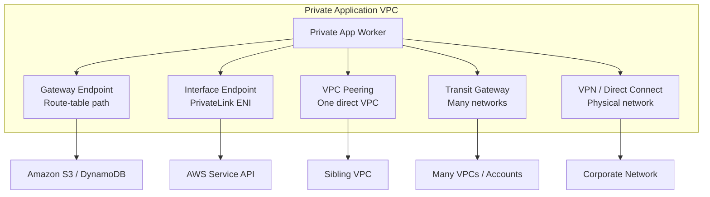
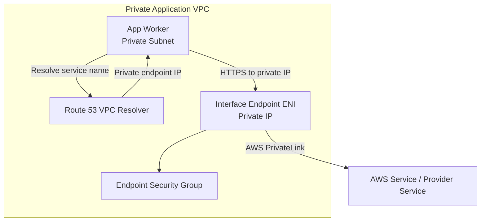
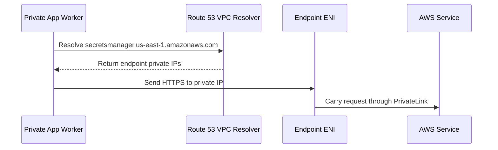
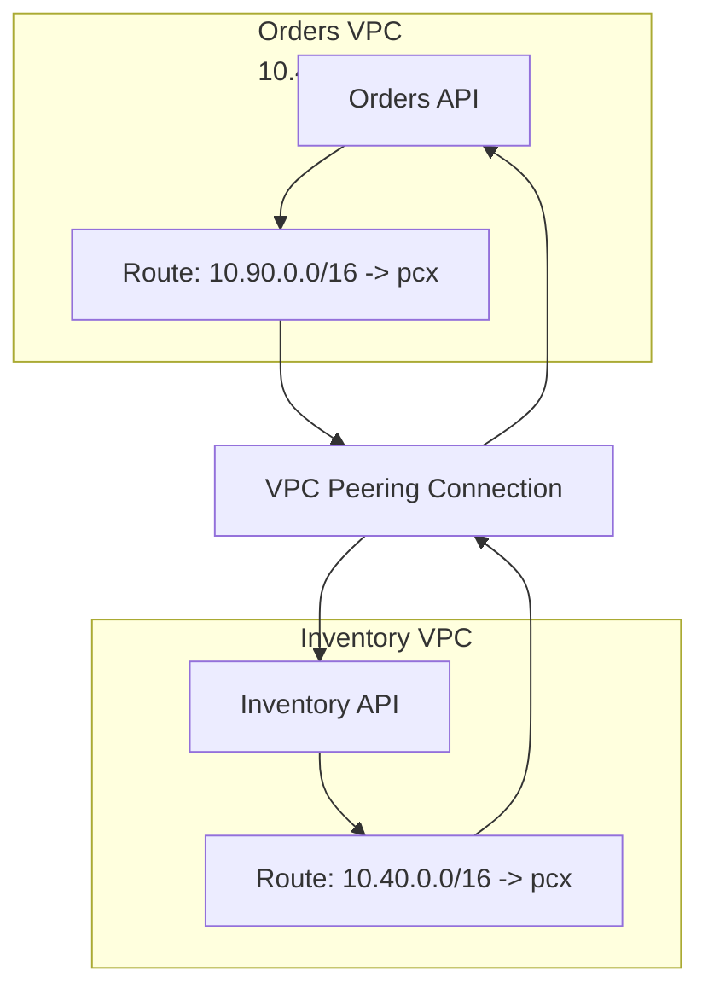
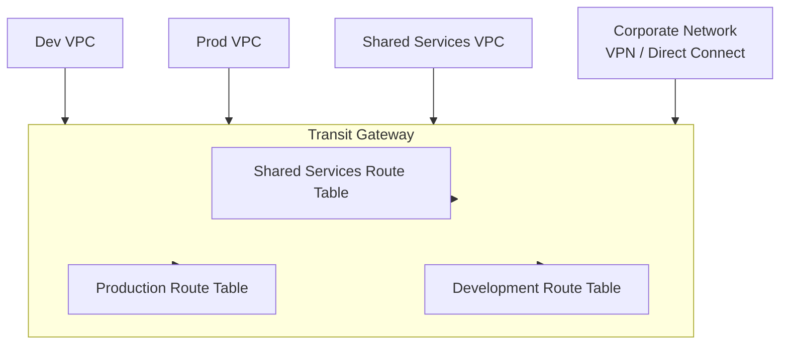
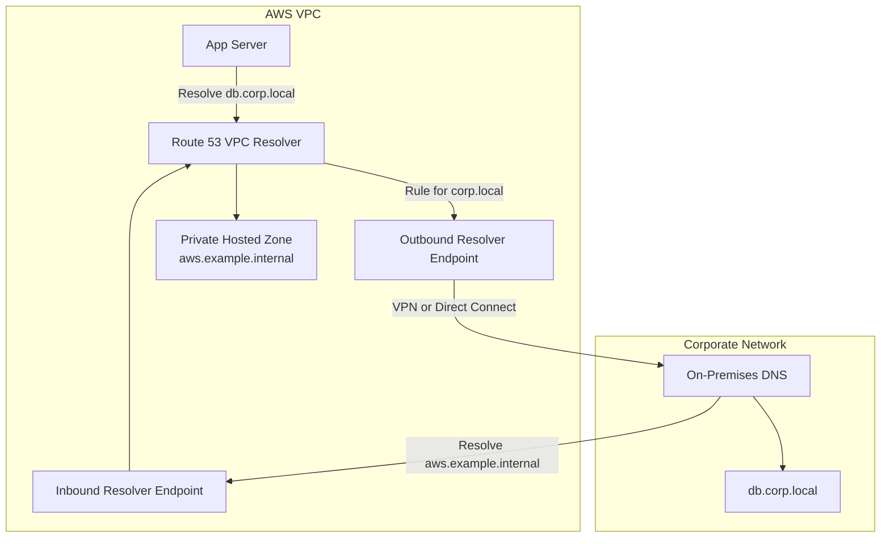

## Table of Contents

1. [When a VPC Needs to Talk](#when-a-vpc-needs-to-talk)
2. [Start With One Request](#start-with-one-request)
3. [Gateway Endpoints for S3 and DynamoDB](#gateway-endpoints-for-s3-and-dynamodb)
4. [Interface Endpoints and AWS PrivateLink](#interface-endpoints-and-aws-privatelink)
5. [Private DNS: Same Name, Private Answer](#private-dns-same-name-private-answer)
6. [VPC Peering for One Direct Relationship](#vpc-peering-for-one-direct-relationship)
7. [Transit Gateway for Many Networks](#transit-gateway-for-many-networks)
8. [VPN and Direct Connect for Hybrid Networking](#vpn-and-direct-connect-for-hybrid-networking)
9. [Route 53 VPC Resolver for Hybrid DNS](#route-53-vpc-resolver-for-hybrid-dns)
10. [Debug the Full Connectivity Path](#debug-the-full-connectivity-path)
11. [Putting It All Together](#putting-it-all-together)
12. [What's Next](#whats-next)

## When a VPC Needs to Talk
<!-- section-summary: A VPC creates a private boundary, but production workloads still need deliberate private paths to AWS services, other VPCs, and physical networks. -->

In the first AWS networking article, we built the private shape of an application. We chose a VPC, planned CIDR blocks, split the address space into subnets, and used route tables to separate public entry points, private application workers, and protected data services.

In the second article, we added packet controls. **Security groups** protected workload network interfaces. **Network ACLs** protected subnet edges. **VPC Flow Logs** gave us evidence when packets were accepted or rejected. At that point, the application had a useful private boundary.

Now the application has to do normal production work. A private ECS task may need to pull an image from Amazon ECR, read a secret from AWS Secrets Manager, write logs to CloudWatch Logs, export reports to Amazon S3, call an inventory API in another VPC, or reach a finance database in a company datacenter. None of those jobs should automatically mean "send everything through the public internet" or "merge every private network together."

**VPC connectivity** is the set of private paths that let workloads reach the right target without flattening the network. The target might be an AWS service, a SaaS service, a shared platform service, another VPC, a Transit Gateway hub, or an on-premises network. Each target needs the right name, route, return path, and policy. That is the big idea for this article: we are not trying to memorize a menu of AWS products, we are learning how to choose the smallest private path that matches the shape of the thing we need to reach.

*Private connectivity starts with the target. Use endpoints for service access, peering for one direct VPC relationship, Transit Gateway for many networks, VPN or Direct Connect for physical networks, and Route 53 VPC Resolver when private names must cross the boundary.*

## Start With One Request
<!-- section-summary: Before choosing a connectivity service, describe the caller, hostname, destination IP, forward route, return route, and policy layers. -->

Before we pick an AWS service, let's follow one request. This is the habit that keeps private networking understandable. Imagine an orders API running in a private subnet. During startup, it needs to read a database password from Secrets Manager. The application code does not begin with a route table. It begins with a hostname: `secretsmanager.us-east-1.amazonaws.com`.

DNS turns that name into an IP address. Then the private subnet route table decides where packets for that IP should go. The target service must be reachable through that path. The response must come back. Security groups, network ACLs, endpoint policies, IAM policies, resource policies, and sometimes corporate firewalls all need to agree that this request is allowed.

So the useful beginner sequence is:

1. **Caller**: Which workload starts the connection?
2. **Name**: What hostname or service endpoint does the application use?
3. **DNS answer**: What IP address does that name return from the caller's environment?
4. **Forward route**: Which route catches that destination IP?
5. **Return route**: Does the other side know how to reply to the caller?
6. **Policy**: Which network and identity controls must allow the request?
7. **Evidence**: Which logs or health checks prove where the path works or stops?

That same sequence works whether the target is S3, another VPC, a SaaS endpoint, or a database in an office network. It also keeps us from treating "private" as one magic switch. A private path is still made of small pieces.

Here is the quick decision table we will keep returning to:

| If the private workload needs to... | Start with... | Why it fits |
| --- | --- | --- |
| Read or write Amazon S3 or DynamoDB from inside a VPC | **Gateway endpoint** | It adds service-specific routes to selected route tables. |
| Call AWS APIs such as Secrets Manager, CloudWatch Logs, ECR, KMS, SQS, or SSM | **Interface endpoint** | The service appears through private endpoint network interfaces in your VPC. |
| Consume a narrow provider service, SaaS service, or shared platform service | **AWS PrivateLink** | The consumer reaches a specific service without opening full network routing. |
| Connect two specific VPCs with different CIDR ranges | **VPC peering** | It gives one direct private routing relationship. |
| Connect many VPCs, accounts, VPNs, and Direct Connect paths | **AWS Transit Gateway** | It gives one regional routing hub with route tables. |
| Connect AWS to an office or datacenter over encrypted internet tunnels | **AWS Site-to-Site VPN** | It creates IPsec tunnels between AWS and your customer gateway device. |
| Connect AWS to an office or datacenter over dedicated capacity | **AWS Direct Connect** | It gives dedicated connectivity into an AWS Direct Connect location. |
| Resolve private DNS names between AWS and another network | **Route 53 VPC Resolver endpoints and rules** | DNS queries can cross the private boundary over VPN or Direct Connect. |

The key is choosing by target shape. If the target behaves like a service, use an endpoint pattern. If the target behaves like another whole network, use a routing relationship. If many networks need a shared routing model, use a hub. If a physical network is involved, design hybrid connectivity and DNS together.

## Gateway Endpoints for S3 and DynamoDB
<!-- section-summary: Gateway endpoints give private subnets route-table paths to S3 and DynamoDB without using a NAT device or internet gateway. -->

A **VPC endpoint** is a private connection from resources in your VPC to a supported service or resource. Instead of making a private workload depend on public-style egress, the endpoint gives the VPC a private access path.

A **gateway endpoint** is the endpoint type for Amazon S3 and Amazon DynamoDB. It works through route tables. You choose the route tables used by your subnets, and AWS adds a route for the service's AWS-managed prefix list. When a packet is going to S3 or DynamoDB in that Region, the more specific endpoint route wins over a broad default route.

Picture a reporting worker in a private subnet. Every night it exports hundreds of gigabytes of files to S3. If the worker sends that traffic through a NAT gateway, the design has two problems. The S3 traffic is mixed with general outbound internet traffic, and NAT processing charges can become expensive for a path that could have stayed on a service endpoint route.

With an S3 gateway endpoint, the route table can look like this:

| Destination | Target | What happens |
| --- | --- | --- |
| `10.40.0.0/16` | `local` | Same-VPC private traffic stays inside the VPC. |
| S3 prefix list | S3 gateway endpoint | S3 traffic uses the endpoint route. |
| `0.0.0.0/0` | NAT gateway | Other outbound IPv4 traffic uses NAT. |

There are three beginner checks that matter.

First, the gateway endpoint must be associated with the route tables used by the caller subnets. Creating the endpoint in the VPC is not enough if the private app subnet route table is not selected.

Second, the workload's packet filters still matter. Security groups and network ACLs must allow the traffic to the service. A gateway endpoint changes the route path; it does not make every packet automatically allowed.

Third, the endpoint policy should match the business intent. A gateway endpoint policy can limit what principals and actions may use that endpoint path for supported services. It does not replace IAM or S3 bucket policies, but it gives you another guardrail. For example, a data-export subnet might be allowed to write only to `arn:aws:s3:::finance-reports-prod/*` through that endpoint.

Gateway endpoints answer a clean question: "How can private subnets reach S3 or DynamoDB without sending that traffic through the general outbound path?"

## Interface Endpoints and AWS PrivateLink
<!-- section-summary: Interface endpoints use AWS PrivateLink to make AWS services and provider services reachable through private endpoint network interfaces. -->

Now change the target. The private app worker needs Secrets Manager, CloudWatch Logs, ECR, Systems Manager, KMS, SQS, or another supported AWS API. These service endpoints normally have public AWS hostnames. A private subnet can often reach them through NAT, but many production teams want normal AWS service calls to stay on private connectivity instead.

This is where **AWS PrivateLink** becomes useful. AWS PrivateLink lets clients in your VPC connect to supported services and resources using private IP addresses, as if those targets were available inside your VPC. The most common beginner shape is the **interface endpoint**.

An **interface endpoint** creates endpoint network interfaces, often called endpoint ENIs, in the subnets you choose. Each endpoint ENI has private IP addresses from your VPC. Your application connects to those private IPs, and AWS carries the request from the endpoint to the service through the PrivateLink connection.

The difference from a gateway endpoint is important. A gateway endpoint is found by a route-table entry for S3 or DynamoDB prefixes. An interface endpoint is usually found by DNS returning private IPs for endpoint ENIs. After DNS gives the private IP, the VPC's normal local routing carries the packet to the endpoint ENI.

When you create an interface endpoint, pay attention to these pieces:

| Piece | What it controls |
| --- | --- |
| **Service name** | Which AWS service, endpoint service, resource, or service network the endpoint reaches. |
| **Subnets** | Where AWS places endpoint ENIs. Production endpoints usually span at least two Availability Zones. |
| **Endpoint security group** | Which callers can connect to the endpoint ENIs. |
| **Endpoint policy** | Which principals and actions may use the endpoint for supported services. |
| **Private DNS** | Whether normal service hostnames resolve to endpoint private IPs inside the VPC. |

An endpoint policy is easy to misunderstand. It does not grant the application permission by itself. If an ECS task role is not allowed to read a secret, adding a Secrets Manager endpoint will not make `secretsmanager:GetSecretValue` succeed. IAM still has to allow the action. The endpoint policy only controls use of that endpoint path.

PrivateLink is also **service-shaped**, not **whole-network-shaped**. The consumer starts a connection to a specific service, resource, or service network. The provider does not get a general route back into the consumer VPC just because an endpoint exists. For AWS service interface endpoints, AWS accepts the connection automatically, and the AWS service cannot start requests into your VPC through that endpoint.

That narrowness is the point. A platform team can expose one internal billing API through a PrivateLink endpoint service without letting every consumer VPC route freely into the provider VPC. Each consumer gets an endpoint in its own VPC. The service becomes reachable, but the networks do not become one big shared private space.

At the beginner stage, keep this picture simple: a private ENI appears in your VPC, DNS points the caller to that ENI, and the request reaches one intended service through AWS PrivateLink.

## Private DNS: Same Name, Private Answer
<!-- section-summary: Private DNS lets normal service hostnames resolve to interface endpoint private IPs inside the VPC, so applications can keep familiar URLs. -->

**DNS** is the system that turns a name into an IP address. That definition sounds basic, but private AWS networking depends on it constantly because application code normally starts with names.

Private DNS for an interface endpoint lets your application keep using the normal AWS service hostname while resources inside the VPC receive private endpoint IP addresses. For example, the code can still call `secretsmanager.us-east-1.amazonaws.com`. When private DNS is enabled for the Secrets Manager interface endpoint, the VPC resolver can answer that normal hostname with the private IPs of the endpoint ENIs.

This is a big operational win. Your production code does not need a special private URL. Your SDK configuration does not need an endpoint override just because the workload runs in private subnets. The same service name can be public from a developer laptop and private from inside the production VPC.

There are still catches, and the first one is simple but easy to miss. The VPC needs DNS resolution and DNS hostnames enabled for this private DNS behavior. Interface endpoints also have service-specific details, so check the service documentation instead of assuming every endpoint behaves identically.

Custom DNS servers need forwarding rules. Many companies point workloads at internal DNS servers. That can work, but those DNS servers must forward the right AWS service names back toward the VPC resolver when you expect PrivateLink private DNS to answer. If a custom DNS server resolves the public AWS name from outside the VPC, the application may skip the interface endpoint and try the NAT path instead.

When you draw a private connectivity design, draw two lines: the DNS line that answers the name, and the packet line that uses the answer. A perfect route table cannot fix a hostname that resolved to the wrong IP.

## VPC Peering for One Direct Relationship
<!-- section-summary: VPC peering connects two non-overlapping VPCs directly, but it is one-to-one, non-transitive, and still needs routes and packet permissions on both sides. -->

Now the target is not an AWS service. The orders application in VPC A needs to call an inventory API in VPC B. Both systems use private IP addresses. The teams do not need a company-wide hub yet. They just need one VPC to reach one other VPC, which is a natural fit for **VPC peering**.

A **VPC peering connection** is a direct private networking relationship between two VPCs. The VPCs can be in the same account or different accounts, and they can be in the same Region or different Regions. Their CIDR blocks cannot overlap.

That address rule is not a small detail. If both VPCs use `10.40.0.0/16`, then `10.40.20.15` no longer points to one clear network. Routing cannot safely decide which VPC owns that destination. AWS blocks peering for overlapping CIDRs because duplicate private address space creates ambiguous routes.

After the peering request is accepted, routes still have to be added manually. VPC A needs a route to VPC B's CIDR through the peering connection. VPC B needs a route back to VPC A's CIDR through the same peering connection. Security groups, network ACLs, host firewalls, and application listeners still need to allow the port.

Peering is useful because it is direct and small. There is no hub to design and no central route-table policy to operate. For one relationship, that simplicity is nice.

The limit is scale. Peering is **not transitive**. If VPC A peers with VPC B, and VPC B peers with VPC C, VPC A still cannot reach VPC C through VPC B. If A needs C, create a direct A-to-C peering connection or choose another architecture.

Peering also does not let one VPC borrow another VPC's edge gateways. A peered VPC cannot use its peer's internet gateway, NAT gateway, VPN connection, Direct Connect connection, or gateway endpoint as a shared shortcut.

With two or three VPCs, peering can stay readable. With ten VPCs, a full mesh means 45 peering relationships, route updates on both sides, security review on both sides, and DNS choices for every relationship. At that point the relationships become the system you are operating. That is when a routing hub starts to earn its place.

## Transit Gateway for Many Networks
<!-- section-summary: Transit Gateway is a regional layer-3 router for many VPC, VPN, and Direct Connect attachments, with route tables controlling which attachments can reach each other. -->

**AWS Transit Gateway** is a managed regional router for many networks. VPCs attach to it. Site-to-Site VPN connections attach to it. Direct Connect gateways can connect to it. Transit Gateway route tables decide which attachment receives packets after they arrive at the hub.

The key phrase is **many networks**. Transit Gateway is not just "peering, but bigger sounding." It is useful when you have a hub-and-spoke or many-to-many routing problem.

Imagine a platform team that manages separate development, production, shared services, and inspection VPCs across several AWS accounts. Development needs access to shared CI/CD systems. Production needs access to shared logging and identity services. Development should not directly browse production. Some VPCs need routes to a corporate network. Some should never see those routes. Transit Gateway gives the platform team one regional place to model those routing relationships.

Transit Gateway routing has two route-table layers.

The **VPC subnet route table** decides whether a packet leaves the VPC toward Transit Gateway. If the private subnet has no route for the destination CIDR pointing to the Transit Gateway, the packet never reaches the hub.

The **Transit Gateway route table** decides which attachment receives the packet after it reaches the hub. If the source attachment is associated with a route table that has no route to the target attachment, the packet stops at Transit Gateway.

Transit Gateway uses **associations** and **propagations**. An association connects an attachment to the route table that will decide traffic arriving from that attachment. A propagation lets an attachment advertise its routes into one or more Transit Gateway route tables. You can also add static routes and blackhole routes when you need explicit behavior.

That sounds abstract, so use a production example. Development VPCs may be associated with a route table that contains shared-services routes, but no production routes. Production VPCs may be associated with another route table that contains shared-services routes and a corporate identity route, but no development routes. The networks are attached to one hub, but the route tables decide who can see whom.

Transit Gateway is regional. A transit gateway exists in one AWS Region, so multi-region designs need explicit planning, such as Transit Gateway peering or another architecture. When you attach a VPC, you also choose subnets in Availability Zones. Those attachment subnets matter because resources in an Availability Zone need an enabled Transit Gateway attachment path for that zone.

Use Transit Gateway when you have many VPCs, many accounts, shared services VPCs, centralized inspection, hybrid routes used by several VPCs, or a platform network team that owns routing separately from app teams. Stay with peering when you truly have one small direct relationship and a hub would add more moving parts than value.

## VPN and Direct Connect for Hybrid Networking
<!-- section-summary: Site-to-Site VPN gives encrypted internet-based tunnels into AWS, while Direct Connect gives dedicated private capacity that still needs an encryption and resilience plan. -->

So far, our targets have lived inside AWS. Many real systems do not. A company may still run identity services in an office network, warehouse systems in a datacenter, or reporting databases in a private corporate environment. AWS workloads may need to reach those systems over private IP addresses.

**Hybrid networking** means AWS and another private network have a planned path between them. The two major AWS building blocks are **AWS Site-to-Site VPN** and **AWS Direct Connect**, and they solve different versions of the same problem.

**AWS Site-to-Site VPN** creates encrypted IPsec tunnels over the public internet between AWS and a customer gateway device. A customer gateway device is the router, firewall, or VPN appliance on your side of the connection. On the AWS side, the VPN can connect to a virtual private gateway for a single-VPC pattern, or to Transit Gateway for a hub pattern.

VPN is often the fastest first private path because it is mostly configuration on both sides. It can be a first step while the company waits for dedicated connectivity, or it can be a backup path for Direct Connect. Standard Site-to-Site VPN tunnels support up to 1.25 Gbps per tunnel, and AWS also supports larger bandwidth tunnel options for supported Transit Gateway or Cloud WAN patterns.

**AWS Direct Connect** gives dedicated network connectivity from your environment to an AWS Direct Connect location. Dedicated Direct Connect connections are available at speeds such as 1 Gbps, 10 Gbps, 100 Gbps, and 400 Gbps. Hosted connections from partners support a broader range of sizes.

Direct Connect can make performance more predictable than internet-based VPN, but a dedicated path is not automatically an encrypted path. AWS Direct Connect does not encrypt traffic in transit by default. If the data needs encryption over that circuit, design it with service-level encryption, VPN over Direct Connect, MACsec where supported, or another approved encryption pattern.

Direct Connect uses **virtual interfaces**, often shortened to VIFs:

| Virtual interface | What it reaches |
| --- | --- |
| **Private VIF** | Private IP connectivity to a VPC through a virtual private gateway or Direct Connect gateway. |
| **Transit VIF** | Transit Gateway connectivity through a Direct Connect gateway. |
| **Public VIF** | AWS public service endpoints over the Direct Connect path. |

No matter which transport you choose, the same request story still applies. AWS CIDRs and on-premises CIDRs should not overlap. AWS route tables need routes toward on-premises prefixes. On-premises routers need routes back to AWS prefixes. Firewalls on both sides need to allow the ports. DNS needs a plan. Operations teams need ownership for BGP sessions, tunnel health, devices, circuits, and firewall rules.

The packet does not care that one team owns AWS and another team owns the datacenter. It needs one working path in both directions.

## Route 53 VPC Resolver for Hybrid DNS
<!-- section-summary: Route 53 VPC Resolver endpoints and forwarding rules let VPCs and other networks resolve each other's private DNS names over VPN or Direct Connect. -->

Routes move packets, but DNS decides which packets the application tries to send. Suppose the VPN is up, BGP looks healthy, firewalls allow the database port, and the application still fails because it cannot resolve `db.corp.local`. The packet path may be ready, but the name path is not ready. The application cannot route to an IP address it never receives.

Every VPC has **Route 53 VPC Resolver** available by default. It answers DNS queries for local VPC names, private hosted zones associated with the VPC, and public recursive lookups. For hybrid DNS, **Resolver endpoints** and **forwarding rules** bridge between AWS DNS and another DNS system.

An **outbound Resolver endpoint** lets DNS queries leave the VPC resolver path and go to another DNS system. For example, a rule can say, "For `corp.local`, forward queries to these corporate DNS server IPs." The query then travels over VPN or Direct Connect to the on-premises DNS servers.

An **inbound Resolver endpoint** lets another network send DNS queries into the VPC resolver path. Corporate DNS can forward `aws.example.internal` queries to inbound endpoint IPs in the VPC, and the VPC resolver can answer from a private hosted zone.

Resolver rules should be specific. A clean design usually looks like this:

| Domain | DNS path |
| --- | --- |
| `corp.local` | VPC outbound endpoint forwards to corporate DNS. |
| `aws.example.internal` | Corporate DNS forwards to VPC inbound endpoint. |
| Public domains | Normal recursive DNS path. |

This is also where **split-horizon DNS** appears. Split-horizon DNS means the same name can resolve differently depending on where the query comes from. Internal callers might receive private IPs, while external callers receive public IPs. That can be useful, but it becomes confusing if nobody records which answer each caller is supposed to get.

When private names cross a boundary, design DNS next to routing. If the application starts with a name, the connectivity design starts with a name too.

## Debug the Full Connectivity Path
<!-- section-summary: Most private connectivity failures come from wrong DNS answers, missing forward routes, missing return routes, policy blocks, overlapping CIDRs, or weak evidence. -->

When private connectivity fails, the application often says something vague, like `connection timed out`. That error does not tell you whether DNS was wrong, the route was missing, the return path was broken, or a policy blocked the packet. Instead of opening random security group rules, walk the path in order.

First, **resolve the name from the caller's environment**. For an interface endpoint with private DNS, the answer should be endpoint private IPs. For a corporate database name, the answer should come through the intended Resolver forwarding path. If the IP is wrong, fix DNS before touching routes.

Second, **match the forward route**. Take the destination IP and find the route table entry that catches it. The packet might use the VPC local route, a gateway endpoint route, a peering connection, Transit Gateway, a virtual private gateway, Direct Connect, NAT, or no route at all. Remember that more specific routes win over broader routes.

Third, **prove the return route**. The target network has to know how to reach the source. In peering, both VPCs need routes. In hybrid networking, the on-premises side needs a route back to the AWS CIDR. In Transit Gateway, the return attachment needs the right association and route. One-way routing usually feels like a timeout.

Fourth, **check every policy layer**. Routes say where packets can go. They do not mean the request is allowed. Look at security groups, network ACLs, endpoint security groups, endpoint policies, IAM permissions, resource policies, Transit Gateway route tables, inspection appliances, and on-premises firewalls.

Fifth, **check address overlap**. If two connected networks use the same CIDR, routing becomes ambiguous. VPC peering blocks this up front, but transit and hybrid designs can still become confusing when teams reuse address ranges or summarize routes too broadly.

Sixth, **collect evidence**. Use VPC Flow Logs when you need packet metadata inside AWS. Use Reachability Analyzer when you want AWS to reason through supported VPC paths. For hybrid paths, collect VPN tunnel state, BGP neighbor state, router logs, firewall logs, Direct Connect metrics, DNS query logs, and application logs. The goal is not to collect every possible log. The goal is to prove where the path stops.

Here is the same loop as a compact checklist:

| Question | Good sign | Bad sign |
| --- | --- | --- |
| What IP did DNS return? | It matches the intended private path. | The app resolves a public IP or unrelated private range. |
| Which route catches that IP? | The subnet route table points to the intended endpoint, peering link, Transit Gateway, VPN, or Direct Connect path. | Traffic falls through to NAT, internet, or no matching route. |
| Can the target reply? | Return routes exist back to the source CIDR. | One-way routing creates timeouts. |
| Which policy allows the flow? | Security groups, NACLs, endpoint policies, IAM, and firewalls all agree. | One layer blocks the request. |
| Do CIDRs overlap? | Connected networks have unique address space. | Duplicate ranges make routing impossible or ambiguous. |
| What evidence proves the stop point? | Flow logs, DNS logs, BGP state, metrics, or app logs point to one layer. | The team is guessing and changing controls at random. |

The debugging habit is always the same: name, destination IP, forward route, return route, policy, evidence. If you can say those pieces out loud, the incident stops being a foggy "network issue" and becomes a specific layer you can inspect.

## Putting It All Together
<!-- section-summary: The practical VPC connectivity model maps each target shape to the smallest private path that provides correct DNS, routes, return routes, policy, and evidence. -->

VPC connectivity is not one feature. It is a set of private paths, and each path fits a different target shape. If your private workload needs S3 or DynamoDB, start with gateway endpoints. They are route-table paths for supported service prefixes, and they keep that traffic away from general NAT egress.

If your private workload needs AWS APIs or narrow provider services, use PrivateLink endpoint patterns. For the common interface endpoint case, private DNS lets the application keep the normal service hostname while traffic reaches endpoint ENIs inside the VPC.

If one VPC needs to reach one other VPC, and the CIDRs do not overlap, VPC peering is the simple direct relationship. Keep routes symmetrical and remember that peering is not transitive.

If many VPCs, accounts, shared services, inspection paths, VPNs, and Direct Connect paths need one routing model, use Transit Gateway. Treat Transit Gateway route tables like serious infrastructure because they decide which networks can see each other.

If AWS needs to reach physical networks, choose the hybrid transport deliberately. Site-to-Site VPN gives encrypted internet-based tunnels. Direct Connect gives dedicated capacity and belongs with a clear encryption and resilience plan.

If private names cross the boundary, design Route 53 VPC Resolver endpoints and forwarding rules with the same care as route tables. DNS is not a side task in connectivity. It is often the first thing the application depends on.

The final decision model is:

1. Describe the caller and target.
2. Choose the smallest connectivity tool that matches the target shape.
3. Make DNS return the intended destination IP.
4. Make the forward route explicit.
5. Make the return route explicit.
6. Allow the flow with the narrowest practical policies.
7. Collect evidence so you can prove where the path works or stops.
8. Add redundancy where the business depends on the path.

A private network is not private because it never connects to anything. It is private because every connection is deliberate, named, routed, allowed, and observable.

*Use this as the connectivity checklist: keep service access private with endpoints, make DNS resolve to the intended private path, avoid peering sprawl, centralize large networks with Transit Gateway, choose VPN or Direct Connect deliberately, and bridge private names with Route 53 VPC Resolver.*

## What's Next
<!-- section-summary: Practice VPC connectivity by tracing DNS, routes, return paths, and policies before changing infrastructure. -->

The practical next step is to trace real paths. Pick one private workload and one target. Write down the hostname, the IP it resolves to, the subnet route table, the return route, the security group rules, the endpoint or IAM policy, and the evidence you would use during an incident.

For example, trace how an ECS task reaches CloudWatch Logs through an interface endpoint. Then trace how the same task reaches S3 through a gateway endpoint. Then trace how an app VPC reaches a shared internal API through peering or Transit Gateway. The goal is not to memorize every AWS console screen. The goal is to get comfortable proving a path before changing it.

Once you can do that, AWS networking starts to feel less like a maze of product names and more like one request moving through names, routes, permissions, and logs.

---

**References**

- [Gateway endpoints](https://docs.aws.amazon.com/vpc/latest/privatelink/gateway-endpoints.html) - Explains gateway endpoints for Amazon S3 and DynamoDB, route-table integration, endpoint policies, and gateway endpoint pricing.
- [AWS PrivateLink concepts](https://docs.aws.amazon.com/vpc/latest/privatelink/concepts.html) - Defines endpoint services, resources, VPC endpoint types, endpoint network interfaces, endpoint policies, and PrivateLink connection behavior.
- [Access AWS services through AWS PrivateLink](https://docs.aws.amazon.com/vpc/latest/privatelink/privatelink-access-aws-services.html) - Documents interface endpoint DNS behavior, private DNS, endpoint ENI placement, automatic AWS service acceptance, and multi-AZ recommendations.
- [How VPC peering connections work](https://docs.aws.amazon.com/vpc/latest/peering/vpc-peering-basics.html) - Covers one-to-one peering, non-overlapping CIDR requirements, route table requirements, security group updates, and peering behavior.
- [How AWS Transit Gateway works](https://docs.aws.amazon.com/vpc/latest/tgw/how-transit-gateways-work.html) - Describes Transit Gateway as a regional virtual router, plus attachments, route tables, associations, propagation, and VPC route requirements.
- [AWS Site-to-Site VPN quotas](https://docs.aws.amazon.com/vpn/latest/s2svpn/vpn-limits.html) - Lists standard and large bandwidth tunnel limits, route limits, MTU notes, and VPN resource quotas.
- [Direct Connect connection options](https://docs.aws.amazon.com/directconnect/latest/UserGuide/connection_options.html) - Documents dedicated and hosted Direct Connect connection sizes, partner options, and connection prerequisites.
- [Direct Connect virtual interfaces](https://docs.aws.amazon.com/directconnect/latest/UserGuide/WorkingWithVirtualInterfaces.html) - Defines private, public, and transit virtual interfaces.
- [Encryption in AWS Direct Connect](https://docs.aws.amazon.com/directconnect/latest/UserGuide/encryption-in-transit.html) - Explains that Direct Connect traffic is not encrypted by default and outlines VPN over Direct Connect and MACsec options.
- [What is Route 53 VPC Resolver?](https://docs.aws.amazon.com/Route53/latest/DeveloperGuide/resolver.html) - Explains VPC resolver behavior, inbound endpoints, outbound endpoints, conditional forwarding rules, and hybrid DNS over VPN or Direct Connect.
