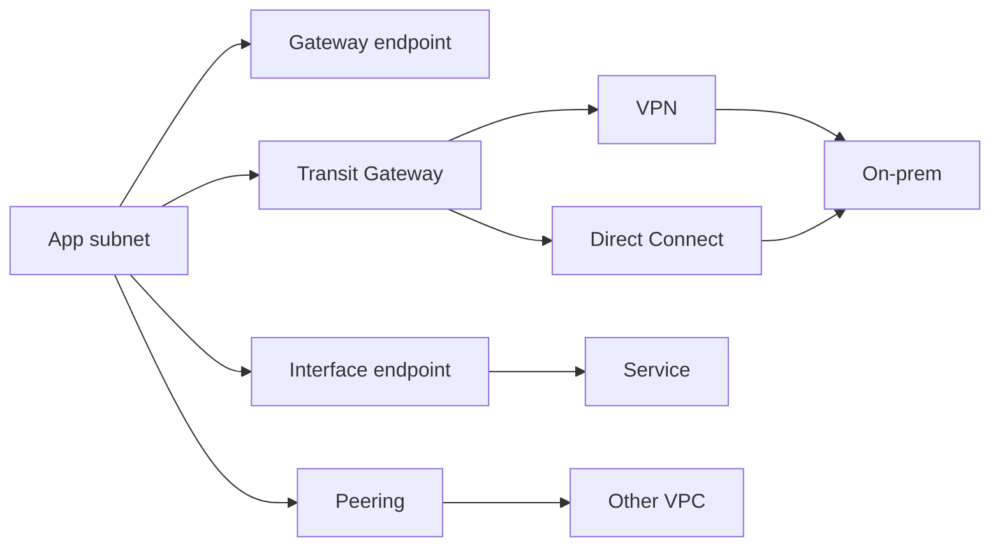
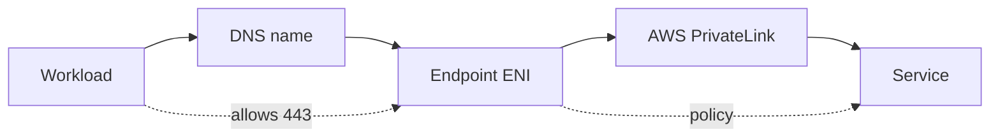
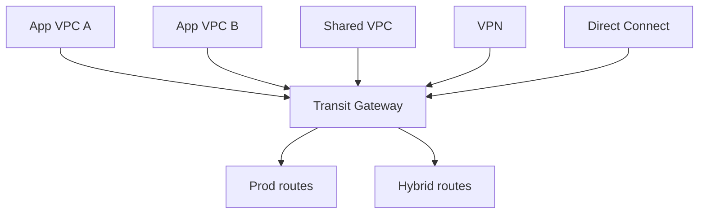
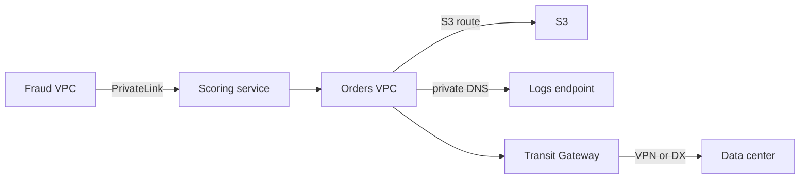

## Table of Contents

1. [Beyond One VPC](#beyond-one-vpc)
2. [Connectivity Jobs](#connectivity-jobs)
3. [Gateway Endpoints](#gateway-endpoints)
4. [Interface Endpoints](#interface-endpoints)
5. [VPC Peering](#vpc-peering)
6. [Transit Gateway](#transit-gateway)
7. [VPN and Direct Connect](#vpn-and-direct-connect)
8. [CIDR, Routes, DNS](#cidr-routes-dns)
9. [Sample Design](#sample-design)
10. [Putting It All Together](#putting-it-all-together)

## Beyond One VPC

The previous articles built the inside of one AWS network.
You placed workloads in public, private, and data subnets.
You learned that routes decide the next hop and that security groups and network ACLs decide whether the packet is allowed through.

That is enough for a simple service.
It is not enough for a real platform.

Soon the private API needs to write objects to S3 without sending traffic through a NAT gateway.
A deployment runner needs to call AWS APIs from a subnet with no internet route.
A payments service in another account needs to call one private endpoint without joining the whole VPC.
The analytics VPC needs a controlled path to the application VPC.
The office network still hosts a licensing server, a directory, or a database that the cloud workloads must reach.

These are all "connectivity" problems, but they are not the same problem.
The first skill is to stop asking, "Which AWS networking service should I use?" and ask a smaller question:

> What exactly needs to talk to what, and should the destination look like a service, a VPC, a network hub, or a remote site?

This article follows that question.
The goal is not to memorize every AWS networking product.
The goal is to recognize the job in front of you, choose the smallest private path that fits it, and know which hidden details usually break it: overlapping CIDR ranges, missing routes, route propagation, and DNS names that resolve to the wrong place.

## Connectivity Jobs

Private connectivity in AWS becomes much easier when each option has a job.
Some choices connect a workload to an AWS service.
Some connect two VPCs.
Some create a shared hub for many VPCs and accounts.
Some extend the map to an on-premises network.

The names are similar enough to feel like a menu.
Treat them as different tools instead:

| Job | Usual AWS choice | What the source sees | Best fit | Main thing to watch |
| --- | --- | --- | --- | --- |
| Reach S3 or DynamoDB privately from a VPC | Gateway VPC endpoint | The normal S3 or DynamoDB service endpoint, reached through a route table entry | Private subnet access to S3 or DynamoDB without NAT | The endpoint only affects route tables you associate with it, and it is regional |
| Reach AWS APIs, SaaS, marketplace services, or a private service through private IPs | Interface VPC endpoint with AWS PrivateLink | A private IP on an endpoint network interface in your subnet | Calling service endpoints from private subnets, or publishing one service without broad network access | DNS and endpoint security groups decide whether clients actually use the endpoint |
| Connect two known VPCs directly | VPC peering | Private IP routes between the two VPC CIDR ranges | Simple one-to-one VPC connectivity | CIDR ranges cannot overlap, and peering is not transitive |
| Connect many VPCs, accounts, VPNs, or Direct Connect links | AWS Transit Gateway | A hub attachment and transit gateway route tables | Hub-and-spoke networks at organization scale | Route table association and propagation are separate decisions |
| Connect AWS to an on-premises site over the internet | AWS Site-to-Site VPN | Encrypted IPsec tunnels | Fast hybrid setup, backup path, or moderate traffic | Tunnel redundancy, customer gateway routing, and on-prem firewall rules |
| Connect AWS to an on-premises site over a dedicated private link | AWS Direct Connect | A physical connection plus virtual interfaces | Predictable bandwidth, lower variance, long-lived hybrid network | It still needs routing, redundancy design, and often VPN or Transit Gateway beside it |

That table is the article in miniature.
The rest of the article explains why those choices behave differently.

Here is the high-level map:

Notice that only one part of this picture is about public entry points.
A public domain, an Application Load Balancer, and TLS certificate decide how users enter from the internet.
They matter for the front door of a public service.
This article is mostly about the private paths behind and beside that front door: service access, VPC-to-VPC access, account-to-account access, and hybrid access.

## Gateway Endpoints

A gateway endpoint is the simplest private service path in this article.
It is only for S3 and DynamoDB, but that narrowness is part of why it is useful.

Imagine an application in a private subnet that writes invoices to S3.
Without an endpoint, the instance, task, or Lambda function still needs a way to reach the S3 service endpoint.
If the subnet has no internet route, the usual answer is a NAT gateway in a public subnet.
That works, but it means service traffic leaves the private subnet through the NAT path.

A gateway endpoint changes the route table.
You associate the endpoint with selected subnet route tables.
AWS adds a route whose destination is the AWS-managed prefix list for S3 or DynamoDB and whose target is the gateway endpoint.
Traffic to that service in the same Region follows the endpoint route instead of the default internet or NAT path because the route is more specific.

The route table idea is the important part:

| Route table entry | Destination | Target | Meaning |
| --- | --- | --- | --- |
| Local VPC route | `10.0.0.0/16` | `local` | Talk inside the VPC |
| Default outbound route | `0.0.0.0/0` | `nat-...` | Send ordinary internet-bound traffic through NAT |
| Endpoint route | S3 prefix list | `vpce-...` | Send regional S3 traffic through the gateway endpoint |

The endpoint route does not make S3 part of your subnet.
Your workload still calls S3 as a service.
The route table simply gives S3 traffic a private AWS-managed path that does not require an internet gateway or NAT device for that destination.

The main beginner mistake is expecting the endpoint to help every subnet automatically.
It only affects the route tables associated with it.
If one private subnet route table is associated and another is not, the same application can behave differently depending on placement.

Another subtle point is that security controls still matter.
The workload's security group needs outbound HTTPS to the service prefix list.
Network ACLs must allow the traffic too.
Endpoint policies and IAM policies can further restrict which buckets, tables, actions, or principals are allowed.

Use a gateway endpoint when the job is:

| Question | Gateway endpoint answer |
| --- | --- |
| Is the destination S3 or DynamoDB? | Yes, this is the first option to consider |
| Do private subnets need access without NAT? | Yes |
| Do on-premises networks or peered VPCs need to use this endpoint through your VPC? | No, use a different pattern |
| Do you need a private IP endpoint in a subnet? | No, that is an interface endpoint job |

Gateway endpoints are boring in the best way.
They say, "For this service prefix, use this route."
That is exactly the right shape for high-volume, common access from a VPC to S3 or DynamoDB.

## Interface Endpoints

Interface endpoints solve a different problem.
They put endpoint network interfaces into your subnets.
Those network interfaces get private IP addresses from your subnet ranges, and clients in the VPC send traffic to those private IPs.

That is why interface endpoints feel more like a private service door.
They can connect to many AWS services, supported SaaS and marketplace services, and endpoint services published from another AWS account.
The technology behind this is AWS PrivateLink.

The most common beginner use case is AWS API access from private subnets.
For example, a private deployment runner needs to call CloudWatch Logs, Secrets Manager, ECR, or Systems Manager.
You could give it a NAT path.
Or you can create interface endpoints for the specific APIs it needs and keep that traffic on private connectivity.

DNS is the hinge.
When private DNS is enabled for an AWS service endpoint, existing code can keep calling the normal regional service name.
Inside the VPC, that name resolves to the private IP addresses of the endpoint network interfaces.
The application does not need to know about the generated `vpce` DNS name.

That convenience creates one of the most common hidden failures.
If VPC DNS support is disabled, if private DNS is not enabled on the endpoint, or if a custom DNS setup bypasses Route 53 Resolver, the client may still resolve the public service endpoint.
The route and security group can look perfect while traffic never uses the interface endpoint.

Interface endpoints also have security groups.
That is different from gateway endpoints.
The endpoint network interface must allow inbound traffic from the client source, often HTTPS on port 443.
If the endpoint security group is too narrow, DNS may resolve to the right private IP and the connection still times out.

PrivateLink is also useful when a service provider wants to expose one service without giving consumers broad network access.
The provider can publish an endpoint service, commonly behind a Network Load Balancer.
The consumer creates an interface endpoint in their own VPC.
The consumer sees private IPs in their VPC; the provider controls acceptance, service reachability, and which principals may connect.

Use an interface endpoint when the job is:

| Question | Interface endpoint answer |
| --- | --- |
| Is the destination an AWS API other than the simple S3 or DynamoDB gateway path? | Usually yes, if the service supports PrivateLink |
| Does the client need to use private IPs inside its own VPC? | Yes |
| Should a SaaS, marketplace, or private service be reachable without VPC peering? | Yes |
| Do clients need full network reachability to every resource in the provider VPC? | No, that is exactly what PrivateLink avoids |
| Is DNS part of the design? | Always |

The tradeoff is operational count.
One endpoint per service, per VPC, across selected Availability Zones can become a real inventory.
That is still often better than a broad network bridge when the client only needs a few service APIs.

## VPC Peering

VPC peering is a direct private connection between two VPCs.
It is good when the relationship is simple: VPC A needs to talk to VPC B, both CIDR ranges are known, and neither side needs to become a network hub.

After the peering connection is active, routes do the work.
The route table in VPC A needs a route to VPC B's CIDR through the peering connection.
The route table in VPC B needs the matching return route to VPC A's CIDR.
Security groups and network ACLs still decide which packets are allowed.

Peering is attractive because it has a small mental model.
It does not require a central router.
It does not require attaching every VPC to a shared hub.
For two VPCs owned by the same team or two teams with a clear relationship, that simplicity is valuable.

The constraints are just as important as the feature.
VPCs with overlapping CIDR blocks cannot be peered.
Peering is not transitive.
If VPC A peers with VPC B, and VPC B peers with VPC C, VPC A does not automatically reach VPC C through VPC B.
VPC B also cannot lend VPC A its internet gateway, NAT gateway, gateway endpoint, VPN, or Direct Connect path.

That means peering does not scale well as a mesh.
Three VPCs can be manageable.
Ten VPCs can turn into a route table and ownership problem.
Fifty VPCs across accounts usually needs a hub pattern.

| Design question | Peering is a good answer when... | Peering is a poor answer when... |
| --- | --- | --- |
| How many networks? | Two VPCs need a direct relationship | Many VPCs need shared routing |
| Are CIDRs clean? | Ranges do not overlap and are planned | Ranges overlap or were assigned casually |
| Is a hub needed? | No | Yes |
| Is the destination a single service? | Maybe, but PrivateLink may be narrower | The provider wants to expose only one endpoint |
| Will routes stay understandable? | Yes, a few explicit routes are enough | Route tables become a mesh |

Peering is a good pattern when both sides really should be network neighbors.
If the requirement is only "call this one service," PrivateLink is usually a cleaner boundary.

## Transit Gateway

Transit Gateway is the hub-and-spoke version of AWS connectivity.
Instead of building a mesh of peering links, VPCs, VPNs, and Direct Connect gateways attach to a central transit gateway.
Traffic moves through the hub according to transit gateway route tables.

That phrase "route tables" matters.
Transit Gateway is not magic shared reachability.
Each attachment is associated with one transit gateway route table.
Attachments can propagate their routes into one or more route tables.
Static routes can be added too.
The design is a routing policy, not just a diagram with a hub in the middle.

A common organization pattern is to place Transit Gateway in a network account and attach VPCs from application accounts.
That lets a platform team own the shared routing shape while application teams keep their own VPCs.

The non-obvious truth is that "attached" does not always mean "reachable."
A VPC attachment must have the right subnet route table entries pointing traffic toward the transit gateway.
The transit gateway route table must know where the destination lives.
The destination VPC route table must send the return traffic back.
Security groups and network ACLs must allow the flow.

Route propagation can reduce manual route work, especially when many VPC CIDRs or on-premises routes are involved.
But propagation is not a substitute for design.
If every attachment propagates everywhere, the hub becomes a flat network.
If nothing propagates, traffic quietly has no path.
Good Transit Gateway design decides which route table each attachment uses and which routes it is allowed to learn.

Use Transit Gateway when the job is:

| Requirement | Why Transit Gateway fits |
| --- | --- |
| Many VPCs need controlled connectivity | Attachments avoid a full peering mesh |
| Multiple accounts need a shared network pattern | A network account can own the hub |
| On-premises routes need to reach several VPCs | VPN or Direct Connect can connect through the hub |
| Inspection or shared services need central placement | Route tables can steer selected traffic through shared services |
| Some networks must stay isolated | Separate route tables can keep attachments apart |

Transit Gateway introduces cost and another control plane.
For two VPCs, it may be more than you need.
For an organization with many VPCs, it is often the first pattern that stays understandable.

## VPN and Direct Connect

Hybrid networking means AWS and a non-AWS network need to exchange private traffic.
That non-AWS network might be an office, data center, manufacturing site, partner network, or colocation environment.

AWS Site-to-Site VPN gives you encrypted tunnels over the internet.
Each VPN connection includes two tunnels for high availability.
On your side, a customer gateway device or software appliance terminates the tunnels.
On the AWS side, the VPN attaches to a virtual private gateway, Transit Gateway, or another supported target.

VPN is often the fastest way to start hybrid connectivity because it uses existing internet paths.
It is also a common backup path even when Direct Connect exists.
The tradeoff is that internet path quality can vary, and the customer gateway configuration matters.
Routing, tunnel health, firewall rules, and BGP behavior become part of your AWS design even though half of the system lives outside AWS.

Direct Connect solves a different problem.
It links your network to an AWS Direct Connect location over a dedicated network connection.
You then create virtual interfaces to reach public AWS services, a VPC, or Transit Gateway.
The value is more predictable private connectivity and often better throughput characteristics than an internet VPN path.

Direct Connect is not a magic cable into every subnet.
It still needs virtual interfaces, BGP, route advertisements, VPC or Transit Gateway attachment choices, and redundancy planning.
Many production hybrid designs use Direct Connect for the primary path and Site-to-Site VPN as a backup or encryption overlay, depending on requirements.

| Hybrid requirement | Usually start with | Why |
| --- | --- | --- |
| Quick private connectivity from one site to one VPC | Site-to-Site VPN | It can be established over existing internet connectivity |
| Many VPCs across accounts need on-premises access | Transit Gateway plus VPN or Direct Connect | The hub gives one place to manage reachability |
| Predictable bandwidth and long-lived enterprise connectivity | Direct Connect | A dedicated connection reduces dependence on internet path behavior |
| Backup path for a dedicated circuit | Site-to-Site VPN | It gives an independent path if the private circuit fails |
| On-premises systems need AWS private names | Route 53 Resolver endpoints with VPN or Direct Connect | The network path and DNS path both need to exist |

The last row is the one teams often miss.
Packets can have a private path while names still fail.
If an on-premises server tries to resolve a private AWS name, it needs DNS forwarding into the VPC.
If an EC2 instance tries to resolve an on-premises name, it needs a forwarding rule toward the on-premises resolver.
Route 53 Resolver inbound and outbound endpoints are the usual AWS pieces for that hybrid DNS story.

## CIDR, Routes, DNS

Most private connectivity failures are not mysterious once you know the three quiet questions underneath them.

First, do the address ranges overlap?
Private networking depends on unique destinations.
If two VPCs both use `10.0.0.0/16`, a route to `10.0.0.0/16` cannot tell which network should receive the packet.
That is why VPC peering rejects overlapping CIDRs and why hybrid networks should be planned before every team creates its own default-sized VPC.

Second, do both directions have routes?
A route in the source subnet is not enough.
The destination side must know how to return traffic.
With Transit Gateway, the subnet route tables and transit gateway route tables both matter.
With VPN and Direct Connect, on-premises routers must learn or receive the AWS prefixes, and AWS must learn or receive the on-premises prefixes.

Third, does DNS resolve to the private path you designed?
Private connectivity is often name-driven.
Interface endpoints depend on DNS resolving service names to endpoint network interface IPs.
Private hosted zones depend on VPC DNS attributes.
Hybrid DNS depends on Resolver endpoints and forwarding rules.
If the name resolves to a public IP, a stale IP, or no record at all, the routing design may never get a chance to work.

Use this table when a private path looks correct but traffic still fails:

| Symptom | Question to ask | Likely place to look |
| --- | --- | --- |
| Peering request fails immediately | Do the VPC CIDR ranges overlap? | VPC CIDR blocks, including secondary CIDRs |
| One side can send but the app times out | Does the return path exist? | Destination route table, Transit Gateway route table, on-prem route advertisement |
| AWS API calls still use NAT | Does the service DNS name resolve to endpoint IPs? | Interface endpoint private DNS, VPC DNS support, custom resolver path |
| On-premises hosts cannot resolve private AWS names | Is there an inbound DNS path into the VPC? | Route 53 Resolver inbound endpoint and on-prem forwarding |
| EC2 hosts cannot resolve on-premises names | Is there an outbound DNS path to the on-prem resolver? | Route 53 Resolver outbound endpoint and resolver rules |
| A gateway endpoint works in one subnet but not another | Is the subnet using an associated route table? | Gateway endpoint route table associations |

This is also where public entry points fit into the bigger story.
For internet users, Route 53 public records, an ALB, target health, and TLS decide whether the public request enters safely.
For private connectivity, the same discipline applies inside the network: name, route, permission, and healthy destination all have to agree.
The difference is that private DNS and private routes are easier to hide from yourself.

## Sample Design

Suppose the `orders` platform now has one working VPC.
It has a public ALB, private application subnets, and private database subnets.
The packet filters are already narrow.
Now the platform team receives four new requirements:

| Requirement | Connectivity choice | Reason |
| --- | --- | --- |
| The private API must write order exports to S3 | Gateway endpoint for S3 | The destination is S3, and route-table based private access is enough |
| The private API must read secrets and publish logs without NAT | Interface endpoints for the required AWS APIs | The destinations are service APIs that should resolve to private endpoint IPs |
| A fraud service in another account needs to call one private scoring endpoint | PrivateLink endpoint service | The consumer needs one service, not broad VPC reachability |
| The corporate data center needs to reach several VPCs | Transit Gateway plus VPN or Direct Connect | Many networks need a managed hub and route propagation choices |

The design can now be explained without a service catalog:

Each path has a different evidence check.
For S3, inspect the subnet route table and look for the service prefix list route to the gateway endpoint.
For CloudWatch Logs, resolve the regional service name from inside the VPC and confirm it returns endpoint private IPs.
For PrivateLink, check that the consumer endpoint is accepted, its security group allows the client, and its DNS name points at endpoint network interfaces.
For the data center, check both route domains: the transit gateway route table and the customer network's route advertisement or static route.

No long command sequence is needed to understand the design.
The operating habit is smaller:

| Path | What proves the idea |
| --- | --- |
| VPC to S3 | Route table sends the S3 prefix list to a gateway endpoint |
| VPC to AWS API | DNS resolves the service name to interface endpoint IPs |
| Consumer VPC to private service | PrivateLink endpoint exists in the consumer VPC and reaches only the published service |
| VPC to VPC | Both VPCs have non-overlapping CIDRs and return routes |
| Many networks through a hub | Transit Gateway associations and propagations match the intended reachability |
| AWS to on-premises | Network routes and DNS forwarding both exist |

That is the difference between memorizing product names and designing private connectivity.
You can explain what each path is for, what it deliberately does not do, and which proof tells you it is working.

## Putting It All Together

The article started with one working VPC that was no longer enough.
That is the normal arc of an AWS system.
First you place workloads safely.
Then you allow the right packets.
Then you need private paths to services, other VPCs, other accounts, and sometimes networks outside AWS.

The choices are manageable when you name the job:

- Use gateway endpoints when private subnets need S3 or DynamoDB through route-table based service access.
- Use interface endpoints and PrivateLink when clients need private IP doors to AWS APIs, SaaS, marketplace services, or one published private service.
- Use VPC peering when two non-overlapping VPCs need a direct relationship and no hub behavior.
- Use Transit Gateway when many VPCs, accounts, VPNs, or Direct Connect links need shared routing policy.
- Use Site-to-Site VPN when an encrypted internet tunnel is the right hybrid path.
- Use Direct Connect when the organization needs a dedicated private connection and is ready to operate the routing around it.

The hidden work is always the same.
Plan CIDRs before they collide.
Make routes exist in both directions.
Treat DNS as part of the network, not as an afterthought.

If you can answer those questions, AWS connectivity stops feeling like a pile of similarly named services.
It becomes a map of who needs to talk to whom, which private path gives the narrowest useful access, and what evidence proves the path is real.

---

**References**

- [Gateway endpoints](https://docs.aws.amazon.com/vpc/latest/privatelink/gateway-endpoints.html). Used for the S3 and DynamoDB gateway endpoint behavior, route table association model, prefix-list routes, and same-Region routing considerations.
- [Access AWS services through AWS PrivateLink](https://docs.aws.amazon.com/vpc/latest/privatelink/privatelink-access-aws-services.html). Used for interface endpoint behavior, private DNS, endpoint network interface IPs, and AWS API access through PrivateLink.
- [What is AWS PrivateLink?](https://docs.aws.amazon.com/vpc/latest/privatelink/what-is-privatelink.html). Used for the broader PrivateLink service model across AWS services, endpoint services, SaaS, marketplace, and private services.
- [How VPC peering connections work](https://docs.aws.amazon.com/vpc/latest/peering/vpc-peering-basics.html). Used for VPC peering lifecycle, route requirements, non-overlapping CIDR requirements, and non-transitive peering behavior.
- [How AWS Transit Gateway works](https://docs.aws.amazon.com/vpc/latest/tgw/how-transit-gateways-work.html). Used for Transit Gateway attachments, route table association, route propagation, and dynamic routes learned from VPN or Direct Connect attachments.
- [What is AWS Site-to-Site VPN?](https://docs.aws.amazon.com/vpn/latest/s2svpn/VPC_VPN.html). Used for VPN concepts, IPsec support, customer gateways, target gateways, and the two-tunnel high-availability model.
- [What is Direct Connect?](https://docs.aws.amazon.com/directconnect/latest/UserGuide/Welcome.html). Used for Direct Connect's dedicated connection model, virtual interface types, BGP requirement, and public, private, and transit VIF distinctions.
- [Understanding Amazon DNS](https://docs.aws.amazon.com/vpc/latest/userguide/AmazonDNS-concepts.html). Used for VPC DNS attributes, private hosted zones, and the requirement for DNS hostnames and DNS support with private DNS.
- [What is Route 53 VPC Resolver?](https://docs.aws.amazon.com/Route53/latest/DeveloperGuide/resolver.html). Used for hybrid DNS resolution with inbound and outbound Resolver endpoints and forwarding rules over VPN or Direct Connect.
